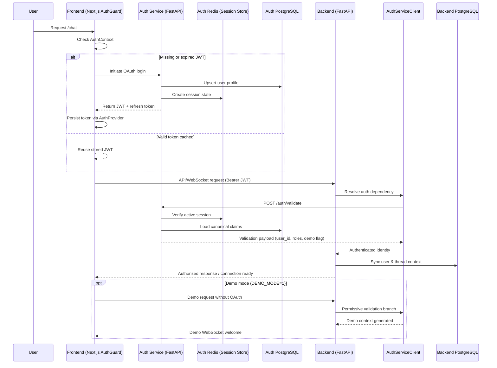
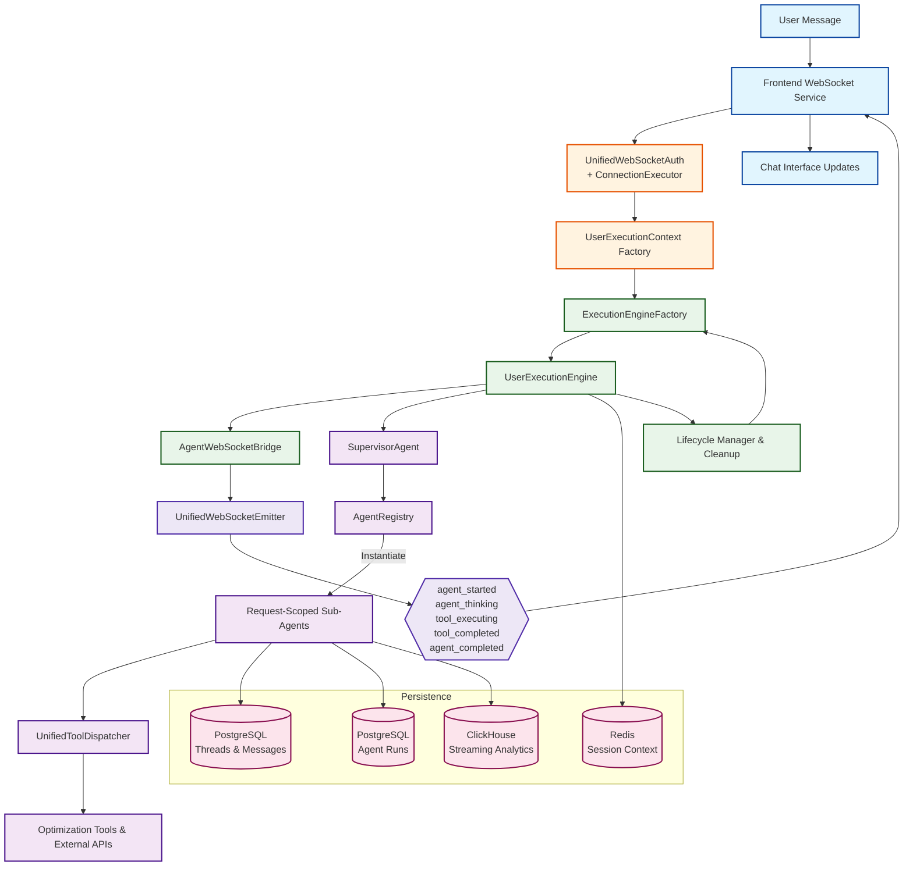

# Netra Apex Architecture - Revenue-Driven Design

## 🔴 CRITICAL: 450-line Module Architecture

**MANDATORY**: Every file ≤300 lines, every function ≤08 lines. No exceptions.

## Table of Contents

1. [Business Architecture](#business-architecture) **← Value Creation Flow**
2. [System Overview](#system-overview)
3. [Architecture Principles](#architecture-principles) **← 300/8 Rule**
4. [Module Architecture](#module-architecture) **← Modular Design**
5. [System Components](#system-components)
6. [Multi-Agent System](#multi-agent-system)
7. [Database Architecture](#database-architecture)
8. [WebSocket Architecture](#websocket-architecture)
9. [Security Architecture](#security-architecture)
10. [Technology Stack](#technology-stack)

## Business Architecture

### Value Creation Pipeline

```
┌─────────────────────────────────────────────────────────────────┐
│                    CUSTOMER VALUE FLOW                          │
│                                                                  │
│  1. Customer AI Spend → 2. Optimization → 3. Savings Capture   │
│       ($100K/mo)           (30% reduction)    (20% fee = $6K)   │
│                                                                  │
│  ┌─────────────┐   ┌─────────────┐   ┌─────────────┐     │
│  │   INTAKE    │→→→│  OPTIMIZE  │→→→│   CAPTURE   │     │
│  │             │   │             │   │             │     │
│  │ - Workload  │   │ - Routing   │   │ - Measure   │     │
│  │ - Volume    │   │ - Caching   │   │ - Report    │     │
│  │ - Patterns  │   │ - Batching  │   │ - Invoice   │     │
│  └─────────────┘   └─────────────┘   └─────────────┘     │
└─────────────────────────────────────────────────────────────────┘
```

### Revenue Architecture by Tier

| Component | Free Tier | Early ($1K-10K) | Mid ($10K-100K) | Enterprise (>$100K) |
|-----------|-----------|-----------------|-----------------|--------------------|
| **API Calls** | 100/hr | 1000/hr | 10000/hr | Unlimited |
| **Models** | Basic | Standard | Advanced | All + Custom |
| **Analytics** | Daily | Real-time | Real-time + ML | Custom Dashboards |
| **Support** | Community | Email | Priority | Dedicated |
| **SLA** | None | 99.5% | 99.9% | 99.99% |
| **Value Capture** | $0 | 20% savings | 20% + platform | Negotiated |

## System Overview

The Netra AI Optimization Platform is a sophisticated, production-ready system designed to optimize AI workloads through intelligent multi-agent analysis. Built with modern microservices principles, it combines real-time WebSocket communication, dual-database architecture, and advanced agent orchestration.

### High-Level Architecture

```
┌─────────────────────────────────────────────────────────────────────┐
│                          Client Layer                                │
│  ┌──────────────┐  ┌──────────────┐  ┌─────────────────────────┐   │
│  │   Browser    │  │  Mobile App  │  │    API Clients          │   │
│  │  (Next.js)   │  │   (Future)   │  │   (Python/JS/Go)        │   │
│  └──────┬───────┘  └──────┬───────┘  └───────────┬─────────────┘   │
└─────────┼──────────────────┼──────────────────────┼─────────────────┘
          │                  │                      │
          ├──────────────────┼──────────────────────┤
          │            WebSocket + REST API          │
          ▼                  ▼                      ▼
┌─────────────────────────────────────────────────────────────────────┐
│                       Application Layer                              │
│  ┌────────────────────────────────────────────────────────────┐     │
│  │                    FastAPI Backend                          │     │
│  │  ┌──────────────┐  ┌──────────────┐  ┌─────────────────┐  │     │
│  │  │   Routes     │  │   Services   │  │   WebSocket     │  │     │
│  │  │  Handlers    │  │   Business   │  │    Manager      │  │     │
│  │  │              │  │    Logic     │  │                 │  │     │
│  │  └──────┬───────┘  └──────┬───────┘  └────────┬────────┘  │     │
│  │         │                  │                   │            │     │
│  │  ┌──────▼──────────────────▼───────────────────▼────────┐  │     │
│  │  │              Multi-Agent System                       │  │     │
│  │  │  ┌────────────┐  ┌─────────────┐  ┌──────────────┐  │  │     │
│  │  │  │ Supervisor │  │ Sub-Agents  │  │ Apex Tools   │  │  │     │
│  │  │  │   Agent    │  │  (5 types)  │  │ (30+ tools)  │  │  │     │
│  │  │  └────────────┘  └─────────────┘  └──────────────┘  │  │     │
│  │  └────────────────────────────────────────────────────────┘  │     │
│  └────────────────────────────────────────────────────────────┘     │
└─────────────────────────────────────────────────────────────────────┘
                               │
┌──────────────────────────────┼─────────────────────────────────────┐
│                        Data Layer                                   │
│  ┌──────────────┐  ┌──────────────┐  ┌──────────────┐            │
│  │  PostgreSQL  │  │  ClickHouse  │  │    Redis     │            │
│  │  (Primary)   │  │  (Analytics) │  │   (Cache)    │            │
│  └──────────────┘  └──────────────┘  └──────────────┘            │
└─────────────────────────────────────────────────────────────────────┘
```

### Mission-Critical Architecture Diagrams

The following Mermaid diagrams visualize the golden-path components that keep "login → real AI response" healthy. Each view
highlights SSOT ownership and shows how the core services collaborate to protect the chat flow that drives 90% of platform
value.

#### Golden Path Service Topology

```mermaid
graph LR
    classDef client fill:#e1f5fe,stroke:#0d47a1,stroke-width:2px
    classDef frontend fill:#fff3e0,stroke:#e65100,stroke-width:2px
    classDef backend fill:#e8f5e9,stroke:#1b5e20,stroke-width:2px
    classDef service fill:#ede7f6,stroke:#512da8,stroke-width:2px
    classDef data fill:#fce4ec,stroke:#880e4f,stroke-width:2px
    classDef observability fill:#e0f7fa,stroke:#006064,stroke-width:2px

    User[End User<br/>Browser/Client]:::client

    subgraph Frontend Service (Next.js)
        UI[Chat UI<br/>AuthGuard + Providers]:::frontend
        APIProxy[API Proxy Routes]:::frontend
        WSClient[WebSocket Service]:::frontend
    end

    subgraph Auth Service (FastAPI)
        OAuth[OAuth Controller]:::service
        JWT[JWT Issuer & Validator]:::service
        SessionMgr[Session Manager]:::service
    end

    subgraph Backend Service (FastAPI)
        HTTPAPI[REST API Routes]:::backend
        WSCore[Unified WebSocket Core]:::backend
        Factory[ExecutionEngineFactory]:::backend
        Engine[UserExecutionEngine]:::backend
        Bridge[AgentWebSocketBridge]:::backend
    end

    subgraph Agent Orchestration
        Supervisor[SupervisorAgent]:::service
        Registry[AgentRegistry]:::service
        Dispatcher[UnifiedToolDispatcher]:::service
        Subagents[Specialized Sub-Agents]:::service
    end

    subgraph Data & State
        Threads[(PostgreSQL<br/>Threads & Messages)]:::data
        Runs[(PostgreSQL<br/>Agent Runs)]:::data
        Analytics[(ClickHouse<br/>Streaming Analytics)]:::data
        Cache[(Redis<br/>Session/Cache)]:::data
        AuthDB[(Auth PostgreSQL)]:::data
        AuthCache[(Auth Redis)]:::data
    end

    subgraph Observability
        Logging[Central Logger]:::observability
        Metrics[Monitoring & Tracing]:::observability
    end

    User --> UI
    UI --> APIProxy
    UI --> WSClient
    APIProxy --> HTTPAPI
    WSClient --> WSCore

    UI --> OAuth
    OAuth --> JWT
    JWT --> SessionMgr
    SessionMgr --> AuthCache
    JWT --> AuthDB
    JWT -- JWT Delivery --> UI

    HTTPAPI --> Factory
    WSCore --> Factory
    Factory --> Engine
    Engine --> Bridge
    Bridge --> Supervisor
    Supervisor --> Registry
    Registry -->|Instantiate| Subagents
    Supervisor --> Dispatcher
    Dispatcher --> Subagents
    Subagents --> Dispatcher

    Engine --> Threads
    Engine --> Runs
    Engine --> Cache
    Subagents --> Analytics

    HTTPAPI --> Threads
    HTTPAPI --> Cache
    HTTPAPI --> Analytics

    Bridge --> WSCore
    WSCore --> WSClient
    WSClient --> UI

    HTTPAPI -.-> Logging
    WSCore -.-> Logging
    OAuth -.-> Logging
    Bridge -.-> Metrics
    Engine -.-> Metrics
    JWT -.-> Metrics
```

**Why it matters**: This map shows the SSOT boundaries that guarantee login, token validation, agent execution, and WebSocket
streaming stay isolated yet coordinated. Breaking any arrow here directly harms the golden path.

#### Authentication & Token Validation Sequence



**Why it matters**: The sequence locks the golden path to a single validation authority. Both REST and WebSocket flows rely on
`AuthServiceClient → Auth Service → Redis/PostgreSQL`, eliminating legacy token shortcuts.

#### Agent Execution & WebSocket Event Pipeline



**Why it matters**: This flow enforces the SSOT factory → engine → bridge pipeline that streams mandatory WebSocket events while
persisting every run. Removing any hop would break agent_started/agent_completed delivery and jeopardize AI response integrity.

## Architecture Principles

### Design Principles

1. **🔴 MODULE-BASED (300/8 RULE)**: **MANDATORY** - Files ≤300 lines, functions ≤08 lines
2. **Revenue-Driven**: Every component must justify business value
3. **Customer Segment Focus**: Design for Free→Paid conversion
4. **Async-First**: Non-blocking I/O for cost efficiency
5. **Event-Driven**: Real-time optimization events
6. **State Persistence**: Never lose customer optimization data
7. **Security by Design**: Enterprise-grade OAuth 2.0, JWT
8. **Observability**: Track every dollar saved
9. **Fault Tolerance**: Zero downtime for paying customers
10. **Ultra Deep Think**: 3x analysis for revenue impact

### Module Architecture Rules

```python
# MANDATORY COMPLIANCE
MAX_FILE_LINES = 300      # Hard limit, no exceptions
MAX_FUNCTION_LINES = 8    # Hard limit, no exceptions

# Module Organization Example
optimization/
├── cost_analyzer.py      # 298 lines
├── model_router.py       # 295 lines
├── cache_optimizer.py    # 289 lines
└── batch_processor.py    # 292 lines

# Function Example (8 lines max)
def calculate_savings(current: float, optimized: float) -> Dict:
    """Calculate customer savings and Netra fee."""
    savings = current - optimized
    percentage = (savings / current) * 100 if current > 0 else 0
    netra_fee = savings * 0.20  # 20% performance fee
    net_benefit = savings - netra_fee
    return {"savings": savings, "percentage": percentage, 
            "fee": netra_fee, "net": net_benefit}
```

### Architectural Patterns

| Pattern | Implementation | Purpose |
|---------|---------------|---------|
| Repository | Database access layer | Abstraction and testability |
| Unit of Work | Transaction management | Data consistency |
| Dependency Injection | FastAPI dependencies | Loose coupling |
| Observer | WebSocket events | Real-time updates |
| Pipeline | Agent orchestration | Sequential processing |
| Factory | Tool creation | Dynamic instantiation |
| Singleton | WebSocket manager | Resource management |
| Circuit Breaker | External API calls | Fault tolerance |

## System Components

### Backend Components

#### 1. FastAPI Application (`app/main.py`)

The core application server with:
- **Automatic startup tasks**: Database migrations, health checks
- **Middleware stack**: CORS, sessions, error handling, request tracing
- **Route registration**: Modular route organization
- **OAuth initialization**: Google OAuth2 setup
- **Lifecycle management**: Startup/shutdown hooks

```python
# Startup sequence
1. Load configuration
2. Initialize databases
3. Run migrations
4. Setup OAuth
5. Register routes
6. Start WebSocket manager
7. Initialize agent system
```

#### 2. Route Handlers (`app/routes/`)

Organized API endpoints:

```
routes/
├── auth/                  # Authentication module
│   └── auth.py           # OAuth, JWT, and dev login endpoints
│   # IMPORTANT: All auth endpoints use app/auth_integration/ for dependencies
├── websockets.py          # WebSocket connections
├── agent_route.py         # Agent execution endpoints  
├── threads_route.py       # Thread management
├── generation.py          # Content generation
├── corpus.py              # Corpus management
├── references.py          # Reference data
├── supply.py              # Supply catalog
├── llm_cache.py           # Cache management
├── synthetic_data.py      # Synthetic data generation
├── synthetic_data_corpus.py # Synthetic corpus management
├── config.py              # Configuration endpoints
├── health.py              # Basic health checks
├── health_extended.py     # Extended health monitoring
├── admin.py               # Admin functions
├── demo.py                # Demo endpoints
├── demo_handlers.py       # Demo request handlers
├── demo_websocket.py      # Demo WebSocket handlers
├── monitoring.py          # System monitoring
├── database_monitoring.py # Database health monitoring
├── circuit_breaker_health.py # Circuit breaker monitoring
├── quality.py             # Quality validation endpoints
├── quality_handlers.py    # Quality processing handlers
├── quality_validators.py  # Quality validation logic
├── quality_validation_utils.py # Quality validation utilities
├── unified_tools.py       # Unified tool interfaces
├── mcp.py                 # MCP (Model Context Protocol) endpoints
├── mcp/                   # MCP module directory
│   ├── main.py           # MCP main router
│   ├── handlers.py       # MCP request handlers
│   ├── models.py         # MCP data models
│   ├── service_factory.py # MCP service factory
│   └── websocket_handler.py # MCP WebSocket handling
└── utils/                 # Route utilities
    ├── circuit_helpers.py # Circuit breaker helpers
    ├── error_handlers.py  # Error handling utilities
    ├── generation_helpers.py # Generation utilities
    ├── health_helpers.py  # Health check helpers
    ├── response_builders.py # Response building utilities
    ├── service_delegates.py # Service delegation
    ├── synthetic_data_helpers.py # Synthetic data utilities
    ├── thread_helpers.py  # Thread management utilities
    ├── validators.py      # Request validators
    └── websocket_helpers.py # WebSocket utilities
```

#### 3. Service Layer (`app/services/`)

Business logic implementation:

```
services/
├── agent_service.py           # Agent orchestration
├── apex_optimizer_agent/      # Optimization tools
│   ├── tool_builder.py       # Dynamic tool creation
│   └── tools/                # 30+ specialized tools
├── database/                  # Repository pattern
│   ├── base_repository.py   # Base CRUD operations
│   ├── thread_repository.py # Thread operations
│   ├── message_repository.py # Message operations
│   └── unit_of_work.py      # Transaction management
├── websocket/                 # Real-time communication
│   ├── message_handler.py   # Message processing
│   └── message_queue.py     # Queue management
├── state/                     # State management
│   ├── state_manager.py     # State operations
│   └── persistence.py       # State persistence
├── cache/                     # Caching services
│   └── llm_cache.py         # LLM response cache
└── core/                      # Core services
    └── service_container.py  # Service registry
```

#### 4. Authentication Integration (`app/auth_integration/`)

**CRITICAL**: Shared authentication service used throughout the entire system:

```
auth_integration/              # SHARED AUTH SERVICE (MANDATORY USE)
├── __init__.py               # Auth exports
└── auth.py                   # Centralized auth dependencies
    ├── get_current_user()    # User authentication (ALL routes MUST use)
    ├── get_current_user_optional() # Optional auth (ALL routes MUST use)
    └── validate_token()      # Token validation (ALL WebSocket MUST use)
```

**IMPORTANT**: ALL authentication MUST go through `app/auth_integration/`. No duplicate auth logic allowed anywhere in the system. This ensures:
- Consistent authentication across all endpoints
- Single source of truth for auth logic
- Centralized security updates
- Uniform error handling

#### 5. Database Models (`app/db/`)

Data persistence layer:

```
db/
├── models_postgres.py     # SQLAlchemy models
│   ├── UserBase          # User accounts
│   ├── Thread            # Conversation threads
│   ├── Message           # Chat messages
│   ├── Run               # Agent executions
│   ├── AgentRun          # Sub-agent runs
│   ├── AgentReport       # Generated reports
│   ├── Reference         # Reference documents
│   └── SupplyCatalog     # Hardware catalog
├── models_clickhouse.py   # ClickHouse models
│   └── WorkloadEvent     # Time-series events
├── postgres.py           # PostgreSQL config
├── clickhouse.py         # ClickHouse config
└── session.py            # Session management
```

### Frontend Components

#### 1. Next.js Application (`frontend/app/`)

Modern React application with:
- **App Router**: File-based routing
- **Server Components**: Improved performance
- **Client Components**: Interactive features
- **API Routes**: Backend proxy

```
app/
├── layout.tsx              # Root layout with providers
├── page.tsx               # Landing page
├── chat/                  # Main chat interface
│   └── page.tsx          # Chat page component
├── auth/                  # Authentication pages
│   ├── callback/         # OAuth callback
│   ├── error/            # Auth errors
│   └── logout/           # Logout handler
├── corpus/               # Corpus management
├── synthetic-data-generation/ # Data generation
├── demo/                 # Demo features
└── enterprise-demo/      # Enterprise demo
```

#### 2. React Components (`frontend/components/`)

Modular component system:

```
components/
├── chat/                    # Chat-specific components
│   ├── ChatHeader.tsx      # Header with controls
│   ├── MessageItem.tsx     # Message display
│   ├── MessageInput.tsx    # Input with controls
│   ├── MessageList.tsx     # Message container
│   ├── ThreadSidebar.tsx   # Thread management
│   ├── ThinkingIndicator.tsx # Agent status
│   └── ExamplePrompts.tsx  # Prompt suggestions
├── ui/                      # Reusable UI (shadcn/ui)
│   ├── button.tsx
│   ├── card.tsx
│   ├── input.tsx
│   └── (30+ components)
├── ChatInterface.tsx        # Main chat wrapper
├── SubAgentStatus.tsx       # Agent indicators
└── ErrorFallback.tsx        # Error boundaries
```

#### 3. State Management (`frontend/store/`)

Zustand-based state:

```typescript
// Chat Store
interface ChatStore {
  messages: Message[];
  currentThread: Thread | null;
  isLoading: boolean;
  addMessage: (message: Message) => void;
  clearMessages: () => void;
  setThread: (thread: Thread) => void;
}

// Auth Store
interface AuthStore {
  user: User | null;
  token: string | null;
  isAuthenticated: boolean;
  login: (credentials: LoginCredentials) => Promise<void>;
  logout: () => void;
}
```

## Data Flow Architecture

### Request Flow

```
1. Client Request
   ├─> Next.js Frontend
   ├─> API Route Handler
   ├─> FastAPI Backend
   ├─> Authentication Middleware
   ├─> Route Handler
   ├─> Service Layer
   ├─> Database Layer
   └─> Response

2. WebSocket Flow
   ├─> WebSocket Connection (JWT auth)
   ├─> WebSocket Manager
   ├─> Message Queue
   ├─> Message Handler
   ├─> Agent System
   ├─> Real-time Updates
   └─> Client Updates
```

### Agent Execution Flow

```
User Message
    │
    ▼
WebSocket Handler
    │
    ├─> Authentication
    ├─> Thread Context
    └─> Message Queue
         │
         ▼
    Supervisor Agent
         │
         ├─> State Recovery
         ├─> Pipeline Setup
         └─> Sequential Execution
              │
              ▼
         ┌────────────┐
         │  Triage    │
         │  SubAgent  │
         └─────┬──────┘
               │
         ┌─────▼──────┐
         │   Data     │
         │  SubAgent  │
         └─────┬──────┘
               │
         ┌─────▼──────────┐
         │ Optimization   │
         │   SubAgent     │
         └─────┬──────────┘
               │
         ┌─────▼──────┐
         │  Actions   │
         │  SubAgent  │
         └─────┬──────┘
               │
         ┌─────▼──────┐
         │ Reporting  │
         │  SubAgent  │
         └─────┬──────┘
               │
               ▼
         Final Report
              │
              ▼
    WebSocket Response
```

## Multi-Agent System

### Agent Architecture

#### Supervisor Agent

The orchestrator with two implementations:

1. **Legacy Supervisor** (`supervisor.py`)
   - Original implementation
   - Basic sequential execution
   - Simple state management

2. **Consolidated Supervisor** (`supervisor_consolidated.py`)
   - Enhanced with hooks system
   - Execution strategies (sequential, parallel, conditional)
   - Advanced retry logic with exponential backoff
   - Comprehensive error handling
   - Pipeline configuration

```python
# Hook System
class SupervisorHooks:
    before_agent: Callable  # Pre-execution hook
    after_agent: Callable   # Post-execution hook
    on_error: Callable      # Error handling hook
    on_retry: Callable      # Retry hook

# Execution Strategies
class ExecutionStrategy(Enum):
    SEQUENTIAL = "sequential"    # One after another
    PARALLEL = "parallel"        # All at once
    CONDITIONAL = "conditional"  # Based on conditions
```

#### Sub-Agents

Five specialized agents with specific responsibilities:

| Agent | Purpose | Key Operations |
|-------|---------|---------------|
| **TriageSubAgent** | Request analysis | Parse intent, determine approach, set parameters |
| **DataSubAgent** | Data collection | Fetch logs, analyze patterns, collect metrics |
| **OptimizationsCoreSubAgent** | Core optimizations | Generate recommendations, calculate savings |
| **ActionsToMeetGoalsSubAgent** | Action planning | Create implementation steps, prioritize actions |
| **ReportingSubAgent** | Report generation | Compile results, format markdown, create summaries |

#### Apex Optimizer Agent

Advanced optimization system with 30+ specialized tools:

```
tools/
├── Cost Analysis
│   ├── cost_analyzer.py
│   ├── cost_driver_identifier.py
│   ├── cost_impact_simulator.py
│   └── cost_reduction_quality_preservation.py
├── Performance Optimization
│   ├── latency_analyzer.py
│   ├── latency_bottleneck_identifier.py
│   ├── function_performance_analyzer.py
│   └── performance_gains_simulator.py
├── Cache Optimization
│   ├── kv_cache_finder.py
│   ├── kv_cache_optimization_audit.py
│   └── cache_policy_optimizer.py
├── Policy Management
│   ├── policy_proposer.py
│   ├── policy_simulator.py
│   └── optimal_policy_proposer.py
└── Reporting
    ├── final_report_generator.py
    └── evaluation_criteria_definer.py
```

### Tool System

#### Tool Dispatcher

Dynamic tool routing:

```python
class ToolDispatcher:
    def __init__(self):
        self.tools = {}
        self._register_tools()
    
    async def dispatch(self, tool_name: str, params: dict):
        if tool_name not in self.tools:
            raise ToolNotFoundError(f"Tool {tool_name} not found")
        
        tool = self.tools[tool_name]
        return await tool.execute(params)
```

#### Tool Registry

Service-based registration:

```python
class ToolRegistry:
    def register(self, name: str, tool: BaseTool):
        """Register a tool for use"""
        self.tools[name] = tool
    
    def get_tool_schema(self, name: str):
        """Get tool input/output schema"""
        return self.tools[name].get_schema()
```

## Database Architecture

### Dual Database System

#### PostgreSQL (Primary)

Transactional data and state:

```sql
-- Core Tables
userbase              -- User accounts and authentication
threads               -- Conversation threads
messages              -- Chat messages
runs                  -- Agent execution runs
thread_runs           -- Thread-run associations
agent_runs            -- Individual agent runs
agent_reports         -- Generated reports
references            -- Reference documents
supply_catalog        -- Hardware/model catalog
user_secrets          -- Encrypted API keys
oauth_secrets         -- OAuth configurations

-- Indexes
idx_threads_user_id   -- User thread lookup
idx_messages_thread   -- Thread messages
idx_runs_status       -- Run status queries
idx_agent_runs_run    -- Agent run lookup
```

#### ClickHouse (Analytics)

Time-series and analytics:

```sql
-- Event Table
CREATE TABLE workload_events (
    timestamp DateTime,
    user_id UInt32,
    event_type String,
    event_data String,
    thread_id String,
    run_id String,
    latency_ms UInt32,
    cost_cents UInt32
) ENGINE = MergeTree()
ORDER BY (user_id, timestamp)
PARTITION BY toYYYYMM(timestamp);

-- Materialized Views
CREATE MATERIALIZED VIEW user_metrics
ENGINE = AggregatingMergeTree()
AS SELECT
    user_id,
    toStartOfHour(timestamp) as hour,
    count() as events,
    avg(latency_ms) as avg_latency,
    sum(cost_cents) as total_cost
FROM workload_events
GROUP BY user_id, hour;
```

#### Redis (Cache & Sessions)

In-memory data store:

```
Keys Structure:
session:{user_id}        -- User sessions
cache:llm:{hash}        -- LLM response cache
ws:conn:{user_id}       -- WebSocket connections
agent:state:{run_id}    -- Agent state
rate:{endpoint}:{ip}    -- Rate limiting
```

### Connection Management

#### Connection Pooling

```python
# PostgreSQL Pool Configuration
SQLALCHEMY_POOL_SIZE = 10
SQLALCHEMY_MAX_OVERFLOW = 20
SQLALCHEMY_POOL_TIMEOUT = 30
SQLALCHEMY_POOL_RECYCLE = 3600

# ClickHouse Pool
CLICKHOUSE_POOL_SIZE = 5
CLICKHOUSE_MAX_CONNECTIONS = 10

# Redis Pool
REDIS_MAX_CONNECTIONS = 50
REDIS_CONNECTION_TIMEOUT = 5
```

## WebSocket Architecture

### WebSocket Manager

Singleton pattern with advanced features:

```python
class WebSocketManager:
    """Manages WebSocket connections with advanced features"""
    
    # Connection Management
    connections: Dict[str, WebSocket]  # User connections
    connection_stats: Dict[str, Stats]  # Statistics
    
    # Heartbeat System
    HEARTBEAT_INTERVAL = 30  # seconds
    HEARTBEAT_TIMEOUT = 60   # seconds
    
    # Retry Logic
    MAX_RETRY_ATTEMPTS = 5
    RETRY_BACKOFF = ExponentialBackoff(base=2, max=32)
    
    # Methods
    async def connect(self, websocket: WebSocket, user_id: str)
    async def disconnect(self, user_id: str)
    async def send_message(self, user_id: str, message: dict)
    async def broadcast(self, message: dict)
    async def heartbeat_loop(self)
```

### Message Types

#### Client to Server

```typescript
interface ClientMessage {
  action: 'start_agent' | 'stop_agent' | 'user_message' | 'ping';
  data: {
    message?: string;
    thread_id?: string;
    run_id?: string;
  };
}
```

#### Server to Client

```typescript
interface ServerMessage {
  type: 'connection_established' | 'agent_started' | 
        'sub_agent_update' | 'tool_call' | 'tool_result' |
        'agent_completed' | 'agent_log' | 'error' | 'heartbeat';
  data: any;
  metadata: {
    thread_id?: string;
    run_id?: string;
    agent_name?: string;
    timestamp: string;
  };
}
```

### Connection Lifecycle

```
1. Connection Request
   └─> JWT validation via query params
   
2. Authentication
   └─> User context establishment
   
3. Connection Establishment
   └─> Add to connection pool
   └─> Start heartbeat
   
4. Message Exchange
   └─> Bidirectional communication
   └─> Message queuing
   
5. Heartbeat Monitoring
   └─> 30s interval pings
   └─> 60s timeout detection
   
6. Error Handling
   └─> Automatic reconnection
   └─> Exponential backoff
   
7. Disconnection
   └─> Clean connection removal
   └─> State persistence
   
8. Cleanup
   └─> Resource deallocation
   └─> Statistics update
```

## Security Architecture

### Authentication & Authorization

#### OAuth 2.0 Integration

```python
# Google OAuth Configuration
oauth = OAuth()
oauth.register(
    name='google',
    client_id=GOOGLE_CLIENT_ID,
    client_secret=GOOGLE_CLIENT_SECRET,
    server_metadata_url=GOOGLE_DISCOVERY_URL,
    client_kwargs={'scope': 'openid email profile'}
)

# Flow
1. User initiates OAuth login
2. Redirect to Google consent
3. Callback with authorization code
4. Exchange code for tokens
5. Fetch user info
6. Create/update user record
7. Issue JWT token
```

#### JWT Token Management

```python
# Token Structure
{
  "sub": "user@example.com",
  "user_id": 123,
  "exp": 1234567890,
  "iat": 1234567800,
  "scope": ["read", "write"]
}

# Token Validation
- Signature verification
- Expiration check
- Scope validation
- User existence check
```

### Data Security

#### Encryption

```python
# Secret Management
- Database passwords: Encrypted at rest
- API keys: Stored in user_secrets table
- OAuth secrets: Encrypted configuration
- JWT secrets: Environment variables

# In-Transit
- HTTPS/WSS for all communications
- TLS 1.3 minimum
- Certificate pinning for mobile
```

#### Access Control

```python
# Role-Based Access
class UserRole(Enum):
    USER = "user"
    ADMIN = "admin"
    DEVELOPER = "developer"

# Permission Checks
@requires_permission("admin")
async def admin_endpoint():
    pass
```

### Security Headers

```python
# Security Middleware
app.add_middleware(
    SecurityHeadersMiddleware,
    headers={
        "X-Content-Type-Options": "nosniff",
        "X-Frame-Options": "DENY",
        "X-XSS-Protection": "1; mode=block",
        "Strict-Transport-Security": "max-age=31536000",
        "Content-Security-Policy": "default-src 'self'"
    }
)
```

## Deployment Architecture

### Container Architecture

```dockerfile
# Multi-stage build
FROM python:3.11-slim AS builder
# Build dependencies

FROM python:3.11-slim AS runtime
# Runtime configuration
```

### Cloud Deployment (GCP)

```
┌─────────────────────────────────────────┐
│          Cloud Load Balancer            │
│              (HTTPS/WSS)                │
└────────────┬───────────┬────────────────┘
             │           │
     ┌───────▼────┐ ┌────▼──────┐
     │ Cloud Run  │ │ Cloud Run │
     │  Frontend  │ │  Backend  │
     │ (3 instances) │ (5 instances) │
     └────────────┘ └───────┬────┘
                            │
              ┌─────────────┼──────────────┐
              │             │              │
     ┌────────▼───┐ ┌───────▼────┐ ┌──────▼─────┐
     │ Cloud SQL  │ │MemoryStore │ │ClickHouse │
     │ PostgreSQL │ │   Redis    │ │ (Optional) │
     └────────────┘ └────────────┘ └────────────┘
```

### Scaling Strategy

#### Horizontal Scaling

```yaml
# Auto-scaling Configuration
autoscaling:
  minReplicas: 2
  maxReplicas: 10
  metrics:
    - type: cpu
      targetUtilization: 70
    - type: memory
      targetUtilization: 80
    - type: custom
      metric: websocket_connections
      targetValue: 100
```

#### Vertical Scaling

```yaml
# Resource Allocation
resources:
  backend:
    cpu: 2
    memory: 4Gi
  frontend:
    cpu: 1
    memory: 2Gi
  database:
    tier: db-custom-2-7680  # 2 vCPU, 7.5GB RAM
```

## Technology Stack

### Backend Technologies

| Category | Technology | Version | Purpose |
|----------|-----------|---------|---------|
| **Framework** | FastAPI | 0.104+ | Async web framework |
| **Language** | Python | 3.11+ | Primary language |
| **Database ORM** | SQLAlchemy | 2.0+ | Database abstraction |
| **Validation** | Pydantic | 2.0+ | Data validation |
| **Authentication** | Authlib | 1.2+ | OAuth integration |
| **WebSocket** | WebSockets | 12.0+ | Real-time communication |
| **Task Queue** | Celery | 5.3+ | Background tasks |
| **Caching** | Redis | 7.0+ | Cache & sessions |
| **Testing** | Pytest | 7.4+ | Test framework |
| **Migration** | Alembic | 1.12+ | Database migrations |

### Frontend Technologies

| Category | Technology | Version | Purpose |
|----------|-----------|---------|---------|
| **Framework** | Next.js | 14.0+ | React framework |
| **Language** | TypeScript | 5.0+ | Type safety |
| **UI Library** | React | 18.2+ | Component library |
| **State** | Zustand | 4.4+ | State management |
| **Styling** | TailwindCSS | 3.3+ | Utility CSS |
| **Components** | shadcn/ui | Latest | UI components |
| **HTTP Client** | Axios | 1.6+ | API calls |
| **WebSocket** | Native WS | - | Real-time updates |
| **Testing** | Jest | 29.7+ | Unit tests |
| **E2E Testing** | Cypress | 13.0+ | Integration tests |

### Infrastructure Technologies

| Category | Technology | Purpose |
|----------|-----------|---------|
| **Container** | Docker | Containerization |
| **Orchestration** | Kubernetes | Container orchestration |
| **Cloud Provider** | GCP | Cloud infrastructure |
| **CDN** | Cloudflare | Content delivery |
| **Monitoring** | Prometheus | Metrics collection |
| **Logging** | ELK Stack | Log aggregation |
| **CI/CD** | GitHub Actions | Automation |
| **IaC** | Terraform | Infrastructure as code |

## Performance Optimizations

### Backend Optimizations

1. **Connection Pooling**: Reuse database connections
2. **Query Optimization**: Indexed queries, pagination
3. **Caching Strategy**: Redis for frequent queries
4. **Async Operations**: Non-blocking I/O throughout
5. **Batch Processing**: Group operations when possible
6. **Lazy Loading**: Load data only when needed

### Frontend Optimizations

1. **Code Splitting**: Dynamic imports for routes
2. **Image Optimization**: Next.js Image component
3. **Bundle Size**: Tree shaking, minification
4. **Caching**: Service worker, browser cache
5. **Lazy Loading**: Intersection Observer for components
6. **Virtual Scrolling**: Large list optimization

### Database Optimizations

1. **Indexing**: Strategic index placement
2. **Query Planning**: EXPLAIN ANALYZE usage
3. **Partitioning**: Time-based partitions for logs
4. **Connection Pooling**: pgBouncer for PostgreSQL
5. **Read Replicas**: Separate read/write operations
6. **Materialized Views**: Pre-computed aggregations

## Monitoring & Observability

### Metrics Collection

```python
# Prometheus Metrics
request_count = Counter('http_requests_total', 'Total HTTP requests')
request_duration = Histogram('http_request_duration_seconds', 'HTTP request duration')
websocket_connections = Gauge('websocket_connections', 'Active WebSocket connections')
agent_executions = Counter('agent_executions_total', 'Total agent executions')
```

### Logging Strategy

```python
# Structured Logging
logger.info("Agent execution started", extra={
    "user_id": user_id,
    "thread_id": thread_id,
    "run_id": run_id,
    "agent": "supervisor",
    "trace_id": trace_id
})
```

### Health Checks

```python
# Health Endpoints
/health           # Basic liveness
/health/ready     # Readiness with dependencies
/health/metrics   # Prometheus metrics
```

## Disaster Recovery

### Backup Strategy

1. **Database Backups**: Daily automated backups
2. **Point-in-Time Recovery**: 7-day retention
3. **Cross-Region Replication**: For critical data
4. **State Snapshots**: Agent state preservation

### Recovery Procedures

1. **RTO Target**: 1 hour
2. **RPO Target**: 15 minutes
3. **Failover Process**: Automated with manual approval
4. **Data Validation**: Integrity checks post-recovery

## Architecture Compliance Requirements

### CRITICAL: 450-line Module Limit

**MANDATORY ENFORCEMENT**: Every file MUST be ≤300 lines. This is strictly enforced:

```bash
# Check architecture compliance
python scripts/check_architecture_compliance.py
```

**Implementation Strategy**:
1. **Plan modules during design phase** - don't code first then split
2. **Split by responsibility** - each module has single purpose
3. **Clear interfaces** - well-defined module boundaries
4. **Testable units** - each module independently testable

### CRITICAL: 25-line Function Limit

**MANDATORY ENFORCEMENT**: ALL functions MUST be ≤8 lines (no exceptions).

**Benefits**:
- **Composability**: Functions can be easily combined
- **Readability**: Each function has single, clear purpose
- **Testability**: Simple functions are easier to test
- **Maintainability**: Easier debugging and modification

**Example Compliance**:
```python
# GOOD: 6 lines, single responsibility
async def validate_user_input(data: dict) -> bool:
    if not data:
        return False
    required_fields = ['email', 'message']
    return all(field in data for field in required_fields)

# BAD: Too many lines, multiple responsibilities
# This would need to be split into multiple functions
```

### Architecture Verification

```bash
# Run compliance check (should be part of CI/CD)
python scripts/check_architecture_compliance.py --fail-on-violation

# Check specific directory with custom limits
python scripts/check_architecture_compliance.py --path app/agents/ --violation-limit 5

# Generate compliance report with all violations
python scripts/check_architecture_compliance.py --show-all

# Generate JSON report for CI/CD
python scripts/check_architecture_compliance.py --json-output compliance.json --fail-on-violation

# Run with text markers (for Windows/CI environments)
python scripts/check_architecture_compliance.py --no-emoji --violation-limit 10
```

### Compliance System Architecture

The compliance system is modularly designed with the following components:

```
scripts/compliance/
├── __init__.py          # Package exports
├── core.py              # Core data structures (Violation, ComplianceResults)
├── orchestrator.py      # ArchitectureEnforcer orchestration
├── reporter.py          # Report generation (273 lines)
├── reporter_stats.py    # Statistics calculation (61 lines)
├── reporter_utils.py    # Utilities & helpers (47 lines)
├── cli.py               # CLI argument handling
├── file_checker.py      # 450-line limit enforcement
├── function_checker.py  # 25-line limit enforcement
├── type_checker.py      # Duplicate type detection
└── stub_checker.py      # Test stub detection
```

**Key Features:**
- **Smart Violation Limits**: Adaptive display based on violation count
- **Severity Prioritization**: High → Medium → Low with visual markers
- **Accurate Statistics**: Detailed counts by type and severity
- **Modular Design**: Each component under 300 lines
- **Type Definition Focus**: Only checks type definitions, not usage

## Future Enhancements

### Planned Features

1. **GraphQL API**: Alternative to REST
2. **gRPC Support**: High-performance communication
3. **Multi-Cloud**: AWS and Azure support
4. **Mobile SDKs**: iOS and Android native
5. **Edge Computing**: CDN-based processing
6. **ML Pipeline**: Integrated training/inference
7. **Federated Learning**: Privacy-preserving ML
8. **Blockchain Integration**: Audit trail

### Scalability Roadmap

1. **Phase 1**: 10K concurrent users
2. **Phase 2**: 100K concurrent users
3. **Phase 3**: 1M concurrent users
4. **Phase 4**: Global distribution

## Conclusion

The Netra Platform architecture represents a modern, scalable, and secure system designed for enterprise AI optimization. With its multi-agent intelligence, real-time capabilities, and robust infrastructure, it provides a solid foundation for current needs while maintaining flexibility for future growth.

---

**Last Updated**: December 2025  
**Document Version**: 2.1  
**Architecture Status**: Production Ready - All Critical Components Operational  
**Compliance Status**: 83.3% SSOT Compliance Achieved  
**Golden Path Status**: FULLY OPERATIONAL  

## Current Architecture Health (2025-12-09)

- **Infrastructure Status**: ✅ All critical systems operational
- **WebSocket Events**: ✅ Full event delivery validated 
- **Agent System**: ✅ Golden pattern implementation complete
- **Database Layer**: ✅ Multi-tier architecture stable
- **Authentication**: ✅ OAuth integration fully functional
- **Business Value Protection**: ✅ $500K+ ARR functionality confirmed