# Service Interactions - Detailed Architecture Guide

> **Purpose**: This document provides comprehensive details on how the three core services (Frontend, Backend, Auth Service) interact with each other, including API patterns, authentication flows, error handling, and real-world scenarios.

## Table of Contents

1. [Service Overview](#service-overview)
2. [Authentication Flow Patterns](#authentication-flow-patterns)
3. [API Interaction Patterns](#api-interaction-patterns)
4. [WebSocket Communication](#websocket-communication)
5. [Database Interactions](#database-interactions)
6. [Error Handling Patterns](#error-handling-patterns)
7. [Real-World Scenarios](#real-world-scenarios)
8. [Performance Considerations](#performance-considerations)
9. [Troubleshooting Guide](#troubleshooting-guide)

---

## Service Overview

### Three-Service Architecture

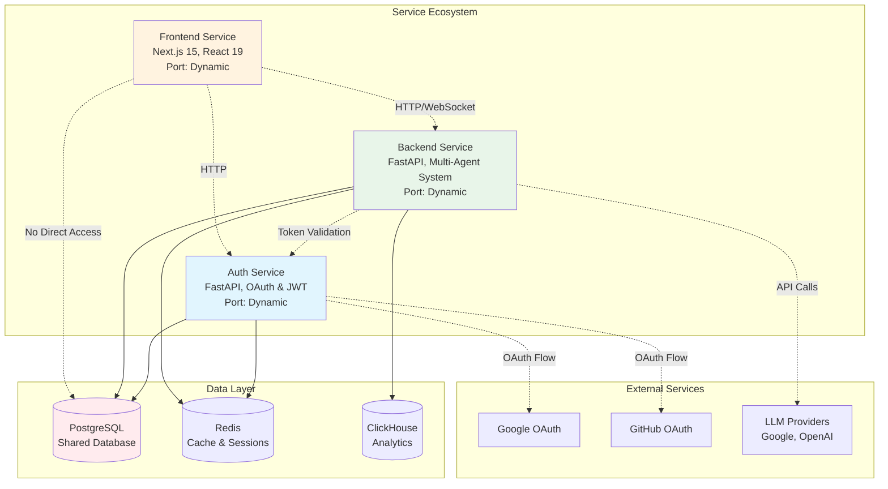

### Service Responsibilities

| Service | Primary Responsibilities | Key Technologies |
|---------|-------------------------|------------------|
| **Frontend** | UI/UX, State Management, Real-time Updates | Next.js, React, TypeScript, WebSocket |
| **Backend** | Business Logic, AI Agents, WebSocket Server | FastAPI, Multi-Agent System, Database ORM |
| **Auth Service** | Authentication, Authorization, User Management | FastAPI, OAuth 2.0, JWT, Session Management |

### Service Independence Principles

**🔹 Zero Code Dependencies**: No service imports code from another service
**🔹 API-First Communication**: All interactions through well-defined APIs
**🔹 Independent Deployment**: Each service can be deployed separately
**🔹 Separate Concerns**: Each service has distinct, non-overlapping responsibilities

---

## Authentication Flow Patterns

### OAuth 2.0 Authentication Flow

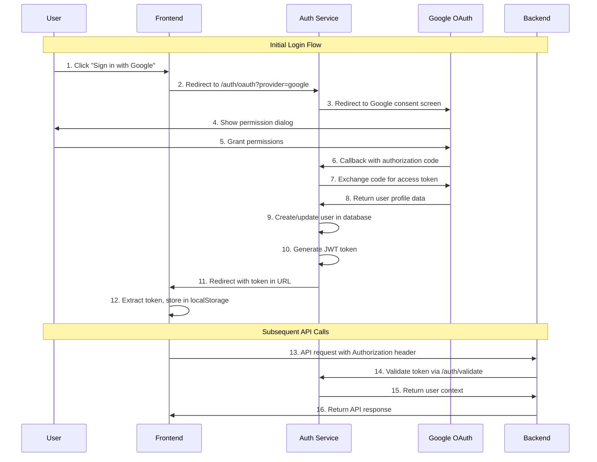

### Token Validation Pattern

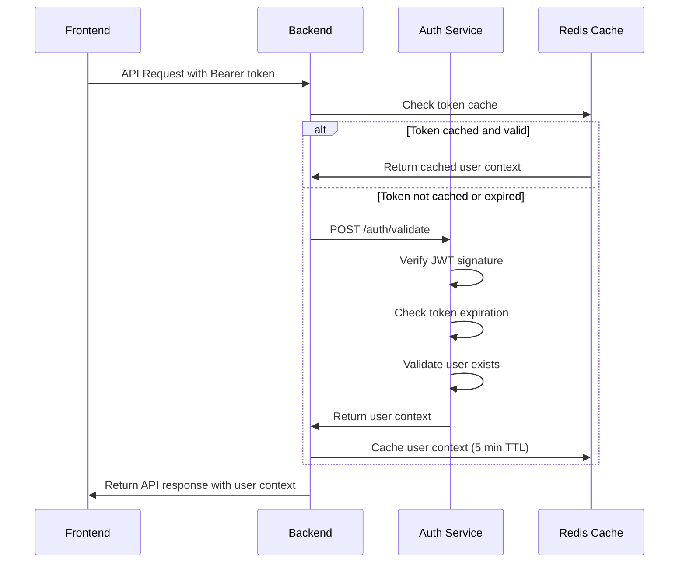

### WebSocket Authentication

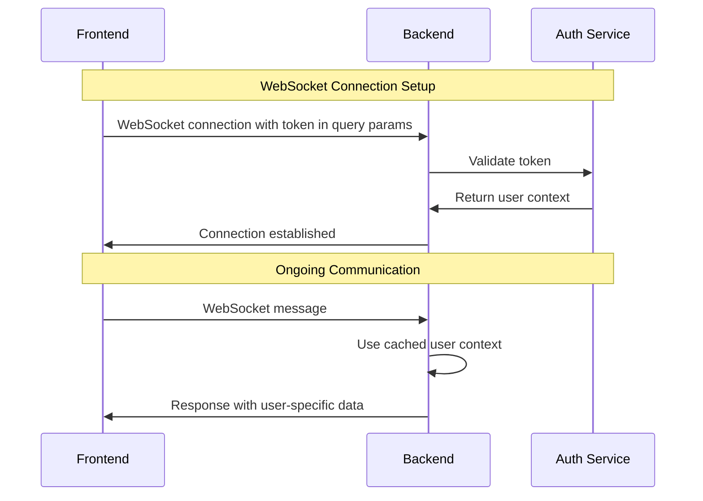

---

## API Interaction Patterns

### RESTful API Patterns

#### Frontend to Backend APIs

```typescript
// Frontend API Client Pattern
class BackendApiClient {
  private baseUrl: string;
  private authToken: string;
  
  constructor(baseUrl: string) {
    this.baseUrl = baseUrl;
    this.authToken = localStorage.getItem('auth_token') || '';
  }
  
  // Standard API call with auth
  async makeRequest(endpoint: string, options: RequestOptions = {}) {
    const headers = {
      'Content-Type': 'application/json',
      'Authorization': `Bearer ${this.authToken}`,
      ...options.headers
    };
    
    const response = await fetch(`${this.baseUrl}${endpoint}`, {
      ...options,
      headers
    });
    
    if (response.status === 401) {
      // Token expired, redirect to login
      window.location.href = '/auth/login';
      return;
    }
    
    return response.json();
  }
}

// Usage examples
const api = new BackendApiClient('http://localhost:8000');

// Thread management
await api.makeRequest('/api/threads', { method: 'GET' });
await api.makeRequest('/api/threads', { 
  method: 'POST', 
  body: JSON.stringify({ title: 'New Thread' })
});

// Agent execution
await api.makeRequest('/api/agent/start', {
  method: 'POST',
  body: JSON.stringify({ 
    message: 'Optimize my AI workload',
    thread_id: 'thread-123'
  })
});
```

#### Backend to Auth Service APIs

```python
# Backend Auth Client Pattern
class AuthServiceClient:
    def __init__(self, auth_service_url: str):
        self.auth_service_url = auth_service_url
        self.session = aiohttp.ClientSession()
    
    async def validate_token(self, token: str) -> Optional[UserContext]:
        """Validate JWT token with Auth Service"""
        try:
            response = await self.session.post(
                f"{self.auth_service_url}/auth/validate",
                json={"token": token},
                timeout=aiohttp.ClientTimeout(total=5)
            )
            
            if response.status == 200:
                data = await response.json()
                return UserContext(
                    user_id=data["user_id"],
                    email=data["email"],
                    permissions=data.get("permissions", [])
                )
        except asyncio.TimeoutError:
            logger.warning("Auth service timeout")
        except Exception as e:
            logger.error(f"Auth validation error: {e}")
        
        return None
    
    async def refresh_token(self, refresh_token: str) -> Optional[TokenPair]:
        """Refresh JWT token"""
        response = await self.session.post(
            f"{self.auth_service_url}/auth/refresh",
            json={"refresh_token": refresh_token}
        )
        
        if response.status == 200:
            data = await response.json()
            return TokenPair(
                access_token=data["access_token"],
                refresh_token=data["refresh_token"]
            )
        return None
```

### API Endpoint Patterns

| Pattern | Frontend → Backend | Backend → Auth Service |
|---------|-------------------|----------------------|
| **Authentication** | Bearer token in headers | Token validation requests |
| **Error Handling** | HTTP status codes + JSON | Standardized error responses |
| **Pagination** | Query parameters | N/A |
| **Real-time** | WebSocket connections | Token validation for WebSocket |
| **File Upload** | Multipart form data | N/A |
| **Caching** | ETag headers | Response caching (5 min TTL) |

---

## WebSocket Communication

### WebSocket Architecture

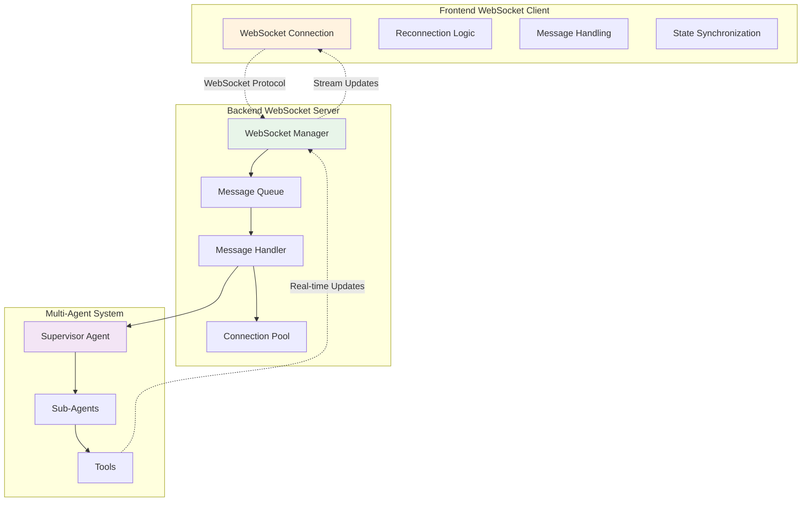

### WebSocket Message Patterns

#### Client to Server Messages

```typescript
// Message Types
interface ClientMessage {
  action: 'start_agent' | 'stop_agent' | 'user_message' | 'ping';
  data: {
    message?: string;
    thread_id?: string;
    run_id?: string;
    parameters?: Record<string, any>;
  };
  timestamp: string;
  client_id: string;
}

// Example Messages
const startAgentMessage: ClientMessage = {
  action: 'start_agent',
  data: {
    message: 'Analyze my AI costs and provide optimization recommendations',
    thread_id: 'thread_abc123',
    parameters: {
      include_performance: true,
      cost_threshold: 1000
    }
  },
  timestamp: new Date().toISOString(),
  client_id: generateClientId()
};
```

#### Server to Client Messages

```typescript
// Server Message Types
interface ServerMessage {
  type: 'connection_established' | 'agent_started' | 'sub_agent_update' | 
        'tool_call' | 'tool_result' | 'agent_completed' | 'agent_log' | 
        'error' | 'heartbeat';
  data: any;
  metadata: {
    thread_id?: string;
    run_id?: string;
    agent_name?: string;
    timestamp: string;
    user_id: string;
  };
}

// Example Server Messages
const agentUpdateMessage: ServerMessage = {
  type: 'sub_agent_update',
  data: {
    agent: 'triage_agent',
    status: 'processing',
    progress: 25,
    message: 'Analyzing workload patterns...',
    preliminary_findings: {
      detected_models: ['gpt-4', 'claude-3'],
      estimated_monthly_cost: 15000
    }
  },
  metadata: {
    thread_id: 'thread_abc123',
    run_id: 'run_xyz789',
    agent_name: 'triage_agent',
    timestamp: new Date().toISOString(),
    user_id: 'user_456'
  }
};
```

### WebSocket Connection Management

```python
# Backend WebSocket Manager
class WebSocketManager:
    def __init__(self):
        self.connections: Dict[str, WebSocket] = {}
        self.connection_stats: Dict[str, ConnectionStats] = {}
        self.heartbeat_task: Optional[asyncio.Task] = None
        
    async def connect(self, websocket: WebSocket, user_id: str) -> bool:
        """Establish WebSocket connection with authentication"""
        try:
            # Authenticate via query parameter
            token = websocket.query_params.get('token')
            if not token:
                await websocket.close(code=1008, reason="No authentication token")
                return False
            
            # Validate token with auth service
            user_context = await self.auth_client.validate_token(token)
            if not user_context:
                await websocket.close(code=1008, reason="Invalid token")
                return False
            
            # Store connection
            self.connections[user_id] = websocket
            self.connection_stats[user_id] = ConnectionStats(
                connected_at=datetime.utcnow(),
                messages_sent=0,
                messages_received=0
            )
            
            # Send connection confirmation
            await self.send_message(user_id, {
                'type': 'connection_established',
                'data': {'user_id': user_id, 'status': 'connected'},
                'metadata': {'timestamp': datetime.utcnow().isoformat()}
            })
            
            # Start heartbeat if not running
            if not self.heartbeat_task:
                self.heartbeat_task = asyncio.create_task(self.heartbeat_loop())
            
            return True
            
        except Exception as e:
            logger.error(f"WebSocket connection error: {e}")
            return False
    
    async def send_message(self, user_id: str, message: dict) -> bool:
        """Send message to specific user"""
        if user_id not in self.connections:
            return False
        
        try:
            websocket = self.connections[user_id]
            await websocket.send_json(message)
            self.connection_stats[user_id].messages_sent += 1
            return True
        except Exception as e:
            logger.error(f"Failed to send message to {user_id}: {e}")
            await self.disconnect(user_id)
            return False
    
    async def heartbeat_loop(self):
        """Maintain WebSocket connections with heartbeat"""
        while self.connections:
            try:
                # Send heartbeat to all connections
                heartbeat_message = {
                    'type': 'heartbeat',
                    'data': {'timestamp': datetime.utcnow().isoformat()}
                }
                
                for user_id in list(self.connections.keys()):
                    await self.send_message(user_id, heartbeat_message)
                
                await asyncio.sleep(30)  # 30 second heartbeat interval
                
            except Exception as e:
                logger.error(f"Heartbeat error: {e}")
                await asyncio.sleep(30)
```

---

## Database Interactions

### Database Access Patterns

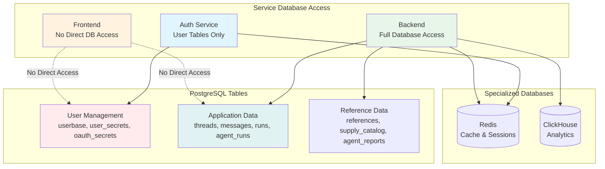

### Data Flow Patterns

#### User Authentication Data

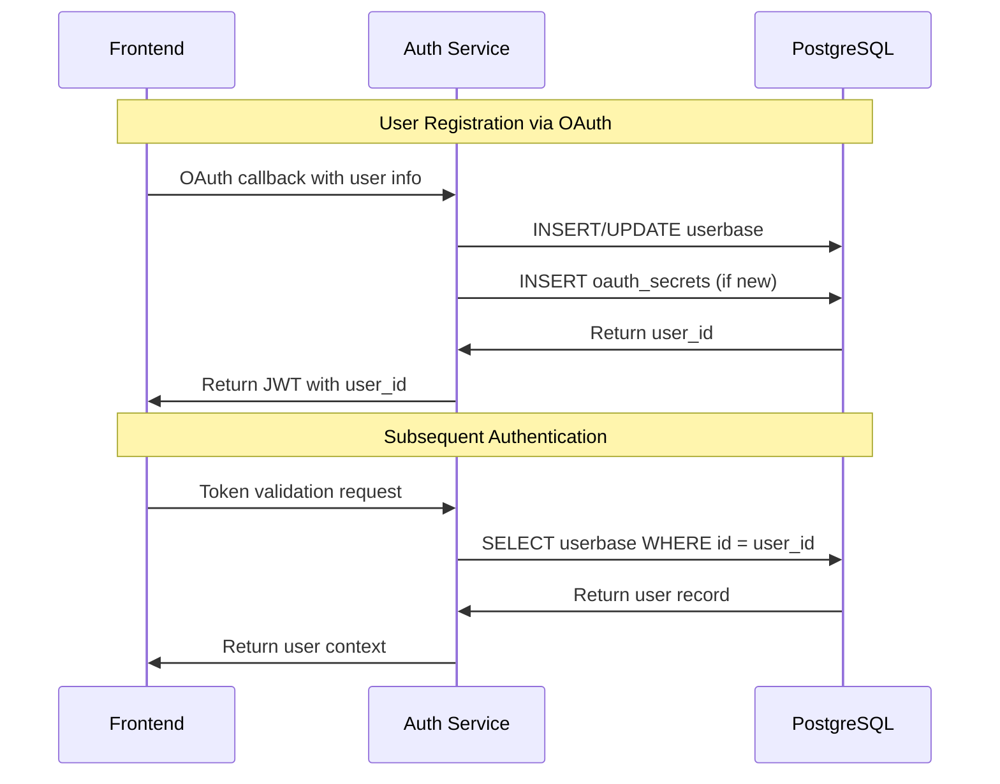

#### Application Data Flow

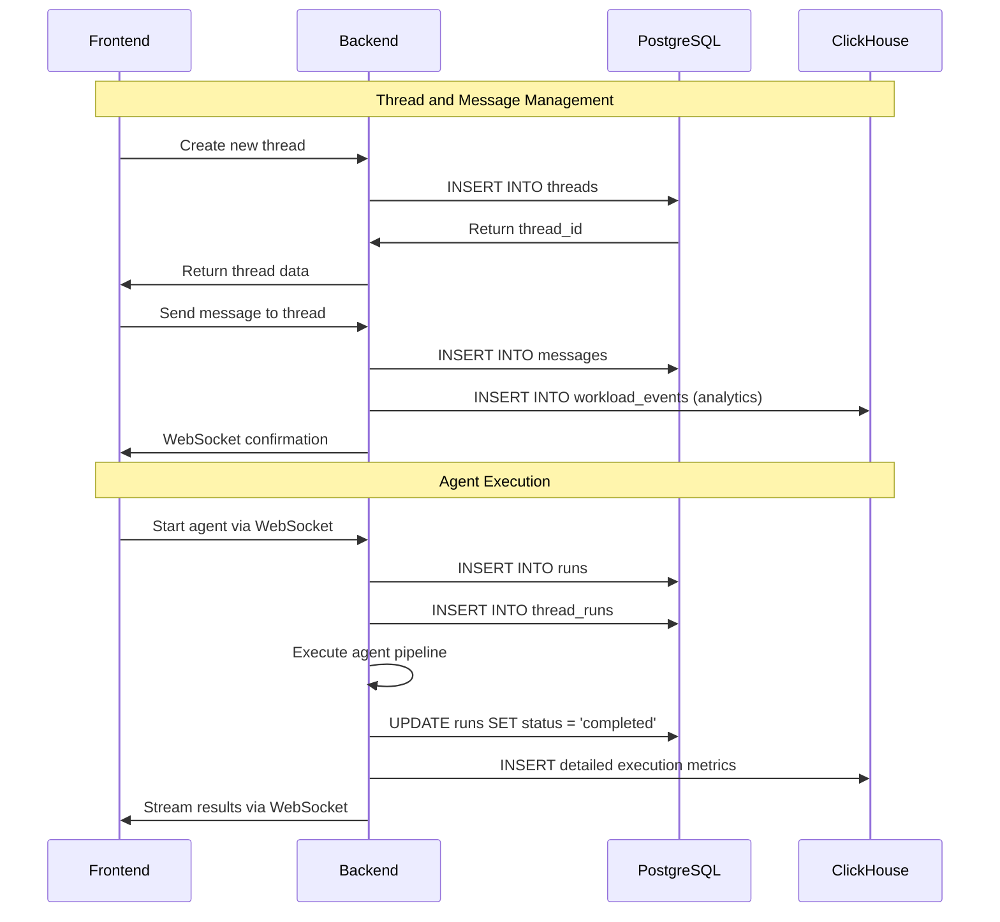

### Database Connection Strategies

```python
# Backend Database Manager
class DatabaseManager:
    def __init__(self):
        self.postgres_engine = None
        self.clickhouse_client = None
        self.redis_client = None
        
    async def initialize(self):
        """Initialize all database connections"""
        # PostgreSQL with connection pooling
        self.postgres_engine = create_async_engine(
            DATABASE_URL,
            poolclass=QueuePool,
            pool_size=10,
            max_overflow=20,
            pool_timeout=30,
            pool_recycle=3600
        )
        
        # ClickHouse client
        self.clickhouse_client = AsyncClickHouseClient(
            host=CLICKHOUSE_HOST,
            port=CLICKHOUSE_PORT,
            database=CLICKHOUSE_DATABASE
        )
        
        # Redis connection pool
        self.redis_client = aioredis.from_url(
            REDIS_URL,
            max_connections=50,
            retry_on_timeout=True
        )
    
    async def get_postgres_session(self):
        """Get PostgreSQL session"""
        async with AsyncSession(self.postgres_engine) as session:
            yield session
    
    async def execute_clickhouse_query(self, query: str, params: dict = None):
        """Execute ClickHouse analytics query"""
        return await self.clickhouse_client.execute(query, params or {})
    
    async def cache_get(self, key: str):
        """Get value from Redis cache"""
        return await self.redis_client.get(key)
    
    async def cache_set(self, key: str, value: str, ttl: int = 300):
        """Set value in Redis cache with TTL"""
        await self.redis_client.setex(key, ttl, value)
```

---

## Error Handling Patterns

### Standardized Error Responses

```typescript
// Common Error Response Format
interface ErrorResponse {
  error: {
    code: string;
    message: string;
    details?: any;
    trace_id?: string;
    timestamp: string;
  };
  status: number;
}

// Error Types by Service
enum ErrorCodes {
  // Authentication Errors (Auth Service)
  AUTH_INVALID_TOKEN = 'AUTH_001',
  AUTH_EXPIRED_TOKEN = 'AUTH_002',
  AUTH_MISSING_TOKEN = 'AUTH_003',
  AUTH_OAUTH_ERROR = 'AUTH_004',
  
  // Business Logic Errors (Backend)
  AGENT_EXECUTION_FAILED = 'BACKEND_001',
  INVALID_THREAD_ID = 'BACKEND_002',
  RATE_LIMIT_EXCEEDED = 'BACKEND_003',
  WEBSOCKET_CONNECTION_FAILED = 'BACKEND_004',
  
  // System Errors (All Services)
  DATABASE_CONNECTION_ERROR = 'SYS_001',
  EXTERNAL_SERVICE_UNAVAILABLE = 'SYS_002',
  INTERNAL_SERVER_ERROR = 'SYS_003'
}
```

### Service-Specific Error Handling

#### Frontend Error Handling

```typescript
// Frontend Error Handler
class ErrorHandler {
  static async handleApiError(error: any, context: string) {
    const errorResponse: ErrorResponse = error.response?.data;
    
    switch (errorResponse?.error?.code) {
      case 'AUTH_001':
      case 'AUTH_002':
      case 'AUTH_003':
        // Redirect to login
        window.location.href = '/auth/login';
        break;
        
      case 'BACKEND_003': // Rate limit
        toast.error('Too many requests. Please wait a moment.');
        break;
        
      case 'BACKEND_004': // WebSocket error
        // Attempt reconnection
        await this.reconnectWebSocket();
        break;
        
      case 'SYS_002': // External service unavailable
        toast.warning('Some features may be temporarily unavailable.');
        break;
        
      default:
        // Generic error handling
        toast.error('An unexpected error occurred. Please try again.');
        console.error(`Error in ${context}:`, errorResponse);
    }
  }
  
  static async reconnectWebSocket(maxAttempts: number = 3) {
    for (let attempt = 1; attempt <= maxAttempts; attempt++) {
      try {
        await websocketClient.connect();
        return;
      } catch (error) {
        console.warn(`WebSocket reconnection attempt ${attempt} failed`);
        await new Promise(resolve => setTimeout(resolve, 1000 * attempt));
      }
    }
    
    toast.error('Unable to establish real-time connection. Please refresh the page.');
  }
}
```

#### Backend Circuit Breaker Pattern

```python
# Backend Circuit Breaker for External Services
class CircuitBreaker:
    def __init__(self, failure_threshold: int = 5, timeout: int = 60):
        self.failure_threshold = failure_threshold
        self.timeout = timeout
        self.failure_count = 0
        self.last_failure_time: Optional[datetime] = None
        self.state = 'closed'  # closed, open, half-open
    
    async def call(self, func, *args, **kwargs):
        """Execute function with circuit breaker protection"""
        if self.state == 'open':
            if self._should_attempt_reset():
                self.state = 'half-open'
            else:
                raise CircuitBreakerOpenError("Service unavailable")
        
        try:
            result = await func(*args, **kwargs)
            self._on_success()
            return result
        except Exception as e:
            self._on_failure()
            raise
    
    def _should_attempt_reset(self) -> bool:
        if not self.last_failure_time:
            return True
        return (datetime.utcnow() - self.last_failure_time).seconds > self.timeout
    
    def _on_success(self):
        self.failure_count = 0
        self.state = 'closed'
    
    def _on_failure(self):
        self.failure_count += 1
        self.last_failure_time = datetime.utcnow()
        
        if self.failure_count >= self.failure_threshold:
            self.state = 'open'

# Usage with Auth Service calls
auth_circuit_breaker = CircuitBreaker()

async def validate_token_with_circuit_breaker(token: str):
    try:
        return await auth_circuit_breaker.call(
            auth_service_client.validate_token, 
            token
        )
    except CircuitBreakerOpenError:
        # Fallback to local token validation (limited)
        return await local_token_validator.validate(token)
```

---

## Real-World Scenarios

### Scenario 1: New User Registration & First Optimization

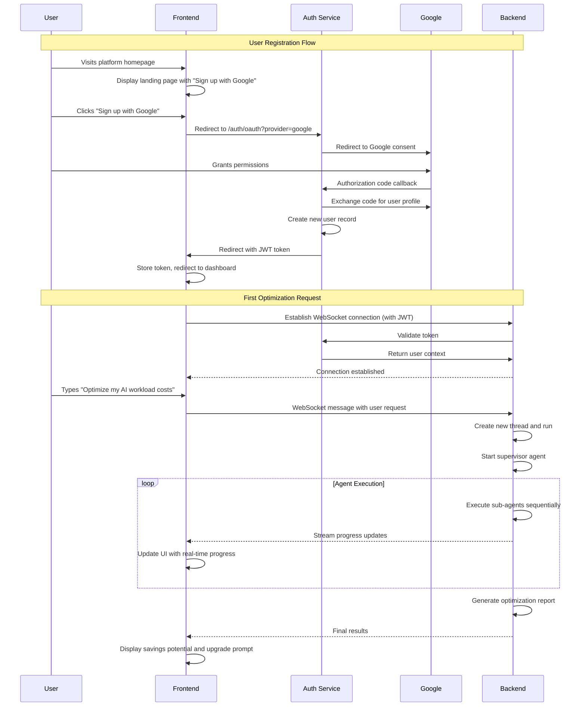

### Scenario 2: Enterprise Customer with API Integration

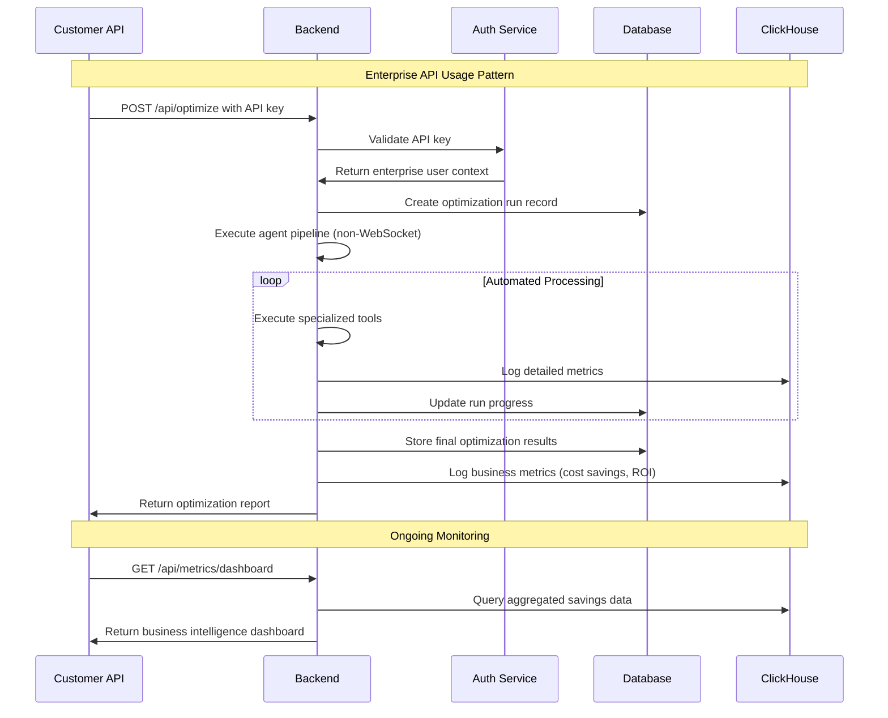

### Scenario 3: Error Recovery and Graceful Degradation

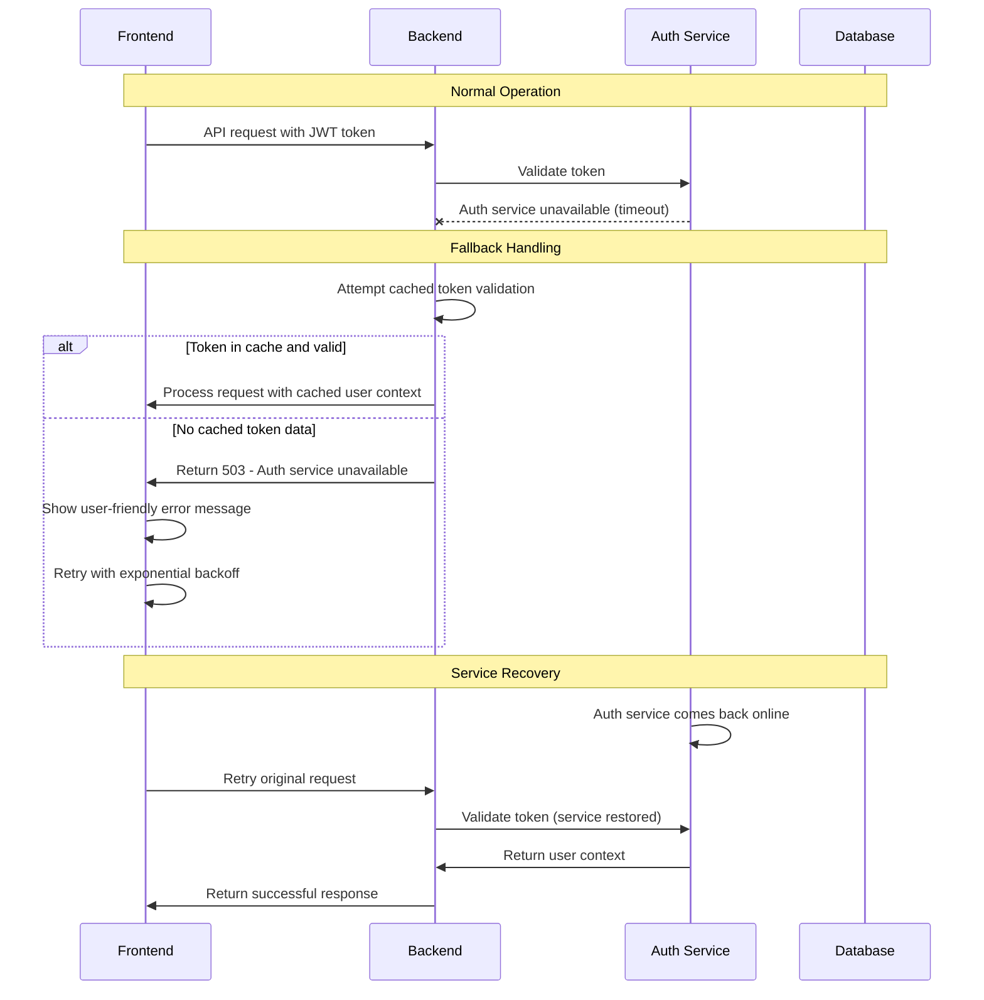

---

## Performance Considerations

### Service Communication Optimization

| Pattern | Implementation | Performance Impact |
|---------|---------------|--------------------|
| **Token Caching** | 5-minute Redis TTL for validated tokens | 95% reduction in auth service calls |
| **Connection Pooling** | 10 connections per database, 20 max overflow | Reduced connection overhead |
| **WebSocket Reuse** | Single persistent connection per user | Eliminates connection handshake cost |
| **Request Batching** | Batch analytics writes to ClickHouse | 80% reduction in database writes |
| **Circuit Breaker** | Fail fast when services are down | Prevents cascade failures |

### Performance Benchmarks

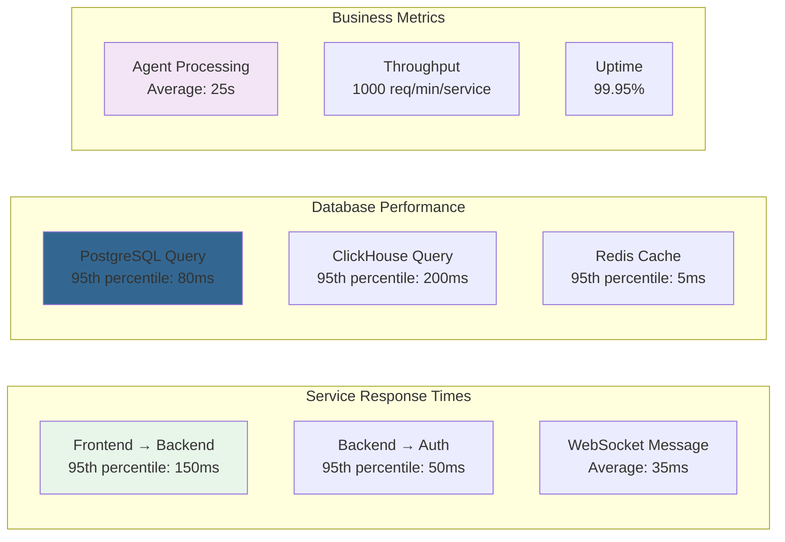

### Optimization Strategies

1. **Request Optimization**
   ```python
   # Use connection reuse
   async with aiohttp.ClientSession() as session:
       # Multiple requests reuse connection
       await session.post('/api/endpoint1')
       await session.post('/api/endpoint2')
   ```

2. **Database Query Optimization**
   ```sql
   -- Use proper indexing
   CREATE INDEX CONCURRENTLY idx_threads_user_created 
   ON threads(user_id, created_at);
   
   -- Efficient pagination
   SELECT * FROM messages 
   WHERE thread_id = $1 AND created_at > $2
   ORDER BY created_at 
   LIMIT 20;
   ```

3. **Caching Strategy**
   ```python
   # Multi-layer caching
   @cache(ttl=300)  # 5 minutes
   async def get_user_permissions(user_id: str):
       # Expensive permission calculation
       return await calculate_user_permissions(user_id)
   ```

---

## Troubleshooting Guide

### Common Service Communication Issues

| Issue | Symptoms | Root Cause | Solution |
|-------|----------|------------|----------|
| **401 Unauthorized** | Frontend requests fail with 401 | Expired/invalid JWT token | Clear localStorage, redirect to login |
| **503 Service Unavailable** | Backend can't reach Auth Service | Network issues, auth service down | Check service health, enable circuit breaker |
| **WebSocket Connection Drops** | Real-time updates stop working | Token expiration, network issues | Implement reconnection with fresh token |
| **Slow API Responses** | Frontend feels sluggish | Database query performance | Check query plans, add indexes |
| **CORS Errors** | Browser blocks requests | Misconfigured CORS settings | Update CORS origins for environment |

### Debugging Service Interactions

#### 1. Authentication Issues

```bash
# Test auth service directly
curl -X POST http://auth-service/auth/validate \
  -H "Content-Type: application/json" \
  -d '{"token": "your-jwt-token"}'

# Check token expiration
echo "your-jwt-token" | base64 -d | jq '.exp'
```

#### 2. WebSocket Issues

```javascript
// Frontend WebSocket debugging
const ws = new WebSocket('ws://backend/ws?token=your-token');

ws.onopen = () => console.log('Connected');
ws.onerror = (error) => console.error('WebSocket error:', error);
ws.onclose = (event) => console.log('Closed:', event.code, event.reason);

// Send test message
ws.send(JSON.stringify({
  action: 'ping',
  data: {},
  timestamp: new Date().toISOString()
}));
```

#### 3. Service Health Monitoring

```python
# Health check endpoints
async def check_service_health():
    checks = {
        'backend': await health_check('http://backend/health'),
        'auth': await health_check('http://auth-service/health'),
        'database': await check_database_connection(),
        'redis': await check_redis_connection()
    }
    
    return {
        'status': 'healthy' if all(checks.values()) else 'degraded',
        'checks': checks,
        'timestamp': datetime.utcnow().isoformat()
    }
```

### Performance Debugging

#### 1. Slow Database Queries

```sql
-- PostgreSQL: Find slow queries
SELECT query, mean_time, calls, total_time
FROM pg_stat_statements
ORDER BY mean_time DESC
LIMIT 10;

-- Add query logging
SET log_min_duration_statement = 1000; -- Log queries > 1s
```

#### 2. Service Response Time Analysis

```python
# Add timing middleware
import time
from starlette.middleware.base import BaseHTTPMiddleware

class TimingMiddleware(BaseHTTPMiddleware):
    async def dispatch(self, request, call_next):
        start_time = time.time()
        response = await call_next(request)
        process_time = time.time() - start_time
        
        response.headers["X-Process-Time"] = str(process_time)
        
        # Log slow requests
        if process_time > 1.0:
            logger.warning(f"Slow request: {request.url.path} took {process_time:.2f}s")
        
        return response
```

#### 3. Memory and Resource Monitoring

```python
# Resource monitoring
import psutil
import asyncio

async def monitor_resources():
    while True:
        memory = psutil.virtual_memory()
        cpu = psutil.cpu_percent(interval=1)
        
        if memory.percent > 80:
            logger.warning(f"High memory usage: {memory.percent}%")
        
        if cpu > 80:
            logger.warning(f"High CPU usage: {cpu}%")
        
        await asyncio.sleep(60)  # Check every minute
```

---

## Summary

This comprehensive guide covers the detailed interaction patterns between the three core services of the Netra Apex platform. Key takeaways:

**🔹 Service Independence**: Each service has clear boundaries and responsibilities
**🔹 Robust Communication**: Multiple communication patterns with fallbacks
**🔹 Performance Optimization**: Caching, pooling, and circuit breakers for reliability
**🔹 Error Resilience**: Comprehensive error handling and recovery mechanisms
**🔹 Real-time Capabilities**: WebSocket-based streaming for live updates

For additional details on specific aspects, refer to:
- [System Architecture Overview](../SYSTEM_ARCHITECTURE_OVERVIEW.md)
- [Authentication Security](../auth/AUTHENTICATION_SECURITY.md)
- [WebSocket Implementation](../WEBSOCKET_IMPLEMENTATION_GUIDE.md)
- [Database Schema](DATABASE_SCHEMA.md)

---

**Last Updated**: January 2025  
**Document Version**: 1.0  
**Maintained By**: Netra Platform Architecture Team