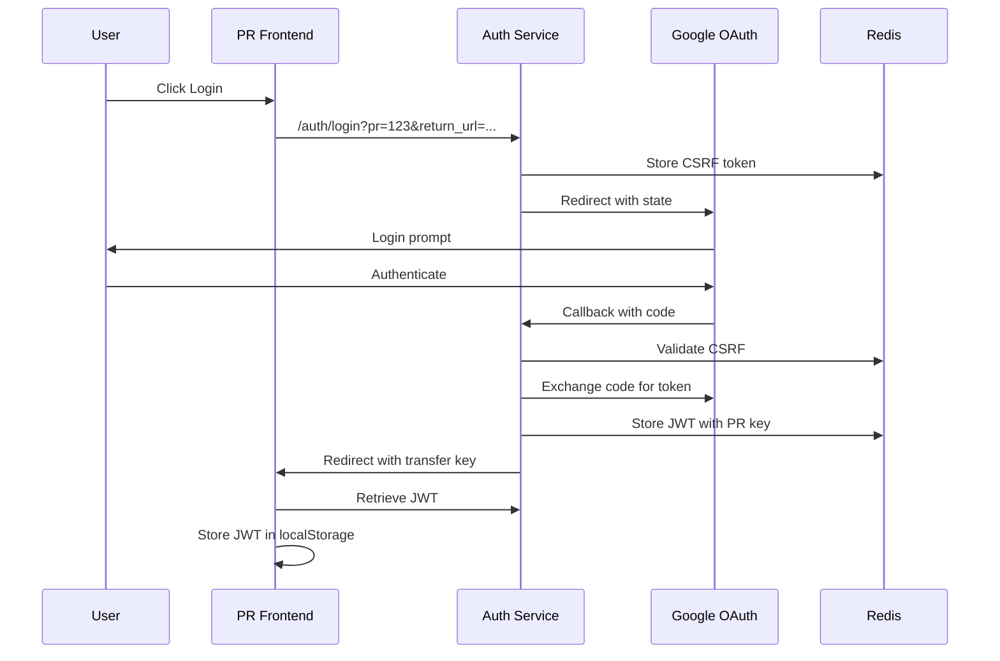

# Auth Subdomain Implementation Guide

## Overview

This document provides comprehensive guidance for implementing and deploying the auth subdomain architecture across all environments. The auth subdomain handles all OAuth authentication flows, especially for dynamic PR staging environments.

## Architecture Overview

### Core Components

1. **Auth Service** (`auth.{domain}`)
   - Dedicated FastAPI service for authentication
   - Handles OAuth flows for all environments
   - Manages JWT token generation and validation
   - Provides PR environment proxy capabilities

2. **Environment Domains**
   - Development: `localhost:8001`
   - Testing: `auth.test.local`
   - Staging: `auth.staging.netrasystems.ai`
   - Production: `auth.netrasystems.ai`

3. **OAuth Proxy for PR Environments**
   - Single callback URL for unlimited PR environments
   - State-based routing to correct PR instance
   - Redis-backed session management

## Development Setup

### Local Development

1. **Start Auth Service**
```bash
# Terminal 1: Auth Service (port 8001)
cd netra-core-generation-1
uvicorn app.auth.auth_service:app --host 0.0.0.0 --port 8001 --reload

# Terminal 2: Main API (port 8000)
uvicorn app.main:app --host 0.0.0.0 --port 8000 --reload

# Terminal 3: Frontend (port 3000)
cd frontend
npm run dev
```

2. **Environment Variables**
```bash
# .env.development
ENVIRONMENT=development
AUTH_SERVICE_PORT=8001
GOOGLE_OAUTH_CLIENT_ID_DEV=your-dev-client-id
GOOGLE_OAUTH_CLIENT_SECRET_DEV=your-dev-secret
JWT_SECRET_KEY=dev-jwt-secret-key
REDIS_URL=redis://localhost:6379
CORS_ALLOWED_ORIGINS=http://localhost:3000,http://localhost:8000,http://localhost:8001
```

3. **Configure Google OAuth**
   - Go to [Google Cloud Console](https://console.cloud.google.com)
   - Create OAuth 2.0 Client ID
   - Add redirect URI: `http://localhost:8001/auth/callback`
   - Add JavaScript origins: `http://localhost:3000`, `http://localhost:8000`, `http://localhost:8001`

### Docker Development

```yaml
# docker-compose.yml
version: '3.8'
services:
  auth:
    build: .
    command: uvicorn app.auth.auth_service:app --host 0.0.0.0 --port 8001
    ports:
      - "8001:8001"
    environment:
      - ENVIRONMENT=development
    volumes:
      - ./app:/app
    depends_on:
      - redis
  
  redis:
    image: redis:7-alpine
    ports:
      - "6379:6379"
```

## Configuration Management

### Environment Detection

The auth service automatically detects the environment based on:

1. **Environment Variables**
   - `ENVIRONMENT` variable (explicit)
   - `K_SERVICE` (Cloud Run detection)
   - `PR_NUMBER` (PR environment detection)

2. **Detection Logic**
```python
# app/auth/environment_config.py
def _detect_environment(self) -> Environment:
    if os.getenv("TESTING"):
        return Environment.TESTING
    
    # Cloud Run detection
    if os.getenv("K_SERVICE"):
        if "staging" in os.getenv("K_SERVICE", "").lower():
            return Environment.STAGING
        return Environment.PRODUCTION
    
    # Default to environment variable
    return Environment(os.getenv("ENVIRONMENT", "development"))
```

### OAuth Configuration Per Environment

Each environment uses separate OAuth clients:

| Environment | Client ID Env Var | Redirect URI |
|------------|------------------|--------------|
| Development | `GOOGLE_OAUTH_CLIENT_ID_DEV` | `http://localhost:8001/auth/callback` |
| Testing | `GOOGLE_OAUTH_CLIENT_ID_TEST` | `https://auth.test.local/auth/callback` |
| Staging | `GOOGLE_OAUTH_CLIENT_ID_STAGING` | `https://auth.staging.netrasystems.ai/auth/callback` |
| Production | `GOOGLE_OAUTH_CLIENT_ID_PROD` | `https://auth.netrasystems.ai/auth/callback` |

## PR Environment Flow

### 1. PR Deployment

When a PR is created:

```yaml
# .github/workflows/pr-deploy.yml
- name: Deploy PR Environment
  env:
    PR_NUMBER: ${{ github.event.pull_request.number }}
  run: |
    gcloud run deploy pr-$PR_NUMBER \
      --image gcr.io/project/netra:pr-$PR_NUMBER \
      --set-env-vars PR_NUMBER=$PR_NUMBER,ENVIRONMENT=staging \
      --allow-unauthenticated
```

### 2. OAuth Flow for PR Environments



### 3. State Encoding

The OAuth state parameter encodes:

```json
{
  "pr_number": "123",
  "return_url": "https://pr-123.staging.netrasystems.ai",
  "csrf_token": "secure-random-token",
  "timestamp": 1692345678
}
```

## API Endpoints

### Auth Service Endpoints

| Endpoint | Method | Description |
|----------|--------|-------------|
| `/auth/login` | GET | Initiate OAuth flow |
| `/auth/callback` | GET | Handle OAuth callback |
| `/auth/token` | POST | Exchange code for JWT |
| `/auth/logout` | POST | Revoke tokens |
| `/auth/status` | GET | Service health check |
| `/auth/config` | GET | Frontend configuration |
| `/auth/proxy/initiate` | GET | PR OAuth initiation |
| `/auth/proxy/complete` | POST | Complete PR OAuth |

### Frontend Configuration Endpoint

```json
GET /auth/config

{
  "environment": "staging",
  "google_client_id": "xxx.apps.googleusercontent.com",
  "auth_url": "https://auth.staging.netrasystems.ai",
  "api_url": "https://api.staging.netrasystems.ai",
  "allow_dev_login": false,
  "pr_number": "123",
  "use_proxy": true
}
```

## Security Implementation

### CSRF Protection

```python
# Generate CSRF token
csrf_token = secrets.token_urlsafe(32)

# Store in Redis with TTL
await redis.setex(f"csrf:{pr_number}:{csrf_token}", 300, "valid")

# Validate on callback
if not await redis.get(f"csrf:{pr_number}:{csrf_token}"):
    raise HTTPException(400, "Invalid CSRF token")

# Delete after validation (single use)
await redis.delete(f"csrf:{pr_number}:{csrf_token}")
```

### JWT Token Security

```python
# Token generation
payload = {
    "sub": user_id,
    "email": user_email,
    "exp": datetime.utcnow() + timedelta(hours=1),
    "iat": datetime.utcnow(),
    "environment": environment,
    "pr_number": pr_number
}

token = jwt.encode(payload, JWT_SECRET_KEY, algorithm="HS256")
```

### Cookie Security

```python
response.set_cookie(
    key="auth_token",
    value=token,
    max_age=3600,  # 1 hour
    secure=True,    # HTTPS only
    httponly=True,  # No JS access
    samesite="strict",  # CSRF protection
    domain=".netrasystems.ai"  # Subdomain access
)
```

## Deployment

### Cloud Run Deployment

```bash
# Build and push image
docker build -t gcr.io/netra-systems/auth-service:latest .
docker push gcr.io/netra-systems/auth-service:latest

# Deploy to staging
gcloud run deploy auth \
  --image gcr.io/netra-systems/auth-service:latest \
  --platform managed \
  --region us-central1 \
  --allow-unauthenticated \
  --set-env-vars ENVIRONMENT=staging \
  --set-secrets "GOOGLE_OAUTH_CLIENT_SECRET_STAGING=oauth-secret-staging:latest"

# Map custom domain
gcloud run domain-mappings create \
  --service auth \
  --domain auth.staging.netrasystems.ai \
  --region us-central1
```

### Terraform Configuration

```hcl
# terraform-gcp/modules/auth-service/main.tf
resource "google_cloud_run_service" "auth_service" {
  name     = "auth-${var.environment}"
  location = var.region

  template {
    spec {
      containers {
        image = "gcr.io/${var.project_id}/auth-service:${var.image_tag}"
        
        env {
          name  = "ENVIRONMENT"
          value = var.environment
        }
        
        env {
          name = "GOOGLE_OAUTH_CLIENT_ID_${upper(var.environment)}"
          value_from {
            secret_key_ref {
              name = google_secret_manager_secret.oauth_client_id.secret_id
              key  = "latest"
            }
          }
        }
      }
    }
  }
}

resource "google_cloud_run_domain_mapping" "auth_domain" {
  location = var.region
  name     = "auth.${var.domain}"

  metadata {
    namespace = var.project_id
  }

  spec {
    route_name = google_cloud_run_service.auth_service.name
  }
}
```

## Monitoring and Observability

### Key Metrics

```python
# Prometheus metrics
from prometheus_client import Counter, Histogram, Gauge

auth_requests = Counter('auth_requests_total', 'Total auth requests', ['environment', 'status'])
auth_latency = Histogram('auth_latency_seconds', 'Auth request latency')
active_sessions = Gauge('active_sessions', 'Number of active sessions', ['environment'])

# Track metrics
auth_requests.labels(environment='staging', status='success').inc()
```

### Logging

```python
import structlog

logger = structlog.get_logger()

logger.info("auth_initiated", 
    user_email=email,
    environment=environment,
    pr_number=pr_number
)

logger.error("auth_failed",
    reason=str(error),
    environment=environment
)
```

### Health Checks

```python
@router.get("/auth/health")
async def health_check():
    checks = {
        "service": "healthy",
        "redis": await check_redis(),
        "oauth": check_oauth_config()
    }
    
    status = all(checks.values())
    return JSONResponse(
        status_code=200 if status else 503,
        content={"status": "healthy" if status else "unhealthy", "checks": checks}
    )
```

## Testing

### Unit Tests

```python
# tests/unit/test_auth_service.py
import pytest
from netra_backend.app.auth.auth_service import encode_state, decode_state

def test_state_encoding():
    state_data = {
        "pr_number": "123",
        "return_url": "https://example.com",
        "csrf_token": "test-token"
    }
    
    encoded = encode_state(state_data)
    decoded = decode_state(encoded)
    
    assert decoded["pr_number"] == "123"
    assert decoded["return_url"] == "https://example.com"
```

### Integration Tests

```python
# tests/integration/test_oauth_flow.py
@pytest.mark.asyncio
async def test_oauth_flow(client, mock_google_oauth):
    # Initiate OAuth
    response = await client.get("/auth/login?pr=123")
    assert response.status_code == 302
    
    # Extract state
    location = response.headers["location"]
    state = parse_qs(urlparse(location).query)["state"][0]
    
    # Simulate callback
    response = await client.get(f"/auth/callback?code=test-code&state={state}")
    assert response.status_code == 302
```

### E2E Tests

```javascript
// tests/e2e/auth.spec.js
describe('OAuth Authentication', () => {
  it('should complete OAuth flow', async () => {
    await page.goto('https://pr-123.staging.netrasystems.ai')
    await page.click('[data-testid="login-button"]')
    
    // Handle Google OAuth (mocked in test env)
    await page.waitForURL('**/auth/callback')
    
    // Verify logged in state
    await expect(page.locator('[data-testid="user-menu"]')).toBeVisible()
  })
})
```

## Troubleshooting

### Common Issues

1. **CORS Errors**
   - Verify `CORS_ALLOWED_ORIGINS` includes all necessary domains
   - Check that credentials are included in requests

2. **OAuth Callback Failures**
   - Ensure redirect URIs match exactly in Google Console
   - Check that state parameter hasn't expired (5-minute TTL)

3. **PR Environment Auth Issues**
   - Verify `PR_NUMBER` environment variable is set
   - Check Redis connectivity for session storage
   - Ensure auth subdomain is accessible

4. **Token Validation Errors**
   - Verify JWT secret key matches across services
   - Check token expiration times
   - Ensure clock synchronization between services

### Debug Mode

Enable debug logging:

```python
# app/auth/auth_service.py
import logging
logging.basicConfig(level=logging.DEBUG)

# Or via environment variable
DEBUG=true uvicorn app.auth.auth_service:app
```

## Migration Checklist

- [ ] Create OAuth clients in Google Console for each environment
- [ ] Configure redirect URIs for auth subdomains
- [ ] Store OAuth credentials in Secret Manager
- [ ] Deploy auth service to each environment
- [ ] Configure DNS for auth subdomains
- [ ] Update frontend to use auth service
- [ ] Update API authentication middleware
- [ ] Test OAuth flow in each environment
- [ ] Test PR environment authentication
- [ ] Monitor authentication metrics
- [ ] Document runbooks and procedures