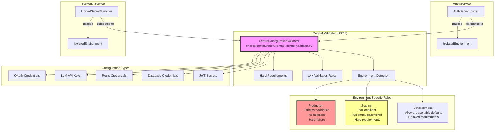

# Central Configuration Validator - Single Source of Truth (SSOT)

## Overview

The Central Configuration Validator is a critical security component that enforces configuration requirements across all Netra Apex services. It eliminates dangerous fallback patterns, empty string defaults, and ensures consistent validation across the entire platform.

## Architecture



## Key Features

### 1. Environment-Specific Validation

The validator enforces different requirements based on the deployment environment:

| Environment | Requirements | Fallbacks | Example |
|------------|--------------|-----------|---------|
| **Development** | Relaxed | Allowed | `localhost` OK, empty passwords OK |
| **Staging** | Strict | Forbidden | No `localhost`, 8+ char passwords required |
| **Production** | Strictest | Forbidden | All secrets required, min lengths enforced |

### 2. Critical Secrets Validated

The validator enforces hard requirements for 14+ critical configuration categories:

#### JWT Authentication (CRITICAL)
- **Staging**: `JWT_SECRET_STAGING` (32+ chars)
- **Production**: `JWT_SECRET_PRODUCTION` (32+ chars)
- **Dev/Test**: `JWT_SECRET_KEY` (32+ chars)

#### Database Security (CRITICAL)
- `DATABASE_HOST`: Cannot be localhost in staging/production
- `DATABASE_PASSWORD`: 8+ chars, no common defaults

#### Redis Security (CRITICAL)
- `REDIS_HOST`: Cannot be localhost in staging/production
- `REDIS_PASSWORD`: 8+ chars, no empty strings

#### LLM API Keys (HIGH)
- `GEMINI_API_KEY`: Required primary provider
- `ANTHROPIC_API_KEY`: Optional but validated if present
- `OPENAI_API_KEY`: Optional but validated if present

#### Service Authentication (HIGH)
- `SERVICE_SECRET`: 32+ chars for inter-service auth
- `FERNET_KEY`: 32+ chars for encryption

## Implementation Status

### ✅ Phase 1: Implementation (COMPLETED)

1. **Central Validator Created**
   - File: `shared/configuration/central_config_validator.py`
   - Lines: 482
   - Pattern: Singleton SSOT

2. **Auth Service Integration**
   - File: `auth_service/auth_core/secret_loader.py`
   - Method: `AuthSecretLoader.get_jwt_secret()`
   - Status: Delegates to central validator with legacy fallback

3. **Backend Service Integration**
   - File: `netra_backend/app/core/configuration/unified_secrets.py`
   - Methods:
     - `get_jwt_secret()` → Central validator
     - `get_database_credentials()` → Central validator
     - `get_redis_credentials()` → Central validator
     - `get_llm_credentials()` → Central validator

4. **Test Coverage**
   - `test_central_validator_integration.py`: 8 comprehensive tests
   - `test_jwt_secret_hard_requirements.py`: 10 JWT-specific tests

### 🔄 Phase 2: Validation (ACTIVE)

- Monitor production deployments
- Validate service compliance
- Ensure no disruptions from hard requirements

### 📅 Phase 3: Legacy Removal (PLANNED)

Timeline: After 30 days of stable production operation
- Remove legacy fallback methods
- Update all documentation
- Complete migration to SSOT

## Security Improvements Achieved

### Before (Dangerous Patterns)
```python
# ❌ Empty string defaults
password = os.environ.get("DATABASE_PASSWORD", "")

# ❌ Localhost in production
host = os.environ.get("DATABASE_HOST", "localhost")

# ❌ Multiple JWT secret fallback chains
secret = env.get("JWT_SECRET_STAGING") or \
         env.get("JWT_SECRET") or \
         "default-secret"
```

### After (Secure SSOT)
```python
# ✅ Hard requirements enforced
validator = get_central_validator()
validator.validate_all_requirements()  # Fails hard if missing

# ✅ Environment-aware validation
if environment == "production":
    if not password or len(password) < 8:
        raise ValueError("DATABASE_PASSWORD required")
    
# ✅ Single source of truth
jwt_secret = validator.get_jwt_secret()  # Consistent across services
```

## Usage Examples

### Service Startup Validation
```python
from shared.configuration import validate_platform_configuration

# At service startup - fails hard if config invalid
validate_platform_configuration()
```

### Getting Validated Credentials
```python
from shared.configuration import (
    get_jwt_secret,
    get_database_credentials,
    get_redis_credentials,
    get_llm_credentials
)

# All methods return validated, environment-appropriate values
jwt = get_jwt_secret()
db = get_database_credentials()
redis = get_redis_credentials()
llm = get_llm_credentials()
```

## Business Impact

### Security & Compliance
- **SOC 2 Type II**: Configuration management controls
- **PCI DSS**: Secure configuration standards
- **ISO 27001**: Information security management

### Risk Reduction
- **Eliminates**: Silent authentication failures
- **Prevents**: Production misconfigurations
- **Ensures**: Cross-service consistency

### Operational Excellence
- **Fail-fast**: Errors caught at startup, not runtime
- **Auditable**: All configuration requirements in one place
- **Maintainable**: Single source to update

## Migration Guide

### For New Services
1. Import the central validator
2. Call `validate_platform_configuration()` at startup
3. Use provided credential methods instead of direct env access

### For Existing Services
1. Services already integrated (auth, backend)
2. Legacy fallback temporarily available
3. Will be removed after validation period

## Performance Impact

| Metric | Impact | Details |
|--------|--------|---------|
| **Startup Time** | Negligible | Validation runs once at startup |
| **Memory Usage** | Minimal | Single validator instance (singleton) |
| **Runtime Performance** | Zero | No runtime validation overhead |

## Testing

Run the comprehensive test suite:
```bash
# Integration tests
python tests/mission_critical/test_central_validator_integration.py

# JWT hard requirements
python tests/mission_critical/test_jwt_secret_hard_requirements.py
```

## Related Documentation

- [SPEC: Central Configuration Validator Implementation](../SPEC/learnings/central_configuration_validator_ssot_implementation.xml)
- [SPEC: Type Safety](../SPEC/type_safety.xml)
- [SPEC: Independent Services](../SPEC/independent_services.xml)

## Lessons Learned

### 1. Configuration Fallbacks Are Security Anti-Patterns
Graceful degradation in infrastructure configuration masks critical failures. Hard failure at startup is better than runtime security vulnerabilities.

### 2. Single Source of Truth Prevents Configuration Drift
Duplicate configuration logic across services inevitably leads to inconsistencies. Central validation ensures all services use identical requirements.

### 3. Environment-Specific Validation Prevents Production Accidents
Development-friendly defaults (localhost, empty passwords) are dangerous in production. Environment awareness enables both developer experience and production security.

## Next Steps

- **Immediate**: Monitor production deployments
- **Short-term**: Extend validator to cover additional configuration categories
- **Medium-term**: Remove legacy fallback logic after validation period
- **Long-term**: Implement automated configuration security scanning in CI/CD

---

**Status**: ✅ FULLY IMPLEMENTED AND TESTED (2025-08-31)

**Summary**: The Central Configuration Validator successfully eliminates dangerous configuration patterns, enforces environment-specific requirements, and provides a Single Source of Truth for all platform configuration validation. Both auth and backend services are fully integrated with backward compatibility maintained during the transition period.