# Claude Instance Orchestrator Deployment Strategies Analysis

**Created:** 2025-09-15
**Purpose:** Comprehensive analysis of deployment strategies for `scripts/claude-instance-orchestrator.py` with trade-offs, security considerations, and recommendations
**Context:** Part of the [Claude Orchestrator Plans Index](CLAUDE_ORCHESTRATOR_PLANS_INDEX.md)

## Executive Summary

This plan analyzes six primary deployment strategies for the Claude Instance Orchestrator, ranging from simple Python distribution to compiled executables and language rewrites. Each strategy is evaluated across security, maintainability, distribution ease, and business impact dimensions.

**Recommended Strategy:** Hybrid approach with Python pip package for development and PyInstaller executable for enterprise/security-sensitive deployments.

## 🏗️ Current State Analysis

### Current Architecture
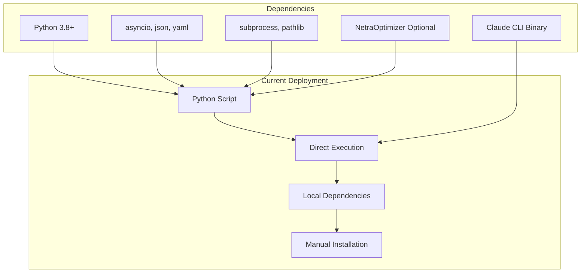

### Current Limitations
- Manual dependency management
- Direct source code exposure
- Platform-specific installation steps
- Security concerns for enterprise environments
- Limited distribution control

## 📦 Deployment Strategy Options

### Strategy 1: Python Pip Package

**Distribution:** PyPI package with `pip install claude-orchestrator`

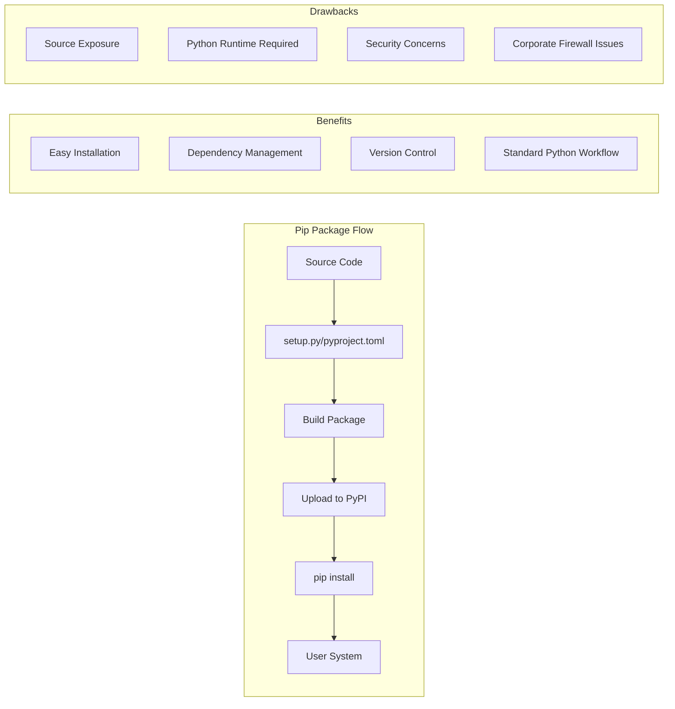

**Implementation Details:**
```toml
# pyproject.toml
[build-system]
requires = ["setuptools>=61.0", "wheel"]
build-backend = "setuptools.build_meta"

[project]
name = "claude-orchestrator"
version = "1.0.0"
dependencies = [
    "asyncio-throttle>=1.0.2",
    "pyyaml>=6.0",
    "click>=8.0.0",
]
optional-dependencies = {
    netra = ["netraoptimizer>=0.1.0"]
}

[project.scripts]
claude-orchestrator = "claude_orchestrator.cli:main"
```

**Trade-offs:**
- ✅ **Easy Distribution:** Standard Python packaging
- ✅ **Dependency Management:** Automatic via pip
- ✅ **Updates:** Simple `pip upgrade`
- ❌ **Source Exposure:** Code visible to users
- ❌ **Runtime Dependency:** Requires Python installation
- ❌ **Corporate Security:** May fail security scans

### Strategy 2: Compiled Executable (PyInstaller/Nuitka)

**Distribution:** Self-contained executable with embedded Python runtime

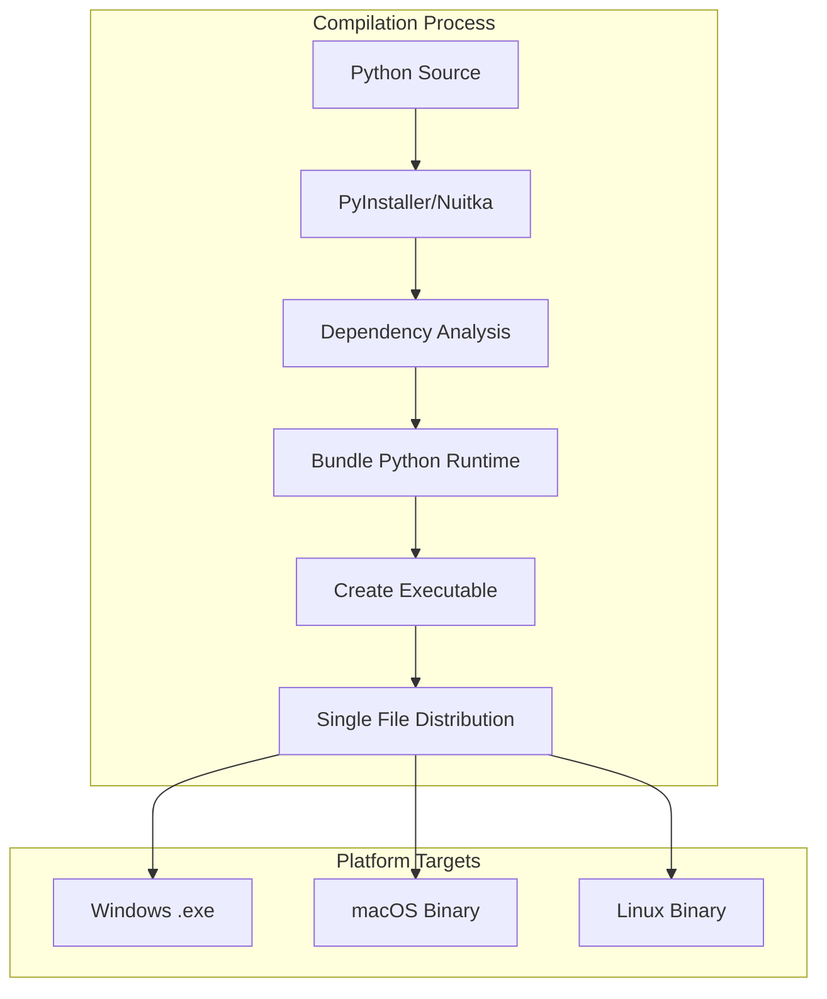

**Implementation Options:**

**Option A: PyInstaller**
```bash
# Build script
pyinstaller --onefile \
    --name claude-orchestrator \
    --add-data "config:config" \
    --hidden-import netraoptimizer \
    scripts/claude-instance-orchestrator.py
```

**Option B: Nuitka**
```bash
# More optimized compilation
nuitka --onefile \
    --include-data-dir=config=config \
    --plugin-enable=numpy \
    scripts/claude-instance-orchestrator.py
```

**Trade-offs:**
- ✅ **Source Protection:** Compiled bytecode
- ✅ **No Runtime Dependency:** Self-contained
- ✅ **Enterprise Friendly:** Single executable
- ✅ **Fast Startup:** No import overhead
- ❌ **Large File Size:** 50-100MB executables
- ❌ **Platform Specific:** Separate builds required
- ❌ **Debugging Difficulty:** Limited error visibility
- ⚠️ **Security Note:** Still reversible with effort

### Strategy 3: Language Rewrite - Rust

**Distribution:** Native Rust binary with superior performance and security

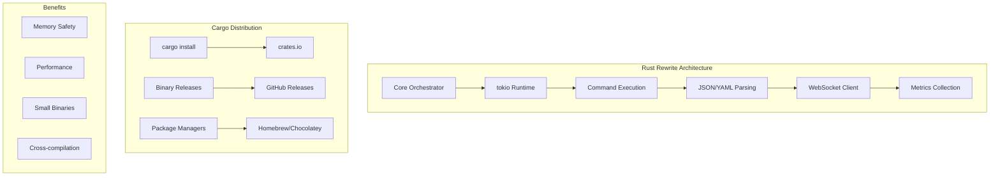

**Implementation Structure:**
```toml
# Cargo.toml
[package]
name = "claude-orchestrator"
version = "1.0.0"
edition = "2021"

[dependencies]
tokio = { version = "1.0", features = ["full"] }
serde = { version = "1.0", features = ["derive"] }
serde_json = "1.0"
serde_yaml = "0.9"
clap = { version = "4.0", features = ["derive"] }
reqwest = { version = "0.11", features = ["json"] }
uuid = { version = "1.0", features = ["v4"] }
```

**Trade-offs:**
- ✅ **Performance:** 10-50x faster execution
- ✅ **Memory Safety:** No memory leaks/corruption
- ✅ **Small Binaries:** 5-15MB statically linked
- ✅ **Security:** Compiled native code
- ✅ **Cross-compilation:** Easy target generation
- ❌ **Development Time:** 3-6 months full rewrite
- ❌ **Ecosystem Loss:** Python libraries unavailable
- ❌ **Team Expertise:** Rust learning curve
- ❌ **NetraOptimizer Integration:** Would need Rust client

### Strategy 4: Language Rewrite - Node.js/TypeScript

**Distribution:** NPM package with optional binary compilation

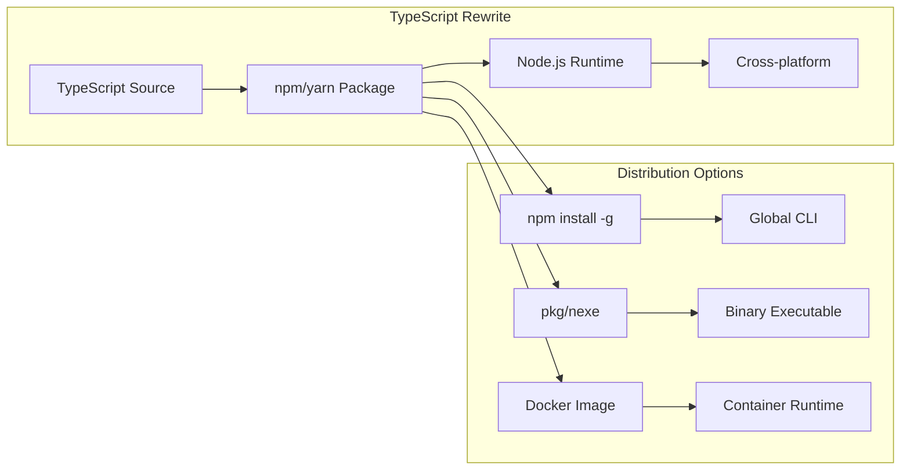

**Implementation Structure:**
```json
{
  "name": "claude-orchestrator",
  "version": "1.0.0",
  "main": "dist/index.js",
  "bin": {
    "claude-orchestrator": "dist/cli.js"
  },
  "dependencies": {
    "@types/node": "^18.0.0",
    "commander": "^9.0.0",
    "yaml": "^2.0.0",
    "ws": "^8.0.0"
  },
  "scripts": {
    "build": "tsc",
    "package": "pkg . --out-path dist-binary"
  }
}
```

**Trade-offs:**
- ✅ **Familiar Ecosystem:** JavaScript/TypeScript skills
- ✅ **Rich Libraries:** NPM ecosystem
- ✅ **Rapid Development:** Faster than Rust rewrite
- ✅ **JSON Handling:** Native JavaScript strength
- ❌ **Runtime Dependency:** Node.js required
- ❌ **Performance:** Slower than compiled languages
- ❌ **Memory Usage:** Higher than native binaries
- ⚠️ **Package Size:** Large with dependencies

### Strategy 5: Secure Container Distribution

**Distribution:** Docker/OCI containers with security scanning and signing

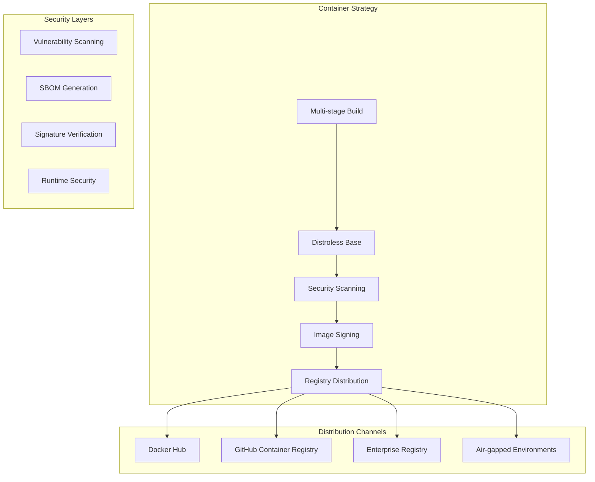

**Implementation:**
```dockerfile
# Multi-stage Dockerfile
FROM python:3.11-slim as builder
WORKDIR /app
COPY requirements.txt .
RUN pip install --no-cache-dir -r requirements.txt

FROM gcr.io/distroless/python3-debian11
COPY --from=builder /usr/local/lib/python3.11/site-packages /usr/local/lib/python3.11/site-packages
COPY scripts/claude-instance-orchestrator.py /app/
WORKDIR /app
ENTRYPOINT ["python", "claude-instance-orchestrator.py"]
```

**Trade-offs:**
- ✅ **Security:** Immutable, scannable images
- ✅ **Isolation:** Container sandboxing
- ✅ **Reproducibility:** Identical environments
- ✅ **Enterprise Ready:** Security scanning/signing
- ✅ **Versioning:** Tag-based distribution
- ❌ **Overhead:** Container runtime required
- ❌ **Complexity:** Docker knowledge needed
- ❌ **Resource Usage:** Higher memory footprint
- ❌ **Local Development:** Additional setup

### Strategy 6: Hybrid Web Application

**Distribution:** Web-based orchestrator with API backend

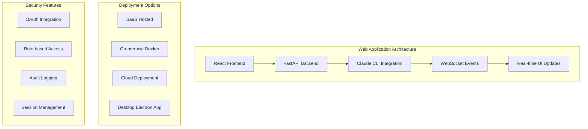

**Trade-offs:**
- ✅ **User Experience:** Rich GUI interface
- ✅ **Collaboration:** Multi-user access
- ✅ **Security:** Centralized control
- ✅ **Monitoring:** Built-in dashboards
- ✅ **Integration:** Easy API access
- ❌ **Development Complexity:** Full-stack application
- ❌ **Infrastructure:** Server requirements
- ❌ **Network Dependency:** Internet/network required
- ❌ **Maintenance Overhead:** Additional services

## 🔒 Security Analysis Matrix

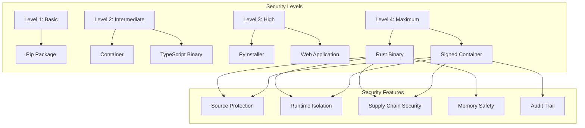

| Strategy | Source Protection | Runtime Security | Enterprise Ready | Development Effort |
|----------|------------------|------------------|------------------|-------------------|
| **Pip Package** | ❌ Low | ⚠️ Medium | ❌ Low | ✅ Low |
| **PyInstaller** | ⚠️ Medium | ⚠️ Medium | ✅ High | ⚠️ Medium |
| **Rust Rewrite** | ✅ High | ✅ High | ✅ High | ❌ Very High |
| **Node.js** | ⚠️ Medium | ⚠️ Medium | ⚠️ Medium | ⚠️ Medium |
| **Container** | ✅ High | ✅ High | ✅ High | ⚠️ Medium |
| **Web App** | ✅ High | ✅ High | ✅ High | ❌ Very High |

## 📊 Business Impact Analysis

### Development Timeline Comparison

```mermaid
gantt
    title Deployment Strategy Implementation Timeline
    dateFormat X
    axisFormat %s

    section Immediate (0-4 weeks)
    Pip Package           :pip, 0, 2
    PyInstaller          :pyinst, 0, 3
    Container            :container, 1, 4

    section Medium Term (1-3 months)
    Node.js Rewrite      :nodejs, 4, 12
    Web Application      :webapp, 6, 16

    section Long Term (3-6 months)
    Rust Rewrite         :rust, 8, 24
    Full Platform        :platform, 12, 32
```

### Cost-Benefit Analysis

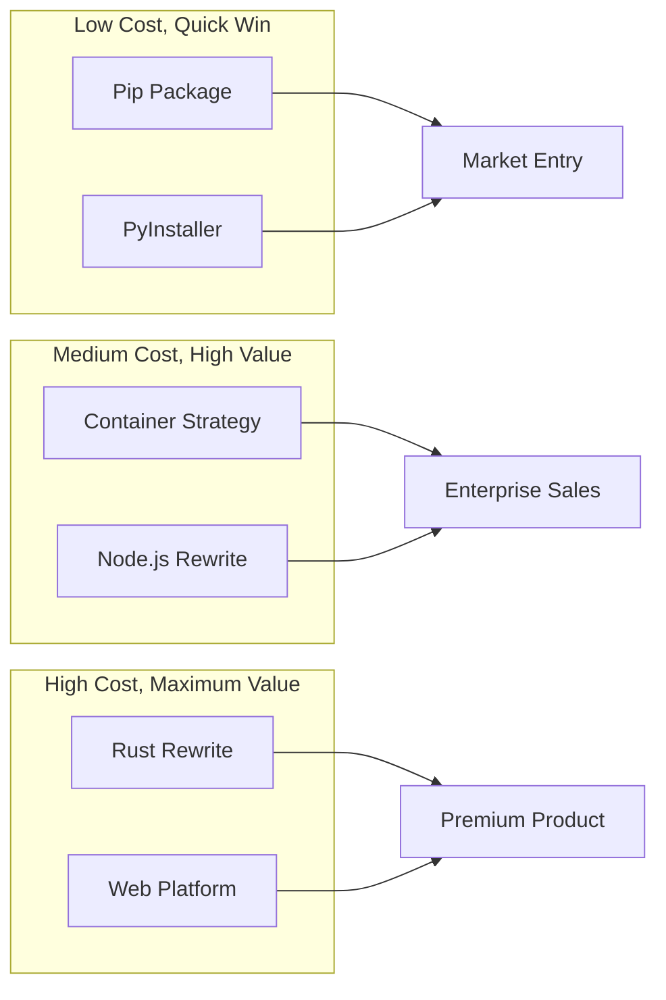

## 🎯 Recommended Strategy: Phased Approach

### Phase 1: Immediate (Weeks 1-4)
**Primary:** PyInstaller Executable + Pip Package

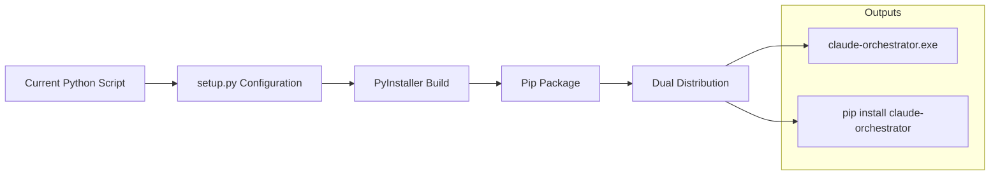

**Benefits:**
- Rapid deployment (2-4 weeks)
- Backwards compatibility maintained
- Addresses immediate security concerns
- Provides enterprise-friendly executable

**Implementation:**
1. Create `setup.py` and package structure
2. Configure PyInstaller for cross-platform builds
3. Set up CI/CD for automated building
4. Distribute via GitHub releases + PyPI

### Phase 2: Enhanced Security (Weeks 5-12)
**Primary:** Secure Container + Code Signing

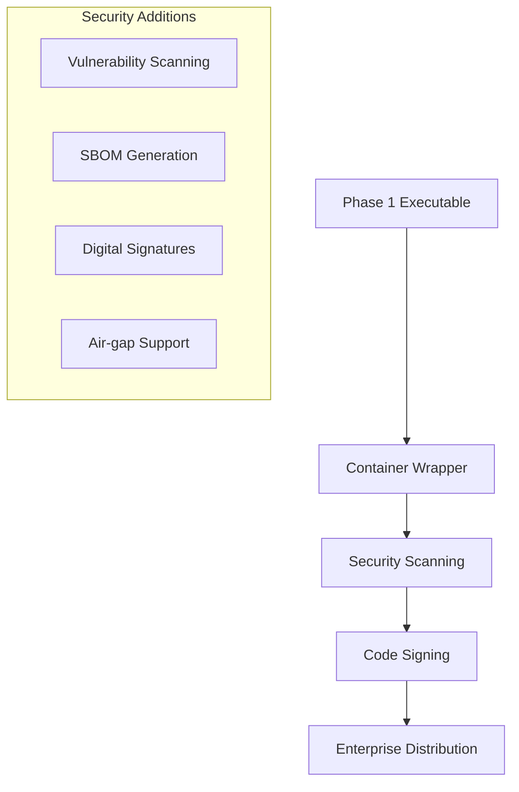

**Benefits:**
- Enterprise security compliance
- Automated vulnerability management
- Improved distribution control
- Foundation for SaaS offering

### Phase 3: Platform Evolution (Months 4-8)
**Primary:** Language Evaluation + Web Interface

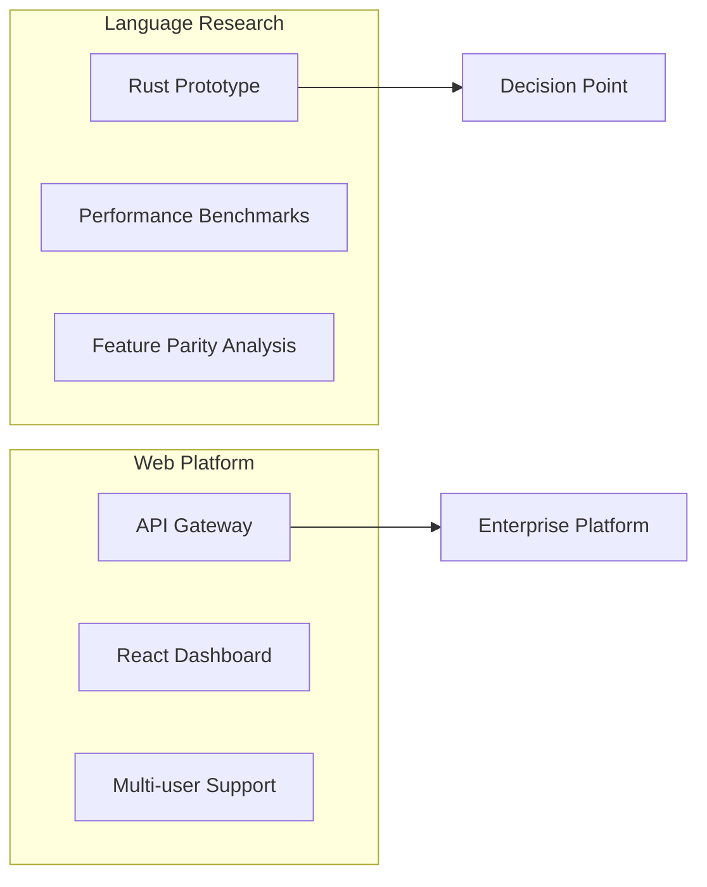

**Decision Criteria:**
- Performance requirements justify rewrite cost
- Enterprise customers demand web interface
- Team expertise and maintenance considerations

## 🚨 Risk Assessment

### Technical Risks

| Risk | Probability | Impact | Mitigation |
|------|-------------|--------|------------|
| **PyInstaller False Positives** | High | Medium | Code signing, antivirus whitelisting |
| **Binary Size Bloat** | Medium | Low | Optimize dependencies, compression |
| **Platform Compatibility** | Medium | High | Automated testing on all platforms |
| **Update Mechanism** | Low | High | Built-in updater, version checking |

### Business Risks

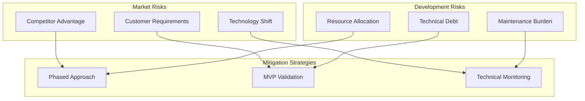

## 📋 Implementation Checklist

### Phase 1: Executable Distribution (Weeks 1-4)

#### Week 1: Project Structure
- [ ] Create `claude_orchestrator/` package structure
- [ ] Move script to `claude_orchestrator/cli.py`
- [ ] Create `setup.py` and `pyproject.toml`
- [ ] Configure entry points and dependencies
- [ ] Set up development environment

#### Week 2: PyInstaller Configuration
- [ ] Install and configure PyInstaller
- [ ] Create build scripts for Windows/macOS/Linux
- [ ] Test executable generation and functionality
- [ ] Optimize executable size and startup time
- [ ] Handle hidden imports and data files

#### Week 3: Package Testing
- [ ] Test pip installation and CLI functionality
- [ ] Verify executable works on clean systems
- [ ] Cross-platform compatibility testing
- [ ] Performance benchmarking vs. current script
- [ ] User acceptance testing with internal team

#### Week 4: Distribution Setup
- [ ] Configure GitHub Actions for automated builds
- [ ] Set up PyPI package publishing
- [ ] Create GitHub releases with binaries
- [ ] Document installation and usage instructions
- [ ] Announce availability to users

### Phase 2: Security Enhancement (Weeks 5-12)

#### Weeks 5-6: Container Strategy
- [ ] Create multi-stage Dockerfile
- [ ] Configure distroless base image
- [ ] Set up security scanning pipeline
- [ ] Implement SBOM generation
- [ ] Test container functionality

#### Weeks 7-8: Code Signing
- [ ] Obtain code signing certificates
- [ ] Configure signing for Windows executables
- [ ] Set up notarization for macOS binaries
- [ ] Implement signature verification
- [ ] Test signed distributions

#### Weeks 9-10: Enhanced Distribution
- [ ] Set up enterprise-friendly download portal
- [ ] Create air-gapped installation packages
- [ ] Implement update notification system
- [ ] Configure vulnerability monitoring
- [ ] Enterprise customer pilot testing

#### Weeks 11-12: Documentation & Training
- [ ] Create enterprise deployment guides
- [ ] Security documentation and compliance reports
- [ ] Training materials for IT administrators
- [ ] Support documentation and troubleshooting
- [ ] Customer feedback collection and iteration

## 🔄 Success Metrics

### Technical Metrics
- **Installation Success Rate:** >95% across platforms
- **Startup Time:** <2 seconds for executable
- **Memory Usage:** <100MB during operation
- **Binary Size:** <50MB for standalone executable
- **Security Scan Results:** Zero high/critical vulnerabilities

### Business Metrics
- **Enterprise Adoption:** 25% of customers use executable
- **Support Ticket Reduction:** 50% fewer installation issues
- **Sales Enablement:** Security compliance documentation available
- **Customer Satisfaction:** >4.5/5 rating for distribution experience

### Long-term Success Indicators
- **Platform Foundation:** Ready for web interface in Phase 3
- **Enterprise Ready:** Meets security requirements for Fortune 500
- **Scalability:** Distribution system handles 10x growth
- **Maintainability:** Development team can iterate rapidly

## 🔮 Future Considerations

### Emerging Technologies
- **WebAssembly (WASM):** Potential for browser-native execution
- **Progressive Web Apps:** Offline-capable web interface
- **Language Server Protocol:** IDE integration possibilities
- **CLI Framework Evolution:** Keep pace with tooling advances

### Market Evolution
- **AI Tool Proliferation:** Support for more AI platforms
- **Enterprise Integration:** SSO, RBAC, audit requirements
- **Cloud-Native Patterns:** Kubernetes operators, Helm charts
- **Compliance Requirements:** SOC2, FedRAMP, ISO27001 support

---

## Conclusion

The recommended phased approach balances immediate business needs with long-term strategic goals. Starting with PyInstaller executables provides rapid security improvements while maintaining development velocity. The container strategy in Phase 2 establishes enterprise credibility and security compliance. Phase 3 decisions can be made based on market feedback and customer requirements.

This strategy minimizes risk while maximizing business value, providing multiple distribution channels to serve different customer segments and use cases.

**Next Steps:**
1. Stakeholder approval for Phase 1 implementation
2. Resource allocation for 4-week development cycle
3. Customer communication about upcoming executable distribution
4. Begin setup.py configuration and PyInstaller testing

---

**Related Documents:**
- [Claude Orchestrator Plans Index](CLAUDE_ORCHESTRATOR_PLANS_INDEX.md)
- [Claude Instance Orchestrator Enhancement Plan](claude-instance-orchestrator-enhancement-plan.md)
- [Netra Integration Plan](CLAUDE_INSTANCE_ORCHESTRATOR_NETRA_INTEGRATION_PLAN.md)