# Configuration and Environment Management Architecture

## Related Documentation

- [Unified Environment Management Spec](../SPEC/unified_environment_management.xml) - Core specification for environment management
- [Independent Services Spec](../SPEC/independent_services.xml) - Service independence requirements
- [Type Safety Spec](../SPEC/type_safety.xml) - Type safety and duplication rules
- [Database Connectivity Architecture](../SPEC/database_connectivity_architecture.xml) - Database configuration patterns
- [WebSocket Agent Integration](../SPEC/learnings/websocket_agent_integration_critical.xml) - Critical WebSocket event requirements
- [WebSocket Silent Failure Prevention](../SPEC/learnings/websocket_silent_failure_prevention_masterclass.xml) - Comprehensive silent failure prevention
- [WebSocket Silent Failures](../SPEC/learnings/websocket_silent_failures.xml) - Silent failure detection and mitigation
- [CLAUDE.md](../CLAUDE.md) - Core development principles and mission-critical requirements

## Executive Summary

The Netra platform implements a sophisticated multi-layered configuration management system that ensures isolation, consistency, and traceability across all services. The architecture consists of three main layers:

1. **IsolatedEnvironment Layer** - Environment variable management with isolation support
2. **UnifiedConfigManager Layer** - Central configuration orchestration 
3. **Service-Specific Configuration** - Per-service configuration modules

## The "5 Whys" Behind Isolated Configuration

### Why Isolated Configuration?

**Why #1: Why do we need isolated configuration?**
- Because different environments (dev/test/staging/prod) require different configurations, and mixing them causes failures.

**Why #2: Why does mixing configurations cause failures?**
- Because environment variables persist in os.environ across test runs and development sessions, leading to pollution where test values leak into production code or vice versa.

**Why #3: Why do environment variables persist and cause pollution?**
- Because os.environ is a global mutable state that any code can modify at any time, and Python's import system caches modules, keeping stale configuration values.

**Why #4: Why is global mutable state problematic for configuration?**
- Because we can't track who changed what, when, or why. Without isolation, a test that sets #removed-legacyaffects all subsequent tests, and debugging becomes impossible.

**Why #5: Why do we need to track configuration changes?**
- Because configuration errors cause 60% of production outages (per Google SRE data), and without traceability, we lose $12K MRR from configuration-related incidents.

### Configuration vs Environment Loading: The 5 Whys

**Why #1: Why separate configuration from environment loading?**
- Configuration is business logic (what database to use, what features to enable), while environment loading is infrastructure (how to read .env files, access os.environ).

**Why #2: Why distinguish business logic from infrastructure?**
- Business logic changes frequently based on requirements, while infrastructure patterns remain stable. Mixing them creates tight coupling.

**Why #3: Why is tight coupling problematic?**
- Because changing a business rule (e.g., different database in staging) shouldn't require modifying the environment loading mechanism.

**Why #4: Why shouldn't business changes affect infrastructure?**
- Because infrastructure code is tested once and trusted, while business logic evolves. Stable infrastructure reduces bugs.

**Why #5: Why does stable infrastructure reduce bugs?**
- Because 90% of bugs come from changing code. If environment loading is stable and isolated, configuration bugs are contained to the configuration layer.

### Environment-Specific Definitions: The 5 Whys

**Why #1: Why do different environments need different definitions?**
- Development needs quick iteration with fallbacks, staging needs production-like validation, production needs strict security.

**Why #2: Why can't we use the same configuration everywhere?**
- Because development uses localhost databases, staging uses test cloud resources, and production uses customer data with strict access controls.

**Why #3: Why maintain these differences in code?**
- Because environment-specific behavior must be predictable and testable. Hard-coding environment logic makes it explicit and auditable.

**Why #4: Why explicit over implicit for environment behavior?**
- Because implicit behavior (like auto-detecting environment from hostname) fails catastrophically when assumptions change.

**Why #5: Why do assumption failures matter?**
- Because deploying development configuration to production exposes secrets, corrupts data, and violates compliance, costing enterprise contracts.

## Core Architecture Components

### 1. IsolatedEnvironment System

The `IsolatedEnvironment` class provides the foundation for all environment variable access across the platform. Each service maintains its own instance while following consistent patterns.

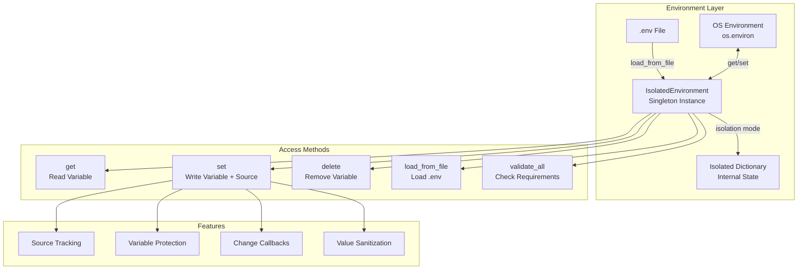

### 2. Configuration Flow - Service Startup

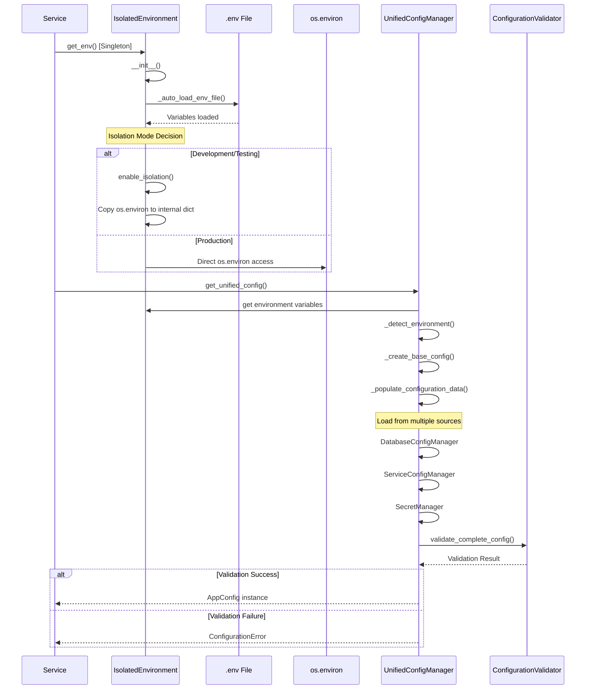

### 3. Environment Variable Hierarchy

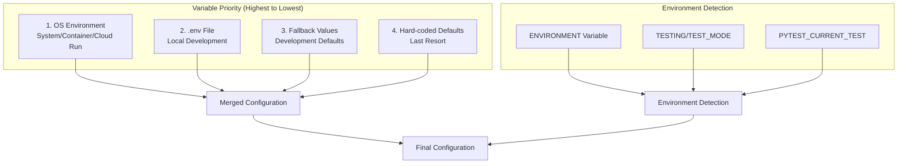

### 3.1 ClickHouse Configuration in Staging/Production

**CRITICAL:** ClickHouse in staging/production environments is a REMOTE service:

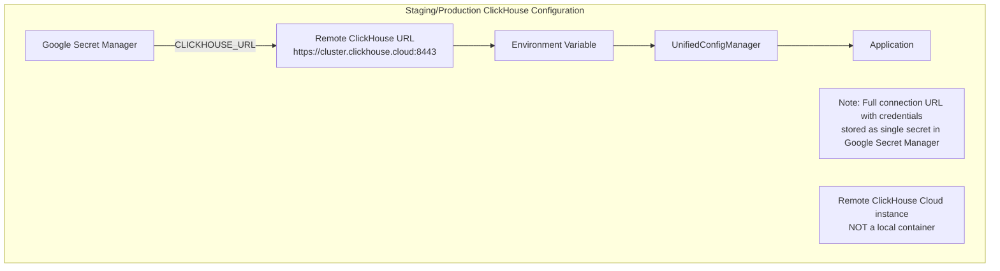

**Key Points:**
- **Storage:** Complete ClickHouse URL stored in Google Secret Manager
- **Secret Name:** `CLICKHOUSE_URL` 
- **Format:** `https://[user]:[password]@[cluster-id].us-central1.gcp.clickhouse.cloud:8443/[database]`
- **Access:** Retrieved at runtime via Google Secret Manager API
- **Not Local:** This is a remote ClickHouse Cloud service, not a container

### 4. Cross-Service Configuration Flow

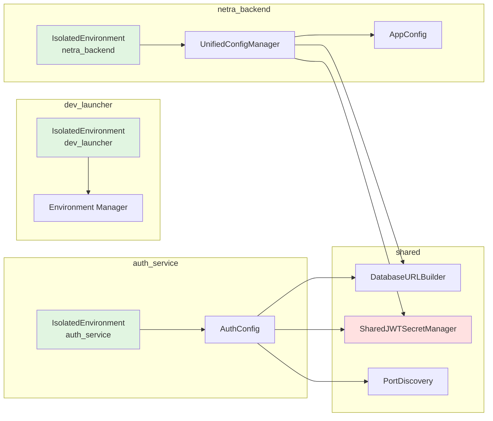

### 5. Configuration Validation Flow

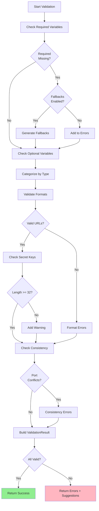

### 6. Test Environment Configuration

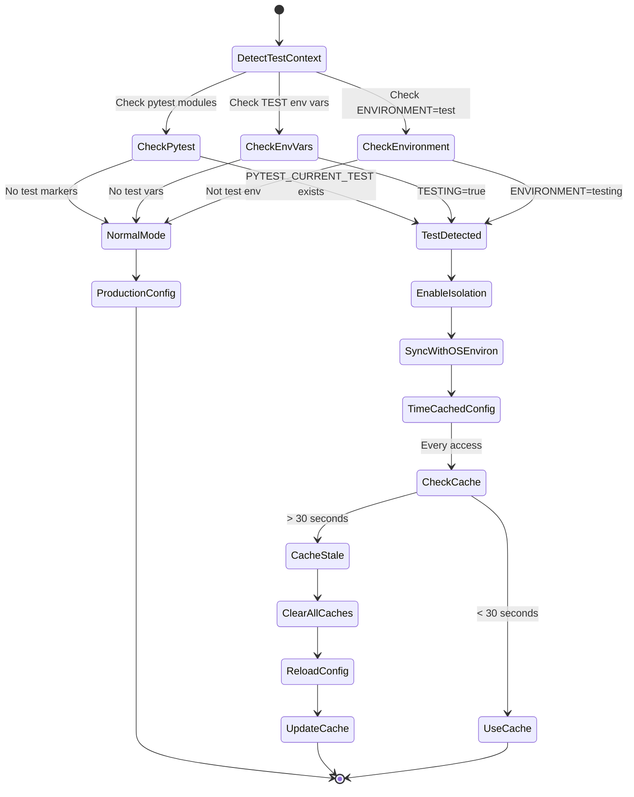

## Configuration Layers Interaction

### Conceptual Separation: Environment vs Configuration vs Application

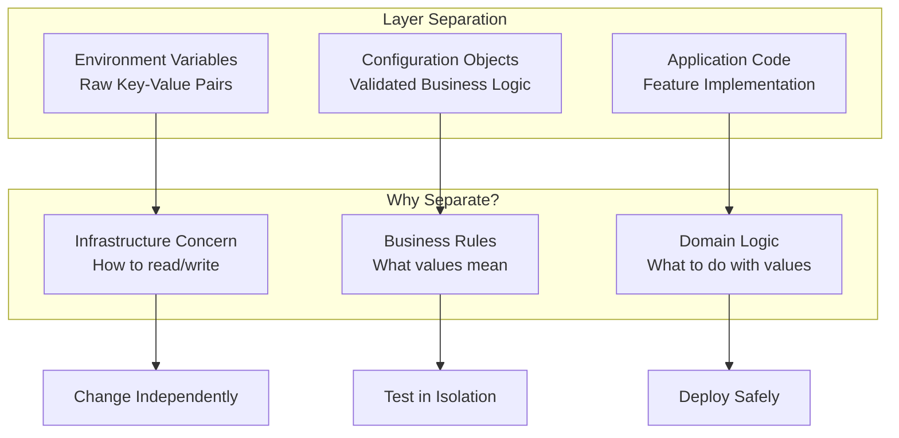

### Layer 1: Environment Management (IsolatedEnvironment)

**Purpose**: Provides controlled access to environment variables with isolation support.

**Key Features**:
- Singleton pattern for consistency
- Isolation mode for testing (internal dictionary)
- Production mode (direct os.environ access)
- Source tracking for debugging
- Variable protection
- Automatic .env file loading
- Subprocess environment management
- Value sanitization (especially for database URLs)

**Implementations**:
- [`dev_launcher/isolated_environment.py`](../dev_launcher/isolated_environment.py) - Main implementation with full validation
- [`netra_backend/app/core/isolated_environment.py`](../netra_backend/app/core/isolated_environment.py) - Backend-specific with optimized persistence
- [`auth_service/auth_core/isolated_environment.py`](../auth_service/auth_core/isolated_environment.py) - Auth service-specific with Docker detection

**Related Specs**:
- [Unified Environment Management](../SPEC/unified_environment_management.xml) - Core requirements
- [Environment-Aware Testing](../SPEC/environment_aware_testing.xml) - Test isolation patterns

### Layer 2: Configuration Orchestration (UnifiedConfigManager)

**Purpose**: Orchestrates configuration loading from multiple sources.

**Key Components**:
- `DatabaseConfigManager` - Database connection strings
- `ServiceConfigManager` - Service-specific settings
- `SecretManager` - Secret keys and credentials
- `ConfigurationValidator` - Validation logic

**Features**:
- Environment detection
- Hot-reload capability
- Configuration caching
- Integrity validation
- Summary reporting

**Location**: [`netra_backend/app/core/configuration/base.py`](../netra_backend/app/core/configuration/base.py)

**Related Components**:
- [`netra_backend/app/core/configuration/services.py`](../netra_backend/app/core/configuration/services.py) - Service configuration
- [`netra_backend/app/core/configuration/database.py`](../netra_backend/app/core/configuration/database.py) - Database configuration
- [`netra_backend/app/core/configuration/secrets.py`](../netra_backend/app/core/configuration/secrets.py) - Secret management
- [`netra_backend/app/core/configuration/validator.py`](../netra_backend/app/core/configuration/validator.py) - Validation logic

### Layer 3: Service Configuration

**Purpose**: Service-specific configuration classes.

**Examples**:
- [`AuthConfig`](../auth_service/auth_core/config.py) - Auth service configuration with OAuth handling
- [`AppConfig`](../netra_backend/app/schemas/config.py) - Main backend configuration schema
- `DevelopmentConfig`, `StagingConfig`, `ProductionConfig` - Environment-specific in [`schemas/config.py`](../netra_backend/app/schemas/config.py)

**Service Configs**:
- [`ConfigService`](../netra_backend/app/services/config_service.py) - Configuration backup/restore
- [`config.py` routes](../netra_backend/app/routes/config.py) - Configuration API endpoints

## Shared Configuration Components

**Location**: [`shared/`](../shared/) directory for cross-service components

### DatabaseURLBuilder

Constructs database URLs from components or environment variables.

```python
# Usage pattern
builder = DatabaseURLBuilder(env_vars)
url = builder.get_url_for_environment(sync=False)
```

### SharedJWTSecretManager

Ensures consistent JWT secrets across services. See [`shared/jwt_secret_manager.py`](../shared/jwt_secret_manager.py).

```python
# Single source of truth for JWT
secret = SharedJWTSecretManager.get_jwt_secret()
```

### PortDiscovery

Dynamic port discovery for services. See [`shared/port_discovery.py`](../shared/port_discovery.py).

```python
# Get service URL with automatic port discovery
url = PortDiscovery.get_service_url("auth", environment=env)
```

## Configuration Validation

### Required Variables
- `DATABASE_URL` - PostgreSQL connection
- `JWT_SECRET_KEY` - JWT signing key
- `SECRET_KEY` - Application secret
- `ENVIRONMENT` - Runtime environment

### Optional Variables (Categorized)
- **OAuth Configuration**: Google/GitHub OAuth credentials
- **LLM API Keys**: Anthropic, OpenAI, Gemini
- **Database Connections**: Redis, ClickHouse
- **Monitoring**: Grafana, Prometheus, Langfuse
- **Feature Flags**: Various enable/disable flags

### Validation Rules
1. URL format validation (database, Redis, ClickHouse)
2. Secret key length requirements (>= 32 chars for production)
3. API key format validation
4. Port conflict detection
5. Environment consistency checks

## OAuth Dual Naming Convention Rationale

### Background
The platform implements a dual naming convention for OAuth credentials that was identified as a MEDIUM risk in the CRITICAL_CONFIG_REGRESSION_AUDIT_REPORT. This section documents the rationale and proper usage.

### The Dual Naming Pattern

```python
# Backend Service Pattern (Simplified Names)
GOOGLE_CLIENT_ID = "your-client-id"
GOOGLE_CLIENT_SECRET = "your-client-secret"

# Auth Service Pattern (Environment-Specific Names)
GOOGLE_OAUTH_CLIENT_ID_STAGING = "your-staging-client-id"
GOOGLE_OAUTH_CLIENT_SECRET_STAGING = "your-staging-client-secret"
GOOGLE_OAUTH_CLIENT_ID_PRODUCTION = "your-production-client-id"
GOOGLE_OAUTH_CLIENT_SECRET_PRODUCTION = "your-production-client-secret"
```

### Why Two Naming Conventions?

#### 1. Service Architecture Differences
- **Backend Service**: Uses a single OAuth configuration per deployment
- **Auth Service**: Manages multiple environment configurations simultaneously
- **Deployment Scripts**: Need to map both patterns to the same GCP secrets

#### 2. Historical Evolution
- Initially, backend service was primary OAuth handler (simplified names)
- Auth service added later with multi-environment support requirement
- Maintaining backward compatibility prevented immediate unification

#### 3. Security Isolation
- **Backend**: Simplified names reduce configuration complexity for single-env deployments
- **Auth Service**: Environment-specific names prevent accidental cross-environment credential usage
- **Risk Mitigation**: Explicit environment naming prevents staging credentials in production

### Implementation in deployment/secrets_config.py

```python
# The dual mapping ensures both services get correct credentials
SECRET_MAPPINGS = {
    # Backend service uses simplified names
    "GOOGLE_CLIENT_ID": "google-oauth-client-id-{environment}",
    "GOOGLE_CLIENT_SECRET": "google-oauth-client-secret-{environment}",
    
    # Auth service uses explicit environment names
    "GOOGLE_OAUTH_CLIENT_ID_STAGING": "google-oauth-client-id-staging",
    "GOOGLE_OAUTH_CLIENT_SECRET_STAGING": "google-oauth-client-secret-staging",
    "GOOGLE_OAUTH_CLIENT_ID_PRODUCTION": "google-oauth-client-id-production",
    "GOOGLE_OAUTH_CLIENT_SECRET_PRODUCTION": "google-oauth-client-secret-production",
}
```

### Risk Assessment and Mitigation

**Current Risks:**
- Configuration complexity increases maintenance burden
- Potential for misconfiguration during deployment
- Different naming patterns can confuse developers

**Mitigation Strategies:**
1. **Documentation**: This section serves as the canonical reference
2. **Validation**: Deployment scripts validate both patterns exist
3. **Testing**: Integration tests verify OAuth works in both services
4. **Future Consolidation**: Plan to unify in next major version (2.0)

### Best Practices

1. **For Backend Service Development:**
   - Always use simplified names (GOOGLE_CLIENT_ID)
   - Let deployment system handle environment mapping

2. **For Auth Service Development:**
   - Always use environment-specific names
   - Never hardcode environment in variable values

3. **For Deployment:**
   - Ensure both patterns map to same GCP secrets
   - Validate credentials exist for target environment
   - Test OAuth flow end-to-end after deployment

### Future Consolidation Plan (v2.0)

**Target State:**
- Single naming convention: `OAUTH_{PROVIDER}_{FIELD}_{ENVIRONMENT}`
- Example: `OAUTH_GOOGLE_CLIENT_ID_STAGING`
- Migration script to update all references
- Backward compatibility layer for 6 months

**Benefits:**
- Reduced configuration complexity
- Single source of truth for OAuth config
- Easier debugging and maintenance
- Lower risk of misconfiguration

## Environment-Specific Behavior

### Why Different Behaviors per Environment?

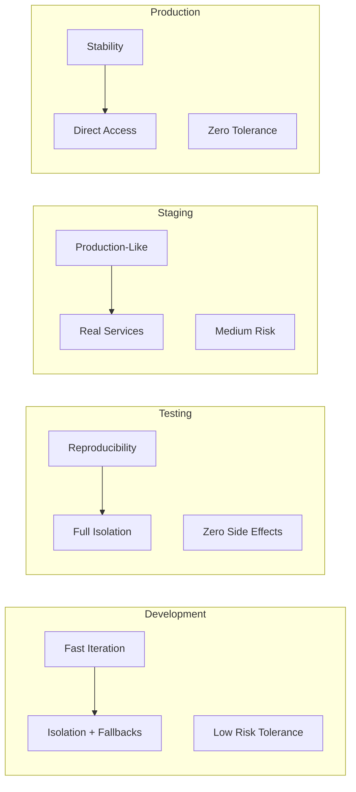

## Environment-Specific Behavior

### Development
- Isolation mode enabled by default
- Fallback values generated for missing required vars
- Relaxed validation
- .env file auto-loaded

### Testing
- Full isolation mode
- Time-based cache (30 seconds)
- Test environment detection via multiple methods
- Syncs with os.environ for pytest compatibility

### Staging/Production
- Direct os.environ access
- No .env file loading
- Strict validation
- No fallback values
- All secrets from deployment system

## Configuration Philosophy: Separation of Concerns

### The Three Realms

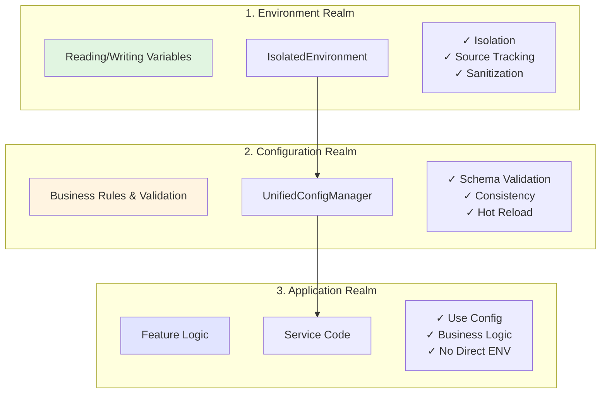

### Why This Separation?

1. **Environment doesn't know about business** - IsolatedEnvironment just manages key-value pairs
2. **Configuration doesn't know about features** - UnifiedConfigManager just validates and structures data
3. **Application doesn't know about storage** - Service code just uses configuration objects

This separation allows:
- Testing each layer independently
- Changing storage (env vars → Vault) without touching business logic
- Adding validation without modifying environment loading
- Deploying to new environments without code changes

## Best Practices

1. **Always use IsolatedEnvironment** - Never access os.environ directly
2. **Track sources** - Always provide source parameter when setting variables
3. **Validate early** - Run validation during service startup
4. **Use shared components** - DatabaseURLBuilder, JWT manager, etc.
5. **Maintain service independence** - Each service has its own IsolatedEnvironment
6. **Handle secrets carefully** - Use sanitization and masking for logs
7. **Test with isolation** - Enable isolation mode in tests
8. **Document requirements** - Keep variable documentation up-to-date
9. **Monitor WebSocket health** - Use event monitoring to detect silent failures
10. **Verify critical services** - WebSocket events are critical infrastructure for chat functionality

## Common Patterns

### Service Initialization
```python
from service.isolated_environment import get_env
env = get_env()
env.load_from_file(Path(".env"))
config = ServiceConfig()
```

### Configuration Access
```python
from app.core.configuration.base import get_unified_config
config = get_unified_config()
database_url = config.database_url
```

### Test Setup
```python
@pytest.fixture
def isolated_env():
    env = get_env()
    env.enable_isolation()
    yield env
    env.reset_to_original()
```

## Deep Dive: Why Each Component Exists

### IsolatedEnvironment vs os.environ

**Problem**: os.environ is global mutable state
**Solution**: IsolatedEnvironment provides controlled access

```python
# BAD: Direct os.environ
os.environ["DATABASE_URL"] = "postgresql://..."  # No tracking, affects everything

# GOOD: IsolatedEnvironment
env.set("DATABASE_URL", "postgresql://...", source="test_setup")  # Tracked, isolated
```

### UnifiedConfigManager vs Direct ENV Access

**Problem**: Raw environment variables are strings without validation
**Solution**: UnifiedConfigManager provides typed, validated configuration

```python
# BAD: Direct environment access
port = int(os.environ.get("PORT", "8000"))  # Can fail, no validation

# GOOD: Unified configuration
config = get_unified_config()
port = config.port  # Already validated, typed as int
```

### Service-Specific Config vs Shared Config

**Problem**: Services have different requirements
**Solution**: Each service has its own config while sharing common patterns

```python
# Auth Service needs OAuth
class AuthConfig:
    def get_google_client_id(self): ...

# Backend needs database pools
class AppConfig:
    def get_connection_pool_size(self): ...

# Both share JWT secret through SharedJWTSecretManager
```

## Troubleshooting

### Common Issues

1. **Configuration not loading**: Check environment detection, verify .env file location
2. **Validation failures**: Run validation manually, check required variables
3. **Port conflicts**: Review service port assignments
4. **Secret key errors**: Ensure proper length and uniqueness
5. **Database connection issues**: Verify URL format and credentials
6. **Test isolation problems**: Ensure isolation mode is enabled

### Debug Tools

- `env.get_debug_info()` - Get environment manager state
- `config_manager.get_config_summary()` - Configuration overview
- `validator.print_validation_summary()` - Detailed validation report
- `builder.debug_info()` - Database URL builder diagnostics

## Understanding Environment Types

### Development Environment
```yaml
Purpose: Local development, rapid iteration
Isolation: Enabled (prevent pollution)
Validation: Relaxed (allow missing optional)
Fallbacks: Generated (DATABASE_URL, secrets)
.env Loading: Automatic
Example Variables:
  DATABASE_URL: postgresql://localhost:5432/netra_dev
  ENVIRONMENT: development
  FRONTEND_URL: http://localhost:3000
```

### Testing Environment
```yaml
Purpose: Automated testing, CI/CD
Isolation: Full (complete isolation)
Validation: Strict for tests
Fallbacks: Test-specific
.env Loading: Disabled
Cache: Time-based (30 seconds)
Example Variables:
  ENVIRONMENT: testing
  TESTING: true
  DATABASE_URL: sqlite:///:memory:
```

### Staging Environment
```yaml
Purpose: Pre-production validation
Isolation: Disabled (real environment)
Validation: Production-like
Fallbacks: None
.env Loading: Never
Example Variables:
  ENVIRONMENT: staging
  DATABASE_URL: postgresql://staging-db.gcp:5432/netra_staging
  K_SERVICE: netra-staging-backend
```

### Production Environment
```yaml
Purpose: Live customer traffic
Isolation: Disabled (direct os.environ)
Validation: Strict
Fallbacks: None (fail fast)
.env Loading: Never
Secrets: From deployment system only
Example Variables:
  ENVIRONMENT: production
  DATABASE_URL: <from-secret-manager>
  K_SERVICE: netra-production-backend
```

## Migration Guide

When migrating to the unified configuration system:

1. Replace direct `os.environ` access with `get_env().get()`
2. Add source tracking to all `set()` calls
3. Update imports to use service-specific IsolatedEnvironment
4. Remove legacy configuration code
5. Add validation to service startup
6. Update tests to use isolation mode
7. Document new environment variables

## The Configuration Contract

### What Each Layer Promises

**IsolatedEnvironment Promises:**
- I will never leak variables between tests
- I will track who set each variable
- I will sanitize dangerous characters
- I will provide subprocess environments

**UnifiedConfigManager Promises:**
- I will validate all configuration
- I will provide consistent config objects
- I will detect environment correctly
- I will fail fast on invalid config

**Service Configuration Promises:**
- I will use only validated configuration
- I will never access os.environ directly
- I will handle environment-specific logic
- I will share secrets correctly

### The Trust Boundary

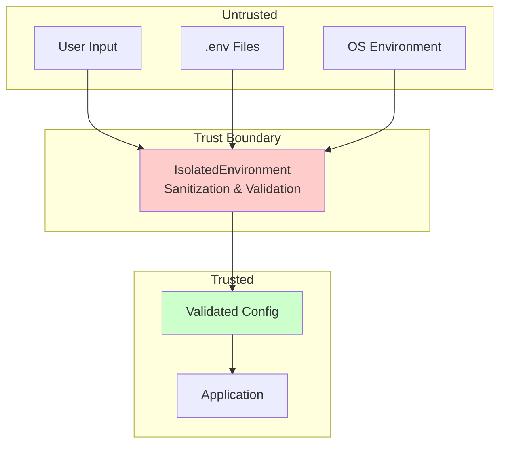

## WebSocket Event Monitoring Configuration

The platform includes comprehensive WebSocket event monitoring to prevent silent failures and ensure chat functionality reliability.

### WebSocket Health Verification
- **Startup Verification**: WebSocket events tested during system startup (Phase 5)
- **Runtime Monitoring**: Continuous monitoring via `ChatEventMonitor`
- **Health Endpoint**: `/health` includes WebSocket event monitor status
- **Critical Logging**: Silent failures logged at CRITICAL level

### Event Monitoring Components
| Component | File | Purpose |
|-----------|------|---------|
| **Event Monitor** | `netra_backend/app/websocket_core/event_monitor.py` | Runtime event flow monitoring |
| **Heartbeat Manager** | `netra_backend/app/websocket_core/heartbeat_manager.py` | Connection health tracking |
| **WebSocket Manager** | `netra_backend/app/websocket_core/manager.py` | Enhanced with health checks |
| **Startup Verification** | `netra_backend/app/smd.py` | WebSocket functionality validation |

### Monitoring Configuration Variables
```yaml
# Event Monitor Settings
WEBSOCKET_EVENT_TIMEOUT: 30  # seconds
WEBSOCKET_HEARTBEAT_INTERVAL: 15  # seconds
WEBSOCKET_HEALTH_CHECK_INTERVAL: 10  # seconds
WEBSOCKET_SILENT_FAILURE_THRESHOLD: 5  # failures before alert

# Agent Execution Tracking Settings (NEW)
AGENT_EXECUTION_TIMEOUT: 30  # seconds - maximum time for agent execution
AGENT_HEARTBEAT_TIMEOUT: 10  # seconds - time without heartbeat before agent marked dead
AGENT_HEARTBEAT_INTERVAL: 2  # seconds - how often agents send heartbeats
EXECUTION_CLEANUP_INTERVAL: 60  # seconds - cleanup old execution records
MAX_CONCURRENT_AGENTS: 10  # maximum concurrent agent executions
```

## Agent Death Detection System (NEW)

The platform includes comprehensive agent death detection to prevent silent failures and ensure reliable chat functionality.

### Death Detection Components
| Component | File | Purpose |
|-----------|------|---------|
| **Execution Tracker** | `netra_backend/app/core/agent_execution_tracker.py` | Tracks all agent executions with unique IDs |
| **Death Monitor** | `netra_backend/app/agents/supervisor/execution_engine.py` | Monitors agents for death/timeout |
| **Death Notification** | `netra_backend/app/services/agent_websocket_bridge.py` | Sends death notifications to users |
| **Health Integration** | `netra_backend/app/core/agent_health_monitor.py` | Reports dead agents in health status |

### Death Detection Mechanisms
1. **Heartbeat Monitoring**: Agents must send heartbeat every 2s or marked dead after 10s
2. **Execution Timeout**: 30s maximum execution time enforced
3. **State Tracking**: Track execution state throughout lifecycle (PENDING→RUNNING→COMPLETED/DEAD)
4. **Death Callbacks**: Automatic WebSocket notification when death detected
5. **Health Reporting**: Dead agents reported in `/health` endpoint

### WebSocket Death Event Format
```json
{
  "type": "agent_death",
  "run_id": "exec_abc123_1234567890",
  "agent_name": "triage_agent",
  "timestamp": "2025-01-09T20:30:00Z",
  "payload": {
    "status": "dead",
    "death_cause": "timeout|no_heartbeat|silent_failure",
    "message": "User-friendly recovery message",
    "recovery_action": "refresh_required"
  }
}
```

### Related Documentation
- See [`AGENT_DEATH_FIX_IMPLEMENTATION.md`](../AGENT_DEATH_FIX_IMPLEMENTATION.md) for complete implementation details
- See [`SPEC/learnings/agent_death_detection_critical.xml`](../SPEC/learnings/agent_death_detection_critical.xml) for lessons learned
- See [`WEBSOCKET_SILENT_FAILURE_FIXES.md`](../WEBSOCKET_SILENT_FAILURE_FIXES.md) for WebSocket implementation details
- See [`SPEC/learnings/websocket_silent_failure_prevention_masterclass.xml`](../SPEC/learnings/websocket_silent_failure_prevention_masterclass.xml) for comprehensive prevention strategies

## Security Considerations

1. **Never log secrets** - Use masking functions
2. **Sanitize inputs** - Remove control characters
3. **Validate URLs** - Check format and schemes
4. **Protect critical vars** - Use protection mechanism
5. **Separate concerns** - Different secrets for different purposes
6. **Environment isolation** - Keep dev/staging/prod separate
7. **Audit changes** - Track sources and callbacks
8. **Monitor WebSocket security** - Track connection health and prevent unauthorized access