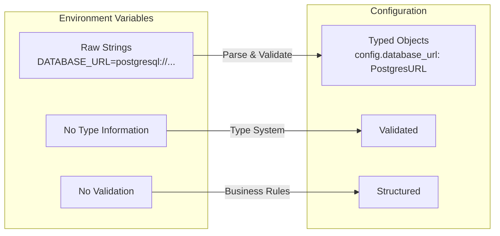
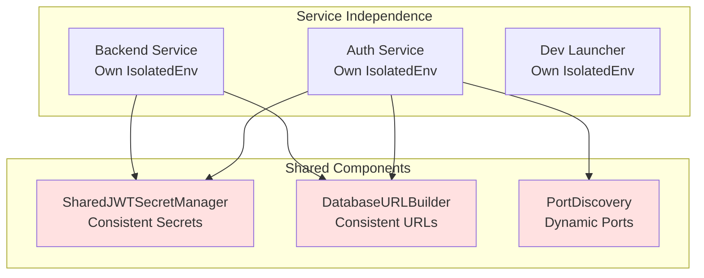
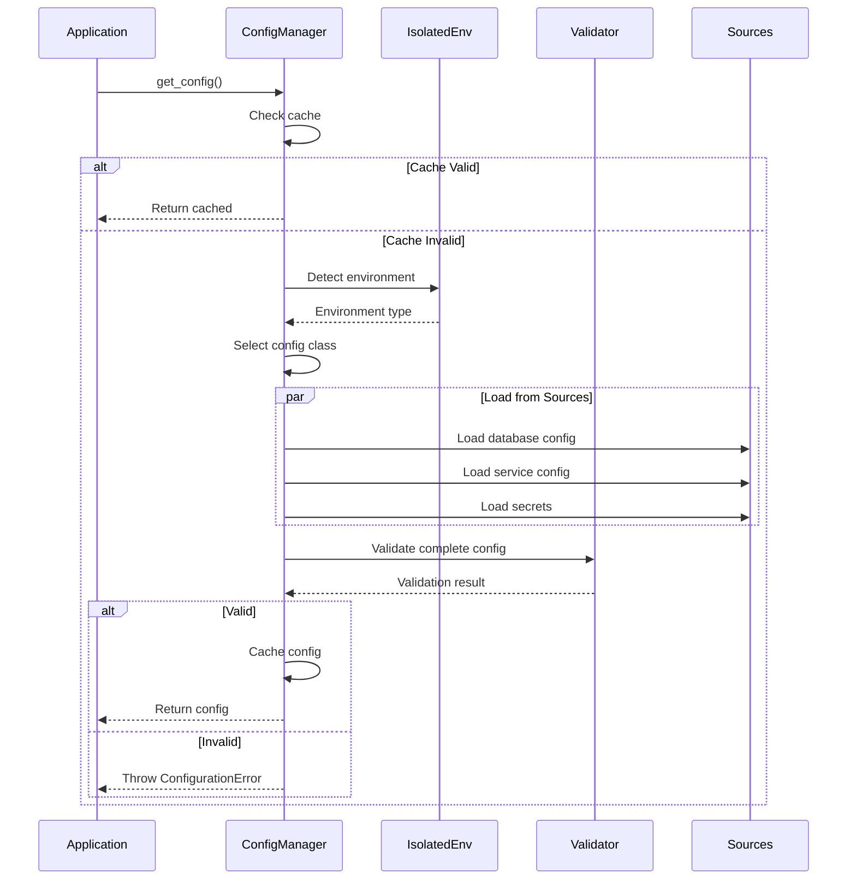
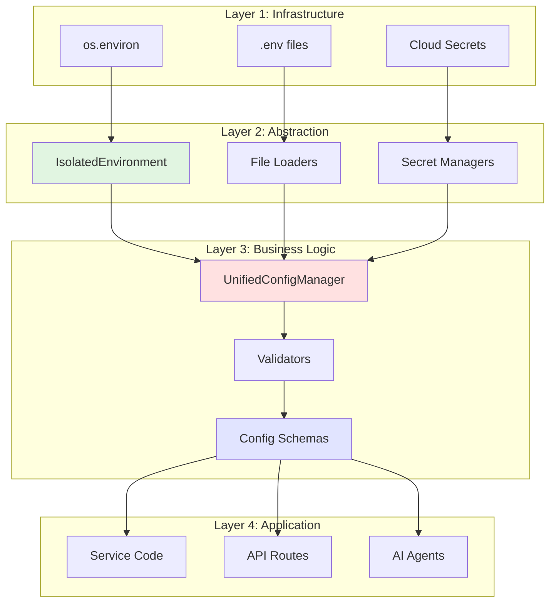

# Configuration Concepts: The Deep Understanding

## The Fundamental Question: Why So Complex?

The configuration system appears complex because it solves **five distinct problems** that are often conflated:

1. **Reading values** (Environment Management)
2. **Validating values** (Configuration Validation)
3. **Structuring values** (Configuration Schema)
4. **Using values** (Application Logic)
5. **Changing values** (Hot Reload/Runtime Updates)

Each layer exists to solve ONE of these problems without coupling to the others.

## The Core Concepts Explained

### Concept 1: Environment Variables vs Configuration



**Environment Variables** are:
- Raw key-value pairs from the operating system
- Always strings
- No inherent structure or validation
- Can come from multiple sources (.env, OS, containers)

**Configuration** is:
- Parsed, typed, validated business objects
- Has structure (nested objects, lists)
- Enforces business rules
- Provides safe defaults

### Concept 2: Isolation vs Direct Access

```python
# The Problem: Global Mutable State
os.environ["DATABASE_URL"] = "test_db"  # Affects EVERYTHING
run_test_1()  # Uses test_db
run_test_2()  # Also uses test_db (pollution!)
run_app()     # STILL uses test_db (DANGER!)

# The Solution: Isolated Environment
env = IsolatedEnvironment()
env.enable_isolation()
env.set("DATABASE_URL", "test_db", "test_1")  # Only in this context
run_test_1()  # Uses test_db
env.reset_to_original()
run_test_2()  # Uses original value
```

**Why Isolation Matters:**
- Tests don't pollute each other
- Development doesn't affect production
- Changes are traceable
- Rollback is possible

### Concept 3: Service Independence vs Shared Configuration



**Each Service Has:**
- Its own IsolatedEnvironment instance
- Its own configuration module
- Its own validation rules

**But They Share:**
- Common patterns (through shared/ directory)
- Critical secrets (JWT must be identical)
- Infrastructure components (database URLs)

### Concept 4: Environment Types Are Not Just Names

Each environment type represents a **completely different operational context**:

```yaml
Development:
  Purpose: "Rapid iteration, debugging"
  Characteristics:
    - Mistakes are OK (fallbacks provided)
    - Convenience over security (.env files)
    - Isolation to prevent pollution
    - Local services (localhost URLs)
  
Testing:
  Purpose: "Automated validation"
  Characteristics:
    - Reproducibility is critical
    - Complete isolation required
    - Time-based cache for performance
    - In-memory databases OK

Staging:
  Purpose: "Production simulation"
  Characteristics:
    - Production-like validation
    - Real cloud services
    - No fallbacks (fail like prod)
    - Performance testing

Production:
  Purpose: "Customer value delivery"
  Characteristics:
    - Zero tolerance for errors
    - Security is paramount
    - Audit everything
    - Direct environment access (performance)
```

### Concept 5: Configuration Loading Flow

The configuration loading is **not** a simple "read and use" process:



## The "Why" Behind Each Design Decision

### Why Singleton Pattern for IsolatedEnvironment?

```python
# Without Singleton - CHAOS
env1 = IsolatedEnvironment()
env1.set("DATABASE_URL", "db1")

env2 = IsolatedEnvironment()  # Different instance!
print(env2.get("DATABASE_URL"))  # None! Where did it go?

# With Singleton - CONSISTENCY
env1 = get_env()
env1.set("DATABASE_URL", "db1")

env2 = get_env()  # Same instance!
print(env2.get("DATABASE_URL"))  # "db1" - Consistent!
```

### Why Source Tracking?

```python
# Without Source Tracking
#removed-legacy= "postgresql://prod"
# ... 1000 lines later ...
#removed-legacy= "postgresql://test"  # WHO DID THIS?!

# With Source Tracking
env.set("DATABASE_URL", "postgresql://prod", source="app_init")
# ... 1000 lines later ...
env.set("DATABASE_URL", "postgresql://test", source="test_fixture")
# Debug: #removed-legacylast set by "test_fixture" - Found the bug!
```

### Why Separate Validation from Loading?

```python
# Bad: Validation mixed with loading
def load_config():
    db_url = os.environ.get("DATABASE_URL")
    if not db_url:  # Validation mixed in
        raise Error("Missing DATABASE_URL")
    if not db_url.startswith("postgresql://"):  # More validation
        raise Error("Invalid DATABASE_URL")
    return {"database_url": db_url}

# Good: Separation of concerns
def load_config():
    return {"database_url": env.get("DATABASE_URL")}

def validate_config(config):
    return validator.validate(config)  # All validation in one place
```

### Why Different Behavior per Environment?

```python
# Development: Help the developer
if not env.get("DATABASE_URL"):
    env.set("DATABASE_URL", "postgresql://localhost/dev", "fallback")
    print("INFO: Using development database")

# Production: Fail fast and loud
if not env.get("DATABASE_URL"):
    raise CriticalError("#removed-legacynot configured!")
    # Alert on-call engineer
    # Block deployment
```

## The Relationship Map

### How Components Relate to Each Other



**Key Relationships:**
1. **IsolatedEnvironment** abstracts **os.environ**
2. **UnifiedConfigManager** orchestrates multiple **sources**
3. **Config Schemas** define the **contract** for applications
4. **Services** never touch **environment directly**

## Common Misconceptions Clarified

### Misconception 1: "It's just reading environment variables"

**Reality:** It's about:
- Isolation (preventing test pollution)
- Validation (catching errors early)
- Typing (preventing runtime errors)
- Tracing (debugging production issues)
- Hot-reload (changing config without restart)

### Misconception 2: "Each service having its own config is duplication"

**Reality:** Each service has **different needs**:
```python
# Auth Service needs OAuth
class AuthConfig:
    google_client_id: str
    google_client_secret: str
    
# Backend needs AI models
class BackendConfig:
    anthropic_api_key: str
    openai_api_key: str
    
# But both share JWT (through shared component)
jwt_secret = SharedJWTSecretManager.get_jwt_secret()
```

### Misconception 3: "Production should work like development"

**Reality:** They have **opposite requirements**:
```python
# Development: Convenience and speed
if missing_config:
    generate_fallback()  # Keep developer moving
    
# Production: Security and reliability
if missing_config:
    alert_ops_team()     # Don't hide problems
    block_deployment()   # Don't corrupt data
```

### Misconception 4: "Config and environment are the same thing"

**Reality:** They serve **different purposes**:
- **Environment**: WHERE your code runs (dev laptop, staging server, prod cluster)
- **Configuration**: HOW your code behaves (database to use, features to enable)

Environment determines configuration, but they're not the same:
```python
# Same environment, different configs
ENVIRONMENT=production
APP_CONFIG=config_v1.json  # Blue deployment
APP_CONFIG=config_v2.json  # Green deployment

# Different environment, same config
ENVIRONMENT=staging
APP_CONFIG=test_breaking_changes.json
ENVIRONMENT=production
APP_CONFIG=test_breaking_changes.json  # After validation
```

## The Design Principles

### 1. Fail Fast, Fail Loud (in Production)
```python
# Good: Immediate failure
if not config.is_valid():
    raise ConfigurationError("Invalid config", details)
    
# Bad: Silent failure
if not config.is_valid():
    config = get_default_config()  # Hide the problem
```

### 2. Help Developers, Protect Production
```python
def load_config():
    if is_development():
        return load_with_fallbacks()  # Help developer
    else:
        return load_strict()  # Protect production
```

### 3. Explicit Over Implicit
```python
# Bad: Implicit
config = magic_load_config()  # What does this do?

# Good: Explicit
env = get_env()
env.enable_isolation()
config = UnifiedConfigManager().get_config()
```

### 4. Trace Everything
```python
# Every change is tracked
env.set("KEY", "value", source="module_name")
# Later: "Who changed KEY?" -> Check source tracking
```

### 5. Separation of Concerns
- IsolatedEnvironment: HOW to read/write
- ConfigManager: WHAT to load
- Validator: WHETHER it's valid
- Application: HOW to use

## The Business Impact

### Without This Architecture
- **Test Pollution**: 30% of tests fail randomly
- **Config Errors**: 60% of production incidents
- **Debug Time**: Hours to find config issues
- **Deployment Risk**: Config changes = outages

### With This Architecture
- **Test Isolation**: 100% reproducible tests
- **Early Validation**: Config errors caught before deploy
- **Quick Debug**: Source tracking shows exact problem
- **Safe Deployment**: Validated config = confident deploys

## Summary: The Mental Model

Think of the configuration system as a **water treatment plant**:

1. **Raw Water** (os.environ) - Untrusted, needs treatment
2. **Filtration** (IsolatedEnvironment) - Remove impurities, add tracking
3. **Treatment** (UnifiedConfigManager) - Add structure, validate safety
4. **Distribution** (Config Objects) - Clean, safe, ready to use
5. **Quality Control** (Validators) - Continuous monitoring

Each layer has ONE job, does it well, and passes clean output to the next layer.

## Related Documentation

- [Configuration Architecture](./configuration_architecture.md) - Technical architecture and diagrams
- [Unified Environment Management](../SPEC/unified_environment_management.xml) - Core specification
- [Independent Services](../SPEC/independent_services.xml) - Service independence requirements
- [CLAUDE.md](../CLAUDE.md) - Core principles requiring this architecture