# Database Architecture End-to-End Diagrams

This document contains comprehensive end-to-end diagrams for each service's database configuration and operational cycle, including all files, configurations, success and error states, and networking assumptions.

## 1. Main Backend Service Database Cycle

### 1.1 Configuration Loading and Initialization Flow

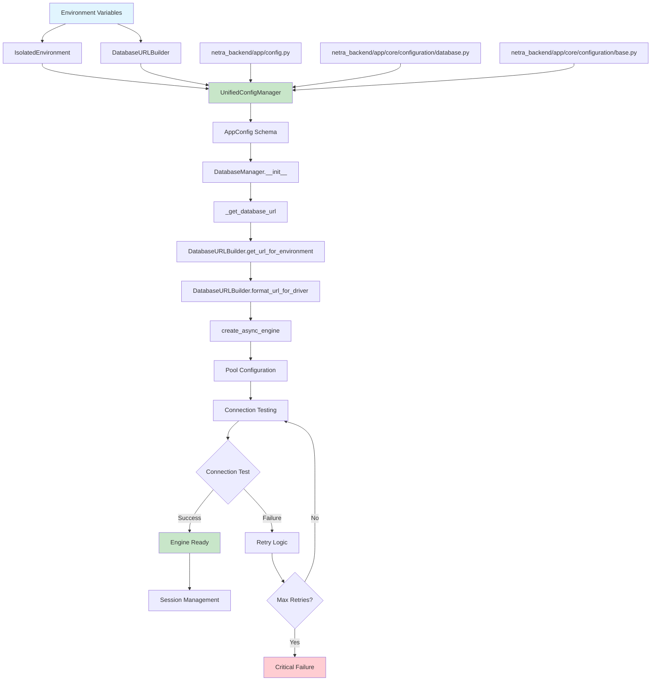

### 1.2 Database Session Lifecycle Flow

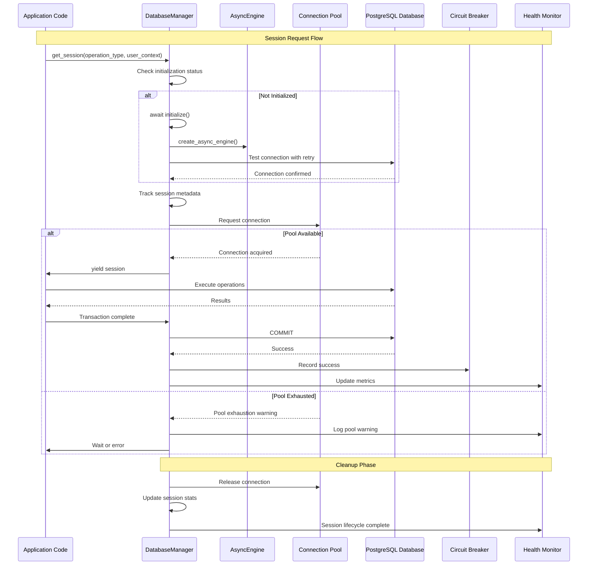

### 1.3 Error Handling and Recovery Flow

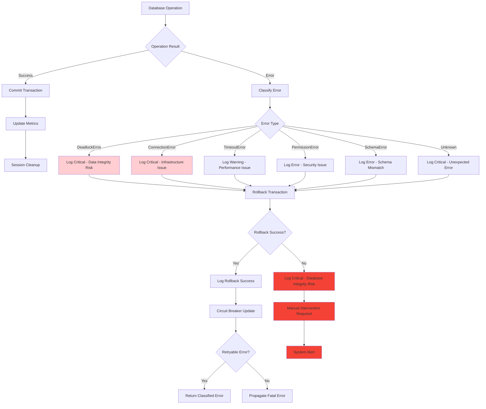

### 1.4 Infrastructure Dependencies and Networking

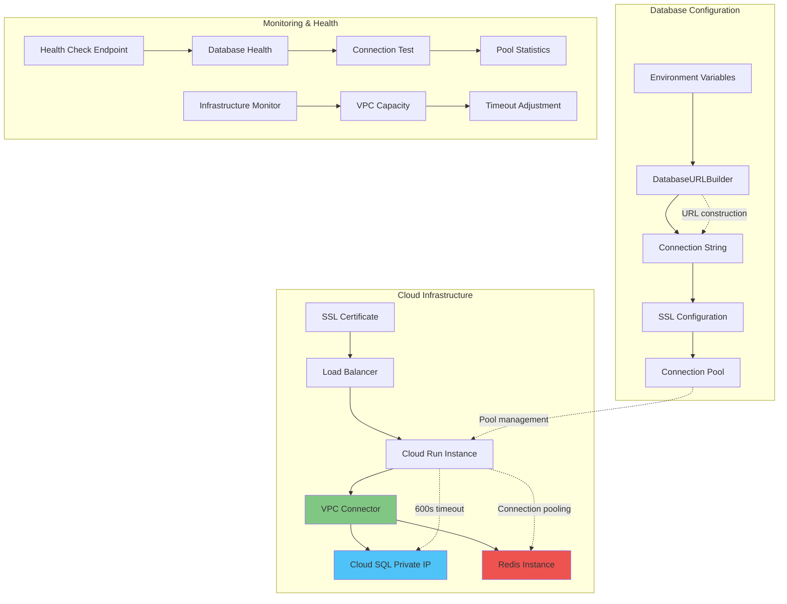

## 2. Auth Service Database Cycle

### 2.1 Auth Service Configuration and Database Flow

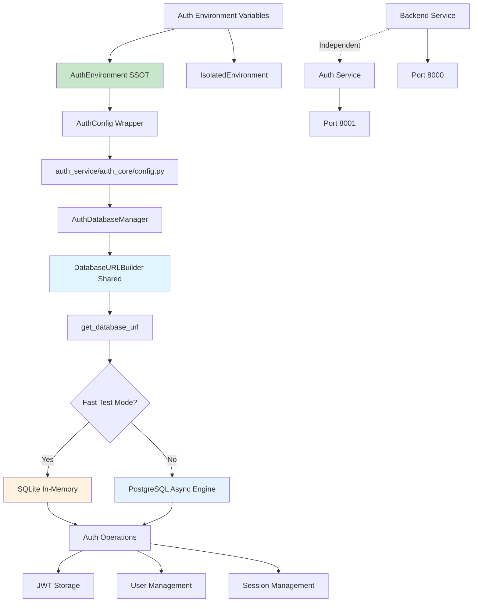

### 2.2 Auth Service Database Session Management

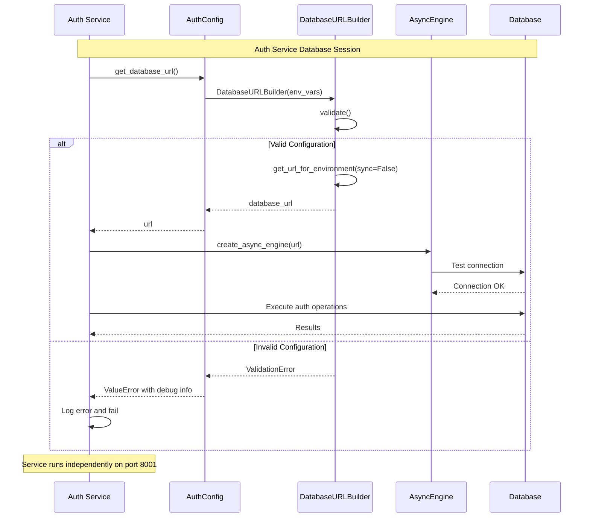

### 2.3 Auth Service Error Handling

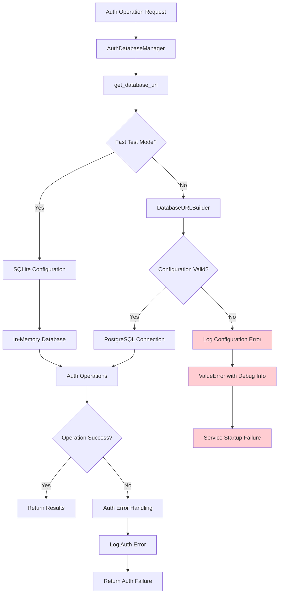

## 3. Frontend Database Integration

### 3.1 Frontend Service Dependencies

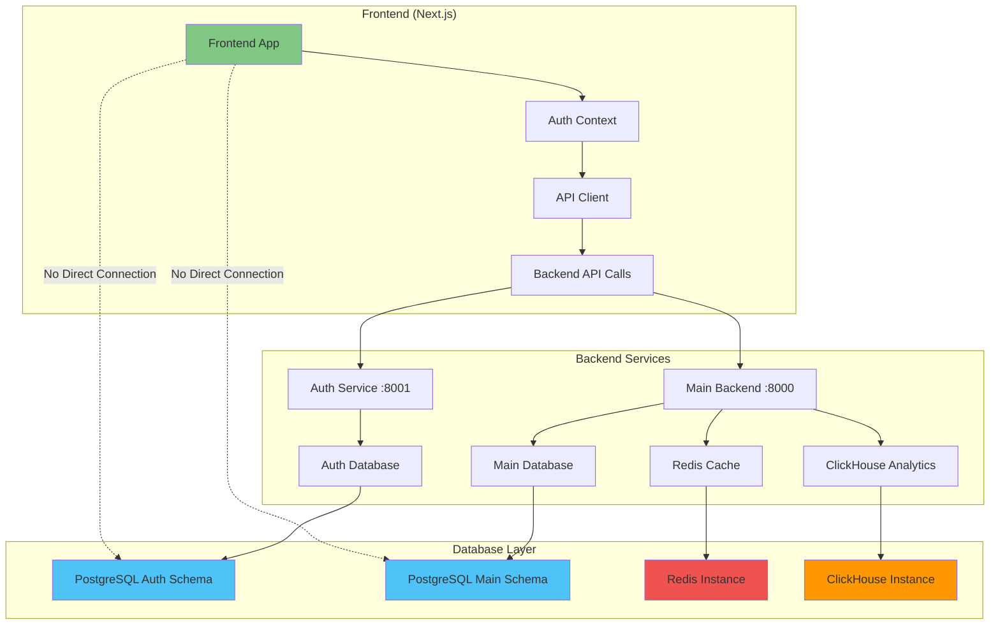

### 3.2 Frontend API Integration Flow

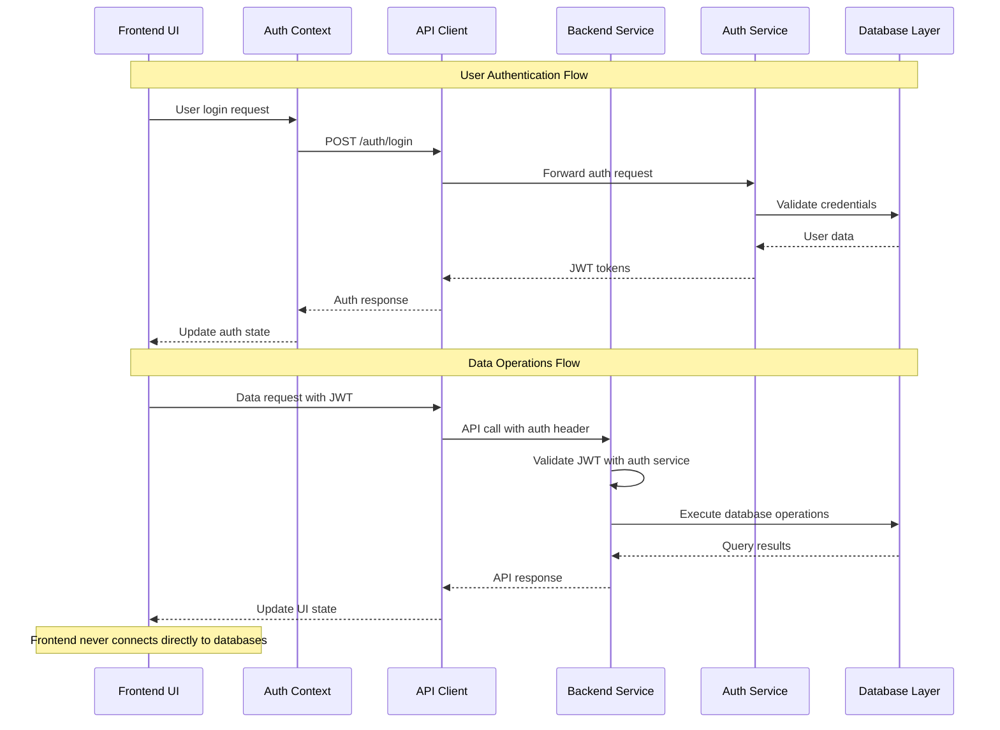

## 4. Networking Assumptions and Dependencies

### 4.1 Network Architecture Overview

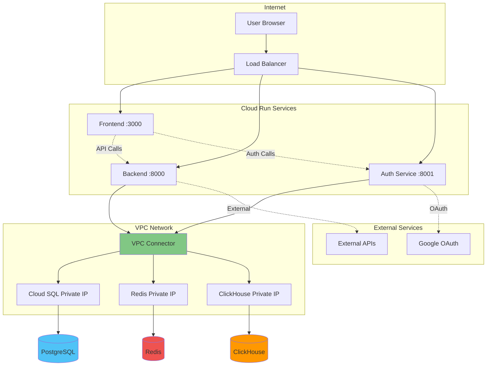

### 4.2 Timeout and Retry Configuration

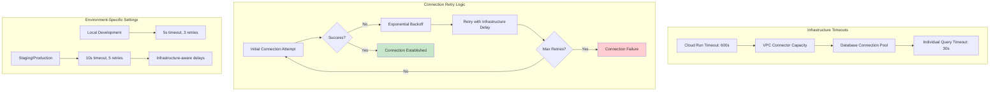

## 5. Success and Error States Mapping

### 5.1 Complete Success Flow

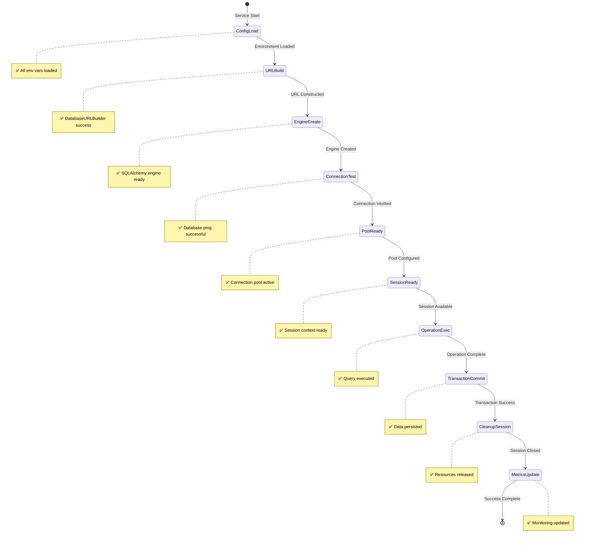

### 5.2 Error States and Recovery

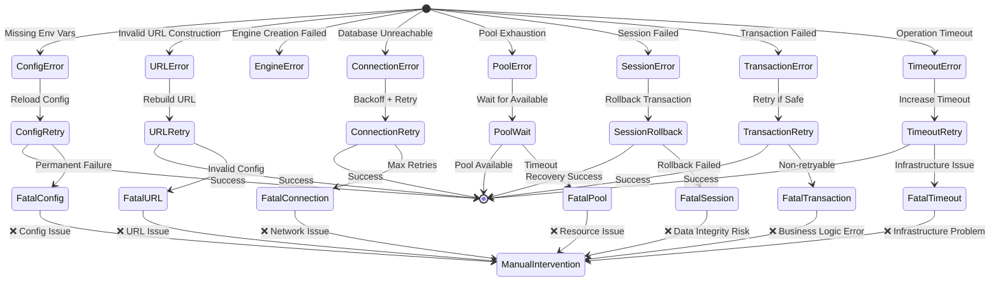

## 6. Cross-Service Integration Points

### 6.1 Service Communication Matrix

| Source Service | Target Service | Communication Type | Database Impact |
|----------------|----------------|-------------------|-----------------|
| Frontend | Backend | HTTP API + WebSocket | Triggers DB operations |
| Frontend | Auth Service | HTTP API (Auth) | JWT validation |
| Backend | Auth Service | HTTP API (Validation) | Session lookup |
| Backend | Database | SQL Connection Pool | Direct operations |
| Auth Service | Database | SQL Connection Pool | Auth operations |

### 6.2 Configuration Cross-References

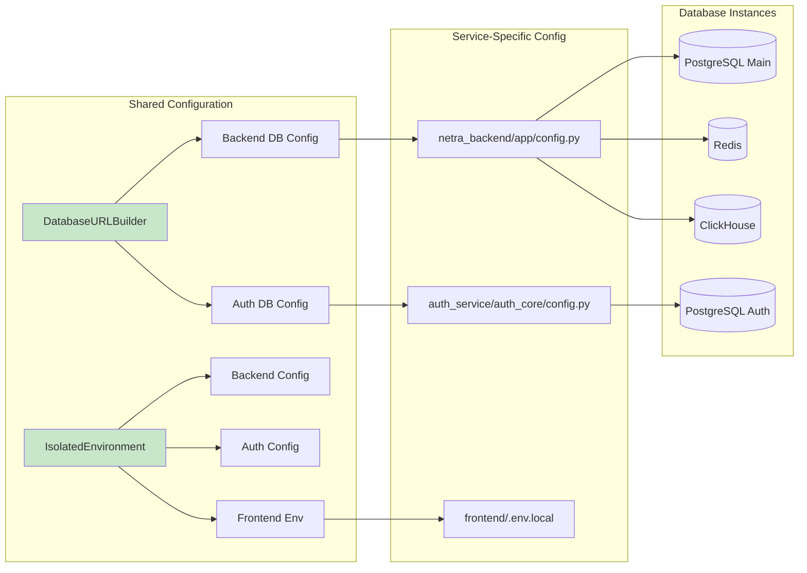

## Summary

This comprehensive database architecture documentation shows:

1. **Configuration Flow**: From environment variables through SSOT systems to runtime configuration
2. **Connection Management**: Pool configuration, retry logic, and timeout handling
3. **Error Handling**: Complete error classification and recovery procedures
4. **Service Independence**: Each service manages its own database connections
5. **Infrastructure Dependencies**: VPC connectors, SSL, and Cloud Run requirements
6. **Monitoring Integration**: Health checks, metrics, and alerting

Each service follows the established patterns while maintaining independence and reliability through the shared SSOT components like `DatabaseURLBuilder` and `IsolatedEnvironment`.