# Netra Apex System Architecture Maps - Comprehensive System Diagrams

**Created:** 2025-09-16  
**Purpose:** Complete system maps at various levels of detail including known issues, test coverage, and golden path status  
**Status:** Based on current codebase analysis and infrastructure health audit (Issue #1176)

This document provides comprehensive end-to-end diagrams for the entire Netra Apex system, from high-level business architecture to detailed service interactions, **highlighting critical issues, test coverage gaps, and architectural vulnerabilities** that impact the Golden Path functionality protecting $500K+ ARR.

## 🚨 Critical Gaps Summary

| Category | Gap | Impact | Risk Level |
|----------|-----|--------|------------|
| **Configuration** | No config validation at startup | Silent failures, wrong env configs | 🔴 HIGH |
| **Connection Management** | No connection leak detection | Memory exhaustion | 🔴 HIGH |
| **Error Handling** | Inconsistent error propagation | Lost user data, silent failures | 🔴 HIGH |
| **Service Communication** | No circuit breaker between services | Cascade failures | 🟡 MEDIUM |
| **Infrastructure** | Single point of failure in VPC connector | Complete service outage | 🔴 HIGH |
| **Monitoring** | No proactive database capacity monitoring | Unexpected downtime | 🟡 MEDIUM |
| **Security** | Database credentials in plain environment vars | Security breach risk | 🔴 HIGH |

## 1. Main Backend Service Database Cycle

### 1.1 Configuration Loading and Initialization Flow ⚠️ GAPS IDENTIFIED

```mermaid
flowchart TD
    %% Configuration Sources - GAPS HIGHLIGHTED
    A[Environment Variables] --> B[IsolatedEnvironment]
    A --> C[DatabaseURLBuilder]
    
    %% GAP: No validation of critical env vars at startup
    A --> GAP1[❌ GAP: No env validation]
    GAP1 --> RISK1[🚨 RISK: Wrong environment configs]
    
    %% Configuration Management SSOT
    B --> D[UnifiedConfigManager]
    C --> D
    D --> E[AppConfig Schema]
    
    %% GAP: Config schema validation happens too late
    E --> GAP2[❌ GAP: Late schema validation]
    GAP2 --> RISK2[🚨 RISK: Runtime config failures]
    
    %% Configuration Access Points
    F[netra_backend/app/config.py] --> D
    G[netra_backend/app/core/configuration/database.py] --> D
    H[netra_backend/app/core/configuration/base.py] --> D
    
    %% Database Manager Initialization
    E --> I[DatabaseManager.__init__]
    I --> J[_get_database_url]
    J --> K[DatabaseURLBuilder.get_url_for_environment]
    K --> L[DatabaseURLBuilder.format_url_for_driver]
    
    %% GAP: No URL validation before engine creation
    L --> GAP3[❌ GAP: No URL pre-validation]
    GAP3 --> RISK3[🚨 RISK: Invalid connection strings]
    
    %% Engine Creation
    L --> M[create_async_engine]
    M --> N[Pool Configuration]
    N --> O[Connection Testing]
    
    %% GAP: Pool configuration not environment-aware
    N --> GAP4[❌ GAP: Static pool config]
    GAP4 --> RISK4[🚨 RISK: Pool exhaustion]
    
    %% Success/Error States
    O --> P{Connection Test}
    P -->|Success| Q[Engine Ready]
    P -->|Failure| R[Retry Logic]
    R --> S{Max Retries?}
    S -->|No| O
    S -->|Yes| T[Critical Failure]
    
    %% GAP: No graceful degradation on failure
    T --> GAP5[❌ GAP: No fallback strategy]
    GAP5 --> RISK5[🚨 RISK: Complete service failure]
    
    %% Runtime Operations
    Q --> U[Session Management]
    
    style A fill:#e1f5fe
    style D fill:#c8e6c9
    style T fill:#ffcdd2
    style Q fill:#c8e6c9
    style GAP1 fill:#ff5722
    style GAP2 fill:#ff5722
    style GAP3 fill:#ff5722
    style GAP4 fill:#ff5722
    style GAP5 fill:#ff5722
    style RISK1 fill:#d32f2f
    style RISK2 fill:#d32f2f
    style RISK3 fill:#d32f2f
    style RISK4 fill:#d32f2f
    style RISK5 fill:#d32f2f
```



**🚨 Configuration Gaps Identified:**
1. **No Environment Validation**: Missing startup validation of critical environment variables
2. **Late Schema Validation**: Config schema validation happens at runtime, not startup
3. **No URL Pre-validation**: DatabaseURLBuilder URLs not validated before engine creation  
4. **Static Pool Configuration**: Pool sizes not adjusted for environment capacity
5. **No Graceful Degradation**: Complete failure when database unavailable

### 1.2 Database Session Lifecycle Flow ⚠️ CONNECTION LEAK RISKS

```mermaid
sequenceDiagram
    participant App as Application Code
    participant DM as DatabaseManager
    participant Engine as AsyncEngine
    participant Pool as Connection Pool
    participant DB as PostgreSQL Database
    participant CB as Circuit Breaker
    participant Monitor as Health Monitor
    
    Note over App,Monitor: Session Request Flow - GAPS HIGHLIGHTED
    
    App->>DM: get_session(operation_type, user_context)
    DM->>DM: Check initialization status
    
    %% GAP: No session limit per user
    Note over DM: ❌ GAP: No per-user session limits
    Note over DM: 🚨 RISK: Single user can exhaust pool
    
    alt Not Initialized
        DM->>DM: await initialize()
        DM->>Engine: create_async_engine()
        DM->>DB: Test connection with retry
        DB-->>DM: Connection confirmed
    end
    
    DM->>DM: Track session metadata
    DM->>Pool: Request connection
    
    alt Pool Available
        Pool-->>DM: Connection acquired
        DM->>App: yield session
        
        %% GAP: No transaction timeout enforcement
        Note over App,DB: ❌ GAP: No transaction timeouts
        App->>DB: Execute operations
        Note over App,DB: 🚨 RISK: Long-running transactions
        DB-->>App: Results
        
        App->>DM: Transaction complete
        DM->>DB: COMMIT
        DB-->>DM: Success
        
        DM->>CB: Record success
        DM->>Monitor: Update metrics
        
    else Pool Exhausted
        Pool-->>DM: Pool exhaustion warning
        DM->>Monitor: Log pool warning
        %% GAP: No proper backpressure mechanism
        Note over DM,App: ❌ GAP: No backpressure mechanism
        DM->>App: Wait or error
        Note over DM,App: 🚨 RISK: Cascading failures
    end
    
    Note over DM,Monitor: Cleanup Phase - LEAK RISKS
    DM->>Pool: Release connection
    %% GAP: No guarantee connection is actually released
    Note over DM,Pool: ❌ GAP: No connection leak detection
    DM->>DM: Update session stats
    Note over DM: 🚨 RISK: Memory leaks from unreleased connections
    DM->>Monitor: Session lifecycle complete
```



**🚨 Session Management Gaps:**
1. **No Per-User Session Limits**: Single user can exhaust entire connection pool
2. **No Transaction Timeouts**: Long-running transactions can block resources
3. **No Backpressure Mechanism**: Pool exhaustion leads to cascading failures
4. **No Connection Leak Detection**: Unreleased connections cause memory leaks
5. **No Session Priority**: Critical operations can't preempt low-priority sessions

### 1.3 Error Handling and Recovery Flow ⚠️ SILENT FAILURE RISKS

```mermaid
flowchart TD
    A[Database Operation] --> B{Operation Result}
    
    B -->|Success| C[Commit Transaction]
    C --> D[Update Metrics]
    D --> E[Session Cleanup]
    
    B -->|Error| F[Classify Error]
    F --> G{Error Type}
    
    %% GAP: Error classification may miss edge cases
    F --> GAP1[❌ GAP: Incomplete error classification]
    GAP1 --> RISK1[🚨 RISK: Unhandled error types]
    
    G -->|DeadlockError| H[Log Critical - Data Integrity Risk]
    G -->|ConnectionError| I[Log Critical - Infrastructure Issue]
    G -->|TimeoutError| J[Log Warning - Performance Issue]
    G -->|PermissionError| K[Log Error - Security Issue]
    G -->|SchemaError| L[Log Error - Schema Mismatch]
    G -->|Unknown| M[Log Critical - Unexpected Error]
    
    %% GAP: No error correlation across requests
    M --> GAP2[❌ GAP: No error correlation]
    GAP2 --> RISK2[🚨 RISK: Pattern detection failure]
    
    H --> N[Rollback Transaction]
    I --> N
    J --> N
    K --> N
    L --> N
    M --> N
    
    N --> O{Rollback Success?}
    O -->|Yes| P[Log Rollback Success]
    O -->|No| Q[Log Critical - Database Integrity Risk]
    
    %% GAP: No automatic error escalation
    P --> GAP3[❌ GAP: No error escalation policy]
    GAP3 --> RISK3[🚨 RISK: Silent degradation]
    
    P --> R[Circuit Breaker Update]
    Q --> S[Manual Intervention Required]
    
    %% GAP: Circuit breaker not integrated across services
    R --> GAP4[❌ GAP: Service-local circuit breaker]
    GAP4 --> RISK4[🚨 RISK: Cascade failures between services]
    
    R --> T{Retryable Error?}
    T -->|Yes| U[Return Classified Error]
    T -->|No| V[Propagate Fatal Error]
    
    %% GAP: No retry exhaustion handling
    U --> GAP5[❌ GAP: No retry limit tracking]
    GAP5 --> RISK5[🚨 RISK: Infinite retry loops]
    
    S --> W[System Alert]
    
    style H fill:#ffcdd2
    style I fill:#ffcdd2
    style Q fill:#f44336
    style S fill:#f44336
    style W fill:#f44336
    style GAP1 fill:#ff5722
    style GAP2 fill:#ff5722
    style GAP3 fill:#ff5722
    style GAP4 fill:#ff5722
    style GAP5 fill:#ff5722
    style RISK1 fill:#d32f2f
    style RISK2 fill:#d32f2f
    style RISK3 fill:#d32f2f
    style RISK4 fill:#d32f2f
    style RISK5 fill:#d32f2f
```



**🚨 Error Handling Gaps:**
1. **Incomplete Error Classification**: New error types may not be properly handled
2. **No Error Correlation**: Cannot detect patterns across multiple failed requests
3. **No Error Escalation Policy**: Silent degradation without alerting
4. **Service-Local Circuit Breaker**: No coordination between services during failures
5. **No Retry Limit Tracking**: Potential for infinite retry loops consuming resources
6. **No User Impact Assessment**: Errors not classified by user impact severity

### 1.4 Infrastructure Dependencies and Networking ⚠️ SINGLE POINTS OF FAILURE

```mermaid
graph TD
    subgraph "Cloud Infrastructure - SPOF RISKS"
        A[Cloud Run Instance] --> B[VPC Connector]
        B --> C[Cloud SQL Private IP]
        B --> D[Redis Instance]
        
        %% SPOF: VPC Connector
        B --> SPOF1[❌ SPOF: VPC Connector]
        SPOF1 --> RISK1[🚨 RISK: Complete service outage]
        
        E[Load Balancer] --> A
        F[SSL Certificate] --> E
        
        %% GAP: No SSL failover
        F --> GAP1[❌ GAP: No SSL certificate failover]
        GAP1 --> RISK2[🚨 RISK: HTTPS failures]
    end
    
    subgraph "Database Configuration - SECURITY GAPS"
        G[Environment Variables] --> H[DatabaseURLBuilder]
        H --> I[Connection String]
        I --> J[SSL Configuration]
        J --> K[Connection Pool]
        
        %% GAP: Credentials in plain text
        G --> GAP2[❌ GAP: Plain text credentials]
        GAP2 --> RISK3[🚨 RISK: Credential exposure]
        
        %% GAP: No connection encryption validation
        J --> GAP3[❌ GAP: No SSL validation]
        GAP3 --> RISK4[🚨 RISK: Unencrypted connections]
    end
    
    subgraph "Monitoring & Health - BLIND SPOTS"
        L[Health Check Endpoint] --> M[Database Health]
        M --> N[Connection Test]
        N --> O[Pool Statistics]
        
        %% GAP: No proactive monitoring
        O --> GAP4[❌ GAP: Reactive monitoring only]
        GAP4 --> RISK5[🚨 RISK: Unexpected downtime]
        
        P[Infrastructure Monitor] --> Q[VPC Capacity]
        Q --> R[Timeout Adjustment]
        
        %% GAP: No capacity prediction
        Q --> GAP5[❌ GAP: No capacity forecasting]
        GAP5 --> RISK6[🚨 RISK: Sudden capacity exhaustion]
    end
    
    %% Connections with risks
    A -.->|600s timeout| C
    A -.->|Connection pooling| D
    H -.->|URL construction| I
    K -.->|Pool management| A
    
    %% GAP: No network partition handling
    A --> GAP6[❌ GAP: No network partition handling]
    GAP6 --> RISK7[🚨 RISK: Split-brain scenarios]
    
    style C fill:#4fc3f7
    style D fill:#ef5350
    style B fill:#81c784
    style SPOF1 fill:#ff5722
    style GAP1 fill:#ff5722
    style GAP2 fill:#ff5722
    style GAP3 fill:#ff5722
    style GAP4 fill:#ff5722
    style GAP5 fill:#ff5722
    style GAP6 fill:#ff5722
    style RISK1 fill:#d32f2f
    style RISK2 fill:#d32f2f
    style RISK3 fill:#d32f2f
    style RISK4 fill:#d32f2f
    style RISK5 fill:#d32f2f
    style RISK6 fill:#d32f2f
    style RISK7 fill:#d32f2f
```



**🚨 Infrastructure Gaps:**
1. **Single Point of Failure**: VPC Connector failure causes complete outage
2. **No SSL Certificate Failover**: Certificate issues block all HTTPS traffic
3. **Plain Text Credentials**: Database credentials stored in environment variables
4. **No SSL Validation**: Connections may fall back to unencrypted
5. **Reactive Monitoring Only**: No proactive capacity or health forecasting
6. **No Capacity Forecasting**: Sudden resource exhaustion without warning
7. **No Network Partition Handling**: Split-brain scenarios during network issues

## 2. Auth Service Database Cycle ⚠️ SERVICE ISOLATION GAPS

### 2.1 Auth Service Configuration and Database Flow ⚠️ SHARED DEPENDENCIES

```mermaid
flowchart TD
    %% Configuration Sources
    A[Auth Environment Variables] --> B[AuthEnvironment SSOT]
    A --> C[IsolatedEnvironment]
    
    %% GAP: Shared environment dependencies
    C --> GAP1[❌ GAP: Shared IsolatedEnvironment]
    GAP1 --> RISK1[🚨 RISK: Cross-service config pollution]
    
    %% Auth Configuration Management
    B --> D[AuthConfig Wrapper]
    D --> E[auth_service/auth_core/config.py]
    
    %% Database Manager
    E --> F[AuthDatabaseManager]
    F --> G[DatabaseURLBuilder Shared]
    
    %% GAP: Shared database URL builder
    G --> GAP2[❌ GAP: Shared DatabaseURLBuilder]
    GAP2 --> RISK2[🚨 RISK: Backend config affects auth service]
    
    G --> H[get_database_url]
    
    %% Engine Creation for Auth
    H --> I{Fast Test Mode?}
    I -->|Yes| J[SQLite In-Memory]
    I -->|No| K[PostgreSQL Async Engine]
    
    %% GAP: No validation of test mode isolation
    J --> GAP3[❌ GAP: Test isolation not validated]
    GAP3 --> RISK3[🚨 RISK: Test data leakage]
    
    %% Auth Database Operations
    J --> L[Auth Operations]
    K --> L
    L --> M[JWT Storage]
    L --> N[User Management]
    L --> O[Session Management]
    
    %% GAP: No auth operation monitoring
    L --> GAP4[❌ GAP: No auth operation monitoring]
    GAP4 --> RISK4[🚨 RISK: Undetected auth failures]
    
    %% Service Independence - GAPS
    P[Backend Service] -.->|Independent| Q[Auth Service]
    Q --> R[Port 8001]
    P --> S[Port 8000]
    
    %% GAP: Service communication not secured
    P --> GAP5[❌ GAP: Unsecured service communication]
    GAP5 --> RISK5[🚨 RISK: Service impersonation]
    
    style B fill:#c8e6c9
    style G fill:#e1f5fe
    style J fill:#fff3e0
    style K fill:#e3f2fd
    style GAP1 fill:#ff5722
    style GAP2 fill:#ff5722
    style GAP3 fill:#ff5722
    style GAP4 fill:#ff5722
    style GAP5 fill:#ff5722
    style RISK1 fill:#d32f2f
    style RISK2 fill:#d32f2f
    style RISK3 fill:#d32f2f
    style RISK4 fill:#d32f2f
    style RISK5 fill:#d32f2f
```



**🚨 Auth Service Gaps:**
1. **Shared IsolatedEnvironment**: Cross-service configuration pollution risk
2. **Shared DatabaseURLBuilder**: Backend configuration changes affect auth service
3. **Test Isolation Not Validated**: Test data may leak between environments
4. **No Auth Operation Monitoring**: Authentication failures go undetected
5. **Unsecured Service Communication**: No protection against service impersonation

### 2.2 Auth Service Database Session Management


### 2.3 Auth Service Error Handling


## 3. Frontend Database Integration

### 3.1 Frontend Service Dependencies


### 3.2 Frontend API Integration Flow


## 4. Networking Assumptions and Dependencies

### 4.1 Network Architecture Overview


### 4.2 Timeout and Retry Configuration


## 5. Success and Error States Mapping ⚠️ HIDDEN FAILURE POINTS

### 5.1 Complete Success Flow ⚠️ OPTIMISTIC ASSUMPTIONS

```mermaid
stateDiagram-v2
    [*] --> ConfigLoad : Service Start
    ConfigLoad --> URLBuild : Environment Loaded
    URLBuild --> EngineCreate : URL Constructed
    EngineCreate --> ConnectionTest : Engine Created
    ConnectionTest --> PoolReady : Connection Verified
    PoolReady --> SessionReady : Pool Configured
    SessionReady --> OperationExec : Session Available
    OperationExec --> TransactionCommit : Operation Complete
    TransactionCommit --> CleanupSession : Transaction Success
    CleanupSession --> MetricsUpdate : Session Closed
    MetricsUpdate --> [*] : Success Complete
    
    %% GAPS: Hidden failure points
    ConfigLoad --> ConfigGap : ❌ GAP: No validation
    URLBuild --> URLGap : ❌ GAP: No URL validation
    EngineCreate --> EngineGap : ❌ GAP: No resource limits
    ConnectionTest --> ConnGap : ❌ GAP: No load testing
    PoolReady --> PoolGap : ❌ GAP: No pool monitoring
    SessionReady --> SessionGap : ❌ GAP: No session limits
    OperationExec --> OpGap : ❌ GAP: No operation timeouts
    TransactionCommit --> TxnGap : ❌ GAP: No commit validation
    CleanupSession --> CleanGap : ❌ GAP: No cleanup verification
    MetricsUpdate --> MetricGap : ❌ GAP: No metric validation
    
    ConfigGap --> [*] : 🚨 Silent config failure
    URLGap --> [*] : 🚨 Invalid URL in production
    EngineGap --> [*] : 🚨 Resource exhaustion
    ConnGap --> [*] : 🚨 Connection under load fails
    PoolGap --> [*] : 🚨 Pool leaks undetected
    SessionGap --> [*] : 🚨 Session exhaustion
    OpGap --> [*] : 🚨 Operation hangs indefinitely
    TxnGap --> [*] : 🚨 Partial data corruption
    CleanGap --> [*] : 🚨 Resource leaks
    MetricGap --> [*] : 🚨 Monitoring blind spots
    
    note right of ConfigLoad : ✅ All env vars loaded (BUT: No validation)
    note right of URLBuild : ✅ DatabaseURLBuilder success (BUT: No URL validation)
    note right of EngineCreate : ✅ SQLAlchemy engine ready (BUT: No resource limits)
    note right of ConnectionTest : ✅ Database ping successful (BUT: No load testing)
    note right of PoolReady : ✅ Connection pool active (BUT: No pool monitoring)
    note right of SessionReady : ✅ Session context ready (BUT: No session limits)
    note right of OperationExec : ✅ Query executed (BUT: No operation timeouts)
    note right of TransactionCommit : ✅ Data persisted (BUT: No commit validation)
    note right of CleanupSession : ✅ Resources released (BUT: No cleanup verification)
    note right of MetricsUpdate : ✅ Monitoring updated (BUT: No metric validation)
```

### 5.2 Error States and Recovery

```mermaid
stateDiagram-v2
    [*] --> ConfigError : Missing Env Vars
    [*] --> URLError : Invalid URL Construction
    [*] --> EngineError : Engine Creation Failed
    [*] --> ConnectionError : Database Unreachable
    [*] --> PoolError : Pool Exhaustion
    [*] --> SessionError : Session Failed
    [*] --> TransactionError : Transaction Failed
    [*] --> TimeoutError : Operation Timeout
    
    ConfigError --> ConfigRetry : Reload Config
    ConfigRetry --> [*] : Success
    ConfigRetry --> FatalConfig : Permanent Failure
    
    URLError --> URLRetry : Rebuild URL
    URLRetry --> [*] : Success
    URLRetry --> FatalURL : Invalid Config
    
    ConnectionError --> ConnectionRetry : Backoff + Retry
    ConnectionRetry --> [*] : Success
    ConnectionRetry --> FatalConnection : Max Retries
    
    PoolError --> PoolWait : Wait for Available
    PoolWait --> [*] : Pool Available
    PoolWait --> FatalPool : Timeout
    
    SessionError --> SessionRollback : Rollback Transaction
    SessionRollback --> [*] : Recovery Success
    SessionRollback --> FatalSession : Rollback Failed
    
    TransactionError --> TransactionRetry : Retry if Safe
    TransactionRetry --> [*] : Success
    TransactionRetry --> FatalTransaction : Non-retryable
    
    TimeoutError --> TimeoutRetry : Increase Timeout
    TimeoutRetry --> [*] : Success
    TimeoutRetry --> FatalTimeout : Infrastructure Issue
    
    FatalConfig --> ManualIntervention : ❌ Config Issue
    FatalURL --> ManualIntervention : ❌ URL Issue
    FatalConnection --> ManualIntervention : ❌ Network Issue
    FatalPool --> ManualIntervention : ❌ Resource Issue
    FatalSession --> ManualIntervention : ❌ Data Integrity Risk
    FatalTransaction --> ManualIntervention : ❌ Business Logic Error
    FatalTimeout --> ManualIntervention : ❌ Infrastructure Problem
```



## 6. Cross-Service Integration Points

### 6.1 Service Communication Matrix

| Source Service | Target Service | Communication Type | Database Impact |
|----------------|----------------|-------------------|-----------------|
| Frontend | Backend | HTTP API + WebSocket | Triggers DB operations |
| Frontend | Auth Service | HTTP API (Auth) | JWT validation |
| Backend | Auth Service | HTTP API (Validation) | Session lookup |
| Backend | Database | SQL Connection Pool | Direct operations |
| Auth Service | Database | SQL Connection Pool | Auth operations |

### 6.2 Configuration Cross-References


## 🚨 Critical Remediation Priorities

Based on this gap analysis, these are the **immediate risks** that could impact the Golden Path:

### Priority 1: HIGH RISK (Business Impact)
1. **Connection Pool Exhaustion**: Single user can exhaust entire pool → Service outage
2. **VPC Connector SPOF**: Infrastructure failure → Complete service failure  
3. **Plain Text Credentials**: Security breach risk → Data compromise
4. **No Transaction Timeouts**: Long-running operations → Resource starvation
5. **Service Communication Unsecured**: Service impersonation → Security breach

### Priority 2: MEDIUM RISK (Operational Impact)
1. **No Error Correlation**: Cannot detect attack patterns or systematic issues
2. **Shared Configuration Dependencies**: Cross-service configuration pollution
3. **No Connection Leak Detection**: Memory exhaustion over time
4. **Reactive Monitoring Only**: Unexpected downtime without warning
5. **No Graceful Degradation**: Complete failure instead of degraded service

### Priority 3: MONITORING GAPS (Visibility Impact)
1. **No Auth Operation Monitoring**: Silent authentication failures
2. **No Pool Statistics Monitoring**: Resource usage blind spots  
3. **No SSL Certificate Monitoring**: HTTPS failures without warning
4. **No Capacity Forecasting**: Sudden resource exhaustion
5. **No Network Partition Handling**: Split-brain scenarios

## Architectural Debt Summary

| Component | Debt Level | Technical Risk | Business Risk | Effort to Fix |
|-----------|------------|---------------|---------------|---------------|
| **Connection Management** | 🔴 HIGH | Pool exhaustion, leaks | Service outages | Medium |
| **Configuration Validation** | 🔴 HIGH | Silent failures | Wrong environment configs | Low |
| **Service Communication** | 🔴 HIGH | Security vulnerabilities | Data breach | High |
| **Error Handling** | 🟡 MEDIUM | Silent degradation | Lost user data | Medium |
| **Infrastructure** | 🔴 HIGH | Single points of failure | Complete outages | High |
| **Monitoring** | 🟡 MEDIUM | Operational blind spots | Unexpected downtime | Low |

## Recommended Immediate Actions

1. **Implement Connection Limits**: Per-user session limits and timeout enforcement
2. **Add Configuration Validation**: Startup validation of all critical environment variables
3. **Secure Service Communication**: Service-to-service authentication tokens
4. **Add Connection Leak Detection**: Monitor and alert on unreleased connections
5. **Implement Circuit Breakers**: Cross-service failure coordination
6. **Add Proactive Monitoring**: Capacity forecasting and health prediction

## Summary

This comprehensive database architecture documentation reveals **significant gaps** that pose risks to the Golden Path:

1. **Configuration Flow**: ⚠️ **Missing validation** at startup allows wrong configurations in production
2. **Connection Management**: ⚠️ **No user limits or leak detection** leading to resource exhaustion
3. **Error Handling**: ⚠️ **Incomplete error correlation** preventing pattern detection
4. **Service Independence**: ⚠️ **Shared dependencies** creating cross-service pollution risks
5. **Infrastructure Dependencies**: ⚠️ **Single points of failure** with no graceful degradation
6. **Monitoring Integration**: ⚠️ **Reactive only** with no proactive capacity management

**Critical Finding**: While the SSOT architecture provides consistency, the lack of validation, limits, and monitoring creates hidden failure modes that could impact the core business goal of reliable AI chat functionality.