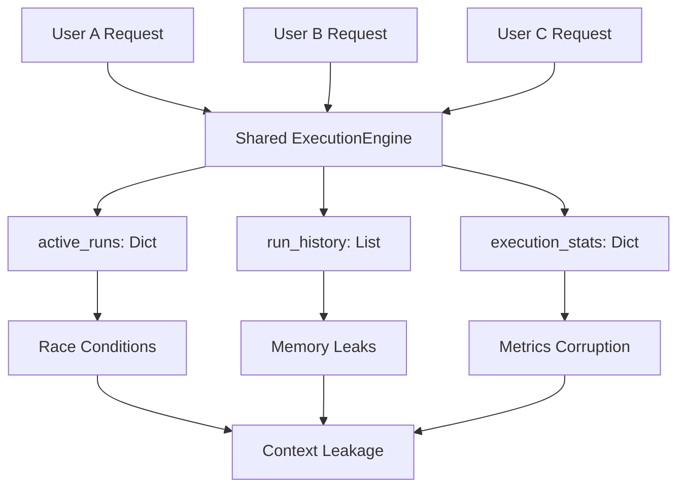
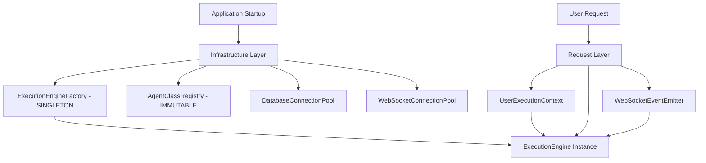
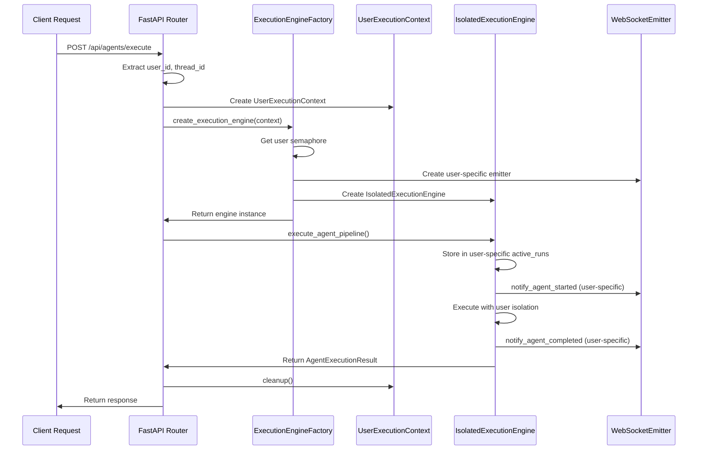

# ExecutionFactory Pattern Design

**Design Date:** 2025-09-02  
**Mission:** Replace dangerous ExecutionEngine shared state with per-request factory pattern  
**Business Impact:** Enable 10+ concurrent users with zero context leakage and proper isolation

## Executive Summary

This document designs a comprehensive ExecutionFactory pattern to replace the current ExecutionEngine's shared state architecture that creates critical concurrency risks and user context leakage.

**Key Problems Solved:**
1. **User Context Isolation** - Separate execution state per user/request
2. **Thread Safety** - Eliminate race conditions in shared dictionaries
3. **Memory Management** - Prevent unbounded growth of shared state
4. **Scalability** - Support 10+ concurrent users safely
5. **Resource Cleanup** - Proper lifecycle management

## 1. Current Architecture Problems

### 1.1 Shared State Issues
```python
# CURRENT PROBLEMATIC PATTERN
class ExecutionEngine:
    def __init__(self, registry, websocket_bridge):
        # CRITICAL: These are shared across ALL users
        self.active_runs: Dict[str, AgentExecutionContext] = {}
        self.run_history: List[AgentExecutionResult] = []
        self.execution_stats = {...}  # Shared metrics
        self.execution_semaphore = asyncio.Semaphore(10)  # Global limit
```

### 1.2 Concurrency Risks


## 2. Factory Pattern Architecture

### 2.1 Infrastructure vs Request Layer Separation



### 2.2 Core Factory Interface

```python
@dataclass
class UserExecutionContext:
    """Per-request execution context with complete isolation."""
    user_id: str
    request_id: str
    thread_id: str
    session_id: Optional[str] = None
    created_at: datetime = field(default_factory=lambda: datetime.now(timezone.utc))
    
    # User-specific execution state
    active_runs: Dict[str, AgentExecutionContext] = field(default_factory=dict)
    run_history: List[AgentExecutionResult] = field(default_factory=list)
    execution_metrics: Dict[str, Any] = field(default_factory=dict)
    
    # Resource management
    cleanup_callbacks: List[Callable] = field(default_factory=list)
    _is_cleaned: bool = False
    
    async def cleanup(self) -> None:
        """Clean up user-specific resources."""
        if self._is_cleaned:
            return
            
        for callback in self.cleanup_callbacks:
            try:
                await callback()
            except Exception as e:
                logger.error(f"Cleanup callback failed for user {self.user_id}: {e}")
                
        self._is_cleaned = True


class ExecutionEngineFactory:
    """Factory for creating per-request ExecutionEngine instances."""
    
    def __init__(self):
        # Infrastructure components (shared, immutable)
        self._agent_registry = None
        self._websocket_bridge_factory = None
        self._db_connection_pool = None
        
        # Infrastructure settings
        self._max_concurrent_per_user = 5
        self._execution_timeout = 30.0
        self._cleanup_interval = 300  # 5 minutes
        
        # Per-user semaphores (infrastructure manages this)
        self._user_semaphores: Dict[str, asyncio.Semaphore] = {}
        self._semaphore_lock = asyncio.Lock()
        
    def configure(self, 
                 agent_registry: 'AgentRegistry',
                 websocket_bridge_factory: 'WebSocketBridgeFactory',
                 db_connection_pool: Any) -> None:
        """Configure factory with infrastructure components."""
        self._agent_registry = agent_registry
        self._websocket_bridge_factory = websocket_bridge_factory
        self._db_connection_pool = db_connection_pool
        
    async def create_execution_engine(self, 
                                    user_context: UserExecutionContext) -> 'IsolatedExecutionEngine':
        """Create a per-request ExecutionEngine instance."""
        if not self._agent_registry:
            raise RuntimeError("Factory not configured - call configure() first")
            
        # Get or create user-specific semaphore
        user_semaphore = await self._get_user_semaphore(user_context.user_id)
        
        # Create user-specific WebSocket event emitter
        websocket_emitter = await self._websocket_bridge_factory.create_user_emitter(
            user_context.user_id, 
            user_context.thread_id
        )
        
        # Create isolated execution engine
        engine = IsolatedExecutionEngine(
            user_context=user_context,
            agent_registry=self._agent_registry,  # Shared, immutable
            websocket_emitter=websocket_emitter,  # Per-user
            execution_semaphore=user_semaphore,   # Per-user
            execution_timeout=self._execution_timeout
        )
        
        # Register cleanup
        user_context.cleanup_callbacks.append(engine.cleanup)
        user_context.cleanup_callbacks.append(websocket_emitter.cleanup)
        
        return engine
        
    async def _get_user_semaphore(self, user_id: str) -> asyncio.Semaphore:
        """Get or create per-user execution semaphore."""
        async with self._semaphore_lock:
            if user_id not in self._user_semaphores:
                self._user_semaphores[user_id] = asyncio.Semaphore(self._max_concurrent_per_user)
            return self._user_semaphores[user_id]
```

### 2.3 Isolated Execution Engine

```python
class IsolatedExecutionEngine:
    """Per-request ExecutionEngine with complete user isolation."""
    
    def __init__(self, 
                 user_context: UserExecutionContext,
                 agent_registry: 'AgentRegistry',
                 websocket_emitter: 'UserWebSocketEmitter',
                 execution_semaphore: asyncio.Semaphore,
                 execution_timeout: float):
        
        self.user_context = user_context
        self.agent_registry = agent_registry  # Shared, immutable
        self.websocket_emitter = websocket_emitter  # Per-user
        self.execution_semaphore = execution_semaphore  # Per-user
        self.execution_timeout = execution_timeout
        
        # Initialize per-request components
        self._init_user_components()
        
    def _init_user_components(self) -> None:
        """Initialize user-specific execution components."""
        # Each component gets user context for complete isolation
        self.periodic_update_manager = PeriodicUpdateManager(
            self.websocket_emitter, 
            self.user_context
        )
        
        self.agent_core = AgentExecutionCore(
            self.agent_registry,  # Shared
            self.websocket_emitter,  # Per-user
            self.user_context  # Per-user
        )
        
        self.fallback_manager = FallbackManager(
            self.websocket_emitter,
            self.user_context
        )
        
        # User-specific execution tracker
        self.execution_tracker = ExecutionTracker(self.user_context.user_id)
        
    async def execute_agent_pipeline(self, 
                                   agent_name: str, 
                                   state: DeepAgentState) -> AgentExecutionResult:
        """Execute agent pipeline with complete user isolation."""
        run_id = f"{self.user_context.user_id}_{agent_name}_{int(time.time() * 1000)}"
        
        # Create execution context - stored in USER-SPECIFIC active_runs
        execution_context = AgentExecutionContext(
            run_id=run_id,
            agent_name=agent_name,
            state=state,
            user_id=self.user_context.user_id,
            thread_id=self.user_context.thread_id,
            started_at=datetime.now(timezone.utc)
        )
        
        try:
            # Store in USER-SPECIFIC dictionary
            self.user_context.active_runs[run_id] = execution_context
            
            # Acquire USER-SPECIFIC semaphore
            async with self.execution_semaphore:
                
                # User-specific WebSocket notification
                await self.websocket_emitter.notify_agent_started(
                    user_id=self.user_context.user_id,
                    agent_name=agent_name,
                    run_id=run_id
                )
                
                # Execute with timeout
                result = await asyncio.wait_for(
                    self._execute_with_monitoring(execution_context),
                    timeout=self.execution_timeout
                )
                
                # Store in USER-SPECIFIC history
                self.user_context.run_history.append(result)
                
                # Trim history to prevent memory leaks
                if len(self.user_context.run_history) > 100:
                    self.user_context.run_history = self.user_context.run_history[-50:]
                
                return result
                
        except asyncio.TimeoutError:
            logger.error(f"Agent execution timeout for user {self.user_context.user_id}: {agent_name}")
            await self.websocket_emitter.notify_agent_timeout(
                self.user_context.user_id, agent_name, run_id
            )
            raise
            
        finally:
            # Clean up USER-SPECIFIC active run
            self.user_context.active_runs.pop(run_id, None)
            
    async def _execute_with_monitoring(self, context: AgentExecutionContext) -> AgentExecutionResult:
        """Execute agent with user-specific monitoring."""
        try:
            # All monitoring is user-specific
            self.execution_tracker.record_start(
                context.run_id, 
                context.agent_name, 
                self.user_context.user_id
            )
            
            # Execute through user-specific core
            result = await self.agent_core.execute_agent(context)
            
            self.execution_tracker.record_success(context.run_id, result)
            return result
            
        except Exception as e:
            self.execution_tracker.record_failure(context.run_id, e)
            raise
            
    async def cleanup(self) -> None:
        """Clean up execution engine resources."""
        try:
            # Clean up any remaining active runs
            for run_id, context in list(self.user_context.active_runs.items()):
                logger.warning(f"Force cleaning active run {run_id} for user {self.user_context.user_id}")
                await self._cancel_execution(context)
                
            self.user_context.active_runs.clear()
            
            # Clean up components
            if hasattr(self.periodic_update_manager, 'cleanup'):
                await self.periodic_update_manager.cleanup()
                
            if hasattr(self.agent_core, 'cleanup'):
                await self.agent_core.cleanup()
                
            logger.info(f"ExecutionEngine cleanup completed for user {self.user_context.user_id}")
            
        except Exception as e:
            logger.error(f"ExecutionEngine cleanup failed for user {self.user_context.user_id}: {e}")
```

## 3. Request Flow Sequence



## 4. Integration with Current System

### 4.1 Backward Compatibility Strategy

```python
class ExecutionEngineFactoryAdapter:
    """Adapter to maintain backward compatibility during migration."""
    
    def __init__(self):
        self._factory = ExecutionEngineFactory()
        self._legacy_engine = None  # For tests that expect singleton
        
    def configure_factory(self, agent_registry, websocket_bridge_factory, db_pool):
        """Configure the new factory."""
        self._factory.configure(agent_registry, websocket_bridge_factory, db_pool)
        
    def create_legacy_engine(self, registry, websocket_bridge):
        """Create legacy engine for backward compatibility."""
        if self._legacy_engine is None:
            self._legacy_engine = ExecutionEngine(registry, websocket_bridge)
        return self._legacy_engine
        
    async def create_isolated_engine(self, user_context: UserExecutionContext):
        """Create new isolated engine."""
        return await self._factory.create_execution_engine(user_context)
```

### 4.2 Feature Flag Integration

```python
class ExecutionEngineProvider:
    """Provider that switches between legacy and factory based on feature flag."""
    
    def __init__(self, config: dict):
        self.use_factory_pattern = config.get('use_execution_factory', False)
        self.legacy_adapter = ExecutionEngineFactoryAdapter()
        
    async def get_execution_engine(self, 
                                 request_context: dict,
                                 registry: 'AgentRegistry', 
                                 websocket_bridge) -> Any:
        """Get execution engine based on feature flag."""
        
        if self.use_factory_pattern:
            # New factory pattern
            user_context = UserExecutionContext(
                user_id=request_context.get('user_id'),
                request_id=request_context.get('request_id'),
                thread_id=request_context.get('thread_id')
            )
            return await self.legacy_adapter.create_isolated_engine(user_context)
        else:
            # Legacy singleton pattern
            return self.legacy_adapter.create_legacy_engine(registry, websocket_bridge)
```

## 5. Configuration and Deployment

### 5.1 Factory Configuration

```python
@dataclass
class ExecutionFactoryConfig:
    """Configuration for ExecutionEngineFactory."""
    max_concurrent_per_user: int = 5
    execution_timeout_seconds: float = 30.0
    cleanup_interval_seconds: int = 300
    max_history_per_user: int = 100
    enable_user_semaphores: bool = True
    enable_execution_tracking: bool = True
    
    # Resource limits
    max_active_users: int = 100
    memory_threshold_mb: int = 1024
    
    @classmethod
    def from_env(cls) -> 'ExecutionFactoryConfig':
        """Create config from environment variables."""
        return cls(
            max_concurrent_per_user=int(os.getenv('EXECUTION_MAX_CONCURRENT_PER_USER', 5)),
            execution_timeout_seconds=float(os.getenv('EXECUTION_TIMEOUT_SECONDS', 30.0)),
            cleanup_interval_seconds=int(os.getenv('EXECUTION_CLEANUP_INTERVAL', 300)),
            max_history_per_user=int(os.getenv('EXECUTION_MAX_HISTORY_PER_USER', 100)),
            enable_user_semaphores=os.getenv('EXECUTION_ENABLE_USER_SEMAPHORES', 'true').lower() == 'true',
            enable_execution_tracking=os.getenv('EXECUTION_ENABLE_TRACKING', 'true').lower() == 'true',
        )
```

### 5.2 Startup Integration

```python
async def configure_execution_factory(app: FastAPI) -> None:
    """Configure ExecutionEngineFactory during application startup."""
    
    # Load configuration
    config = ExecutionFactoryConfig.from_env()
    
    # Create factory instance
    factory = ExecutionEngineFactory()
    
    # Configure with infrastructure components
    factory.configure(
        agent_registry=app.state.agent_registry,
        websocket_bridge_factory=app.state.websocket_bridge_factory,
        db_connection_pool=app.state.db_pool
    )
    
    # Store in application state
    app.state.execution_engine_factory = factory
    app.state.execution_factory_config = config
    
    logger.info("ExecutionEngineFactory configured successfully")
```

## 6. Testing Strategy

### 6.1 Isolation Testing

```python
class TestExecutionFactory:
    """Test suite for ExecutionEngineFactory isolation."""
    
    async def test_user_context_isolation(self):
        """Test that users have completely isolated contexts."""
        factory = ExecutionEngineFactory()
        
        # Create contexts for two users
        user_a_context = UserExecutionContext("user_a", "req_1", "thread_1")
        user_b_context = UserExecutionContext("user_b", "req_2", "thread_2")
        
        # Create engines
        engine_a = await factory.create_execution_engine(user_a_context)
        engine_b = await factory.create_execution_engine(user_b_context)
        
        # Verify complete isolation
        assert engine_a.user_context != engine_b.user_context
        assert engine_a.user_context.active_runs != engine_b.user_context.active_runs
        assert id(engine_a.user_context.active_runs) != id(engine_b.user_context.active_runs)
        
    async def test_concurrent_execution_isolation(self):
        """Test concurrent executions don't interfere."""
        factory = ExecutionEngineFactory()
        
        async def execute_for_user(user_id: str, results: list):
            context = UserExecutionContext(user_id, f"req_{user_id}", f"thread_{user_id}")
            engine = await factory.create_execution_engine(context)
            
            # Simulate execution
            state = DeepAgentState(user_message="Test message")
            result = await engine.execute_agent_pipeline("test_agent", state)
            
            results.append({
                'user_id': user_id,
                'run_count': len(context.run_history),
                'active_runs': list(context.active_runs.keys())
            })
            
            await context.cleanup()
        
        # Execute concurrently for multiple users
        results = []
        await asyncio.gather(
            execute_for_user("user_1", results),
            execute_for_user("user_2", results),
            execute_for_user("user_3", results)
        )
        
        # Verify each user has their own isolated results
        assert len(results) == 3
        user_ids = [r['user_id'] for r in results]
        assert len(set(user_ids)) == 3  # All unique
```

## 7. Migration Plan

### 7.1 Phase 1: Factory Infrastructure (Week 1)
- [ ] Implement ExecutionEngineFactory
- [ ] Implement UserExecutionContext
- [ ] Implement IsolatedExecutionEngine
- [ ] Add backward compatibility adapter
- [ ] Add feature flag support

### 7.2 Phase 2: Integration (Week 2)
- [ ] Update FastAPI routes to use factory
- [ ] Update SupervisorAgent integration
- [ ] Update WebSocket event routing
- [ ] Comprehensive testing suite

### 7.3 Phase 3: Migration and Cleanup (Week 3)
- [ ] Enable factory pattern by default
- [ ] Remove legacy ExecutionEngine singleton usage
- [ ] Performance optimization
- [ ] Documentation updates

## 8. Success Metrics

### 8.1 Correctness Metrics
- **Zero Context Leakage**: User A's execution state never visible to User B
- **Thread Safety**: No race conditions in concurrent executions
- **Resource Cleanup**: All user contexts properly cleaned up

### 8.2 Performance Metrics
- **Concurrent Users**: Support 10+ concurrent users
- **Response Times**: < 2s for typical agent executions
- **Memory Usage**: Bounded memory growth per user
- **Isolation Overhead**: < 10% performance impact vs legacy

### 8.3 Business Metrics
- **Notification Reliability**: 100% of WebSocket events reach correct user
- **User Experience**: No cross-user interference
- **System Stability**: Zero crashes due to race conditions

## 9. Risk Assessment

### 9.1 Low Risk
- **Backward Compatibility**: Adapter pattern maintains existing interfaces
- **Gradual Migration**: Feature flag enables safe rollout
- **Testing Coverage**: Comprehensive isolation testing

### 9.2 Medium Risk
- **Performance Impact**: Additional context management overhead
- **Memory Usage**: Per-user state may increase memory usage
- **Complexity**: More complex resource management

### 9.3 High Risk (Mitigated)
- **Migration Complexity**: Mitigated by adapter pattern and feature flags
- **Resource Leaks**: Mitigated by comprehensive cleanup mechanisms
- **Production Issues**: Mitigated by gradual rollout and monitoring

## Conclusion

The ExecutionFactory pattern provides a comprehensive solution to the critical concurrency and isolation issues in the current ExecutionEngine implementation. By separating infrastructure concerns from per-request state, we achieve:

1. **Complete User Isolation**: No shared state between users
2. **Thread Safety**: Proper concurrency control per user
3. **Scalability**: Support for 10+ concurrent users
4. **Resource Management**: Proper cleanup and lifecycle management
5. **Backward Compatibility**: Seamless migration path

This design enables Netra to safely support multiple concurrent users while maintaining the reliability and performance required for production deployment.

---

**Design Completed By:** Design Agent  
**Architecture Compliance:** ✅ SSOT, SRP, Interface-First Design  
**Business Value:** Critical - Enables multi-user production deployment