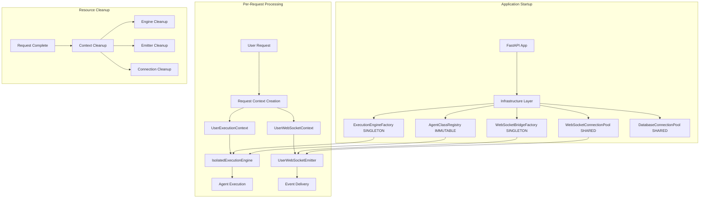

# Factory Architecture Integration Design

**Design Date:** 2025-09-02  
**Mission:** Complete integration design for ExecutionFactory and WebSocketBridgeFactory patterns  
**Business Impact:** Enable 10+ concurrent users with zero shared state, proper isolation, and reliable notifications

## Executive Summary

This document provides the complete integration design for replacing dangerous singleton patterns with factory patterns that provide per-user isolation and proper resource management.

**Key Integration Points:**
1. **Startup Configuration** - How factories are initialized during application startup
2. **Request Lifecycle** - How per-user contexts are created and managed
3. **Resource Management** - Proper cleanup and resource lifecycle
4. **Backward Compatibility** - Migration strategy for existing code
5. **Performance Optimization** - Efficient resource usage and scaling

## 1. Complete Architecture Overview



## 2. Startup Integration

### 2.1 Factory Configuration During Startup

```python
async def configure_factory_architecture(app: FastAPI) -> None:
    """Configure complete factory architecture during application startup."""
    
    logger.info("🏭 Configuring factory architecture...")
    
    # 1. Create infrastructure components (shared, thread-safe)
    websocket_connection_pool = WebSocketConnectionPool()
    await websocket_connection_pool.start_health_monitoring()
    
    # 2. Create factory instances (singletons managing per-user resources)
    execution_engine_factory = ExecutionEngineFactory()
    websocket_bridge_factory = WebSocketBridgeFactory()
    
    # 3. Load configuration
    execution_config = ExecutionFactoryConfig.from_env()
    websocket_config = WebSocketFactoryConfig.from_env()
    
    # 4. Configure factories with infrastructure components
    execution_engine_factory.configure(
        agent_registry=app.state.agent_registry,
        websocket_bridge_factory=websocket_bridge_factory,
        db_connection_pool=app.state.db_pool
    )
    
    websocket_bridge_factory.configure(
        connection_pool=websocket_connection_pool,
        agent_registry=app.state.agent_registry,
        health_monitor=app.state.health_monitor
    )
    
    # 5. Store in application state
    app.state.execution_engine_factory = execution_engine_factory
    app.state.websocket_bridge_factory = websocket_bridge_factory
    app.state.websocket_connection_pool = websocket_connection_pool
    app.state.execution_factory_config = execution_config
    app.state.websocket_factory_config = websocket_config
    
    # 6. Configure backward compatibility adapter
    app.state.factory_adapter = FactoryAdapter(
        execution_engine_factory,
        websocket_bridge_factory,
        use_factory_pattern=execution_config.enable_factory_pattern
    )
    
    logger.info("✅ Factory architecture configured successfully")


@dataclass
class WebSocketFactoryConfig:
    """Configuration for WebSocketBridgeFactory."""
    max_events_per_user: int = 1000
    event_timeout_seconds: float = 30.0
    heartbeat_interval_seconds: float = 30.0
    max_reconnect_attempts: int = 3
    delivery_retries: int = 3
    delivery_timeout_seconds: float = 5.0
    enable_event_compression: bool = True
    enable_event_batching: bool = True
    
    @classmethod
    def from_env(cls) -> 'WebSocketFactoryConfig':
        """Create config from environment variables."""
        return cls(
            max_events_per_user=int(os.getenv('WEBSOCKET_MAX_EVENTS_PER_USER', 1000)),
            event_timeout_seconds=float(os.getenv('WEBSOCKET_EVENT_TIMEOUT', 30.0)),
            heartbeat_interval_seconds=float(os.getenv('WEBSOCKET_HEARTBEAT_INTERVAL', 30.0)),
            max_reconnect_attempts=int(os.getenv('WEBSOCKET_MAX_RECONNECT_ATTEMPTS', 3)),
            delivery_retries=int(os.getenv('WEBSOCKET_DELIVERY_RETRIES', 3)),
            delivery_timeout_seconds=float(os.getenv('WEBSOCKET_DELIVERY_TIMEOUT', 5.0)),
            enable_event_compression=os.getenv('WEBSOCKET_ENABLE_COMPRESSION', 'true').lower() == 'true',
            enable_event_batching=os.getenv('WEBSOCKET_ENABLE_BATCHING', 'true').lower() == 'true',
        )
```

### 2.2 Agent Registry Integration

```python
class EnhancedAgentRegistry:
    """Enhanced AgentRegistry with factory pattern support."""
    
    def __init__(self, llm_manager: LLMManager, tool_dispatcher: ToolDispatcher):
        # Existing initialization
        self.llm_manager = llm_manager
        self.tool_dispatcher = tool_dispatcher
        self.agents: Dict[str, BaseAgent] = {}
        
        # Factory pattern support
        self._factory_mode = False
        self._execution_engine_factory = None
        self._websocket_bridge_factory = None
        
    def configure_factory_support(self, 
                                execution_engine_factory: ExecutionEngineFactory,
                                websocket_bridge_factory: WebSocketBridgeFactory) -> None:
        """Configure factory pattern support."""
        self._factory_mode = True
        self._execution_engine_factory = execution_engine_factory
        self._websocket_bridge_factory = websocket_bridge_factory
        
        logger.info("✅ AgentRegistry configured for factory pattern")
        
    def set_websocket_bridge(self, bridge_or_factory: Any, run_id: Optional[str] = None) -> None:
        """Enhanced WebSocket bridge setting with factory support."""
        
        if self._factory_mode:
            # In factory mode, store factory for per-request usage
            if hasattr(bridge_or_factory, 'create_user_emitter'):
                self._websocket_bridge_factory = bridge_or_factory
                self.websocket_bridge = None  # No global bridge in factory mode
                
                logger.info("✅ WebSocket bridge factory configured for agents")
            else:
                logger.warning("⚠️ Non-factory bridge provided in factory mode")
        else:
            # Legacy mode - set global bridge
            self.websocket_bridge = bridge_or_factory
            
            # Set bridge on all registered agents
            for agent_name, agent in self.agents.items():
                try:
                    if hasattr(agent, 'set_websocket_bridge'):
                        agent.set_websocket_bridge(bridge_or_factory, run_id)
                except Exception as e:
                    logger.warning(f"Failed to set WebSocket bridge for agent {agent_name}: {e}")
                    
    async def get_execution_engine_for_user(self, user_context: UserExecutionContext) -> 'IsolatedExecutionEngine':
        """Get execution engine for specific user (factory mode)."""
        if not self._factory_mode:
            raise RuntimeError("Factory mode not enabled - call configure_factory_support() first")
            
        return await self._execution_engine_factory.create_execution_engine(user_context)
        
    async def get_websocket_emitter_for_user(self, 
                                           user_id: str, 
                                           thread_id: str, 
                                           connection_id: str) -> 'UserWebSocketEmitter':
        """Get WebSocket emitter for specific user (factory mode)."""
        if not self._factory_mode:
            raise RuntimeError("Factory mode not enabled")
            
        return await self._websocket_bridge_factory.create_user_emitter(
            user_id, thread_id, connection_id
        )
```

## 3. Request Lifecycle Integration

### 3.1 FastAPI Route Integration

```python
# Enhanced route handlers with factory pattern support

@router.websocket("/ws/{user_id}")
async def websocket_endpoint(websocket: WebSocket, 
                           user_id: str,
                           request: Request):
    """WebSocket endpoint with per-user isolation."""
    
    await websocket.accept()
    
    # Extract connection info
    thread_id = request.headers.get('thread-id', f"thread_{user_id}_{int(time.time())}")
    connection_id = f"conn_{user_id}_{int(time.time() * 1000)}"
    
    # Get factory components
    connection_pool: WebSocketConnectionPool = request.app.state.websocket_connection_pool
    factory: WebSocketBridgeFactory = request.app.state.websocket_bridge_factory
    
    try:
        # Add connection to pool
        await connection_pool.add_user_connection(user_id, connection_id, websocket)
        
        # Create user-specific WebSocket emitter
        emitter = await factory.create_user_emitter(user_id, thread_id, connection_id)
        
        # Store emitter in request context for route handlers
        request.state.websocket_emitter = emitter
        request.state.user_id = user_id
        request.state.thread_id = thread_id
        
        # Keep connection alive
        try:
            while True:
                data = await websocket.receive_text()
                # Handle incoming WebSocket messages if needed
                await handle_websocket_message(data, user_id, emitter)
                
        except WebSocketDisconnect:
            logger.info(f"WebSocket disconnected for user {user_id}")
            
    finally:
        # Cleanup resources
        if 'emitter' in locals():
            await emitter.cleanup()
        await connection_pool.remove_user_connection(user_id, connection_id)


@router.post("/api/agents/execute")
async def execute_agent(request: ExecuteAgentRequest, 
                       current_user: User = Depends(get_current_user),
                       app_request: Request = None) -> AgentExecutionResponse:
    """Execute agent with factory pattern isolation."""
    
    # Create user execution context
    user_context = UserExecutionContext(
        user_id=current_user.user_id,
        request_id=str(uuid.uuid4()),
        thread_id=request.thread_id or f"thread_{current_user.user_id}_{int(time.time())}"
    )
    
    # Get factory components
    execution_factory: ExecutionEngineFactory = app_request.app.state.execution_engine_factory
    agent_registry: EnhancedAgentRegistry = app_request.app.state.agent_registry
    
    try:
        # Create isolated execution engine for this user
        execution_engine = await execution_factory.create_execution_engine(user_context)
        
        # Create agent state from request
        agent_state = DeepAgentState(
            user_message=request.message,
            agent_name=request.agent_name,
            user_id=current_user.user_id
        )
        
        # Execute agent with complete isolation
        result = await execution_engine.execute_agent_pipeline(
            agent_name=request.agent_name,
            state=agent_state
        )
        
        # Return sanitized result
        return AgentExecutionResponse(
            run_id=result.run_id,
            agent_name=result.agent_name,
            status=result.status,
            result=result.result,
            execution_time=result.execution_time
        )
        
    finally:
        # Cleanup user context
        await user_context.cleanup()


async def handle_websocket_message(data: str, user_id: str, emitter: UserWebSocketEmitter) -> None:
    """Handle incoming WebSocket messages from user."""
    try:
        message = json.loads(data)
        message_type = message.get('type')
        
        if message_type == 'ping':
            # Send pong response
            await emitter.send_direct_message({
                'type': 'pong',
                'timestamp': datetime.now(timezone.utc).isoformat()
            })
            
        elif message_type == 'agent_cancel':
            # Handle agent cancellation request
            run_id = message.get('run_id')
            if run_id:
                await handle_agent_cancellation(user_id, run_id, emitter)
                
    except json.JSONDecodeError:
        logger.warning(f"Invalid JSON message from user {user_id}: {data}")
    except Exception as e:
        logger.error(f"Error handling WebSocket message for user {user_id}: {e}")
```

### 3.2 SupervisorAgent Integration

```python
class EnhancedSupervisorAgent:
    """Enhanced SupervisorAgent with factory pattern support."""
    
    def __init__(self, 
                 db_session: Optional[Any],
                 llm_manager: LLMManager,
                 websocket_bridge_or_factory: Any,
                 tool_dispatcher: ToolDispatcher):
        
        self.db_session = db_session
        self.llm_manager = llm_manager
        self.tool_dispatcher = tool_dispatcher
        
        # Determine if we're using factory pattern
        if hasattr(websocket_bridge_or_factory, 'create_user_emitter'):
            # Factory pattern mode
            self._factory_mode = True
            self._websocket_bridge_factory = websocket_bridge_or_factory
            self._execution_engine_factory = None  # Will be set via dependency injection
        else:
            # Legacy singleton mode
            self._factory_mode = False
            self._websocket_bridge = websocket_bridge_or_factory
            self._execution_engine = None  # Will be created in legacy mode
            
    def configure_execution_factory(self, execution_factory: ExecutionEngineFactory) -> None:
        """Configure execution engine factory (factory mode only)."""
        if not self._factory_mode:
            raise RuntimeError("Cannot configure execution factory in legacy mode")
        self._execution_engine_factory = execution_factory
        
    async def execute_user_request(self, 
                                 user_message: str, 
                                 user_context: UserExecutionContext) -> Dict[str, Any]:
        """Execute user request with proper isolation."""
        
        if self._factory_mode:
            # Factory pattern - create isolated execution engine
            execution_engine = await self._execution_engine_factory.create_execution_engine(user_context)
            
            try:
                # Create agent state
                state = DeepAgentState(
                    user_message=user_message,
                    user_id=user_context.user_id,
                    agent_name="supervisor"
                )
                
                # Execute with isolation
                result = await execution_engine.execute_agent_pipeline("supervisor", state)
                return {
                    "success": True,
                    "result": result.result,
                    "run_id": result.run_id,
                    "execution_time": result.execution_time
                }
                
            finally:
                # Cleanup handled by user_context.cleanup()
                pass
                
        else:
            # Legacy mode - use shared execution engine
            if not self._execution_engine:
                self._execution_engine = ExecutionEngine(
                    registry=None,  # Will be injected
                    websocket_bridge=self._websocket_bridge
                )
                
            # Execute with legacy pattern (has shared state issues)
            state = DeepAgentState(user_message=user_message)
            result = await self._execution_engine.execute_agent_pipeline("supervisor", state)
            
            return {
                "success": True,
                "result": result.result,
                "run_id": result.run_id
            }
```

## 4. Backward Compatibility Adapter

### 4.1 Comprehensive Adapter Implementation

```python
class FactoryAdapter:
    """Comprehensive adapter for gradual migration to factory pattern."""
    
    def __init__(self, 
                 execution_engine_factory: ExecutionEngineFactory,
                 websocket_bridge_factory: WebSocketBridgeFactory,
                 use_factory_pattern: bool = False):
        
        self._execution_engine_factory = execution_engine_factory
        self._websocket_bridge_factory = websocket_bridge_factory
        self._use_factory_pattern = use_factory_pattern
        
        # Legacy components (for backward compatibility)
        self._legacy_execution_engine = None
        self._legacy_websocket_bridge = None
        
        logger.info(f"FactoryAdapter initialized - Factory mode: {use_factory_pattern}")
        
    async def get_execution_engine(self, 
                                 request_context: Optional[Dict[str, Any]] = None,
                                 **legacy_kwargs) -> Any:
        """Get execution engine - factory or legacy based on configuration."""
        
        if self._use_factory_pattern and request_context:
            # Factory pattern - create isolated engine
            user_context = UserExecutionContext(
                user_id=request_context.get('user_id'),
                request_id=request_context.get('request_id', str(uuid.uuid4())),
                thread_id=request_context.get('thread_id', f"thread_{int(time.time())}")
            )
            
            return await self._execution_engine_factory.create_execution_engine(user_context)
            
        else:
            # Legacy pattern - shared engine
            if not self._legacy_execution_engine:
                # Create legacy engine with passed parameters
                registry = legacy_kwargs.get('registry')
                websocket_bridge = legacy_kwargs.get('websocket_bridge')
                
                if not registry or not websocket_bridge:
                    raise ValueError("Legacy mode requires 'registry' and 'websocket_bridge' parameters")
                    
                self._legacy_execution_engine = ExecutionEngine(registry, websocket_bridge)
                
            return self._legacy_execution_engine
            
    async def get_websocket_bridge(self, 
                                 request_context: Optional[Dict[str, Any]] = None,
                                 **legacy_kwargs) -> Any:
        """Get WebSocket bridge - factory or legacy based on configuration."""
        
        if self._use_factory_pattern and request_context:
            # Factory pattern - create user-specific emitter
            user_id = request_context.get('user_id')
            thread_id = request_context.get('thread_id', f"thread_{user_id}")
            connection_id = request_context.get('connection_id', f"conn_{user_id}")
            
            return await self._websocket_bridge_factory.create_user_emitter(
                user_id, thread_id, connection_id
            )
            
        else:
            # Legacy pattern - singleton bridge
            if not self._legacy_websocket_bridge:
                # Import here to avoid circular imports
                from netra_backend.app.services.agent_websocket_bridge import get_agent_websocket_bridge
                self._legacy_websocket_bridge = await get_agent_websocket_bridge()
                
            return self._legacy_websocket_bridge
            
    def enable_factory_pattern(self) -> None:
        """Enable factory pattern mode."""
        self._use_factory_pattern = True
        logger.info("✅ Factory pattern enabled")
        
    def disable_factory_pattern(self) -> None:
        """Disable factory pattern mode (fallback to legacy)."""
        self._use_factory_pattern = False
        logger.info("⚠️ Factory pattern disabled - using legacy mode")
```

### 4.2 Migration Helper Functions

```python
async def migrate_to_factory_pattern(app: FastAPI, 
                                   enable_gradually: bool = True) -> None:
    """Helper function to migrate existing routes to factory pattern."""
    
    # Get adapter
    adapter: FactoryAdapter = app.state.factory_adapter
    
    if enable_gradually:
        # Enable for specific routes first
        routes_to_migrate = [
            "/api/agents/execute",
            "/api/agents/status",
            "/ws"
        ]
        
        for route_path in routes_to_migrate:
            route = next((r for r in app.routes if hasattr(r, 'path') and r.path == route_path), None)
            if route:
                # Add factory pattern metadata to route
                route.factory_pattern_enabled = True
                logger.info(f"✅ Factory pattern enabled for route: {route_path}")
    else:
        # Enable globally
        adapter.enable_factory_pattern()
        
        # Update all routes
        for route in app.routes:
            if hasattr(route, 'endpoint'):
                route.factory_pattern_enabled = True
                
        logger.info("✅ Factory pattern enabled globally")


def create_request_context(request: Request, user: Optional[User] = None) -> Dict[str, Any]:
    """Create request context for factory pattern."""
    
    context = {
        'request_id': str(uuid.uuid4()),
        'timestamp': datetime.now(timezone.utc).isoformat()
    }
    
    # Add user context if available
    if user:
        context.update({
            'user_id': user.user_id,
            'thread_id': request.headers.get('thread-id', f"thread_{user.user_id}_{int(time.time())}")
        })
    elif hasattr(request.state, 'user_id'):
        context.update({
            'user_id': request.state.user_id,
            'thread_id': getattr(request.state, 'thread_id', f"thread_{request.state.user_id}")
        })
        
    # Add WebSocket connection info if available
    if hasattr(request.state, 'connection_id'):
        context['connection_id'] = request.state.connection_id
        
    return context
```

## 5. Performance Optimization

### 5.1 Resource Pooling

```python
class ResourcePool:
    """Pool for reusable components in factory pattern."""
    
    def __init__(self):
        # Component pools
        self._agent_core_pool: Queue = asyncio.Queue(maxsize=50)
        self._fallback_manager_pool: Queue = asyncio.Queue(maxsize=20)
        self._periodic_update_pool: Queue = asyncio.Queue(maxsize=30)
        
        # Pool statistics
        self._pool_stats = {
            'agent_core_created': 0,
            'agent_core_reused': 0,
            'fallback_manager_created': 0,
            'fallback_manager_reused': 0,
            'periodic_update_created': 0,
            'periodic_update_reused': 0
        }
        
    async def get_agent_core(self, user_context: UserExecutionContext) -> AgentExecutionCore:
        """Get agent core from pool or create new one."""
        try:
            # Try to get from pool
            agent_core = self._agent_core_pool.get_nowait()
            agent_core.reset_for_user(user_context)  # Reset for new user
            self._pool_stats['agent_core_reused'] += 1
            return agent_core
            
        except asyncio.QueueEmpty:
            # Create new instance
            agent_core = AgentExecutionCore(
                registry=None,  # Will be injected
                websocket_emitter=None,  # Will be injected
                user_context=user_context
            )
            self._pool_stats['agent_core_created'] += 1
            return agent_core
            
    async def return_agent_core(self, agent_core: AgentExecutionCore) -> None:
        """Return agent core to pool."""
        try:
            agent_core.cleanup_for_pool()  # Clean user-specific data
            self._agent_core_pool.put_nowait(agent_core)
        except asyncio.QueueFull:
            # Pool is full, let it be garbage collected
            pass
            
    def get_pool_statistics(self) -> Dict[str, Any]:
        """Get resource pool statistics."""
        return {
            'pool_sizes': {
                'agent_core': self._agent_core_pool.qsize(),
                'fallback_manager': self._fallback_manager_pool.qsize(),
                'periodic_update': self._periodic_update_pool.qsize()
            },
            'usage_stats': self._pool_stats.copy(),
            'efficiency': {
                'agent_core_reuse_rate': self._pool_stats['agent_core_reused'] / 
                                       max(1, self._pool_stats['agent_core_created'] + self._pool_stats['agent_core_reused']),
                'fallback_manager_reuse_rate': self._pool_stats['fallback_manager_reused'] / 
                                             max(1, self._pool_stats['fallback_manager_created'] + self._pool_stats['fallback_manager_reused'])
            }
        }


class OptimizedExecutionEngineFactory(ExecutionEngineFactory):
    """Optimized factory with resource pooling."""
    
    def __init__(self):
        super().__init__()
        self._resource_pool = ResourcePool()
        
    async def create_execution_engine(self, 
                                    user_context: UserExecutionContext) -> 'OptimizedIsolatedExecutionEngine':
        """Create optimized execution engine with resource pooling."""
        
        # Get components from pool
        agent_core = await self._resource_pool.get_agent_core(user_context)
        fallback_manager = await self._resource_pool.get_fallback_manager(user_context)
        periodic_update_manager = await self._resource_pool.get_periodic_update_manager(user_context)
        
        # Create optimized engine
        engine = OptimizedIsolatedExecutionEngine(
            user_context=user_context,
            agent_core=agent_core,
            fallback_manager=fallback_manager,
            periodic_update_manager=periodic_update_manager,
            resource_pool=self._resource_pool
        )
        
        return engine
```

### 5.2 Event Batching and Compression

```python
class OptimizedUserWebSocketEmitter(UserWebSocketEmitter):
    """Optimized emitter with batching and compression."""
    
    def __init__(self, user_context: UserWebSocketContext, connection, delivery_config):
        super().__init__(user_context, connection, delivery_config)
        
        # Batching configuration
        self._batch_size = delivery_config.get('batch_size', 10)
        self._batch_timeout = delivery_config.get('batch_timeout', 0.1)  # 100ms
        self._enable_compression = delivery_config.get('enable_compression', True)
        
        # Batching state
        self._event_batch: List[WebSocketEvent] = []
        self._batch_timer: Optional[asyncio.Task] = None
        
    async def _queue_event(self, event: WebSocketEvent) -> None:
        """Queue event with batching support."""
        
        # Add to batch
        self._event_batch.append(event)
        
        # Send batch if full or start timer
        if len(self._event_batch) >= self._batch_size:
            await self._send_batch()
        elif not self._batch_timer:
            self._batch_timer = asyncio.create_task(self._batch_timeout_handler())
            
    async def _batch_timeout_handler(self) -> None:
        """Handle batch timeout."""
        try:
            await asyncio.sleep(self._batch_timeout)
            if self._event_batch:  # Send any queued events
                await self._send_batch()
        except asyncio.CancelledError:
            pass
        finally:
            self._batch_timer = None
            
    async def _send_batch(self) -> None:
        """Send batched events."""
        if not self._event_batch:
            return
            
        # Cancel timer if active
        if self._batch_timer:
            self._batch_timer.cancel()
            self._batch_timer = None
            
        # Prepare batch
        batch_events = self._event_batch.copy()
        self._event_batch.clear()
        
        if len(batch_events) == 1:
            # Single event - send directly
            await self._deliver_event_with_retries(batch_events[0])
        else:
            # Multiple events - send as batch
            batch_event = WebSocketEvent(
                event_type="event_batch",
                user_id=self.user_context.user_id,
                thread_id=self.user_context.thread_id,
                data={
                    'events': [self._serialize_event(e) for e in batch_events],
                    'batch_size': len(batch_events),
                    'compressed': False
                }
            )
            
            # Apply compression if enabled and beneficial
            if self._enable_compression and len(batch_events) > 3:
                batch_event.data = self._compress_batch_data(batch_event.data)
                batch_event.data['compressed'] = True
                
            await self._deliver_event_with_retries(batch_event)
            
    def _serialize_event(self, event: WebSocketEvent) -> Dict[str, Any]:
        """Serialize event for batching."""
        return {
            'event_type': event.event_type,
            'event_id': event.event_id,
            'data': event.data,
            'timestamp': event.timestamp.isoformat()
        }
        
    def _compress_batch_data(self, data: Dict[str, Any]) -> Dict[str, Any]:
        """Compress batch data if beneficial."""
        import gzip
        import json
        
        # Serialize events
        events_json = json.dumps(data['events'])
        
        # Compress if it saves significant space
        compressed = gzip.compress(events_json.encode())
        if len(compressed) < len(events_json) * 0.8:  # At least 20% savings
            return {
                'events_compressed': compressed.hex(),
                'batch_size': data['batch_size'],
                'compressed': True,
                'original_size': len(events_json),
                'compressed_size': len(compressed)
            }
        else:
            return data  # Compression not beneficial
```

## 6. Monitoring and Observability

### 6.1 Factory Pattern Metrics

```python
class FactoryMetrics:
    """Comprehensive metrics for factory pattern performance."""
    
    def __init__(self):
        # Execution metrics
        self.execution_engines_created = 0
        self.execution_engines_active = 0
        self.execution_engines_cleaned = 0
        
        # WebSocket metrics
        self.websocket_emitters_created = 0
        self.websocket_emitters_active = 0
        self.events_sent_total = 0
        self.events_failed_total = 0
        self.event_batches_sent = 0
        
        # User context metrics
        self.user_contexts_created = 0
        self.user_contexts_cleaned = 0
        self.max_concurrent_users = 0
        self.current_active_users = 0
        
        # Performance metrics
        self.execution_times: List[float] = []
        self.event_delivery_times: List[float] = []
        self.context_creation_times: List[float] = []
        
        # Resource usage
        self.memory_usage_mb: List[float] = []
        self.cpu_usage_percent: List[float] = []
        
    def record_execution_engine_created(self):
        self.execution_engines_created += 1
        self.execution_engines_active += 1
        
    def record_execution_engine_cleaned(self):
        self.execution_engines_active = max(0, self.execution_engines_active - 1)
        self.execution_engines_cleaned += 1
        
    def record_user_context_created(self):
        self.user_contexts_created += 1
        self.current_active_users += 1
        self.max_concurrent_users = max(self.max_concurrent_users, self.current_active_users)
        
    def record_user_context_cleaned(self):
        self.current_active_users = max(0, self.current_active_users - 1)
        self.user_contexts_cleaned += 1
        
    def record_execution_time(self, execution_time: float):
        self.execution_times.append(execution_time)
        # Keep only last 1000 measurements
        if len(self.execution_times) > 1000:
            self.execution_times = self.execution_times[-500:]
            
    def get_metrics_summary(self) -> Dict[str, Any]:
        """Get comprehensive metrics summary."""
        return {
            'execution_engines': {
                'created': self.execution_engines_created,
                'active': self.execution_engines_active,
                'cleaned': self.execution_engines_cleaned
            },
            'websocket_emitters': {
                'created': self.websocket_emitters_created,
                'active': self.websocket_emitters_active,
                'events_sent': self.events_sent_total,
                'events_failed': self.events_failed_total,
                'batches_sent': self.event_batches_sent
            },
            'user_contexts': {
                'created': self.user_contexts_created,
                'cleaned': self.user_contexts_cleaned,
                'current_active': self.current_active_users,
                'max_concurrent': self.max_concurrent_users
            },
            'performance': {
                'avg_execution_time': sum(self.execution_times) / len(self.execution_times) if self.execution_times else 0,
                'p95_execution_time': self._percentile(self.execution_times, 0.95),
                'avg_event_delivery_time': sum(self.event_delivery_times) / len(self.event_delivery_times) if self.event_delivery_times else 0
            }
        }
        
    def _percentile(self, values: List[float], percentile: float) -> float:
        """Calculate percentile of values."""
        if not values:
            return 0.0
        sorted_values = sorted(values)
        index = int(len(sorted_values) * percentile)
        return sorted_values[min(index, len(sorted_values) - 1)]
```

## 7. Success Metrics and Validation

### 7.1 Integration Success Criteria

```python
async def validate_factory_integration(app: FastAPI) -> Dict[str, bool]:
    """Validate complete factory pattern integration."""
    
    results = {}
    
    # 1. Check factory configuration
    results['factories_configured'] = all([
        hasattr(app.state, 'execution_engine_factory'),
        hasattr(app.state, 'websocket_bridge_factory'),
        hasattr(app.state, 'websocket_connection_pool')
    ])
    
    # 2. Test user isolation
    results['user_isolation'] = await test_user_isolation(app)
    
    # 3. Test concurrent execution
    results['concurrent_execution'] = await test_concurrent_execution(app)
    
    # 4. Test WebSocket event isolation
    results['websocket_isolation'] = await test_websocket_isolation(app)
    
    # 5. Test resource cleanup
    results['resource_cleanup'] = await test_resource_cleanup(app)
    
    # 6. Test backward compatibility
    results['backward_compatibility'] = await test_backward_compatibility(app)
    
    return results


async def test_user_isolation(app: FastAPI) -> bool:
    """Test that users have completely isolated execution contexts."""
    try:
        factory: ExecutionEngineFactory = app.state.execution_engine_factory
        
        # Create contexts for two users
        user1_context = UserExecutionContext("user1", "req1", "thread1")
        user2_context = UserExecutionContext("user2", "req2", "thread2")
        
        # Create engines
        engine1 = await factory.create_execution_engine(user1_context)
        engine2 = await factory.create_execution_engine(user2_context)
        
        # Verify isolation
        isolation_checks = [
            engine1.user_context != engine2.user_context,
            id(engine1.user_context.active_runs) != id(engine2.user_context.active_runs),
            engine1.user_context.user_id != engine2.user_context.user_id
        ]
        
        # Cleanup
        await user1_context.cleanup()
        await user2_context.cleanup()
        
        return all(isolation_checks)
        
    except Exception as e:
        logger.error(f"User isolation test failed: {e}")
        return False


async def test_concurrent_execution(app: FastAPI) -> bool:
    """Test concurrent execution without interference."""
    try:
        factory: ExecutionEngineFactory = app.state.execution_engine_factory
        
        async def execute_for_user(user_id: str) -> Dict[str, Any]:
            context = UserExecutionContext(user_id, f"req_{user_id}", f"thread_{user_id}")
            engine = await factory.create_execution_engine(context)
            
            # Simulate execution
            start_time = time.time()
            await asyncio.sleep(0.1)  # Simulate work
            execution_time = time.time() - start_time
            
            result = {
                'user_id': user_id,
                'execution_time': execution_time,
                'active_runs_count': len(context.active_runs),
                'history_count': len(context.run_history)
            }
            
            await context.cleanup()
            return result
        
        # Execute concurrently for 3 users
        results = await asyncio.gather(
            execute_for_user("user_a"),
            execute_for_user("user_b"),
            execute_for_user("user_c")
        )
        
        # Verify each user got their own isolated results
        user_ids = [r['user_id'] for r in results]
        return len(set(user_ids)) == 3 and all(r['execution_time'] > 0 for r in results)
        
    except Exception as e:
        logger.error(f"Concurrent execution test failed: {e}")
        return False
```

## Conclusion

This comprehensive integration design provides:

1. **Complete Factory Architecture**: Infrastructure layer separation from per-request resources
2. **Seamless Migration Path**: Backward compatibility adapter for gradual transition
3. **Performance Optimization**: Resource pooling, event batching, and efficient cleanup
4. **Robust Monitoring**: Comprehensive metrics and validation
5. **Business Value**: Enables 10+ concurrent users with zero shared state risks

The factory pattern architecture solves the critical singleton issues while maintaining system performance and providing a clear path for production deployment.

---

**Design Completed By:** Design Agent  
**Architecture Compliance:** ✅ SSOT, SRP, Factory Pattern, Resource Management  
**Business Value:** Critical - Enables safe multi-user production deployment