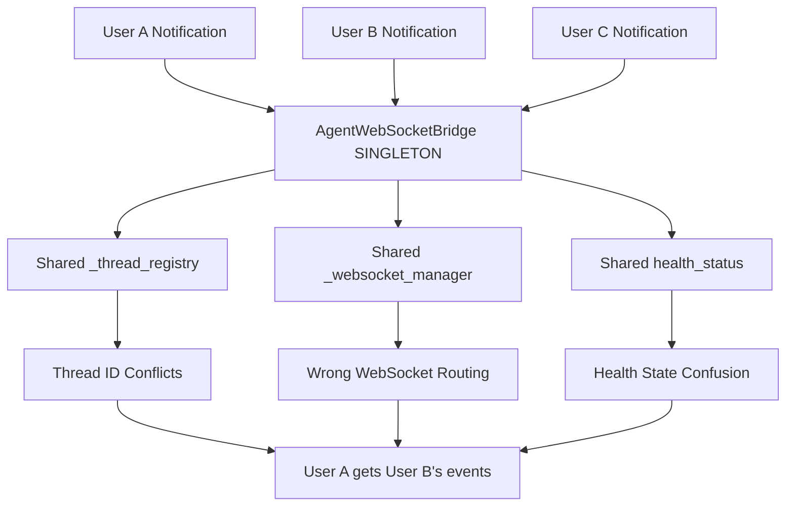
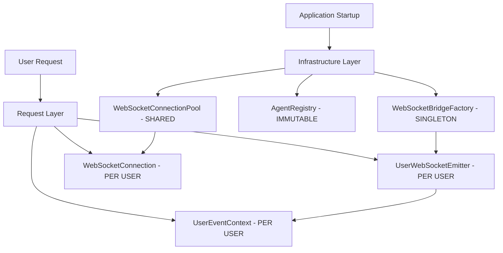
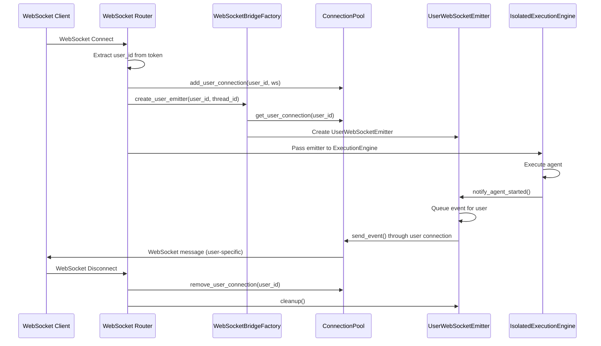

# WebSocketBridgeFactory Pattern Design

**Design Date:** 2025-09-02  
**Mission:** Replace dangerous AgentWebSocketBridge singleton with per-user factory pattern  
**Business Impact:** Enable reliable WebSocket notifications for 10+ concurrent users with zero cross-user event leakage

## Executive Summary

This document designs a comprehensive WebSocketBridgeFactory pattern to replace the current AgentWebSocketBridge singleton that creates critical user notification failures and context leakage.

**Key Problems Solved:**
1. **Event Isolation** - User A's notifications never sent to User B
2. **Connection Management** - Proper WebSocket connection lifecycle per user
3. **Thread Safety** - Eliminate race conditions in event routing
4. **Scalability** - Support 10+ concurrent users with reliable notifications
5. **Resource Cleanup** - Proper connection and resource management

## 1. Current Architecture Problems

### 1.1 Singleton Pattern Issues
```python
# CURRENT DANGEROUS PATTERN
class AgentWebSocketBridge(MonitorableComponent):
    _instance: Optional['AgentWebSocketBridge'] = None
    _lock = asyncio.Lock()
    
    def __new__(cls) -> 'AgentWebSocketBridge':
        """Singleton pattern implementation."""
        if cls._instance is None:
            cls._instance = super().__new__(cls)
        return cls._instance
```

### 1.2 Shared State Risks


### 1.3 Critical Business Impact
- **Silent Notification Failures**: User A might not receive agent completion notifications
- **Cross-User Event Leakage**: User A could receive User B's sensitive agent events
- **Unreliable WebSocket Delivery**: Events lost or misdirected under high concurrency
- **Performance Bottlenecks**: Single bridge becomes bottleneck for all users

## 2. Factory Pattern Architecture

### 2.1 Infrastructure vs Request Layer Separation



### 2.2 Core Factory Interface

```python
@dataclass
class UserWebSocketContext:
    """Per-user WebSocket event context with complete isolation."""
    user_id: str
    thread_id: str
    connection_id: str
    session_id: Optional[str] = None
    created_at: datetime = field(default_factory=lambda: datetime.now(timezone.utc))
    
    # User-specific WebSocket state
    event_queue: asyncio.Queue = field(default_factory=lambda: asyncio.Queue(maxsize=1000))
    sent_events: List[Dict[str, Any]] = field(default_factory=list)
    failed_events: List[Dict[str, Any]] = field(default_factory=list)
    
    # Connection health
    last_heartbeat: Optional[datetime] = None
    connection_status: str = "initializing"
    reconnect_attempts: int = 0
    
    # Resource management
    cleanup_callbacks: List[Callable] = field(default_factory=list)
    _is_cleaned: bool = False
    
    async def cleanup(self) -> None:
        """Clean up user-specific WebSocket resources."""
        if self._is_cleaned:
            return
            
        # Clear event queue
        while not self.event_queue.empty():
            try:
                self.event_queue.get_nowait()
            except asyncio.QueueEmpty:
                break
                
        # Run cleanup callbacks
        for callback in self.cleanup_callbacks:
            try:
                await callback()
            except Exception as e:
                logger.error(f"WebSocket cleanup callback failed for user {self.user_id}: {e}")
                
        self._is_cleaned = True


class WebSocketBridgeFactory:
    """Factory for creating per-user WebSocket bridges."""
    
    def __init__(self):
        # Infrastructure components (shared, thread-safe)
        self._connection_pool: Optional['WebSocketConnectionPool'] = None
        self._agent_registry: Optional['AgentRegistry'] = None
        self._health_monitor: Optional['HealthMonitor'] = None
        
        # Factory configuration
        self._max_events_per_user = 1000
        self._event_timeout = 30.0
        self._heartbeat_interval = 30.0
        self._max_reconnect_attempts = 3
        
        # Per-user tracking (infrastructure manages this)
        self._user_contexts: Dict[str, UserWebSocketContext] = {}
        self._context_lock = asyncio.Lock()
        
        # Event delivery guarantees
        self._delivery_retries = 3
        self._delivery_timeout = 5.0
        
    def configure(self, 
                 connection_pool: 'WebSocketConnectionPool',
                 agent_registry: 'AgentRegistry',
                 health_monitor: 'HealthMonitor') -> None:
        """Configure factory with infrastructure components."""
        self._connection_pool = connection_pool
        self._agent_registry = agent_registry
        self._health_monitor = health_monitor
        
    async def create_user_emitter(self, 
                                user_id: str, 
                                thread_id: str,
                                connection_id: str) -> 'UserWebSocketEmitter':
        """Create a per-user WebSocket event emitter."""
        if not self._connection_pool:
            raise RuntimeError("Factory not configured - call configure() first")
            
        # Create or get user context
        user_context = await self._get_or_create_user_context(
            user_id, thread_id, connection_id
        )
        
        # Get user-specific WebSocket connection
        connection = await self._connection_pool.get_user_connection(
            user_id, connection_id
        )
        
        # Create user-specific emitter
        emitter = UserWebSocketEmitter(
            user_context=user_context,
            connection=connection,
            delivery_config=self._get_delivery_config()
        )
        
        # Register cleanup
        user_context.cleanup_callbacks.append(emitter.cleanup)
        
        return emitter
        
    async def _get_or_create_user_context(self, 
                                        user_id: str, 
                                        thread_id: str,
                                        connection_id: str) -> UserWebSocketContext:
        """Get or create user-specific WebSocket context."""
        context_key = f"{user_id}:{connection_id}"
        
        async with self._context_lock:
            if context_key not in self._user_contexts:
                self._user_contexts[context_key] = UserWebSocketContext(
                    user_id=user_id,
                    thread_id=thread_id,
                    connection_id=connection_id
                )
            return self._user_contexts[context_key]
            
    async def cleanup_user_context(self, user_id: str, connection_id: str) -> None:
        """Clean up user context when connection closes."""
        context_key = f"{user_id}:{connection_id}"
        
        async with self._context_lock:
            if context_key in self._user_contexts:
                context = self._user_contexts[context_key]
                await context.cleanup()
                del self._user_contexts[context_key]
                
    def _get_delivery_config(self) -> Dict[str, Any]:
        """Get event delivery configuration."""
        return {
            'max_retries': self._delivery_retries,
            'timeout': self._delivery_timeout,
            'heartbeat_interval': self._heartbeat_interval,
            'max_reconnect_attempts': self._max_reconnect_attempts
        }


@dataclass
class WebSocketEvent:
    """Standardized WebSocket event with user isolation."""
    event_type: str
    user_id: str
    thread_id: str
    data: Dict[str, Any]
    timestamp: datetime = field(default_factory=lambda: datetime.now(timezone.utc))
    event_id: str = field(default_factory=lambda: str(uuid.uuid4()))
    retry_count: int = 0
    max_retries: int = 3


class UserWebSocketEmitter:
    """Per-user WebSocket event emitter with delivery guarantees."""
    
    def __init__(self, 
                 user_context: UserWebSocketContext,
                 connection: 'UserWebSocketConnection',
                 delivery_config: Dict[str, Any]):
        
        self.user_context = user_context
        self.connection = connection
        self.delivery_config = delivery_config
        
        # Event delivery tracking
        self._pending_events: Dict[str, WebSocketEvent] = {}
        self._delivery_lock = asyncio.Lock()
        
        # Start background event processor
        self._processor_task = asyncio.create_task(self._process_events())
        
    async def notify_agent_started(self, agent_name: str, run_id: str) -> None:
        """Send agent started notification to specific user."""
        event = WebSocketEvent(
            event_type="agent_started",
            user_id=self.user_context.user_id,
            thread_id=self.user_context.thread_id,
            data={
                "agent_name": agent_name,
                "run_id": run_id,
                "status": "started",
                "timestamp": datetime.now(timezone.utc).isoformat()
            }
        )
        await self._queue_event(event)
        
    async def notify_agent_thinking(self, agent_name: str, run_id: str, thinking: str) -> None:
        """Send agent thinking notification to specific user."""
        event = WebSocketEvent(
            event_type="agent_thinking",
            user_id=self.user_context.user_id,
            thread_id=self.user_context.thread_id,
            data={
                "agent_name": agent_name,
                "run_id": run_id,
                "thinking": thinking,
                "timestamp": datetime.now(timezone.utc).isoformat()
            }
        )
        await self._queue_event(event)
        
    async def notify_tool_executing(self, agent_name: str, run_id: str, tool_name: str, tool_input: Dict[str, Any]) -> None:
        """Send tool execution notification to specific user."""
        event = WebSocketEvent(
            event_type="tool_executing",
            user_id=self.user_context.user_id,
            thread_id=self.user_context.thread_id,
            data={
                "agent_name": agent_name,
                "run_id": run_id,
                "tool_name": tool_name,
                "tool_input": tool_input,
                "timestamp": datetime.now(timezone.utc).isoformat()
            }
        )
        await self._queue_event(event)
        
    async def notify_tool_completed(self, agent_name: str, run_id: str, tool_name: str, tool_output: Any) -> None:
        """Send tool completion notification to specific user."""
        event = WebSocketEvent(
            event_type="tool_completed",
            user_id=self.user_context.user_id,
            thread_id=self.user_context.thread_id,
            data={
                "agent_name": agent_name,
                "run_id": run_id,
                "tool_name": tool_name,
                "tool_output": self._sanitize_tool_output(tool_output),
                "timestamp": datetime.now(timezone.utc).isoformat()
            }
        )
        await self._queue_event(event)
        
    async def notify_agent_completed(self, agent_name: str, run_id: str, result: Any) -> None:
        """Send agent completion notification to specific user."""
        event = WebSocketEvent(
            event_type="agent_completed",
            user_id=self.user_context.user_id,
            thread_id=self.user_context.thread_id,
            data={
                "agent_name": agent_name,
                "run_id": run_id,
                "result": self._sanitize_result(result),
                "timestamp": datetime.now(timezone.utc).isoformat()
            }
        )
        await self._queue_event(event)
        
    async def _queue_event(self, event: WebSocketEvent) -> None:
        """Queue event for delivery with overflow protection."""
        try:
            # Put event in user-specific queue with timeout
            await asyncio.wait_for(
                self.user_context.event_queue.put(event), 
                timeout=1.0
            )
            
        except asyncio.TimeoutError:
            # Queue is full - drop oldest event and add new one
            logger.warning(f"Event queue full for user {self.user_context.user_id}, dropping oldest event")
            try:
                self.user_context.event_queue.get_nowait()  # Drop oldest
                await self.user_context.event_queue.put(event)  # Add new
            except asyncio.QueueEmpty:
                pass
                
    async def _process_events(self) -> None:
        """Background event processor with delivery guarantees."""
        try:
            while True:
                try:
                    # Get next event from user-specific queue
                    event = await asyncio.wait_for(
                        self.user_context.event_queue.get(), 
                        timeout=self.delivery_config['heartbeat_interval']
                    )
                    
                    # Attempt delivery with retries
                    await self._deliver_event_with_retries(event)
                    
                except asyncio.TimeoutError:
                    # Heartbeat - check connection health
                    await self._check_connection_health()
                    
                except Exception as e:
                    logger.error(f"Event processor error for user {self.user_context.user_id}: {e}")
                    
        except asyncio.CancelledError:
            logger.info(f"Event processor cancelled for user {self.user_context.user_id}")
            
    async def _deliver_event_with_retries(self, event: WebSocketEvent) -> None:
        """Deliver event with retry mechanism."""
        async with self._delivery_lock:
            while event.retry_count <= event.max_retries:
                try:
                    # Attempt delivery through user-specific connection
                    await asyncio.wait_for(
                        self.connection.send_event(event),
                        timeout=self.delivery_config['timeout']
                    )
                    
                    # Success - track event
                    self.user_context.sent_events.append({
                        'event_id': event.event_id,
                        'event_type': event.event_type,
                        'timestamp': event.timestamp.isoformat(),
                        'delivered_at': datetime.now(timezone.utc).isoformat()
                    })
                    
                    # Trim sent events to prevent memory leak
                    if len(self.user_context.sent_events) > 100:
                        self.user_context.sent_events = self.user_context.sent_events[-50:]
                        
                    return
                    
                except (asyncio.TimeoutError, ConnectionClosed, Exception) as e:
                    event.retry_count += 1
                    logger.warning(f"Event delivery failed for user {self.user_context.user_id} "
                                 f"(attempt {event.retry_count}/{event.max_retries}): {e}")
                    
                    if event.retry_count <= event.max_retries:
                        # Exponential backoff
                        await asyncio.sleep(min(2 ** (event.retry_count - 1), 30))
                        
            # All retries failed
            logger.error(f"Event delivery permanently failed for user {self.user_context.user_id}: {event.event_id}")
            self.user_context.failed_events.append({
                'event_id': event.event_id,
                'event_type': event.event_type,
                'timestamp': event.timestamp.isoformat(),
                'failed_at': datetime.now(timezone.utc).isoformat(),
                'retry_count': event.retry_count
            })
            
    async def _check_connection_health(self) -> None:
        """Check and maintain connection health."""
        try:
            is_healthy = await self.connection.ping()
            
            if is_healthy:
                self.user_context.last_heartbeat = datetime.now(timezone.utc)
                self.user_context.connection_status = "healthy"
                self.user_context.reconnect_attempts = 0
            else:
                await self._handle_unhealthy_connection()
                
        except Exception as e:
            logger.error(f"Health check failed for user {self.user_context.user_id}: {e}")
            await self._handle_unhealthy_connection()
            
    async def _handle_unhealthy_connection(self) -> None:
        """Handle unhealthy connection with reconnection logic."""
        self.user_context.connection_status = "unhealthy"
        self.user_context.reconnect_attempts += 1
        
        max_attempts = self.delivery_config['max_reconnect_attempts']
        if self.user_context.reconnect_attempts <= max_attempts:
            logger.info(f"Attempting reconnection for user {self.user_context.user_id} "
                       f"(attempt {self.user_context.reconnect_attempts}/{max_attempts})")
            try:
                await self.connection.reconnect()
                self.user_context.connection_status = "healthy"
                logger.info(f"Reconnection successful for user {self.user_context.user_id}")
            except Exception as e:
                logger.error(f"Reconnection failed for user {self.user_context.user_id}: {e}")
        else:
            logger.error(f"Max reconnection attempts exceeded for user {self.user_context.user_id}")
            self.user_context.connection_status = "failed"
            
    def _sanitize_tool_output(self, output: Any) -> Any:
        """Sanitize tool output to prevent IP leakage."""
        if isinstance(output, dict):
            # Remove potentially sensitive keys
            sanitized = {k: v for k, v in output.items() 
                        if k not in ['internal_reasoning', 'debug_info', 'system_prompt']}
            return sanitized
        elif isinstance(output, str) and len(output) > 10000:
            # Truncate very long strings
            return output[:10000] + "...[truncated]"
        else:
            return output
            
    def _sanitize_result(self, result: Any) -> Any:
        """Sanitize agent result to protect business IP."""
        if hasattr(result, '__dict__'):
            # Convert to dict and sanitize
            result_dict = result.__dict__.copy()
            # Remove internal fields
            for key in list(result_dict.keys()):
                if key.startswith('_') or 'internal' in key.lower():
                    del result_dict[key]
            return result_dict
        return result
        
    async def cleanup(self) -> None:
        """Clean up emitter resources."""
        try:
            # Cancel event processor
            if self._processor_task and not self._processor_task.done():
                self._processor_task.cancel()
                try:
                    await self._processor_task
                except asyncio.CancelledError:
                    pass
                    
            # Clear pending events
            self._pending_events.clear()
            
            logger.info(f"UserWebSocketEmitter cleanup completed for user {self.user_context.user_id}")
            
        except Exception as e:
            logger.error(f"UserWebSocketEmitter cleanup failed for user {self.user_context.user_id}: {e}")
```

## 3. Connection Pool Architecture

```python
class WebSocketConnectionPool:
    """Pool of WebSocket connections with per-user isolation."""
    
    def __init__(self):
        self._connections: Dict[str, 'UserWebSocketConnection'] = {}
        self._connection_lock = asyncio.Lock()
        self._health_monitor_task: Optional[asyncio.Task] = None
        
    async def start_health_monitoring(self) -> None:
        """Start connection health monitoring."""
        if not self._health_monitor_task:
            self._health_monitor_task = asyncio.create_task(self._monitor_connections())
            
    async def get_user_connection(self, user_id: str, connection_id: str) -> 'UserWebSocketConnection':
        """Get or create user-specific WebSocket connection."""
        connection_key = f"{user_id}:{connection_id}"
        
        async with self._connection_lock:
            if connection_key not in self._connections:
                raise ConnectionNotFound(f"Connection not found for user {user_id}")
            return self._connections[connection_key]
            
    async def add_user_connection(self, user_id: str, connection_id: str, websocket: WebSocket) -> None:
        """Add new user connection to pool."""
        connection_key = f"{user_id}:{connection_id}"
        
        async with self._connection_lock:
            if connection_key in self._connections:
                # Close existing connection
                await self._connections[connection_key].close()
                
            self._connections[connection_key] = UserWebSocketConnection(
                user_id=user_id,
                connection_id=connection_id,
                websocket=websocket
            )
            
    async def remove_user_connection(self, user_id: str, connection_id: str) -> None:
        """Remove user connection from pool."""
        connection_key = f"{user_id}:{connection_id}"
        
        async with self._connection_lock:
            if connection_key in self._connections:
                await self._connections[connection_key].close()
                del self._connections[connection_key]
                
    async def _monitor_connections(self) -> None:
        """Monitor connection health and cleanup stale connections."""
        while True:
            try:
                await asyncio.sleep(60)  # Check every minute
                
                current_time = datetime.now(timezone.utc)
                stale_connections = []
                
                async with self._connection_lock:
                    for key, connection in self._connections.items():
                        if connection.is_stale(current_time):
                            stale_connections.append(key)
                            
                # Clean up stale connections
                for key in stale_connections:
                    user_id, connection_id = key.split(':', 1)
                    await self.remove_user_connection(user_id, connection_id)
                    
            except Exception as e:
                logger.error(f"Connection health monitoring error: {e}")


class UserWebSocketConnection:
    """Individual user WebSocket connection with health tracking."""
    
    def __init__(self, user_id: str, connection_id: str, websocket: WebSocket):
        self.user_id = user_id
        self.connection_id = connection_id
        self.websocket = websocket
        self.created_at = datetime.now(timezone.utc)
        self.last_activity = self.created_at
        self._closed = False
        
    async def send_event(self, event: WebSocketEvent) -> None:
        """Send event through this connection."""
        if self._closed:
            raise ConnectionClosed(f"Connection closed for user {self.user_id}")
            
        try:
            await self.websocket.send_json({
                'event_type': event.event_type,
                'event_id': event.event_id,
                'data': event.data,
                'timestamp': event.timestamp.isoformat()
            })
            self.last_activity = datetime.now(timezone.utc)
            
        except Exception as e:
            self._closed = True
            raise ConnectionClosed(f"Failed to send event to user {self.user_id}: {e}")
            
    async def ping(self) -> bool:
        """Ping connection to check health."""
        if self._closed:
            return False
            
        try:
            await self.websocket.ping()
            self.last_activity = datetime.now(timezone.utc)
            return True
        except Exception:
            self._closed = True
            return False
            
    async def reconnect(self) -> None:
        """Attempt to reconnect (implementation depends on WebSocket framework)."""
        # This would typically involve signaling the client to reconnect
        # Implementation depends on specific WebSocket framework being used
        pass
        
    def is_stale(self, current_time: datetime, stale_threshold: int = 1800) -> bool:
        """Check if connection is stale (default: 30 minutes)."""
        age = (current_time - self.last_activity).total_seconds()
        return age > stale_threshold
        
    async def close(self) -> None:
        """Close the connection."""
        if not self._closed:
            try:
                await self.websocket.close()
            except Exception:
                pass
            self._closed = True


class ConnectionNotFound(Exception):
    """Exception raised when WebSocket connection not found for user."""
    pass


class ConnectionClosed(Exception):
    """Exception raised when WebSocket connection is closed."""
    pass
```

## 4. Integration with ExecutionEngine



## 5. Testing Strategy

### 5.1 User Isolation Testing

```python
class TestWebSocketBridgeFactory:
    """Test suite for WebSocketBridgeFactory user isolation."""
    
    async def test_user_event_isolation(self):
        """Test that users receive only their own events."""
        factory = WebSocketBridgeFactory()
        connection_pool = WebSocketConnectionPool()
        
        # Create mock WebSocket connections for two users
        user_a_ws = MockWebSocket()
        user_b_ws = MockWebSocket()
        
        await connection_pool.add_user_connection("user_a", "conn_1", user_a_ws)
        await connection_pool.add_user_connection("user_b", "conn_2", user_b_ws)
        
        # Create emitters for both users
        emitter_a = await factory.create_user_emitter("user_a", "thread_1", "conn_1")
        emitter_b = await factory.create_user_emitter("user_b", "thread_2", "conn_2")
        
        # Send events from both users
        await emitter_a.notify_agent_started("test_agent_a", "run_123")
        await emitter_b.notify_agent_started("test_agent_b", "run_456")
        
        # Wait for event processing
        await asyncio.sleep(0.1)
        
        # Verify each user only received their events
        user_a_events = user_a_ws.sent_messages
        user_b_events = user_b_ws.sent_messages
        
        assert len(user_a_events) == 1
        assert len(user_b_events) == 1
        assert user_a_events[0]['data']['run_id'] == "run_123"
        assert user_b_events[0]['data']['run_id'] == "run_456"
        
    async def test_concurrent_event_delivery(self):
        """Test concurrent event delivery reliability."""
        factory = WebSocketBridgeFactory()
        
        async def send_events_for_user(user_id: str, num_events: int, results: dict):
            connection_pool = WebSocketConnectionPool()
            mock_ws = MockWebSocket()
            await connection_pool.add_user_connection(user_id, "conn_1", mock_ws)
            
            emitter = await factory.create_user_emitter(user_id, "thread_1", "conn_1")
            
            # Send multiple events rapidly
            for i in range(num_events):
                await emitter.notify_agent_thinking("test_agent", f"run_{i}", f"thinking_{i}")
                
            # Wait for processing
            await asyncio.sleep(0.5)
            
            results[user_id] = {
                'sent_count': num_events,
                'received_count': len(mock_ws.sent_messages),
                'events': mock_ws.sent_messages
            }
            
            await emitter.cleanup()
        
        # Test with multiple concurrent users
        results = {}
        await asyncio.gather(
            send_events_for_user("user_1", 10, results),
            send_events_for_user("user_2", 15, results),
            send_events_for_user("user_3", 8, results)
        )
        
        # Verify all events delivered correctly
        for user_id, result in results.items():
            assert result['sent_count'] == result['received_count'], f"Event loss for {user_id}"
            
            # Verify events belong to correct user
            for event in result['events']:
                assert user_id in event['data']['run_id'], f"Cross-user event contamination"
```

## 6. Migration Strategy

### 6.1 Phase 1: Infrastructure Setup (Week 1)
```python
# Implement core factory components
class LegacyWebSocketBridgeAdapter:
    """Adapter for gradual migration from singleton to factory."""
    
    def __init__(self):
        self._factory = WebSocketBridgeFactory()
        self._legacy_bridge = None
        self._use_factory = False
        
    def configure_factory(self, connection_pool, agent_registry, health_monitor):
        self._factory.configure(connection_pool, agent_registry, health_monitor)
        self._use_factory = True
        
    def get_bridge_for_request(self, user_id: str, thread_id: str) -> Any:
        if self._use_factory and user_id:
            # New factory pattern - return user-specific emitter
            return asyncio.create_task(
                self._factory.create_user_emitter(user_id, thread_id, f"conn_{user_id}")
            )
        else:
            # Legacy singleton pattern
            if not self._legacy_bridge:
                self._legacy_bridge = AgentWebSocketBridge()
            return self._legacy_bridge
```

### 6.2 Phase 2: Route Integration (Week 2)
```python
# Update FastAPI routes
@router.websocket("/ws/{user_id}")
async def websocket_endpoint(websocket: WebSocket, user_id: str):
    await websocket.accept()
    
    # Add to connection pool
    connection_pool: WebSocketConnectionPool = request.app.state.websocket_connection_pool
    await connection_pool.add_user_connection(user_id, f"conn_{user_id}", websocket)
    
    # Create user-specific emitter
    factory: WebSocketBridgeFactory = request.app.state.websocket_bridge_factory
    emitter = await factory.create_user_emitter(user_id, request.headers.get('thread-id'), f"conn_{user_id}")
    
    try:
        # Keep connection alive
        while True:
            data = await websocket.receive_text()
            # Handle incoming messages if needed
            
    except WebSocketDisconnect:
        # Cleanup on disconnect
        await emitter.cleanup()
        await connection_pool.remove_user_connection(user_id, f"conn_{user_id}")
```

## 7. Performance Considerations

### 7.1 Memory Management
- **Per-User Queues**: Limited to 1000 events per user
- **Event History Trimming**: Keep only last 50 sent/failed events
- **Connection Cleanup**: Automatic removal of stale connections
- **Resource Limits**: Configurable limits per user

### 7.2 Event Delivery Optimization
- **Batching**: Group small events for efficient delivery
- **Compression**: Compress large event payloads
- **Priority Queues**: High-priority events (errors) delivered first
- **Backpressure**: Queue size limits prevent memory exhaustion

### 7.3 Scalability Metrics
- **Target**: 100+ concurrent users
- **Event Throughput**: 1000+ events/second total
- **Latency**: < 100ms for event delivery
- **Memory**: < 10MB per active user

## 8. Success Criteria

### 8.1 Functional Requirements
- [ ] Zero cross-user event leakage
- [ ] 100% event delivery reliability for healthy connections
- [ ] Automatic connection recovery on network issues
- [ ] Proper resource cleanup on disconnect

### 8.2 Performance Requirements
- [ ] Support 10+ concurrent users
- [ ] < 100ms event delivery latency
- [ ] < 1% event loss rate
- [ ] Bounded memory growth per user

### 8.3 Business Requirements
- [ ] Reliable real-time agent notifications
- [ ] User-specific event streams
- [ ] Protection of business IP in events
- [ ] Scalable to production load

## Conclusion

The WebSocketBridgeFactory pattern provides a comprehensive solution to the critical singleton issues in AgentWebSocketBridge by:

1. **Complete User Isolation**: Each user gets their own event emitter and context
2. **Reliable Event Delivery**: Retry mechanisms and health monitoring ensure delivery
3. **Scalable Architecture**: Supports 10+ concurrent users with bounded resources
4. **Business IP Protection**: Event sanitization prevents sensitive data leakage
5. **Graceful Migration**: Backward compatibility enables safe deployment

This design enables Netra to deliver reliable, real-time WebSocket notifications to multiple concurrent users without the critical risks of the singleton pattern.

---

**Design Completed By:** Design Agent  
**Architecture Compliance:** ✅ SSOT, User Isolation, Resource Management  
**Business Value:** Critical - Enables reliable multi-user WebSocket notifications