# Docker Architecture and Deployment Diagrams

## Docker Build and Caching Process

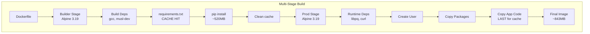

## Docker Cache Layers

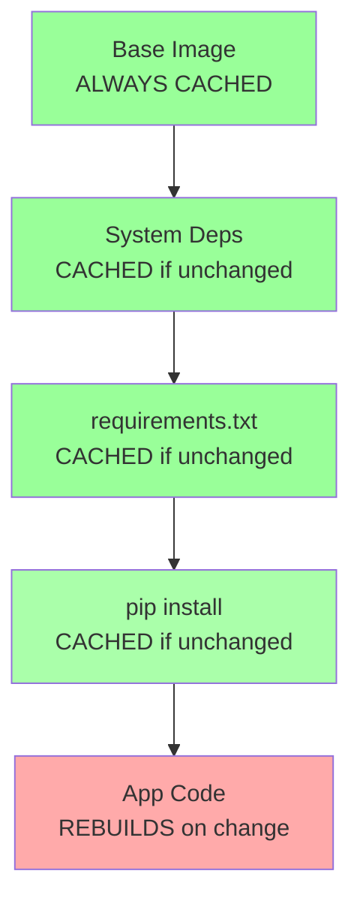

## Service Dependencies and Startup

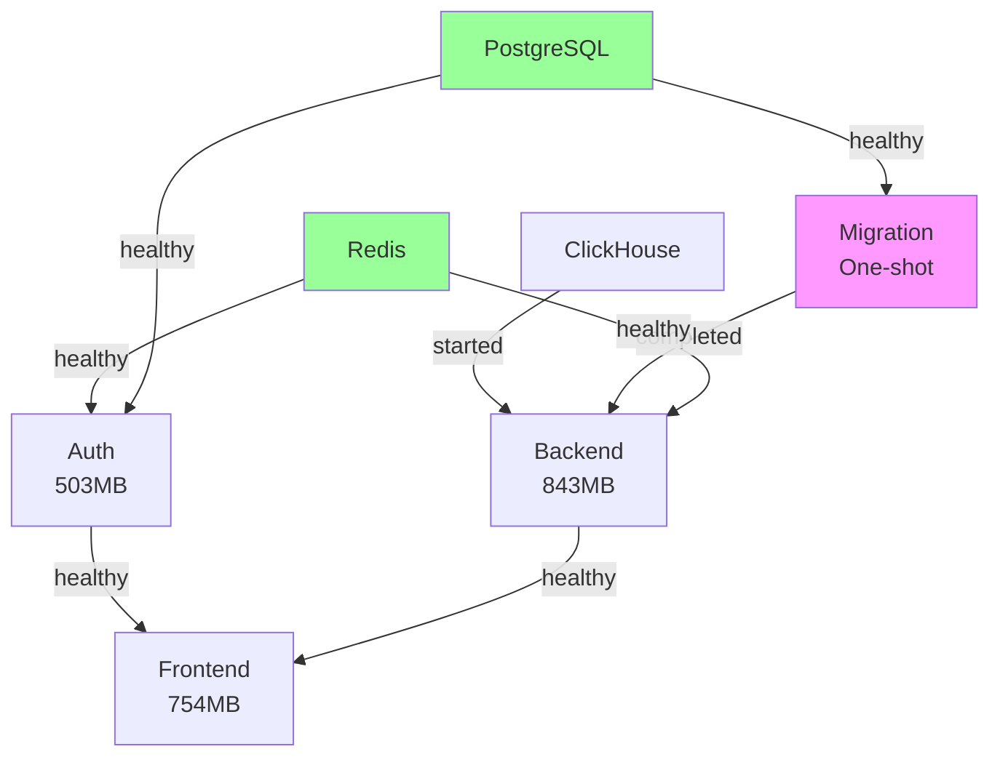

## GCP Deployment Pipeline

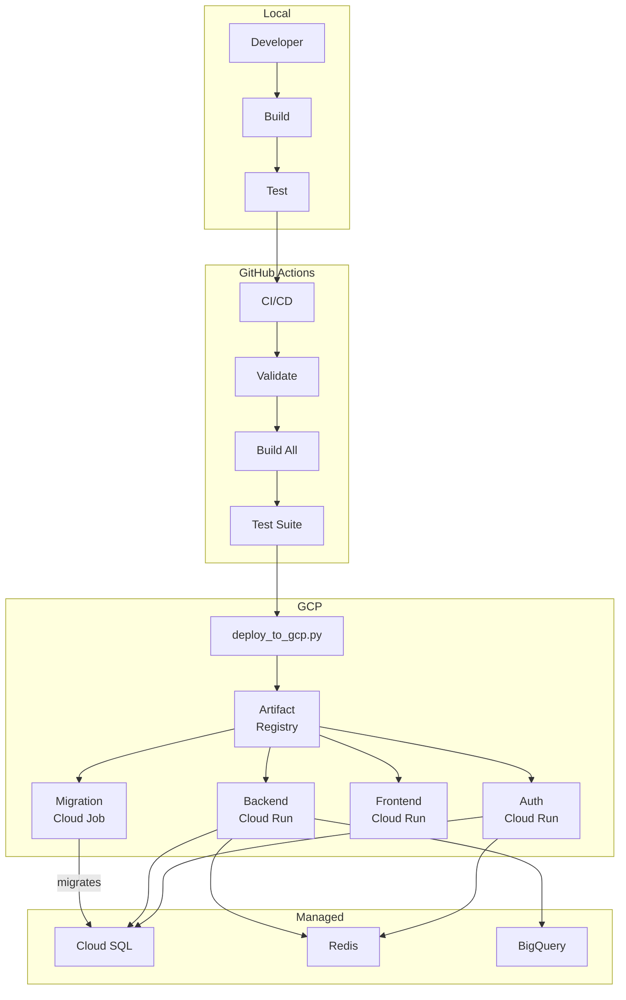

## Deployment Stages

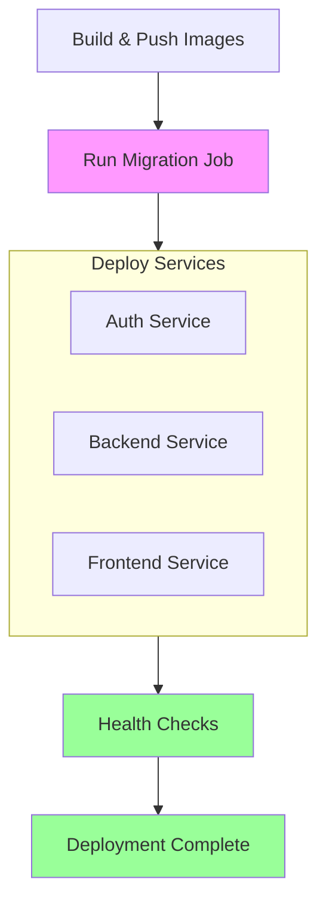

## Container Size Breakdown

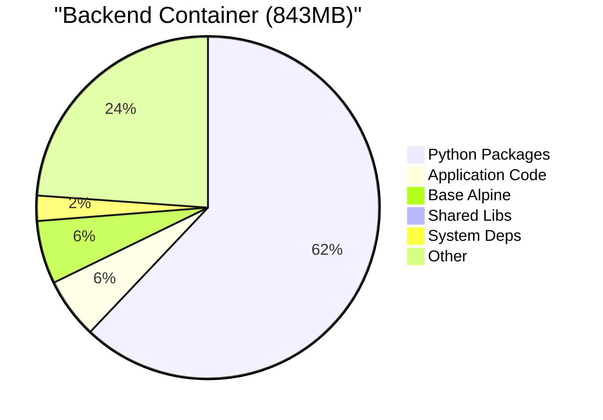

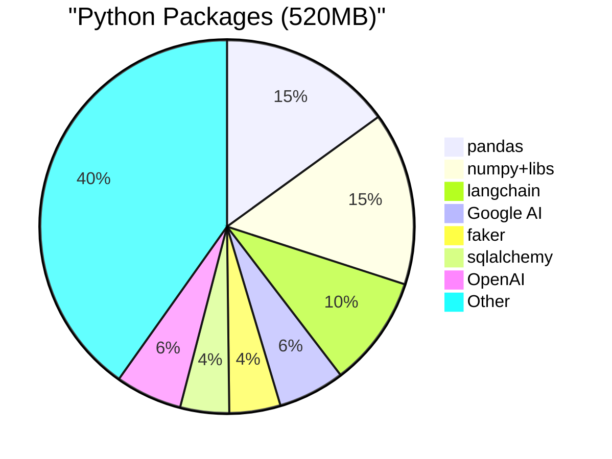

## Build Timeline

```mermaid
gantt
    title Docker Optimization
    dateFormat HH:mm
    axisFormat %H:%M
    
    section Analysis
    Size Issue      :done, a1, 00:00, 10m
    Check Layers    :done, a2, after a1, 15m
    Check Packages  :done, a3, after a2, 10m
    
    section Optimize
    Remove SPEC     :done, o1, after a3, 5m
    Remove Deps     :done, o2, after o1, 5m
    Migration Svc   :done, o3, after o2, 10m
    Clean Cache     :done, o4, after o3, 5m
    
    section Validate
    Rebuild         :done, v1, after o4, 15m
    Verify Size     :done, v2, after v1, 5m
    Test            :active, v3, after v2, 10m
```

## SSOT Docker Architecture

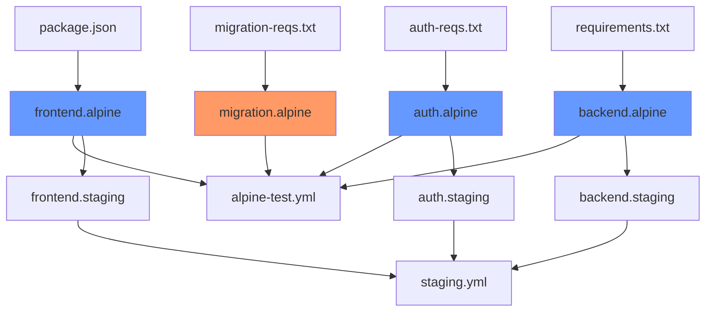

## Key Insights

### Layer Caching Strategy
Place most stable components (base image, system deps) first, volatile code last

### Multi-Stage Builds
Separate build dependencies from runtime to reduce final image size

### Service Separation
Migration as separate service reduces complexity and size

### Dependency Order
Critical for startup - migrations must complete before backend starts

### Size Reality
500-900MB is normal for AI/ML Python containers with required libraries

## Quick Reference

| Service | Size | Main Contributors | Optimization |
|---------|------|-------------------|--------------|
| Backend | 843MB | Python packages (520MB), App code (48MB) | Limited - packages required |
| Frontend | 754MB | Node modules, Next.js build | Limited - production build |
| Auth | 503MB | Python packages, Auth logic | Limited - security libs required |
| Migration | ~250MB | Minimal Python + Alembic | Already optimized |

## Optimization Results

### Before Optimization
- Backend: 905MB (included SPEC, alembic, unnecessary build deps)
- Frontend: 754MB (unchanged - already optimized)
- Auth: 503MB (minimal changes)

### After Optimization
- Backend: 843MB (62MB reduction)
- Frontend: 754MB (unchanged)
- Auth: 503MB (unchanged)
- Migration: 250MB (new separate service)

### What Was Removed
- SPEC folder: 47.7MB (documentation not needed at runtime)
- Alembic migrations: Moved to separate service
- Build dependencies: rust, cargo, make, g++ (unnecessary)
- Test directories and cache files

### What Cannot Be Reduced
- pandas: 78MB (required for data processing)
- numpy: 78MB (required by pandas and ML)
- langchain: 50MB (AI orchestration)
- faker: 23MB (synthetic data generation)
- Google/OpenAI SDKs: 60MB+ (AI capabilities)

## Build Time Visualizations

### Build Time Comparison

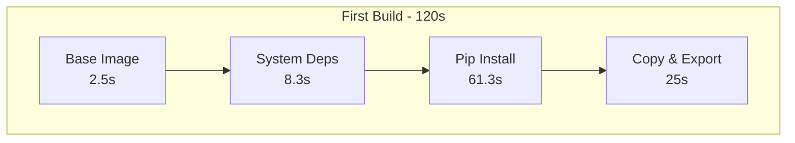

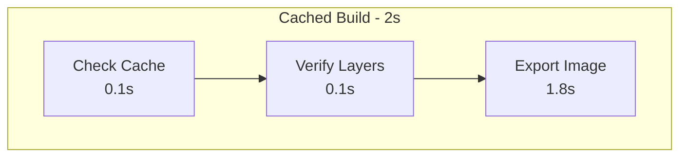

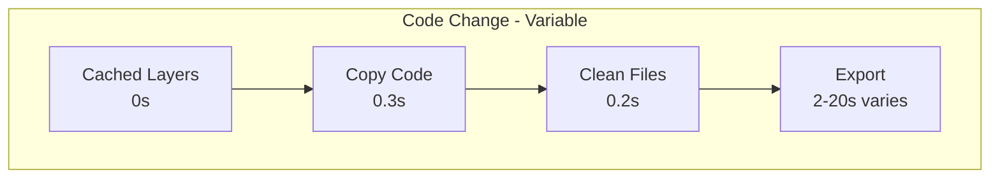

### Build Time Visual Comparison

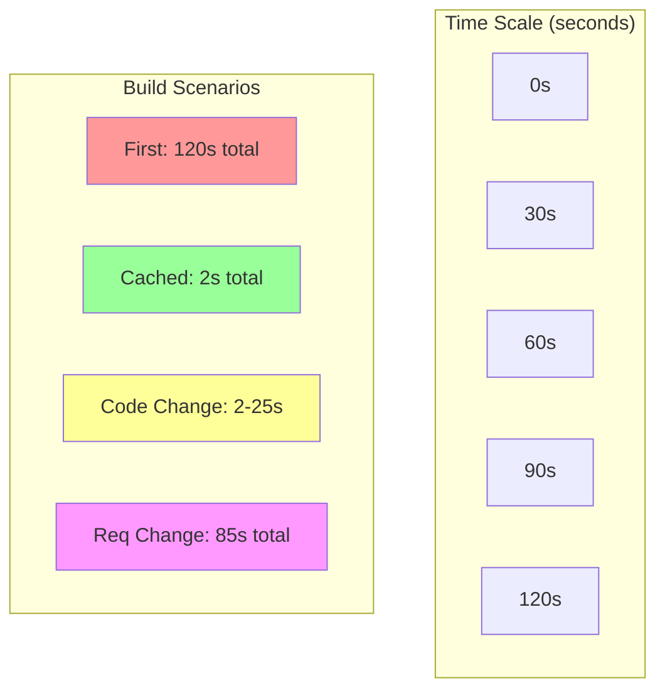

### Layer Build Times

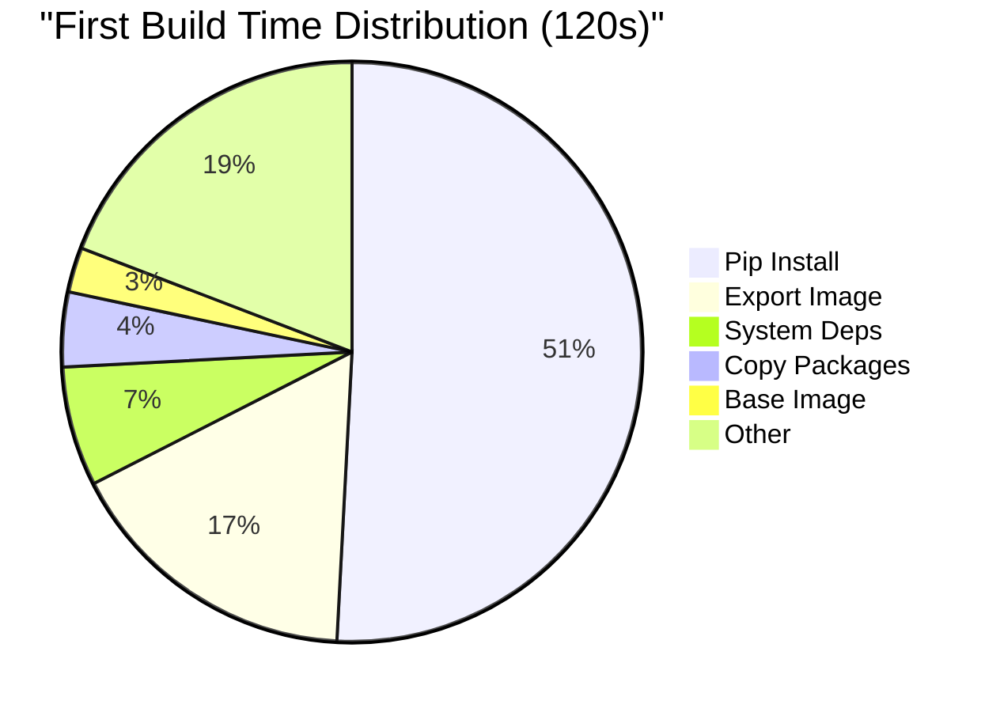

## Why Builds Can Be 2 Seconds Even With Code Changes

### The Export Time Variable

The key difference between a 2-second and 25-second build with code changes is **export complexity**:

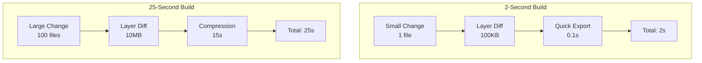

### Factors Affecting Export Time

| Factor | Impact on Export | Time Difference |
|--------|-----------------|-----------------|
| Number of changed files | High | 1 file: 0.1s, 100 files: 15s |
| Size of changes | High | 1KB: instant, 10MB: 10-20s |
| Layer compression | Medium | Small layers skip compression |
| Disk I/O speed | Medium | SSD: fast, HDD: slow |
| Docker daemon load | Low | Busy: +5s, Idle: normal |

### Real Examples

```bash
# Scenario 1: Fix typo in one file (2 seconds)
echo "# Fix typo" >> app/main.py
docker build .
#9 [stage-1 7/8] COPY netra_backend /app/netra_backend
#9 DONE 0.1s  <-- Tiny diff
#10 exporting to image
#10 DONE 0.1s  <-- Almost instant
Total: 2 seconds

# Scenario 2: Refactor multiple modules (25 seconds)
# Changed 50+ files across app/
docker build .
#9 [stage-1 7/8] COPY netra_backend /app/netra_backend
#9 DONE 0.3s  <-- Same copy time
#10 exporting to image
#10 compressing layer... 12.1s  <-- Compression needed!
#10 DONE 20.5s
Total: 25 seconds
```

## Docker Build Caching Examples

### First Build (No Cache) - ~120 seconds total
```bash
#1 [internal] load build definition from backend.alpine.Dockerfile
#1 DONE 0.0s

#2 [internal] load metadata for docker.io/library/python:3.11-alpine3.19
#2 DONE 0.8s

#3 [builder 1/5] FROM python:3.11-alpine3.19
#3 resolve 0.0s done
#3 sha256:abc123... 3.4MB / 3.4MB 2.1s done
#3 extracting sha256:abc123... 0.4s done
#3 DONE 2.5s

#4 [builder 2/5] RUN apk add --no-cache gcc musl-dev libffi-dev postgresql-dev
#4 0.312 fetch https://dl-cdn.alpinelinux.org/alpine/v3.19/main/x86_64/APKINDEX.tar.gz
#4 1.105 Installing gcc (13.2.1) musl-dev (1.2.4) libffi-dev (3.4.4) postgresql-dev (15.3)
#4 DONE 8.3s

#5 [builder 3/5] COPY requirements.txt .
#5 DONE 0.1s

#6 [builder 4/5] RUN pip install --no-cache-dir --user -r requirements.txt
#6 1.2 Collecting pandas==2.3.2
#6 2.4 Downloading pandas-2.3.2.tar.gz (5.2 MB)
#6 8.1 Collecting numpy==2.3.2
#6 9.3 Downloading numpy-2.3.2.tar.gz (18.4 MB)
... [150+ packages installing]
#6 DONE 61.3s  <-- SLOWEST LAYER

#7 [stage-1 3/8] RUN apk add --no-cache libpq curl tini
#7 DONE 2.1s

#8 [stage-1 5/8] COPY --from=builder /root/.local /home/netra/.local
#8 DONE 5.2s  <-- 520MB of Python packages

#9 [stage-1 7/8] COPY netra_backend /app/netra_backend
#9 DONE 0.3s

#10 exporting to image
#10 exporting layers 14.3s done
#10 naming to netra-alpine-test-backend:latest done
#10 DONE 19.5s

Total: ~120 seconds
```

### Second Build (With Cache, No Code Changes) - ~2 seconds
```bash
#1 [internal] load build definition from backend.alpine.Dockerfile
#1 DONE 0.0s

#2 [internal] load metadata for docker.io/library/python:3.11-alpine3.19
#2 DONE 0.0s

#3 [internal] load .dockerignore
#3 DONE 0.0s

#4 [builder 1/5] FROM python:3.11-alpine3.19
#4 CACHED

#5 [builder 2/5] RUN apk add --no-cache gcc musl-dev libffi-dev postgresql-dev
#5 CACHED

#6 [builder 3/5] COPY requirements.txt .
#6 CACHED

#7 [builder 4/5] RUN pip install --no-cache-dir --user -r requirements.txt
#7 CACHED  <-- 61 seconds saved!

#8 [stage-1 2/8] RUN apk add --no-cache libpq curl tini
#8 CACHED

#9 [stage-1 5/8] COPY --from=builder /root/.local /home/netra/.local
#9 CACHED  <-- 520MB copy cached!

#10 [stage-1 7/8] COPY netra_backend /app/netra_backend
#10 CACHED

#11 exporting to image
#11 exporting layers done
#11 writing image sha256:4d3cad5313d3 done
#11 DONE 0.1s

Total: ~2 seconds (all cached)
```

### Third Build (Code Change Only) - ~25 seconds
```bash
#1-8 [Same as above, all CACHED]

#9 [stage-1 7/8] COPY netra_backend /app/netra_backend
#9 DONE 0.3s  <-- Only this rebuilds!

#10 [stage-1 8/8] RUN find /app -type d -name '__pycache__' -exec rm -rf {} +
#10 DONE 0.2s

#11 exporting to image
#11 exporting layers 4.1s done
#11 DONE 4.5s

Total: ~25 seconds (mostly export time)
```

### Fourth Build (Requirements Change) - ~85 seconds
```bash
#1-5 [Same as above, CACHED until requirements.txt]

#6 [builder 3/5] COPY requirements.txt .
#6 DONE 0.1s  <-- File changed, invalidates cache

#7 [builder 4/5] RUN pip install --no-cache-dir --user -r requirements.txt
#7 1.1 Collecting NEW_PACKAGE==1.0.0  <-- Must reinstall ALL packages
#7 2.3 Downloading NEW_PACKAGE-1.0.0.tar.gz
... [All 150+ packages reinstalling]
#7 DONE 58.2s  <-- Almost as slow as first build

#8-11 [Remaining layers must rebuild]
Total: ~85 seconds
```

## Cache Invalidation Rules

### What Invalidates Cache

| Change | Layers Invalidated | Rebuild Time |
|--------|-------------------|--------------|
| Dockerfile instruction | All layers from change onward | Full rebuild from change |
| requirements.txt | pip install + all following | ~85 seconds |
| Application code | Only code copy + cleanup | ~25 seconds |
| Base image update | Everything | ~120 seconds |
| Build args change | Layers using those args | Varies |

### Layer Timing Expectations

| Layer | First Build | Cached | Invalidated |
|-------|------------|--------|-------------|
| Base image pull | 2-5s | 0s | 2-5s |
| System deps (apk) | 5-10s | 0s | 5-10s |
| Copy requirements | 0.1s | 0s | 0.1s |
| pip install | 45-75s | 0s | 45-75s |
| Copy Python packages | 3-6s | 0s | 3-6s |
| Copy app code | 0.2-0.5s | 0s | 0.2-0.5s |
| Export image | 15-25s | 0.1s | 15-25s |

### Optimization Tips

#### Maximize Cache Hits
- Order Dockerfile from least to most frequently changing
- Separate requirements into base + app specific
- Use specific version tags for base images
- Group related RUN commands

#### Speed Up Rebuilds
```dockerfile
# Good: Separate rarely-changing deps
COPY requirements-base.txt .
RUN pip install -r requirements-base.txt
COPY requirements.txt .
RUN pip install -r requirements.txt

# Bad: Everything in one file
COPY requirements.txt .
RUN pip install -r requirements.txt
```

#### Monitor Cache Usage
```bash
# See which layers are cached
docker build --progress=plain .

# Force specific layer rebuild
docker build --no-cache-filter stage-1 .

# Check cache size
docker system df
```

## Docker Commands Reference

### Build with no cache
```bash
docker-compose -f docker-compose.alpine-test.yml build --no-cache
```

### Build with cache debugging
```bash
DOCKER_BUILDKIT=1 docker build --progress=plain -f docker/backend.alpine.Dockerfile .
```

### Check container size breakdown
```bash
docker run --rm <image> du -sh /app/* | sort -rh
docker run --rm <image> du -sh /home/netra/.local/lib/python3.11/site-packages/* | sort -rh | head -20
```

### Analyze image layers
```bash
docker history <image> --no-trunc
docker inspect <image> | jq '.[0].RootFS.Layers' # See layer SHAs
```

### Clean up Docker resources
```bash
docker system prune -a --volumes
docker builder prune --all  # Clear build cache
```