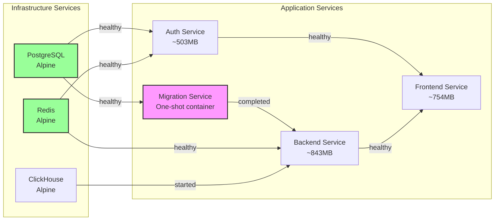
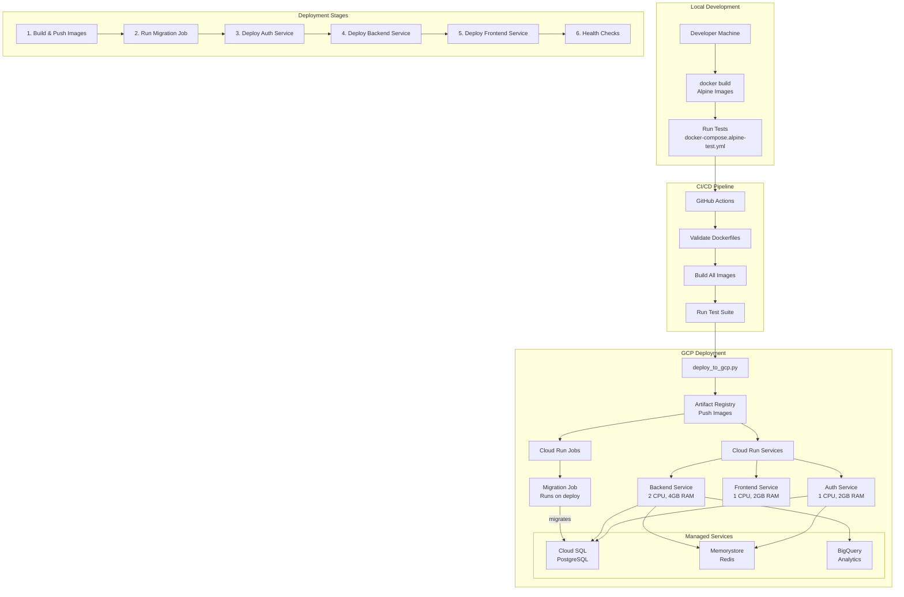
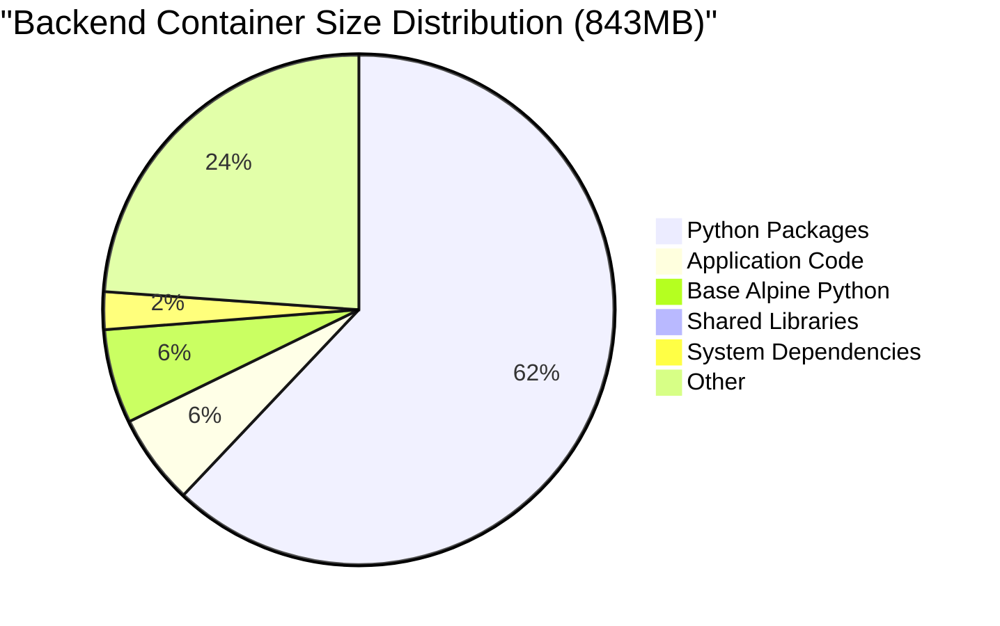
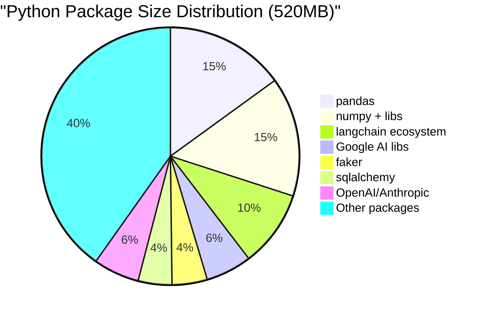
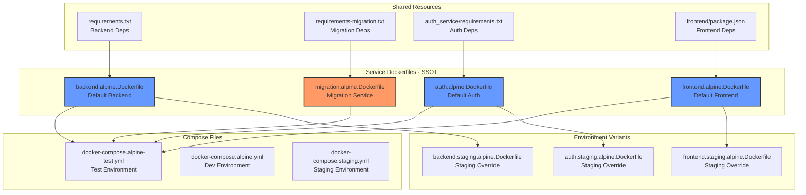

# Docker Architecture and Deployment Diagrams

## Docker Build and Caching Process

## Service Dependencies and Startup Order

## Deployment Process to GCP

## Container Size Breakdown

## Build Optimization Timeline

```mermaid
gantt
    title Docker Build Optimization Process
    dateFormat HH:mm
    axisFormat %H:%M
    
    section Analysis
    Identify size issue           :done, analysis1, 00:00, 10m
    Investigate container layers  :done, analysis2, after analysis1, 15m
    Check Python packages         :done, analysis3, after analysis2, 10m
    
    section Optimization
    Remove SPEC/alembic          :done, opt1, after analysis3, 5m
    Remove build deps            :done, opt2, after opt1, 5m
    Create migration service     :done, opt3, after opt2, 10m
    Clean cache/test dirs        :done, opt4, after opt3, 5m
    
    section Validation
    Rebuild without cache        :done, val1, after opt4, 15m
    Verify size reduction        :done, val2, after val1, 5m
    Test functionality           :active, val3, after val2, 10m
```

## SSOT Docker Architecture

## Key Insights

1. **Layer Caching Strategy**: Place most stable components (base image, system deps) first, volatile code last
2. **Multi-Stage Builds**: Separate build dependencies from runtime to reduce final image size
3. **Service Separation**: Migration as separate service reduces complexity and size
4. **Dependency Order**: Critical for startup - migrations must complete before backend starts
5. **Size Reality**: 500-900MB is normal for AI/ML Python containers with required libraries

## Quick Reference

| Service | Size | Main Contributors | Optimization Potential |
|---------|------|-------------------|----------------------|
| Backend | 843MB | Python packages (520MB), App code (48MB) | Limited - packages required |
| Frontend | 754MB | Node modules, Next.js build | Limited - production build |
| Auth | 503MB | Python packages, Auth logic | Limited - security libs required |
| Migration | ~250MB | Minimal Python + Alembic | Already optimized |