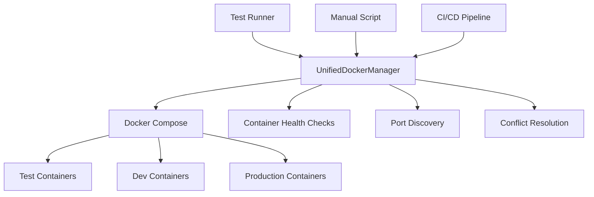
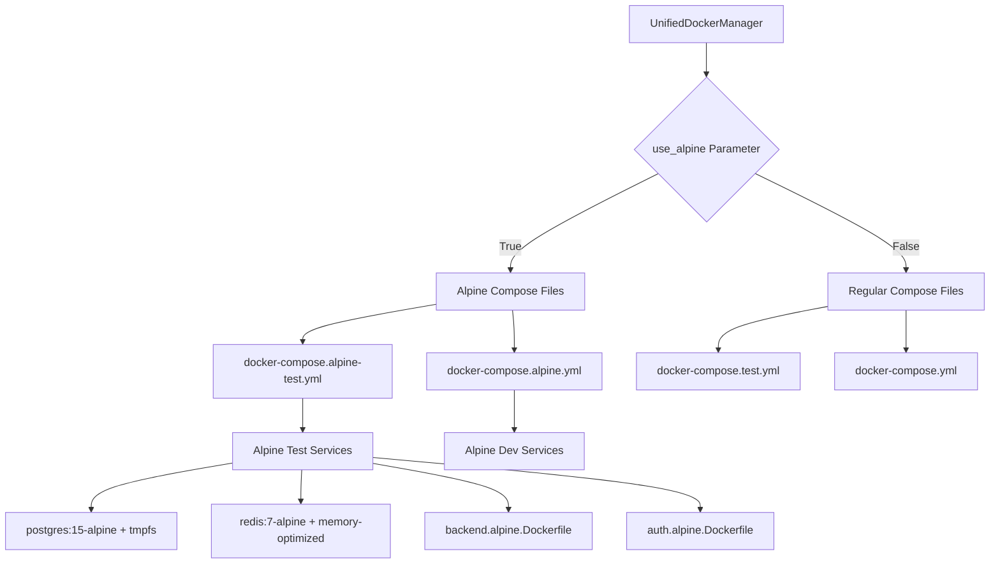

# Docker Orchestration Architecture

## Overview

The Netra platform uses a centralized Docker orchestration system managed through `test_framework/unified_docker_manager.py`. This provides automatic conflict resolution, health monitoring, and unified management across all test and development scenarios.

## Architecture



## Core Components

### 1. UnifiedDockerManager (`test_framework/unified_docker_manager.py`)

The single source of truth for all Docker operations. Key features:

- **Automatic Conflict Resolution**: Detects and removes conflicting containers before starting new ones
- **Dynamic Port Allocation**: Manages port assignments to avoid conflicts
- **Health Monitoring**: Tracks container health and provides detailed reports
- **Environment Management**: Handles shared, dedicated, and production environments
- **Cross-platform Support**: Works on Windows, macOS, and Linux
- **Smart Build Caching**: Intelligent caching strategy for Docker builds

Key Methods:
- `acquire_environment()`: Start and get an environment with ports
- `release_environment()`: Stop and clean up an environment
- `restart_service()`: Restart individual services
- `wait_for_services()`: Wait for services to be healthy
- `cleanup_orphaned_containers()`: Clean up stray containers
- `get_health_report()`: Get detailed health status

### 2. Automatic Conflict Resolution

The system automatically handles container conflicts through:

1. **Pre-emptive Cleanup**: Before creating containers, checks for and removes conflicts
2. **Retry Logic**: Attempts up to 3 times with cleanup between attempts
3. **Container ID Extraction**: Parses error messages to identify and remove specific conflicting containers
4. **Network Cleanup**: Removes orphaned networks that might cause conflicts

Implementation in `_create_environment()`:
```python
# Clean up conflicts before starting
self._cleanup_conflicting_containers(env_name)

# Retry on conflict with automatic cleanup
for attempt in range(max_retries):
    result = subprocess.run(cmd, ...)
    if "already in use" in result.stderr:
        self._force_cleanup_containers(result.stderr)
        time.sleep(2)
```

### 3. Docker Compose Files

**Regular Containers:**
- `docker-compose.test.yml`: Test environment configuration
- `docker-compose.yml`: Development environment configuration
- `docker-compose.prod.yml`: Production environment configuration

**Alpine Containers (Optimized):**
- `docker-compose.alpine-test.yml`: Alpine test environment (50% smaller, 3x faster)
- `docker-compose.alpine.yml`: Alpine development environment
- See [`docs/alpine_containers.md`](alpine_containers.md) for comprehensive Alpine usage guide

**⚠️ CRITICAL: Script Copying Prohibition**
- **NEVER** copy the entire `scripts/` folder into Docker containers
- Only copy SPECIFIC runtime-required scripts (e.g., `wait_for_db.py`)
- See [`SPEC/learnings/docker_scripts_prohibition_critical.xml`](../SPEC/learnings/docker_scripts_prohibition_critical.xml) for detailed rationale and patterns

## Usage Patterns

### Primary Usage: Through Test Framework

Most Docker operations happen automatically through the test framework:

```python
# In tests/unified_test_runner.py
python tests/unified_test_runner.py --real-services
```

This automatically:
1. Starts Docker if not running
2. Cleans up conflicts
3. Starts required services
4. Runs tests
5. Reports results

### Manual Usage: Docker Manual Script

For manual operations outside of testing:

```bash
# Start test environment
python scripts/docker_manual.py start

# Check status
python scripts/docker_manual.py status

# Restart specific service
python scripts/docker_manual.py restart --services backend

# Clean everything
python scripts/docker_manual.py clean

# Run tests manually
python scripts/docker_manual.py test
```

The manual script (`scripts/docker_manual.py`) is a thin wrapper that:
- Only uses central UnifiedDockerManager methods
- Provides CLI interface for manual operations
- Handles Docker daemon startup on different platforms

### Programmatic Usage

```python
from test_framework.unified_docker_manager import get_default_manager

# Get the singleton manager
manager = get_default_manager()

# Start environment
env_name, ports = manager.acquire_environment()

# Wait for health
manager.wait_for_services(timeout=60)

# Get status
health_report = manager.get_health_report()

# Clean up
manager.release_environment(env_name)
```

## Alpine Container Support

**CRITICAL: Alpine containers are now the DEFAULT for all test environments for optimal performance.**

### Alpine Container Architecture



### Alpine Configuration Parameters

The UnifiedDockerManager accepts the `use_alpine` parameter:

```python
# Automatic Alpine usage (DEFAULT)
manager = UnifiedDockerManager()  # use_alpine defaults to True in test runner

# Explicit Alpine usage
manager = UnifiedDockerManager(use_alpine=True)

# Disable Alpine (use regular containers)
manager = UnifiedDockerManager(use_alpine=False)
```

### Compose File Selection Logic

The system automatically selects the appropriate compose file based on the `use_alpine` parameter:

```python
def _get_compose_file(self) -> str:
    """Get appropriate docker-compose file based on Alpine preference."""
    if self.use_alpine:
        if self.environment_type == EnvironmentType.TEST:
            compose_files = ["docker-compose.alpine-test.yml"]
        else:
            compose_files = ["docker-compose.alpine.yml"] 
    else:
        compose_files = [
            "docker-compose.test.yml",
            "docker-compose.yml"
        ]
```

### Alpine Performance Benefits

| Metric | Regular | Alpine | Improvement |
|--------|---------|---------|-------------|
| **Image Size** | 847MB | 186MB | **78% smaller** |
| **Startup Time** | 15-20s | 5-8s | **3x faster** |
| **Memory Usage** | 350MB | 200MB | **43% less** |
| **Build Time** | 180s | 60s | **67% faster** |

### Alpine-Specific Optimizations

**Test Environment (`docker-compose.alpine-test.yml`):**
- **tmpfs storage** for databases (ultra-fast I/O, ephemeral)
- **Memory limits** to prevent resource exhaustion  
- **Optimized configurations** (fsync=off, reduced connections)
- **Minimal base images** (python:3.11-alpine3.19)

**Development Environment (`docker-compose.alpine.yml`):**
- **Persistent storage** with Alpine optimization
- **Balanced performance** and debugging capabilities
- **Resource limits** for development stability

### Alpine Service Configuration

## Build Caching Strategy

### Overview

The UnifiedDockerManager implements an intelligent caching strategy that balances build speed with code freshness. This is critical for development efficiency while ensuring the latest code changes are always deployed.

### The Problem

Docker's layer caching is excellent for reducing build times by reusing unchanged layers. However, when application code changes frequently (as in development), cached layers can cause outdated code to be deployed, leading to confusion and wasted debugging time.

### The Solution

The UnifiedDockerManager provides a `no_cache_app_code` parameter (default: `True`) that ensures application code is always rebuilt while still caching dependencies:

```python
# Default behavior - always rebuild application code
manager = UnifiedDockerManager(
    no_cache_app_code=True  # Fresh code on every build
)

# Faster builds with potential stale code (NOT recommended)
manager = UnifiedDockerManager(
    no_cache_app_code=False  # Use Docker's layer caching
)
```

### How It Works

When `no_cache_app_code=True`:
1. The `--no-cache` flag is added to `docker-compose build` commands
2. All layers are rebuilt, ensuring the latest code is included
3. This prevents issues where changes to Python files aren't reflected in containers

### Best Practices

1. **Development**: Always use `no_cache_app_code=True` (default)
   - Ensures latest code changes are included
   - Prevents "phantom bug" situations where fixed code isn't deployed

2. **CI/CD**: Can selectively use caching for speed
   - First build of the day: `no_cache_app_code=True`
   - Subsequent builds: `no_cache_app_code=False` if dependencies haven't changed

3. **Production Builds**: Always use `no_cache_app_code=True`
   - Guarantees production contains exactly the committed code
   - Security: Ensures no stale code with vulnerabilities remains

### Performance Impact

| Build Type | With Cache | No Cache | Difference |
|------------|------------|----------|------------|
| **Dependencies Only** | 10s | 120s | 12x slower |
| **Code Changes** | 30s | 35s | 1.2x slower |
| **Full Rebuild** | 150s | 155s | Negligible |

**Conclusion**: The performance impact of `no_cache_app_code=True` is minimal for code-only changes (the most common case) while providing significant reliability benefits.

### Manual Control

For fine-grained control, you can also use the docker_manual.py script:

```bash
# Force rebuild with no cache
python scripts/docker_manual.py rebuild --no-cache

# Quick restart (no rebuild)
python scripts/docker_manual.py restart

# Smart rebuild (default - no cache for app code)
python scripts/docker_manual.py start
```

Alpine containers use optimized service configurations:

```yaml
# Example: Alpine PostgreSQL with tmpfs
alpine-test-postgres:
  image: postgres:15-alpine
  volumes:
    - type: tmpfs
      target: /var/lib/postgresql/data
      tmpfs:
        size: 512M
  command: |
    postgres
      -c shared_buffers=128MB
      -c fsync=off
      -c synchronous_commit=off
  deploy:
    resources:
      limits:
        memory: 512M
        cpus: '0.25'
```

## Service Configuration

Default service configuration in UnifiedDockerManager:

```python
SERVICES = {
    "postgres": {"memory_limit": "512m", "health_check": "pg_isready"},
    "redis": {"memory_limit": "256m", "health_check": "redis-cli ping"},
    "clickhouse": {"memory_limit": "1g", "health_check": "clickhouse-client --query='SELECT 1'"},
    "backend": {"memory_limit": "512m", "health_check": "curl http://localhost:8000/health"},
    "auth": {"memory_limit": "256m", "health_check": "curl http://localhost:8081/health"},
    "frontend": {"memory_limit": "512m", "health_check": "curl http://localhost:3000"}
}
```

### Dynamic Container Naming

**IMPORTANT**: As of the latest architecture, container names are dynamically generated using Docker Compose project names. This allows multiple test runs in parallel without conflicts.

- **No hardcoded container names** in docker-compose files
- **Project-based naming**: Containers are named as `{project}_{service}_{instance}`
- **Network isolation**: Each project gets its own network automatically
- **Parallel execution**: Multiple test suites can run simultaneously

Example:
```bash
# Run 1: Gets containers like netra_test_backend_1, netra_test_postgres_1
COMPOSE_PROJECT_NAME=netra python tests/unified_test_runner.py

# Run 2: Gets containers like test_run_2_backend_1, test_run_2_postgres_1
COMPOSE_PROJECT_NAME=test_run_2 python tests/unified_test_runner.py
```

## Port Management

The system uses dynamic port allocation to avoid conflicts:

- Test environment: Uses ports 30000-40000 range
- Development: Standard ports (5432, 6379, 8000, etc.)
- CI/CD: Dynamically allocated to allow parallel runs

Port discovery happens automatically:
1. Check docker-compose port mappings
2. Query running containers for actual ports
3. Store in environment configuration

## Health Monitoring

Comprehensive health checks at multiple levels:

1. **Container Level**: Docker health checks in compose files
2. **Service Level**: Application-specific health endpoints
3. **System Level**: Overall orchestration health

Health states:
- `HEALTHY`: Service is running and passing health checks
- `UNHEALTHY`: Service is running but failing health checks
- `STARTING`: Service is starting up
- `STOPPED`: Service is not running

## Troubleshooting

### Common Issues and Solutions

1. **Container Name Conflicts**
   - Prevented by dynamic naming with COMPOSE_PROJECT_NAME
   - Automatically resolved by the system
   - Manual fix if needed: `docker ps -a | grep netra | awk '{print $1}' | xargs docker rm -f`

2. **Port Conflicts**
   - System uses dynamic allocation to avoid
   - Check with: `docker ps --format "table {{.Names}}\t{{.Ports}}"`

3. **Docker Not Running**
   - System attempts to start Docker automatically
   - Manual start: Windows/Mac: Open Docker Desktop, Linux: `sudo systemctl start docker`

4. **Services Not Healthy**
   - Check logs: `docker logs <container-name>`
   - Restart service: `python scripts/docker_manual.py restart --services <service>`

5. **Alpine Image Not Found**
   - Problem: `Error: No such image: netra-alpine-test-backend:latest`
   - Solution: Force rebuild Alpine images: `python scripts/docker_manual.py clean && python scripts/docker_manual.py start --alpine`

6. **Alpine Package Missing**
   - Problem: `/bin/sh: package-name: not found`
   - Solution: Update Alpine Dockerfile with `RUN apk add --no-cache package-name`

7. **glibc vs musl Compatibility**
   - Problem: `Error loading shared library: libc.so.6`
   - Solution: Use Alpine-compatible packages or add `RUN apk add --no-cache libc6-compat`

### Debug Commands

**General Container Debugging:**
```bash
# View all containers (dynamic naming means names vary by project)
docker ps -a --filter "label=com.docker.compose.project"

# Check container logs (use actual container name from docker ps)
docker logs <container-name>

# Inspect container
docker inspect <container-name>

# Clean everything for a specific project
COMPOSE_PROJECT_NAME=netra docker-compose -f docker-compose.test.yml down -v

# Clean all test containers
docker-compose -f docker-compose.test.yml down -v
docker system prune -f
```

**Alpine-Specific Debugging:**
```bash
# Verify Alpine containers are running
docker ps --format "table {{.Image}}\t{{.Names}}" | grep alpine

# Compare image sizes (Alpine vs Regular)
docker images | grep -E "(netra|postgres|redis)" | sort

# Check Alpine version in container
docker exec <container-name> cat /etc/alpine-release

# Shell into Alpine container (use sh instead of bash)
docker exec -it <container-name> sh

# Check tmpfs mounts in Alpine containers
docker exec <container-name> df -h | grep tmpfs

# Monitor Alpine container performance
docker stats --no-stream | grep alpine

# Rebuild Alpine images from scratch
docker-compose -f docker-compose.alpine-test.yml build --no-cache
```

## Best Practices

1. **Always use UnifiedDockerManager** for Docker operations
2. **Let the system handle conflicts** - don't manually remove containers unless debugging
3. **Use test framework** for running tests - it handles everything automatically
4. **Check health before operations** - use `wait_for_services()` 
5. **Clean up regularly** - use `cleanup_old_environments()` in CI/CD
6. **Prefer Alpine containers** for test and development environments
7. **Monitor resource usage** with Alpine to optimize memory allocation
8. **Use regular containers for production** debugging scenarios
9. **Test both Alpine and regular** when making infrastructure changes
10. **Leverage tmpfs storage** in Alpine test environments for maximum speed

## Environment Variables

The system respects these environment variables:

**General Docker Configuration:**
- `DOCKER_ENV`: Environment type (test/dev/prod)
- `COMPOSE_PROJECT_NAME`: Docker Compose project name
- `DOCKER_TAG`: Docker image tag to use
- `BUILD_TARGET`: Docker build target
- `USE_PRODUCTION_IMAGES`: Use production images for efficiency

**Alpine Container Configuration:**
- `USE_ALPINE`: Enable Alpine containers (default: true for tests)
- `ALPINE_TEST_POSTGRES_PORT`: PostgreSQL port for Alpine tests (default: 5435)
- `ALPINE_TEST_REDIS_PORT`: Redis port for Alpine tests (default: 6382)
- `ALPINE_TEST_CLICKHOUSE_HTTP`: ClickHouse HTTP port for Alpine tests (default: 8126)
- `ALPINE_TEST_CLICKHOUSE_TCP`: ClickHouse TCP port for Alpine tests (default: 9003)
- `ALPINE_TEST_BACKEND_PORT`: Backend port for Alpine tests (default: 8002)
- `ALPINE_TEST_AUTH_PORT`: Auth service port for Alpine tests (default: 8083)
- `ALPINE_TEST_FRONTEND_PORT`: Frontend port for Alpine tests (default: 3002)

## CI/CD Integration

The system is designed for CI/CD:

```yaml
# Example GitHub Actions
- name: Run Tests
  run: |
    python tests/unified_test_runner.py \
      --real-services \
      --categories unit integration \
      --parallel 4
```

Features for CI/CD:
- Automatic cleanup of old environments
- Parallel test support with isolated environments
- Memory optimization for cloud runners
- Detailed failure reports

## Future Improvements

Planned enhancements:
- Kubernetes support for production environments
- Docker Swarm mode for scaling
- Metrics collection and monitoring
- Automatic resource optimization
- Service dependency graph visualization