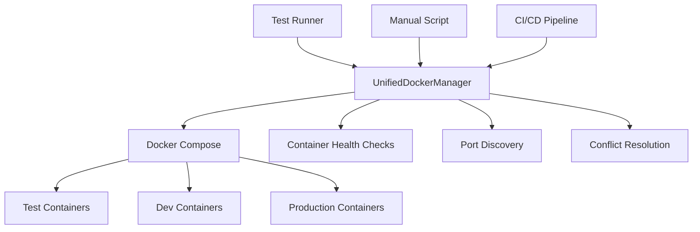

# Docker Orchestration Architecture

## Overview

The Netra platform uses a centralized Docker orchestration system managed through `test_framework/unified_docker_manager.py`. This provides automatic conflict resolution, health monitoring, and unified management across all test and development scenarios.

## Architecture



## Core Components

### 1. UnifiedDockerManager (`test_framework/unified_docker_manager.py`)

The single source of truth for all Docker operations. Key features:

- **Automatic Conflict Resolution**: Detects and removes conflicting containers before starting new ones
- **Dynamic Port Allocation**: Manages port assignments to avoid conflicts
- **Health Monitoring**: Tracks container health and provides detailed reports
- **Environment Management**: Handles shared, dedicated, and production environments
- **Cross-platform Support**: Works on Windows, macOS, and Linux

Key Methods:
- `acquire_environment()`: Start and get an environment with ports
- `release_environment()`: Stop and clean up an environment
- `restart_service()`: Restart individual services
- `wait_for_services()`: Wait for services to be healthy
- `cleanup_orphaned_containers()`: Clean up stray containers
- `get_health_report()`: Get detailed health status

### 2. Automatic Conflict Resolution

The system automatically handles container conflicts through:

1. **Pre-emptive Cleanup**: Before creating containers, checks for and removes conflicts
2. **Retry Logic**: Attempts up to 3 times with cleanup between attempts
3. **Container ID Extraction**: Parses error messages to identify and remove specific conflicting containers
4. **Network Cleanup**: Removes orphaned networks that might cause conflicts

Implementation in `_create_environment()`:
```python
# Clean up conflicts before starting
self._cleanup_conflicting_containers(env_name)

# Retry on conflict with automatic cleanup
for attempt in range(max_retries):
    result = subprocess.run(cmd, ...)
    if "already in use" in result.stderr:
        self._force_cleanup_containers(result.stderr)
        time.sleep(2)
```

### 3. Docker Compose Files

- `docker-compose.test.yml`: Test environment configuration
- `docker-compose.yml`: Development environment configuration
- `docker-compose.prod.yml`: Production environment configuration

## Usage Patterns

### Primary Usage: Through Test Framework

Most Docker operations happen automatically through the test framework:

```python
# In tests/unified_test_runner.py
python tests/unified_test_runner.py --real-services
```

This automatically:
1. Starts Docker if not running
2. Cleans up conflicts
3. Starts required services
4. Runs tests
5. Reports results

### Manual Usage: Docker Manual Script

For manual operations outside of testing:

```bash
# Start test environment
python scripts/docker_manual.py start

# Check status
python scripts/docker_manual.py status

# Restart specific service
python scripts/docker_manual.py restart --services backend

# Clean everything
python scripts/docker_manual.py clean

# Run tests manually
python scripts/docker_manual.py test
```

The manual script (`scripts/docker_manual.py`) is a thin wrapper that:
- Only uses central UnifiedDockerManager methods
- Provides CLI interface for manual operations
- Handles Docker daemon startup on different platforms

### Programmatic Usage

```python
from test_framework.unified_docker_manager import get_default_manager

# Get the singleton manager
manager = get_default_manager()

# Start environment
env_name, ports = manager.acquire_environment()

# Wait for health
manager.wait_for_services(timeout=60)

# Get status
health_report = manager.get_health_report()

# Clean up
manager.release_environment(env_name)
```

## Service Configuration

Default service configuration in UnifiedDockerManager:

```python
SERVICES = {
    "postgres": {"memory_limit": "512m", "health_check": "pg_isready"},
    "redis": {"memory_limit": "256m", "health_check": "redis-cli ping"},
    "clickhouse": {"memory_limit": "1g", "health_check": "clickhouse-client --query='SELECT 1'"},
    "backend": {"memory_limit": "512m", "health_check": "curl http://localhost:8000/health"},
    "auth": {"memory_limit": "256m", "health_check": "curl http://localhost:8081/health"},
    "frontend": {"memory_limit": "512m", "health_check": "curl http://localhost:3000"}
}
```

## Port Management

The system uses dynamic port allocation to avoid conflicts:

- Test environment: Uses ports 30000-40000 range
- Development: Standard ports (5432, 6379, 8000, etc.)
- CI/CD: Dynamically allocated to allow parallel runs

Port discovery happens automatically:
1. Check docker-compose port mappings
2. Query running containers for actual ports
3. Store in environment configuration

## Health Monitoring

Comprehensive health checks at multiple levels:

1. **Container Level**: Docker health checks in compose files
2. **Service Level**: Application-specific health endpoints
3. **System Level**: Overall orchestration health

Health states:
- `HEALTHY`: Service is running and passing health checks
- `UNHEALTHY`: Service is running but failing health checks
- `STARTING`: Service is starting up
- `STOPPED`: Service is not running

## Troubleshooting

### Common Issues and Solutions

1. **Container Name Conflicts**
   - Automatically resolved by the system
   - Manual fix: `docker ps -a | grep netra | awk '{print $1}' | xargs docker rm -f`

2. **Port Conflicts**
   - System uses dynamic allocation to avoid
   - Check with: `docker ps --format "table {{.Names}}\t{{.Ports}}"`

3. **Docker Not Running**
   - System attempts to start Docker automatically
   - Manual start: Windows/Mac: Open Docker Desktop, Linux: `sudo systemctl start docker`

4. **Services Not Healthy**
   - Check logs: `docker logs <container-name>`
   - Restart service: `python scripts/docker_manual.py restart --services <service>`

### Debug Commands

```bash
# View all containers
docker ps -a --filter "name=netra"

# Check container logs
docker logs netra-test-backend

# Inspect container
docker inspect netra-test-postgres

# Clean everything
docker-compose -f docker-compose.test.yml down -v
docker system prune -f
```

## Best Practices

1. **Always use UnifiedDockerManager** for Docker operations
2. **Let the system handle conflicts** - don't manually remove containers unless debugging
3. **Use test framework** for running tests - it handles everything automatically
4. **Check health before operations** - use `wait_for_services()` 
5. **Clean up regularly** - use `cleanup_old_environments()` in CI/CD

## Environment Variables

The system respects these environment variables:

- `DOCKER_ENV`: Environment type (test/dev/prod)
- `COMPOSE_PROJECT_NAME`: Docker Compose project name
- `DOCKER_TAG`: Docker image tag to use
- `BUILD_TARGET`: Docker build target
- `USE_PRODUCTION_IMAGES`: Use production images for efficiency

## CI/CD Integration

The system is designed for CI/CD:

```yaml
# Example GitHub Actions
- name: Run Tests
  run: |
    python tests/unified_test_runner.py \
      --real-services \
      --categories unit integration \
      --parallel 4
```

Features for CI/CD:
- Automatic cleanup of old environments
- Parallel test support with isolated environments
- Memory optimization for cloud runners
- Detailed failure reports

## Future Improvements

Planned enhancements:
- Kubernetes support for production environments
- Docker Swarm mode for scaling
- Metrics collection and monitoring
- Automatic resource optimization
- Service dependency graph visualization