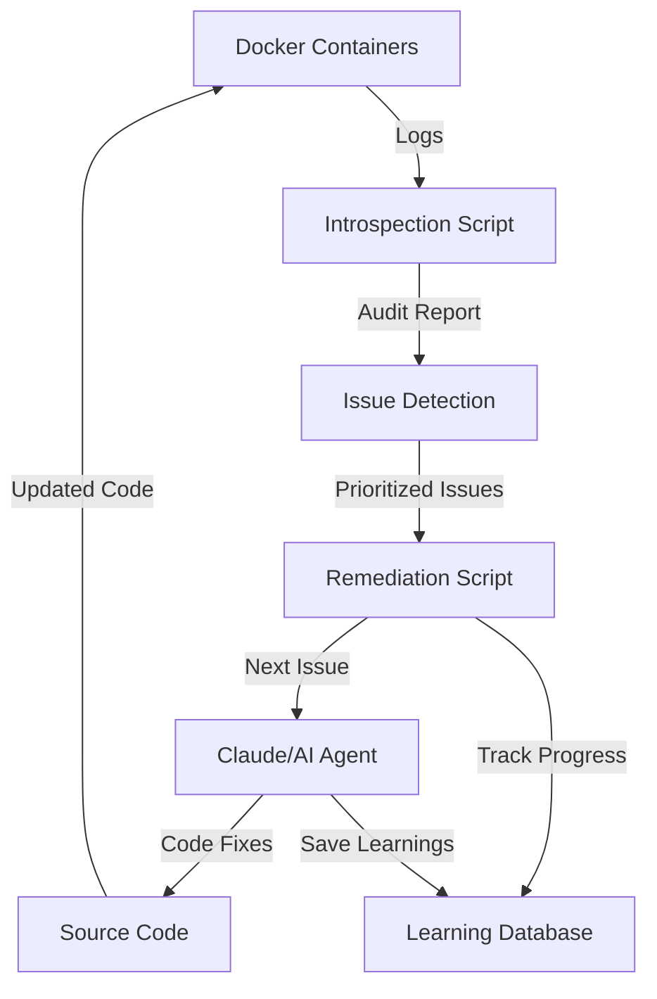

# Docker Error Remediation Architecture

## Overview

The Docker log introspection and remediation system is designed as a **detection and tracking framework** that works in conjunction with Claude (or other AI agents) to identify and fix container errors.

## System Components

### 1. Docker Log Introspection Script (`scripts/docker_log_introspection.py`)

**Purpose**: Issue Detection and Categorization
- Scans Docker container logs for error patterns
- Categorizes issues by severity (CRITICAL, HIGH, MEDIUM, LOW)
- Generates audit reports with issue details
- Creates prioritized remediation plans

**What it does**:
- ✅ **Detects** errors in container logs
- ✅ **Categorizes** issues by type and severity
- ✅ **Prioritizes** which issues to fix first
- ✅ **Reports** findings in structured JSON format
- ❌ **Does NOT fix** issues directly

### 2. Automated Error Remediation Script (`scripts/automated_error_remediation.py`)

**Purpose**: Orchestration and Tracking
- Runs introspection repeatedly
- Tracks which issues have been addressed
- Logs remediation progress
- Saves learnings from fixes

**What it does**:
- ✅ **Orchestrates** the detection-fix cycle
- ✅ **Tracks** which issues have been attempted
- ✅ **Logs** each step of the process
- ✅ **Identifies** the next issue to fix
- ⚠️ **Attempts** basic fixes (like cleaning orphaned DB records)
- ❌ **Does NOT** perform complex code fixes

## Claude Integration Pattern



### How Claude Uses These Scripts

1. **Issue Discovery Phase**:
   ```python
   # Claude runs introspection to find issues
   python scripts/docker_log_introspection.py
   ```
   - Generates `docker_audit_report.json` with all current issues
   - Creates `remediation_plan.json` with suggested agent assignments

2. **Issue Selection Phase**:
   ```python
   # Automated script identifies next issue to fix
   issue = get_next_issue(report)
   ```
   - Prioritizes by severity (CRITICAL > HIGH > MEDIUM > LOW)
   - Tracks already-fixed issues to avoid duplicates

3. **Remediation Phase**:
   - **For Simple Issues**: Script attempts basic fixes
     - Database cleanup commands
     - Container restarts
     - Log level adjustments
   
   - **For Complex Issues**: Claude deploys specialized agents
     ```python
     # Claude receives issue details
     {
       "issue_type": "Database connectivity issue",
       "container": "netra-auth",
       "log_excerpt": "error details...",
       "severity": "CRITICAL"
     }
     
     # Claude then:
     # 1. Analyzes the root cause
     # 2. Modifies source code
     # 3. Updates configurations
     # 4. Implements proper fixes
     ```

4. **Verification Phase**:
   ```python
   # Re-run introspection to verify fixes
   python scripts/docker_log_introspection.py
   ```
   - Confirms issues are resolved
   - Identifies any new issues introduced

## Division of Responsibilities

### Scripts Handle:
- **Detection**: Finding errors in logs
- **Categorization**: Grouping by type and severity
- **Prioritization**: Determining fix order
- **Tracking**: Recording what's been attempted
- **Simple Fixes**: Basic database cleanup, restarts
- **Reporting**: Structured issue reports
- **Progress Logging**: Step-by-step documentation

### Claude/AI Agents Handle:
- **Root Cause Analysis**: Understanding why errors occur
- **Code Fixes**: Modifying source code to fix issues
- **Configuration Updates**: Adjusting environment settings
- **Architecture Decisions**: Determining proper solutions
- **Complex Remediation**: Multi-file changes, refactoring
- **Testing**: Verifying fixes work correctly
- **Learning Extraction**: Understanding patterns for future prevention

## Example Workflow

```bash
# Step 1: Claude runs introspection
$ python scripts/docker_log_introspection.py
Found 78 issues:
  - CRITICAL: 4
  - HIGH: 55
  - MEDIUM: 19

# Step 2: Script identifies critical issue
Next issue: "Database connectivity issue in netra-auth"

# Step 3: Claude receives issue details and deploys fix
Claude analyzes: "Auth database shutdown completed"
Claude determines: This is a log level issue, not actual failure
Claude fixes: Changes logger.info() to logger.debug()

# Step 4: Script tracks fix completion
Issue fixed: netra-auth_Database connectivity issue_2025-08-28T05:45:22

# Step 5: Re-run to verify
$ python scripts/docker_log_introspection.py
Found 74 issues (4 fewer than before)

# Step 6: Continue until all issues resolved
Repeat steps 2-5 for remaining issues
```

## Key Design Principles

1. **Separation of Concerns**:
   - Scripts = Detection & Tracking
   - Claude = Analysis & Fixing

2. **Iterative Improvement**:
   - Each cycle reduces total issues
   - Learnings prevent regression

3. **Prioritized Approach**:
   - Fix critical issues first
   - Address root causes over symptoms

4. **Tracked Progress**:
   - Every action logged
   - Fixed issues recorded
   - Learnings saved for future

## Files Generated

| File | Purpose | Used By |
|------|---------|---------|
| `docker_audit_report.json` | Current issue inventory | Scripts & Claude |
| `remediation_plan.json` | Suggested fix priority | Scripts & Claude |
| `remediation_progress.log` | Step-by-step activity log | Monitoring |
| `remediation_log.json` | Structured fix history | Learning extraction |
| `SPEC/learnings/docker_remediation.xml` | Permanent learnings | Future prevention |

## Summary

The Docker remediation scripts are **intelligent trackers and orchestrators** that:
1. Find issues through log analysis
2. Prioritize what needs fixing
3. Track what's been attempted
4. Hand off complex fixes to Claude
5. Verify fixes worked
6. Save learnings for the future

They work **with** Claude as a detection and tracking layer, not as standalone fixers. Claude provides the intelligence to understand root causes and implement proper solutions, while the scripts provide the structure to systematically eliminate all issues.