# VPC Egress Decision Matrix for External Services

## Overview

This decision matrix helps determine the correct VPC egress configuration for any external service. Based on the Sept 15, 2025 VPC egress regression analysis.

**Related Documentation:**
- `/SPEC/learnings/vpc_egress_cloud_sql_regression_critical.xml`
- `/docs/infrastructure/clickhouse-network-path-analysis.md`
- `/docs/infrastructure/vpc-egress-regression-timeline.md`

## Quick Decision Rules

### **🔴 NEVER Use all-traffic VPC Egress**
- **Why**: Breaks Cloud SQL Unix socket connections
- **Impact**: Complete database connectivity failure
- **Exception**: Only if no Cloud SQL Unix sockets are used

### **✅ ALWAYS Use private-ranges-only + Cloud NAT**
- **Why**: Enables both internal and external service access
- **Cost**: ~$50/month for Cloud NAT
- **Benefit**: Zero code changes, maximum compatibility

## Service Categorization Matrix

### **Category 1: External Internet Services → Require Cloud NAT**

| Service | URL Pattern | VPC Egress | Cloud NAT | Example |
|---------|-------------|------------|-----------|---------|
| **ClickHouse Cloud** | `*.clickhouse.cloud` | private-ranges-only | ✅ Required | `xedvrr4c3r.us-central1.gcp.clickhouse.cloud:8443` |
| **OpenAI API** | `api.openai.com` | private-ranges-only | ✅ Required | `https://api.openai.com/v1/chat/completions` |
| **Anthropic API** | `api.anthropic.com` | private-ranges-only | ✅ Required | `https://api.anthropic.com/v1/messages` |
| **Google Gemini** | `generativelanguage.googleapis.com` | private-ranges-only | ✅ Required | AI/ML external endpoints |
| **Webhook Endpoints** | Customer domains | private-ranges-only | ✅ Required | `https://customer.com/webhook` |
| **External Monitoring** | Various SaaS | private-ranges-only | ✅ Required | DataDog, New Relic, etc. |
| **Third-party APIs** | Various | private-ranges-only | ✅ Required | Payment, analytics, etc. |
| **Package Registries** | `pypi.org`, `npmjs.com` | private-ranges-only | ✅ Required | Build-time dependencies |

**Network Path**: `Cloud Run → VPC → Cloud NAT → Internet → External Service`

### **Category 2: Internal GCP Services → Direct Access (No NAT)**

| Service | URL/Path Pattern | VPC Egress | Cloud NAT | Example |
|---------|------------------|------------|-----------|---------|
| **Cloud SQL Unix** | `/cloudsql/PROJECT:REGION:INSTANCE` | private-ranges-only | ❌ Must bypass | Database connections |
| **Secret Manager** | `secretmanager.googleapis.com` | private-ranges-only | ❌ Not needed | Configuration secrets |
| **Cloud Storage** | `storage.googleapis.com` (internal) | private-ranges-only | ❌ Not needed | Internal buckets |
| **Cloud Logging** | `logging.googleapis.com` | private-ranges-only | ❌ Not needed | Application logs |
| **Cloud Monitoring** | `monitoring.googleapis.com` | private-ranges-only | ❌ Not needed | Metrics and alerts |
| **Cloud Pub/Sub** | `pubsub.googleapis.com` | private-ranges-only | ❌ Not needed | Message queues |
| **Cloud SQL TCP** | Private IP ranges | private-ranges-only | ❌ Not needed | Alternative to Unix sockets |
| **Redis/Memorystore** | Private IP ranges | private-ranges-only | ❌ Not needed | Caching services |

**Network Path**: `Cloud Run → VPC → Private Google Network → GCP Service`

### **Category 3: Hybrid Services → Work with Both**

| Service | URL Pattern | VPC Egress | Cloud NAT | Notes |
|---------|-------------|------------|-----------|-------|
| **Cloud Storage Public** | `storage.googleapis.com` | private-ranges-only | Optional | Can use either path |
| **BigQuery Public** | `bigquery.googleapis.com` | private-ranges-only | Optional | Public API endpoints |
| **Cloud Translation** | `translate.googleapis.com` | private-ranges-only | Optional | AI/ML public APIs |
| **Firebase** | `firebase.googleapis.com` | private-ranges-only | Optional | Public endpoints |

## Implementation Decision Tree

```mermaid
graph TD
    A[New External Service] --> B{Is it an internet service?}
    B -->|Yes| C{Outside Google Cloud?}
    C -->|Yes| D[✅ Cloud NAT Required<br/>private-ranges-only]
    C -->|No| E{Internal GCP API?}
    E -->|Yes| F[❌ No NAT<br/>private-ranges-only]
    E -->|No| G[🤔 Check documentation]
    B -->|No| H{Is it Cloud SQL Unix socket?}
    H -->|Yes| I[❌ No NAT<br/>private-ranges-only<br/>⚠️ NEVER all-traffic]
    H -->|No| F
```



## Common Patterns and Examples

### **LLM Services Pattern**
All AI/LLM services follow the same pattern:
```yaml
# OpenAI, Anthropic, Hugging Face, etc.
vpc_egress: private-ranges-only
cloud_nat: required
reasoning: "External internet services need NAT for routing"
```

### **Analytics Services Pattern**
External analytics services:
```yaml
# ClickHouse Cloud, Snowflake, BigQuery external, etc.
vpc_egress: private-ranges-only  
cloud_nat: required
reasoning: "External data services need internet access"
```

### **Database Services Pattern**
```yaml
# Cloud SQL Unix sockets
vpc_egress: private-ranges-only
cloud_nat: not_used
routing: direct_proxy_bypass
reasoning: "Unix sockets cannot work through VPC connectors"

# Cloud SQL TCP, AlloyDB, etc.
vpc_egress: private-ranges-only
cloud_nat: not_needed
routing: private_ip
reasoning: "Internal GCP network routing"
```

## Validation Commands

### **Test External Service Access**
```bash
# From Cloud Run container or local with VPC access
curl -v https://api.openai.com/v1/models
curl -v https://api.anthropic.com/v1/messages  
curl -v https://xedvrr4c3r.us-central1.gcp.clickhouse.cloud:8443/ping
```

### **Test Internal Service Access**
```bash
# Cloud SQL Unix socket
psql "postgresql://user:pass@/db?host=/cloudsql/project:region:instance"

# Secret Manager
gcloud secrets versions access latest --secret=test-secret
```

### **Comprehensive Validation**
```bash
# Run our validation script
python scripts/validate_vpc_dependencies.py netra-staging
```

## Cost Analysis by Service Category

### **Cloud NAT Costs**
| Usage Pattern | Monthly Cost | Notes |
|---------------|--------------|-------|
| **Low Usage** (LLM APIs only) | $45-50 | Base NAT cost + minimal data |
| **Medium Usage** (LLM + Analytics) | $50-75 | Base + ~50GB data processing |
| **High Usage** (Heavy external API) | $75-120 | Base + 100-200GB processing |

### **Cost-Benefit Analysis**
| Alternative | Cost | Code Changes | Reliability |
|-------------|------|--------------|-------------|
| **Cloud NAT + private-ranges** | $50/month | None | Highest |
| **All-traffic (broken)** | $0 | None | 0% (breaks Cloud SQL) |
| **TCP-only databases** | $0 | Major | Medium |
| **Service-specific VPC** | Complex | Major | Medium |

## Troubleshooting Guide

### **External Service Connection Failures**
1. **Check VPC egress setting**: Must be `private-ranges-only`
2. **Verify Cloud NAT exists**: `gcloud compute routers nats list`
3. **Test NAT routing**: Check if internal services work (they should)
4. **Validate DNS resolution**: External domains must resolve

### **Cloud SQL Connection Timeouts**
1. **Check for all-traffic**: This breaks Unix sockets immediately
2. **Verify Unix socket path**: Must be `/cloudsql/PROJECT:REGION:INSTANCE`
3. **Test direct connection**: Should be <1 second
4. **Review regression detection logs**: Look for VPC egress warnings

### **Mixed Service Failures**
1. **Check service categorization**: Use this matrix
2. **Validate NAT configuration**: All external services need NAT
3. **Review network logs**: Cloud NAT and VPC flow logs
4. **Run comprehensive validation**: Use our validation script

## Future Service Integration

### **Adding New External Services**
1. **Categorize the service**: Internet vs GCP vs Hybrid
2. **Update validation script**: Add connectivity test
3. **Document in this matrix**: Update service list
4. **Test with both VPC settings**: Ensure NAT requirement is correct

### **Migration Planning**
For any new external service:
1. Assume it needs Cloud NAT (safest default)
2. Test with `private-ranges-only` + NAT
3. Confirm it doesn't work with `private-ranges-only` alone
4. Document the requirements in this matrix

## References and Cross-Links

### **Learning Documents**
- **Root Cause**: `/SPEC/learnings/vpc_egress_cloud_sql_regression_critical.xml`
- **ClickHouse Analysis**: `/docs/infrastructure/clickhouse-network-path-analysis.md`
- **Timeline**: `/docs/infrastructure/vpc-egress-regression-timeline.md`
- **Solutions**: `/SPEC/learnings/vpc_clickhouse_proxy_solutions.xml`

### **Implementation Files**
- **Deployment Config**: `/scripts/deploy_to_gcp_actual.py:1088`
- **Terraform**: `/terraform-gcp-staging/vpc-nat.tf`
- **Validation**: `/scripts/validate_vpc_dependencies.py`
- **Error Detection**: `/auth_service/auth_core/database/connection.py:105`

### **Related Issues**
- **GitHub #1086**: Original ClickHouse connectivity crisis
- **GitHub #1263**: Database connection timeouts
- **GitHub #1278**: Infrastructure capacity issues

---

**Last Updated**: 2025-09-16  
**Applies To**: All external service integrations  
**Decision**: Always use Cloud NAT + private-ranges-only  
**Exception**: None - this is the universal solution