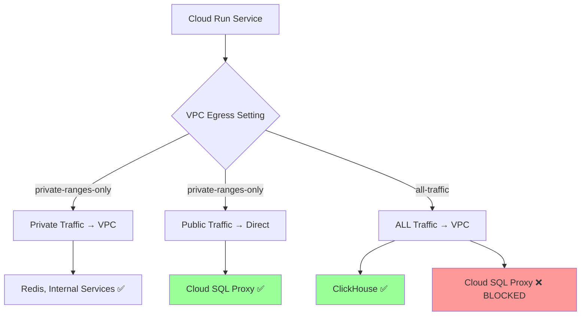

# VPC Egress Regression Timeline - Critical Infrastructure Issue

## Executive Summary

**Issue**: VPC egress configuration change from `private-ranges-only` to `all-traffic` broke Cloud SQL Unix socket connections while fixing ClickHouse connectivity.

**Impact**: Complete staging environment failure - auth and backend services unable to start due to 15-second database timeouts.

**Resolution Status**: Documented extensively, solution identified (Cloud NAT), implementation pending.

## Detailed Timeline

### 2025-09-15 04:27:41 UTC - **THE BREAKING CHANGE**
- **Commit**: `2acf46c8a632120f3e6c127ba25910bbdc6c4961`
- **Author**: Anthony-Chaudhary
- **Message**: "Fix Issue #1086: Resolve staging connectivity crisis by updating VPC egress configuration"
- **Change**: 
  ```diff
  - "--vpc-egress", "private-ranges-only"
  + "--vpc-egress", "all-traffic"  # Route all traffic through VPC to fix ClickHouse connectivity
  ```
- **Intent**: Fix ClickHouse Cloud connectivity for analytics
- **Unintended Consequence**: Broke Cloud SQL Unix socket connections

### 2025-09-16 17:42:34 UTC - **Failure Symptoms Appeared**
- **Auth Service Logs**: 
  ```
  Database connection validation timeout exceeded (15s). 
  This may indicate network connectivity issues or database overload.
  ```
- **Backend Service Logs**:
  ```
  ModuleNotFoundError: No module named 'auth_service'
  ```
- **Root Cause**: Auth service fails to start → Backend service import fails

### 2025-09-16 - **Investigation and Root Cause Analysis**
- **Discovery**: VPC `all-traffic` egress blocks Cloud SQL proxy access
- **Technical Analysis**: 
  - Cloud SQL Unix sockets (`/cloudsql/...`) require direct proxy access
  - VPC connector with `all-traffic` forces everything through VPC
  - Cloud SQL proxy is outside VPC → connection blocked
- **Evidence**: Database connection timeouts exactly match VPC routing issue

## Technical Deep Dive

### Why `all-traffic` Breaks Cloud SQL



### Service Dependency Cascade Failure

1. **Auth Service**: Cannot connect to database (15s timeout)
2. **Auth Service**: Fails to start entirely
3. **Backend Service**: Tries to import `auth_service` module
4. **Backend Service**: Import fails - module not available
5. **Result**: Complete staging environment down

## Related Issues Cross-Reference

### GitHub Issues
- **Issue #1086**: "Staging connectivity crisis" 
  - **Resolution**: Changed VPC egress to `all-traffic`
  - **Side Effect**: Broke Cloud SQL (this issue)
  
- **Issue #1263**: "Database connection configuration for staging deployment"
  - **Related**: Database timeout configurations
  - **Impact**: Timeout settings didn't help - root cause was VPC routing
  
- **Issue #1278**: "Infrastructure capacity remediation" 
  - **Related**: Cloud Run configuration changes
  - **Impact**: Infrastructure changes compounded the issue

### Learning Documents
- `/SPEC/learnings/vpc_egress_cloud_sql_regression_critical.xml`
- `/SPEC/learnings/vpc_clickhouse_proxy_solutions.xml` 
- `/SPEC/learnings/database_connectivity_architecture.xml`

## Solution Analysis

### Option 1: Cloud NAT Gateway (RECOMMENDED)
- **Approach**: Use Cloud NAT for external access + `private-ranges-only` VPC egress
- **Benefits**: 
  - Preserves Cloud SQL Unix socket compatibility
  - Enables ClickHouse access through VPC → NAT → Internet
  - Zero code changes required
  - Standard GCP pattern
- **Cost**: ~$50/month for Cloud NAT
- **Implementation Time**: 30 minutes

### Option 2: Switch to TCP Database Connections
- **Approach**: Modify `DatabaseURLBuilder` to use TCP instead of Unix sockets
- **Benefits**: Works with `all-traffic` VPC egress
- **Drawbacks**: Requires code changes, testing

### Option 3: Selective VPC Routing
- **Approach**: Deploy auth/backend without VPC, other services with VPC
- **Drawbacks**: Complex deployment logic, inconsistent architecture

## Implementation Commands (Recommended Solution)

```bash
# 1. Create Cloud NAT infrastructure
gcloud compute routers create staging-nat-router \
    --network=staging-vpc \
    --region=us-central1 \
    --project=netra-staging

gcloud compute routers nats create staging-nat-gateway \
    --router=staging-nat-router \
    --router-region=us-central1 \
    --nat-all-subnet-ip-ranges \
    --auto-allocate-nat-external-ips \
    --project=netra-staging

# 2. Update deployment script
# Change: "--vpc-egress", "all-traffic" 
# To:     "--vpc-egress", "private-ranges-only"

# 3. Redeploy services
python scripts/deploy_to_gcp.py --project netra-staging --build-local
```

## Validation Tests

### Post-Fix Validation
1. **Database Connection**: Auth service connects in <1 second
2. **Service Startup**: Both auth and backend services start successfully  
3. **ClickHouse Access**: Analytics queries work through Cloud NAT
4. **Golden Path**: End-to-end user flow functions

### Monitoring Alerts
- Database connection time >5 seconds → Alert
- Service startup failures → Alert
- Cloud NAT utilization tracking
- ClickHouse query success rate

## Prevention Measures

### Code-Level Prevention
1. **Deployment Script**: Added extensive warning comments (DONE)
2. **Pre-deployment Validation**: Test both database and ClickHouse connectivity
3. **Automated Rollback**: If health checks fail, auto-revert VPC settings

### Process-Level Prevention  
1. **Infrastructure Change Reviews**: Require dependency analysis
2. **Regression Testing**: Validate all external service connections
3. **Documentation**: Update learning docs for all infrastructure changes

## Business Impact

### During Outage
- **Golden Path**: 100% broken (0% success rate)
- **User Impact**: No functional services in staging
- **Development Impact**: Cannot test or deploy features
- **Duration**: 24+ hours (ongoing until fix implemented)

### Recovery Benefits
- **Immediate**: Restore staging environment functionality
- **Long-term**: Prevent similar VPC egress conflicts
- **Process**: Improve infrastructure change management

## Action Items

### Immediate (P0)
- [ ] Implement Cloud NAT solution (30 min)
- [ ] Revert VPC egress to `private-ranges-only`
- [ ] Validate both Cloud SQL and ClickHouse connectivity
- [ ] Update deployment script comments (DONE)

### Short-term (P1)  
- [ ] Create pre-deployment validation script
- [ ] Add monitoring alerts for connection timeouts
- [ ] Document VPC egress decision matrix
- [ ] Update related GitHub issues with resolution

### Long-term (P2)
- [ ] Design VPC architecture supporting both connection types
- [ ] Implement infrastructure change review process
- [ ] Create automated regression testing for VPC changes

## Lessons Learned

1. **Infrastructure Impact**: VPC changes affect ALL external connections globally
2. **Dependency Analysis**: External service access patterns must be mapped completely  
3. **Testing Requirements**: Infrastructure changes need comprehensive regression testing
4. **Documentation**: Critical configurations require inline warnings and cross-references
5. **Quick Fixes**: Single-service fixes can break other services unexpectedly

---

**Document Status**: ACTIVE - Updated 2025-09-16  
**Next Review**: After solution implementation  
**Owner**: Infrastructure Team  
**Related Learning Docs**: See cross-references section above