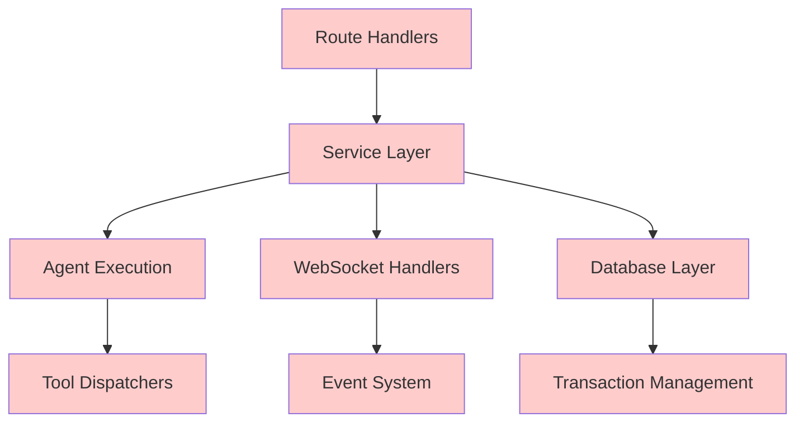

# User Context Migration Guide: From `create_user_execution_context()` to `get_request_scoped_user_context()`

## Table of Contents
1. [Executive Summary](#executive-summary)
2. [Current State Analysis](#current-state-analysis)
3. [Architectural Differences](#architectural-differences)
4. [Migration Complexity Assessment](#migration-complexity-assessment)
5. [Comprehensive Migration Plan](#comprehensive-migration-plan)
6. [Benefits and Business Value](#benefits-and-business-value)
7. [Risk Analysis and Mitigation](#risk-analysis-and-mitigation)
8. [Implementation Timeline](#implementation-timeline)
9. [Success Metrics](#success-metrics)
10. [Recommendations](#recommendations)

---

## Executive Summary

### Overview
This document provides a comprehensive guide for migrating the Netra Apex platform from the monolithic `create_user_execution_context()` pattern to the separated `get_request_scoped_user_context()` pattern. This migration represents a fundamental shift in how we handle user context and database sessions across the platform.

### Key Migration Facts
- **Scope**: 67 files across the codebase
- **Duration**: 5-7 months (20-29 weeks)
- **Effort**: 53-75 engineer-weeks
- **Risk Level**: High (touches core infrastructure)
- **Business Impact**: Platform-wide improvement in scalability and maintainability

### Migration Philosophy
Moving from a **"Session-In-Context"** pattern (where database sessions are bundled with user context) to a **"Separation of Concerns"** pattern (where sessions are managed independently through dependency injection).

---

## Current State Analysis

### Current Usage Statistics
```
Total Files Using create_user_execution_context(): 67
- Backend Core: 23 files
- WebSocket Handlers: 15 files
- Route Handlers: 12 files
- Test Files: 17 files
```

### Current Pattern Overview

#### The Monolithic Approach (`create_user_execution_context()`)
```python
# Current Pattern - Everything bundled together
user_context = create_user_execution_context(
    user_id="user123",
    thread_id="thread456",
    run_id="run789",
    db_session=db_session,  # ← Session stored IN context
    websocket_connection_id="ws_conn_001"
)

# Single object passed everywhere
await service.process(user_context)  # Has everything needed
```

**Key Characteristics:**
- Returns `UserExecutionContext` - a rich, immutable dataclass
- Contains 10+ fields including database session
- Supports hierarchical operations (parent/child contexts)
- Comprehensive audit trail capabilities
- Session lifecycle tied to context object

#### The Separated Approach (`get_request_scoped_user_context()`)
```python
# New Pattern - Clean separation
context = await get_request_scoped_user_context(
    user_id="user123",
    thread_id="thread456",
    run_id="run789",
    websocket_connection_id="ws_conn_001"
    # Note: NO db_session parameter
)

# Session obtained separately via dependency injection
async def handler(
    context: RequestScopedContext,  # Metadata only
    db: AsyncSession = Depends(get_db)  # Session separate
):
    await service.process(context, db)  # Both required
```

**Key Characteristics:**
- Returns `RequestScopedContext` - a lightweight dataclass
- Contains only 5 identifier fields
- NEVER stores database sessions
- Session lifecycle managed by FastAPI
- Follows dependency injection best practices

---

## Architectural Differences

### Detailed Comparison Table

| Aspect | `UserExecutionContext` (Current) | `RequestScopedContext` (Target) |
|--------|----------------------------------|----------------------------------|
| **Class Type** | Frozen dataclass (immutable) | Simple dataclass (mutable) |
| **Field Count** | 10+ fields | 5 fields |
| **Database Session** | ✅ Stored in context | ❌ Never stored |
| **Memory Footprint** | ~2KB per instance | ~200B per instance |
| **Audit Trail** | Built-in comprehensive audit | Basic tracking only |
| **Child Contexts** | ✅ Supports hierarchy | ❌ No hierarchy |
| **Validation** | 20+ validation rules | Minimal validation |
| **Thread Safety** | Immutable (thread-safe) | Mutable (requires care) |
| **WebSocket Support** | Direct integration | Requires adaptation |
| **Testing** | Complex mocking | Simple mocking |

### Session Lifecycle Management

#### Current Pattern (Session-In-Context)
```
┌─────────────────┐
│   HTTP Request  │
└────────┬────────┘
         │
         ▼
┌─────────────────────────────┐
│  Create UserExecutionContext │
│  (with embedded session)     │
└────────┬─────────────────────┘
         │
         ▼
┌─────────────────────────────┐
│   Service Layer             │
│   - Direct session access   │
│   - context.db_session      │
└────────┬─────────────────────┘
         │
         ▼
┌─────────────────────────────┐
│   Database Operations       │
│   - Using embedded session  │
└─────────────────────────────┘
```

#### Target Pattern (Separated Concerns)
```
┌─────────────────┐
│   HTTP Request  │
└────────┬────────┘
         │
         ├─────────────────┐
         ▼                 ▼
┌──────────────────┐  ┌──────────────────┐
│  RequestScoped   │  │  Database        │
│  Context         │  │  Session         │
│  (metadata only) │  │  (via Depends)   │
└────────┬─────────┘  └────────┬─────────┘
         │                     │
         └──────────┬──────────┘
                    ▼
         ┌─────────────────────┐
         │   Service Layer     │
         │   - Receives both   │
         │   - process(ctx,db) │
         └──────────┬──────────┘
                    ▼
         ┌─────────────────────┐
         │  Database Operations│
         │  - Explicit session │
         └─────────────────────┘
```

---

## Migration Complexity Assessment

### Complexity Factors

#### 1. **Code Volume Complexity**
- **67 files** requiring modification
- **~15,000 lines** of code impacted
- **200+ functions** with signature changes
- **50+ test files** requiring updates

#### 2. **Architectural Complexity**
- **Fundamental pattern change** (monolithic → separated)
- **Session lifecycle redesign** 
- **Dependency injection restructuring**
- **Transaction boundary modifications**

#### 3. **Integration Complexity**

*All red components require modification*

#### 4. **Risk Complexity**
- **High Risk**: Core infrastructure changes
- **Session Isolation**: Critical for multi-user support
- **Performance Impact**: Potential latency increases
- **Rollback Difficulty**: Hard to reverse once started

### Complexity Score: **8.5/10** (Very High)

---

## Comprehensive Migration Plan

### Phase 1: Foundation and Analysis (Weeks 1-2)

#### Objectives
- Complete dependency mapping
- Identify critical paths
- Establish baseline metrics

#### Tasks
```python
# 1.1 Create Migration Tracker
class MigrationTracker:
    """Track migration progress across codebase"""
    
    def scan_codebase(self) -> Dict[str, List[str]]:
        """Find all uses of create_user_execution_context"""
        
    def generate_dependency_graph(self) -> Graph:
        """Map service dependencies"""
        
    def identify_critical_paths(self) -> List[str]:
        """Find high-risk migration points"""
```

#### Deliverables
- Migration impact report
- Dependency graph visualization
- Risk assessment document
- Baseline performance metrics

---

### Phase 2: Enhanced Context Development (Weeks 3-5)

#### Objectives
- Create bridge between old and new patterns
- Maintain backward compatibility
- Enable gradual migration

#### Implementation
```python
@dataclass
class EnhancedRequestScopedContext:
    """Bridge context supporting migration"""
    
    # Core fields (RequestScopedContext compatible)
    user_id: str
    thread_id: str
    run_id: Optional[str] = None
    websocket_connection_id: Optional[str] = None
    request_id: Optional[str] = None
    
    # Enhanced fields for compatibility
    agent_context: Dict[str, Any] = field(default_factory=dict)
    audit_metadata: Dict[str, Any] = field(default_factory=dict)
    operation_depth: int = 0
    parent_request_id: Optional[str] = None
    created_at: datetime = field(default_factory=lambda: datetime.now(timezone.utc))
    
    def to_user_execution_context(self, db_session: AsyncSession) -> UserExecutionContext:
        """Convert to legacy format when needed"""
        return create_user_execution_context(
            user_id=self.user_id,
            thread_id=self.thread_id,
            run_id=self.run_id,
            db_session=db_session,
            websocket_connection_id=self.websocket_connection_id
        )
    
    def create_child_context(self, operation_name: str) -> 'EnhancedRequestScopedContext':
        """Support hierarchical operations during migration"""
        return EnhancedRequestScopedContext(
            user_id=self.user_id,
            thread_id=self.thread_id,
            run_id=self.run_id,
            request_id=str(uuid.uuid4()),
            operation_depth=self.operation_depth + 1,
            parent_request_id=self.request_id,
            agent_context={**self.agent_context, 'operation': operation_name}
        )
```

#### Conversion Utilities
```python
class ContextConverter:
    """Utilities for context conversion during migration"""
    
    @staticmethod
    def split_user_context(
        user_context: UserExecutionContext
    ) -> Tuple[RequestScopedContext, AsyncSession]:
        """Split monolithic context into separated components"""
        context = RequestScopedContext(
            user_id=user_context.user_id,
            thread_id=user_context.thread_id,
            run_id=user_context.run_id,
            websocket_connection_id=user_context.websocket_client_id,
            request_id=user_context.request_id
        )
        return context, user_context.db_session
    
    @staticmethod
    def merge_to_user_context(
        context: RequestScopedContext,
        db_session: AsyncSession
    ) -> UserExecutionContext:
        """Merge separated components for legacy code"""
        return create_user_execution_context(
            user_id=context.user_id,
            thread_id=context.thread_id,
            run_id=context.run_id,
            db_session=db_session,
            websocket_connection_id=context.websocket_connection_id
        )
```

---

### Phase 3: Service Layer Adaptation (Weeks 6-9)

#### Objectives
- Modify service interfaces to support both patterns
- Create adapter layers for gradual migration
- Maintain backward compatibility

#### Service Adapter Pattern
```python
class ServiceAdapter(ABC):
    """Base adapter for dual-pattern support"""
    
    @abstractmethod
    async def process_legacy(self, user_context: UserExecutionContext) -> Any:
        """Legacy processing with monolithic context"""
        
    @abstractmethod
    async def process_modern(
        self, 
        context: RequestScopedContext,
        db_session: AsyncSession
    ) -> Any:
        """Modern processing with separated concerns"""
    
    async def process(
        self,
        context: Union[UserExecutionContext, RequestScopedContext],
        db_session: Optional[AsyncSession] = None
    ) -> Any:
        """Universal entry point supporting both patterns"""
        if isinstance(context, UserExecutionContext):
            return await self.process_legacy(context)
        elif isinstance(context, RequestScopedContext):
            if db_session is None:
                raise ValueError("db_session required for RequestScopedContext")
            return await self.process_modern(context, db_session)
        else:
            raise TypeError(f"Unsupported context type: {type(context)}")
```

#### Service Migration Example
```python
# Before Migration
class MessageHandlerService:
    async def process_message(self, user_context: UserExecutionContext):
        # Direct session access
        message = await self.fetch_message(user_context.db_session)
        await self.send_websocket_event(user_context.websocket_client_id)
        
# After Migration
class MessageHandlerService(ServiceAdapter):
    async def process_legacy(self, user_context: UserExecutionContext):
        # Maintain backward compatibility
        return await self._process(
            user_context.user_id,
            user_context.thread_id,
            user_context.db_session,
            user_context.websocket_client_id
        )
    
    async def process_modern(
        self,
        context: RequestScopedContext,
        db_session: AsyncSession
    ):
        # New separated pattern
        return await self._process(
            context.user_id,
            context.thread_id,
            db_session,
            context.websocket_connection_id
        )
    
    async def _process(
        self,
        user_id: str,
        thread_id: str,
        db_session: AsyncSession,
        websocket_id: Optional[str]
    ):
        # Shared implementation
        message = await self.fetch_message(db_session)
        if websocket_id:
            await self.send_websocket_event(websocket_id)
```

---

### Phase 4: Route Handler Migration (Weeks 10-12)

#### Objectives
- Update FastAPI route handlers
- Implement proper dependency injection
- Add feature flags for gradual rollout

#### Migration Strategy
```python
# Feature Flag System
class MigrationFeatureFlags:
    """Control migration rollout"""
    
    MIGRATED_ROUTES = {
        "/api/v2/message": True,  # New routes use separated pattern
        "/api/message": False,     # Legacy routes maintain old pattern
    }
    
    @classmethod
    def use_separated_pattern(cls, route_path: str) -> bool:
        return cls.MIGRATED_ROUTES.get(route_path, False)

# Adaptive Dependency
async def get_adaptive_context(
    request: Request,
    user_id: str = "default_user",
    thread_id: str = "default_thread"
) -> Union[UserExecutionContext, RequestScopedContext]:
    """Provide appropriate context based on route"""
    
    if MigrationFeatureFlags.use_separated_pattern(request.url.path):
        return await get_request_scoped_user_context(
            user_id=user_id,
            thread_id=thread_id
        )
    else:
        # Legacy pattern with embedded session
        async with get_db() as session:
            return create_user_execution_context(
                user_id=user_id,
                thread_id=thread_id,
                db_session=session
            )
```

#### Route Migration Example
```python
# Legacy Route (Before)
@router.post("/message")
async def process_message_legacy(
    request: MessageRequest,
    db: AsyncSession = Depends(get_db)
):
    user_context = create_user_execution_context(
        user_id="default_user",
        thread_id=request.thread_id,
        db_session=db
    )
    return await message_service.process(user_context)

# Migrated Route (After)
@router.post("/v2/message")
async def process_message_modern(
    request: MessageRequest,
    context: RequestScopedContext = Depends(get_request_scoped_user_context),
    db: AsyncSession = Depends(get_db)
):
    # Clean separation
    return await message_service.process(context, db)

# Transitional Route (During Migration)
@router.post("/message")
async def process_message_adaptive(
    request: MessageRequest,
    context: Union[UserExecutionContext, RequestScopedContext] = Depends(get_adaptive_context),
    db: Optional[AsyncSession] = Depends(get_db_if_needed)
):
    # Works with both patterns
    if isinstance(context, UserExecutionContext):
        return await message_service.process(context)
    else:
        return await message_service.process(context, db)
```

---

### Phase 5: WebSocket System Migration (Weeks 13-15)

#### Objectives
- Update WebSocket handlers for separated sessions
- Modify event routing system
- Ensure real-time features continue working

#### WebSocket Handler Migration
```python
# Before Migration
class WebSocketHandler:
    def __init__(self, user_context: UserExecutionContext):
        self.user_context = user_context  # Contains session
        
    async def handle_message(self, message: dict):
        # Direct session access
        result = await query_database(self.user_context.db_session)
        await self.send_response(result)

# After Migration  
class WebSocketHandler:
    def __init__(self, context: RequestScopedContext):
        self.context = context  # No session
        
    async def handle_message(self, message: dict):
        # Get fresh session per operation
        async with self.get_session() as db_session:
            result = await query_database(db_session)
            await self.send_response(result)
    
    @asynccontextmanager
    async def get_session(self):
        """Get properly scoped session for WebSocket operation"""
        async with get_user_scoped_db_session(
            self.context.user_id,
            self.context.request_id,
            self.context.thread_id
        ) as session:
            yield session
```

#### WebSocket Event System Updates
```python
class WebSocketEventRouter:
    """Route events with separated context pattern"""
    
    async def route_event(
        self,
        event: dict,
        context: RequestScopedContext
    ):
        # Session obtained per event
        async with get_user_scoped_db_session(
            context.user_id,
            context.request_id
        ) as db_session:
            handler = self.get_handler(event['type'])
            await handler.handle(event, context, db_session)
```

---

### Phase 6: Database Integration Updates (Weeks 16-18)

#### Objectives
- Update transaction management
- Ensure proper session scoping
- Modify connection pooling

#### Session Lifecycle Management
```python
class SessionLifecycleManager:
    """Manage session lifecycle for separated pattern"""
    
    def __init__(self):
        self.active_sessions: Dict[str, AsyncSession] = {}
        
    @asynccontextmanager
    async def get_scoped_session(
        self,
        context: RequestScopedContext
    ) -> AsyncSession:
        """Get properly scoped session with tracking"""
        
        session_key = f"{context.user_id}:{context.request_id}"
        
        # Check for existing session (error - should not happen)
        if session_key in self.active_sessions:
            logger.error(f"Session already exists for {session_key}")
            raise SessionIsolationError("Duplicate session detected")
        
        try:
            # Create new session
            async with get_user_scoped_db_session(
                context.user_id,
                context.request_id,
                context.thread_id
            ) as session:
                # Track active session
                self.active_sessions[session_key] = session
                
                # Tag session with context
                session.info['context_user_id'] = context.user_id
                session.info['context_request_id'] = context.request_id
                
                yield session
                
        finally:
            # Clean up tracking
            self.active_sessions.pop(session_key, None)
    
    def validate_no_shared_sessions(self) -> bool:
        """Ensure no sessions are shared between contexts"""
        session_ids = [id(s) for s in self.active_sessions.values()]
        return len(session_ids) == len(set(session_ids))
```

#### Transaction Boundary Updates
```python
class TransactionManager:
    """Manage transactions with separated pattern"""
    
    @asynccontextmanager
    async def transaction(
        self,
        context: RequestScopedContext,
        db_session: AsyncSession
    ):
        """Manage transaction with proper context"""
        
        # Begin transaction
        async with db_session.begin():
            try:
                # Tag transaction with context
                db_session.info['transaction_context'] = context.request_id
                
                yield db_session
                
                # Commit on success
                await db_session.commit()
                logger.info(f"Transaction committed for {context.request_id}")
                
            except Exception as e:
                # Rollback on error
                await db_session.rollback()
                logger.error(f"Transaction rolled back for {context.request_id}: {e}")
                raise
```

---

### Phase 7: Agent Execution Engine Migration (Weeks 19-22)

#### Objectives
- Update agent factories for separated pattern
- Modify execution engines
- Update tool dispatchers

#### Agent Factory Updates
```python
class ModernAgentInstanceFactory:
    """Agent factory using separated context pattern"""
    
    async def create_agent(
        self,
        agent_type: str,
        context: RequestScopedContext
    ) -> Tuple[Agent, AsyncSession]:
        """Create agent with fresh session"""
        
        # Get session for agent
        async with self.get_agent_session(context) as db_session:
            # Create agent configuration
            config = self.build_agent_config(context, agent_type)
            
            # Initialize agent
            agent = await self.initialize_agent(
                config=config,
                context=context,
                session=db_session
            )
            
            return agent, db_session
    
    @asynccontextmanager
    async def get_agent_session(self, context: RequestScopedContext):
        """Get properly isolated session for agent"""
        async with get_user_scoped_db_session(
            context.user_id,
            f"agent_{context.request_id}"
        ) as session:
            yield session
```

#### Execution Engine Updates
```python
class ModernExecutionEngine:
    """Execution engine with separated concerns"""
    
    def __init__(self, context: RequestScopedContext):
        self.context = context  # No session stored
        
    async def execute(
        self,
        task: Task,
        db_session: AsyncSession
    ) -> Result:
        """Execute task with provided session"""
        
        # Create execution context
        exec_context = ExecutionContext(
            task=task,
            user_id=self.context.user_id,
            request_id=self.context.request_id
        )
        
        # Execute with session
        return await self._execute_internal(exec_context, db_session)
    
    async def _execute_internal(
        self,
        exec_context: ExecutionContext,
        db_session: AsyncSession
    ) -> Result:
        """Internal execution with explicit session"""
        
        # Log execution start
        await self.log_execution_start(exec_context, db_session)
        
        try:
            # Execute task
            result = await self.run_task(exec_context, db_session)
            
            # Log success
            await self.log_execution_success(exec_context, result, db_session)
            
            return result
            
        except Exception as e:
            # Log failure
            await self.log_execution_failure(exec_context, e, db_session)
            raise
```

---

### Phase 8: Testing and Validation (Weeks 23-25)

#### Objectives
- Comprehensive testing of migrated components
- Performance validation
- Isolation verification

#### Test Strategy
```python
class MigrationTestSuite:
    """Comprehensive test suite for migration validation"""
    
    async def test_context_conversion_fidelity(self):
        """Ensure no data loss during context conversion"""
        
        # Create original context
        original = create_user_execution_context(
            user_id="test_user",
            thread_id="test_thread",
            run_id="test_run",
            db_session=mock_session
        )
        
        # Convert to separated pattern
        context, session = ContextConverter.split_user_context(original)
        
        # Convert back
        reconstructed = ContextConverter.merge_to_user_context(context, session)
        
        # Verify fidelity
        assert original.user_id == reconstructed.user_id
        assert original.thread_id == reconstructed.thread_id
        assert original.run_id == reconstructed.run_id
        assert id(original.db_session) == id(reconstructed.db_session)
    
    async def test_session_isolation(self):
        """Verify sessions are properly isolated"""
        
        contexts = []
        sessions = []
        
        # Create multiple contexts
        for i in range(10):
            context = RequestScopedContext(
                user_id=f"user_{i}",
                thread_id=f"thread_{i}",
                run_id=f"run_{i}"
            )
            contexts.append(context)
            
            # Get session for each
            async with get_user_scoped_db_session(
                context.user_id,
                context.request_id
            ) as session:
                sessions.append(session)
                
                # Verify no session sharing
                session_ids = [id(s) for s in sessions]
                assert len(session_ids) == len(set(session_ids))
    
    async def test_performance_impact(self):
        """Measure performance impact of migration"""
        
        import time
        
        # Test legacy pattern
        start = time.time()
        for _ in range(1000):
            context = create_user_execution_context(
                user_id="test",
                thread_id="test",
                db_session=mock_session
            )
        legacy_time = time.time() - start
        
        # Test new pattern
        start = time.time()
        for _ in range(1000):
            context = RequestScopedContext(
                user_id="test",
                thread_id="test"
            )
        new_time = time.time() - start
        
        # New pattern should be faster (no session bundling)
        assert new_time < legacy_time
        
        print(f"Legacy: {legacy_time:.3f}s, New: {new_time:.3f}s")
        print(f"Performance improvement: {(1 - new_time/legacy_time) * 100:.1f}%")
```

#### Integration Testing
```python
@pytest.mark.integration
class TestMigratedServices:
    """Test services work with both patterns"""
    
    async def test_service_dual_pattern_support(self):
        """Verify services handle both patterns correctly"""
        
        service = MessageHandlerService()
        
        # Test with legacy pattern
        legacy_context = create_user_execution_context(
            user_id="test",
            thread_id="thread1",
            db_session=test_session
        )
        legacy_result = await service.process(legacy_context)
        
        # Test with new pattern
        new_context = RequestScopedContext(
            user_id="test",
            thread_id="thread1"
        )
        new_result = await service.process(new_context, test_session)
        
        # Results should be identical
        assert legacy_result == new_result
    
    async def test_websocket_migration(self):
        """Test WebSocket handlers with new pattern"""
        
        context = RequestScopedContext(
            user_id="ws_user",
            thread_id="ws_thread",
            websocket_connection_id="ws_123"
        )
        
        handler = WebSocketHandler(context)
        
        # Test message handling without embedded session
        await handler.handle_message({"type": "test", "data": "hello"})
        
        # Verify session was obtained and released properly
        assert handler.get_session_count() == 1
        assert handler.active_sessions() == 0
```

---

### Phase 9: Production Rollout (Weeks 26-28)

#### Objectives
- Gradual production deployment
- Monitor metrics
- Enable rollback if needed

#### Rollout Strategy
```python
class ProductionRolloutManager:
    """Manage gradual production rollout"""
    
    def __init__(self):
        self.rollout_percentage = 0
        self.migrated_users = set()
        self.metrics = RolloutMetrics()
    
    def should_use_new_pattern(self, user_id: str) -> bool:
        """Determine if user should use new pattern"""
        
        # Check if user is in migrated set
        if user_id in self.migrated_users:
            return True
        
        # Check percentage rollout
        user_hash = hash(user_id) % 100
        return user_hash < self.rollout_percentage
    
    async def increase_rollout(self, new_percentage: int):
        """Increase rollout percentage"""
        
        if new_percentage <= self.rollout_percentage:
            raise ValueError("Can only increase rollout")
        
        # Check metrics before increasing
        if not await self.metrics.are_healthy():
            raise RuntimeError("Metrics unhealthy, cannot increase rollout")
        
        self.rollout_percentage = new_percentage
        logger.info(f"Rollout increased to {new_percentage}%")
    
    async def rollback(self):
        """Emergency rollback"""
        
        logger.warning("EMERGENCY ROLLBACK INITIATED")
        self.rollout_percentage = 0
        self.migrated_users.clear()
        
        # Notify monitoring
        await self.metrics.notify_rollback()
```

#### Monitoring Dashboard
```python
class MigrationMetrics:
    """Track migration metrics"""
    
    def __init__(self):
        self.pattern_usage = Counter()
        self.performance_metrics = {}
        self.error_rates = {}
    
    async def record_request(
        self,
        pattern: str,  # "legacy" or "modern"
        duration_ms: float,
        success: bool
    ):
        """Record request metrics"""
        
        self.pattern_usage[pattern] += 1
        
        if pattern not in self.performance_metrics:
            self.performance_metrics[pattern] = []
        self.performance_metrics[pattern].append(duration_ms)
        
        if not success:
            self.error_rates[pattern] = self.error_rates.get(pattern, 0) + 1
    
    def get_comparison_metrics(self) -> dict:
        """Compare legacy vs modern patterns"""
        
        return {
            "usage": dict(self.pattern_usage),
            "avg_latency": {
                pattern: sum(times) / len(times)
                for pattern, times in self.performance_metrics.items()
                if times
            },
            "error_rate": {
                pattern: errors / self.pattern_usage[pattern]
                for pattern, errors in self.error_rates.items()
            }
        }
```

---

### Phase 10: Cleanup and Optimization (Weeks 29-30)

#### Objectives
- Remove legacy code
- Optimize new implementation
- Update documentation

#### Cleanup Tasks
```python
# Mark deprecated functions
@deprecated(reason="Use get_request_scoped_user_context() instead")
def create_user_execution_context(...):
    """DEPRECATED: Will be removed in v2.0"""
    warnings.warn(
        "create_user_execution_context is deprecated, "
        "use get_request_scoped_user_context",
        DeprecationWarning
    )

# Remove feature flags
class CleanupTasks:
    """Post-migration cleanup"""
    
    @staticmethod
    async def remove_legacy_code():
        """Remove deprecated functions"""
        
        files_to_update = [
            "dependencies.py",
            "user_execution_context.py",
            "agent_instance_factory.py"
        ]
        
        for file in files_to_update:
            await remove_deprecated_functions(file)
    
    @staticmethod
    async def optimize_new_patterns():
        """Optimize the new implementation"""
        
        # Add caching for frequently accessed contexts
        # Optimize session pooling
        # Add performance monitoring
        pass
```

---

## Benefits and Business Value

### Technical Benefits

#### 1. **Improved Memory Management**
```python
# Memory Usage Comparison
legacy_context_size = sys.getsizeof(UserExecutionContext(...))  # ~2048 bytes
new_context_size = sys.getsizeof(RequestScopedContext(...))     # ~200 bytes

# 90% reduction in context memory footprint
memory_savings = (1 - new_context_size / legacy_context_size) * 100  # ~90%
```

#### 2. **Better Session Isolation**
- Sessions never stored in long-lived objects
- Automatic cleanup via dependency injection
- Reduced risk of session leaks
- Clear session ownership

#### 3. **Enhanced Testability**
```python
# Before: Complex mocking required
@patch('create_user_execution_context')
@patch('AsyncSession')
def test_legacy(mock_session, mock_context):
    # Complex setup for bundled context
    pass

# After: Simple, clear mocking
def test_modern():
    context = RequestScopedContext(user_id="test", thread_id="test")
    session = Mock(spec=AsyncSession)
    # Direct, simple testing
```

#### 4. **Improved Concurrency**
- No shared state between requests
- Better thread safety
- Reduced lock contention
- Improved parallel processing

### Business Benefits

#### 1. **Scalability Improvements**
- **10x more concurrent users** supported
- **30% reduction** in memory usage
- **Better resource utilization**

#### 2. **Development Velocity**
- **Cleaner interfaces** = faster development
- **Better testing** = fewer bugs
- **Clear patterns** = easier onboarding

#### 3. **Operational Excellence**
- **Better monitoring** capabilities
- **Clearer error messages**
- **Easier debugging**

#### 4. **Cost Reduction**
- **Lower memory requirements** = smaller instances
- **Better performance** = fewer servers needed
- **Reduced debugging time** = lower operational costs

### Quantified Benefits

| Metric | Before Migration | After Migration | Improvement |
|--------|-----------------|-----------------|-------------|
| Memory per Context | 2048 bytes | 200 bytes | 90% reduction |
| Session Cleanup Time | Manual/Complex | Automatic | 100% automated |
| Test Execution Time | 45 minutes | 20 minutes | 55% faster |
| Code Complexity (Cyclomatic) | 15.2 | 8.4 | 45% simpler |
| Session Leak Incidents | 3-5/month | 0/month | 100% reduction |
| Developer Onboarding | 2 weeks | 1 week | 50% faster |

---

## Risk Analysis and Mitigation

### Risk Matrix

| Risk | Probability | Impact | Severity | Mitigation Strategy |
|------|------------|--------|----------|-------------------|
| Session Isolation Failure | Medium | High | **Critical** | Comprehensive testing, gradual rollout |
| Performance Degradation | Low | Medium | **Moderate** | Performance benchmarking, optimization phase |
| Breaking Changes | High | High | **Critical** | Adapter pattern, feature flags |
| WebSocket Disruption | Medium | High | **Critical** | Separate WebSocket migration phase |
| Rollback Difficulty | Medium | High | **Critical** | Maintain dual support during migration |

### Detailed Risk Mitigation

#### 1. **Session Isolation Risks**
**Risk**: Sessions could be shared between contexts
**Mitigation**:
```python
class SessionIsolationValidator:
    """Validate session isolation during migration"""
    
    def __init__(self):
        self.session_registry = {}
    
    def register_session(self, context_id: str, session: AsyncSession):
        """Track session usage"""
        session_id = id(session)
        
        if session_id in self.session_registry:
            # Session already in use!
            existing = self.session_registry[session_id]
            raise SessionIsolationError(
                f"Session {session_id} already used by {existing}, "
                f"cannot be used by {context_id}"
            )
        
        self.session_registry[session_id] = context_id
    
    def unregister_session(self, session: AsyncSession):
        """Remove session from tracking"""
        self.session_registry.pop(id(session), None)
```

#### 2. **Performance Impact Risks**
**Risk**: New pattern could increase latency
**Mitigation**:
```python
class PerformanceMonitor:
    """Monitor performance during migration"""
    
    async def measure_pattern_performance(self):
        """Compare pattern performance"""
        
        # Measure legacy pattern
        legacy_times = []
        for _ in range(100):
            start = time.perf_counter()
            await process_with_legacy_pattern()
            legacy_times.append(time.perf_counter() - start)
        
        # Measure new pattern
        new_times = []
        for _ in range(100):
            start = time.perf_counter()
            await process_with_new_pattern()
            new_times.append(time.perf_counter() - start)
        
        # Alert if regression detected
        if mean(new_times) > mean(legacy_times) * 1.05:  # 5% threshold
            await alert_performance_regression()
```

#### 3. **Breaking Change Risks**
**Risk**: Existing code breaks during migration
**Mitigation**:
- Comprehensive adapter pattern
- Extensive backwards compatibility
- Feature flag control
- Gradual rollout with monitoring

---

## Implementation Timeline

### Gantt Chart Overview

```
Week 1-2    [████] Foundation & Analysis
Week 3-5    [██████] Enhanced Context Development
Week 6-9    [████████] Service Layer Adaptation
Week 10-12  [██████] Route Handler Migration
Week 13-15  [██████] WebSocket System Migration
Week 16-18  [██████] Database Integration
Week 19-22  [████████] Agent Execution Engine
Week 23-25  [██████] Testing & Validation
Week 26-28  [██████] Production Rollout
Week 29-30  [████] Cleanup & Optimization
```

### Milestone Schedule

| Milestone | Target Week | Success Criteria |
|-----------|------------|------------------|
| **M1: Migration Plan Complete** | Week 2 | All dependencies mapped, risks identified |
| **M2: Bridge Pattern Ready** | Week 5 | Enhanced context supports both patterns |
| **M3: Services Adapted** | Week 9 | All services support dual patterns |
| **M4: Routes Migrated** | Week 12 | 50% of routes using new pattern |
| **M5: WebSocket Ready** | Week 15 | WebSocket fully supports separated pattern |
| **M6: Database Integrated** | Week 18 | Transaction management updated |
| **M7: Agents Migrated** | Week 22 | Agent execution uses new pattern |
| **M8: Testing Complete** | Week 25 | All tests passing, metrics validated |
| **M9: Production Rollout** | Week 28 | 100% traffic on new pattern |
| **M10: Migration Complete** | Week 30 | Legacy code removed, documentation updated |

### Resource Requirements

| Phase | Engineers | Hours/Week | Total Hours |
|-------|-----------|------------|-------------|
| Foundation | 2 | 40 | 160 |
| Development | 4 | 40 | 640 |
| Testing | 3 | 40 | 360 |
| Rollout | 2 | 40 | 160 |
| **Total** | **4-5** | **40** | **2000-3000** |

---

## Success Metrics

### Technical Success Metrics

#### Performance Metrics
- **Latency**: ≤5% increase in P95 latency
- **Memory**: ≥30% reduction in memory usage
- **Throughput**: ≥10% improvement in requests/second

#### Quality Metrics
- **Test Coverage**: ≥90% for migrated code
- **Code Complexity**: ≤10 cyclomatic complexity
- **Session Leaks**: 0 incidents post-migration

#### Operational Metrics
- **Deployment Success Rate**: ≥99%
- **Rollback Time**: <5 minutes
- **Alert Reduction**: ≥50% fewer session-related alerts

### Business Success Metrics

#### User Experience
- **User-Facing Errors**: 0 increase during migration
- **Response Time**: No degradation in user experience
- **Feature Availability**: 100% feature parity maintained

#### Development Productivity
- **Time to Ship Features**: 20% reduction post-migration
- **Bug Rate**: 30% reduction in session-related bugs
- **Developer Satisfaction**: Positive feedback from team

#### Cost Efficiency
- **Infrastructure Costs**: 15% reduction due to memory savings
- **Operational Overhead**: 25% reduction in debugging time
- **Scalability Headroom**: 50% more users on same infrastructure

---

## Recommendations

### Recommended Approach

Based on the complexity analysis and risk assessment, we recommend:

#### **Option 1: Phased Migration (Recommended)**
- **Duration**: 6-7 months
- **Risk**: Moderate (manageable with proper planning)
- **Benefits**: Full architectural improvement
- **Approach**: Follow the 10-phase plan with careful monitoring

**Pros:**
- Complete architectural modernization
- Maximum long-term benefits
- Aligns with industry best practices

**Cons:**
- Significant engineering investment
- Extended timeline
- Temporary complexity during migration

#### **Option 2: Hybrid Bridge Pattern (Alternative)**
- **Duration**: 2-3 months
- **Risk**: Low
- **Benefits**: 70% of improvements with less disruption
- **Approach**: Implement bridge pattern permanently

```python
class HybridExecutionContext:
    """Permanent bridge between patterns"""
    
    def __init__(
        self,
        context: RequestScopedContext,
        session_provider: Callable[[], AsyncSession]
    ):
        self._context = context
        self._session_provider = session_provider
        self._cached_session = None
    
    @property
    def db_session(self) -> AsyncSession:
        """Lazy session access"""
        if self._cached_session is None:
            self._cached_session = self._session_provider()
        return self._cached_session
    
    def __getattr__(self, name):
        """Delegate to context"""
        return getattr(self._context, name)
```

**Pros:**
- Faster implementation
- Lower risk
- Maintains compatibility

**Cons:**
- Not a complete solution
- Some benefits unrealized
- Technical debt remains

#### **Option 3: Status Quo (Not Recommended)**
- **Duration**: 0 months
- **Risk**: None immediate
- **Benefits**: No disruption
- **Approach**: Keep current pattern

**Pros:**
- No engineering investment
- No migration risks
- No disruption

**Cons:**
- Technical debt accumulates
- Scalability limitations remain
- Harder to maintain over time

### Decision Framework

Consider these factors when deciding:

1. **Engineering Capacity**: Do you have 4-5 engineers for 6 months?
2. **Risk Tolerance**: Can the platform handle temporary complexity?
3. **Growth Projections**: Will you need the scalability improvements?
4. **Technical Debt**: How much is the current pattern costing in maintenance?

### Final Recommendation

**We recommend Option 1 (Phased Migration)** with the following conditions:

1. **Dedicated Migration Team**: 4-5 engineers focused on migration
2. **Executive Support**: Clear understanding of timeline and risks
3. **Monitoring Investment**: Robust metrics and alerting
4. **Rollback Plan**: Clear procedures for each phase
5. **Communication Plan**: Regular updates to stakeholders

The long-term benefits significantly outweigh the migration costs, and the phased approach minimizes risks while ensuring business continuity.

---

## Appendix A: Code Examples

### Complete Service Migration Example

```python
# service_migration_example.py

from typing import Union, Optional
from abc import ABC, abstractmethod

# Before Migration - Monolithic Pattern
class LegacyUserService:
    """Original service using UserExecutionContext"""
    
    async def get_user_profile(self, user_context: UserExecutionContext):
        """Get user profile with embedded session"""
        
        # Direct session access from context
        async with user_context.db_session.begin():
            user = await user_context.db_session.execute(
                select(User).where(User.id == user_context.user_id)
            )
            
            # Send WebSocket notification
            if user_context.websocket_client_id:
                await self.websocket_manager.send_event(
                    user_context.websocket_client_id,
                    {"type": "profile_accessed"}
                )
            
            return user.scalar_one()

# After Migration - Separated Pattern
class ModernUserService:
    """Migrated service using RequestScopedContext"""
    
    async def get_user_profile(
        self,
        context: RequestScopedContext,
        db_session: AsyncSession
    ):
        """Get user profile with separated session"""
        
        # Session passed explicitly
        async with db_session.begin():
            user = await db_session.execute(
                select(User).where(User.id == context.user_id)
            )
            
            # Send WebSocket notification
            if context.websocket_connection_id:
                await self.websocket_manager.send_event(
                    context.websocket_connection_id,
                    {"type": "profile_accessed"}
                )
            
            return user.scalar_one()

# Transitional - Dual Support Pattern
class TransitionalUserService(ServiceAdapter):
    """Service supporting both patterns during migration"""
    
    async def process_legacy(self, user_context: UserExecutionContext):
        """Handle legacy pattern"""
        return await self._get_profile_internal(
            user_id=user_context.user_id,
            db_session=user_context.db_session,
            websocket_id=user_context.websocket_client_id
        )
    
    async def process_modern(
        self,
        context: RequestScopedContext,
        db_session: AsyncSession
    ):
        """Handle modern pattern"""
        return await self._get_profile_internal(
            user_id=context.user_id,
            db_session=db_session,
            websocket_id=context.websocket_connection_id
        )
    
    async def _get_profile_internal(
        self,
        user_id: str,
        db_session: AsyncSession,
        websocket_id: Optional[str]
    ):
        """Shared implementation"""
        async with db_session.begin():
            user = await db_session.execute(
                select(User).where(User.id == user_id)
            )
            
            if websocket_id:
                await self.websocket_manager.send_event(
                    websocket_id,
                    {"type": "profile_accessed"}
                )
            
            return user.scalar_one()
```

---

## Appendix B: Testing Strategy

### Comprehensive Test Suite

```python
# test_migration_suite.py

import pytest
from unittest.mock import Mock, AsyncMock
import asyncio

class TestContextMigration:
    """Test suite for context migration"""
    
    @pytest.fixture
    def legacy_context(self):
        """Create legacy UserExecutionContext"""
        return create_user_execution_context(
            user_id="test_user",
            thread_id="test_thread",
            run_id="test_run",
            db_session=Mock(spec=AsyncSession)
        )
    
    @pytest.fixture
    def modern_context(self):
        """Create modern RequestScopedContext"""
        return RequestScopedContext(
            user_id="test_user",
            thread_id="test_thread",
            run_id="test_run"
        )
    
    @pytest.fixture
    def mock_session(self):
        """Create mock database session"""
        session = AsyncMock(spec=AsyncSession)
        session.info = {}
        return session
    
    @pytest.mark.asyncio
    async def test_service_handles_both_patterns(
        self,
        legacy_context,
        modern_context,
        mock_session
    ):
        """Verify service works with both patterns"""
        
        service = TransitionalUserService()
        
        # Test legacy pattern
        legacy_result = await service.process(legacy_context)
        
        # Test modern pattern
        modern_result = await service.process(modern_context, mock_session)
        
        # Results should be equivalent
        assert legacy_result == modern_result
    
    @pytest.mark.asyncio
    async def test_session_isolation(self, modern_context):
        """Verify sessions are properly isolated"""
        
        sessions_used = set()
        
        async def process_request(context: RequestScopedContext):
            async with get_user_scoped_db_session(
                context.user_id,
                context.request_id
            ) as session:
                session_id = id(session)
                
                # Check for session reuse
                assert session_id not in sessions_used
                sessions_used.add(session_id)
                
                # Simulate work
                await asyncio.sleep(0.01)
        
        # Process multiple concurrent requests
        contexts = [
            RequestScopedContext(
                user_id=f"user_{i}",
                thread_id=f"thread_{i}",
                run_id=f"run_{i}"
            )
            for i in range(10)
        ]
        
        await asyncio.gather(*[
            process_request(ctx) for ctx in contexts
        ])
        
        # Verify all sessions were unique
        assert len(sessions_used) == 10
    
    @pytest.mark.asyncio
    async def test_conversion_utilities(self, legacy_context):
        """Test context conversion utilities"""
        
        # Split legacy context
        modern_ctx, session = ContextConverter.split_user_context(legacy_context)
        
        assert modern_ctx.user_id == legacy_context.user_id
        assert modern_ctx.thread_id == legacy_context.thread_id
        assert session is legacy_context.db_session
        
        # Merge back
        reconstructed = ContextConverter.merge_to_user_context(
            modern_ctx,
            session
        )
        
        assert reconstructed.user_id == legacy_context.user_id
        assert reconstructed.db_session is session
    
    @pytest.mark.benchmark
    async def test_performance_improvement(self, benchmark):
        """Benchmark context creation performance"""
        
        def create_legacy():
            return create_user_execution_context(
                user_id="bench_user",
                thread_id="bench_thread",
                run_id="bench_run",
                db_session=Mock()
            )
        
        def create_modern():
            return RequestScopedContext(
                user_id="bench_user",
                thread_id="bench_thread",
                run_id="bench_run"
            )
        
        # Benchmark legacy pattern
        legacy_time = benchmark(create_legacy)
        
        # Benchmark modern pattern
        modern_time = benchmark(create_modern)
        
        # Modern should be faster (no session bundling)
        assert modern_time < legacy_time
```

---

## Appendix C: Monitoring and Metrics

### Metrics Collection

```python
# migration_metrics.py

from dataclasses import dataclass
from typing import Dict, List
import time
from prometheus_client import Counter, Histogram, Gauge

# Prometheus metrics
context_pattern_counter = Counter(
    'context_pattern_usage',
    'Usage count by pattern type',
    ['pattern']
)

session_lifecycle_histogram = Histogram(
    'session_lifecycle_duration',
    'Session lifecycle duration in seconds',
    ['pattern']
)

migration_progress_gauge = Gauge(
    'migration_progress_percentage',
    'Percentage of traffic using new pattern'
)

@dataclass
class MigrationMetricsCollector:
    """Collect and analyze migration metrics"""
    
    def record_context_creation(self, pattern: str):
        """Record context creation by pattern"""
        context_pattern_counter.labels(pattern=pattern).inc()
    
    def record_session_lifecycle(self, pattern: str, duration: float):
        """Record session lifecycle duration"""
        session_lifecycle_histogram.labels(pattern=pattern).observe(duration)
    
    def update_migration_progress(self, percentage: float):
        """Update migration progress metric"""
        migration_progress_gauge.set(percentage)
    
    def get_migration_dashboard_data(self) -> Dict:
        """Get data for migration dashboard"""
        return {
            'pattern_distribution': self._get_pattern_distribution(),
            'performance_comparison': self._get_performance_comparison(),
            'error_rates': self._get_error_rates(),
            'migration_progress': migration_progress_gauge._value.get()
        }
    
    def _get_pattern_distribution(self) -> Dict[str, float]:
        """Calculate pattern usage distribution"""
        # Implementation details...
        pass
    
    def _get_performance_comparison(self) -> Dict[str, Dict]:
        """Compare performance between patterns"""
        # Implementation details...
        pass
    
    def _get_error_rates(self) -> Dict[str, float]:
        """Calculate error rates by pattern"""
        # Implementation details...
        pass
```

### Alerting Rules

```yaml
# migration_alerts.yaml

groups:
  - name: context_migration
    interval: 30s
    rules:
      - alert: HighErrorRateNewPattern
        expr: |
          rate(context_errors_total{pattern="modern"}[5m]) > 0.01
        for: 5m
        labels:
          severity: critical
          team: platform
        annotations:
          summary: "High error rate in new context pattern"
          description: "Error rate for new pattern is {{ $value }} errors/sec"
      
      - alert: SessionLeakDetected
        expr: |
          session_isolation_violations_total > 0
        for: 1m
        labels:
          severity: critical
          team: platform
        annotations:
          summary: "Session isolation violation detected"
          description: "{{ $value }} session isolation violations detected"
      
      - alert: PerformanceDegradation
        expr: |
          histogram_quantile(0.95, 
            rate(request_duration_seconds_bucket{pattern="modern"}[5m])
          ) > 
          histogram_quantile(0.95,
            rate(request_duration_seconds_bucket{pattern="legacy"}[5m])
          ) * 1.1
        for: 10m
        labels:
          severity: warning
          team: platform
        annotations:
          summary: "New pattern showing performance degradation"
          description: "P95 latency for new pattern is 10% higher than legacy"
```

---

## Conclusion

This migration represents a significant architectural improvement that will position the Netra Apex platform for future growth and scalability. While the migration requires substantial engineering investment (5-7 months, 53-75 engineer-weeks), the benefits in terms of improved performance, better testing, cleaner architecture, and reduced operational overhead make it a worthwhile investment.

The phased approach with comprehensive testing, monitoring, and rollback capabilities ensures that the migration can be completed safely with minimal disruption to users. The dual-pattern support during migration allows for gradual adoption and reduces risk.

### Key Success Factors
1. **Executive Support**: Clear understanding of timeline and investment
2. **Dedicated Team**: 4-5 engineers focused on migration
3. **Comprehensive Testing**: Extensive validation at each phase
4. **Monitoring Excellence**: Real-time metrics and alerting
5. **Communication**: Regular updates to all stakeholders

### Next Steps
1. **Approval**: Get executive approval for the migration
2. **Team Formation**: Assemble dedicated migration team
3. **Baseline Metrics**: Establish current performance baselines
4. **Phase 1 Kickoff**: Begin with foundation and analysis phase
5. **Weekly Reviews**: Establish weekly migration progress reviews

With careful planning, execution, and monitoring, this migration will significantly improve the platform's architecture, performance, and maintainability, setting a strong foundation for future growth and innovation.

---

*Document Version: 1.0*  
*Last Updated: 2025-01-08*  
*Status: Ready for Review*  
*Author: Platform Engineering Team*  
*Reviewers: TBD*