# API Test Flow Diagrams

This document contains comprehensive Mermaid diagrams showing the API test flows for different endpoint categories in the Netra project.

## Overview

The Netra API test suite covers multiple endpoint categories with comprehensive request/response flows, authentication checks, and error handling. This document visualizes these test flows to help understand the testing strategy and coverage.

## 1. Authentication Endpoints (Auth Service Integration)

### Auth Service OAuth Flow Tests
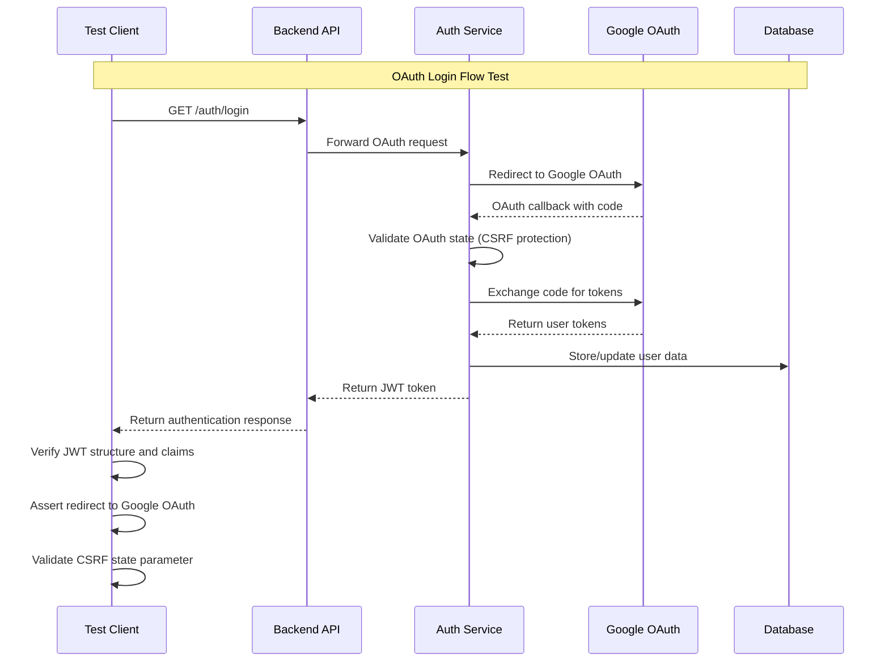
```mermaid
sequenceDiagram
    participant T as Test Client
    participant B as Backend API
    participant A as Auth Service
    participant G as Google OAuth
    participant D as Database

    Note over T,D: OAuth Login Flow Test
    T->>B: GET /auth/login
    B->>A: Forward OAuth request
    A->>G: Redirect to Google OAuth
    G-->>A: OAuth callback with code
    A->>A: Validate OAuth state (CSRF protection)
    A->>G: Exchange code for tokens
    G-->>A: Return user tokens
    A->>D: Store/update user data
    A-->>B: Return JWT token
    B-->>T: Return authentication response
    T->>T: Verify JWT structure and claims
    T->>T: Assert redirect to Google OAuth
    T->>T: Validate CSRF state parameter
```

### Auth Token Validation Flow
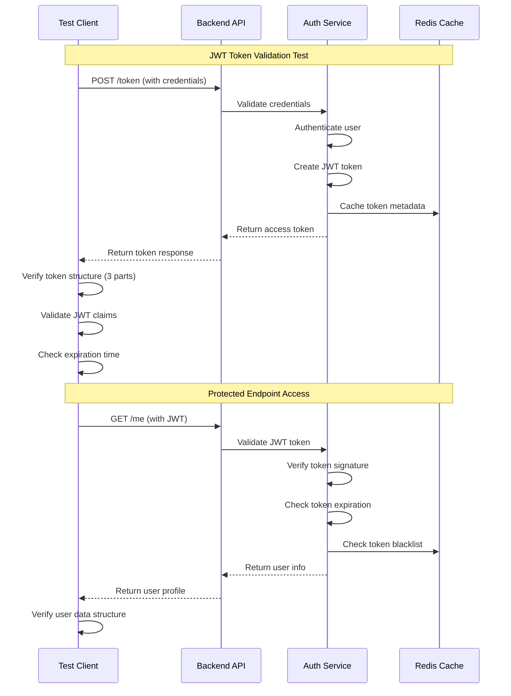
```mermaid
sequenceDiagram
    participant T as Test Client
    participant B as Backend API
    participant A as Auth Service
    participant R as Redis Cache

    Note over T,R: JWT Token Validation Test
    T->>B: POST /token (with credentials)
    B->>A: Validate credentials
    A->>A: Authenticate user
    A->>A: Create JWT token
    A->>R: Cache token metadata
    A-->>B: Return access token
    B-->>T: Return token response
    T->>T: Verify token structure (3 parts)
    T->>T: Validate JWT claims
    T->>T: Check expiration time
    
    Note over T,R: Protected Endpoint Access
    T->>B: GET /me (with JWT)
    B->>A: Validate JWT token
    A->>A: Verify token signature
    A->>A: Check token expiration
    A->>R: Check token blacklist
    A-->>B: Return user info
    B-->>T: Return user profile
    T->>T: Verify user data structure
```

### Auth Error Handling Tests
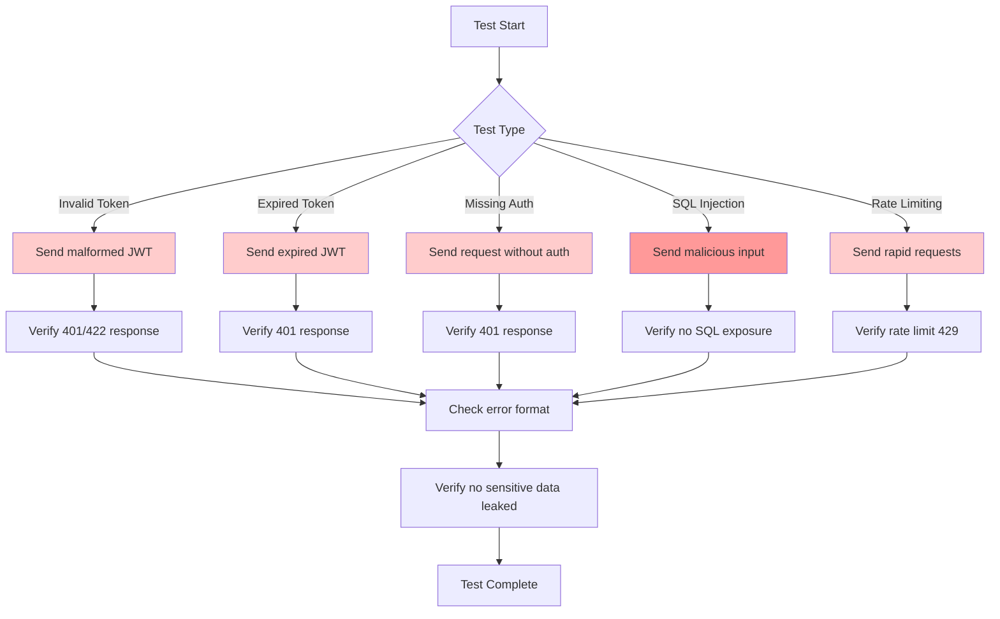
```mermaid
flowchart TD
    A[Test Start] --> B{Test Type}
    
    B -->|Invalid Token| C[Send malformed JWT]
    B -->|Expired Token| D[Send expired JWT]
    B -->|Missing Auth| E[Send request without auth]
    B -->|SQL Injection| F[Send malicious input]
    B -->|Rate Limiting| G[Send rapid requests]
    
    C --> C1[Verify 401/422 response]
    D --> D1[Verify 401 response]
    E --> E1[Verify 401 response]
    F --> F1[Verify no SQL exposure]
    G --> G1[Verify rate limit 429]
    
    C1 --> H[Check error format]
    D1 --> H
    E1 --> H
    F1 --> H
    G1 --> H
    
    H --> I[Verify no sensitive data leaked]
    I --> J[Test Complete]
    
    style C fill:#ffcccc
    style D fill:#ffcccc
    style E fill:#ffcccc
    style F fill:#ff9999
    style G fill:#ffcccc
```

## 2. Agent Endpoints

### Agent Execution Flow Tests
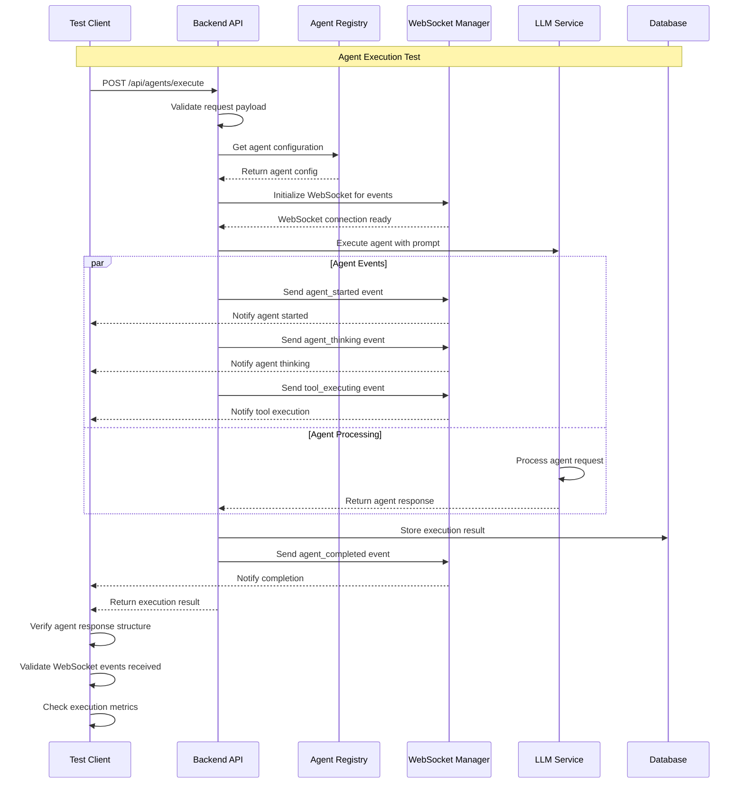
```mermaid
sequenceDiagram
    participant T as Test Client
    participant B as Backend API
    participant AG as Agent Registry
    participant W as WebSocket Manager
    participant LLM as LLM Service
    participant D as Database

    Note over T,D: Agent Execution Test
    T->>B: POST /api/agents/execute
    B->>B: Validate request payload
    B->>AG: Get agent configuration
    AG-->>B: Return agent config
    B->>W: Initialize WebSocket for events
    W-->>B: WebSocket connection ready
    B->>LLM: Execute agent with prompt
    
    par Agent Events
        B->>W: Send agent_started event
        W-->>T: Notify agent started
        B->>W: Send agent_thinking event
        W-->>T: Notify agent thinking
        B->>W: Send tool_executing event
        W-->>T: Notify tool execution
    and Agent Processing
        LLM->>LLM: Process agent request
        LLM-->>B: Return agent response
    end
    
    B->>D: Store execution result
    B->>W: Send agent_completed event
    W-->>T: Notify completion
    B-->>T: Return execution result
    
    T->>T: Verify agent response structure
    T->>T: Validate WebSocket events received
    T->>T: Check execution metrics
```

### Agent Validation Tests
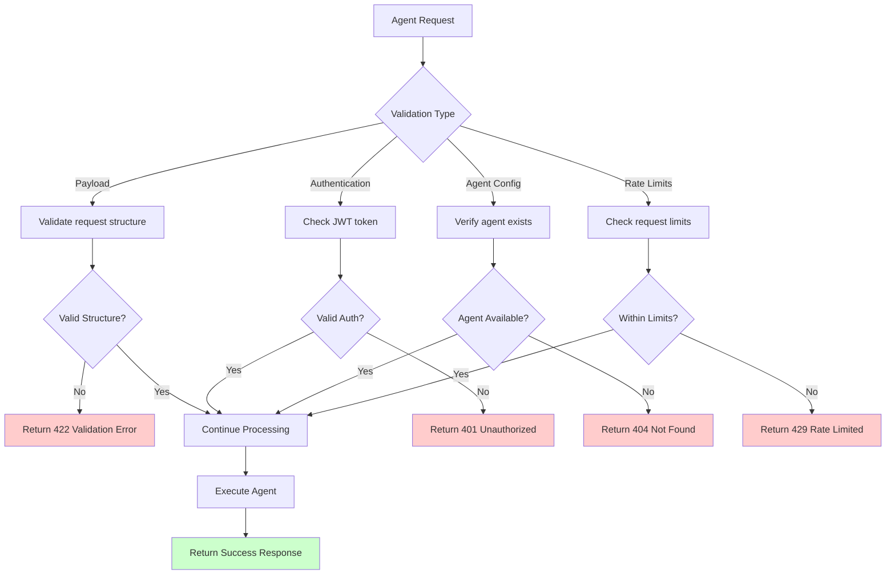
```mermaid
flowchart TD
    A[Agent Request] --> B{Validation Type}
    
    B -->|Payload| C[Validate request structure]
    B -->|Authentication| D[Check JWT token]
    B -->|Agent Config| E[Verify agent exists]
    B -->|Rate Limits| F[Check request limits]
    
    C --> C1{Valid Structure?}
    C1 -->|No| C2[Return 422 Validation Error]
    C1 -->|Yes| G[Continue Processing]
    
    D --> D1{Valid Auth?}
    D1 -->|No| D2[Return 401 Unauthorized]
    D1 -->|Yes| G
    
    E --> E1{Agent Available?}
    E1 -->|No| E2[Return 404 Not Found]
    E1 -->|Yes| G
    
    F --> F1{Within Limits?}
    F1 -->|No| F2[Return 429 Rate Limited]
    F1 -->|Yes| G
    
    G --> H[Execute Agent]
    H --> I[Return Success Response]
    
    style C2 fill:#ffcccc
    style D2 fill:#ffcccc
    style E2 fill:#ffcccc
    style F2 fill:#ffcccc
    style I fill:#ccffcc
```

## 3. WebSocket Endpoints

### WebSocket Connection Flow Tests
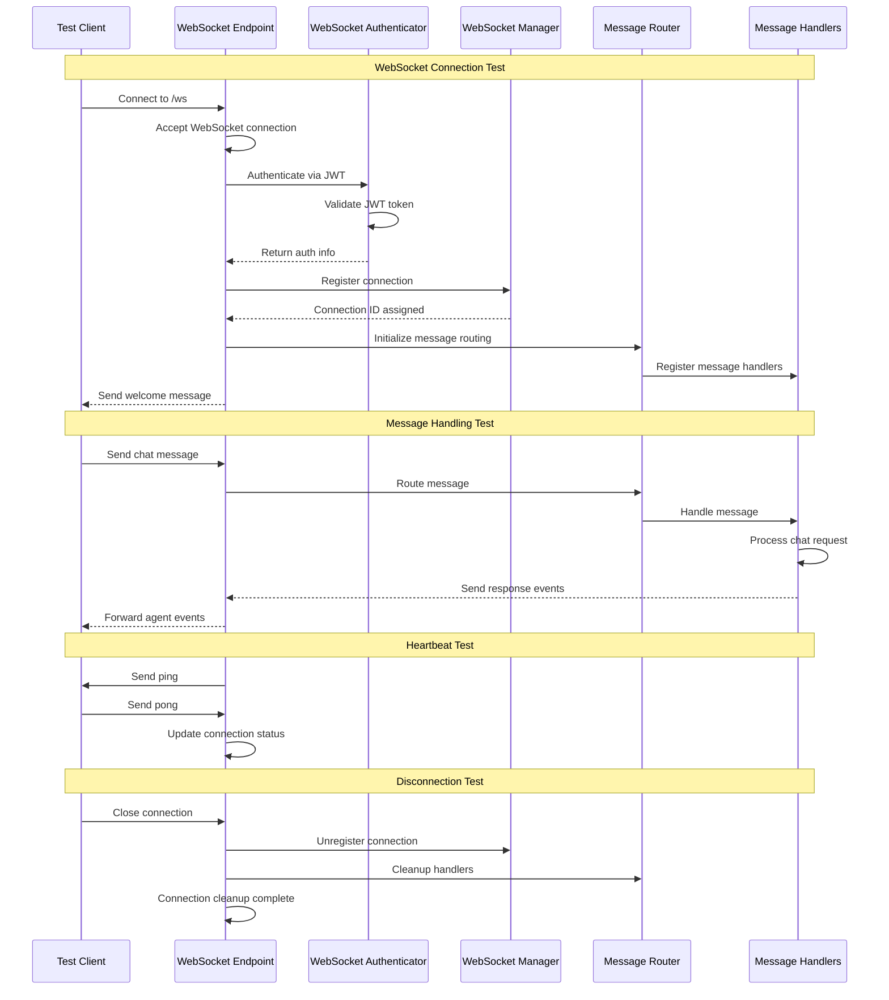
```mermaid
sequenceDiagram
    participant T as Test Client
    participant W as WebSocket Endpoint
    participant A as WebSocket Authenticator
    participant M as WebSocket Manager
    participant R as Message Router
    participant H as Message Handlers

    Note over T,H: WebSocket Connection Test
    T->>W: Connect to /ws
    W->>W: Accept WebSocket connection
    W->>A: Authenticate via JWT
    A->>A: Validate JWT token
    A-->>W: Return auth info
    W->>M: Register connection
    M-->>W: Connection ID assigned
    W->>R: Initialize message routing
    R->>H: Register message handlers
    W-->>T: Send welcome message
    
    Note over T,H: Message Handling Test
    T->>W: Send chat message
    W->>R: Route message
    R->>H: Handle message
    H->>H: Process chat request
    H-->>W: Send response events
    W-->>T: Forward agent events
    
    Note over T,H: Heartbeat Test
    W->>T: Send ping
    T->>W: Send pong
    W->>W: Update connection status
    
    Note over T,H: Disconnection Test
    T->>W: Close connection
    W->>M: Unregister connection
    W->>R: Cleanup handlers
    W->>W: Connection cleanup complete
```

### WebSocket Authentication Tests
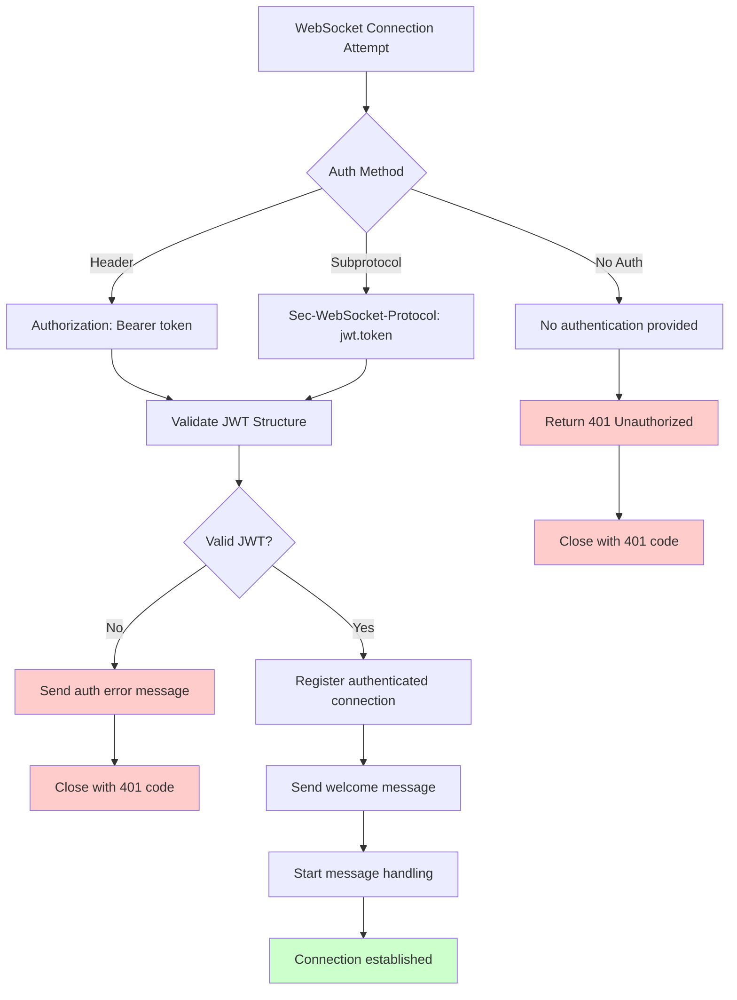
```mermaid
flowchart TD
    A[WebSocket Connection Attempt] --> B{Auth Method}
    
    B -->|Header| C[Authorization: Bearer token]
    B -->|Subprotocol| D[Sec-WebSocket-Protocol: jwt.token]
    B -->|No Auth| E[No authentication provided]
    
    C --> F[Validate JWT Structure]
    D --> F
    E --> G[Return 401 Unauthorized]
    
    F --> H{Valid JWT?}
    H -->|No| I[Send auth error message]
    H -->|Yes| J[Register authenticated connection]
    
    I --> K[Close with 401 code]
    G --> L[Close with 401 code]
    J --> M[Send welcome message]
    
    M --> N[Start message handling]
    N --> O[Connection established]
    
    style G fill:#ffcccc
    style I fill:#ffcccc
    style K fill:#ffcccc
    style L fill:#ffcccc
    style O fill:#ccffcc
```

### WebSocket Message Routing Tests
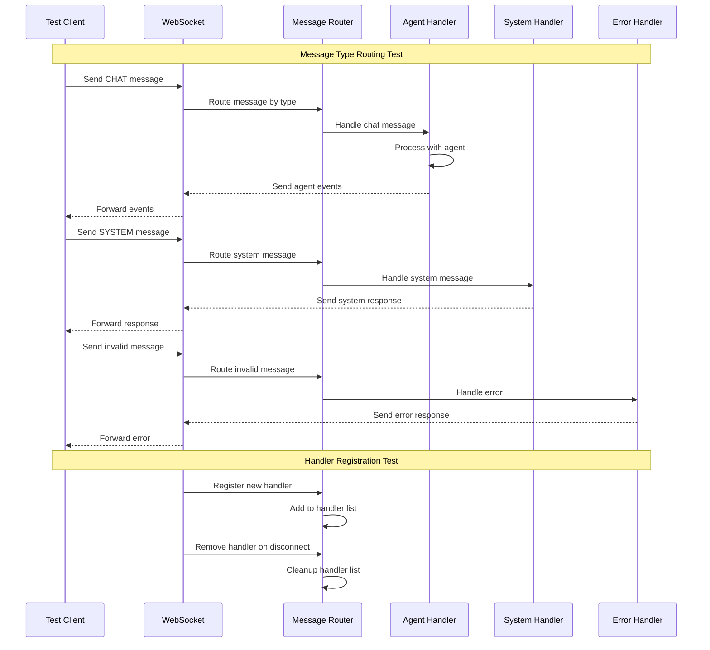
```mermaid
sequenceDiagram
    participant T as Test Client
    participant W as WebSocket
    participant R as Message Router
    participant AH as Agent Handler
    participant SH as System Handler
    participant EH as Error Handler

    Note over T,EH: Message Type Routing Test
    T->>W: Send CHAT message
    W->>R: Route message by type
    R->>AH: Handle chat message
    AH->>AH: Process with agent
    AH-->>W: Send agent events
    W-->>T: Forward events
    
    T->>W: Send SYSTEM message
    W->>R: Route system message
    R->>SH: Handle system message
    SH-->>W: Send system response
    W-->>T: Forward response
    
    T->>W: Send invalid message
    W->>R: Route invalid message
    R->>EH: Handle error
    EH-->>W: Send error response
    W-->>T: Forward error
    
    Note over T,EH: Handler Registration Test
    W->>R: Register new handler
    R->>R: Add to handler list
    W->>R: Remove handler on disconnect
    R->>R: Cleanup handler list
```

## 4. Analytics Endpoints

### Analytics Data Flow Tests
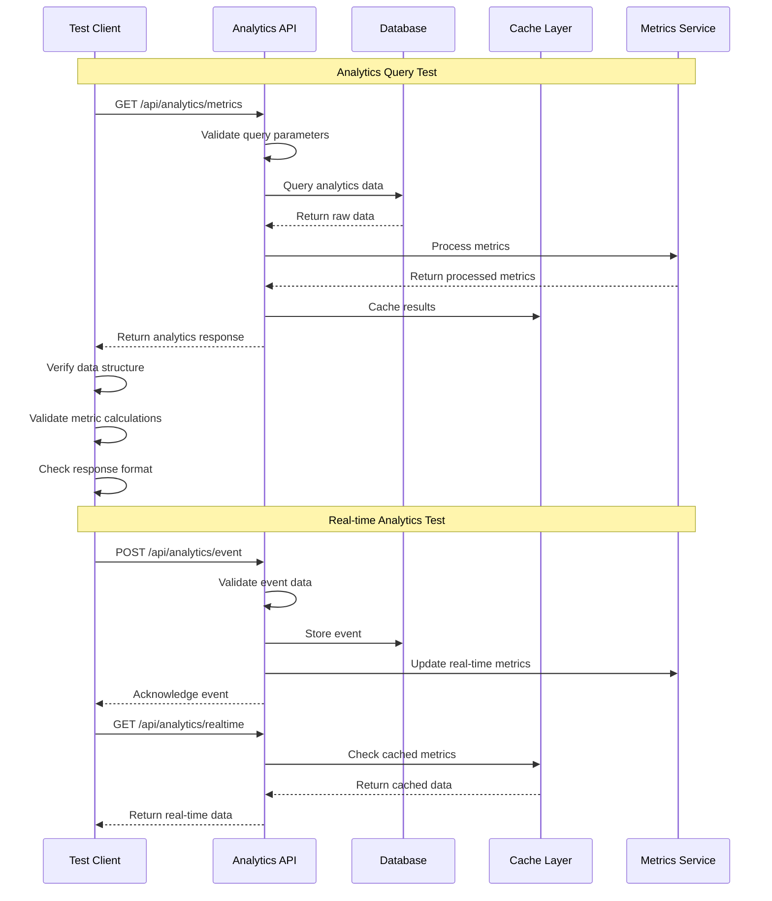
```mermaid
sequenceDiagram
    participant T as Test Client
    participant A as Analytics API
    participant D as Database
    participant C as Cache Layer
    participant M as Metrics Service

    Note over T,M: Analytics Query Test
    T->>A: GET /api/analytics/metrics
    A->>A: Validate query parameters
    A->>D: Query analytics data
    D-->>A: Return raw data
    A->>M: Process metrics
    M-->>A: Return processed metrics
    A->>C: Cache results
    A-->>T: Return analytics response
    
    T->>T: Verify data structure
    T->>T: Validate metric calculations
    T->>T: Check response format
    
    Note over T,M: Real-time Analytics Test
    T->>A: POST /api/analytics/event
    A->>A: Validate event data
    A->>D: Store event
    A->>M: Update real-time metrics
    A-->>T: Acknowledge event
    
    T->>A: GET /api/analytics/realtime
    A->>C: Check cached metrics
    C-->>A: Return cached data
    A-->>T: Return real-time data
```

### Analytics Validation Tests
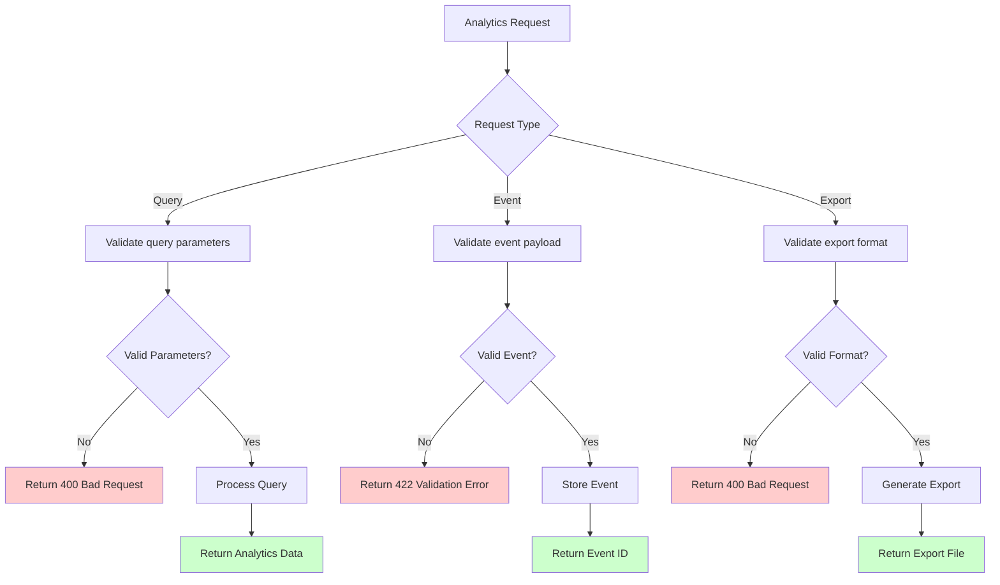
```mermaid
flowchart TD
    A[Analytics Request] --> B{Request Type}
    
    B -->|Query| C[Validate query parameters]
    B -->|Event| D[Validate event payload]
    B -->|Export| E[Validate export format]
    
    C --> C1{Valid Parameters?}
    C1 -->|No| C2[Return 400 Bad Request]
    C1 -->|Yes| F[Process Query]
    
    D --> D1{Valid Event?}
    D1 -->|No| D2[Return 422 Validation Error]
    D1 -->|Yes| G[Store Event]
    
    E --> E1{Valid Format?}
    E1 -->|No| E2[Return 400 Bad Request]
    E1 -->|Yes| H[Generate Export]
    
    F --> I[Return Analytics Data]
    G --> J[Return Event ID]
    H --> K[Return Export File]
    
    style C2 fill:#ffcccc
    style D2 fill:#ffcccc
    style E2 fill:#ffcccc
    style I fill:#ccffcc
    style J fill:#ccffcc
    style K fill:#ccffcc
```

## 5. Admin Endpoints

### Admin Operations Flow Tests
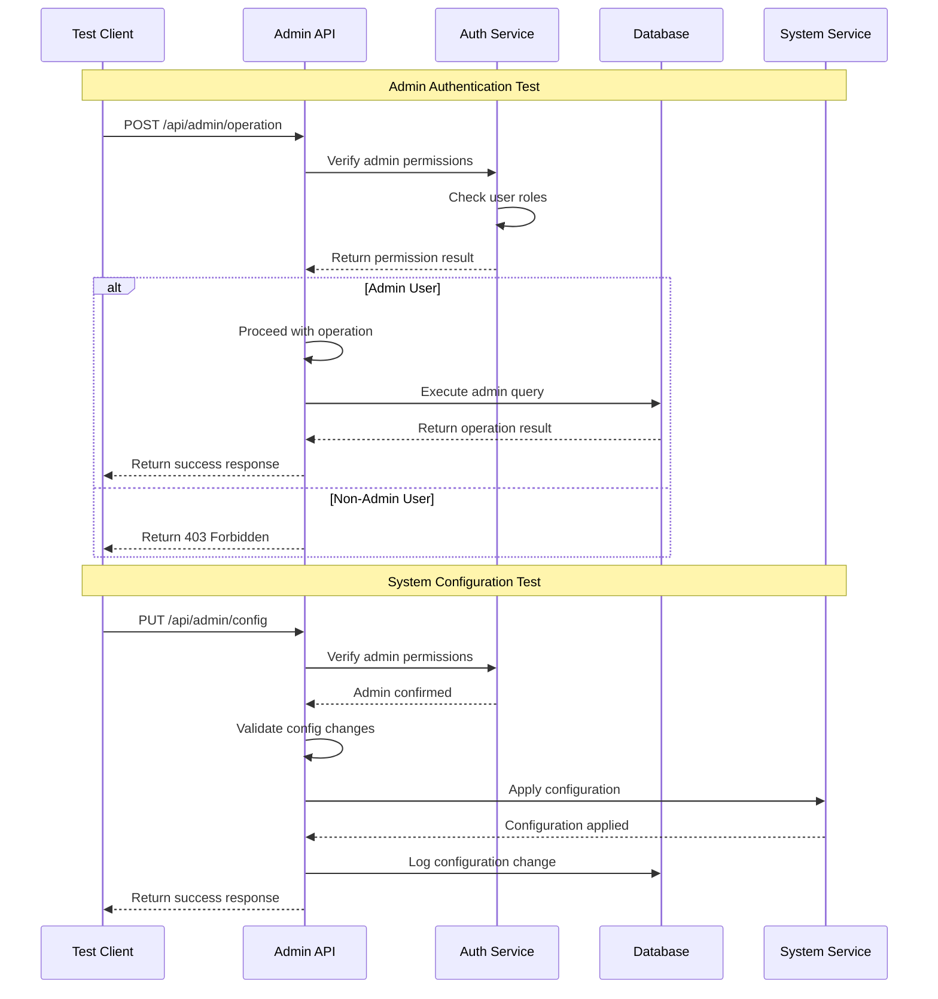
```mermaid
sequenceDiagram
    participant T as Test Client
    participant A as Admin API
    participant AU as Auth Service
    participant D as Database
    participant S as System Service

    Note over T,S: Admin Authentication Test
    T->>A: POST /api/admin/operation
    A->>AU: Verify admin permissions
    AU->>AU: Check user roles
    AU-->>A: Return permission result
    
    alt Admin User
        A->>A: Proceed with operation
        A->>D: Execute admin query
        D-->>A: Return operation result
        A-->>T: Return success response
    else Non-Admin User
        A-->>T: Return 403 Forbidden
    end
    
    Note over T,S: System Configuration Test
    T->>A: PUT /api/admin/config
    A->>AU: Verify admin permissions
    AU-->>A: Admin confirmed
    A->>A: Validate config changes
    A->>S: Apply configuration
    S-->>A: Configuration applied
    A->>D: Log configuration change
    A-->>T: Return success response
```

### Admin Security Tests
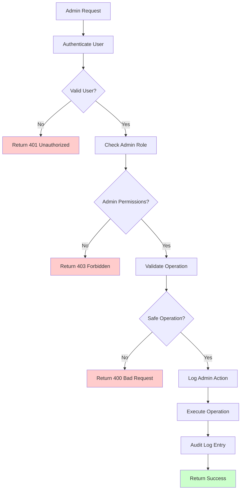
```mermaid
flowchart TD
    A[Admin Request] --> B[Authenticate User]
    B --> C{Valid User?}
    C -->|No| D[Return 401 Unauthorized]
    C -->|Yes| E[Check Admin Role]
    
    E --> F{Admin Permissions?}
    F -->|No| G[Return 403 Forbidden]
    F -->|Yes| H[Validate Operation]
    
    H --> I{Safe Operation?}
    I -->|No| J[Return 400 Bad Request]
    I -->|Yes| K[Log Admin Action]
    
    K --> L[Execute Operation]
    L --> M[Audit Log Entry]
    M --> N[Return Success]
    
    style D fill:#ffcccc
    style G fill:#ffcccc
    style J fill:#ffcccc
    style N fill:#ccffcc
```

## 6. Health and Monitoring Endpoints

### Health Check Flow Tests
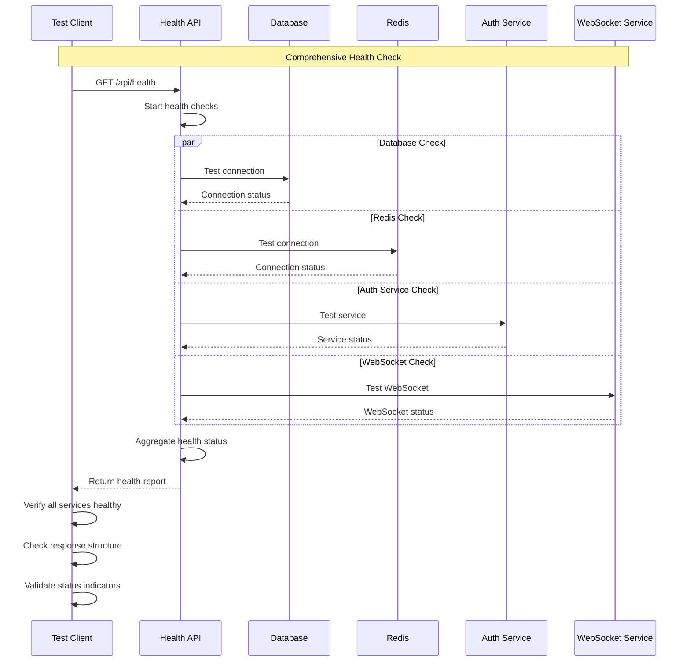
```mermaid
sequenceDiagram
    participant T as Test Client
    participant H as Health API
    participant D as Database
    participant R as Redis
    participant A as Auth Service
    participant W as WebSocket Service

    Note over T,W: Comprehensive Health Check
    T->>H: GET /api/health
    H->>H: Start health checks
    
    par Database Check
        H->>D: Test connection
        D-->>H: Connection status
    and Redis Check
        H->>R: Test connection
        R-->>H: Connection status
    and Auth Service Check
        H->>A: Test service
        A-->>H: Service status
    and WebSocket Check
        H->>W: Test WebSocket
        W-->>H: WebSocket status
    end
    
    H->>H: Aggregate health status
    H-->>T: Return health report
    
    T->>T: Verify all services healthy
    T->>T: Check response structure
    T->>T: Validate status indicators
```

### Monitoring Endpoints Tests
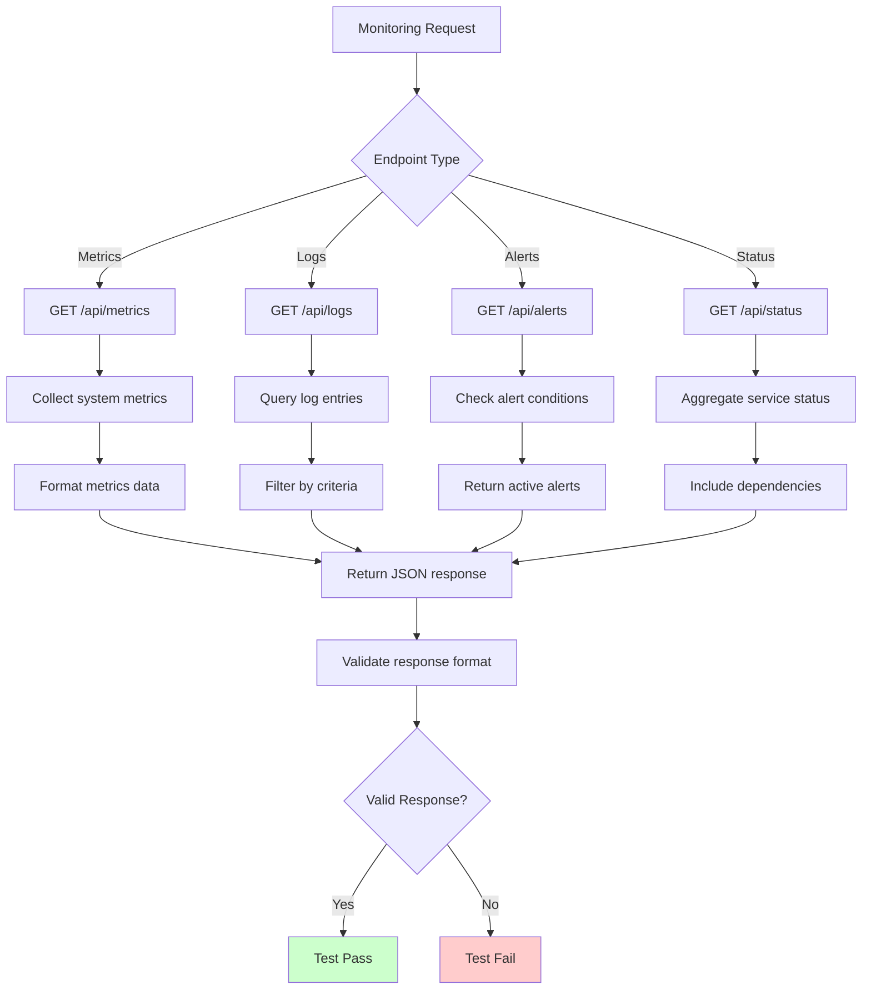
```mermaid
flowchart TD
    A[Monitoring Request] --> B{Endpoint Type}
    
    B -->|Metrics| C[GET /api/metrics]
    B -->|Logs| D[GET /api/logs]
    B -->|Alerts| E[GET /api/alerts]
    B -->|Status| F[GET /api/status]
    
    C --> C1[Collect system metrics]
    C1 --> C2[Format metrics data]
    C2 --> G[Return JSON response]
    
    D --> D1[Query log entries]
    D1 --> D2[Filter by criteria]
    D2 --> G
    
    E --> E1[Check alert conditions]
    E1 --> E2[Return active alerts]
    E2 --> G
    
    F --> F1[Aggregate service status]
    F1 --> F2[Include dependencies]
    F2 --> G
    
    G --> H[Validate response format]
    H --> I{Valid Response?}
    I -->|Yes| J[Test Pass]
    I -->|No| K[Test Fail]
    
    style J fill:#ccffcc
    style K fill:#ffcccc
```

## 7. Error Handling Patterns

### Common Error Flow Tests
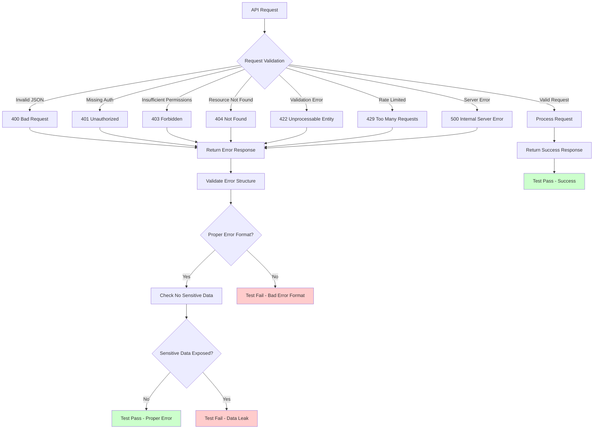
```mermaid
flowchart TD
    A[API Request] --> B{Request Validation}
    
    B -->|Invalid JSON| C[400 Bad Request]
    B -->|Missing Auth| D[401 Unauthorized]
    B -->|Insufficient Permissions| E[403 Forbidden]
    B -->|Resource Not Found| F[404 Not Found]
    B -->|Validation Error| G[422 Unprocessable Entity]
    B -->|Rate Limited| H[429 Too Many Requests]
    B -->|Server Error| I[500 Internal Server Error]
    B -->|Valid Request| J[Process Request]
    
    C --> K[Return Error Response]
    D --> K
    E --> K
    F --> K
    G --> K
    H --> K
    I --> K
    
    K --> L[Validate Error Structure]
    L --> M{Proper Error Format?}
    M -->|Yes| N[Check No Sensitive Data]
    M -->|No| O[Test Fail - Bad Error Format]
    
    N --> P{Sensitive Data Exposed?}
    P -->|No| Q[Test Pass - Proper Error]
    P -->|Yes| R[Test Fail - Data Leak]
    
    J --> S[Return Success Response]
    S --> T[Test Pass - Success]
    
    style Q fill:#ccffcc
    style T fill:#ccffcc
    style O fill:#ffcccc
    style R fill:#ffcccc
```

## Test Coverage Summary

### Endpoint Categories Tested
- **Authentication**: OAuth flows, JWT validation, session management
- **Agents**: Execution flows, WebSocket events, validation
- **WebSocket**: Connection handling, message routing, authentication
- **Analytics**: Data queries, real-time metrics, validation
- **Admin**: Permission checks, system operations, security
- **Health**: Service status, dependency checks, monitoring

### Test Types
- **Unit Tests**: Individual endpoint functionality
- **Integration Tests**: Service-to-service communication
- **E2E Tests**: Complete user workflows
- **Security Tests**: Authentication, authorization, input validation
- **Performance Tests**: Rate limiting, load handling

### Key Testing Principles
1. **Real Services**: Tests use actual services, not mocks
2. **Comprehensive Coverage**: All major flows and error cases
3. **Security Focus**: Authentication, authorization, input validation
4. **WebSocket Integration**: Real-time communication testing
5. **Error Handling**: Proper error responses and no data leaks

This comprehensive test suite ensures the Netra API endpoints are reliable, secure, and properly integrated across all services.