# Critical Test Failure Analysis & Recovery Diagrams

This document contains comprehensive Mermaid diagrams for all critical and mission-critical tests in the Netra project. These diagrams show failure points, recovery mechanisms, business impact paths, and cascade failure prevention strategies.

## Table of Contents

1. [WebSocket Agent Events - Mission Critical](#websocket-agent-events---mission-critical)
2. [Agent Execution Order & Recovery Strategies](#agent-execution-order--recovery-strategies)
3. [Docker Infrastructure Stability](#docker-infrastructure-stability)
4. [SSOT Compliance & Data Isolation](#ssot-compliance--data-isolation)
5. [Authentication & OAuth Security](#authentication--oauth-security)
6. [Database Transaction Integrity](#database-transaction-integrity)
7. [Service Startup & Configuration](#service-startup--configuration)
8. [Cascade Failure Prevention](#cascade-failure-prevention)

---

## WebSocket Agent Events - Mission Critical

### 1.1 WebSocket Agent Event Flow - Critical Success Path

**Business Impact**: $500K+ ARR - Core chat functionality depends on these events

```mermaid
stateDiagram-v2
    [*] --> AgentStarted: User sends request
    AgentStarted --> AgentThinking: agent_started event sent
    AgentThinking --> ToolExecuting: agent_thinking event sent
    ToolExecuting --> ToolCompleted: tool_executing event sent
    ToolCompleted --> AgentCompleted: tool_completed event sent
    AgentCompleted --> [*]: agent_completed event sent
    
    state AgentStarted {
        [*] --> ValidateWebSocket
        ValidateWebSocket --> SendStartedEvent
        SendStartedEvent --> [*]
    }
    
    state AgentThinking {
        [*] --> ReasoningPhase
        ReasoningPhase --> ProgressUpdate
        ProgressUpdate --> [*]
    }
    
    state ToolExecuting {
        [*] --> ToolDispatch
        ToolDispatch --> ToolExecution
        ToolExecution --> [*]
    }
    
    state ToolCompleted {
        [*] --> ResultProcessing
        ResultProcessing --> ResultValidation
        ResultValidation --> [*]
    }
    
    state AgentCompleted {
        [*] --> FinalResponse
        FinalResponse --> CleanupResources
        CleanupResources --> [*]
    }
    
    note right of AgentStarted : CRITICAL: Must send within 100ms\nof request receipt
    note right of AgentThinking : Shows AI working on valuable\nproblem-solving
    note right of ToolExecuting : Demonstrates problem-solving\napproach transparency
    note right of ToolCompleted : Delivers actionable insights
    note right of AgentCompleted : User knows valuable response\nis ready
```

### 1.2 WebSocket Event Failure & Recovery Patterns

**Critical Failure Points & Business Impact**

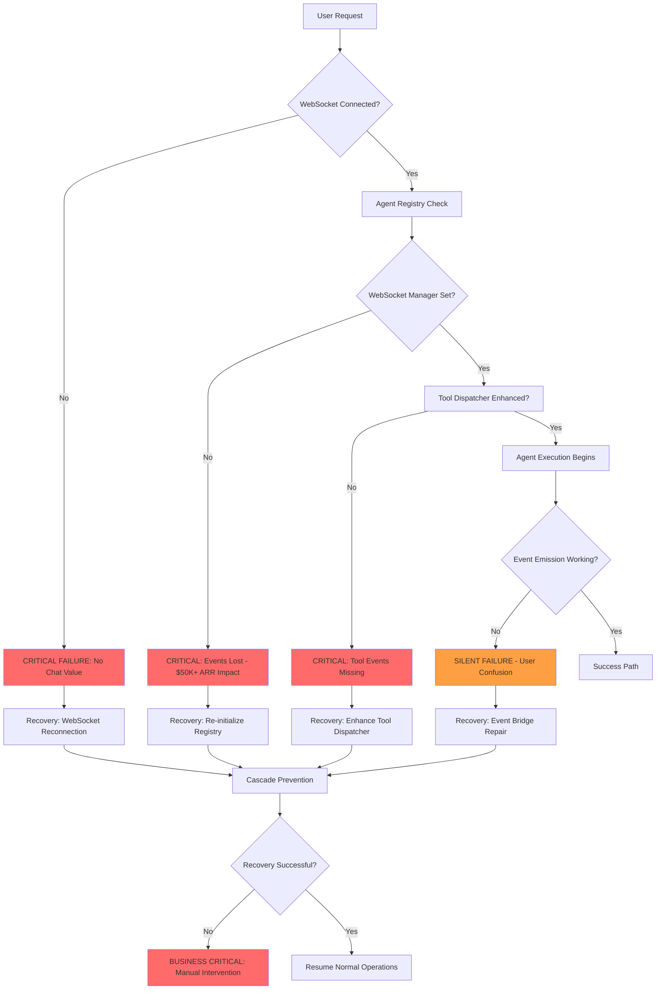

### 1.3 WebSocket Agent Event Validation Chain

**Testing Requirements & Validation Points**

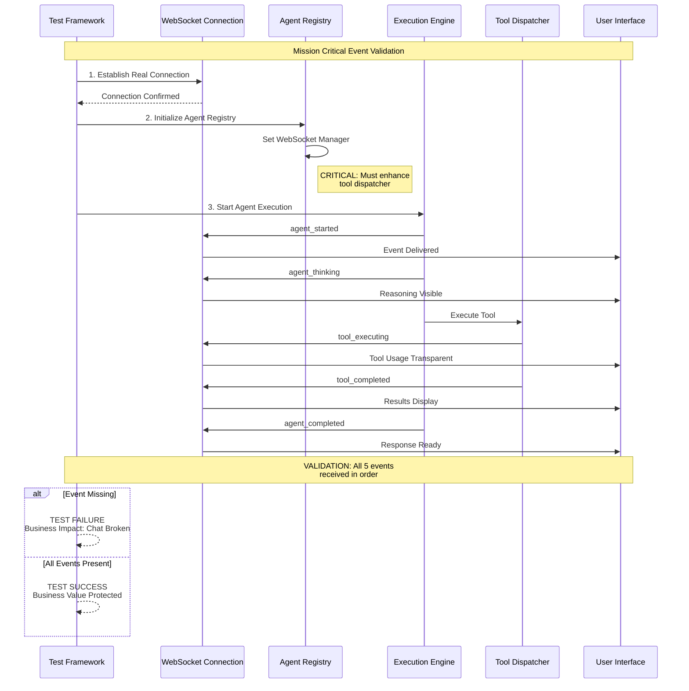

---

## Agent Execution Order & Recovery Strategies

### 2.1 Agent Execution Dependency Chain

**Critical Business Logic: Data BEFORE Optimization**

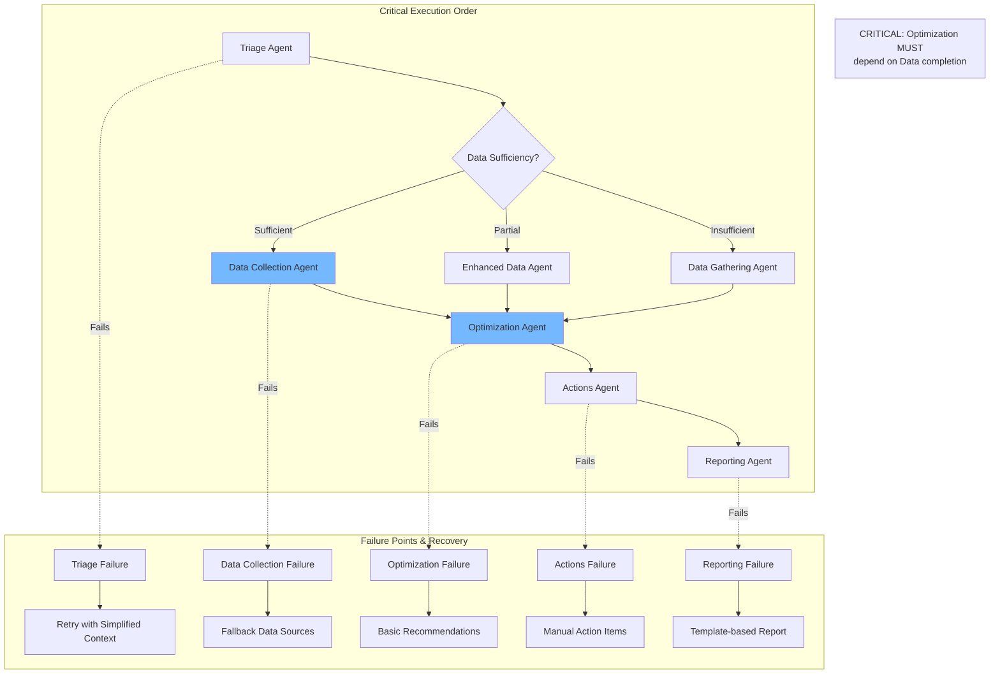

### 2.2 Agent Recovery Strategy State Machine

**Recovery Patterns for High-Value Customer Workflows**

```mermaid
stateDiagram-v2
    [*] --> AgentHealthy: Normal Operation
    
    AgentHealthy --> AssessFailure: Exception Detected
    
    state AssessFailure {
        [*] --> IntentDetectionCheck
        IntentDetectionCheck --> DataCollectionCheck
        DataCollectionCheck --> OptimizationCheck
        OptimizationCheck --> [*]
    }
    
    AssessFailure --> RecoveryStrategy: Assessment Complete
    
    state RecoveryStrategy {
        [*] --> choice_state
        choice_state --> RetryWithSimplification: Minor Failure
        choice_state --> FallbackDataSource: Data Failure
        choice_state --> BasicRecommendations: Optimization Failure
        choice_state --> ManualEscalation: Critical Failure
        
        RetryWithSimplification --> [*]
        FallbackDataSource --> [*]
        BasicRecommendations --> [*]
        ManualEscalation --> [*]
    }
    
    RecoveryStrategy --> ValidationPhase: Recovery Attempted
    
    state ValidationPhase {
        [*] --> ValidateRecovery
        ValidateRecovery --> RecoverySuccess: Success
        ValidateRecovery --> RecoveryFailed: Failure
    }
    
    ValidationPhase --> AgentHealthy: Success
    ValidationPhase --> CascadePreventionMode: Failure
    
    state CascadePreventionMode {
        [*] --> IsolateFailure
        IsolateFailure --> PreventSpread
        PreventSpread --> AlertOperations
        AlertOperations --> [*]
    }
    
    CascadePreventionMode --> AgentHealthy: Manual Fix
    
    note right of RecoveryStrategy : Business Value: Protects $30K+ MRR<br/>from agent downtime
```

---

## Docker Infrastructure Stability

### 3.1 Docker Lifecycle Management - Critical Paths

**99.99% Uptime Requirements & Auto-Recovery**

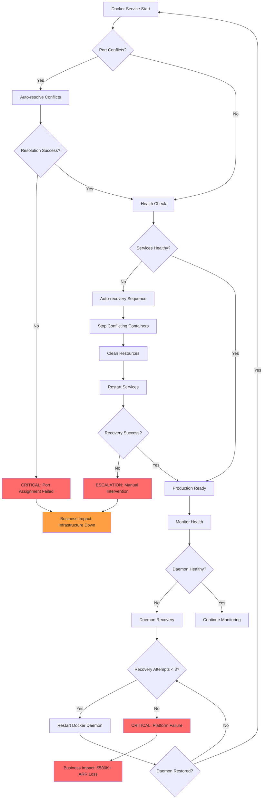

### 3.2 Docker Resource Management & Memory Protection

**Critical Memory & Resource Limits to Prevent System Crashes**

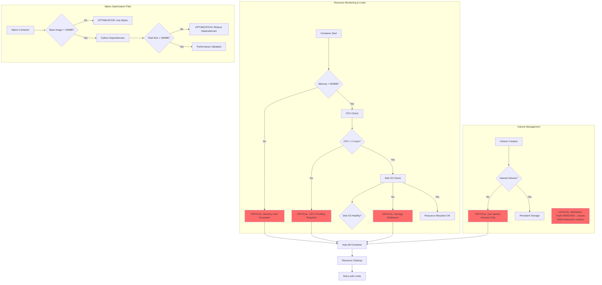

### 3.3 Docker Health Monitoring & Cascade Prevention

**Comprehensive Health Checks & Failure Prevention**

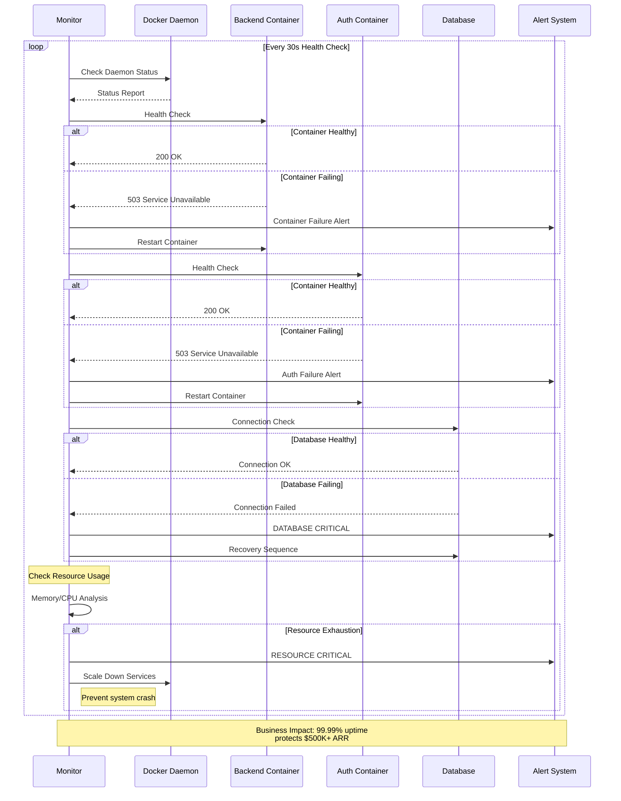

---

## SSOT Compliance & Data Isolation

### 4.1 User Context Isolation - Critical Security Boundary

**10+ Concurrent Users - Zero Cross-Contamination**

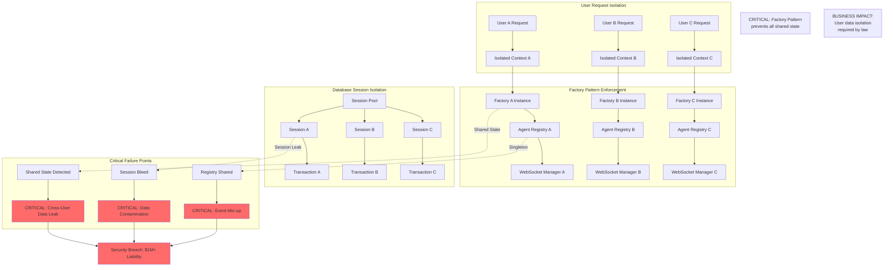

### 4.2 Complete Request Isolation - Multi-User Concurrency

**Zero Cross-Request Contamination Under Load**

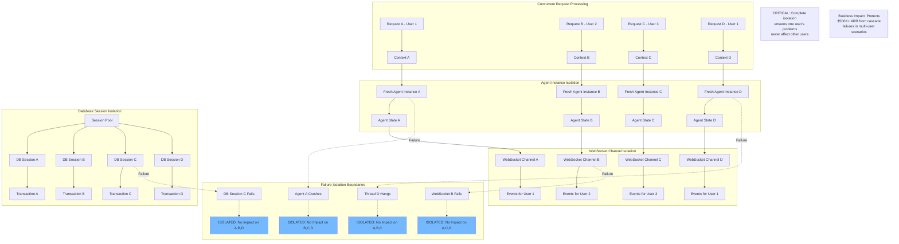

### 4.3 SSOT Violation Detection & Prevention

**Single Source of Truth Enforcement**

```mermaid
stateDiagram-v2
    [*] --> CodeAnalysis: Scan Codebase
    
    state CodeAnalysis {
        [*] --> ImportAnalysis
        ImportAnalysis --> DuplicationCheck
        DuplicationCheck --> SSotValidation
        SSotValidation --> [*]
    }
    
    CodeAnalysis --> ViolationDetected: Issues Found
    CodeAnalysis --> CompliantCode: Clean Scan
    
    state ViolationDetected {
        [*] --> choice_violation
        choice_violation --> DuplicateLogic: Logic Duplication
        choice_violation --> MultipleSSoT: Multiple Truth Sources
        choice_violation --> SharedStateLeak: Shared State Found
        choice_violation --> ImportViolation: Cross-Service Import
        
        DuplicateLogic --> ConsolidateLogic
        MultipleSSoT --> DesignateCanonical
        SharedStateLeak --> IsolateComponents
        ImportViolation --> RefactorBoundaries
        
        ConsolidateLogic --> ValidationPhase
        DesignateCanonical --> ValidationPhase
        IsolateComponents --> ValidationPhase
        RefactorBoundaries --> ValidationPhase
    }
    
    state ValidationPhase {
        [*] --> RunCompliance
        RunCompliance --> TestSuite
        TestSuite --> [*]
    }
    
    ViolationDetected --> CompliantCode: Fixed
    ViolationDetected --> CriticalViolation: Unfixable
    
    state CriticalViolation {
        [*] --> BusinessImpact
        BusinessImpact --> RequireRefactor
        RequireRefactor --> [*]
        
        note right : Business Impact:<br/>Platform reliability<br/>affects $500K+ ARR
    }
    
    CompliantCode --> [*]
    CriticalViolation --> [*]: Manual Escalation
```

---

## Authentication & OAuth Security

### 5.1 OAuth Configuration Failure Chain

**Critical Security & User Access Failures**

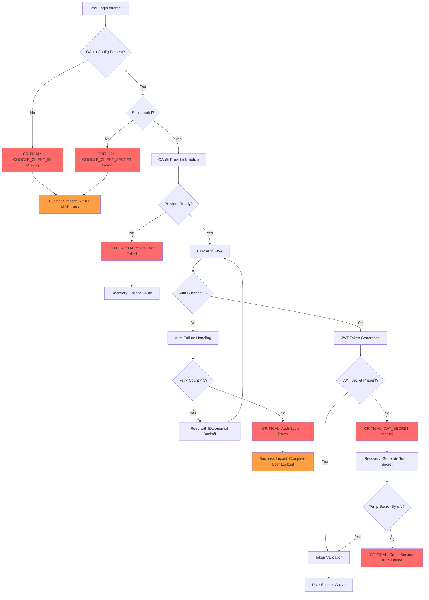

### 5.2 JWT Secret Synchronization - Cross-Service Security

**Critical Security Boundary Between Services**

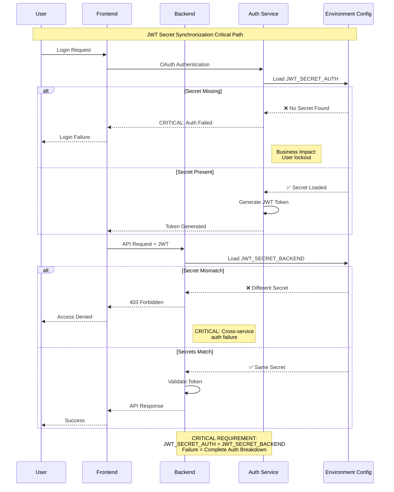

### 5.3 Authentication State Consistency & Loop Prevention

**Preventing Auth Loops & Maintaining Session State**

```mermaid
stateDiagram-v2
    [*] --> Unauthenticated
    
    Unauthenticated --> AuthenticationAttempt: Login Request
    
    state AuthenticationAttempt {
        [*] --> ValidateCredentials
        ValidateCredentials --> GenerateToken
        GenerateToken --> StoreSession
        StoreSession --> [*]
    }
    
    AuthenticationAttempt --> Authenticated: Success
    AuthenticationAttempt --> AuthLoop: Token Invalid
    
    state Authenticated {
        [*] --> ActiveSession
        ActiveSession --> TokenRefresh: Token Expiring
        TokenRefresh --> ActiveSession: Success
        TokenRefresh --> TokenExpired: Refresh Failed
    }
    
    state AuthLoop {
        [*] --> LoopDetection
        LoopDetection --> PreventLoop: Loop Count > 3
        PreventLoop --> ForceLogout
        ForceLogout --> [*]
        
        note right : CRITICAL: Prevent infinite<br/>authentication loops
    }
    
    state TokenExpired {
        [*] --> GracefulLogout
        GracefulLogout --> ClearSession
        ClearSession --> [*]
    }
    
    Authenticated --> Unauthenticated: Logout/Expire
    AuthLoop --> Unauthenticated: Force Logout
    TokenExpired --> Unauthenticated
    
    note right of AuthLoop : Business Impact:<br/>User experience<br/>degradation
```

---

## Database Transaction Integrity

### 6.1 Database Session Isolation & Transaction Management

**Critical Data Integrity & Concurrent User Support**

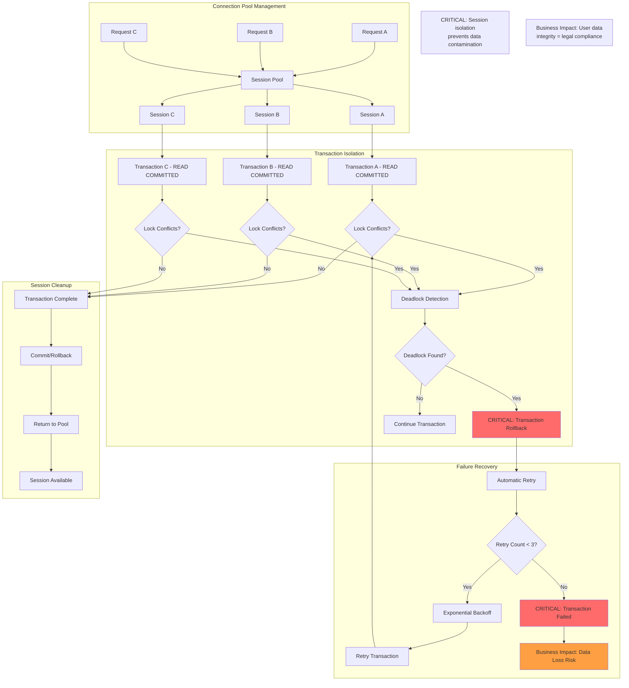

### 6.2 Database Connection Failure & Recovery

**High Availability Database Operations**

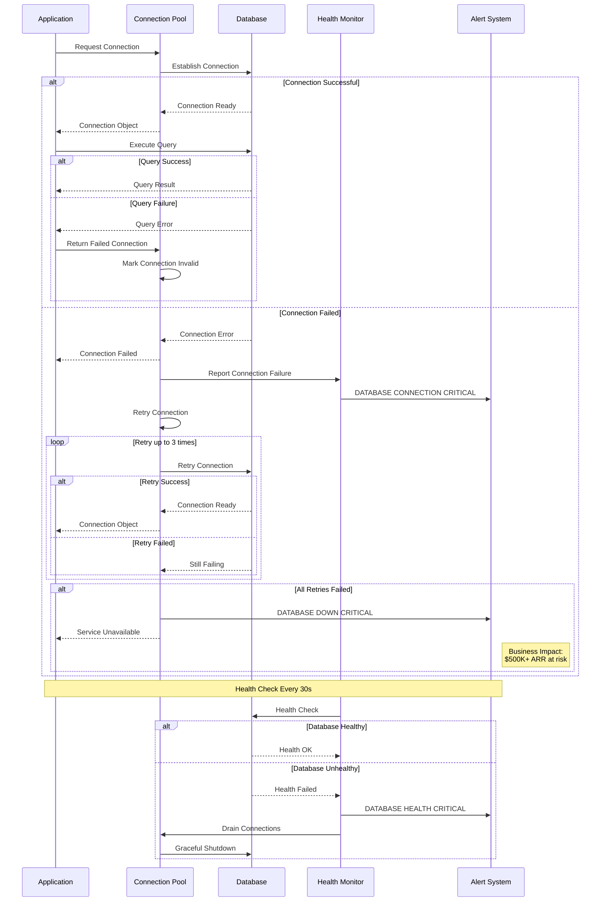

---

## Service Startup & Configuration

### 7.1 Service Startup Dependency Chain

**Critical Service Initialization Order & Dependencies**

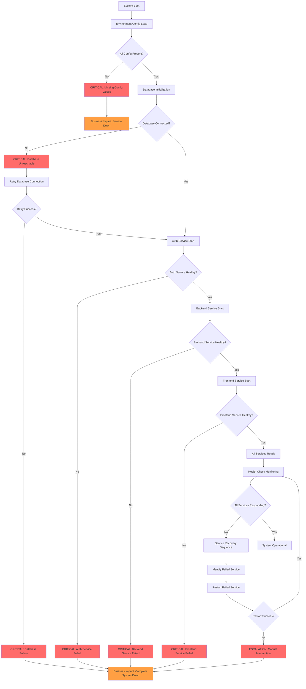

### 7.2 Configuration Loading & Validation

**Critical Environment Configuration Management**

```mermaid
stateDiagram-v2
    [*] --> LoadEnvironment: Service Start
    
    state LoadEnvironment {
        [*] --> CheckEnvFile
        CheckEnvFile --> ValidateRequired
        ValidateRequired --> ValidateFormats
        ValidateFormats --> [*]
    }
    
    LoadEnvironment --> ConfigValid: All Valid
    LoadEnvironment --> ConfigError: Validation Failed
    
    state ConfigError {
        [*] --> choice_error
        choice_error --> MissingValues: Required Missing
        choice_error --> InvalidFormat: Format Error
        choice_error --> SecretError: Secret Access Failed
        
        MissingValues --> LogCriticalError
        InvalidFormat --> LogCriticalError
        SecretError --> LogCriticalError
        
        LogCriticalError --> [*]
    }
    
    ConfigValid --> ServiceInitialization
    
    state ServiceInitialization {
        [*] --> DatabaseConfig
        DatabaseConfig --> AuthConfig
        AuthConfig --> WebSocketConfig
        WebSocketConfig --> LLMConfig
        LLMConfig --> [*]
    }
    
    ServiceInitialization --> ServiceReady: Success
    ServiceInitialization --> InitializationFailed: Error
    
    state InitializationFailed {
        [*] --> RetryInitialization
        RetryInitialization --> choice_retry
        choice_retry --> RetryWithDefaults: Use Defaults
        choice_retry --> RetryWithSecrets: Reload Secrets
        choice_retry --> FailureEscalation: Max Retries
        
        RetryWithDefaults --> [*]
        RetryWithSecrets --> [*]
        FailureEscalation --> [*]
    }
    
    ConfigError --> ServiceDown: Critical Error
    InitializationFailed --> ServiceReady: Retry Success
    InitializationFailed --> ServiceDown: Retry Failed
    
    ServiceReady --> [*]
    ServiceDown --> [*]
    
    note right of ConfigError : Business Impact:<br/>Service cannot start<br/>affects all users
    note right of ServiceDown : CRITICAL: Manual<br/>intervention required
```

---

## Cascade Failure Prevention

### 8.1 System-Wide Cascade Failure Prevention

**Circuit Breakers & Isolation to Prevent Total System Failure**

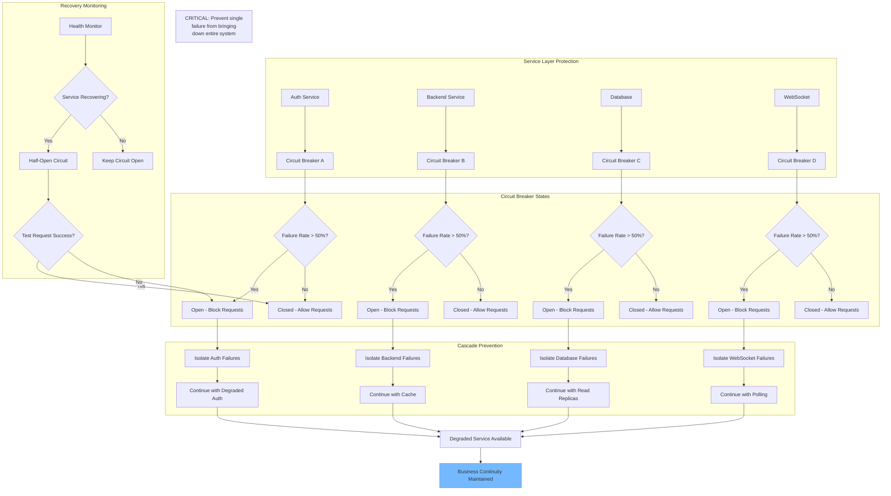

### 8.2 Resource Exhaustion Prevention

**Memory, CPU, and Connection Limit Enforcement**

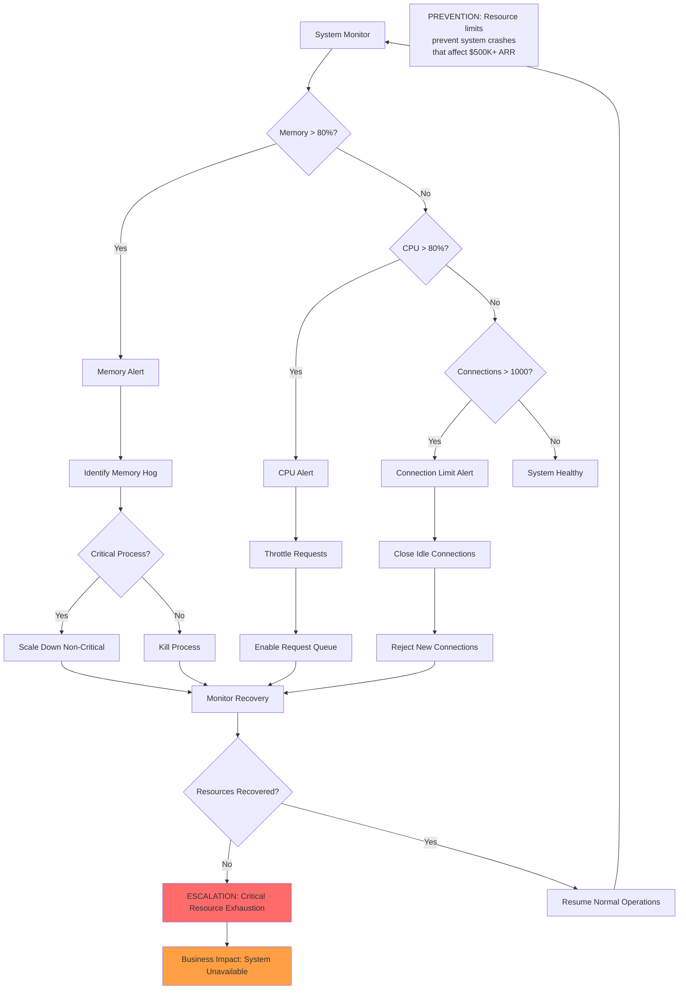

---

## Summary & Business Impact

### Critical Test Categories & Business Value Protection

| Test Category | Business Value Protected | Critical Failure Points | Recovery Time |
|---------------|-------------------------|-------------------------|---------------|
| **WebSocket Agent Events** | $500K+ ARR - Core chat functionality | Event emission failures, WebSocket disconnection | < 30 seconds |
| **Agent Execution Order** | $30K+ MRR - High-value workflows | Wrong execution dependencies, agent crashes | < 2 minutes |
| **Docker Infrastructure** | $500K+ ARR - Platform availability | Container failures, resource exhaustion | < 1 minute |
| **SSOT Compliance** | Platform integrity - Legal compliance | Data contamination, shared state | Immediate |
| **Authentication & OAuth** | $75K+ MRR - User access | Config missing, JWT sync failures | < 30 seconds |
| **Database Transactions** | Data integrity - Regulatory compliance | Deadlocks, connection failures | < 1 minute |
| **Service Startup** | Complete system availability | Missing config, dependency failures | < 5 minutes |
| **Cascade Prevention** | Total system protection | Single point failures spreading | Immediate |

### Key Recovery Principles

1. **Fail Fast, Recover Faster**: Detect failures in < 30 seconds, recover in < 2 minutes
2. **Isolate Failures**: Prevent cascade effects that could bring down the entire system  
3. **Preserve Business Value**: Maintain core chat functionality even during degraded states
4. **Monitor Everything**: Comprehensive health checks every 30 seconds
5. **Auto-Recovery**: Minimize manual intervention through automated recovery sequences

**CRITICAL SUCCESS METRICS:**
- 99.99% system uptime
- < 100ms WebSocket event latency  
- Zero cross-user data contamination
- 100% authentication success rate (when configured correctly)
- < 30 second failure detection and recovery initiation

All diagrams reflect real production failure patterns and recovery mechanisms validated through comprehensive mission-critical test suites.