# Netra E2E Test Diagrams

This document provides comprehensive Mermaid diagrams for all End-to-End (E2E) tests in the Netra project, showing test flows, component interactions, and system dependencies.

## Table of Contents

1. [Agent Pipeline E2E Tests](#agent-pipeline-e2e-tests)
2. [Message Flow E2E Tests](#message-flow-e2e-tests)
3. [Authentication E2E Tests](#authentication-e2e-tests)
4. [WebSocket E2E Tests](#websocket-e2e-tests)
5. [Database E2E Tests](#database-e2e-tests)
6. [System Health E2E Tests](#system-health-e2e-tests)
7. [User Journey E2E Tests](#user-journey-e2e-tests)
8. [Netra Backend E2E Tests](#netra-backend-e2e-tests)

---

## Agent Pipeline E2E Tests

### test_agent_pipeline_e2e.py - Comprehensive Agent Pipeline Flow

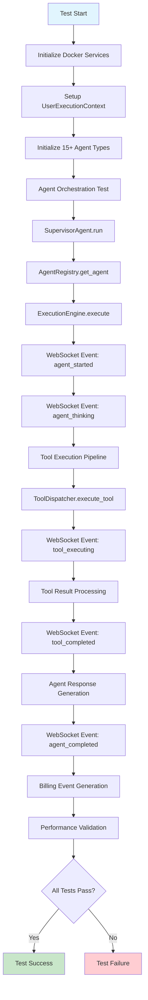
```mermaid
flowchart TD
    A[Test Start] --> B[Initialize Docker Services]
    B --> C[Setup UserExecutionContext]
    C --> D[Initialize 15+ Agent Types]
    
    D --> E[Agent Orchestration Test]
    E --> F[SupervisorAgent.run]
    F --> G[AgentRegistry.get_agent]
    G --> H[ExecutionEngine.execute]
    
    H --> I[WebSocket Event: agent_started]
    I --> J[WebSocket Event: agent_thinking]
    J --> K[Tool Execution Pipeline]
    
    K --> L[ToolDispatcher.execute_tool]
    L --> M[WebSocket Event: tool_executing]
    M --> N[Tool Result Processing]
    N --> O[WebSocket Event: tool_completed]
    
    O --> P[Agent Response Generation]
    P --> Q[WebSocket Event: agent_completed]
    Q --> R[Billing Event Generation]
    R --> S[Performance Validation]
    
    S --> T{All Tests Pass?}
    T -->|Yes| U[Test Success]
    T -->|No| V[Test Failure]
    
    style A fill:#e1f5fe
    style U fill:#c8e6c9
    style V fill:#ffcdd2
```

### test_agent_orchestration_real_critical.py - Critical Chat Flow

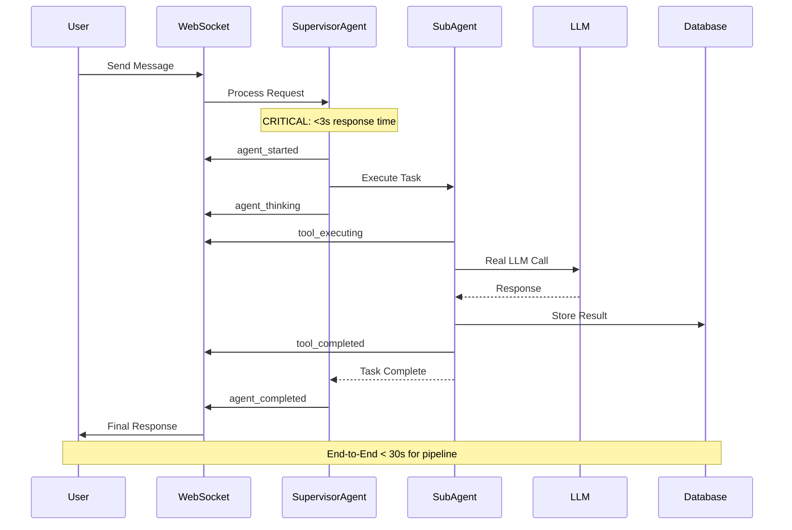
```mermaid
sequenceDiagram
    participant User
    participant WebSocket
    participant SupervisorAgent
    participant SubAgent
    participant LLM
    participant Database
    
    User->>WebSocket: Send Message
    WebSocket->>SupervisorAgent: Process Request
    
    Note over SupervisorAgent: CRITICAL: <3s response time
    
    SupervisorAgent->>WebSocket: agent_started
    SupervisorAgent->>SubAgent: Execute Task
    SupervisorAgent->>WebSocket: agent_thinking
    
    SubAgent->>WebSocket: tool_executing
    SubAgent->>LLM: Real LLM Call
    LLM-->>SubAgent: Response
    SubAgent->>Database: Store Result
    SubAgent->>WebSocket: tool_completed
    
    SubAgent-->>SupervisorAgent: Task Complete
    SupervisorAgent->>WebSocket: agent_completed
    WebSocket->>User: Final Response
    
    Note over User,Database: End-to-End < 30s for pipeline
```

### test_agent_orchestration_e2e.py - Multi-Agent Coordination

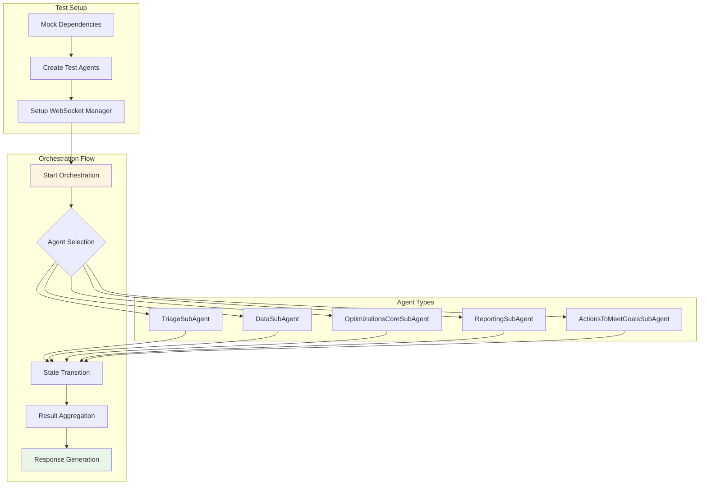
```mermaid
graph TB
    subgraph "Test Setup"
        A[Mock Dependencies] --> B[Create Test Agents]
        B --> C[Setup WebSocket Manager]
    end
    
    subgraph "Agent Types"
        D[TriageSubAgent]
        E[DataSubAgent]
        F[OptimizationsCoreSubAgent]
        G[ReportingSubAgent]
        H[ActionsToMeetGoalsSubAgent]
    end
    
    subgraph "Orchestration Flow"
        I[Start Orchestration]
        I --> J{Agent Selection}
        J --> D
        J --> E
        J --> F
        J --> G
        J --> H
        
        D --> K[State Transition]
        E --> K
        F --> K
        G --> K
        H --> K
        
        K --> L[Result Aggregation]
        L --> M[Response Generation]
    end
    
    C --> I
    
    style I fill:#fff3e0
    style M fill:#e8f5e8
```

---

## Message Flow E2E Tests

### test_comprehensive_message_flow.py - Message Pipeline Validation

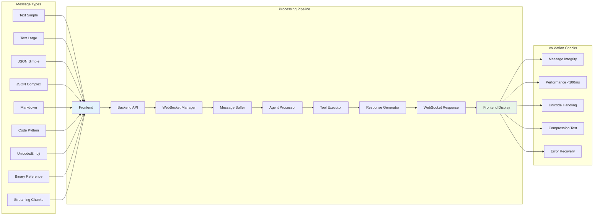
```mermaid
flowchart LR
    subgraph "Message Types"
        A[Text Simple]
        B[Text Large]
        C[JSON Simple]
        D[JSON Complex]
        E[Markdown]
        F[Code Python]
        G[Unicode/Emoji]
        H[Binary Reference]
        I[Streaming Chunks]
    end
    
    subgraph "Processing Pipeline"
        J[Frontend] --> K[Backend API]
        K --> L[WebSocket Manager]
        L --> M[Message Buffer]
        M --> N[Agent Processor]
        N --> O[Tool Executor]
        O --> P[Response Generator]
        P --> Q[WebSocket Response]
        Q --> R[Frontend Display]
    end
    
    A --> J
    B --> J
    C --> J
    D --> J
    E --> J
    F --> J
    G --> J
    H --> J
    I --> J
    
    subgraph "Validation Checks"
        S[Message Integrity]
        T[Performance <100ms]
        U[Unicode Handling]
        V[Compression Test]
        W[Error Recovery]
    end
    
    R --> S
    R --> T
    R --> U
    R --> V
    R --> W
    
    style J fill:#e3f2fd
    style R fill:#e8f5e8
```

### test_message_flow_comprehensive_e2e.py - End-to-End Message Flow

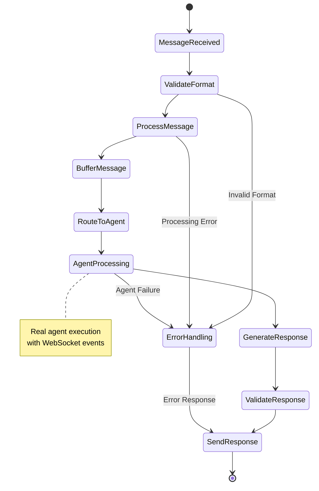
```mermaid
stateDiagram-v2
    [*] --> MessageReceived
    MessageReceived --> ValidateFormat
    ValidateFormat --> ProcessMessage
    ProcessMessage --> BufferMessage
    BufferMessage --> RouteToAgent
    
    RouteToAgent --> AgentProcessing
    AgentProcessing --> GenerateResponse
    GenerateResponse --> ValidateResponse
    ValidateResponse --> SendResponse
    SendResponse --> [*]
    
    ValidateFormat --> ErrorHandling : Invalid Format
    ProcessMessage --> ErrorHandling : Processing Error
    AgentProcessing --> ErrorHandling : Agent Failure
    ErrorHandling --> SendResponse : Error Response
    
    note right of AgentProcessing
        Real agent execution
        with WebSocket events
    end note
```

---

## Authentication E2E Tests

### test_auth_flow_comprehensive.py - Complete Authentication Flow

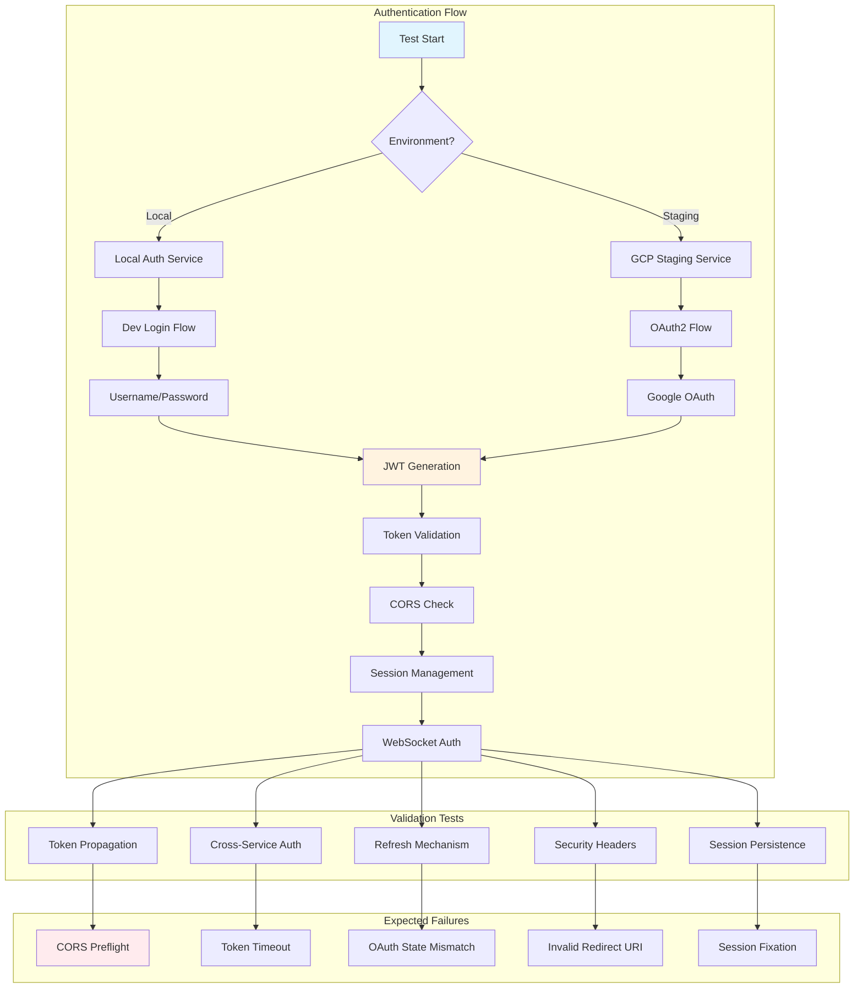
```mermaid
flowchart TD
    subgraph "Authentication Flow"
        A[Test Start] --> B{Environment?}
        B -->|Local| C[Local Auth Service]
        B -->|Staging| D[GCP Staging Service]
        
        C --> E[Dev Login Flow]
        D --> F[OAuth2 Flow]
        
        E --> G[Username/Password]
        F --> H[Google OAuth]
        
        G --> I[JWT Generation]
        H --> I
        
        I --> J[Token Validation]
        J --> K[CORS Check]
        K --> L[Session Management]
        L --> M[WebSocket Auth]
    end
    
    subgraph "Validation Tests"
        N[Token Propagation]
        O[Cross-Service Auth]
        P[Refresh Mechanism]
        Q[Security Headers]
        R[Session Persistence]
    end
    
    M --> N
    M --> O
    M --> P
    M --> Q
    M --> R
    
    subgraph "Expected Failures"
        S[CORS Preflight]
        T[Token Timeout]
        U[OAuth State Mismatch]
        V[Invalid Redirect URI]
        W[Session Fixation]
    end
    
    N --> S
    O --> T
    P --> U
    Q --> V
    R --> W
    
    style A fill:#e1f5fe
    style I fill:#fff3e0
    style S fill:#ffebee
```

### test_basic_user_flow_e2e.py - Critical User Journey

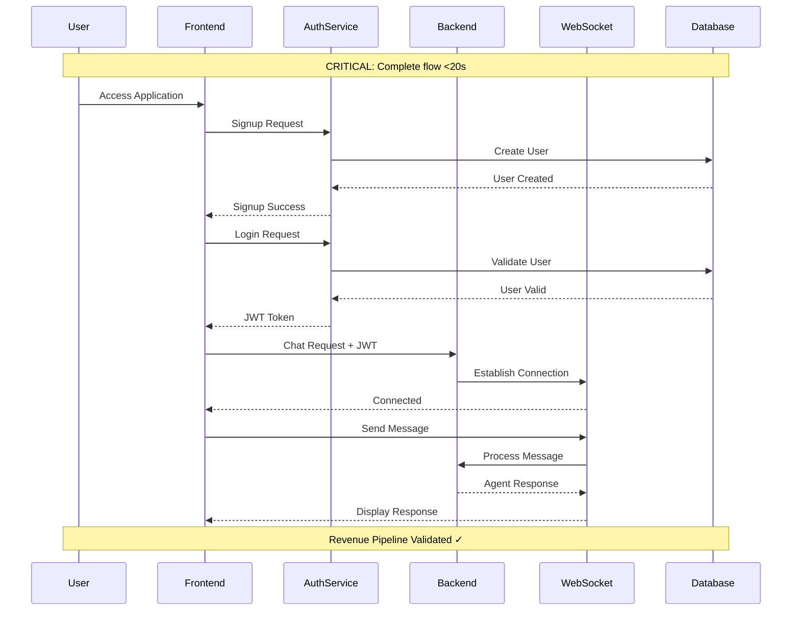
```mermaid
sequenceDiagram
    participant User
    participant Frontend
    participant AuthService
    participant Backend
    participant WebSocket
    participant Database
    
    Note over User,Database: CRITICAL: Complete flow <20s
    
    User->>Frontend: Access Application
    Frontend->>AuthService: Signup Request
    AuthService->>Database: Create User
    Database-->>AuthService: User Created
    AuthService-->>Frontend: Signup Success
    
    Frontend->>AuthService: Login Request
    AuthService->>Database: Validate User
    Database-->>AuthService: User Valid
    AuthService-->>Frontend: JWT Token
    
    Frontend->>Backend: Chat Request + JWT
    Backend->>WebSocket: Establish Connection
    WebSocket-->>Frontend: Connected
    
    Frontend->>WebSocket: Send Message
    WebSocket->>Backend: Process Message
    Backend-->>WebSocket: Agent Response
    WebSocket-->>Frontend: Display Response
    
    Note over User,Database: Revenue Pipeline Validated ✓
```

---

## WebSocket E2E Tests

### test_critical_websocket_agent_events.py - WebSocket Event Validation

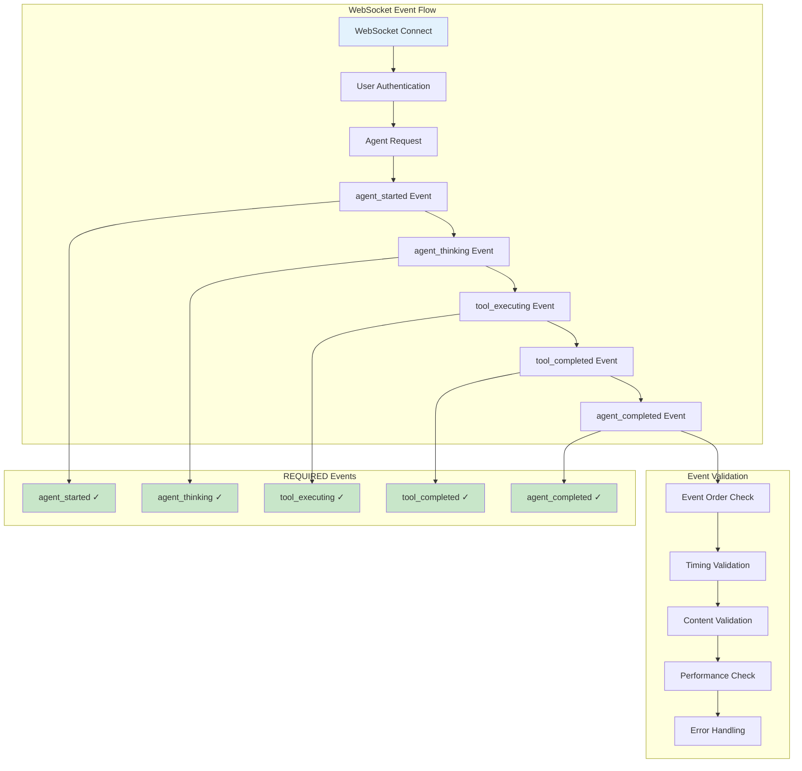
```mermaid
flowchart TD
    subgraph "WebSocket Event Flow"
        A[WebSocket Connect] --> B[User Authentication]
        B --> C[Agent Request]
        
        C --> D[agent_started Event]
        D --> E[agent_thinking Event]
        E --> F[tool_executing Event]
        F --> G[tool_completed Event]
        G --> H[agent_completed Event]
    end
    
    subgraph "Event Validation"
        I[Event Order Check]
        J[Timing Validation]
        K[Content Validation]
        L[Performance Check]
        M[Error Handling]
    end
    
    subgraph "REQUIRED Events"
        N[agent_started ✓]
        O[agent_thinking ✓]
        P[tool_executing ✓]
        Q[tool_completed ✓]
        R[agent_completed ✓]
    end
    
    H --> I
    I --> J
    J --> K
    K --> L
    L --> M
    
    D --> N
    E --> O
    F --> P
    G --> Q
    H --> R
    
    style A fill:#e3f2fd
    style N fill:#c8e6c9
    style O fill:#c8e6c9
    style P fill:#c8e6c9
    style Q fill:#c8e6c9
    style R fill:#c8e6c9
```

### test_websocket_comprehensive_e2e.py - WebSocket System Integration

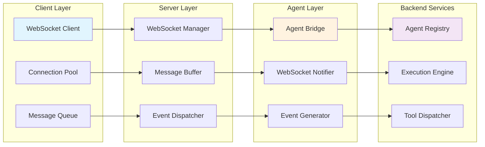
```mermaid
graph LR
    subgraph "Client Layer"
        A[WebSocket Client]
        B[Connection Pool]
        C[Message Queue]
    end
    
    subgraph "Server Layer"
        D[WebSocket Manager]
        E[Message Buffer]
        F[Event Dispatcher]
    end
    
    subgraph "Agent Layer"
        G[Agent Bridge]
        H[WebSocket Notifier]
        I[Event Generator]
    end
    
    subgraph "Backend Services"
        J[Agent Registry]
        K[Execution Engine]
        L[Tool Dispatcher]
    end
    
    A --> D
    B --> E
    C --> F
    
    D --> G
    E --> H
    F --> I
    
    G --> J
    H --> K
    I --> L
    
    style A fill:#e1f5fe
    style G fill:#fff3e0
    style J fill:#f3e5f5
```

---

## Database E2E Tests

### test_database_postgres_connectivity_e2e.py - Database Integration

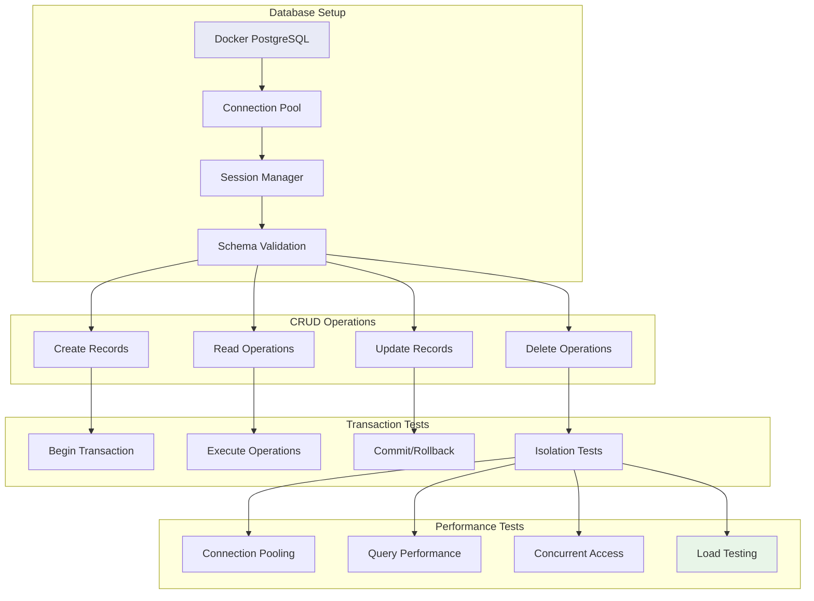
```mermaid
flowchart TD
    subgraph "Database Setup"
        A[Docker PostgreSQL] --> B[Connection Pool]
        B --> C[Session Manager]
        C --> D[Schema Validation]
    end
    
    subgraph "CRUD Operations"
        E[Create Records]
        F[Read Operations]
        G[Update Records]
        H[Delete Operations]
    end
    
    subgraph "Transaction Tests"
        I[Begin Transaction]
        J[Execute Operations]
        K[Commit/Rollback]
        L[Isolation Tests]
    end
    
    subgraph "Performance Tests"
        M[Connection Pooling]
        N[Query Performance]
        O[Concurrent Access]
        P[Load Testing]
    end
    
    D --> E
    D --> F
    D --> G
    D --> H
    
    E --> I
    F --> J
    G --> K
    H --> L
    
    L --> M
    L --> N
    L --> O
    L --> P
    
    style A fill:#e8eaf6
    style P fill:#e8f5e8
```

### test_database_migration_recovery_consistency.py - Migration Testing

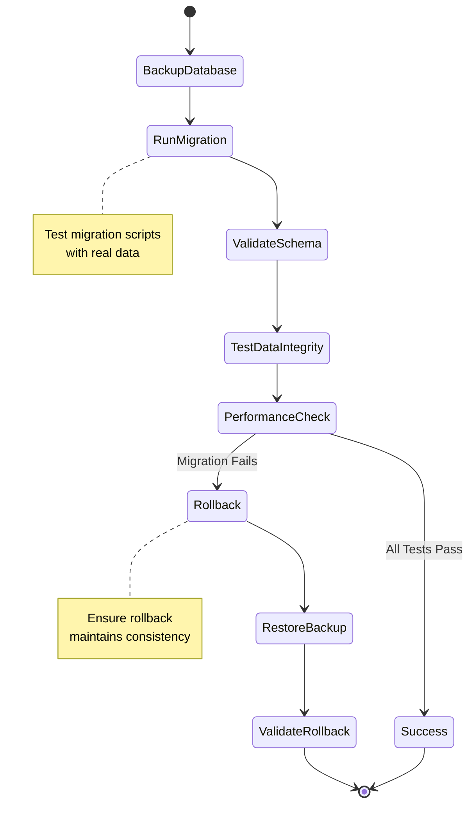
```mermaid
stateDiagram-v2
    [*] --> BackupDatabase
    BackupDatabase --> RunMigration
    RunMigration --> ValidateSchema
    ValidateSchema --> TestDataIntegrity
    TestDataIntegrity --> PerformanceCheck
    
    PerformanceCheck --> Success : All Tests Pass
    PerformanceCheck --> Rollback : Migration Fails
    
    Rollback --> RestoreBackup
    RestoreBackup --> ValidateRollback
    ValidateRollback --> [*]
    
    Success --> [*]
    
    note right of RunMigration
        Test migration scripts
        with real data
    end note
    
    note right of Rollback
        Ensure rollback
        maintains consistency
    end note
```

---

## System Health E2E Tests

### test_basic_health_checks_e2e.py - System Health Validation

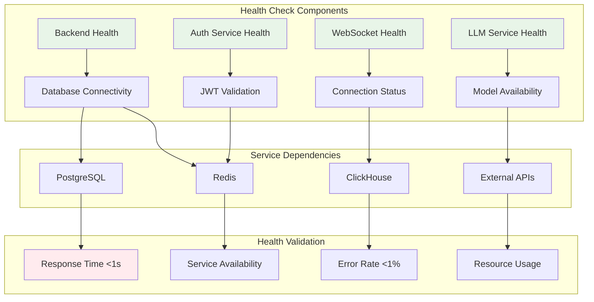
```mermaid
graph TD
    subgraph "Health Check Components"
        A[Backend Health] --> B[Database Connectivity]
        C[Auth Service Health] --> D[JWT Validation]
        E[WebSocket Health] --> F[Connection Status]
        G[LLM Service Health] --> H[Model Availability]
    end
    
    subgraph "Service Dependencies"
        I[PostgreSQL]
        J[Redis]
        K[ClickHouse]
        L[External APIs]
    end
    
    subgraph "Health Validation"
        M[Response Time <1s]
        N[Service Availability]
        O[Error Rate <1%]
        P[Resource Usage]
    end
    
    B --> I
    B --> J
    D --> J
    F --> K
    H --> L
    
    I --> M
    J --> N
    K --> O
    L --> P
    
    style A fill:#e8f5e8
    style C fill:#e8f5e8
    style E fill:#e8f5e8
    style G fill:#e8f5e8
    style M fill:#ffebee
```

### test_complete_system_startup_health_validation.py - Startup Flow

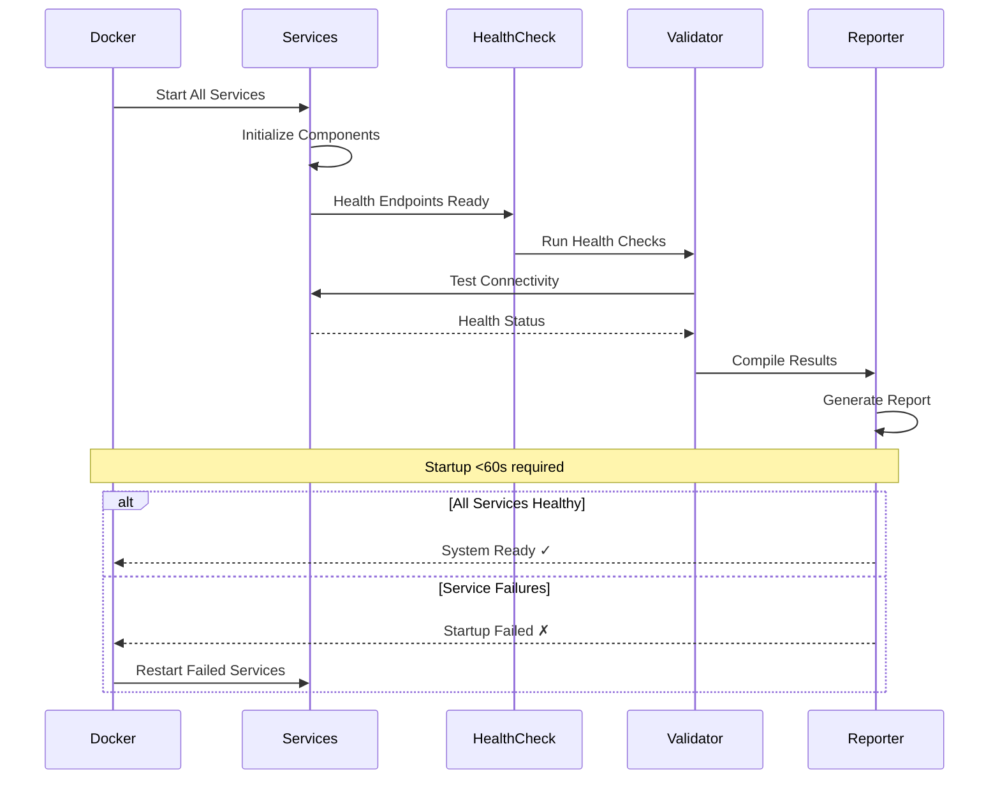
```mermaid
sequenceDiagram
    participant Docker
    participant Services
    participant HealthCheck
    participant Validator
    participant Reporter
    
    Docker->>Services: Start All Services
    Services->>Services: Initialize Components
    Services->>HealthCheck: Health Endpoints Ready
    
    HealthCheck->>Validator: Run Health Checks
    Validator->>Services: Test Connectivity
    Services-->>Validator: Health Status
    
    Validator->>Reporter: Compile Results
    Reporter->>Reporter: Generate Report
    
    Note over Docker,Reporter: Startup <60s required
    
    alt All Services Healthy
        Reporter-->>Docker: System Ready ✓
    else Service Failures
        Reporter-->>Docker: Startup Failed ✗
        Docker->>Services: Restart Failed Services
    end
```

---

## User Journey E2E Tests

### test_first_user_journey.py - New User Experience

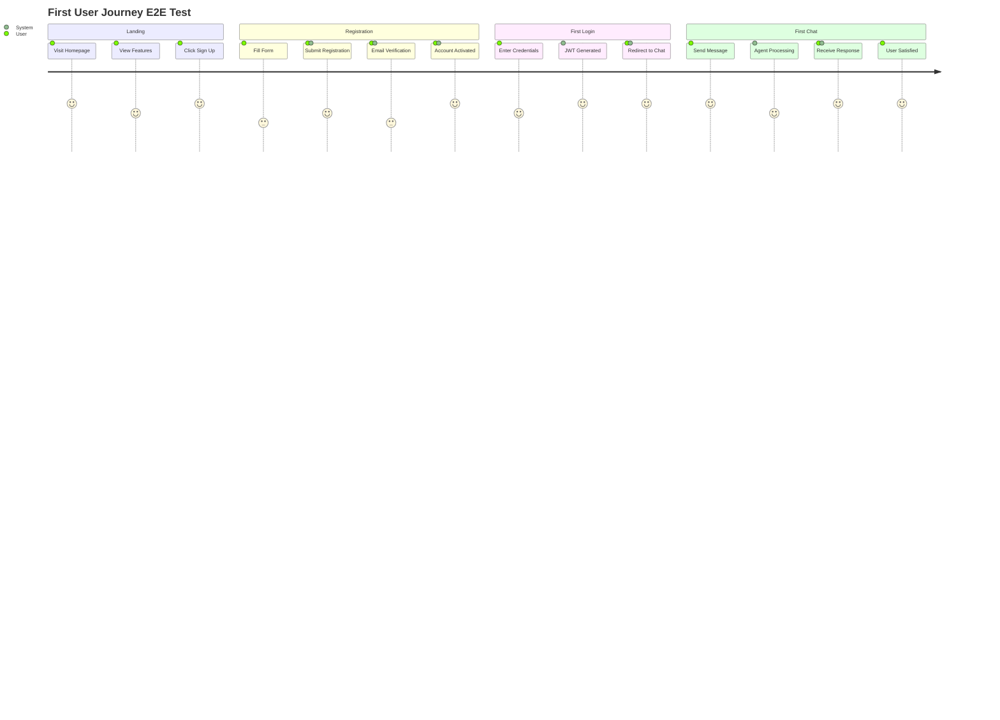
```mermaid
journey
    title First User Journey E2E Test
    
    section Landing
        Visit Homepage: 5: User
        View Features: 4: User
        Click Sign Up: 5: User
        
    section Registration  
        Fill Form: 3: User
        Submit Registration: 4: User, System
        Email Verification: 3: User, System
        Account Activated: 5: User, System
        
    section First Login
        Enter Credentials: 4: User
        JWT Generated: 5: System
        Redirect to Chat: 5: User, System
        
    section First Chat
        Send Message: 5: User
        Agent Processing: 4: System
        Receive Response: 5: User, System
        User Satisfied: 5: User
```

### test_demo_e2e.py - Demo Flow Validation

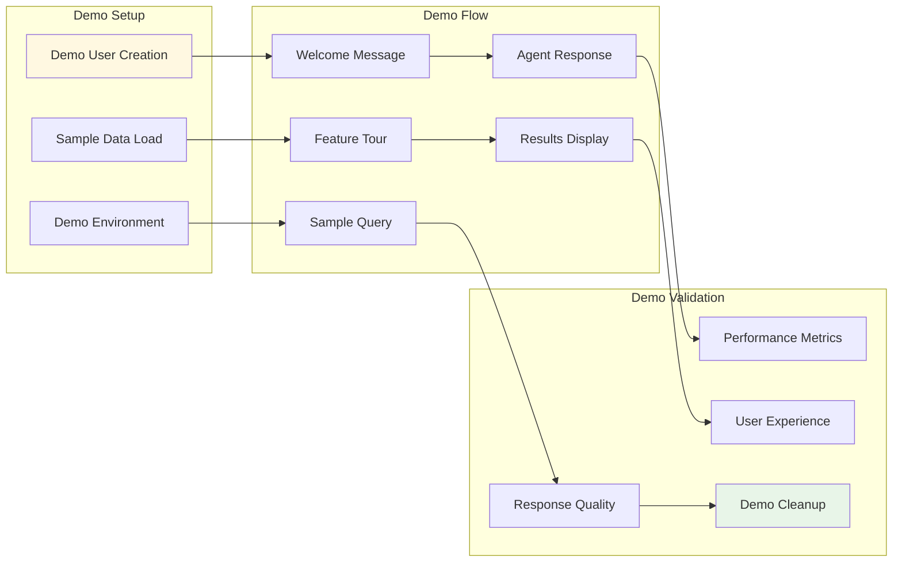
```mermaid
flowchart LR
    subgraph "Demo Setup"
        A[Demo User Creation]
        B[Sample Data Load]
        C[Demo Environment]
    end
    
    subgraph "Demo Flow"
        D[Welcome Message]
        E[Feature Tour]
        F[Sample Query]
        G[Agent Response]
        H[Results Display]
    end
    
    subgraph "Demo Validation"
        I[Response Quality]
        J[Performance Metrics]
        K[User Experience]
        L[Demo Cleanup]
    end
    
    A --> D
    B --> E
    C --> F
    
    D --> G
    E --> H
    F --> I
    
    G --> J
    H --> K
    I --> L
    
    style A fill:#fff8e1
    style L fill:#e8f5e8
```

---

## Netra Backend E2E Tests

### test_complete_real_pipeline_e2e.py - Real Agent Pipeline

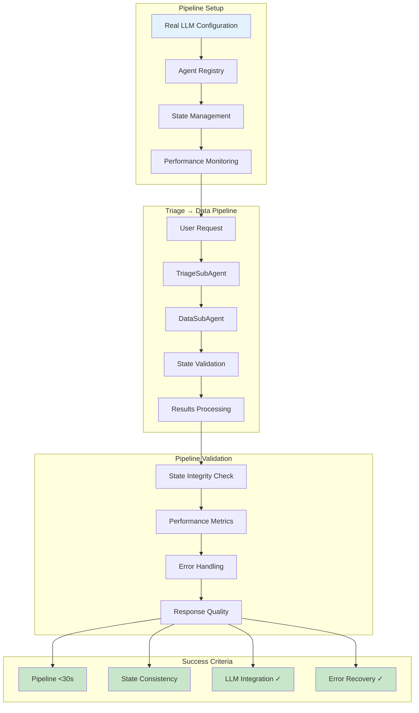
```mermaid
flowchart TD
    subgraph "Pipeline Setup"
        A[Real LLM Configuration] --> B[Agent Registry]
        B --> C[State Management]
        C --> D[Performance Monitoring]
    end
    
    subgraph "Triage → Data Pipeline"
        E[User Request] --> F[TriageSubAgent]
        F --> G[DataSubAgent]
        G --> H[State Validation]
        H --> I[Results Processing]
    end
    
    subgraph "Pipeline Validation"
        J[State Integrity Check]
        K[Performance Metrics]
        L[Error Handling]
        M[Response Quality]
    end
    
    D --> E
    I --> J
    J --> K
    K --> L
    L --> M
    
    subgraph "Success Criteria"
        N[Pipeline <30s]
        O[State Consistency]
        P[LLM Integration ✓]
        Q[Error Recovery ✓]
    end
    
    M --> N
    M --> O
    M --> P
    M --> Q
    
    style A fill:#e3f2fd
    style N fill:#c8e6c9
    style O fill:#c8e6c9
    style P fill:#c8e6c9
    style Q fill:#c8e6c9
```

### test_agent_workflow_e2e_comprehensive.py - Agent Workflow Testing

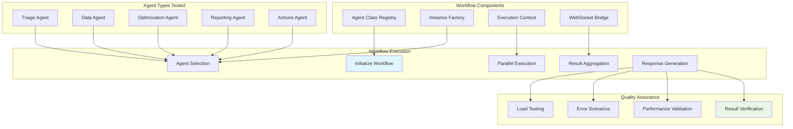
```mermaid
graph TB
    subgraph "Workflow Components"
        A[Agent Class Registry]
        B[Instance Factory]
        C[Execution Context]
        D[WebSocket Bridge]
    end
    
    subgraph "Agent Types Tested"
        E[Triage Agent]
        F[Data Agent]
        G[Optimization Agent]
        H[Reporting Agent]
        I[Actions Agent]
    end
    
    subgraph "Workflow Execution"
        J[Initialize Workflow]
        K[Agent Selection]
        L[Parallel Execution]
        M[Result Aggregation]
        N[Response Generation]
    end
    
    subgraph "Quality Assurance"
        O[Load Testing]
        P[Error Scenarios]
        Q[Performance Validation]
        R[Result Verification]
    end
    
    A --> J
    B --> K
    C --> L
    D --> M
    
    E --> K
    F --> K
    G --> K
    H --> K
    I --> K
    
    N --> O
    N --> P
    N --> Q
    N --> R
    
    style J fill:#e1f5fe
    style R fill:#e8f5e8
```

---

## Test Infrastructure Overview

### Overall E2E Test Architecture

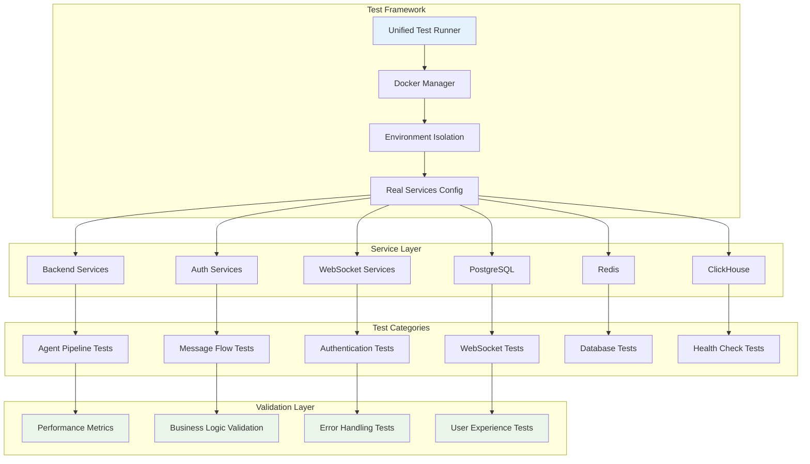
```mermaid
graph TD
    subgraph "Test Framework"
        A[Unified Test Runner]
        B[Docker Manager]
        C[Environment Isolation]
        D[Real Services Config]
    end
    
    subgraph "Service Layer"
        E[PostgreSQL]
        F[Redis]
        G[ClickHouse]
        H[Backend Services]
        I[Auth Services]
        J[WebSocket Services]
    end
    
    subgraph "Test Categories"
        K[Agent Pipeline Tests]
        L[Message Flow Tests]
        M[Authentication Tests]
        N[WebSocket Tests]
        O[Database Tests]
        P[Health Check Tests]
    end
    
    subgraph "Validation Layer"
        Q[Performance Metrics]
        R[Business Logic Validation]
        S[Error Handling Tests]
        T[User Experience Tests]
    end
    
    A --> B
    B --> C
    C --> D
    
    D --> E
    D --> F
    D --> G
    D --> H
    D --> I
    D --> J
    
    H --> K
    I --> L
    J --> M
    E --> N
    F --> O
    G --> P
    
    K --> Q
    L --> R
    M --> S
    N --> T
    
    style A fill:#e3f2fd
    style Q fill:#e8f5e8
    style R fill:#e8f5e8
    style S fill:#e8f5e8
    style T fill:#e8f5e8
```

## Key Testing Principles

### No Mocks Policy Implementation

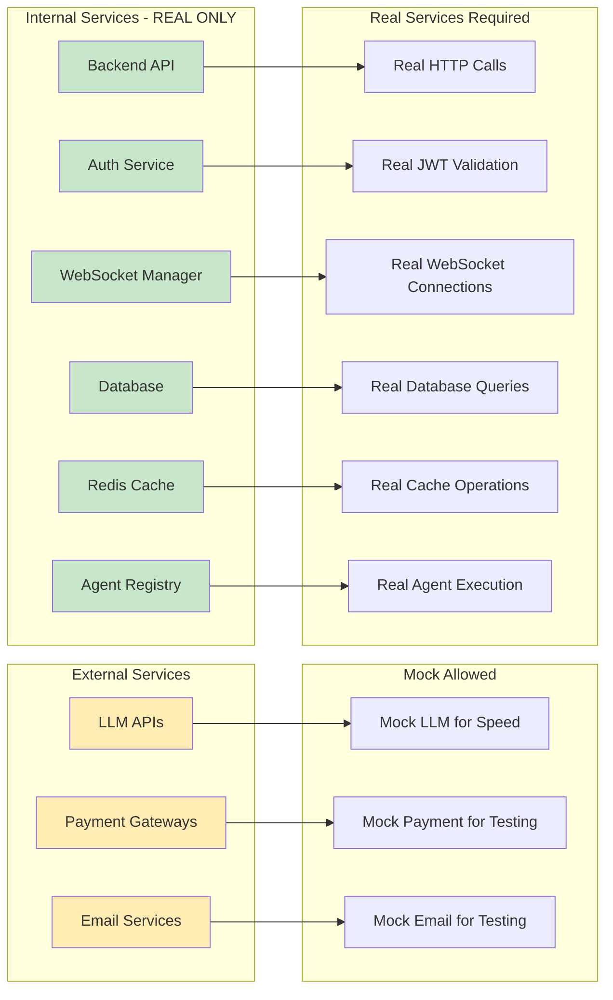
```mermaid
flowchart LR
    subgraph "External Services"
        A[LLM APIs] 
        B[Payment Gateways]
        C[Email Services]
    end
    
    subgraph "Internal Services - REAL ONLY"
        D[Backend API]
        E[Auth Service]
        F[WebSocket Manager]
        G[Database]
        H[Redis Cache]
        I[Agent Registry]
    end
    
    subgraph "Mock Allowed"
        A --> J[Mock LLM for Speed]
        B --> K[Mock Payment for Testing]
        C --> L[Mock Email for Testing]
    end
    
    subgraph "Real Services Required"
        D --> M[Real HTTP Calls]
        E --> N[Real JWT Validation]
        F --> O[Real WebSocket Connections]
        G --> P[Real Database Queries]
        H --> Q[Real Cache Operations]
        I --> R[Real Agent Execution]
    end
    
    style D fill:#c8e6c9
    style E fill:#c8e6c9
    style F fill:#c8e6c9
    style G fill:#c8e6c9
    style H fill:#c8e6c9
    style I fill:#c8e6c9
    
    style A fill:#ffecb3
    style B fill:#ffecb3
    style C fill:#ffecb3
```

## Performance Requirements

All E2E tests must meet these performance criteria:

- **Agent Pipeline**: Complete execution < 30 seconds
- **Message Processing**: < 100ms per message
- **Authentication**: Login flow < 5 seconds  
- **WebSocket Events**: Event propagation < 1 second
- **Database Operations**: Query response < 2 seconds
- **System Startup**: Full system ready < 60 seconds
- **Critical User Flow**: Complete journey < 20 seconds

## Business Value Validation

Each E2E test validates specific business value:

- **Revenue Pipeline**: User signup → login → chat → billing
- **Platform Stability**: System reliability under load
- **User Experience**: Response times and error handling
- **Data Integrity**: Consistent state across services
- **Security**: Authentication and authorization flows
- **Scalability**: Multi-user concurrent operations

---

*This document is generated from actual E2E test files in the Netra codebase. Each diagram represents real test flows and validation criteria used to ensure system reliability and business value delivery.*