# Integration Test Diagrams

This document provides comprehensive Mermaid diagrams for all integration tests in the Netra project, showing component integration points, service dependencies, and data flows.

## Table of Contents

1. [Critical Path Integration Tests](#critical-path-integration-tests)
2. [Agent Integration Tests](#agent-integration-tests)
3. [Database Integration Tests](#database-integration-tests)
4. [Authentication Integration Tests](#authentication-integration-tests)
5. [Service Coordination Tests](#service-coordination-tests)
6. [WebSocket Integration Tests](#websocket-integration-tests)
7. [User Journey Integration Tests](#user-journey-integration-tests)
8. [Cross-Service Integration Tests](#cross-service-integration-tests)

---

## Critical Path Integration Tests

### First-Time User Experience Integration
**Test Files:** `test_first_time_user_experience.py`, `test_first_time_user_journey_*.py`

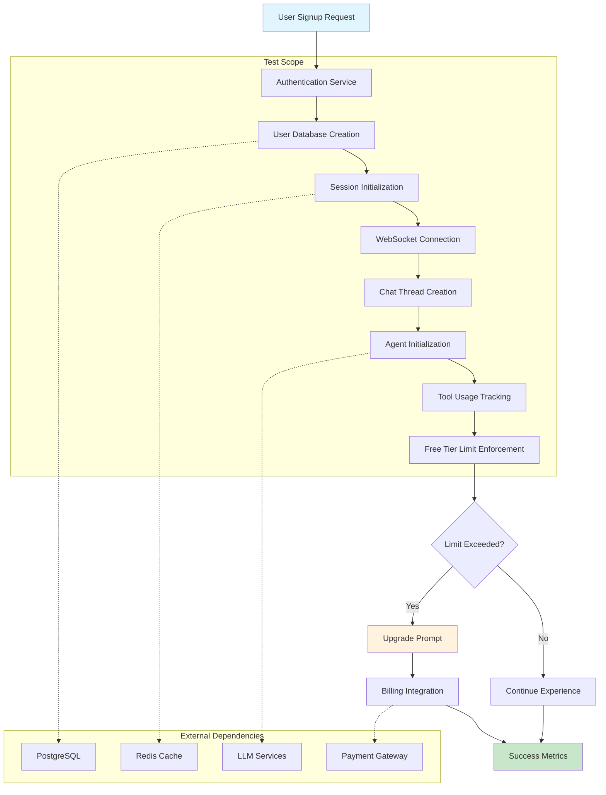
```mermaid
flowchart TD
    A[User Signup Request] --> B[Authentication Service]
    B --> C[User Database Creation]
    C --> D[Session Initialization]
    D --> E[WebSocket Connection]
    E --> F[Chat Thread Creation]
    F --> G[Agent Initialization]
    G --> H[Tool Usage Tracking]
    H --> I[Free Tier Limit Enforcement]
    I --> J{Limit Exceeded?}
    J -->|Yes| K[Upgrade Prompt]
    J -->|No| L[Continue Experience]
    K --> M[Billing Integration]
    L --> N[Success Metrics]
    M --> N
    
    subgraph "Test Scope"
        direction TB
        B
        C
        D
        E
        F
        G
        H
        I
    end
    
    subgraph "External Dependencies"
        direction TB
        O[PostgreSQL]
        P[Redis Cache]
        Q[LLM Services]
        R[Payment Gateway]
    end
    
    C -.-> O
    D -.-> P
    G -.-> Q
    M -.-> R
    
    style A fill:#e1f5fe
    style N fill:#c8e6c9
    style K fill:#fff3e0
```

### Multi-Service Health Check Integration
**Test Files:** `test_service_discovery_health_checks.py`, `test_backend_readiness_check.py`

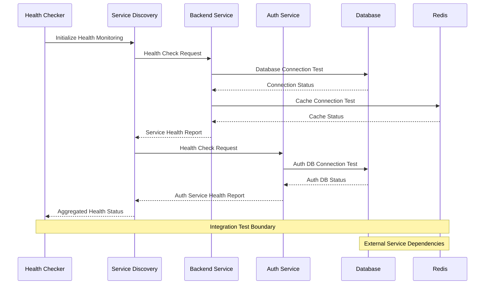
```mermaid
sequenceDiagram
    participant HC as Health Checker
    participant SD as Service Discovery
    participant BE as Backend Service
    participant AU as Auth Service
    participant DB as Database
    participant RD as Redis
    
    HC->>SD: Initialize Health Monitoring
    SD->>BE: Health Check Request
    BE->>DB: Database Connection Test
    DB-->>BE: Connection Status
    BE->>RD: Cache Connection Test
    RD-->>BE: Cache Status
    BE-->>SD: Service Health Report
    
    SD->>AU: Health Check Request
    AU->>DB: Auth DB Connection Test
    DB-->>AU: Auth DB Status
    AU-->>SD: Auth Service Health Report
    
    SD-->>HC: Aggregated Health Status
    
    note over HC,RD: Integration Test Boundary
    note over DB,RD: External Service Dependencies
```

---

## Agent Integration Tests

### Agent State Propagation Integration
**Test Files:** `test_agent_state_propagation.py`, `test_websocket_agent_flow.py`

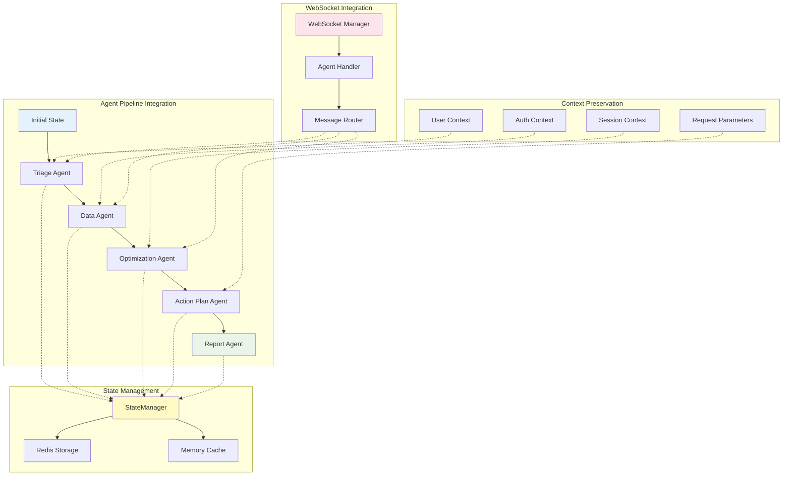
```mermaid
graph TB
    subgraph "Agent Pipeline Integration"
        A[Initial State] --> B[Triage Agent]
        B --> C[Data Agent]
        C --> D[Optimization Agent]
        D --> E[Action Plan Agent]
        E --> F[Report Agent]
    end
    
    subgraph "State Management"
        G[StateManager]
        H[Redis Storage]
        I[Memory Cache]
        G --> H
        G --> I
    end
    
    subgraph "Context Preservation"
        J[User Context]
        K[Auth Context]
        L[Session Context]
        M[Request Parameters]
    end
    
    subgraph "WebSocket Integration"
        N[WebSocket Manager]
        O[Agent Handler]
        P[Message Router]
        N --> O
        O --> P
    end
    
    B -.-> G
    C -.-> G
    D -.-> G
    E -.-> G
    F -.-> G
    
    J -.-> B
    K -.-> C
    L -.-> D
    M -.-> E
    
    P -.-> B
    P -.-> C
    P -.-> D
    
    style A fill:#e3f2fd
    style F fill:#e8f5e8
    style G fill:#fff9c4
    style N fill:#fce4ec
```

### Agent Execution Context Flow
**Test Files:** `test_websocket_agent_flow.py`

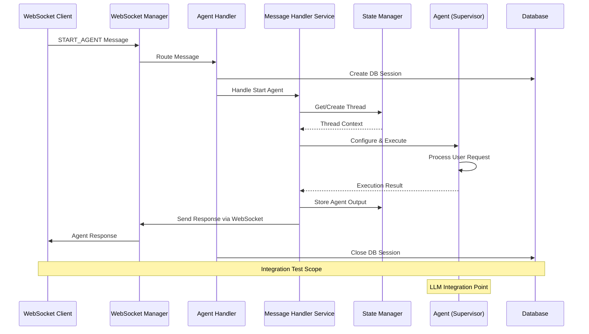
```mermaid
sequenceDiagram
    participant WS as WebSocket Client
    participant WM as WebSocket Manager
    participant AH as Agent Handler
    participant MHS as Message Handler Service
    participant SM as State Manager
    participant AG as Agent (Supervisor)
    participant DB as Database
    
    WS->>WM: START_AGENT Message
    WM->>AH: Route Message
    AH->>DB: Create DB Session
    AH->>MHS: Handle Start Agent
    MHS->>SM: Get/Create Thread
    SM-->>MHS: Thread Context
    MHS->>AG: Configure & Execute
    AG->>AG: Process User Request
    AG-->>MHS: Execution Result
    MHS->>SM: Store Agent Output
    MHS->>WM: Send Response via WebSocket
    WM->>WS: Agent Response
    AH->>DB: Close DB Session
    
    note over WS,DB: Integration Test Scope
    note over AG: LLM Integration Point
```

---

## Database Integration Tests

### Connection Pooling Integration
**Test Files:** `test_database_connection_pooling.py`, `test_database_transaction_coordination.py`

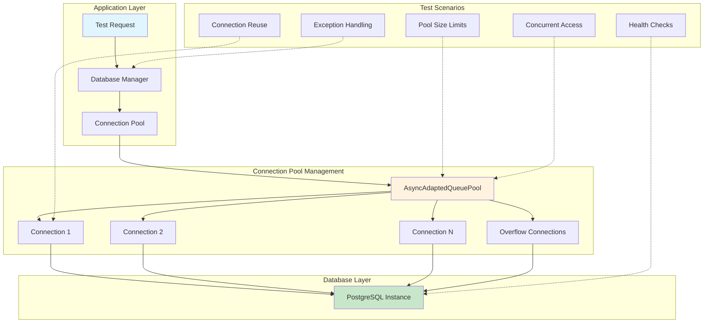
```mermaid
graph TD
    subgraph "Application Layer"
        A[Test Request] --> B[Database Manager]
        B --> C[Connection Pool]
    end
    
    subgraph "Connection Pool Management"
        C --> D[AsyncAdaptedQueuePool]
        D --> E[Connection 1]
        D --> F[Connection 2]
        D --> G[Connection N]
        D --> H[Overflow Connections]
    end
    
    subgraph "Database Layer"
        E --> I[PostgreSQL Instance]
        F --> I
        G --> I
        H --> I
    end
    
    subgraph "Test Scenarios"
        J[Pool Size Limits]
        K[Connection Reuse]
        L[Concurrent Access]
        M[Exception Handling]
        N[Health Checks]
    end
    
    J -.-> D
    K -.-> E
    L -.-> D
    M -.-> B
    N -.-> I
    
    style A fill:#e1f5fe
    style I fill:#c8e6c9
    style D fill:#fff3e0
```

### Database Migration Integration
**Test Files:** `test_database_migration_rollback.py`, `test_missing_database_tables.py`

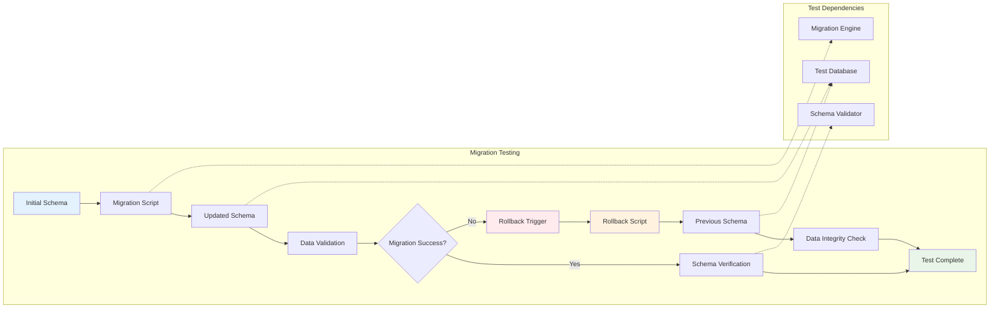
```mermaid
flowchart LR
    subgraph "Migration Testing"
        A[Initial Schema] --> B[Migration Script]
        B --> C[Updated Schema]
        C --> D[Data Validation]
        D --> E{Migration Success?}
        E -->|Yes| F[Schema Verification]
        E -->|No| G[Rollback Trigger]
        G --> H[Rollback Script]
        H --> I[Previous Schema]
        I --> J[Data Integrity Check]
        F --> K[Test Complete]
        J --> K
    end
    
    subgraph "Test Dependencies"
        L[Test Database]
        M[Migration Engine]
        N[Schema Validator]
    end
    
    B -.-> M
    C -.-> L
    F -.-> N
    I -.-> L
    
    style A fill:#e3f2fd
    style K fill:#e8f5e8
    style G fill:#ffebee
    style H fill:#fff3e0
```

---

## Authentication Integration Tests

### Auth Service Integration
**Test Files:** `test_real_auth_integration_managers.py`, `test_auth_jwt_redis_session.py`

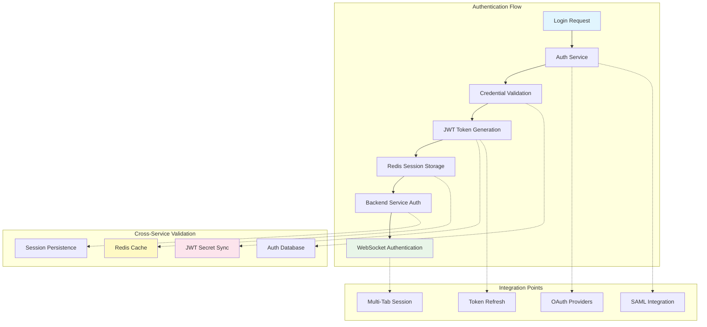
```mermaid
graph TB
    subgraph "Authentication Flow"
        A[Login Request] --> B[Auth Service]
        B --> C[Credential Validation]
        C --> D[JWT Token Generation]
        D --> E[Redis Session Storage]
        E --> F[Backend Service Auth]
        F --> G[WebSocket Authentication]
    end
    
    subgraph "Cross-Service Validation"
        H[Auth Database]
        I[Redis Cache]
        J[JWT Secret Sync]
        K[Session Persistence]
    end
    
    subgraph "Integration Points"
        L[OAuth Providers]
        M[SAML Integration]
        N[Multi-Tab Session]
        O[Token Refresh]
    end
    
    C -.-> H
    E -.-> I
    D -.-> J
    F -.-> K
    
    B -.-> L
    B -.-> M
    G -.-> N
    D -.-> O
    
    style A fill:#e1f5fe
    style G fill:#e8f5e8
    style I fill:#fff9c4
    style J fill:#fce4ec
```

### JWT Cross-Service Integration
**Test Files:** `test_jwt_cross_service.py`, `test_jwt_secret_synchronization.py`

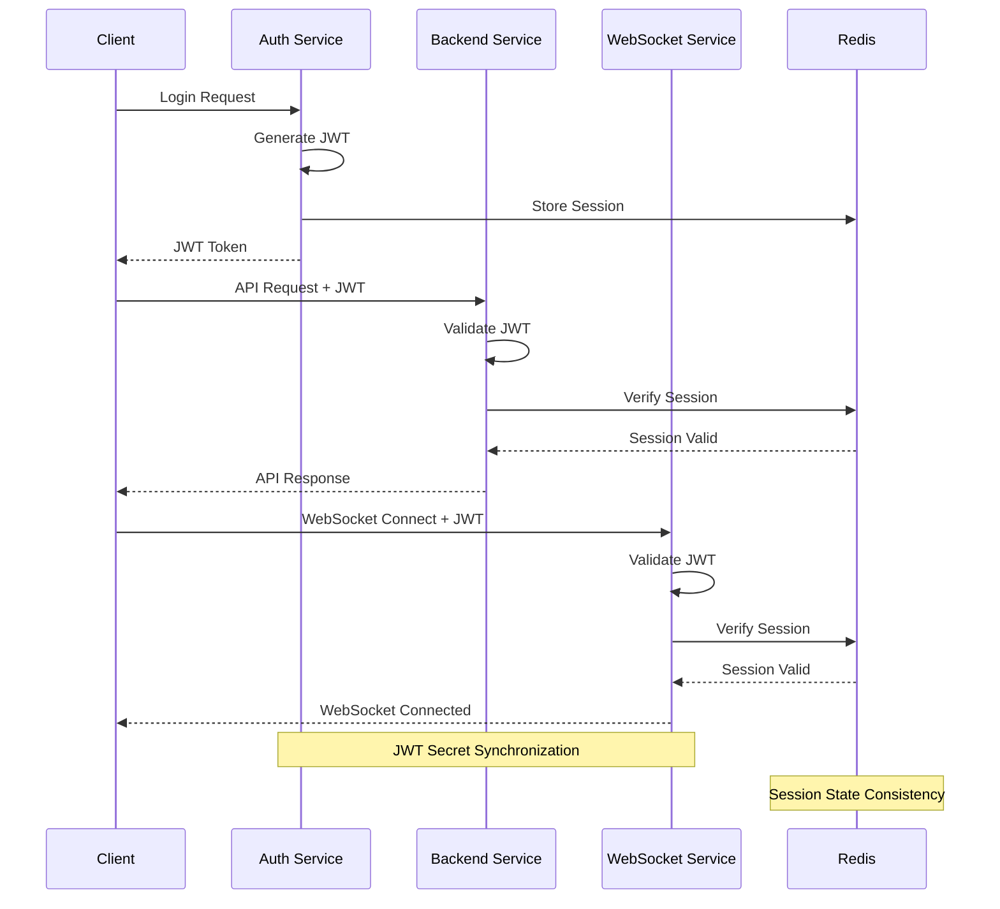
```mermaid
sequenceDiagram
    participant CL as Client
    participant AU as Auth Service
    participant BE as Backend Service
    participant WS as WebSocket Service
    participant RD as Redis
    
    CL->>AU: Login Request
    AU->>AU: Generate JWT
    AU->>RD: Store Session
    AU-->>CL: JWT Token
    
    CL->>BE: API Request + JWT
    BE->>BE: Validate JWT
    BE->>RD: Verify Session
    RD-->>BE: Session Valid
    BE-->>CL: API Response
    
    CL->>WS: WebSocket Connect + JWT
    WS->>WS: Validate JWT
    WS->>RD: Verify Session
    RD-->>WS: Session Valid
    WS-->>CL: WebSocket Connected
    
    note over AU,WS: JWT Secret Synchronization
    note over RD: Session State Consistency
```

---

## Service Coordination Tests

### Multi-Service Integration
**Test Files:** `test_multi_service_integration_core.py`, `test_cross_service_integration_*.py`

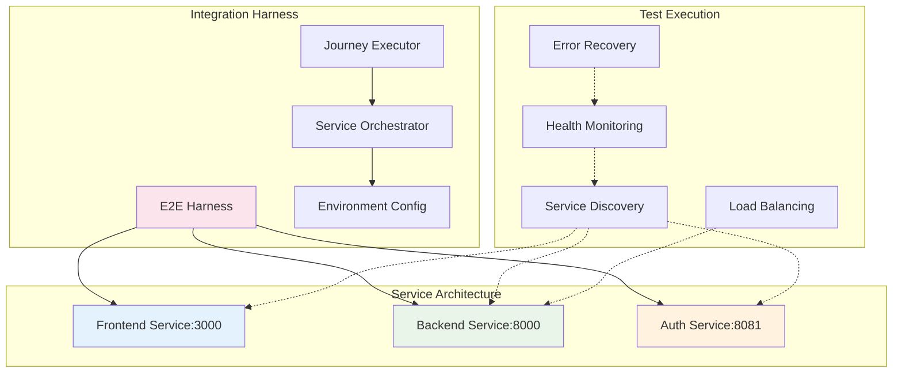
```mermaid
graph TD
    subgraph "Service Architecture"
        A[Frontend Service:3000] 
        B[Backend Service:8000]
        C[Auth Service:8081]
    end
    
    subgraph "Integration Harness"
        D[E2E Harness]
        E[Journey Executor]
        F[Service Orchestrator]
        G[Environment Config]
    end
    
    subgraph "Test Execution"
        H[Service Discovery]
        I[Health Monitoring]
        J[Load Balancing]
        K[Error Recovery]
    end
    
    D --> A
    D --> B
    D --> C
    E --> F
    F --> G
    
    H -.-> A
    H -.-> B
    H -.-> C
    I -.-> H
    J -.-> B
    K -.-> I
    
    style A fill:#e3f2fd
    style B fill:#e8f5e8
    style C fill:#fff3e0
    style D fill:#fce4ec
```

### Service Startup Orchestration
**Test Files:** `test_multi_service_startup_orchestration.py`, `test_service_startup_sequence.py`

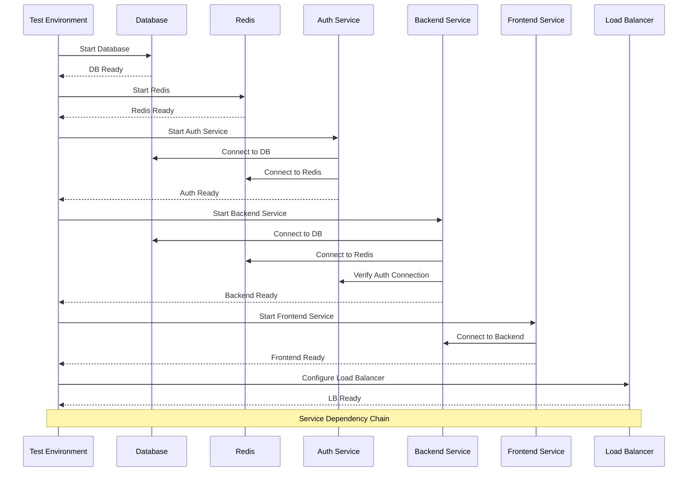
```mermaid
sequenceDiagram
    participant TE as Test Environment
    participant DB as Database
    participant RD as Redis
    participant AU as Auth Service
    participant BE as Backend Service
    participant FE as Frontend Service
    participant LB as Load Balancer
    
    TE->>DB: Start Database
    DB-->>TE: DB Ready
    TE->>RD: Start Redis
    RD-->>TE: Redis Ready
    TE->>AU: Start Auth Service
    AU->>DB: Connect to DB
    AU->>RD: Connect to Redis
    AU-->>TE: Auth Ready
    TE->>BE: Start Backend Service
    BE->>DB: Connect to DB
    BE->>RD: Connect to Redis
    BE->>AU: Verify Auth Connection
    BE-->>TE: Backend Ready
    TE->>FE: Start Frontend Service
    FE->>BE: Connect to Backend
    FE-->>TE: Frontend Ready
    TE->>LB: Configure Load Balancer
    LB-->>TE: LB Ready
    
    note over TE,LB: Service Dependency Chain
```

---

## WebSocket Integration Tests

### WebSocket Connection Lifecycle
**Test Files:** `test_websocket_connection_lifecycle_compliant.py`, `test_websocket_reconnection_core.py`

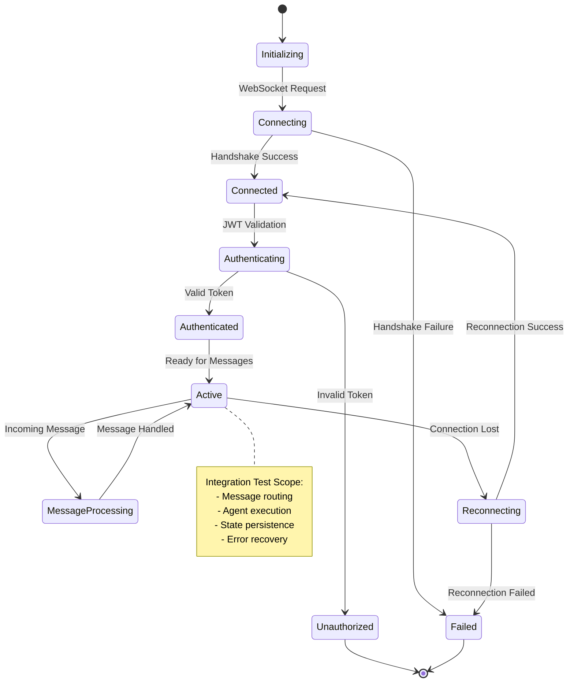
```mermaid
stateDiagram-v2
    [*] --> Initializing
    Initializing --> Connecting : WebSocket Request
    Connecting --> Connected : Handshake Success
    Connecting --> Failed : Handshake Failure
    Connected --> Authenticating : JWT Validation
    Authenticating --> Authenticated : Valid Token
    Authenticating --> Unauthorized : Invalid Token
    Authenticated --> Active : Ready for Messages
    Active --> MessageProcessing : Incoming Message
    MessageProcessing --> Active : Message Handled
    Active --> Reconnecting : Connection Lost
    Reconnecting --> Connected : Reconnection Success
    Reconnecting --> Failed : Reconnection Failed
    Unauthorized --> [*]
    Failed --> [*]
    
    note right of Active
        Integration Test Scope:
        - Message routing
        - Agent execution
        - State persistence
        - Error recovery
    end note
```

### WebSocket Event Propagation
**Test Files:** `test_websocket_event_completeness.py`, `test_websocket_event_propagation_unified.py`

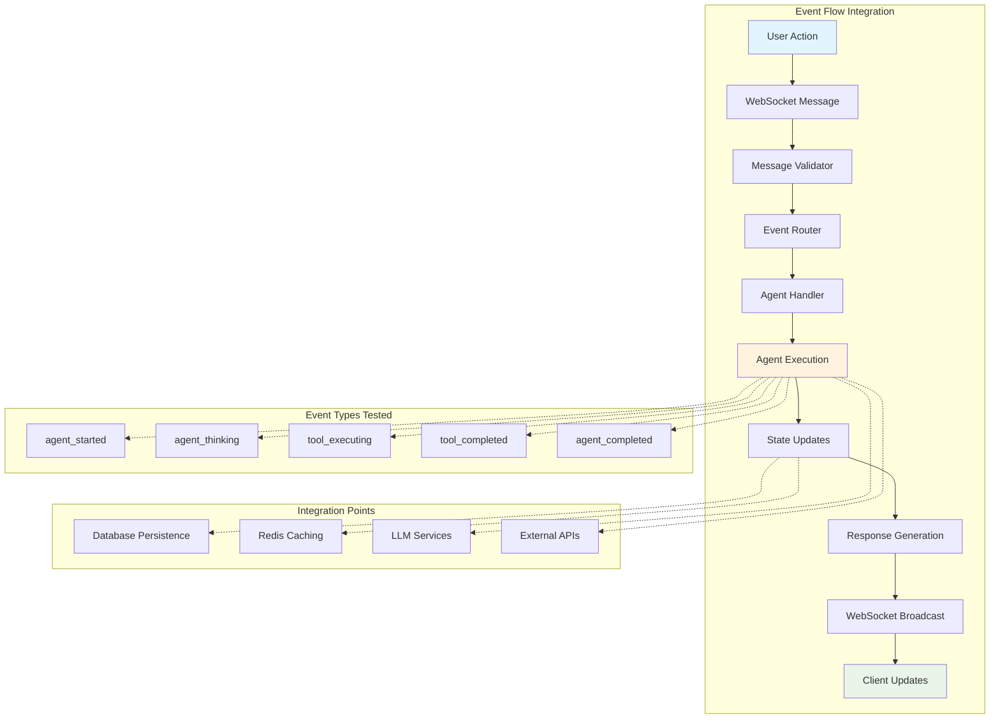
```mermaid
flowchart TD
    subgraph "Event Flow Integration"
        A[User Action] --> B[WebSocket Message]
        B --> C[Message Validator]
        C --> D[Event Router]
        D --> E[Agent Handler]
        E --> F[Agent Execution]
        F --> G[State Updates]
        G --> H[Response Generation]
        H --> I[WebSocket Broadcast]
        I --> J[Client Updates]
    end
    
    subgraph "Event Types Tested"
        K[agent_started]
        L[agent_thinking]
        M[tool_executing]
        N[tool_completed]
        O[agent_completed]
    end
    
    subgraph "Integration Points"
        P[Database Persistence]
        Q[Redis Caching]
        R[LLM Services]
        S[External APIs]
    end
    
    F -.-> K
    F -.-> L
    F -.-> M
    F -.-> N
    F -.-> O
    
    G -.-> P
    G -.-> Q
    F -.-> R
    F -.-> S
    
    style A fill:#e1f5fe
    style J fill:#e8f5e8
    style F fill:#fff3e0
```

---

## User Journey Integration Tests

### Complete User Journey Flow
**Test Files:** `test_first_time_user_journey_e2e.py`, User journey test utilities

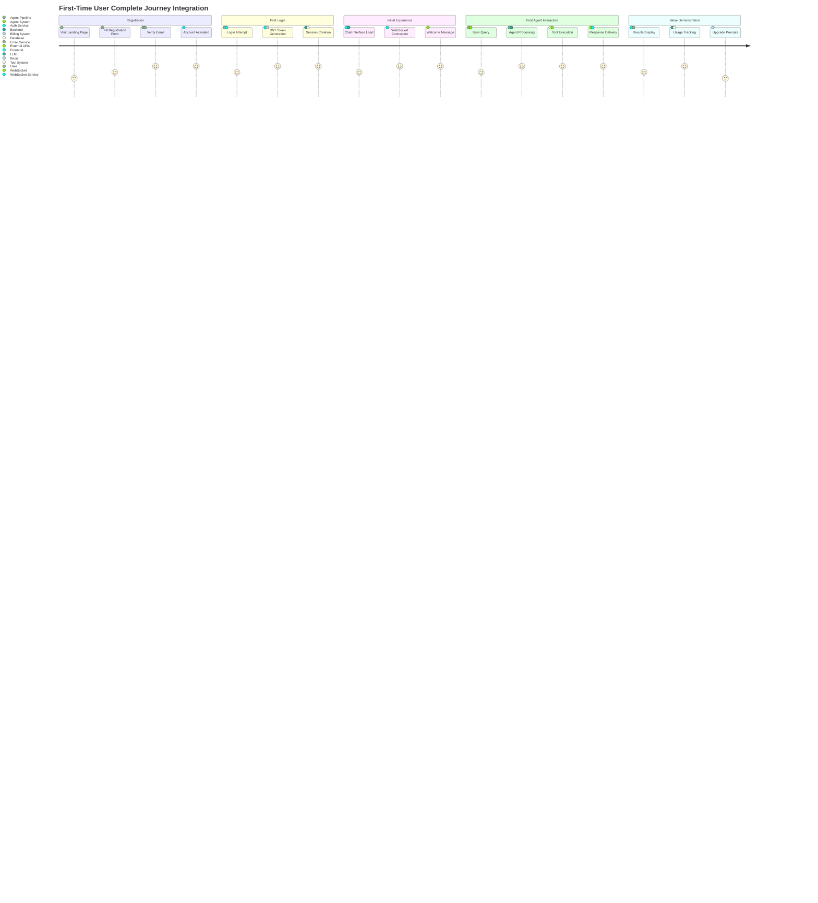
```mermaid
journey
    title First-Time User Complete Journey Integration
    section Registration
      Visit Landing Page: 3: User
      Fill Registration Form: 4: User
      Verify Email: 5: User, Email Service
      Account Activated: 5: Auth Service
    section First Login
      Login Attempt: 4: User, Auth Service
      JWT Token Generation: 5: Auth Service, Redis
      Session Creation: 5: Backend, Database
    section Initial Experience
      Chat Interface Load: 4: Frontend, Backend
      WebSocket Connection: 5: WebSocket Service
      Welcome Message: 5: Agent System
    section First Agent Interaction
      User Query: 4: User, WebSocket
      Agent Processing: 5: Agent Pipeline, LLM
      Tool Execution: 5: Tool System, External APIs
      Response Delivery: 5: WebSocket, Frontend
    section Value Demonstration
      Results Display: 4: Frontend, User
      Usage Tracking: 5: Backend, Database
      Upgrade Prompts: 3: Billing System
```

### Multi-User Concurrent Journey
**Test Files:** `test_concurrent_users_focused.py`

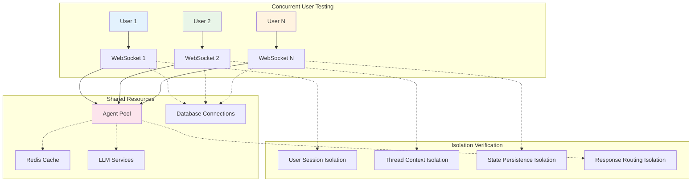
```mermaid
graph TB
    subgraph "Concurrent User Testing"
        A[User 1] --> D[WebSocket 1]
        B[User 2] --> E[WebSocket 2]
        C[User N] --> F[WebSocket N]
    end
    
    subgraph "Shared Resources"
        G[Agent Pool]
        H[Database Connections]
        I[Redis Cache]
        J[LLM Services]
    end
    
    subgraph "Isolation Verification"
        K[User Session Isolation]
        L[Thread Context Isolation]
        M[State Persistence Isolation]
        N[Response Routing Isolation]
    end
    
    D --> G
    E --> G
    F --> G
    
    D -.-> H
    E -.-> H
    F -.-> H
    
    G -.-> I
    G -.-> J
    
    D -.-> K
    E -.-> L
    F -.-> M
    G -.-> N
    
    style A fill:#e3f2fd
    style B fill:#e8f5e8
    style C fill:#fff3e0
    style G fill:#fce4ec
```

---

## Cross-Service Integration Tests

### Service Communication Integration
**Test Files:** Cross-service integration test files

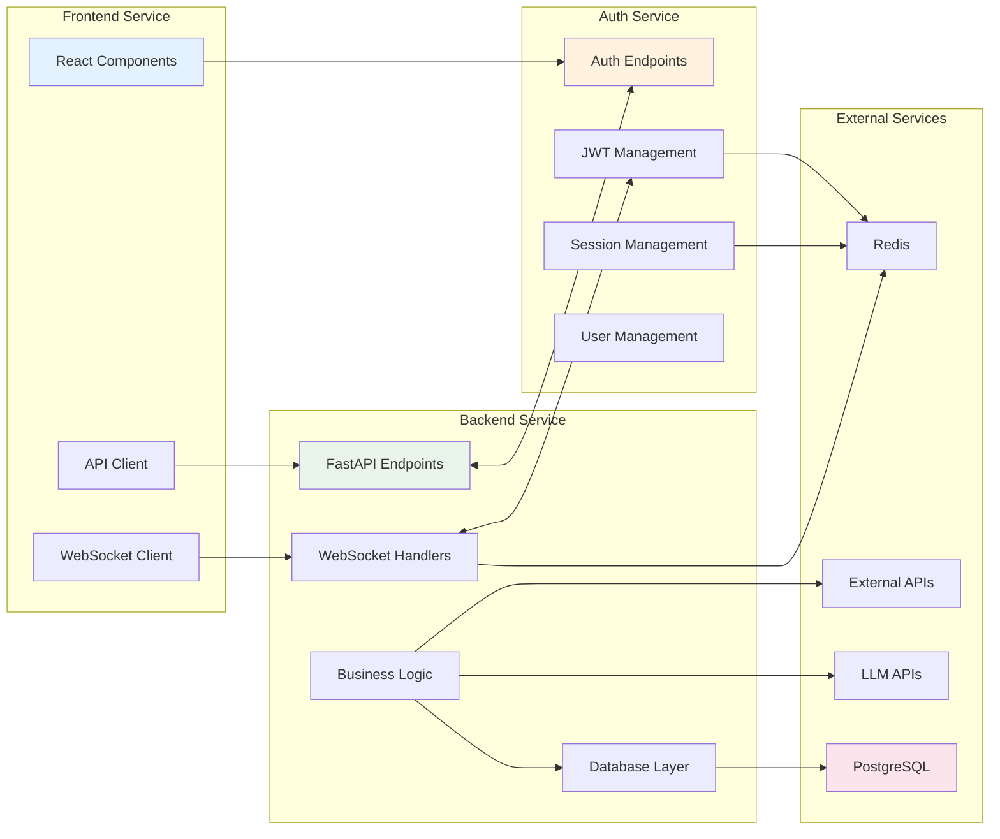
```mermaid
graph LR
    subgraph "Frontend Service"
        A[React Components]
        B[API Client]
        C[WebSocket Client]
    end
    
    subgraph "Backend Service"
        D[FastAPI Endpoints]
        E[WebSocket Handlers]
        F[Business Logic]
        G[Database Layer]
    end
    
    subgraph "Auth Service"
        H[Auth Endpoints]
        I[JWT Management]
        J[Session Management]
        K[User Management]
    end
    
    subgraph "External Services"
        L[PostgreSQL]
        M[Redis]
        N[LLM APIs]
        O[External APIs]
    end
    
    B --> D
    C --> E
    A --> H
    
    F --> G
    G --> L
    E --> M
    I --> M
    J --> M
    
    F --> N
    F --> O
    
    D <--> H
    E <--> I
    
    style A fill:#e3f2fd
    style D fill:#e8f5e8
    style H fill:#fff3e0
    style L fill:#fce4ec
```

### End-to-End Data Flow Integration
**Test Files:** Various E2E integration tests

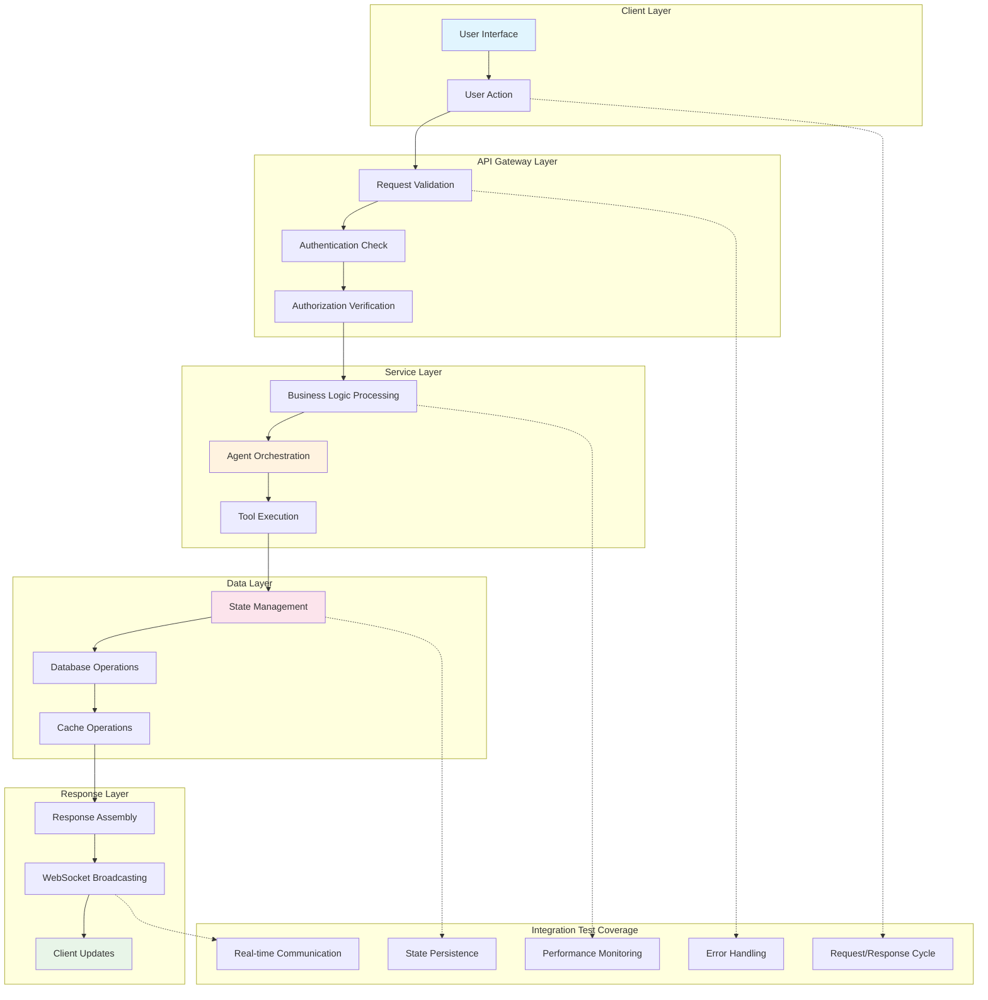
```mermaid
flowchart TD
    subgraph "Client Layer"
        A[User Interface] --> B[User Action]
    end
    
    subgraph "API Gateway Layer"
        B --> C[Request Validation]
        C --> D[Authentication Check]
        D --> E[Authorization Verification]
    end
    
    subgraph "Service Layer"
        E --> F[Business Logic Processing]
        F --> G[Agent Orchestration]
        G --> H[Tool Execution]
    end
    
    subgraph "Data Layer"
        H --> I[State Management]
        I --> J[Database Operations]
        J --> K[Cache Operations]
    end
    
    subgraph "Response Layer"
        K --> L[Response Assembly]
        L --> M[WebSocket Broadcasting]
        M --> N[Client Updates]
    end
    
    subgraph "Integration Test Coverage"
        O[Request/Response Cycle]
        P[State Persistence]
        Q[Real-time Communication]
        R[Error Handling]
        S[Performance Monitoring]
    end
    
    B -.-> O
    I -.-> P
    M -.-> Q
    C -.-> R
    F -.-> S
    
    style A fill:#e1f5fe
    style N fill:#e8f5e8
    style G fill:#fff3e0
    style I fill:#fce4ec
```

---

## Test Architecture Summary

### Integration Test Categories Coverage

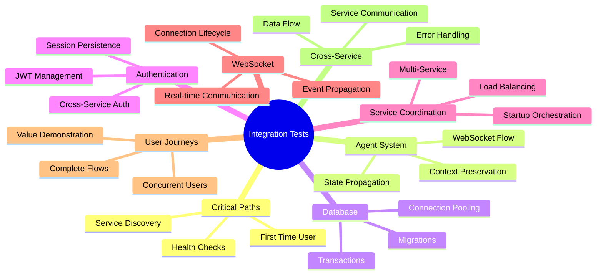
```mermaid
mindmap
  root((Integration Tests))
    Critical Paths
      First Time User
      Health Checks
      Service Discovery
    Agent System
      State Propagation
      WebSocket Flow
      Context Preservation
    Database
      Connection Pooling
      Migrations
      Transactions
    Authentication
      JWT Management
      Cross-Service Auth
      Session Persistence
    Service Coordination
      Multi-Service
      Startup Orchestration
      Load Balancing
    WebSocket
      Connection Lifecycle
      Event Propagation
      Real-time Communication
    User Journeys
      Complete Flows
      Concurrent Users
      Value Demonstration
    Cross-Service
      Service Communication
      Data Flow
      Error Handling
```

### Integration Points Matrix

| Test Category | Backend | Auth | Frontend | Database | Redis | LLM | External APIs |
|---------------|---------|------|----------|----------|-------|-----|---------------|
| Critical Paths | ✓ | ✓ | ✓ | ✓ | ✓ | ✓ | ✓ |
| Agent Integration | ✓ | ✓ | - | ✓ | ✓ | ✓ | ✓ |
| Database Integration | ✓ | ✓ | - | ✓ | ✓ | - | - |
| Auth Integration | ✓ | ✓ | ✓ | ✓ | ✓ | - | ✓ |
| Service Coordination | ✓ | ✓ | ✓ | ✓ | ✓ | - | - |
| WebSocket Integration | ✓ | ✓ | ✓ | ✓ | ✓ | ✓ | - |
| User Journey | ✓ | ✓ | ✓ | ✓ | ✓ | ✓ | ✓ |
| Cross-Service | ✓ | ✓ | ✓ | ✓ | ✓ | ✓ | ✓ |

---

*This document provides visual representations of all integration test flows in the Netra system, enabling developers to understand component interactions, test boundaries, and integration points across the entire platform.*