# Unit Test Architecture Diagrams

This document contains comprehensive Mermaid diagrams for unit tests across the Netra project, organized by component categories and test isolation patterns.

## Overview

Unit tests in Netra focus on testing individual components in isolation with controlled dependencies. They follow strict patterns for mock boundaries, input/output validation, and component scope.

## Table of Contents

1. [Core Utilities Unit Tests](#core-utilities-unit-tests)
2. [Data Models Unit Tests](#data-models-unit-tests)
3. [Business Logic Unit Tests](#business-logic-unit-tests)
4. [Helper Functions Unit Tests](#helper-functions-unit-tests)
5. [Validators Unit Tests](#validators-unit-tests)
6. [Agent Infrastructure Unit Tests](#agent-infrastructure-unit-tests)
7. [Resilience Components Unit Tests](#resilience-components-unit-tests)
8. [Configuration Unit Tests](#configuration-unit-tests)
9. [Database Components Unit Tests](#database-components-unit-tests)
10. [WebSocket Components Unit Tests](#websocket-components-unit-tests)

---

## Core Utilities Unit Tests

### Environment Isolation Testing

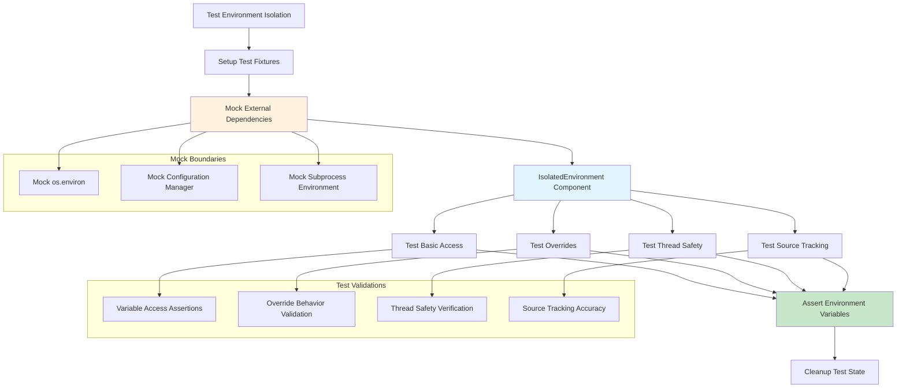

### CORS Configuration Testing

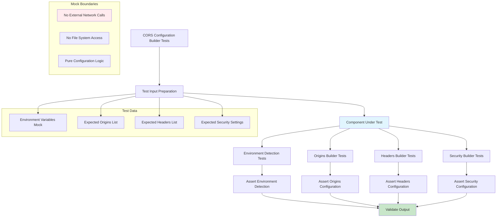

### Database URL Builder Testing

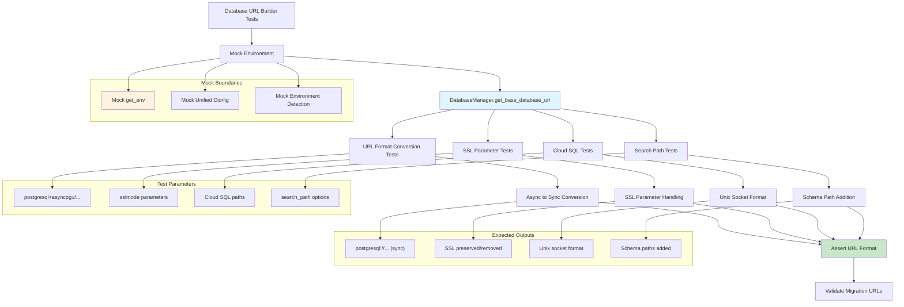

---

## Data Models Unit Tests

### Analytics Service Models

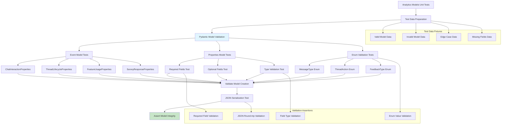

### Schema Validation Testing

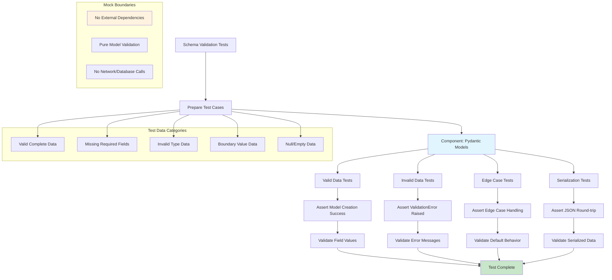

---

## Business Logic Unit Tests

### Agent Execution Logic Testing

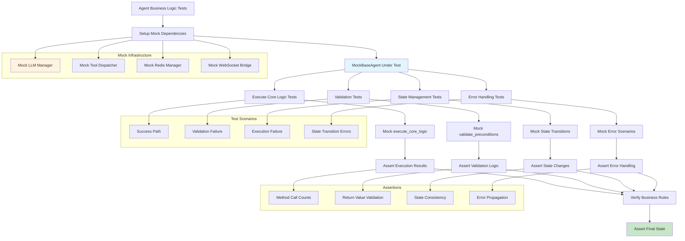

### Circuit Breaker Logic Testing

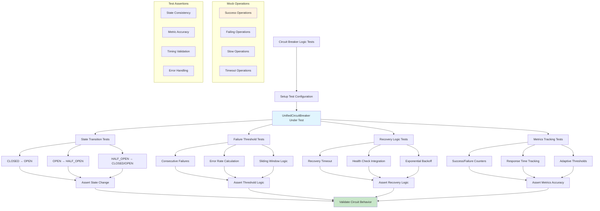

---

## Helper Functions Unit Tests

### Utility Function Testing

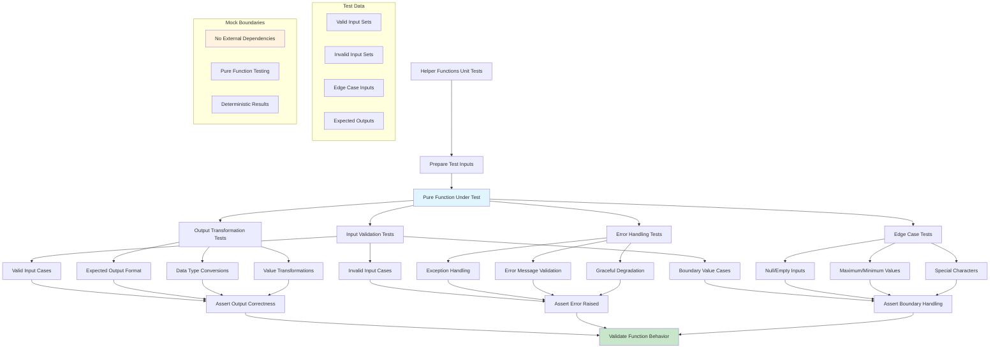

### String/URL Processing Testing

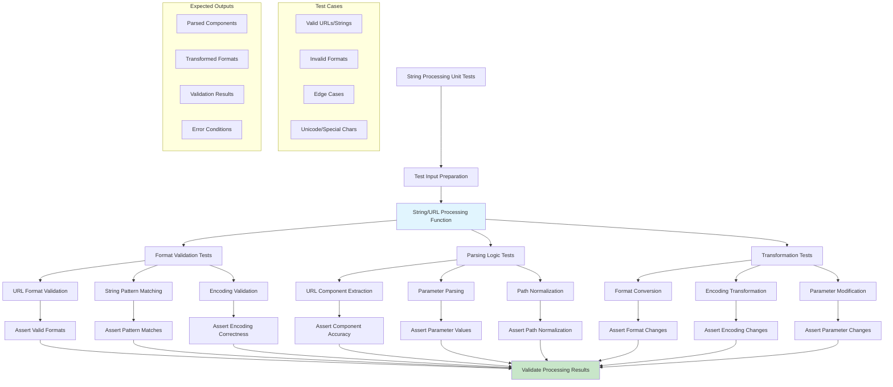

---

## Validators Unit Tests

### Input Validation Testing

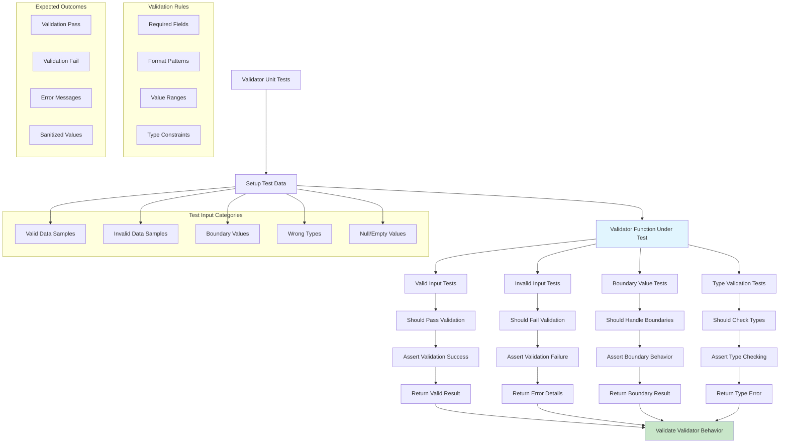

### Data Sanitization Testing

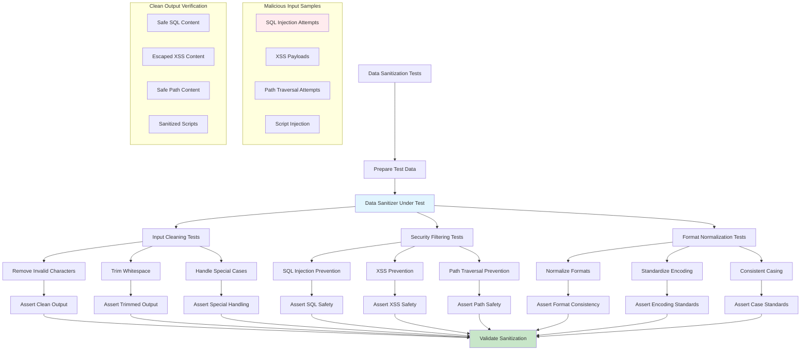

---

## Agent Infrastructure Unit Tests

### BaseAgent Infrastructure Testing

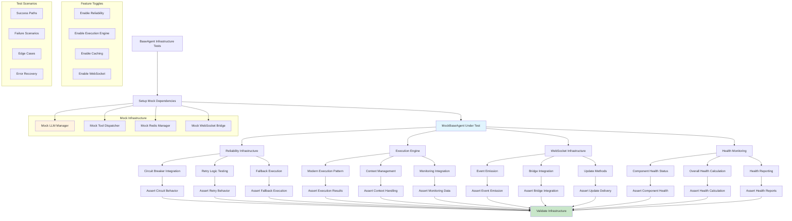

### Agent State Management Testing

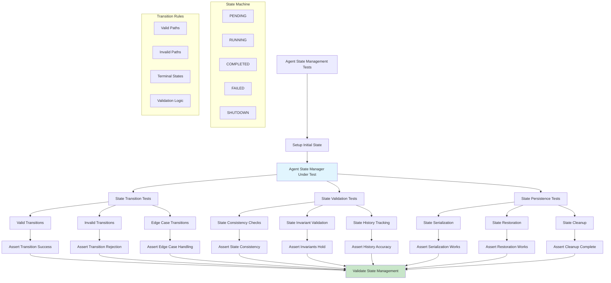

---

## Resilience Components Unit Tests

### Circuit Breaker Component Testing

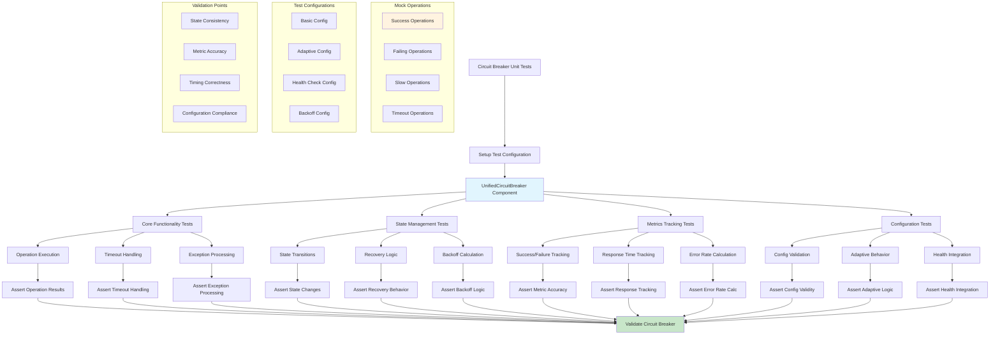

### Retry Handler Testing

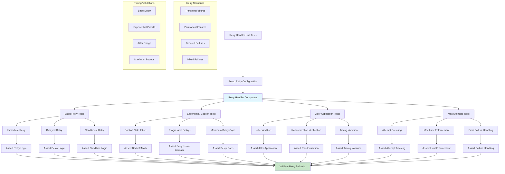

---

## Configuration Unit Tests

### Configuration Manager Testing

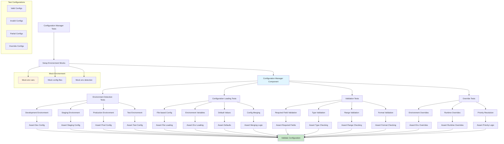

### Service Configuration Testing

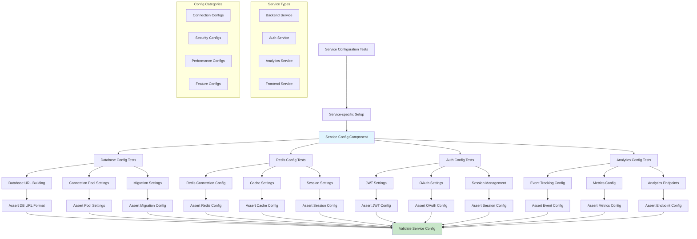

---

## Database Components Unit Tests

### Database Manager Testing

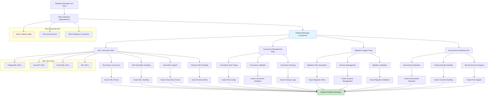

### Data Access Layer Testing

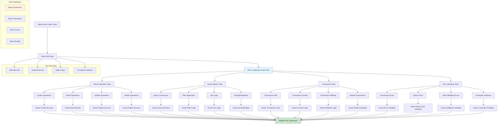

---

## WebSocket Components Unit Tests

### WebSocket Manager Testing

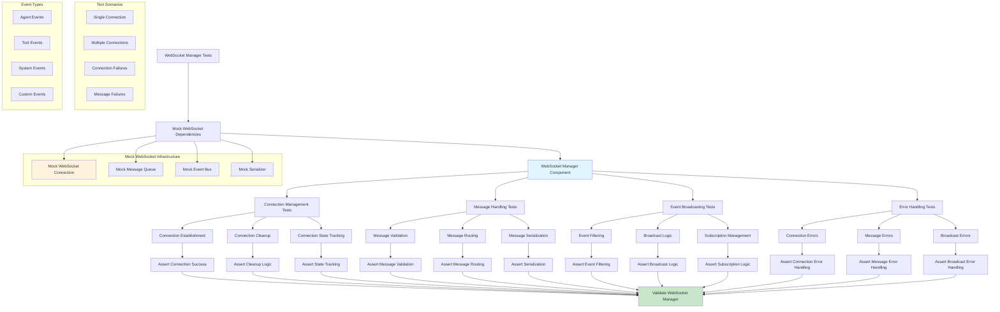

### Agent WebSocket Bridge Testing

```mermaid
flowchart TD
    A[Agent WebSocket Bridge Tests] --> B[Setup Mock Components]
    B --> C[AgentWebSocketBridge Component]
    
    C --> D[Agent Event Tests]
    C --> E[Tool Event Tests]
    C --> F[Progress Event Tests]
    C --> G[Error Event Tests]
    
    D --> H[Agent Started Events]
    D --> I[Agent Thinking Events]
    D --> J[Agent Completed Events]
    
    E --> K[Tool Executing Events]
    E --> L[Tool Completed Events]
    E --> M[Tool Error Events]
    
    F --> N[Progress Updates]
    F --> O[Step Completion]
    F --> P[Percentage Updates]
    
    G --> Q[Error Notifications]
    G --> R[Exception Handling]
    G --> S[Recovery Notifications]
    
    H --> T[Assert Event Structure]
    I --> U[Assert Thinking Format]
    J --> V[Assert Completion Format]
    K --> W[Assert Tool Execution Format]
    L --> X[Assert Tool Completion Format]
    M --> Y[Assert Tool Error Format]
    N --> Z[Assert Progress Format]
    O --> AA[Assert Step Format]
    P --> BB[Assert Percentage Format]
    Q --> CC[Assert Error Format]
    R --> DD[Assert Exception Format]
    S --> EE[Assert Recovery Format]
    
    T --> FF[Validate Event Emission]
    U --> FF
    V --> FF
    W --> FF
    X --> FF
    Y --> FF
    Z --> FF
    AA --> FF
    BB --> FF
    CC --> FF
    DD --> FF
    EE --> FF
    
    subgraph "Mock WebSocket"
        GG[Mock WebSocket Manager]
        HH[Mock Connection]
        II[Mock Event Queue]
    end
    
    subgraph "Event Validation"
        JJ[Event Schema Validation]
        KK[Timestamp Validation]
        LL[Payload Validation]
        MM[Routing Validation]
    end
    
    subgraph "Test Event Data"
        NN[Valid Event Data]
        OO[Invalid Event Data]
        PP[Edge Case Data]
        QQ[Error Scenarios]
    end
    
    B --> GG
    B --> HH
    B --> II
    
    style C fill:#e1f5fe
    style FF fill:#c8e6c9
    style GG fill:#fff3e0
```

---

## Test Execution Flow Summary

```mermaid
flowchart TD
    A[Unit Test Execution] --> B[Test Discovery]
    B --> C[Test Categories]
    
    C --> D[Core Utilities]
    C --> E[Data Models]
    C --> F[Business Logic]
    C --> G[Helpers & Validators]
    C --> H[Infrastructure]
    
    D --> I[Environment, CORS, Database URL]
    E --> J[Analytics Models, Schema Validation]
    F --> K[Agent Logic, Circuit Breaker Logic]
    G --> L[Utility Functions, Validators]
    H --> M[Agent Infrastructure, Resilience, Config, DB, WebSocket]
    
    I --> N[Mock External Dependencies]
    J --> N
    K --> N
    L --> N
    M --> N
    
    N --> O[Execute Individual Tests]
    O --> P[Assert Expected Behavior]
    P --> Q[Validate Component Isolation]
    Q --> R[Report Test Results]
    
    subgraph "Mock Boundaries"
        S[No Network Calls]
        T[No Database Connections]
        U[No File System Access]
        V[No External Services]
    end
    
    subgraph "Test Isolation"
        W[Component Under Test]
        X[Controlled Dependencies]
        Y[Predictable Inputs]
        Z[Validated Outputs]
    end
    
    subgraph "Validation Points"
        AA[Input/Output Correctness]
        BB[Error Handling]
        CC[Edge Case Behavior]
        DD[Performance Characteristics]
    end
    
    N --> S
    N --> T
    N --> U
    N --> V
    
    O --> W
    O --> X
    O --> Y
    O --> Z
    
    P --> AA
    P --> BB
    P --> CC
    P --> DD
    
    style O fill:#e1f5fe
    style R fill:#c8e6c9
    style S fill:#fff3e0
```

## Test Categories Summary

| Category | Components Tested | Mock Boundaries | Key Validations |
|----------|------------------|-----------------|-----------------|
| **Core Utilities** | Environment isolation, CORS config, Database URL builders | External env vars, config files, network calls | Variable access, format conversion, configuration correctness |
| **Data Models** | Pydantic models, schema validation, serialization | Database connections, external APIs | Field validation, type checking, JSON round-trip |
| **Business Logic** | Agent execution, circuit breaker logic, state management | External dependencies, infrastructure components | Business rule enforcement, state consistency, error handling |
| **Helpers & Validators** | Utility functions, input validators, data sanitizers | File system, network, external services | Input/output correctness, validation rules, security filtering |
| **Infrastructure** | Agent base classes, resilience components, configuration managers, database managers, WebSocket components | External services, network calls, database connections, WebSocket connections | Component integration, error handling, configuration loading, event emission |

## Key Testing Principles

1. **Isolation**: Each unit test focuses on a single component with all dependencies mocked
2. **Predictability**: Tests use controlled inputs and validate expected outputs
3. **Coverage**: Tests cover happy paths, error conditions, and edge cases
4. **Performance**: Tests validate performance characteristics where relevant
5. **Security**: Tests validate security measures like input sanitization and injection prevention
6. **Maintainability**: Tests are organized by component and follow consistent patterns

This comprehensive unit test architecture ensures reliable, maintainable, and thoroughly validated components across the Netra platform.