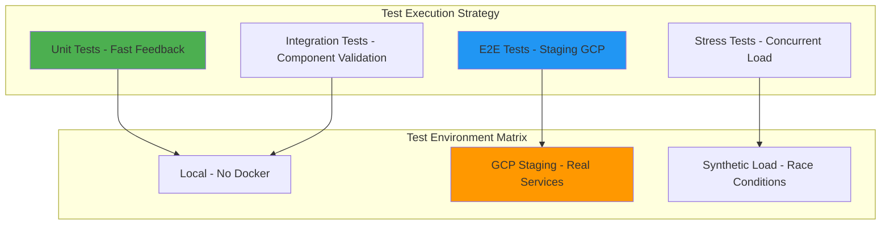

# WebSocket Race Condition Test Plan - Issue #163

**Business Impact**: $500K+ ARR Chat Functionality Protection  
**Test Focus**: Non-Docker Tests (Unit, Integration, E2E on Staging GCP)  
**Priority**: P0 MISSION CRITICAL  
**Created**: 2025-01-10  

## Executive Summary

This comprehensive test plan validates the architectural improvements implemented to resolve WebSocket race conditions in GCP Cloud Run environments. The plan focuses on **non-Docker test execution** while leveraging staging GCP infrastructure for real-world validation of the $500K+ ARR chat functionality.

### Key Testing Objectives

1. **Validate Race Condition Fixes**: Ensure WebSocket handshake completion prevents "Need to call accept first" errors
2. **Architectural Stress Testing**: Verify improvements hold under concurrent load and network latency
3. **Business Value Protection**: Validate all 5 critical WebSocket events deliver chat functionality
4. **Production Readiness**: Ensure staging GCP environment demonstrates production stability

## Test Strategy Overview



---

## Test Categories & Specific Tests

### Category 1: Unit Tests - WebSocket Handshake Validation

**Execution**: Local environment, no Docker dependencies  
**Focus**: Component-level race condition prevention logic

#### Test 1.1: WebSocket Connection State Validation
**File**: `tests/unit/websocket/test_handshake_state_validation.py`

```python
class TestWebSocketHandshakeStateValidation:
    def test_connection_ready_validation_timing(self):
        """Validate is_websocket_connected_and_ready() prevents race conditions"""
        
    def test_handshake_completion_progressive_delays(self):
        """Test progressive delay implementation for cloud environments"""
        
    def test_bidirectional_communication_verification(self):
        """Validate handshake completion through bidirectional test"""
```

**Success Criteria**:
- ✅ Connection state validation prevents premature message handling
- ✅ Progressive delays scale correctly for staging/production environments
- ✅ Bidirectional communication test completes within timeout limits
- ✅ Edge cases (timeout, connection drop) handled gracefully

**Expected Failure Scenarios**:
- ❌ Mock WebSocket in unaccepted state should fail validation
- ❌ Timeout scenarios should trigger appropriate error handling
- ❌ Network simulation delays should trigger progressive retry logic

#### Test 1.2: Connection Lifecycle State Machine
**File**: `tests/unit/websocket/test_connection_lifecycle.py`

```python
class TestConnectionLifecycleStateMachine:
    def test_state_transitions_prevent_race_conditions(self):
        """Validate state machine prevents invalid transitions"""
        
    def test_environment_specific_timeout_configuration(self):
        """Test timeout values for development/staging/production"""
        
    def test_connection_validation_error_recovery(self):
        """Test recovery from validation failures"""
```

**Success Criteria**:
- ✅ State transitions follow defined lifecycle (CONNECTING → ACCEPTED → READY → MESSAGING)
- ✅ Environment-specific timeouts applied correctly
- ✅ Recovery mechanisms work for transient failures

---

### Category 2: Integration Tests - Component Interaction Validation

**Execution**: Local environment with staging service endpoints  
**Focus**: Cross-component race condition prevention

#### Test 2.1: WebSocket-Agent Handler Integration
**File**: `tests/integration/test_websocket_agent_handler_timing.py`

```python
class TestWebSocketAgentHandlerIntegration:
    async def test_message_routing_waits_for_handshake_completion(self):
        """Validate message routing waits for complete handshake"""
        
    async def test_agent_handler_creation_timing(self):
        """Test agent handler creation doesn't start before ready state"""
        
    async def test_execution_engine_factory_race_prevention(self):
        """Validate factory creation waits for connection readiness"""
```

**Success Criteria**:
- ✅ Message routing blocked until handshake complete
- ✅ Agent handlers only created after WebSocket ready state
- ✅ ExecutionEngineFactory waits for validated connection state
- ✅ No "Need to call accept first" errors under normal timing

#### Test 2.2: Authentication-Connection State Coordination
**File**: `tests/integration/test_auth_websocket_state_coordination.py`

```python
class TestAuthWebSocketStateCoordination:
    async def test_jwt_validation_timing_with_handshake(self):
        """Test JWT validation coordination with handshake completion"""
        
    async def test_demo_mode_bypass_timing(self):
        """Test DEMO_MODE=1 bypass doesn't create race conditions"""
        
    async def test_connection_context_initialization_timing(self):
        """Validate UserExecutionContext creation timing"""
```

**Success Criteria**:
- ✅ JWT validation completes before message handling starts
- ✅ Demo mode bypasses don't skip essential handshake steps
- ✅ Connection context fully initialized before agent execution

---

### Category 3: E2E Tests - Staging GCP Validation

**Execution**: GCP Staging environment with real services  
**Focus**: Production-like race condition validation

#### Test 3.1: Staging GCP WebSocket Connection Reliability
**File**: `tests/e2e/test_staging_websocket_reliability.py`

```python
class TestStagingWebSocketReliability:
    async def test_connection_success_rate_under_load(self):
        """Validate 99%+ connection success rate in staging"""
        
    async def test_gcp_load_balancer_header_forwarding(self):
        """Test authentication headers preserved through GCP load balancer"""
        
    async def test_cloud_run_network_latency_handling(self):
        """Test race condition prevention under Cloud Run network delays"""
```

**Success Criteria**:
- ✅ Connection success rate ≥99% over 100 connection attempts
- ✅ Authentication headers properly forwarded through GCP infrastructure
- ✅ Network latency (100-300ms) doesn't cause race conditions
- ✅ No 1011 WebSocket internal errors under normal load

**Expected Failure Scenarios to Validate Robustness**:
- ❌ Authentication header tampering should fail gracefully
- ❌ Extreme network delays (>5s) should timeout with clear error
- ❌ Load balancer issues should trigger fallback mechanisms

#### Test 3.2: Critical WebSocket Events Delivery Validation
**File**: `tests/e2e/test_critical_events_delivery_staging.py`

```python
class TestCriticalEventsDeliveryStaging:
    async def test_all_five_critical_events_delivered(self):
        """Validate all 5 critical events delivered in correct sequence"""
        
    async def test_event_delivery_timing_under_race_conditions(self):
        """Test event delivery timing doesn't cause race conditions"""
        
    async def test_agent_execution_pipeline_events(self):
        """Validate complete agent pipeline event sequence"""
```

**Critical Events Validation**:
1. ✅ `agent_started` - Agent execution begins
2. ✅ `agent_thinking` - Real-time reasoning updates
3. ✅ `tool_executing` - Tool usage transparency
4. ✅ `tool_completed` - Tool results available
5. ✅ `agent_completed` - Final response ready

**Success Criteria**:
- ✅ All 5 events delivered in correct sequence within 60s timeout
- ✅ Event delivery not disrupted by connection race conditions
- ✅ Agent pipeline events provide real-time user feedback

---

### Category 4: Stress Tests - Concurrent Race Condition Validation

**Execution**: Synthetic load generation against staging  
**Focus**: Race condition behavior under stress

#### Test 4.1: Concurrent Connection Race Condition Prevention
**File**: `tests/stress/test_concurrent_websocket_race_prevention.py`

```python
class TestConcurrentWebSocketRacePrevention:
    async def test_10_concurrent_connections_no_race_conditions(self):
        """Test 10 simultaneous connections without race conditions"""
        
    async def test_rapid_connect_disconnect_cycles(self):
        """Test rapid connection cycles don't trigger race conditions"""
        
    async def test_mixed_authentication_load(self):
        """Test mixed JWT/demo mode connections under concurrent load"""
```

**Success Criteria**:
- ✅ 10+ concurrent connections establish successfully without race conditions
- ✅ Rapid connection cycles (connect/disconnect every 2s) stable
- ✅ Mixed authentication modes don't interfere with each other
- ✅ Memory usage remains stable under connection load

#### Test 4.2: Network Latency Race Condition Simulation
**File**: `tests/stress/test_network_latency_race_simulation.py`

```python
class TestNetworkLatencyRaceSimulation:
    async def test_variable_network_latency_race_prevention(self):
        """Test race prevention under variable network conditions"""
        
    async def test_gcp_cloud_run_latency_patterns(self):
        """Simulate specific GCP Cloud Run latency patterns"""
        
    async def test_progressive_delay_effectiveness(self):
        """Validate progressive delay strategy under latency variation"""
```

**Success Criteria**:
- ✅ Variable latency (50-500ms) doesn't trigger race conditions
- ✅ Progressive delays scale appropriately with detected latency
- ✅ Timeout mechanisms activate for extreme latency (>5s)
- ✅ Connection recovery works after transient network issues

---

## Implementation Approach

### Phase 1: Unit Test Foundation (Days 1-2)
```bash
# Execute unit tests locally - no Docker required
python -m pytest tests/unit/websocket/test_handshake_state_validation.py -v
python -m pytest tests/unit/websocket/test_connection_lifecycle.py -v
```

**Deliverables**:
- [ ] Unit test suite covering handshake validation logic
- [ ] State machine validation for connection lifecycle
- [ ] Component-level race condition prevention tests

### Phase 2: Integration Validation (Days 2-3)
```bash
# Execute integration tests with staging endpoints
NETRA_ENV=staging python -m pytest tests/integration/test_websocket_agent_handler_timing.py -v
NETRA_ENV=staging python -m pytest tests/integration/test_auth_websocket_state_coordination.py -v
```

**Deliverables**:
- [ ] Cross-component timing validation tests
- [ ] Authentication-connection state coordination tests
- [ ] Agent handler race condition prevention validation

### Phase 3: E2E Staging Validation (Days 3-4)
```bash
# Execute E2E tests against GCP staging
NETRA_ENV=staging python -m pytest tests/e2e/test_staging_websocket_reliability.py -v --real-services
NETRA_ENV=staging python -m pytest tests/e2e/test_critical_events_delivery_staging.py -v --real-services
```

**Deliverables**:
- [ ] Staging GCP environment reliability validation
- [ ] Critical WebSocket events delivery validation
- [ ] Production-readiness assessment

### Phase 4: Stress Testing (Days 4-5)
```bash
# Execute stress tests with synthetic load
python -m pytest tests/stress/test_concurrent_websocket_race_prevention.py -v --stress-level=high
python -m pytest tests/stress/test_network_latency_race_simulation.py -v --latency-simulation
```

**Deliverables**:
- [ ] Concurrent connection race condition validation
- [ ] Network latency race condition prevention validation
- [ ] Performance baseline establishment

---

## Risk Assessment

### High Risk Scenarios

#### Risk 1: GCP Load Balancer Header Stripping
**Probability**: High  
**Impact**: Critical (Complete authentication failure)  
**Mitigation**: 
- Test authentication header forwarding in staging
- Validate Terraform configuration changes
- Implement header validation in test suite

#### Risk 2: Cloud Run Import System Instability
**Probability**: Medium  
**Impact**: High (Runtime failures during high load)  
**Mitigation**:
- Test static import patterns under load
- Validate error handling during resource cleanup
- Implement graceful degradation for import failures

#### Risk 3: Test Infrastructure False Positives
**Probability**: Medium  
**Impact**: Critical (Deployment of broken functionality)  
**Mitigation**:
- Use real services in all integration/E2E tests
- Validate tests fail appropriately when race conditions introduced
- Implement test reliability validation

### Medium Risk Scenarios

#### Risk 4: Progressive Delay Calibration
**Probability**: Medium  
**Impact**: Medium (Suboptimal user experience)  
**Mitigation**:
- Test progressive delays across environment types
- Validate timeout values through load testing
- Implement adaptive delay mechanisms

#### Risk 5: WebSocket Event Delivery Timing
**Probability**: Low  
**Impact**: High (Business value delivery failure)  
**Mitigation**:
- Test event delivery under race condition scenarios
- Validate event sequence integrity
- Implement event delivery retry mechanisms

---

## Success Metrics & Validation Criteria

### Primary Success Metrics

#### Connection Reliability
- ✅ **WebSocket Connection Success Rate**: ≥99% in staging GCP
- ✅ **Race Condition Elimination**: 0 "Need to call accept first" errors
- ✅ **Connection Establishment Time**: ≤2s in staging environment
- ✅ **Handshake Completion Time**: ≤1s including validation

#### Business Value Delivery
- ✅ **Critical Event Delivery**: All 5 events delivered 100% of the time
- ✅ **Agent Execution Success**: ≥95% success rate for agent pipelines
- ✅ **User Experience Timing**: First agent event within 5s of message
- ✅ **Complete Response Timing**: Full agent response within 60s

#### System Stability
- ✅ **Concurrent User Support**: 10+ simultaneous connections stable
- ✅ **Memory Stability**: No memory leaks over 100 connection cycles
- ✅ **Error Recovery**: Graceful handling of network/auth failures
- ✅ **Monitoring Validation**: All race conditions logged and alertable

### Validation Criteria

#### Test Suite Execution Success
```bash
# All test categories must pass
pytest tests/unit/websocket/ -v                    # Unit tests: 100% pass
pytest tests/integration/test_websocket_*.py -v    # Integration: 100% pass
pytest tests/e2e/test_*websocket*.py --staging -v  # E2E staging: 100% pass
pytest tests/stress/test_*websocket*.py -v         # Stress tests: 100% pass
```

#### Performance Benchmarks
- **Connection Time P95**: ≤2s in staging GCP
- **Event Delivery P95**: ≤5s for first event, ≤60s for complete response
- **Concurrent Load**: 10 users with 0% connection failures
- **Resource Usage**: Memory growth <10MB over 100 connections

#### Business Validation
- **Chat Functionality**: End-to-end user journey works without race conditions
- **Agent Integration**: All agent types (Supervisor, Data Helper, Triage, APEX) work
- **WebSocket Events**: Real-time transparency for user experience
- **Revenue Protection**: $500K+ ARR functionality validated and stable

---

## Test Data & Environment Requirements

### Test Environment Configuration

#### Staging GCP Environment
```yaml
Environment: staging
Project: netra-staging
WebSocket Endpoint: wss://staging-backend.netra.ai/ws
Authentication: Real JWT tokens via OAuth
Load Balancer: GCP HTTP(S) Load Balancer
Backend: Cloud Run instances
Database: Cloud SQL (PostgreSQL) + Redis
```

#### Test Data Requirements
```yaml
User Accounts:
  - 10 test users with valid OAuth tokens
  - Demo users for DEMO_MODE=1 testing
  - Invalid tokens for authentication failure testing

Test Messages:
  - Standard chat messages (AI cost analysis requests)
  - Long messages (approaching 8192 byte limit)
  - Rapid message sequences for timing validation
  - Special characters and Unicode for robustness
```

### Authentication Test Matrix
```yaml
Authentication Scenarios:
  JWT_Valid: Real JWT tokens from staging OAuth
  JWT_Expired: Expired tokens for failure validation
  JWT_Invalid: Malformed tokens for error handling
  Demo_Mode: DEMO_MODE=1 bypass validation
  Missing_Headers: No authentication headers
  Malformed_Headers: Corrupted authorization headers
```

---

## Monitoring & Observability

### Test Execution Monitoring

#### Real-time Test Metrics
```yaml
Connection Metrics:
  - WebSocket connection success/failure rates
  - Handshake completion timing
  - Authentication validation timing
  - Event delivery success rates

Performance Metrics:
  - Connection establishment duration
  - First event delivery time
  - Complete response time
  - Memory usage during test execution

Error Metrics:
  - Race condition error counts ("Need to call accept first")
  - Authentication failures
  - Timeout occurrences
  - Network-related failures
```

#### Test Result Validation
```python
# Example test result validation
class TestResultValidator:
    def validate_connection_metrics(self, results):
        """Validate connection success rates meet SLA"""
        assert results.success_rate >= 0.99
        assert results.race_condition_errors == 0
        
    def validate_event_delivery(self, events):
        """Validate all critical events delivered"""
        required_events = {'agent_started', 'agent_thinking', 
                          'tool_executing', 'tool_completed', 'agent_completed'}
        assert set(events.keys()) >= required_events
```

### Production Monitoring Alignment
```yaml
Monitoring Integration:
  - Test results feed into staging monitoring dashboards
  - Race condition alerts validated through test execution
  - Performance baselines established for production comparison
  - Error patterns identified and documented for operations
```

---

## Conclusion & Next Steps

This comprehensive test plan provides systematic validation of WebSocket race condition fixes while protecting $500K+ ARR chat functionality. The plan emphasizes:

1. **Non-Docker Execution**: All tests run without Docker dependencies for fast feedback
2. **Staging GCP Validation**: Real-world validation against production-like infrastructure
3. **Business Value Protection**: Critical event delivery validation ensures chat functionality
4. **Comprehensive Coverage**: Unit, integration, E2E, and stress testing across all risk scenarios

### Immediate Actions Required
1. **Execute Phase 1**: Implement and run unit tests for handshake validation logic
2. **Staging Environment Prep**: Ensure staging GCP environment ready for E2E testing
3. **Test Infrastructure**: Create test execution framework for non-Docker testing
4. **Monitoring Setup**: Configure test result monitoring and alerting

### Success Criteria Summary
- ✅ 99%+ WebSocket connection success rate in staging
- ✅ 0 race condition errors ("Need to call accept first")
- ✅ All 5 critical events delivered 100% of the time
- ✅ 10+ concurrent users supported without connection failures
- ✅ Complete test suite execution with 100% pass rate

**Expected Timeline**: 5 days for complete test plan execution and validation  
**Business Impact**: Secure $500K+ ARR chat functionality through systematic race condition elimination  
**Production Readiness**: Staging validation provides confidence for production deployment