# WebSocket Agent Bridge Architecture Documentation

## Executive Summary

The `AgentWebSocketBridge` serves as the **Single Source of Truth (SSOT)** for WebSocket-Agent service integration, providing idempotent initialization, health monitoring, and recovery mechanisms. It acts as the critical bridge enabling 90% of chat functionality value by ensuring reliable real-time communication between agents and users.

## Core Architecture

### 1. Singleton Pattern & Thread Safety

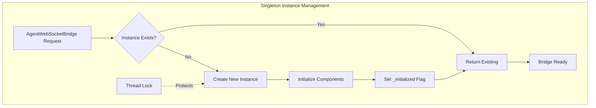

### 2. Initialization Flow

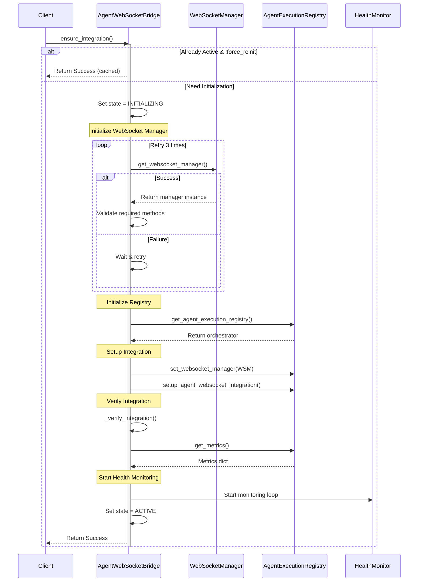

### 3. Component Dependencies

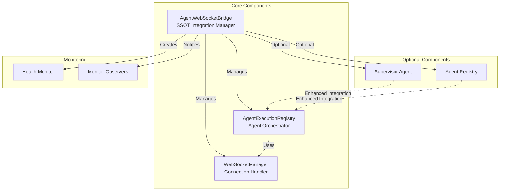

### 4. State Machine

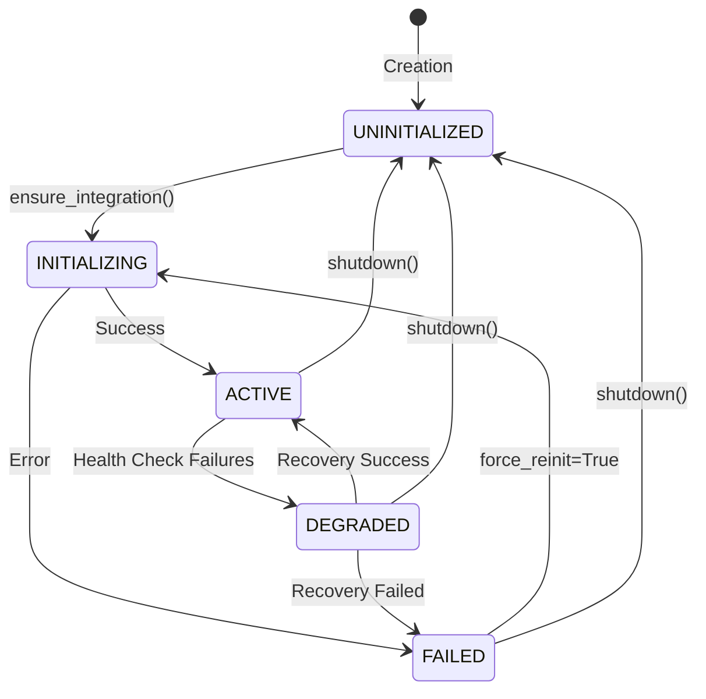

### 5. Health Monitoring Flow

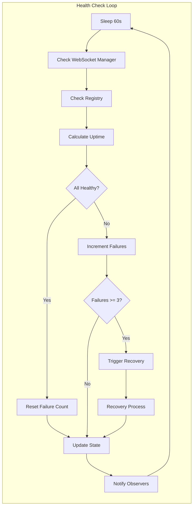

### 6. WebSocket Event Emission Flow

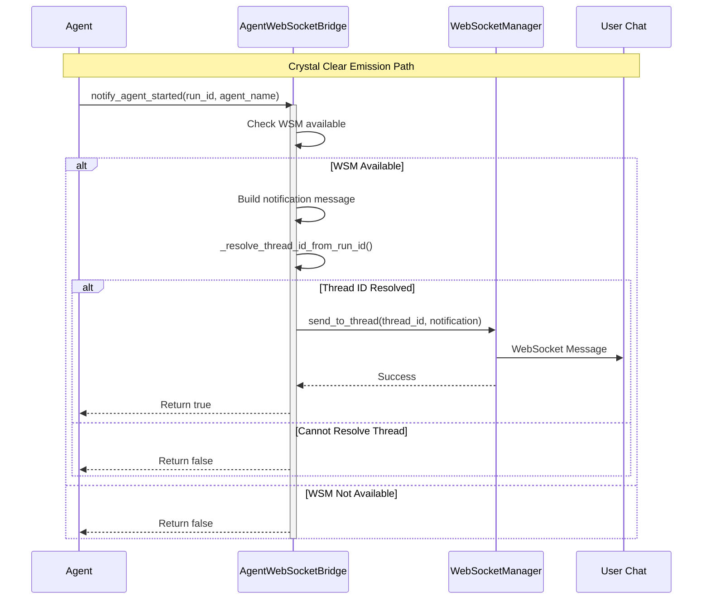

### 7. Recovery Mechanism

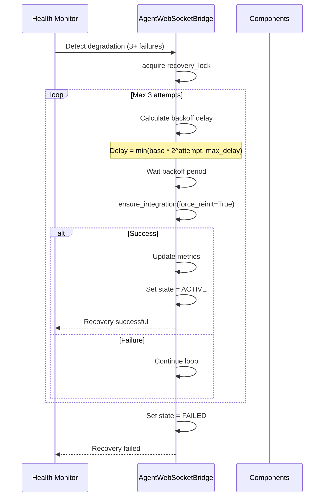

## Integration Points & Expectations

### 1. WebSocket Manager Requirements

The bridge expects the WebSocket Manager to provide:
- `connections` attribute - Active connection tracking
- `send_to_thread(thread_id, message)` method - Message delivery
- Thread-safe operations
- Idempotent message sending

### 2. Agent Execution Registry Requirements

The registry must provide:
- `set_websocket_manager(manager)` - Accept WebSocket manager
- `setup_agent_websocket_integration(supervisor, registry)` - Enhanced setup
- `get_metrics()` - Return dict of operational metrics
- `get_thread_id_for_run(run_id)` - Thread resolution (optional)
- `shutdown()` - Clean shutdown

### 3. Notification Interface

All notifications follow this pattern:

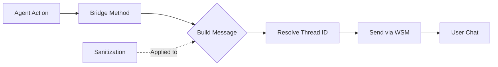

Critical events that MUST be sent:
1. **agent_started** - User sees AI began processing
2. **agent_thinking** - Real-time reasoning visibility  
3. **tool_executing** - Tool usage transparency
4. **tool_completed** - Tool results display
5. **agent_completed** - Response ready notification

### 4. Monitor Observer Pattern

```mermaid
graph TD
    subgraph "Observer Registration"
        A[Monitor] -->|register_monitor_observer| B[Bridge]
        B --> C[Add to observers list]
    end
    
    subgraph "Health Change Notification"
        D[Health Status Change] --> E[Bridge]
        E --> F{Observers Registered?}
        F -->|Yes| G[Notify Each Observer]
        F -->|No| H[Skip Notification]
        
        G --> I[Observer.on_component_health_change()]
    end
    
    subgraph "Independence"
        J[Bridge Operations] -.->|Continue regardless| K[Observer Failures]
    end
```

## Initialization Scenarios

### Scenario 1: Cold Start

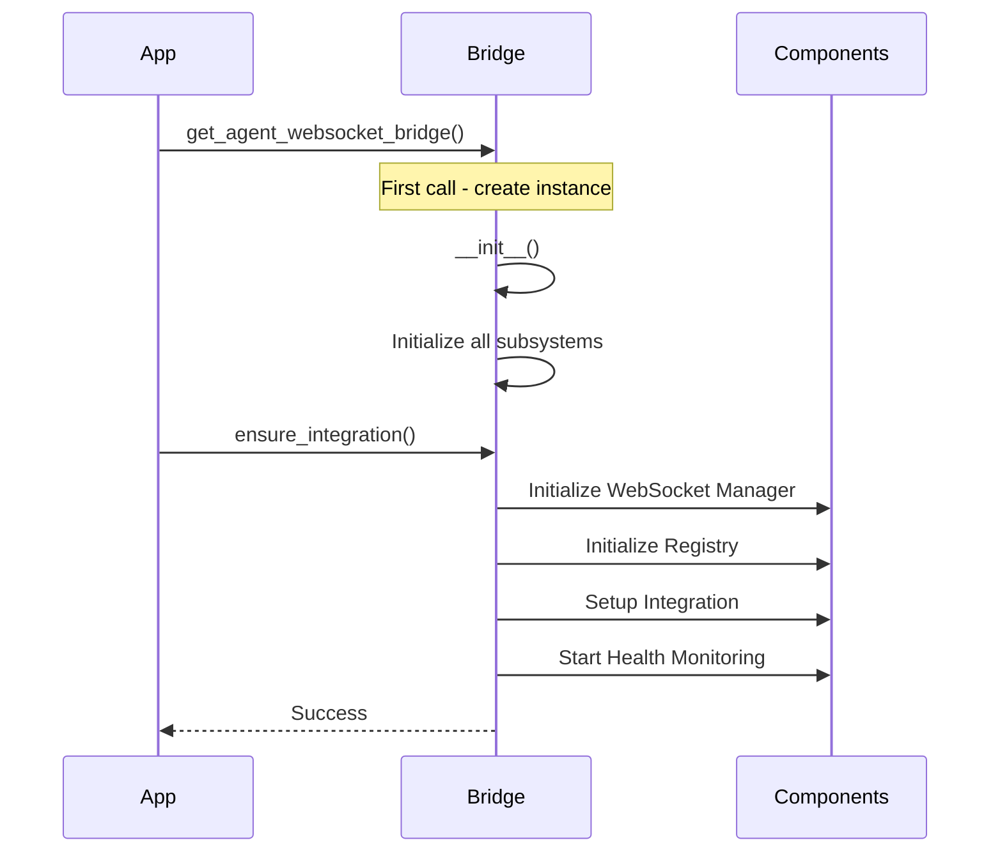

### Scenario 2: Warm Start (Already Initialized)

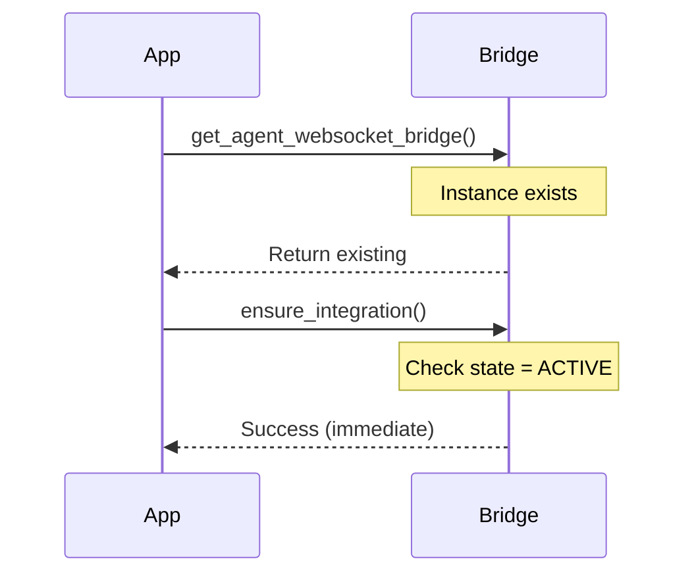

### Scenario 3: Recovery After Failure

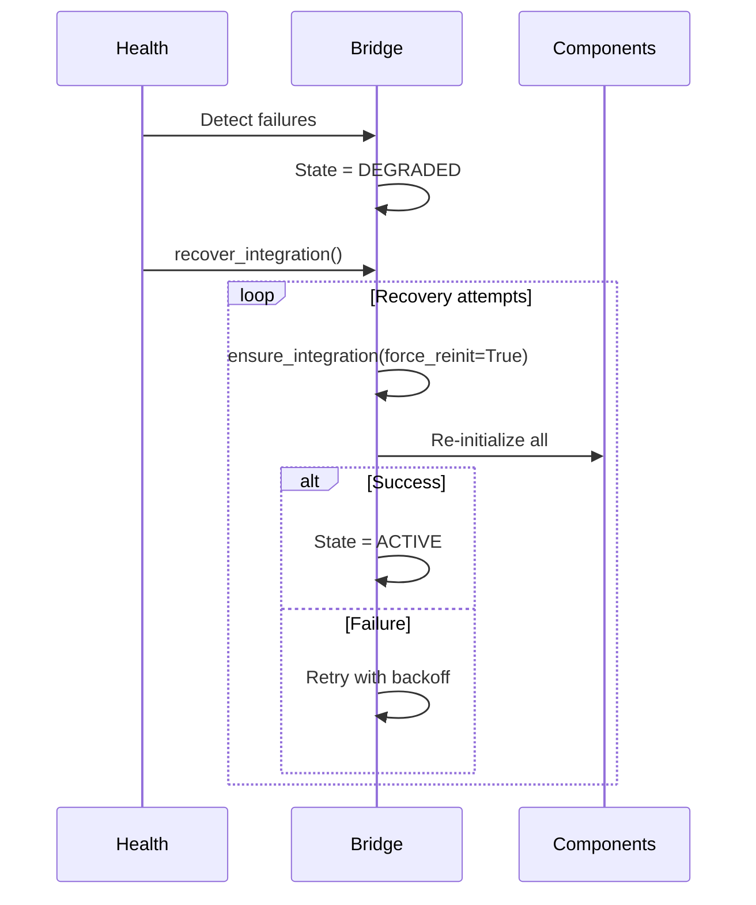

## Configuration & Timeouts

```yaml
IntegrationConfig:
  initialization_timeout_s: 30      # Max time for initialization
  health_check_interval_s: 60       # Health check frequency
  recovery_max_attempts: 3          # Max recovery tries
  recovery_base_delay_s: 1.0        # Initial retry delay
  recovery_max_delay_s: 30.0        # Max retry delay
  integration_verification_timeout_s: 10  # Verification timeout
```

## Metrics & Monitoring

### Key Metrics Tracked

1. **Initialization Metrics**
   - total_initializations
   - successful_initializations
   - failed_initializations
   - success_rate

2. **Recovery Metrics**
   - recovery_attempts
   - successful_recoveries
   - recovery_success_rate

3. **Health Metrics**
   - health_checks_performed
   - consecutive_failures
   - uptime_seconds
   - total_recoveries

4. **Component Availability**
   - websocket_manager_available
   - orchestrator_available
   - supervisor_available
   - registry_available

## Error Handling & Resilience

### Graceful Degradation

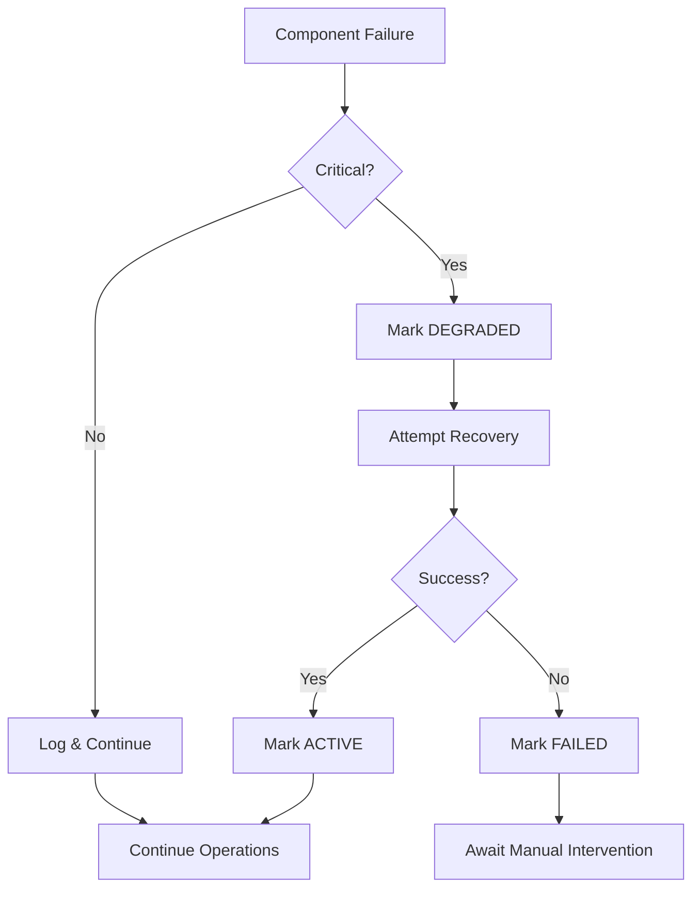

### Sanitization Pipeline

All user-facing data passes through sanitization:

1. **Parameters**: Redact sensitive keys (password, token, etc.)
2. **Results**: Truncate large data structures
3. **Errors**: Remove file paths and internal details
4. **Progress**: Filter to allowed keys only
5. **Custom Data**: Apply size limits

## Business Value & Impact

### Critical Business Functions Enabled

1. **Real-time User Feedback** (90% of chat value)
   - Immediate agent start confirmation
   - Progress visibility during processing
   - Tool execution transparency
   - Clear completion signals

2. **Trust Building**
   - Visible AI reasoning process
   - Error explanations with recovery guidance
   - Consistent event delivery

3. **System Reliability**
   - Automatic recovery from failures
   - Health monitoring and alerting
   - Graceful degradation
   - Zero-downtime recovery

### Performance Characteristics

- **Initialization**: < 100ms typical, 30s timeout
- **Health Checks**: Every 60 seconds
- **Recovery**: 3 attempts with exponential backoff
- **Event Delivery**: Immediate with retry for critical events
- **Observer Notifications**: Async, non-blocking

## Thread ID Resolution Strategy

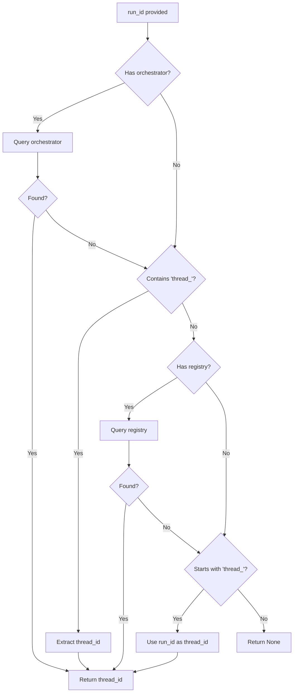

## Summary

The AgentWebSocketBridge provides:

1. **Single Source of Truth** - One place for all WebSocket-Agent integration
2. **Idempotent Operations** - Safe to call multiple times
3. **Health Monitoring** - Continuous health checks with recovery
4. **Guaranteed Delivery** - Critical events with retry logic
5. **Observer Pattern** - External monitoring without coupling
6. **Graceful Degradation** - Continues operating despite failures
7. **Business Value** - Enables 90% of chat functionality value

The bridge ensures reliable, real-time communication between agents and users, with comprehensive error handling, monitoring, and recovery mechanisms to maintain system stability and user experience.