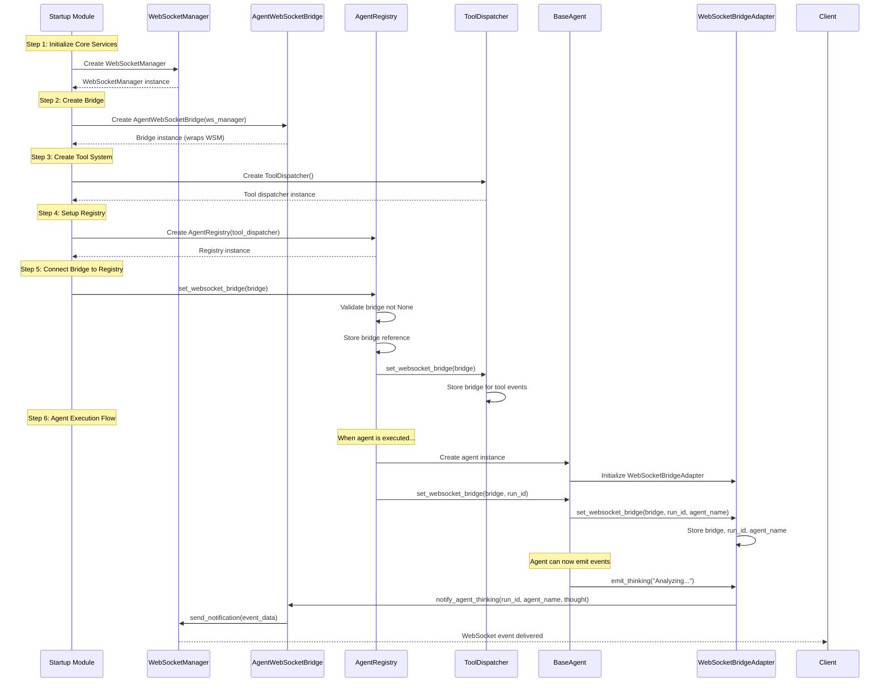
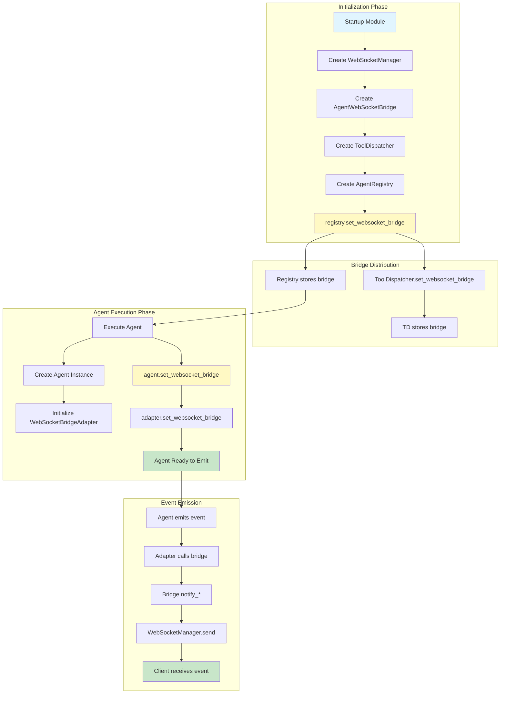

# WebSocket Bridge Setup Flow Documentation

## Overview

The `set_websocket_bridge()` method is the critical initialization point that connects agents to the WebSocket event emission system. This document explains the complete flow and architecture.

## Key Principle: AgentWebSocketBridge as SSOT

All agent WebSocket events MUST flow through the AgentWebSocketBridge, which serves as the Single Source of Truth (SSOT) for agent-to-client communication. This ensures:
- Centralized event handling
- Consistent event format
- Reliable delivery with retry logic
- Proper error handling and fallback

## The set_websocket_bridge() Flow

### Complete Initialization Sequence



### Detailed Component Interactions



## Critical Implementation Details

### 1. WebSocketBridgeAdapter Pattern

Every agent has a WebSocketBridgeAdapter that:
- Stores the bridge reference, run_id, and agent_name
- Provides convenient emit_* methods
- Handles the None bridge case gracefully
- Maps events to bridge.notify_* methods

```python
class WebSocketBridgeAdapter:
    def set_websocket_bridge(self, bridge: 'AgentWebSocketBridge', 
                            run_id: str, agent_name: str) -> None:
        """Set the WebSocket bridge for event emission."""
        self._bridge = bridge
        self._run_id = run_id
        self._agent_name = agent_name
        
    async def emit_thinking(self, thought: str, step_number: Optional[int] = None) -> None:
        """Emit agent thinking event."""
        if not self.has_websocket_bridge():
            return
        await self._bridge.notify_agent_thinking(
            self._run_id, self._agent_name, thought, 
            metadata={"step_number": step_number}
        )
```

### 2. BaseAgent Integration

BaseAgent classes integrate the adapter and expose set_websocket_bridge:

```python
class BaseSubAgent:
    def __init__(self, ...):
        # Initialize WebSocket bridge adapter
        self._websocket_adapter = WebSocketBridgeAdapter()
    
    def set_websocket_bridge(self, bridge, run_id: str) -> None:
        """Configure WebSocket bridge for this agent."""
        self._websocket_adapter.set_websocket_bridge(
            bridge, run_id, self.name
        )
    
    # Delegate event methods to adapter
    async def emit_thinking(self, thought: str, step_number: Optional[int] = None):
        return await self._websocket_adapter.emit_thinking(thought, step_number)
```

### 3. AgentRegistry Distribution

The AgentRegistry is responsible for:
- Storing the bridge reference
- Distributing to tool dispatcher
- Setting bridge on agents during execution

```python
class AgentRegistry:
    def set_websocket_bridge(self, bridge: 'AgentWebSocketBridge') -> None:
        """Set bridge and distribute to components."""
        if bridge is None:
            raise ValueError("Bridge cannot be None")
        
        self._websocket_bridge = bridge
        
        # Distribute to tool dispatcher
        if self.tool_dispatcher:
            self.tool_dispatcher.set_websocket_bridge(bridge)
    
    async def execute_agent(self, agent, run_id, ...):
        """Execute agent with bridge configured."""
        # Set bridge on agent before execution
        agent.set_websocket_bridge(self._websocket_bridge, run_id)
        
        # Execute agent
        return await agent.execute(...)
```

## Common Issues and Solutions

### Issue 1: WebSocket Events Not Reaching Client

**Symptom**: Agent executes but no real-time updates appear in UI

**Root Cause**: Bridge not set on agent before execution

**Solution**: Ensure agent.set_websocket_bridge() is called before agent.execute()

### Issue 2: "WebSocketManager is None" Errors

**Symptom**: Errors in logs about WebSocketManager being None

**Root Cause**: Direct WebSocketManager access instead of using bridge

**Solution**: Always use AgentWebSocketBridge, never access WebSocketManager directly

### Issue 3: Tool Events Not Appearing

**Symptom**: Tool execution happens but no tool_executing/tool_completed events

**Root Cause**: ToolDispatcher not configured with bridge

**Solution**: Ensure registry.set_websocket_bridge() calls tool_dispatcher.set_websocket_bridge()

## Testing the Flow

### Unit Test Example

```python
async def test_websocket_bridge_setup():
    """Test complete bridge setup flow."""
    # Create components
    ws_manager = WebSocketManager()
    bridge = AgentWebSocketBridge(ws_manager)
    tool_dispatcher = ToolDispatcher()
    registry = AgentRegistry(tool_dispatcher)
    
    # Set bridge on registry
    registry.set_websocket_bridge(bridge)
    
    # Verify bridge is stored
    assert registry._websocket_bridge is bridge
    
    # Create and configure agent
    agent = TestAgent()
    run_id = "test-run-123"
    agent.set_websocket_bridge(bridge, run_id)
    
    # Verify agent can emit events
    assert agent._websocket_adapter.has_websocket_bridge()
    
    # Test event emission
    await agent.emit_thinking("Test thought")
    # Verify event was sent through bridge
```

### Integration Test Pattern

```python
async def test_agent_websocket_integration():
    """Test end-to-end WebSocket event flow."""
    # Start with full startup sequence
    startup = await initialize_application()
    
    # Get registry with bridge configured
    registry = startup.agent_registry
    
    # Execute agent
    result = await registry.execute_agent(
        agent_name="test_agent",
        run_id="test-123",
        prompt="Test prompt"
    )
    
    # Verify WebSocket events were emitted
    # Check that agent_started, thinking, completed events occurred
```

## Architectural Rules

### MUST Follow

1. **NEVER** create WebSocketNotifier outside of AgentWebSocketBridge
2. **NEVER** access WebSocketManager directly from agent code
3. **ALWAYS** use AgentWebSocketBridge.notify_* methods
4. **ALWAYS** call set_websocket_bridge() before agent execution
5. **ALWAYS** validate bridge is not None before storing

### MUST NOT Do

1. **DO NOT** import WebSocketManager in agent files
2. **DO NOT** create parallel notification systems
3. **DO NOT** bypass the bridge for "performance"
4. **DO NOT** store WebSocketManager references in agents
5. **DO NOT** emit events without checking has_websocket_bridge()

## Conclusion

The `set_websocket_bridge()` method is the critical connection point that enables agents to emit WebSocket events. By following the SSOT pattern with AgentWebSocketBridge, we ensure reliable, consistent event delivery that powers 90% of the chat functionality value.

Remember: All paths lead through the bridge. No exceptions.

## Related Documentation

- [`SPEC/learnings/websocket_agent_integration_critical.xml`](../SPEC/learnings/websocket_agent_integration_critical.xml) - Comprehensive learnings from bridge implementation
- [`SPEC/learnings/websocket_bridge_architectural_emergency.xml`](../SPEC/learnings/websocket_bridge_architectural_emergency.xml) - Critical architectural violations and fixes
- [`netra_backend/app/services/agent_websocket_bridge.py`](../netra_backend/app/services/agent_websocket_bridge.py) - Bridge implementation (595 lines)
- [`netra_backend/app/agents/mixins/websocket_bridge_adapter.py`](../netra_backend/app/agents/mixins/websocket_bridge_adapter.py) - Adapter pattern implementation