# WebSocket Interface Architecture - Five Whys Root Cause Prevention

## Executive Summary

This document describes the WebSocket Manager Protocol interface architecture implemented to prevent the **ROOT CAUSE** identified in the Five Whys analysis: **"lack of formal interface contracts causing implementation drift during migrations."**

### Critical Context

The Five Whys analysis revealed that `IsolatedWebSocketManager` was missing the `get_connection_id_by_websocket` method, causing AttributeError exceptions during agent execution. This happened because there was no formal interface contract ensuring all WebSocket managers implement the same methods.

## Architecture Overview

```mermaid
graph TB
    Protocol[WebSocketManagerProtocol<br/>Interface Contract] --> IsolatedMgr[IsolatedWebSocketManager<br/>Implements Protocol]
    Protocol --> UnifiedMgr[UnifiedWebSocketManager<br/>Compatible Interface]
    
    Validator[WebSocketManagerProtocolValidator] --> Protocol
    
    AgentHandler[Agent Handler] --> Protocol
    WebSocketBridge[WebSocket Bridge] --> Protocol
    
    subgraph "Five Whys Prevention"
        CriticalMethods["🚨 Critical Methods<br/>• get_connection_id_by_websocket<br/>• update_connection_thread"]
        Protocol --> CriticalMethods
    end
    
    subgraph "Validation Tools"
        StartupValidation[Startup Validation]
        ComplianceReport[Compliance Reports] 
        RuntimeTesting[Runtime Testing]
        Validator --> StartupValidation
        Validator --> ComplianceReport
        Validator --> RuntimeTesting
    end
```



## Interface Contract Definition

### WebSocketManagerProtocol Methods

The protocol defines **11 required methods** that ALL WebSocket managers MUST implement:

#### 1. Connection Management
- `add_connection(connection: WebSocketConnection) -> None` (async)
- `remove_connection(connection_id: str) -> None` (async)
- `get_connection(connection_id: str) -> Optional[WebSocketConnection]`
- `get_user_connections(user_id: str) -> Set[str]`
- `is_connection_active(user_id: str) -> bool`

#### 2. Five Whys Critical Methods 🚨
- `get_connection_id_by_websocket(websocket) -> Optional[str]`
- `update_connection_thread(connection_id: str, thread_id: str) -> bool`

#### 3. Message Sending
- `send_to_user(user_id: str, message: Dict[str, Any]) -> None` (async)
- `emit_critical_event(user_id: str, event_type: str, data: Dict[str, Any]) -> None` (async)

#### 4. Health Monitoring
- `get_connection_health(user_id: str) -> Dict[str, Any]`

#### 5. Compatibility
- `send_to_thread(thread_id: str, message: Dict[str, Any]) -> bool` (async)

## Implementation Status

### ✅ IsolatedWebSocketManager 
**Status**: Fully Protocol Compliant

```python
class IsolatedWebSocketManager(WebSocketManagerProtocol):
    # Explicitly implements protocol interface
    # All 11 methods implemented with correct signatures
    # Five Whys critical methods present and functional
```

**Five Whys Prevention**: This manager now has ALL required methods, preventing the AttributeError that triggered the Five Whys analysis.

### ✅ UnifiedWebSocketManager
**Status**: Interface Compatible

```python
class UnifiedWebSocketManager:
    # Added missing Five Whys critical methods
    # All required methods present for compatibility
    # Maintains backward compatibility
```

**Root Cause Prevention**: Added the missing `get_connection_id_by_websocket` and `update_connection_thread` methods.

## Validation Architecture

### 1. Protocol Compliance Validator

```python
from netra_backend.app.websocket_core.protocols import WebSocketManagerProtocolValidator

# Validate any manager
result = WebSocketManagerProtocolValidator.validate_manager_protocol(manager)
if not result['compliant']:
    print(f"Missing methods: {result['missing_methods']}")
    print(f"Invalid signatures: {result['invalid_signatures']}")
```

### 2. Startup Validation

```python
from netra_backend.app.websocket_core.protocol_validator import validate_websocket_manager_on_startup

# Validate during system startup
if not validate_websocket_manager_on_startup(manager, "Production"):
    raise RuntimeError("Manager not protocol compliant")
```

### 3. Enforcement Mode

```python
# Strict enforcement - raises exception if not compliant
WebSocketManagerProtocolValidator.require_protocol_compliance(manager, "Critical System")
```

## Five Whys Root Cause Prevention

### Original Problem
```
AttributeError: 'IsolatedWebSocketManager' object has no attribute 'get_connection_id_by_websocket'
```

### WHY #5 (Root Cause)
**"No formal WebSocket Manager interface contract exists"**

### Solution Architecture
1. **Formal Protocol**: `WebSocketManagerProtocol` defines the exact interface
2. **Implementation Requirement**: `IsolatedWebSocketManager(WebSocketManagerProtocol)`
3. **Validation Tools**: Runtime validation prevents deployment of non-compliant managers
4. **Critical Method Focus**: Special attention to the methods that were missing

## Usage Patterns

### For New Implementations

```python
from netra_backend.app.websocket_core.protocols import WebSocketManagerProtocol

class MyWebSocketManager(WebSocketManagerProtocol):
    """Must implement ALL protocol methods"""
    
    def get_connection_id_by_websocket(self, websocket) -> Optional[str]:
        # REQUIRED: Five Whys critical method
        ...
    
    def update_connection_thread(self, connection_id: str, thread_id: str) -> bool:
        # REQUIRED: Five Whys critical method  
        ...
    
    # ... implement all other required methods
```

### For Agent Integration

```python
# This pattern now works reliably across ALL manager types
if ws_manager:
    connection_id = ws_manager.get_connection_id_by_websocket(websocket)  # ✅ Always available
    if connection_id:
        ws_manager.update_connection_thread(connection_id, thread_id)     # ✅ Always available
```

## Testing Strategy

### 1. Protocol Compliance Tests

```python
def test_manager_protocol_compliance():
    manager = create_websocket_manager(user_context)
    validation = WebSocketManagerProtocolValidator.validate_manager_protocol(manager)
    assert validation['compliant'], f"Manager not compliant: {validation['missing_methods']}"
```

### 2. Five Whys Critical Method Tests

```python
@pytest.mark.asyncio
async def test_five_whys_critical_methods():
    manager = create_websocket_manager(user_context)
    
    # Test the method that was missing
    connection_id = manager.get_connection_id_by_websocket(websocket)
    assert connection_id is not None
    
    # Test the companion method
    result = manager.update_connection_thread(connection_id, thread_id)
    assert result is True
```

### 3. Runtime Functionality Tests

```python
async def test_critical_method_runtime():
    manager = create_websocket_manager(user_context)
    test_results = await test_critical_method_functionality(manager)
    assert test_results['overall_success']
```

## Migration Guide

### For Existing Code

1. **Import the Protocol**
   ```python
   from netra_backend.app.websocket_core.protocols import WebSocketManagerProtocol
   ```

2. **Validate Existing Managers**
   ```python
   validation = WebSocketManagerProtocolValidator.validate_manager_protocol(your_manager)
   if not validation['compliant']:
       # Fix missing methods before deployment
       print(validation['missing_methods'])
   ```

3. **Add Validation to Startup**
   ```python
   validate_websocket_manager_on_startup(manager, "YourService")
   ```

### For New Managers

1. **Implement Protocol Interface**
   ```python
   class YourManager(WebSocketManagerProtocol):
       # Forced to implement ALL required methods
   ```

2. **Use Protocol Validator in Tests**
   ```python
   def test_your_manager_compliance():
       WebSocketManagerProtocolValidator.require_protocol_compliance(your_manager)
   ```

## Monitoring and Maintenance

### 1. Compliance Dashboard

```python
# Generate compliance reports for monitoring
report = create_protocol_compliance_report(manager)
print(f"Compliance: {report['summary']['compliance_percentage']}%")
```

### 2. Alert on Violations

```python
# Setup monitoring alerts for protocol violations
if not validate_websocket_manager_on_startup(manager):
    send_alert("WebSocket Manager Protocol Violation Detected")
```

### 3. Continuous Validation

```python
# Include in CI/CD pipeline
managers_to_test = [
    (isolated_manager, "IsolatedWebSocketManager"),
    (unified_manager, "UnifiedWebSocketManager")
]
log_protocol_compliance_summary(managers_to_test)
```

## Benefits Achieved

### ✅ Root Cause Prevention
- **No more AttributeError**: All managers guaranteed to have required methods
- **Interface Drift Prevention**: Protocol enforces consistency during migrations  
- **Early Detection**: Validation catches missing methods before deployment

### ✅ Development Safety
- **Compile-time Safety**: Protocol implementation enforced by type system
- **Runtime Validation**: Startup validation prevents production issues
- **Comprehensive Testing**: Automated tests verify all implementations

### ✅ Migration Safety
- **Backward Compatibility**: Existing code continues to work
- **Forward Compatibility**: New implementations forced to be compliant
- **Validation Tools**: Easy to verify compliance during migrations

## Conclusion

The WebSocket Interface Architecture directly addresses the Five Whys root cause by:

1. **Formal Contracts**: `WebSocketManagerProtocol` defines exact interface requirements
2. **Implementation Enforcement**: Managers must explicitly implement the protocol
3. **Validation Tools**: Runtime validation prevents non-compliant deployments  
4. **Critical Method Focus**: Special attention to the methods that caused the original issue

This architecture ensures that the **"lack of formal interface contracts"** root cause can never occur again, preventing future WebSocket interface drift and the AttributeError exceptions that disrupt user experience.

The implementation is **production-ready** and provides **comprehensive tooling** for ongoing maintenance and validation of WebSocket manager interface compliance.