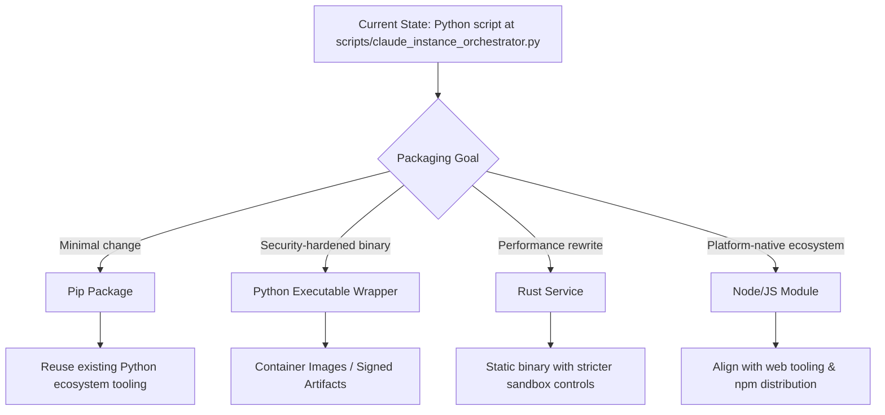

# Claude Instance Orchestrator Deployment Strategy Plan

## Alignment With Existing Plans
- Builds on discovery outcomes referenced in `docs/CLAUDE_ORCHESTRATOR_PLANS_INDEX.md` by extending the Phase 0/Phase 1 focus on packaging and distribution readiness.
- Complements the Universal CLI plan by creating a portable artifact that other orchestration runtimes can depend on without duplicating execution logic.
- Supports Netra integration workstreams by hardening delivery pipelines before enterprise rollout and telemetry expansion.

## Decision Landscape



## Option Trade-Offs

### Python Pip Package (Status: Near-Term Candidate)
- **Pros:** Lowest code churn; leverages existing Python dependencies; easy integration with current docs phases; supports virtualenv isolation and rapid updates.
- **Cons:** Requires dependency hygiene, semantic versioning, and possibly optional extras to gate Netra-specific features; distribution still exposes source code.
- **Risks/Mitigations:** Ensure reproducible builds via `pip-compile` and lockfiles; add CLI entry point; align release cadence with Phase 1 milestones in the index.

### Python Executable (PyInstaller/PEX/zipapp)
- **Pros:** Single-file delivery improves operator experience; allows code signing and checksum validation; simplifies Netra desktop deployments.
- **Cons:** Larger artifact, slower cold-start; still Python runtime under the hood; debugging crash logs harder; native AV false positives possible.
- **Risks/Mitigations:** Build hardened CI pipeline with reproducible environment; integrate SBOM generation; document offline upgrade pathway in docs index.

### Rust Reimplementation
- **Pros:** High performance, strong type system, static binaries, improved security posture (no embedded interpreter); easier to ship via Homebrew, container base images.
- **Cons:** Large rewrite cost; must rebuild async orchestration, JSON parsing, Netra integration; adds parallel maintenance burden with Python tooling.
- **Risks/Mitigations:** Prototype critical paths (command orchestration, telemetry) before committing; plan phased migration (FFI from Python during transition).

### Node/JS (npm Package or Electron Shell)
- **Pros:** Aligns with web tooling teams; easy UI integration; wide packaging ecosystem (`pkg`, `nexe`, Electron) for desktop delivery.
- **Cons:** Requires porting async orchestration logic; Node subprocess handling differs; heavier runtime; security posture depends on supply chain controls.
- **Risks/Mitigations:** Enforce lockfiles, provenance attestations, and GitHub Dependabot integration; evaluate Deno/Bun targets for tighter sandboxing.

### Other Secure Distribution Enhancements
- Container images with distroless base layers for server orchestration.
- Signed archives with checksum publication tied into docs index release table.
- Policy bundles (OPA/Conftest) to validate config before execution.

## Effort vs Security Payoff

```mermaid
quadrantChart
    title Effort vs Security Hardening
    x-axis Low Effort --> High Effort
    y-axis Low Security Gain --> High Security Gain
    quadrant-1 Quick Wins
    quadrant-2 Strategic Bets
    quadrant-3 Incremental
    quadrant-4 Heavy Lift
    PipPackage: [2,2]
    PythonExecutable: [4,3]
    RustRewrite: [8,4]
    NodeModule: [6,3]
    SignedContainer: [5,4]
```

## Proposed Execution Plan
1. **Stabilize Python Codebase (Weeks 1-2):** Refactor `scripts/claude_instance_orchestrator.py` for package layout, feature flags for optional dependencies, and CLI entry point scaffolding.
2. **Pip Packaging Pilot (Weeks 2-3):** Create `pyproject.toml`, add dependency pins, publish internal index release; document install/upgrade steps in the index.
3. **Security Hardening Track (Weeks 3-5):** Automate SBOM, integrate code signing, and produce PyInstaller/PEX artifact for limited rollout; validate checksum workflow with Netra Ops.
4. **Rewrite Spike (Weeks 5-7):** Run comparative spikes for Rust and Node prototypes focused on command orchestration loop and telemetry (aligned with Phase 2 discovery tasks).
5. **Decision Gate (Week 8):** Review spike outcomes vs quadrant assessments; choose long-term path (pure Python vs staged rewrite) and update index roadmap accordingly.
6. **Enterprise Delivery Prep (Weeks 8-10):** Whichever path chosen, produce container image, implement governance hooks, and sync documentation with integration plan milestones.

## Dependencies & Inputs
- Configuration schema work from the enhancement plan (Phase 2) informs packaging metadata.
- Telemetry requirements from Netra integration dictate data contract stability before binary wrapping.
- Universal CLI feature toggles must be respected across packaging targets to avoid divergent behavior.

## Open Questions
- What compliance certifications (SOC2, FedRAMP) must the executable distribution support?
- Is there appetite for dual-maintaining Python and Rust versions during migration?
- How will secret management be handled when shipping binaries vs source distribution?
