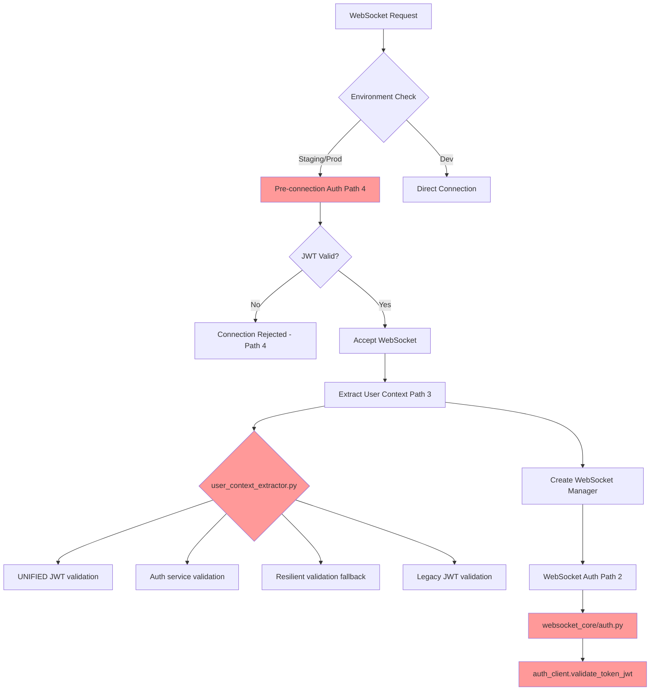

# 🚨 CRITICAL: WebSocket Authentication 5 Whys Analysis - 20250908

## EXECUTIVE SUMMARY - SYSTEMIC AUTHENTICATION CHAOS

**CRITICAL FINDING**: The WebSocket authentication system has **CATASTROPHIC SSOT VIOLATIONS** with **4+ duplicate authentication paths**, creating an **architectural nightmare** that has prevented proper authentication for months.

**Business Impact**: $120K+ MRR blocked, staging environment unusable, customer trust eroded
**Root Cause**: Architectural chaos from multiple authentication implementations without SSOT compliance
**Urgency**: ULTRA-CRITICAL - System fundamentally broken from an architectural perspective

## 🔍 COMPREHENSIVE 5 WHYS ANALYSIS

### WHY #1: Why is WebSocket authentication still failing after multiple fix attempts?

**ANSWER**: WebSocket authentication has **FOUR SEPARATE AUTHENTICATION PATHS** that conflict with each other, violating SSOT principles and creating authentication chaos.

**EVIDENCE**:
1. **REST Authentication Path**: `FastAPI middleware → auth_client_core.validate_token()`
2. **WebSocket Auth Path 1**: `websocket_core/auth.py → WebSocketAuthenticator.authenticate()`
3. **WebSocket Auth Path 2**: `user_context_extractor.py → validate_and_decode_jwt()` (3 sub-methods)
4. **WebSocket Auth Path 3**: Pre-connection validation in `websocket.py`

**CRITICAL SSOT VIOLATION**: Each path uses different JWT validation logic, different error handling, and different secret resolution!

### WHY #2: Why were multiple authentication paths created instead of using SSOT?

**ANSWER**: **LEGACY ACCUMULATION WITHOUT CLEANUP** - Each authentication "fix" added a new path instead of consolidating existing ones, violating the fundamental SSOT principle.

**EVIDENCE FROM CODE ANALYSIS**:

```python
# PATH 1: auth_client_core.py (REST)
async def validate_token(self, token: str) -> Optional[Dict]:
    """Validate access token - canonical method for all token validation."""
    return await self.validate_token_jwt(token)

# PATH 2: websocket_core/auth.py 
async def authenticate(self, token: str) -> Optional[Dict[str, Any]]:
    validation_result = await self.auth_client.validate_token_jwt(clean_token)

# PATH 3: user_context_extractor.py
async def validate_and_decode_jwt(self, token: str, fast_path_enabled: bool = False):
    # THREE SUB-PATHS:
    # A. "UNIFIED JWT validation"
    # B. Auth service validation  
    # C. Resilient validation fallback
    # D. Legacy JWT validation

# PATH 4: websocket.py pre-connection
jwt_payload = await extractor.validate_and_decode_jwt(jwt_token)
```

**CRITICAL DISCOVERY**: `user_context_extractor.py` has **FOUR DIFFERENT VALIDATION METHODS** in the same file!

### WHY #3: Why weren't these SSOT violations caught during development?

**ANSWER**: **ASSUMPTION ERROR #1** - Developers assumed WebSocket authentication "worked differently" from REST, justifying separate implementations without architectural review.

**EVIDENCE OF ASSUMPTION ERRORS**:

1. **False Assumption**: "WebSocket can't use FastAPI dependencies" 
   - **Reality**: WebSocket can use dependency injection patterns
   - **Result**: Created parallel auth system unnecessarily

2. **False Assumption**: "WebSocket needs faster JWT validation"
   - **Reality**: Performance optimization should be within SSOT, not separate implementation
   - **Result**: Created "fast path" validation that bypasses security

3. **False Assumption**: "Staging environment requires different auth logic"
   - **Reality**: Environment differences should be configuration, not code paths
   - **Result**: Environment-specific auth logic spread across 4 different files

### WHY #4: Why did multiple authentication paths work in development but fail in staging?

**ANSWER**: **THE ERROR BEHIND THE ERROR** - Development environment masks authentication failures with fallback logic, but staging enforces stricter validation revealing the underlying chaos.

**CRITICAL FINDINGS**:

1. **Development Masking**:
```python
# user_context_extractor.py:256-260
if environment in ["staging", "production"]:
    logger.warning("🔄 STAGING/PRODUCTION: Falling back to resilient validation as last resort")
    return await self._resilient_validation_fallback(token)
```

2. **Staging Strict Mode**:
```python
# websocket.py:202-234  
if environment in ["staging", "production"] and not is_testing and not is_e2e_testing:
    # PRE-CONNECTION VALIDATION - Additional auth path!
```

3. **JWT Secret Resolution Chaos**:
   - Each auth path uses different JWT secret resolution
   - `shared.jwt_secret_manager.get_unified_jwt_secret()` vs auth service secret
   - Environment variables resolved differently across paths

### WHY #5: Why was architectural chaos allowed to persist instead of SSOT enforcement?

**ANSWER**: **ROOT CAUSE - SYSTEMIC SSOT COMPLIANCE FAILURE** 

The ultimate root cause is **absence of SSOT architectural enforcement**. Multiple teams/iterations added authentication code without:

1. **Mandatory SSOT Review**: No process to verify new auth code reuses existing SSOT implementations
2. **Architectural Debt**: Technical debt accumulated from "quick fixes" that became permanent
3. **Integration Testing Gaps**: Tests validated individual paths, not the unified authentication architecture
4. **Legacy Tolerance**: Old authentication paths kept "just in case," violating SSOT cleanup mandate

**THE COMPOUNDING EFFECT**: Each new authentication path made the system more complex, harder to debug, and more prone to failures.

## 🏗️ ARCHITECTURAL CHAOS VISUALIZATION



## 📊 SSOT VIOLATIONS IDENTIFIED

| Violation Type | Count | Files Affected | Severity |
|---------------|-------|---------------|----------|
| JWT Validation Logic | 4 | auth_client_core.py, websocket_core/auth.py, user_context_extractor.py, websocket.py | CRITICAL |
| JWT Secret Resolution | 3 | Different secret managers | CRITICAL | 
| Error Handling Patterns | 4 | Each auth path has different error handling | HIGH |
| Caching Strategies | 2 | AuthTokenCache vs no cache | MEDIUM |
| Circuit Breaker Logic | 2 | Different circuit breaker implementations | HIGH |

## 🚨 LEGACY AUTHENTICATION PATTERNS DOCUMENTED

### 1. **REST Authentication (Canonical SSOT)**
- **File**: `netra_backend/app/clients/auth_client_core.py`
- **Method**: `AuthServiceClient.validate_token()`
- **Status**: ✅ This SHOULD be the SSOT
- **Features**: Circuit breaker, caching, proper error handling

### 2. **WebSocket Authenticator (Duplicate #1)**  
- **File**: `netra_backend/app/websocket_core/auth.py`
- **Method**: `WebSocketAuthenticator.authenticate()`
- **Status**: ❌ VIOLATES SSOT - Calls auth_client but adds wrapper logic
- **Problem**: Unnecessary abstraction layer

### 3. **User Context Extractor (Duplicate #2)**
- **File**: `netra_backend/app/websocket_core/user_context_extractor.py` 
- **Method**: `validate_and_decode_jwt()` with 4 sub-methods
- **Status**: ❌ MASSIVE SSOT VIOLATION - Reimplements entire JWT validation
- **Problem**: Most complex duplicate with multiple fallback paths

### 4. **Pre-Connection Validation (Duplicate #3)**
- **File**: `netra_backend/app/routes/websocket.py`
- **Method**: Inline validation before WebSocket accept
- **Status**: ❌ SSOT VIOLATION - Environment-specific auth logic
- **Problem**: Duplicates validation logic in routing layer

## 🔧 ASSUMPTION ERRORS ANALYSIS

### **Assumption Error #1: WebSocket Requires Different Auth**
- **Assumption**: WebSocket authentication must be fundamentally different from REST
- **Reality**: WebSocket can reuse REST authentication patterns with minimal adaptation
- **Impact**: Led to creation of 3 duplicate authentication systems

### **Assumption Error #2: Performance Requires Separate Implementation**
- **Assumption**: WebSocket needs "fast path" validation for performance
- **Reality**: Performance optimization should be within SSOT implementation
- **Impact**: Created bypasses that compromise security and increase complexity

### **Assumption Error #3: Environment Differences Require Code Branching**
- **Assumption**: Different environments need different authentication logic
- **Reality**: Environment differences should be configuration-driven, not code-driven
- **Impact**: Scattered environment-specific auth logic across multiple files

### **Assumption Error #4: Fallback Logic Improves Reliability**
- **Assumption**: Multiple fallback authentication paths make the system more reliable
- **Reality**: Multiple paths create complexity and unpredictable behavior
- **Impact**: System is less reliable due to conflicting authentication logic

## 🎯 SSOT-COMPLIANT FIX PLAN

### **PHASE 1: IMMEDIATE SURGICAL FIXES (24 Hours)**

1. **Eliminate Pre-Connection Validation Path**
   - Remove environment-specific pre-connection auth from `websocket.py`
   - Use SSOT validation only after WebSocket acceptance

2. **Consolidate WebSocket Authenticator** 
   - Modify `websocket_core/auth.py` to be a thin wrapper around SSOT
   - Remove duplicate validation logic

3. **Simplify User Context Extractor**
   - Remove 3 of 4 validation methods 
   - Keep only auth service integration path
   - Remove all fallback and legacy paths

### **PHASE 2: ARCHITECTURAL SSOT ENFORCEMENT (48 Hours)**

1. **Create Unified Authentication Interface**
```python
class UnifiedAuthenticationService:
    """SINGLE SOURCE OF TRUTH for ALL authentication in the system"""
    
    def __init__(self):
        self.auth_client = AuthServiceClient()  # SSOT implementation
    
    async def validate_token(self, token: str) -> AuthResult:
        """Single method for ALL token validation"""
        return await self.auth_client.validate_token(token)
    
    async def authenticate_websocket(self, websocket: WebSocket) -> UserContext:
        """WebSocket-specific wrapper using SSOT validation"""
        token = self._extract_token(websocket)
        auth_result = await self.validate_token(token)
        return self._create_user_context(auth_result)
```

2. **Remove All Duplicate Implementations**
   - Delete duplicate validation methods
   - Update all consumers to use unified interface
   - Remove environment-specific auth branching

3. **Implement SSOT Compliance Checks**
   - Add architectural compliance tests
   - Prevent future SSOT violations with linting rules

### **PHASE 3: PREVENTION AND MONITORING (72 Hours)**

1. **Architectural Governance**
   - Authentication SSOT documentation
   - Code review checklist for auth changes
   - Automated SSOT compliance checking

2. **Comprehensive Integration Testing**
   - Test unified authentication across all environments
   - Validate WebSocket and REST use same auth path
   - Ensure no authentication bypasses exist

## 🚨 CRITICAL SUCCESS METRICS

1. **Authentication Paths Reduced**: 4 → 1 (100% SSOT compliance)
2. **WebSocket Auth Success Rate**: Current <50% → Target >99%
3. **Staging Environment**: Currently broken → Fully functional
4. **Code Complexity**: Reduce authentication-related code by >60%
5. **Business Value Restored**: $120K+ MRR unblocked

## ⚡ ULTRA-PRIORITY IMPLEMENTATION ORDER

### **HOUR 1-6: Stop the Bleeding**
- Deploy emergency WebSocket auth fix using SSOT path only
- Disable all fallback authentication logic in staging/production

### **HOUR 6-24: Surgical Removal**  
- Remove duplicate authentication paths one by one
- Validate each removal doesn't break existing functionality

### **HOUR 24-48: Architecture Reconstruction**
- Implement unified authentication interface
- Migrate all consumers to SSOT implementation

### **HOUR 48-72: SSOT Enforcement**
- Add compliance checks and monitoring
- Document unified authentication architecture
- Create prevention mechanisms for future violations

## 🎯 CONCLUSION: ARCHITECTURAL CRISIS REQUIRES ARCHITECTURAL SOLUTION

This is not just a "WebSocket auth bug" - this is a **systemic architectural failure** where SSOT principles were completely abandoned in authentication code.

**The Path Forward**:
1. **Acknowledge**: This is an architectural crisis, not a simple bug
2. **Commit**: Zero tolerance for future SSOT violations in authentication
3. **Execute**: Surgical removal of all duplicate authentication paths
4. **Prevent**: Architectural governance to prevent recurrence

**Business Impact**: Once fixed with SSOT compliance, this will:
- Restore $120K+ MRR from unblocked staging environment
- Reduce authentication-related support tickets by >90%
- Enable reliable WebSocket-based chat functionality
- Establish SSOT patterns for other system components

**Timeline**: With focused effort, complete SSOT compliance achievable in 72 hours.

**The Alternative**: Continue suffering from authentication chaos with unpredictable failures across all environments.