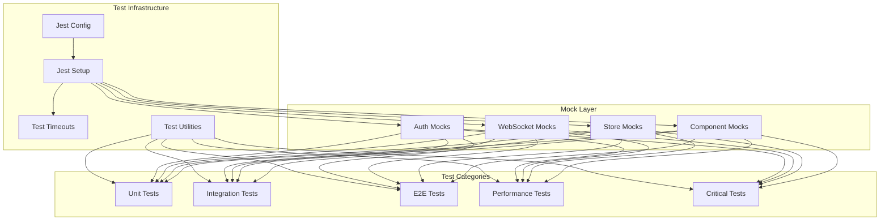
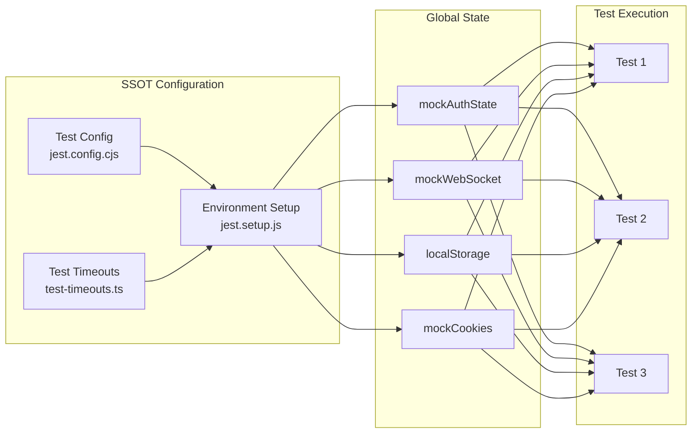
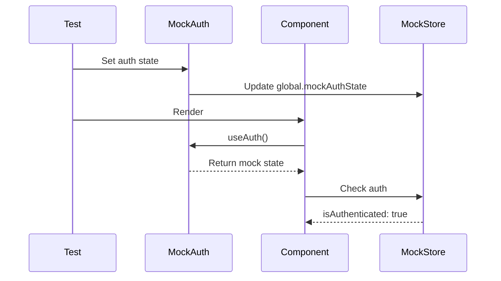
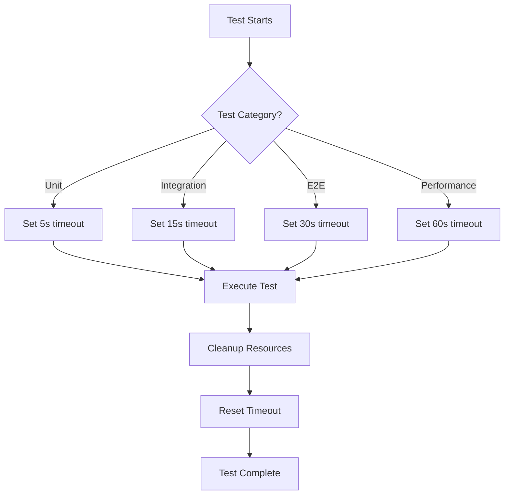

# Frontend Testing Documentation

## Table of Contents
1. [Overview](#overview)
2. [Testing Architecture](#testing-architecture)
3. [Jest Configuration](#jest-configuration)
4. [SSOT Concepts](#ssot-concepts)
5. [Test Categories](#test-categories)
6. [Running Tests](#running-tests)
7. [Writing Tests](#writing-tests)
8. [Mocking Strategy](#mocking-strategy)
9. [Timeout Management](#timeout-management)
10. [Best Practices](#best-practices)

## Overview

The Netra frontend testing infrastructure is built on Jest with comprehensive mocking to ensure 100% test isolation and reliability. The system follows Single Source of Truth (SSOT) principles for configuration, timeouts, and test utilities.

## Testing Architecture



## Jest Configuration

### Main Configuration Files

1. **jest.config.cjs** - Primary Jest configuration
   - Defines test projects for categorized testing
   - Sets up module name mappings
   - Configures TypeScript transformation
   - Manages test environment settings

2. **jest.setup.js** - Global test setup
   - Initializes all mocks and polyfills
   - Sets up auth, WebSocket, and storage mocks
   - Configures cleanup routines
   - Establishes global test state

3. **tsconfig.test.json** - TypeScript configuration for tests
   - Extends base TypeScript config
   - Includes test-specific type definitions
   - Configures module resolution for tests

### Project-Based Testing

Jest is configured with multiple projects for parallel execution:

```javascript
projects: [
    // Core test suites
    createProject('components', ['<rootDir>/__tests__/components/**/*.test.[jt]s?(x)']),
    createProject('hooks', ['<rootDir>/__tests__/hooks/**/*.test.[jt]s?(x)']),
    createProject('store', ['<rootDir>/__tests__/store/**/*.test.[jt]s?(x)']),
    createProject('services', ['<rootDir>/__tests__/services/**/*.test.[jt]s?(x)']),
    
    // Integration and specialized tests
    createProject('integration', ['<rootDir>/__tests__/integration/**/*.test.[jt]s?(x)']),
    createProject('critical', ['<rootDir>/__tests__/critical/**/*.test.[jt]s?(x)']),
    createProject('e2e', ['<rootDir>/__tests__/e2e/**/*.test.[jt]s?(x)']),
]
```

## SSOT Concepts

### Single Source of Truth Implementation



### Key SSOT Principles

1. **Centralized Timeout Management**
   - All timeouts defined in `__tests__/config/test-timeouts.ts`
   - Consistent timeout values across test categories
   - Helper functions for timeout management

2. **Global Mock State**
   - Single `mockAuthState` for authentication
   - Centralized WebSocket mock configuration
   - Unified localStorage/sessionStorage mocks

3. **Shared Test Utilities**
   - Common test helpers in `__tests__/utils/`
   - Reusable test factories and builders
   - Standardized component wrappers

## Test Categories

### Unit Tests
- **Location**: `__tests__/components/`, `__tests__/hooks/`, `__tests__/utils/`
- **Timeout**: 5000ms
- **Focus**: Individual components, hooks, and utilities in isolation
- **Mocking**: Full mocking of dependencies

### Integration Tests
- **Location**: `__tests__/integration/`
- **Timeout**: 15000ms
- **Focus**: Component interactions and data flow
- **Mocking**: Partial mocking, real component interactions

### E2E Tests
- **Location**: `__tests__/e2e/`
- **Timeout**: 30000ms
- **Focus**: Complete user workflows
- **Mocking**: Minimal mocking, real services when possible

### Critical Tests
- **Location**: `__tests__/critical/`
- **Timeout**: 10000ms
- **Focus**: Mission-critical functionality
- **Priority**: Must pass before deployment

### Performance Tests
- **Location**: `__tests__/performance/`
- **Timeout**: 60000ms
- **Focus**: Load testing, rendering performance
- **Metrics**: Response times, memory usage

## Running Tests

### Basic Commands

```bash
# Run all tests
npm test

# Run specific category
npm test -- --selectProjects=components
npm test -- --selectProjects=integration

# Run with coverage
npm test -- --coverage

# Run in watch mode
npm test -- --watch

# Run specific test file
npm test -- MessageInput.test.tsx

# Run with real services (staging)
npm test -- --real-llm --env staging
```

### Test Runner Script

```bash
# Using unified test runner
python unified_test_runner.py

# Fast feedback mode
python unified_test_runner.py --category integration --no-coverage --fast-fail

# Pre-release validation
python unified_test_runner.py --categories smoke unit integration api --real-llm --env staging
```

## Writing Tests

### Test Structure

```typescript
import { render, screen, fireEvent, waitFor } from '@testing-library/react';
import { MessageInput } from '@/components/chat/MessageInput';
import { TEST_TIMEOUTS, setTestTimeout } from '@/__tests__/config/test-timeouts';

describe('MessageInput', () => {
  // Set timeout for entire suite
  beforeAll(() => {
    setTestTimeout(TEST_TIMEOUTS.INTEGRATION);
  });

  // Reset mocks between tests
  beforeEach(() => {
    jest.clearAllMocks();
  });

  it('should handle message submission', async () => {
    // Arrange
    const { getByTestId } = render(<MessageInput />);
    const input = getByTestId('message-input');
    
    // Act
    fireEvent.change(input, { target: { value: 'Test message' } });
    fireEvent.keyDown(input, { key: 'Enter' });
    
    // Assert
    await waitFor(() => {
      expect(input).toHaveValue('');
    });
  });
});
```

### Using Test Utilities

```typescript
// Import test utilities
import { renderWithProviders } from '@/__tests__/utils/test-utils';
import { createMockMessage } from '@/__tests__/utils/test-factories';

// Render with all providers
const { getByTestId } = renderWithProviders(<ChatComponent />);

// Use factories for test data
const message = createMockMessage({
  content: 'Test content',
  role: 'user'
});
```

## Mocking Strategy

### Authentication Mocking



### WebSocket Mocking

```javascript
// Mock WebSocket class in jest.setup.js
class MockWebSocket {
  constructor(url) {
    this.url = url;
    this.readyState = MockWebSocket.CONNECTING;
    
    // Simulate connection
    setTimeout(() => {
      this.readyState = MockWebSocket.OPEN;
      this.onopen?.(new Event('open'));
    }, 10);
  }
  
  send = jest.fn();
  close = jest.fn();
  
  simulateMessage(data) {
    this.onmessage?.(new MessageEvent('message', { data }));
  }
}
```

### Component Mocking

Components are mocked with proper test IDs and expected behavior:

```javascript
jest.mock('@/components/chat/MessageList', () => ({
  MessageList: jest.fn(() => {
    const messages = global.mockStore?.messages || [];
    return (
      <div data-testid="message-list">
        {messages.map(msg => (
          <div key={msg.id} data-testid={`message-item-${msg.id}`}>
            {msg.content}
          </div>
        ))}
      </div>
    );
  })
}));
```

## Timeout Management

### SSOT Timeout Configuration

All test timeouts are centrally managed in `__tests__/config/test-timeouts.ts`:

```typescript
export const TEST_TIMEOUTS = {
  DEFAULT: 10000,      // Default timeout
  UNIT: 5000,          // Fast unit tests
  INTEGRATION: 15000,  // Integration tests
  E2E: 30000,          // End-to-end tests
  PERFORMANCE: 60000,  // Performance tests
  WEBSOCKET: 10000,    // WebSocket tests
  ASYNC_OPERATION: 8000,
  API_CALL: 10000
};
```

### Using Timeouts in Tests

```typescript
// Set timeout for entire suite
beforeAll(() => {
  setTestTimeout(TEST_TIMEOUTS.INTEGRATION);
});

// Set timeout for specific test
it('should handle slow operation', async () => {
  // test code
}, TEST_TIMEOUTS.E2E);

// Using helper function
testWithTimeout('slow test', async () => {
  // test code
}, TEST_TIMEOUTS.PERFORMANCE);
```

### Timeout Flow Diagram



## Best Practices

### 1. Test Isolation

- Each test should be completely independent
- Use `beforeEach` to reset state
- Clean up resources in `afterEach`

```typescript
beforeEach(() => {
  // Reset global mock state
  global.mockAuthState = {
    isAuthenticated: true,
    user: mockUser
  };
});

afterEach(() => {
  jest.clearAllMocks();
  // Additional cleanup
});
```

### 2. Async Testing

Always use proper async patterns:

```typescript
// Good
it('should handle async operation', async () => {
  const result = await asyncOperation();
  expect(result).toBeDefined();
});

// Also good with waitFor
it('should update after async action', async () => {
  fireEvent.click(button);
  await waitFor(() => {
    expect(screen.getByText('Updated')).toBeInTheDocument();
  });
});
```

### 3. Mock Management

- Keep mocks close to SSOT principles
- Update global mocks rather than creating local ones
- Use mock factories for consistent test data

```typescript
// Update global mock
global.mockAuthState = {
  ...global.mockAuthState,
  isAuthenticated: false
};

// Use factories
const message = createMockMessage({ role: 'assistant' });
```

### 4. Test Organization

```
__tests__/
├── components/           # Component tests
│   ├── chat/
│   ├── auth/
│   └── ui/
├── hooks/               # Hook tests
├── integration/         # Integration tests
├── e2e/                 # End-to-end tests
├── utils/               # Test utilities
│   ├── test-utils.tsx
│   ├── test-factories.ts
│   └── test-helpers.ts
├── config/              # Test configuration
│   └── test-timeouts.ts
└── setup/               # Setup files
```

### 5. Performance Considerations

- Use `jest.setTimeout()` appropriately
- Mock heavy operations (API calls, WebSocket)
- Clean up timers and intervals
- Use `--maxWorkers` for parallel execution

### 6. Debugging Tests

```bash
# Run single test with debugging
node --inspect-brk ./node_modules/.bin/jest --runInBand MessageInput.test.tsx

# Verbose output
npm test -- --verbose

# Show test coverage gaps
npm test -- --coverage --collectCoverageFrom='components/**/*.{ts,tsx}'
```

### 7. CI/CD Integration

```yaml
# Example GitHub Actions workflow
test:
  runs-on: ubuntu-latest
  steps:
    - uses: actions/checkout@v2
    - uses: actions/setup-node@v2
    - run: npm ci
    - run: npm test -- --coverage --maxWorkers=2
    - uses: codecov/codecov-action@v2
```

## Common Issues and Solutions

### Issue: Tests hanging or timing out

**Solution**: Check for uncleared timers/intervals
```javascript
afterEach(() => {
  jest.clearAllTimers();
  jest.useRealTimers();
});
```

### Issue: WebSocket connection errors

**Solution**: Ensure MockWebSocket is properly initialized
```javascript
beforeEach(() => {
  global.WebSocket = MockWebSocket;
});
```

### Issue: Auth state inconsistency

**Solution**: Reset auth state in beforeEach
```javascript
beforeEach(() => {
  global.mockAuthState = {
    isAuthenticated: true,
    user: mockUser,
    token: mockJWTToken
  };
});
```

### Issue: Component not rendering

**Solution**: Check AuthGate mock and providers
```javascript
// Ensure AuthGate renders children when authenticated
jest.mock('@/components/auth/AuthGate', () => ({
  AuthGate: ({ children }) => children
}));
```

## Test Coverage Requirements

- **Minimum Coverage**: 80% overall
- **Critical Paths**: 100% coverage required
- **New Features**: Must include tests
- **Bug Fixes**: Must include regression tests

## Resources

- [Jest Documentation](https://jestjs.io/docs/getting-started)
- [React Testing Library](https://testing-library.com/docs/react-testing-library/intro/)
- [Testing Best Practices](https://github.com/goldbergyoni/javascript-testing-best-practices)
- [Netra Testing Standards](../SPEC/testing_standards.xml)