# Frontend Architecture Diagrams

## Key Components Architecture


## Loading Flow State Machine

```mermaid
stateDiagram-v2
    [*] --> INITIALIZING: Page Load
    
    INITIALIZING --> AUTH_CHECK: Start Auth
    
    AUTH_CHECK --> WEBSOCKET_CONNECT: Token Valid
    AUTH_CHECK --> LOGIN_REDIRECT: No Token
    
    WEBSOCKET_CONNECT --> STORE_INIT: WS Connected
    WEBSOCKET_CONNECT --> CONNECTION_FAILED: WS Failed
    
    STORE_INIT --> READY: Store Initialized
    STORE_INIT --> READY: Timeout (500ms)
    
    READY --> THREAD_LOADING: Thread Selected
    READY --> SHOW_EMPTY: No Thread
    
    THREAD_LOADING --> THREAD_READY: Messages Loaded
    THREAD_LOADING --> THREAD_READY: Timeout (15s)
    
    THREAD_READY --> PROCESSING: User Message
    THREAD_READY --> SHOW_PROMPTS: No Messages
    
    PROCESSING --> THREAD_READY: Agent Complete
    
    CONNECTION_FAILED --> WEBSOCKET_CONNECT: Retry
    CONNECTION_FAILED --> ERROR: Max Retries
    
    ERROR --> INITIALIZING: User Retry
    LOGIN_REDIRECT --> [*]: Navigate Away
    
    note right of INITIALIZING: Progress: 0-33%
    note right of WEBSOCKET_CONNECT: Progress: 33-66%
    note right of STORE_INIT: Progress: 66-100%
    note right of READY: Progress: 100%
```

## Initialization Coordinator Flow


## Component Communication Flow


## WebSocket Event Processing


## Authentication Flow with Token Refresh


## Loading State Transitions


## Store Relationships

```mermaid
erDiagram
    UnifiedChatStore ||--o{ Message : contains
    UnifiedChatStore ||--|| ActiveThread : manages
    UnifiedChatStore ||--o{ FastLayerData : updates
    UnifiedChatStore ||--o{ MediumLayerData : updates
    UnifiedChatStore ||--o{ SlowLayerData : updates
    
    AuthStore ||--|| User : contains
    AuthStore ||--|| Token : stores
    
    WebSocketService ||--|| Connection : maintains
    WebSocketService ||--o{ WebSocketMessage : processes
    
    ChatStatePersistence ||--o{ ThreadHistory : stores
    ChatStatePersistence ||--o{ MessageCache : caches
    
    ReconciliationService ||--o{ OptimisticMessage : tracks
    ReconciliationService ||--o{ Confirmation : processes
    
    Message {
        string id
        string content
        string role
        timestamp created
    }
    
    ActiveThread {
        string threadId
        boolean isLoading
        array messages
    }
    
    User {
        string id
        string email
        string full_name
    }
    
    Token {
        string access_token
        string refresh_token
        number expiry
    }
    
    WebSocketMessage {
        string type
        object payload
        string message_id
    }
```



## Fix for 100% Loading Issue


## Key Insights

1. **Component Hierarchy**: AuthGuard wraps all protected pages, MainChat is the core interface component
2. **State Management**: UnifiedChatStore is the SSOT for chat state, AuthStore for auth state
3. **Loading Flow**: Three-phase initialization (auth → websocket → store) ensures proper setup
4. **WebSocket Integration**: Event processor handles all real-time updates through a centralized pipeline
5. **Fix Applied**: Changed loading condition from `(!isInitialized || shouldShowLoading)` to `(!isInitialized || phase !== 'ready')` to prevent stuck state at 100%