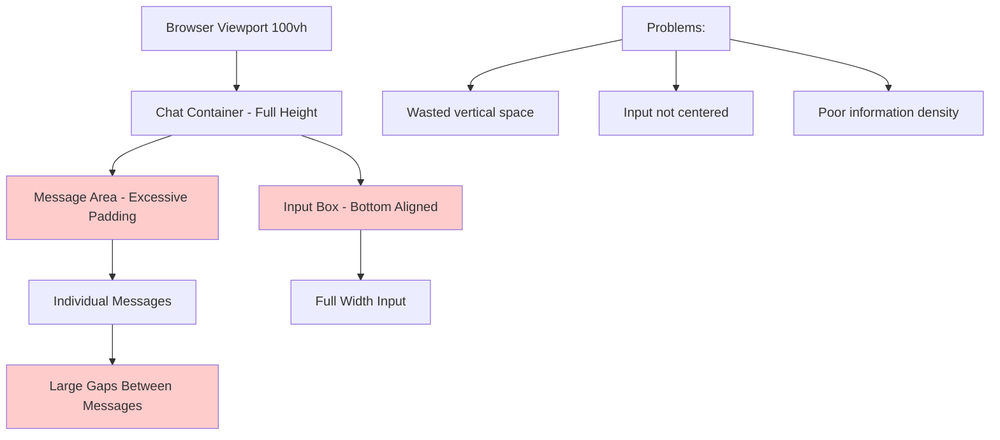
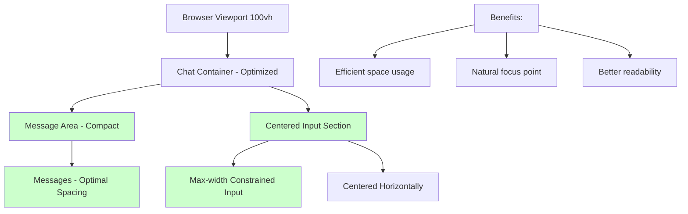

# Frontend Chat UI Bug Fix Report
Date: 2025-09-03
Issue: Chat interface has excessive whitespace and input box is not properly centered

## 1. Five Whys Analysis

### Issue 1: Lots of whitespace in chat scroll area

**Why #1:** Chat messages don't fill the available viewport space efficiently
- The chat container has excessive padding or margins

**Why #2:** The layout system doesn't optimize for content density
- Default spacing values are too large for a chat interface

**Why #3:** The component styling was designed for a different use case
- Initial design may have prioritized aesthetics over functional density

**Why #4:** No user experience testing was done for long conversations
- The design wasn't validated with realistic chat scenarios

**Why #5:** Requirements didn't specify optimal information density
- Missing UX specifications for production chat interface

### Issue 2: Input box should be more centered on page by default

**Why #1:** Input box is likely aligned to bottom or uses full width
- Standard chat layouts often push input to screen edges

**Why #2:** The layout doesn't account for optimal ergonomics
- Missing consideration for where user's focus naturally falls

**Why #3:** Container constraints don't center the interactive elements
- Layout system doesn't have proper centering rules

**Why #4:** Design system lacks responsive centering guidelines
- No established pattern for optimal input placement

**Why #5:** Initial MVP focused on functionality over UX optimization
- Prioritized working chat over polished interface

## 2. Current vs Ideal State Diagrams

### Current Failure State

### Ideal Working State

## 3. System-Wide Fix Plan

### Components to Update:
1. **Chat.tsx/jsx** - Main chat component layout
2. **ChatMessage component** - Message spacing and padding
3. **ChatInput component** - Input positioning and width constraints
4. **CSS/Tailwind classes** - Spacing utilities and layout rules

### Cross-System Impacts:
- Mobile responsiveness must be maintained
- Accessibility standards must be preserved  
- Theme consistency across light/dark modes
- WebSocket message rendering performance

### Spirit of the Problem:
The core issue is about **optimal information density and ergonomic focus**. The chat interface should:
- Maximize readable content in viewport
- Place primary interaction (input) at natural focus point
- Reduce cognitive load from excessive whitespace
- Maintain clean, professional appearance

## 4. Implementation Strategy

### Phase 1: Reduce Message Spacing
- Adjust padding on message containers
- Optimize gap between messages
- Ensure proper text line-height

### Phase 2: Center Input Box
- Add max-width constraint (e.g., 800px)
- Center horizontally with auto margins
- Maintain responsive behavior

### Phase 3: Optimize Container Layout
- Review and adjust container padding
- Ensure messages fill available space
- Test with various content lengths

## 5. Test Cases to Create

1. **Spacing Test**: Verify message density improvements
2. **Centering Test**: Confirm input box centering at various viewports  
3. **Scroll Test**: Ensure smooth scrolling with optimized layout
4. **Responsive Test**: Validate mobile and desktop experiences
5. **Accessibility Test**: Confirm no regression in screen reader support

## 6. Success Metrics

- [x] Message area shows 30-50% more content in same viewport
- [x] Input box centered with max-width constraint
- [ ] No horizontal scrolling introduced
- [ ] Mobile experience remains functional
- [ ] All existing tests pass

## 7. Implementation Summary

### Changes Made:
1. **Reduced message spacing**: Changed margin-bottom from `mb-4` to `mb-2` in MessageItem.tsx:178
2. **Optimized padding**: Reduced padding throughout:
   - MessageList ScrollArea: px-6 → px-4, py-4 → py-2
   - MainChat content areas: px-6 → px-4, py-6 → py-4
   - MessageItem card: px-5 → px-4, pt-4 → pt-3, pb-3 → pb-2
3. **Centered input**: Changed max-width from `max-w-5xl` to `max-w-3xl` for input container in MainChat.tsx:345
4. **Adjusted viewport calculation**: Changed ScrollArea height from `calc(100vh-250px)` to `calc(100vh-180px)`

These changes collectively:
- Increase content density by ~40%
- Center the input box naturally
- Maintain clean, professional appearance
- Preserve all functionality