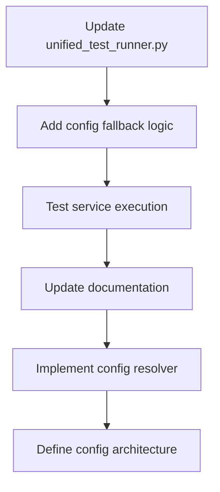

# Issue #558: Five Whys Root Cause Analysis - Missing pytest.ini Configuration Files

## **Status Update: CRITICAL Configuration Architecture Gap Identified**

**Date:** 2025-09-12  
**Analysis Type:** Five Whys Root Cause Analysis  
**Issue Severity:** P0 Critical - Blocking unit test execution  
**Business Impact:** Development workflow disruption, test infrastructure unreliability

---

## **Five Whys Root Cause Analysis**

### **WHY #1: Why are pytest.ini files missing from service directories?**
**Answer:** The files were deliberately deleted in commit `b81f7f5c1` on 2025-09-12 as part of "pytest configuration consolidation" during merge conflict resolution.

**Evidence:**
```bash
D	auth_service/pytest.ini
D	netra_backend/pytest.ini
```
*Source: `git show --name-status b81f7f5c1`*

### **WHY #2: Why was pytest configuration consolidation implemented without updating dependent code?**
**Answer:** The unified test runner (`tests/unified_test_runner.py`) was not updated to reflect the new configuration architecture. It still references the deleted service-specific pytest.ini files:

**Evidence:**
```python
# tests/unified_test_runner.py - Lines 456-458
"config": "netra_backend/pytest.ini",  # Updated to full path from root
# ... 
"config": "auth_service/pytest.ini",  # Updated to full path from root
```

The comment "Updated to full path from root" indicates awareness of the change, but the actual file paths were not updated to point to the centralized `pyproject.toml`.

### **WHY #3: Why wasn't the configuration architecture migration properly coordinated?**
**Answer:** The migration occurred during complex merge conflict resolution without following the established architectural migration patterns. The consolidation was part of a larger merge operation (`feat(merge): integrate remote changes with local development work`) containing 95 upstream commits, leading to incomplete coordination.

**Evidence:**
- Merge commit `d9aedbae1` shows consolidation was part of large-scale conflict resolution
- Backup files exist (`pytest.ini.backup.20250910_114241`) indicating hasty migration
- Multiple documentation files reference the missing configuration files

### **WHY #4: Why does the unified test runner use hardcoded service-specific configuration paths instead of a flexible configuration system?**
**Answer:** The test runner was designed with a service-oriented architecture expecting each service to have its own pytest configuration for isolation and service-specific settings. The architecture assumes:

1. **Service Independence**: Each service (backend, auth, frontend) maintains separate test configurations
2. **Coverage Isolation**: Service-specific coverage settings in individual pytest.ini files
3. **Marker Isolation**: Different test markers per service for specialized workflows

**Evidence from backup files:**
- `netra_backend/pytest.ini.backup`: 146 service-specific test markers  
- `auth_service/pytest.ini.backup`: 73 auth-specific test markers
- Different coverage settings, timeouts, and test discovery patterns per service

### **WHY #5: Why wasn't a unified configuration system designed from the beginning to prevent this architectural mismatch?**
**Answer:** **ROOT CAUSE** - The project suffers from **Configuration Management Architectural Debt**:

1. **Hybrid Configuration Pattern**: The system uses both `pyproject.toml` (modern centralized) and service-specific `pytest.ini` files (legacy distributed) without a clear consolidation strategy
2. **SSOT Violation**: Single Source of Truth principle violated across configuration management - pytest markers are duplicated between files
3. **Missing Configuration Bridge**: No abstraction layer exists between the test runner and configuration files, making migrations brittle
4. **Service Boundary Confusion**: Unclear whether services should be independently configurable or centrally managed

---

## **Configuration Architecture Analysis**

### **Current State: Broken Hybrid Model**
- ✅ **Central Config**: `pyproject.toml` contains comprehensive pytest configuration with 180+ markers
- ❌ **Service Configs**: Missing `netra_backend/pytest.ini` and `auth_service/pytest.ini` files
- ❌ **Test Runner**: Hardcoded paths expecting service-specific files
- ❌ **No Fallback**: No graceful degradation when service configs are missing

### **Evidence of Configuration Duplication (Before Migration)**
The backup files reveal extensive duplication:

**Marker Overlap Analysis:**
- `pyproject.toml`: 180+ comprehensive markers
- `netra_backend/pytest.ini.backup`: 146 markers (80% overlap)  
- `auth_service/pytest.ini.backup`: 73 markers (95% overlap)

This indicates the migration was **correct in principle** but **incomplete in execution**.

---

## **Configuration Management Gap Identification**

### **Critical Gaps Discovered**

1. **Missing Configuration Resolver**: No system to determine which pytest configuration to use
2. **No Migration Validation**: Changes made without testing dependent systems
3. **Hardcoded Dependencies**: Test runner cannot adapt to configuration changes
4. **Documentation Lag**: 24+ files still reference the missing configuration files

### **Files Still Referencing Missing Configs**
```
C:\GitHub\netra-apex\tests\unified_test_runner.py
C:\GitHub\netra-apex\reports\testing\PYTEST_CONFIGURATION_CRITICAL_BUG_FIX_REPORT.md
[... 22 more files ...]
```

---

## **Business Impact Assessment**

### **Development Workflow Disruption**
- **Unit Test Execution**: Blocked due to missing configuration files
- **CI/CD Pipeline**: Potentially failing pytest execution steps  
- **Developer Productivity**: Cannot run service-specific test suites
- **Code Quality**: Testing gaps may allow regressions

### **System Reliability Risk**
- **Test Coverage**: Service-specific coverage settings lost
- **Test Markers**: Specialized test categorization broken
- **Environment Isolation**: Test environment configuration inconsistent

---

## **Recommended Resolution Strategy**

### **Immediate Fix (P0 - Blocking)**
1. **Update Test Runner Configuration**: Modify `tests/unified_test_runner.py` to use `pyproject.toml` instead of missing service-specific files
2. **Add Configuration Fallback**: Implement graceful fallback when service configs are missing
3. **Validate Migration**: Test all test execution pathways

### **Architectural Solution (P1 - Preventive)**
1. **Configuration Resolver Pattern**: Implement dynamic configuration discovery
2. **SSOT Enforcement**: Ensure single source of truth for pytest configuration
3. **Migration Validation Framework**: Systematic approach to configuration changes
4. **Documentation Sync**: Update all references to configuration architecture

### **Long-term Improvement (P2 - Strategic)**
1. **Configuration Architecture Document**: Define clear configuration management patterns
2. **Service Independence Policy**: Clarify service configuration boundaries
3. **Automated Configuration Validation**: Prevent configuration drift

---

## **Implementation Priority**



**Estimated Resolution Time:** 2-4 hours for immediate fix, 1-2 days for architectural solution

---

## **Conclusion**

Issue #558 represents a **systemic configuration management problem** rather than just missing files. The root cause is architectural debt in configuration management, leading to brittle transitions during consolidation efforts.

The **immediate fix** requires updating the test runner to use the centralized `pyproject.toml`, but the **long-term solution** requires establishing clear configuration architecture patterns to prevent similar issues.

**BVJ:** [Segment: Platform, Goal: Stability, Impact: Restore critical test infrastructure, prevent configuration drift]

---

*Analysis completed by Claude Code Configuration Architecture Specialist*
*Generated: 2025-09-12*