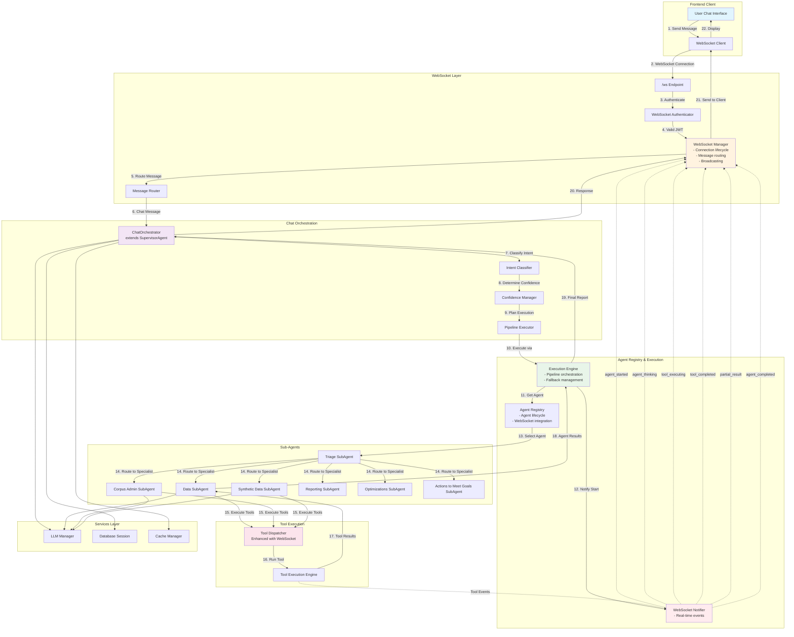

# Netra Apex Backend: User Chat Through Agent Interaction Flow

## System Overview
This diagram illustrates the primary flow of user chat messages through the Netra Apex backend system, focusing on agent interactions and WebSocket communication.

## Primary Flow Diagram



## Key Components

### 1. WebSocket Layer
- **Endpoint**: `/ws` - Main authenticated WebSocket endpoint
- **Manager**: Handles connection lifecycle, message routing, and broadcasting
- **Authentication**: JWT-based authentication for secure connections
- **Rate Limiting**: Built-in rate limiting and connection pooling

### 2. Chat Orchestrator
- **Extends**: SupervisorAgent for agent management
- **Intent Classification**: Determines user intent from messages
- **Confidence Management**: Manages confidence levels for responses
- **Pipeline Execution**: Orchestrates multi-step agent workflows

### 3. Agent Registry & Execution
- **Registry**: Manages agent lifecycle and WebSocket integration
- **Execution Engine**: Handles pipeline orchestration with fallback management
- **WebSocket Notifier**: Sends real-time events to frontend

### 4. Critical WebSocket Events
Per `SPEC/learnings/websocket_agent_integration_critical.xml`, these events MUST be sent:
1. **agent_started** - User must see agent began processing
2. **agent_thinking** - Real-time reasoning visibility  
3. **tool_executing** - Tool usage transparency
4. **tool_completed** - Tool results display
5. **agent_completed** - User must know when done

### 5. Sub-Agents
- **Triage**: Routes requests to appropriate specialist agents
- **Data**: Handles data processing and analysis
- **Corpus Admin**: Manages knowledge base operations
- **Synthetic Data**: Generates synthetic data profiles
- **Reporting**: Creates reports and analytics
- **Optimizations**: Handles optimization suggestions
- **Actions to Meet Goals**: Plans and executes goal-oriented actions

### 6. Tool Dispatcher
- **Enhanced**: Automatically enhanced with WebSocket notifications
- **Real-time Events**: Sends tool_executing and tool_completed events
- **Modular**: Clean separation between registry, execution, and validation

## Message Flow Sequence

1. User sends message via chat interface
2. WebSocket client establishes secure connection
3. Authentication validates JWT token
4. WebSocket Manager routes message to Message Router
5. Message Router identifies chat message and sends to ChatOrchestrator
6. ChatOrchestrator classifies intent and determines confidence
7. Pipeline Executor plans multi-agent execution
8. Execution Engine retrieves agents from registry
9. WebSocket Notifier sends agent_started event
10. Triage agent routes to appropriate specialist
11. Specialist agents execute tools via enhanced Tool Dispatcher
12. Tool Dispatcher sends tool_executing events
13. Tool execution completes with results
14. Tool Dispatcher sends tool_completed events
15. Agent results flow back through Execution Engine
16. ChatOrchestrator prepares final response
17. Response sent via WebSocket Manager to client
18. Client displays response to user

## Critical Integration Points

### WebSocket Enhancement
The Tool Dispatcher MUST be enhanced when WebSocket Manager is set:
```python
# In AgentRegistry.set_websocket_manager()
if self.tool_dispatcher and manager:
    enhance_tool_dispatcher_with_notifications(self.tool_dispatcher, manager)
```

### Event Flow Requirements
- All agent events must flow through WebSocketNotifier
- Tool events must flow through enhanced Tool Dispatcher
- Events must be sent in real-time, not batched
- Frontend depends on these events for UI updates

## Performance Considerations

1. **Connection Pooling**: WebSocket Manager uses TTL cache and LRU eviction
2. **Rate Limiting**: Built-in rate limiting prevents abuse
3. **Message Buffering**: Priority-based message buffering for reliability
4. **Heartbeat Management**: Automatic heartbeat for connection health
5. **Resource Monitoring**: Periodic cleanup tasks prevent memory leaks

## Testing Requirements

Per CLAUDE.md, this flow CANNOT regress:
- Run `python tests/mission_critical/test_websocket_agent_events_suite.py`
- Verify ALL event types are sent
- Test with real WebSocket connections
- Never remove or bypass WebSocket notifications