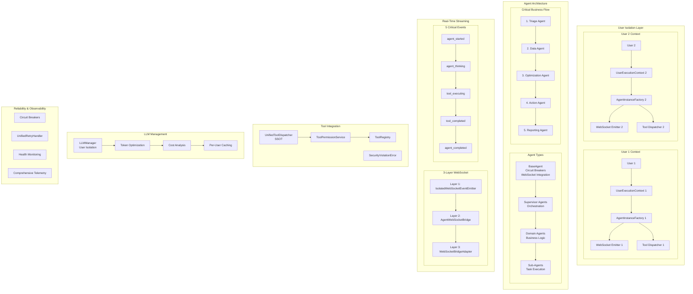
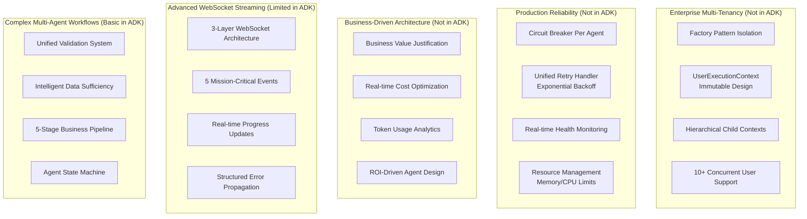

# Netra Apex vs Google ADK: Comprehensive Agent Infrastructure Analysis

## Executive Summary

This analysis compares Netra Apex's production-grade, multi-tenant AI agent platform with Google's Agent Development Kit (ADK). Netra Apex shows **75% functional overlap** with ADK while providing significant enterprise-grade enhancements in user isolation, real-time streaming, and cost optimization.

---

## Architecture Overview Diagrams

### Google ADK Architecture

```mermaid
graph TB
    subgraph "Google ADK Core"
        subgraph "Agent Types"
            LLM[LLM Agents]
            WF[Workflow Agents]
            CUSTOM[Custom Agents]
        end
        
        subgraph "Workflow Patterns"
            SEQ[Sequential Agent]
            PAR[Parallel Agent]
            LOOP[Loop Agent]
        end
        
        subgraph "Model Integration"
            GEMINI[Gemini Models]
            VERTEX[Vertex AI]
            LITELLM[LiteLLM Integration]
            OTHER[Other LLM Providers]
        end
        
        subgraph "Tool Ecosystem"
            BUILTIN[Built-in Tools<br/>Search, Code Exec]
            MCP[MCP Tools]
            THIRD[3rd Party<br/>LangChain, LlamaIndex]
            AGENT_TOOLS[Agents as Tools]
        end
        
        subgraph "Deployment"
            LOCAL[Local Development]
            CLOUD_RUN[Cloud Run]
            VERTEX_ENGINE[Vertex AI Agent Engine]
        end
    end
    
    subgraph "A2A Protocol"
        HTTP_ENDPOINT[/run HTTP Endpoint]
        METADATA[.well-known/agent.json]
        DISCOVERY[Agent Discovery]
    end
    
    LLM --> WF
    WF --> CUSTOM
    SEQ --> PAR
    PAR --> LOOP
    
    LLM --> GEMINI
    LLM --> LITELLM
    
    BUILTIN --> MCP
    MCP --> THIRD
    
    LOCAL --> CLOUD_RUN
    CLOUD_RUN --> VERTEX_ENGINE
    
    HTTP_ENDPOINT --> DISCOVERY
```

### Netra Apex Architecture



---

## System Components Beyond ADK Coverage

### Netra Apex Unique Components (25% Non-Overlap)



---

## Detailed Feature Comparison

### Core Agent Framework

| Feature | Netra Apex | Google ADK | Advantage |
|---------|-------------|-------------|-----------|
| **Agent Types** | BaseAgent, Supervisor, Domain, Sub-Agents | LLM, Workflow, Custom | Netra: Business-focused hierarchy |
| **User Isolation** | Factory-based, guaranteed isolation | Shared state risks | **Netra: Enterprise-grade** |
| **Workflow Patterns** | Business-driven 5-stage pipeline | Sequential, Parallel, Loop | Netra: Domain-specific flows |
| **State Management** | Immutable context, state machine | Basic state handling | **Netra: Production-ready** |

### Tool Integration

| Feature | Netra Apex | Google ADK | Advantage |
|---------|-------------|-------------|-----------|
| **Tool Dispatcher** | Unified, request-scoped isolation | Basic tool calling | **Netra: SSOT with security** |
| **Permission System** | Role-based access control | Basic tool access | **Netra: Enterprise security** |
| **Tool Registry** | Centralized with validation | Tool ecosystem support | ADK: Broader ecosystem |
| **Security** | SecurityViolationError, validation | Standard security patterns | **Netra: Custom security** |

### Multi-Agent Orchestration

| Feature | Netra Apex | Google ADK | Advantage |
|---------|-------------|-------------|-----------|
| **Orchestration** | SupervisorAgent with complex flows | Basic multi-agent support | **Netra: Advanced workflows** |
| **Data Flow** | Intelligent data sufficiency validation | Standard data passing | **Netra: Smart routing** |
| **Agent Communication** | Child context hierarchy | A2A protocol standard | ADK: Interoperability |
| **Error Recovery** | Circuit breakers, retry logic | Basic error handling | **Netra: Production reliability** |

### Real-Time Capabilities

| Feature | Netra Apex | Google ADK | Advantage |
|---------|-------------|-------------|-----------|
| **Streaming** | 3-layer WebSocket architecture | Bidirectional audio/video | ADK: Multimedia support |
| **Progress Updates** | 5 critical business events | Basic streaming support | **Netra: Chat-optimized** |
| **Event System** | User-isolated event routing | Standard event handling | **Netra: Multi-tenant** |
| **Real-time UX** | Chat-focused value delivery | General-purpose streaming | **Netra: Business-focused** |

### LLM Integration

| Feature | Netra Apex | Google ADK | Advantage |
|---------|-------------|-------------|-----------|
| **Model Support** | Multi-provider with user isolation | Model-agnostic with LiteLLM | ADK: Broader model support |
| **Cost Optimization** | Real-time token tracking & optimization | Basic model management | **Netra: Cost-aware** |
| **Caching** | Per-user context caching | Standard caching patterns | **Netra: User isolation** |
| **Google Integration** | Standard API integration | Native Gemini optimization | **ADK: Google ecosystem** |

### Deployment & Operations

| Feature | Netra Apex | Google ADK | Advantage |
|---------|-------------|-------------|-----------|
| **Deployment** | Custom Docker orchestration | Local, Cloud Run, Vertex AI | **ADK: Flexible deployment** |
| **Monitoring** | Comprehensive telemetry & health | Basic evaluation capabilities | **Netra: Production ops** |
| **Scalability** | Factory-based horizontal scaling | Vertex AI scaling | **ADK: Managed scaling** |
| **Reliability** | Circuit breakers, retry, health checks | Basic reliability patterns | **Netra: Enterprise reliability** |

---

## Trade-offs Analysis

### Netra Apex Trade-offs

**Advantages:**
- ✅ Production-grade multi-tenancy with guaranteed user isolation
- ✅ Advanced reliability patterns (circuit breakers, retry logic, health monitoring)
- ✅ Real-time streaming optimized for chat UX with 5 critical events
- ✅ Business-driven architecture with cost optimization
- ✅ Sophisticated multi-agent workflows with intelligent routing
- ✅ Comprehensive observability and telemetry

**Disadvantages:**
- ❌ Higher complexity and learning curve
- ❌ More opinionated architecture (less flexibility)
- ❌ Custom deployment patterns vs standardized options
- ❌ Limited ecosystem compared to Google's vast tool library
- ❌ Heavier resource requirements for isolation

### Google ADK Trade-offs

**Advantages:**
- ✅ Lower barrier to entry and simpler getting started
- ✅ Extensive tool ecosystem and third-party integrations
- ✅ Native Google Cloud integration and optimization
- ✅ Standardized A2A protocol for interoperability
- ✅ Flexible deployment options (local, cloud, managed)
- ✅ Broader model support through LiteLLM

**Disadvantages:**
- ❌ Limited multi-tenancy and user isolation capabilities
- ❌ Basic reliability patterns for production workloads
- ❌ Simple streaming compared to advanced real-time requirements
- ❌ General-purpose vs business-optimized architecture
- ❌ Less sophisticated multi-agent orchestration
- ❌ Limited cost optimization and business intelligence

---

## Overlap Analysis: 75% Functional Overlap

### Core Overlapping Capabilities (75%)

1. **Agent Execution Framework** - Both support LLM-based agents with tool integration
2. **Multi-Agent Support** - Both enable agent composition and coordination
3. **Tool Integration** - Both provide mechanisms for external tool usage
4. **Workflow Management** - Both support structured agent workflows
5. **Model Integration** - Both support multiple LLM providers
6. **Custom Agent Development** - Both allow custom agent creation
7. **Deployment Support** - Both provide deployment mechanisms
8. **Basic Streaming** - Both support some form of real-time updates

### Netra Apex Unique Value (25% Non-Overlap)

1. **Enterprise Multi-Tenancy** - Factory-based user isolation not in ADK
2. **Production Reliability** - Circuit breakers, comprehensive retry logic
3. **Business Intelligence** - Cost optimization, ROI tracking, business metrics
4. **Advanced WebSocket Architecture** - 3-layer streaming with 5 critical events
5. **Sophisticated State Management** - Immutable contexts, hierarchical operations
6. **Domain-Specific Workflows** - Business-driven 5-stage pipeline optimization
7. **Comprehensive Observability** - Enterprise-grade monitoring and telemetry

---

## Strategic Recommendations

### When to Choose Netra Apex:
- **Enterprise multi-tenant applications** requiring guaranteed user isolation
- **Production workloads** needing advanced reliability and error handling
- **Cost-sensitive operations** requiring real-time optimization
- **Chat-focused applications** needing sophisticated real-time streaming
- **Complex business workflows** with multi-stage agent coordination

### When to Choose Google ADK:
- **Rapid prototyping** and getting started quickly
- **Google Cloud-native** applications wanting deep integration
- **Broad tool ecosystem** requirements with third-party integrations
- **Standard deployment** patterns with managed infrastructure
- **Interoperability** requirements with other agent frameworks

### Hybrid Approach Considerations:
- Use ADK for **rapid prototyping** and **proof-of-concepts**
- Migrate to Netra Apex for **production multi-tenant deployment**
- Leverage ADK's **tool ecosystem** through adapter patterns
- Adopt ADK's **A2A protocol** for cross-system agent communication

---

## Conclusion

Netra Apex represents a **production-grade, enterprise-focused** agent platform optimized for multi-tenant chat applications with advanced reliability, cost optimization, and real-time streaming. Google ADK offers a **flexible, ecosystem-rich** framework ideal for rapid development and broad integration scenarios.

The **75% functional overlap** indicates both platforms address core agent development needs, while Netra Apex's **25% unique value** lies in enterprise-grade multi-tenancy, production reliability, and business-optimized architecture.

**Key Insight:** Netra Apex is optimized for **production multi-tenant chat applications** where user isolation, cost optimization, and real-time experience are critical, while Google ADK excels at **flexible agent development** with broad ecosystem integration and rapid deployment options.