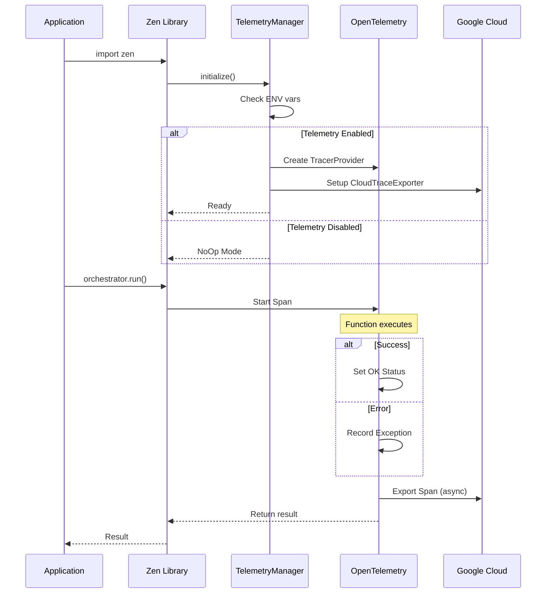
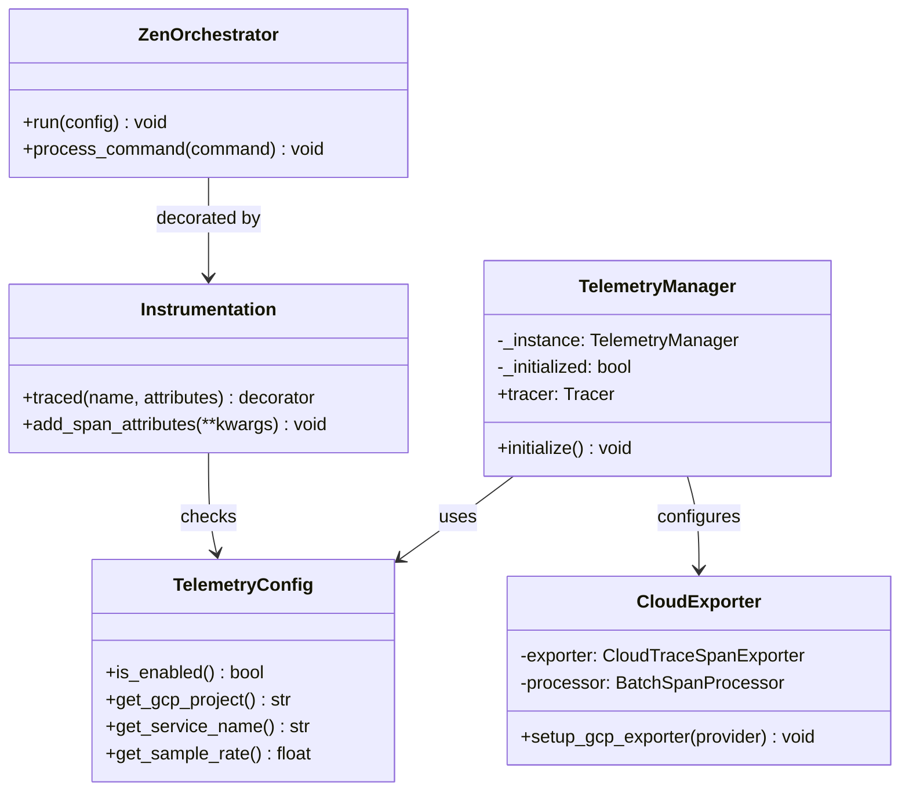
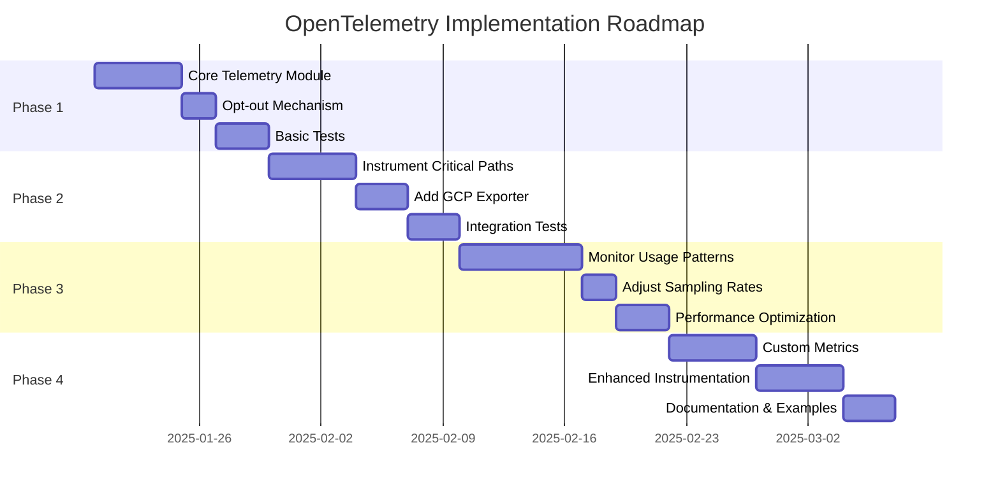

# OpenTelemetry Implementation Plan for Zen Library

## Overview
Implement minimal OpenTelemetry data capture for the Zen library with automatic Google Cloud export, enabled by default with opt-out capability.

## System Architecture

```mermaid
graph TB
    subgraph "Zen Library"
        A[User Application] --> B[zen/__init__.py]
        B -->|Auto-initialize| C[TelemetryManager]
        C -->|Check env vars| D{Telemetry Enabled?}
        D -->|Yes| E[Initialize TracerProvider]
        D -->|No| F[NoOp Tracer]
        E --> G[Configure GCP Exporter]
        G --> H[BatchSpanProcessor]
        H -->|Async export| I[Google Cloud Trace]
    end

    subgraph "Instrumented Functions"
        J[@traced decorator] --> K[Function Execution]
        K --> L{Success?}
        L -->|Yes| M[Set OK Status]
        L -->|No| N[Record Exception]
        M --> O[Create Span]
        N --> O
        O --> H
    end

    style A fill:#f9f,stroke:#333,stroke-width:2px
    style I fill:#9cf,stroke:#333,stroke-width:2px
    style D fill:#ff9,stroke:#333,stroke-width:2px
```

## Component Flow Diagram


## Data Flow Diagram



## Class Diagram



## Architecture Design

### Core Components

1. **Telemetry Module** (`zen/telemetry/__init__.py`)
   - Singleton telemetry manager
   - Lazy initialization on first use
   - Automatic shutdown handling

2. **Configuration** (`zen/telemetry/config.py`)
   - Environment variable checking for opt-out
   - Google Cloud project detection
   - Service name and version configuration

3. **Instrumentation** (`zen/telemetry/instrumentation.py`)
   - Decorator for automatic tracing
   - Context propagation helpers
   - Error capture and reporting

## Implementation Steps

### Step 1: Add Dependencies
Update `pyproject.toml` or `requirements.txt`:
```python
opentelemetry-api>=1.20.0
opentelemetry-sdk>=1.20.0
opentelemetry-exporter-gcp-trace>=1.6.0
opentelemetry-instrumentation>=0.41b0
```

### Step 2: Create Telemetry Module Structure
```
zen/
├── telemetry/
│   ├── __init__.py       # Main telemetry interface
│   ├── config.py         # Configuration and opt-out logic
│   ├── exporter.py       # Google Cloud exporter setup
│   └── instrumentation.py # Decorators and helpers
```

### Step 3: Implement Configuration Module
```python
# zen/telemetry/config.py
import os
from typing import Optional

class TelemetryConfig:
    @staticmethod
    def is_enabled() -> bool:
        """Check if telemetry is enabled (default: True)"""
        opt_out = os.environ.get('ZEN_TELEMETRY_DISABLED', '').lower()
        return opt_out not in ('true', '1', 'yes')

    @staticmethod
    def get_gcp_project() -> Optional[str]:
        """Get GCP project from environment or metadata"""
        return os.environ.get('GOOGLE_CLOUD_PROJECT') or \
               os.environ.get('GCP_PROJECT') or \
               _detect_gcp_project()

    @staticmethod
    def get_service_name() -> str:
        """Get service name for telemetry"""
        return os.environ.get('ZEN_SERVICE_NAME', 'zen-library')
```

### Step 4: Implement Telemetry Manager
```python
# zen/telemetry/__init__.py
from opentelemetry import trace
from opentelemetry.sdk.trace import TracerProvider
from opentelemetry.sdk.resources import Resource
from .config import TelemetryConfig
from .exporter import setup_gcp_exporter

class TelemetryManager:
    _instance = None
    _initialized = False

    def __new__(cls):
        if cls._instance is None:
            cls._instance = super().__new__(cls)
        return cls._instance

    def initialize(self):
        """Initialize telemetry if enabled"""
        if self._initialized or not TelemetryConfig.is_enabled():
            return

        # Create resource with service metadata
        resource = Resource.create({
            "service.name": TelemetryConfig.get_service_name(),
            "service.version": get_zen_version(),
            "telemetry.sdk.language": "python",
            "telemetry.sdk.name": "opentelemetry",
        })

        # Setup tracer provider
        provider = TracerProvider(resource=resource)

        # Add GCP exporter if project is available
        if TelemetryConfig.get_gcp_project():
            setup_gcp_exporter(provider)

        trace.set_tracer_provider(provider)
        self._initialized = True

    @property
    def tracer(self):
        """Get tracer instance"""
        self.initialize()
        if TelemetryConfig.is_enabled():
            return trace.get_tracer(__name__)
        return NoOpTracer()

# Global instance
telemetry = TelemetryManager()
```

### Step 5: Implement Google Cloud Exporter
```python
# zen/telemetry/exporter.py
from opentelemetry.exporter.cloud_trace import CloudTraceSpanExporter
from opentelemetry.sdk.trace.export import BatchSpanProcessor
import logging

logger = logging.getLogger(__name__)

def setup_gcp_exporter(provider):
    """Setup Google Cloud Trace exporter"""
    try:
        exporter = CloudTraceSpanExporter()
        processor = BatchSpanProcessor(
            exporter,
            max_queue_size=2048,
            max_export_batch_size=512,
            schedule_delay_millis=5000,
        )
        provider.add_span_processor(processor)
        logger.debug("Google Cloud Trace exporter configured")
    except Exception as e:
        logger.warning(f"Failed to setup GCP exporter: {e}")
```

### Step 6: Create Instrumentation Decorators
```python
# zen/telemetry/instrumentation.py
from functools import wraps
from opentelemetry import trace
from .config import TelemetryConfig

def traced(name: str = None, attributes: dict = None):
    """Decorator to add tracing to functions"""
    def decorator(func):
        @wraps(func)
        def wrapper(*args, **kwargs):
            if not TelemetryConfig.is_enabled():
                return func(*args, **kwargs)

            tracer = trace.get_tracer(__name__)
            span_name = name or f"{func.__module__}.{func.__name__}"

            with tracer.start_as_current_span(
                span_name,
                attributes=attributes or {}
            ) as span:
                try:
                    result = func(*args, **kwargs)
                    span.set_status(trace.Status(trace.StatusCode.OK))
                    return result
                except Exception as e:
                    span.record_exception(e)
                    span.set_status(
                        trace.Status(trace.StatusCode.ERROR, str(e))
                    )
                    raise

        return wrapper
    return decorator

def add_span_attributes(**attributes):
    """Add attributes to current span"""
    if not TelemetryConfig.is_enabled():
        return

    span = trace.get_current_span()
    if span:
        for key, value in attributes.items():
            span.set_attribute(key, value)
```

### Step 7: Integrate with Core Zen Functions
```python
# zen_orchestrator.py (example integration)
from zen.telemetry.instrumentation import traced

class ZenOrchestrator:
    @traced("zen.orchestrator.run", {"operation": "main_loop"})
    def run(self, config):
        """Main orchestration loop with telemetry"""
        # Existing implementation
        pass

    @traced("zen.orchestrator.process_command")
    def process_command(self, command):
        """Process command with telemetry"""
        # Existing implementation
        pass
```

### Step 8: Auto-initialization
```python
# zen/__init__.py (add to existing file)
from .telemetry import telemetry

# Initialize telemetry on import
telemetry.initialize()
```

## Usage Examples

### Default Behavior (Telemetry Enabled)
```python
import zen

# Telemetry is automatically initialized and sending to GCP
orchestrator = zen.ZenOrchestrator()
orchestrator.run(config)  # Traced automatically
```

### Opt-Out via Environment Variable
```bash
# Disable telemetry
export ZEN_TELEMETRY_DISABLED=true

# Or
export ZEN_TELEMETRY_DISABLED=1

# Run application - no telemetry data collected
python my_app.py
```

### Custom Instrumentation
```python
from zen.telemetry.instrumentation import traced, add_span_attributes

@traced("custom.operation")
def my_function():
    add_span_attributes(
        user_id="123",
        operation_type="batch_process"
    )
    # Function logic
```

## Environment Variables

| Variable | Description | Default |
|----------|-------------|---------|
| `ZEN_TELEMETRY_DISABLED` | Set to `true`, `1`, or `yes` to disable telemetry | `false` (enabled) |
| `GOOGLE_CLOUD_PROJECT` | GCP project ID for trace export | Auto-detected |
| `ZEN_SERVICE_NAME` | Service name in traces | `zen-library` |
| `ZEN_TELEMETRY_SAMPLE_RATE` | Sampling rate (0.0-1.0) | `0.1` (10%) |

## Privacy and Security Considerations

1. **No PII Collection**: Only collect technical metrics (latency, error rates, function names)
2. **Sampling**: Default 10% sampling rate to minimize overhead
3. **Secure Transport**: All data sent over HTTPS to Google Cloud
4. **Data Retention**: Follow Google Cloud's default retention policies (30 days)
5. **Opt-Out First**: Easy, documented opt-out mechanism

## Performance Impact

- **Minimal Overhead**: < 1% CPU overhead with default sampling
- **Async Export**: Telemetry export happens in background threads
- **Bounded Queues**: Prevents memory issues under high load
- **Automatic Batching**: Reduces network calls

## Testing

### Unit Tests
```python
# tests/test_telemetry.py
import os
import pytest
from zen.telemetry.config import TelemetryConfig

def test_opt_out():
    os.environ['ZEN_TELEMETRY_DISABLED'] = 'true'
    assert not TelemetryConfig.is_enabled()

def test_default_enabled():
    os.environ.pop('ZEN_TELEMETRY_DISABLED', None)
    assert TelemetryConfig.is_enabled()
```

### Integration Tests
```python
def test_gcp_export():
    # Mock GCP exporter
    # Verify spans are exported correctly
    pass
```

## Rollout Plan



## Telemetry Decision Tree


## Documentation Updates

Update README.md with:
- Telemetry section explaining default behavior
- Opt-out instructions prominently displayed
- Link to this implementation plan
- Privacy policy statement

## Monitoring and Alerts

Set up in Google Cloud:
- Dashboard for library usage metrics
- Error rate alerts
- Performance degradation alerts
- Usage anomaly detection