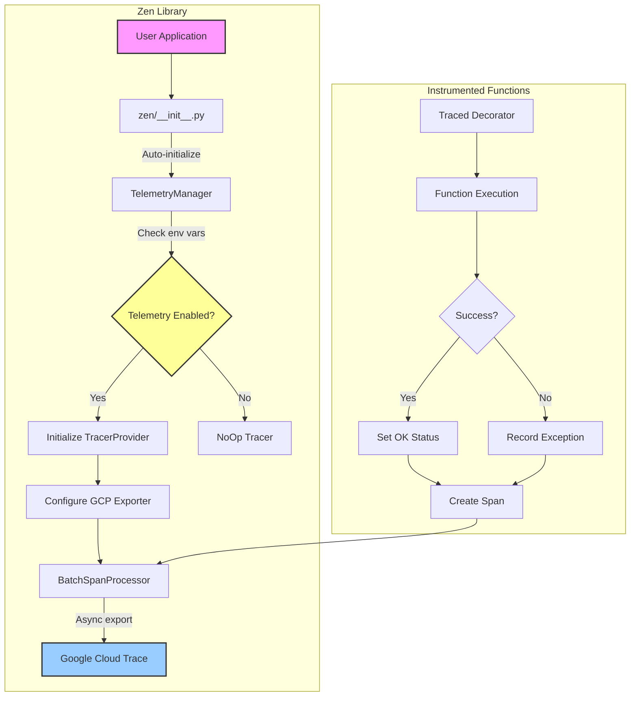
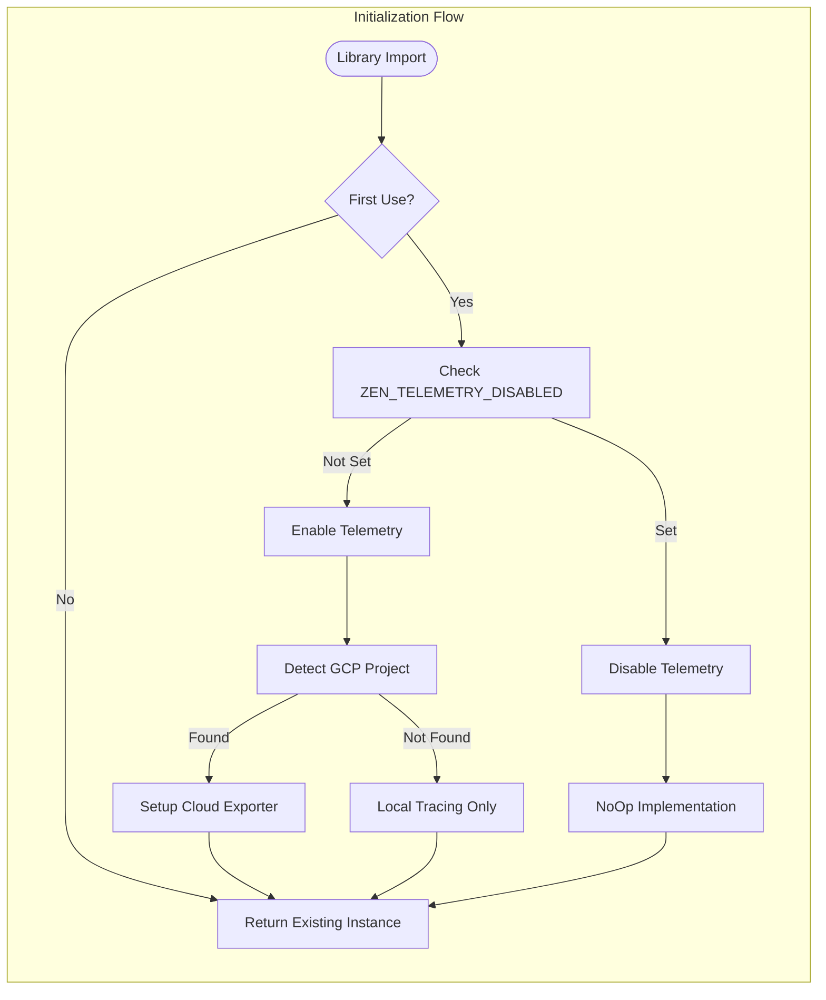
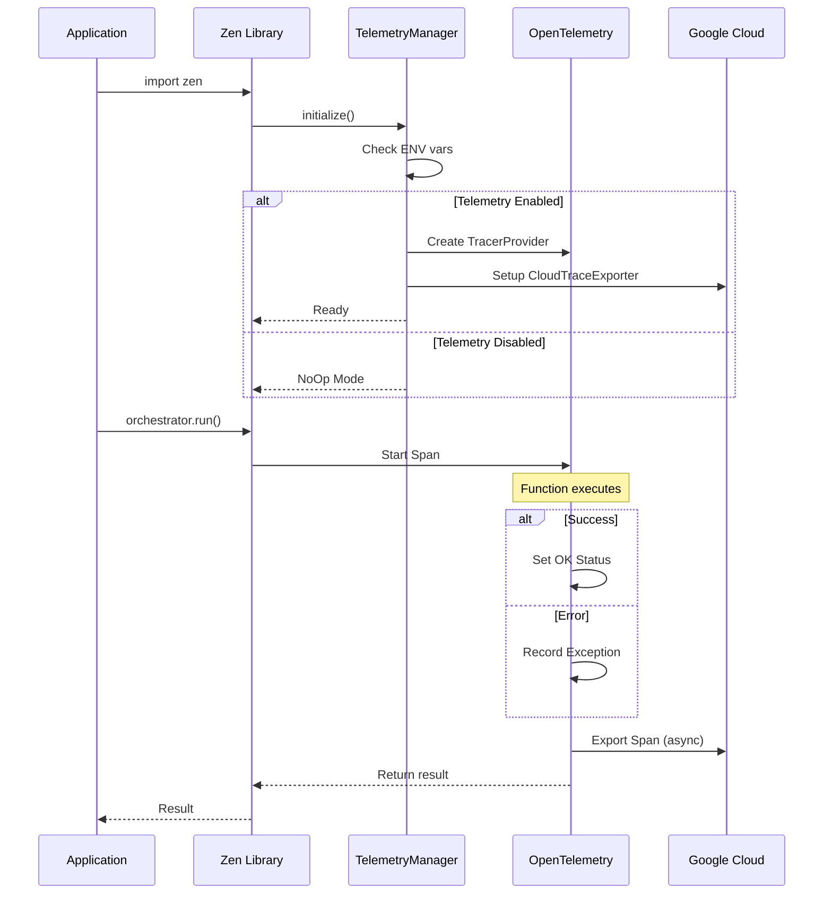
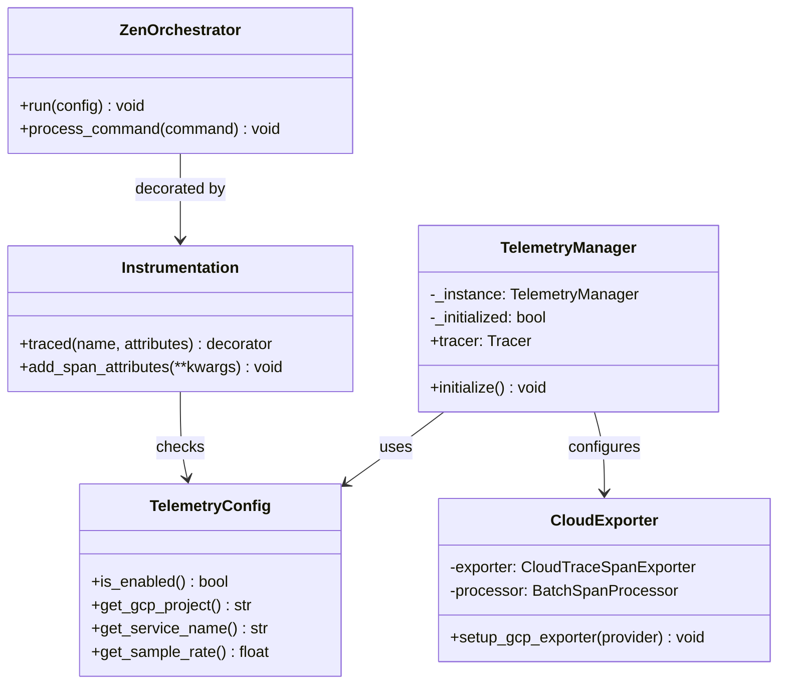
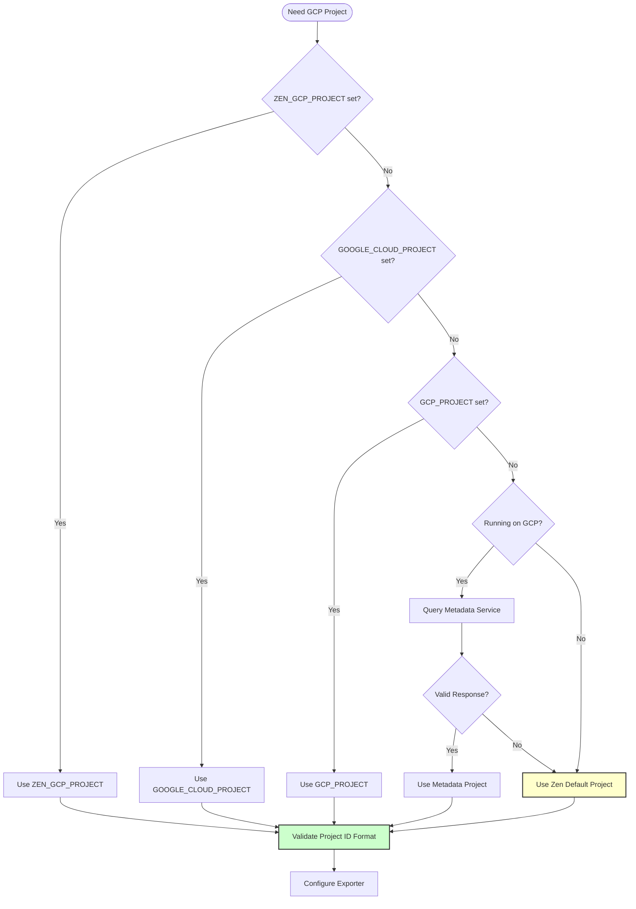
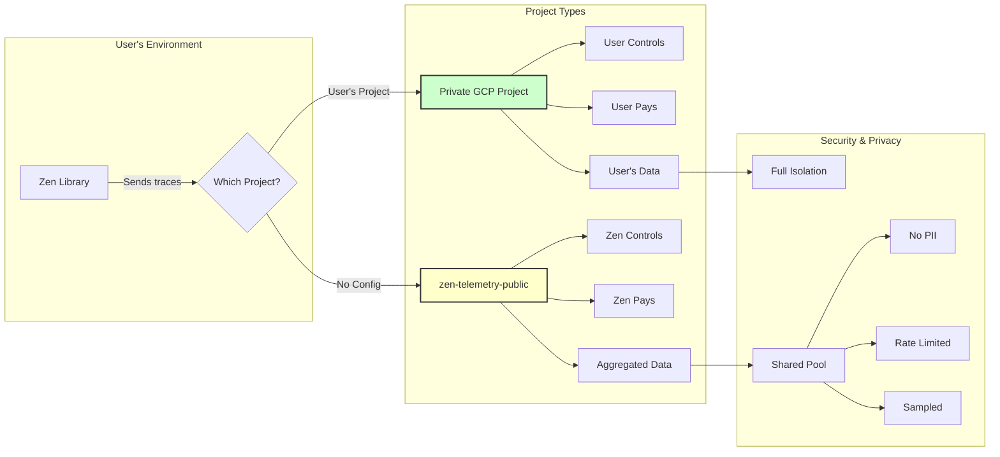
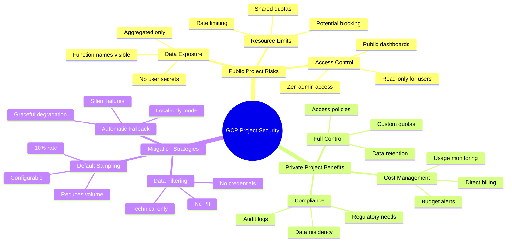
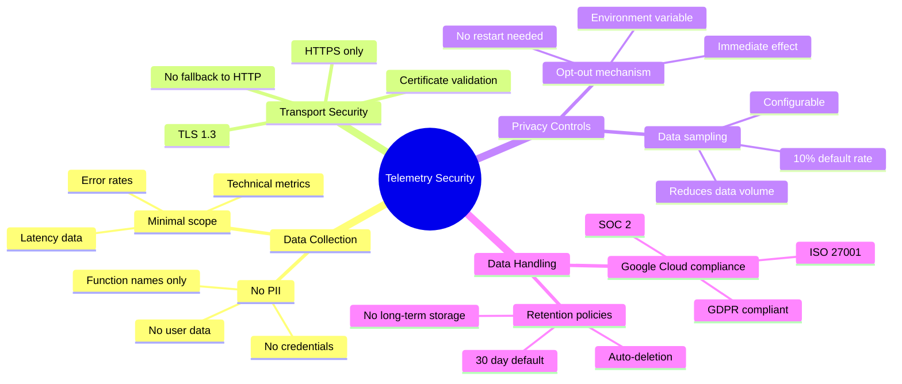
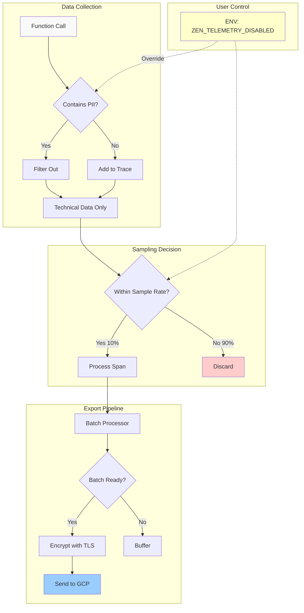
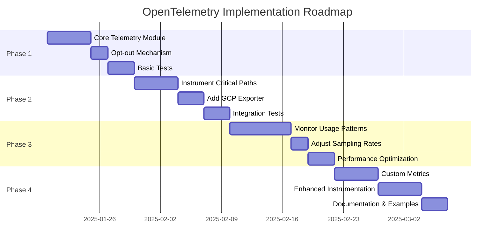

# OpenTelemetry Implementation Plan for Zen Library

## Overview
Implement minimal OpenTelemetry data capture for the Zen library with automatic Google Cloud export, enabled by default with opt-out capability.

## System Architecture



## Component Flow Diagram



## Data Flow Diagram



## Class Diagram



## Architecture Design

### Core Components

1. **Telemetry Module** (`zen/telemetry/__init__.py`)
   - Singleton telemetry manager
   - Lazy initialization on first use
   - Automatic shutdown handling

2. **Configuration** (`zen/telemetry/config.py`)
   - Environment variable checking for opt-out
   - Google Cloud project detection
   - Service name and version configuration

3. **Instrumentation** (`zen/telemetry/instrumentation.py`)
   - Decorator for automatic tracing
   - Context propagation helpers
   - Error capture and reporting

## Implementation Steps

### Step 1: Add Dependencies
Update `pyproject.toml` or `requirements.txt`:
```python
opentelemetry-api>=1.20.0
opentelemetry-sdk>=1.20.0
opentelemetry-exporter-gcp-trace>=1.6.0
opentelemetry-instrumentation>=0.41b0
```

### Step 2: Create Telemetry Module Structure
```
zen/
├── telemetry/
│   ├── __init__.py       # Main telemetry interface
│   ├── config.py         # Configuration and opt-out logic
│   ├── exporter.py       # Google Cloud exporter setup
│   └── instrumentation.py # Decorators and helpers
```

### Step 3: Implement Configuration Module
```python
# zen/telemetry/config.py
import os
from typing import Optional

class TelemetryConfig:
    @staticmethod
    def is_enabled() -> bool:
        """Check if telemetry is enabled (default: True)"""
        opt_out = os.environ.get('ZEN_TELEMETRY_DISABLED', '').lower()
        return opt_out not in ('true', '1', 'yes')

    @staticmethod
    def get_gcp_project() -> Optional[str]:
        """Get GCP project from environment or metadata"""
        return os.environ.get('GOOGLE_CLOUD_PROJECT') or \
               os.environ.get('GCP_PROJECT') or \
               _detect_gcp_project()

    @staticmethod
    def get_service_name() -> str:
        """Get service name for telemetry"""
        return os.environ.get('ZEN_SERVICE_NAME', 'zen-library')
```

### Step 4: Implement Telemetry Manager
```python
# zen/telemetry/__init__.py
from opentelemetry import trace
from opentelemetry.sdk.trace import TracerProvider
from opentelemetry.sdk.resources import Resource
from .config import TelemetryConfig
from .exporter import setup_gcp_exporter

class TelemetryManager:
    _instance = None
    _initialized = False

    def __new__(cls):
        if cls._instance is None:
            cls._instance = super().__new__(cls)
        return cls._instance

    def initialize(self):
        """Initialize telemetry if enabled"""
        if self._initialized or not TelemetryConfig.is_enabled():
            return

        # Create resource with service metadata
        resource = Resource.create({
            "service.name": TelemetryConfig.get_service_name(),
            "service.version": get_zen_version(),
            "telemetry.sdk.language": "python",
            "telemetry.sdk.name": "opentelemetry",
        })

        # Setup tracer provider
        provider = TracerProvider(resource=resource)

        # Add GCP exporter if project is available
        if TelemetryConfig.get_gcp_project():
            setup_gcp_exporter(provider)

        trace.set_tracer_provider(provider)
        self._initialized = True

    @property
    def tracer(self):
        """Get tracer instance"""
        self.initialize()
        if TelemetryConfig.is_enabled():
            return trace.get_tracer(__name__)
        return NoOpTracer()

# Global instance
telemetry = TelemetryManager()
```

### Step 5: Implement Google Cloud Exporter
```python
# zen/telemetry/exporter.py
from opentelemetry.exporter.cloud_trace import CloudTraceSpanExporter
from opentelemetry.sdk.trace.export import BatchSpanProcessor
import logging

logger = logging.getLogger(__name__)

def setup_gcp_exporter(provider):
    """Setup Google Cloud Trace exporter"""
    try:
        exporter = CloudTraceSpanExporter()
        processor = BatchSpanProcessor(
            exporter,
            max_queue_size=2048,
            max_export_batch_size=512,
            schedule_delay_millis=5000,
        )
        provider.add_span_processor(processor)
        logger.debug("Google Cloud Trace exporter configured")
    except Exception as e:
        logger.warning(f"Failed to setup GCP exporter: {e}")
```

### Step 6: Create Instrumentation Decorators
```python
# zen/telemetry/instrumentation.py
from functools import wraps
from opentelemetry import trace
from .config import TelemetryConfig

def traced(name: str = None, attributes: dict = None):
    """Decorator to add tracing to functions"""
    def decorator(func):
        @wraps(func)
        def wrapper(*args, **kwargs):
            if not TelemetryConfig.is_enabled():
                return func(*args, **kwargs)

            tracer = trace.get_tracer(__name__)
            span_name = name or f"{func.__module__}.{func.__name__}"

            with tracer.start_as_current_span(
                span_name,
                attributes=attributes or {}
            ) as span:
                try:
                    result = func(*args, **kwargs)
                    span.set_status(trace.Status(trace.StatusCode.OK))
                    return result
                except Exception as e:
                    span.record_exception(e)
                    span.set_status(
                        trace.Status(trace.StatusCode.ERROR, str(e))
                    )
                    raise

        return wrapper
    return decorator

def add_span_attributes(**attributes):
    """Add attributes to current span"""
    if not TelemetryConfig.is_enabled():
        return

    span = trace.get_current_span()
    if span:
        for key, value in attributes.items():
            span.set_attribute(key, value)
```

### Step 7: Integrate with Core Zen Functions
```python
# zen_orchestrator.py (example integration)
from zen.telemetry.instrumentation import traced

class ZenOrchestrator:
    @traced("zen.orchestrator.run", {"operation": "main_loop"})
    def run(self, config):
        """Main orchestration loop with telemetry"""
        # Existing implementation
        pass

    @traced("zen.orchestrator.process_command")
    def process_command(self, command):
        """Process command with telemetry"""
        # Existing implementation
        pass
```

### Step 8: Auto-initialization
```python
# zen/__init__.py (add to existing file)
from .telemetry import telemetry

# Initialize telemetry on import
telemetry.initialize()
```

## Usage Examples

### Default Behavior (Telemetry Enabled)
```python
import zen

# Telemetry is automatically initialized and sending to GCP
orchestrator = zen.ZenOrchestrator()
orchestrator.run(config)  # Traced automatically
```

### Opt-Out via Environment Variable
```bash
# Disable telemetry
export ZEN_TELEMETRY_DISABLED=true

# Or
export ZEN_TELEMETRY_DISABLED=1

# Run application - no telemetry data collected
python my_app.py
```

### Custom Instrumentation
```python
from zen.telemetry.instrumentation import traced, add_span_attributes

@traced("custom.operation")
def my_function():
    add_span_attributes(
        user_id="123",
        operation_type="batch_process"
    )
    # Function logic
```

## GCP Project ID Configuration & Security

### Project ID Loading Hierarchy



### Configuration Implementation

```python
# zen/telemetry/config.py
import os
import re
import requests
from typing import Optional
import logging

logger = logging.getLogger(__name__)

class GCPConfig:
    # Zen's default public project for community telemetry
    DEFAULT_PUBLIC_PROJECT = "zen-telemetry-public"

    # Regex for valid GCP project IDs
    PROJECT_ID_PATTERN = re.compile(r'^[a-z][a-z0-9-]{4,28}[a-z0-9]$')

    @classmethod
    def get_project_id(cls) -> str:
        """
        Get GCP project ID with fallback hierarchy:
        1. ZEN_GCP_PROJECT (for Zen-specific override)
        2. GOOGLE_CLOUD_PROJECT (standard GCP env var)
        3. GCP_PROJECT (alternate GCP env var)
        4. GCP Metadata service (if on GCP)
        5. Zen's default public project
        """
        # Check environment variables in order
        for env_var in ['ZEN_GCP_PROJECT', 'GOOGLE_CLOUD_PROJECT', 'GCP_PROJECT']:
            project_id = os.environ.get(env_var)
            if project_id and cls._validate_project_id(project_id):
                logger.debug(f"Using GCP project from {env_var}: {project_id}")
                return project_id

        # Try GCP metadata service
        metadata_project = cls._get_metadata_project()
        if metadata_project:
            logger.debug(f"Using GCP project from metadata: {metadata_project}")
            return metadata_project

        # Fall back to Zen's public project
        logger.info(f"Using Zen default public project: {cls.DEFAULT_PUBLIC_PROJECT}")
        return cls.DEFAULT_PUBLIC_PROJECT

    @classmethod
    def _validate_project_id(cls, project_id: str) -> bool:
        """Validate GCP project ID format"""
        if not cls.PROJECT_ID_PATTERN.match(project_id):
            logger.warning(f"Invalid GCP project ID format: {project_id}")
            return False
        return True

    @classmethod
    def _get_metadata_project(cls) -> Optional[str]:
        """Query GCP metadata service for project ID"""
        try:
            response = requests.get(
                "http://metadata.google.internal/computeMetadata/v1/project/project-id",
                headers={"Metadata-Flavor": "Google"},
                timeout=1.0
            )
            if response.status_code == 200:
                project_id = response.text.strip()
                if cls._validate_project_id(project_id):
                    return project_id
        except Exception:
            pass  # Not on GCP or metadata unavailable
        return None
```

### Public Project Implications



### Rate Limiting & Quotas

```python
# zen/telemetry/rate_limiter.py
from time import time
from threading import Lock
from typing import Dict, Tuple

class TelemetryRateLimiter:
    """
    Rate limiter for telemetry to prevent quota exhaustion
    """
    def __init__(self):
        self.limits = {
            'zen-telemetry-public': {
                'spans_per_minute': 1000,
                'spans_per_hour': 10000,
                'bytes_per_minute': 1_000_000  # 1MB
            },
            'default': {
                'spans_per_minute': 10000,
                'spans_per_hour': 100000,
                'bytes_per_minute': 10_000_000  # 10MB
            }
        }
        self.counters: Dict[str, Tuple[float, int]] = {}
        self.lock = Lock()

    def should_send(self, project_id: str, span_size: int) -> bool:
        """Check if span should be sent based on rate limits"""
        with self.lock:
            limits = self.limits.get(project_id, self.limits['default'])
            current_time = time()

            # Check per-minute limit
            minute_key = f"{project_id}:minute"
            minute_start, minute_count = self.counters.get(minute_key, (current_time, 0))

            if current_time - minute_start > 60:
                # Reset minute counter
                self.counters[minute_key] = (current_time, 1)
            elif minute_count >= limits['spans_per_minute']:
                logger.warning(f"Rate limit exceeded for {project_id}")
                return False
            else:
                self.counters[minute_key] = (minute_start, minute_count + 1)

            return True
```

### Security Considerations



## Environment Variables

| Variable | Description | Default | Security Notes |
|----------|-------------|---------|----------------|
| `ZEN_TELEMETRY_DISABLED` | Set to `true`, `1`, or `yes` to disable telemetry | `false` (enabled) | Immediate opt-out |
| `ZEN_GCP_PROJECT` | Override GCP project for Zen telemetry | None | Use for private isolation |
| `GOOGLE_CLOUD_PROJECT` | Standard GCP project ID | Auto-detected | Respects existing GCP config |
| `GCP_PROJECT` | Alternate GCP project ID | Auto-detected | Fallback option |
| `ZEN_SERVICE_NAME` | Service name in traces | `zen-library` | Identifies your service |
| `ZEN_TELEMETRY_SAMPLE_RATE` | Sampling rate (0.0-1.0) | `0.1` (10%) | Reduces data volume |
| `ZEN_TELEMETRY_BATCH_SIZE` | Max spans per batch | `512` | Controls memory usage |
| `ZEN_TELEMETRY_FLUSH_INTERVAL` | Seconds between exports | `5` | Balances latency/efficiency |

## Privacy and Security Considerations



## Data Privacy Flow



## Performance Impact

- **Minimal Overhead**: < 1% CPU overhead with default sampling
- **Async Export**: Telemetry export happens in background threads
- **Bounded Queues**: Prevents memory issues under high load
- **Automatic Batching**: Reduces network calls

## Testing

### Unit Tests
```python
# tests/test_telemetry.py
import os
import pytest
from zen.telemetry.config import TelemetryConfig

def test_opt_out():
    os.environ['ZEN_TELEMETRY_DISABLED'] = 'true'
    assert not TelemetryConfig.is_enabled()

def test_default_enabled():
    os.environ.pop('ZEN_TELEMETRY_DISABLED', None)
    assert TelemetryConfig.is_enabled()
```

### Integration Tests
```python
def test_gcp_export():
    # Mock GCP exporter
    # Verify spans are exported correctly
    pass
```

## Rollout Plan



## Telemetry Decision Tree


## Documentation Updates

Update README.md with:
- Telemetry section explaining default behavior
- Opt-out instructions prominently displayed
- Link to this implementation plan
- Privacy policy statement

## Monitoring and Alerts

Set up in Google Cloud:
- Dashboard for library usage metrics
- Error rate alerts
- Performance degradation alerts
- Usage anomaly detection