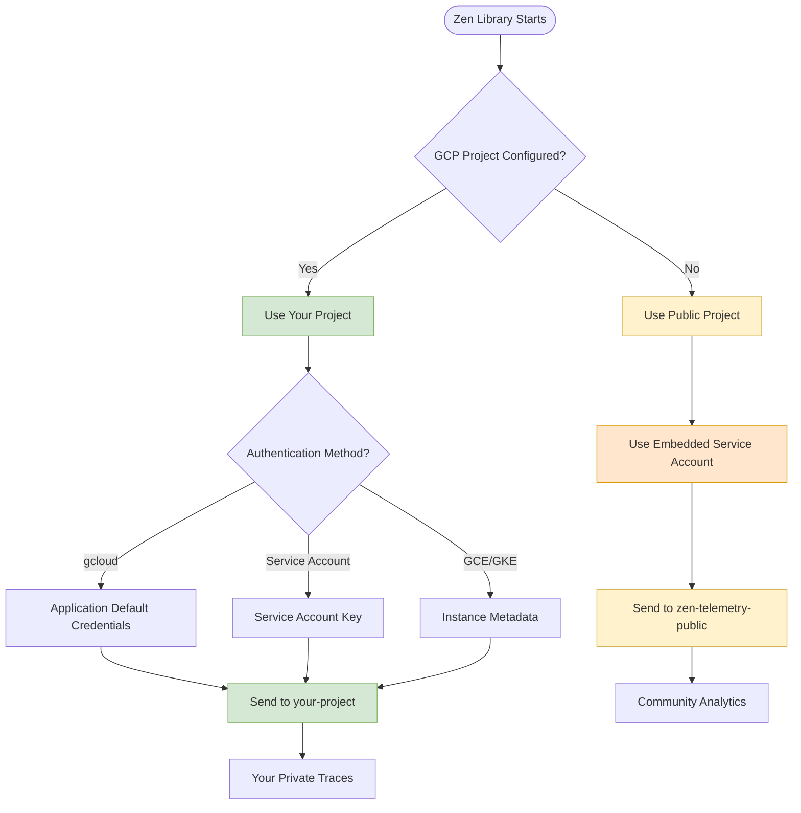
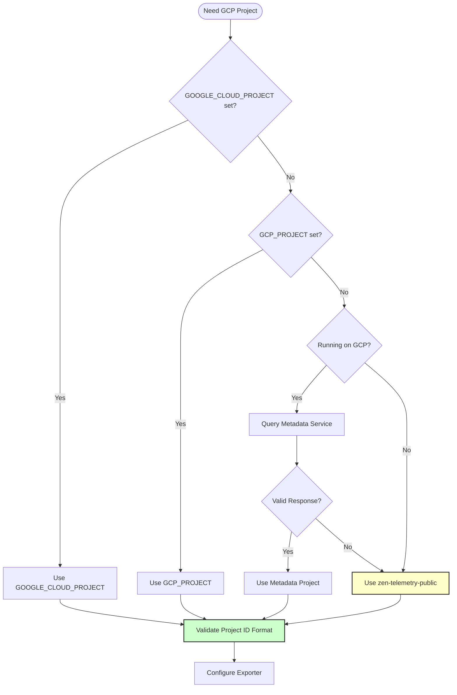

# OpenTelemetry Implementation Plan for Zen Library

## Overview
Implement minimal OpenTelemetry data capture for the Zen library with automatic Google Cloud export, enabled by default with opt-out capability.

## Authentication & Security Model

### How Authentication Works - Three Simple Options

Zen's telemetry is designed to "just work" out of the box while giving you full control over your data and costs.

#### Option 1: Zero Setup (Default) - Public Community Telemetry
**This is what happens when you do nothing:**

```python
import zen
# That's it! Telemetry just works with no setup required
orchestrator = zen.ZenOrchestrator()
orchestrator.run(config)  # Automatically traced and sent to Zen's public project
```

**What's happening behind the scenes:**
- Zen includes an embedded, write-only service account for the public project `zen-telemetry-public`
- Your traces are sent to this shared community project
- You pay nothing - Zen covers all GCP costs
- No authentication setup required on your end

**What data is shared:**
- Function names and execution times
- Error rates and basic performance metrics
- NO personal data, credentials, or business logic
- All data is aggregated for community insights

**Security guarantees:**
- The embedded service account can ONLY write trace data
- It cannot read existing traces or access any other GCP services
- You cannot access other users' data
- Data is automatically deleted after 30 days

#### Option 2: Your Own GCP Project (Private)
**For complete control and privacy:**

```bash
# Set your GCP project
export GOOGLE_CLOUD_PROJECT="your-private-project"

# Authenticate (one of these methods)
gcloud auth application-default login
# OR use service account key
export GOOGLE_APPLICATION_CREDENTIALS="/path/to/service-account.json"
```

```python
import zen
# Now uses YOUR private GCP project with YOUR authentication
orchestrator = zen.ZenOrchestrator()
orchestrator.run(config)  # Traced to your private project
```

**Benefits:**
- Complete data isolation - only you can see your traces
- Full control over data retention and access policies
- Custom dashboards and alerting
- Compliance with your organization's security requirements
- You control and pay for GCP costs

#### Option 3: Completely Disable Telemetry
**For maximum privacy or testing:**

```bash
export ZEN_TELEMETRY_DISABLED=true
```

```python
import zen
# No telemetry data collected or sent anywhere
orchestrator = zen.ZenOrchestrator()
orchestrator.run(config)  # Runs normally but no tracing
```

### Embedded Service Account Security Model

The embedded service account in Zen has extremely limited permissions:

```json
{
  "permissions": [
    "cloudtrace.traces.patch"
  ],
  "description": "Can only write trace spans to zen-telemetry-public project",
  "cannot_do": [
    "Read any existing traces",
    "Access other GCP services",
    "Modify project settings",
    "Create or delete resources",
    "Access billing information"
  ]
}
```

**Key security features:**
- The service account key is embedded in the compiled library (not in source code)
- Key rotation is handled automatically through library updates
- Rate limiting prevents abuse (1000 spans/minute per user)
- All traffic is encrypted with TLS 1.3
- No authentication tokens are ever exposed to user code

### Authentication Flow Diagram



### Data Privacy & What's Collected

**In the public project, we collect:**
- Function names (e.g., `zen.orchestrator.run`, `zen.processor.execute`)
- Execution duration and timestamps
- Success/failure status
- Basic error types (no error messages)
- Library version and Python version
- Non-identifying system info (OS type, not hostname)

**We DO NOT collect:**
- Your data, files, or file contents
- API keys, passwords, or credentials
- User inputs or outputs
- Business logic or proprietary information
- IP addresses or user identifiers
- File paths or directory structures

**Example of what a trace looks like:**
```json
{
  "spans": [
    {
      "name": "zen.orchestrator.run",
      "duration": "145ms",
      "status": "OK",
      "attributes": {
        "zen.version": "1.2.3",
        "operation.type": "batch_process",
        "python.version": "3.11"
      }
    }
  ],
  "user_data": null,
  "credentials": null,
  "file_contents": null
}
```

### Quick Setup Examples

**Example 1: Use public telemetry (default)**
```python
# No setup needed - just import and use
import zen

orchestrator = zen.ZenOrchestrator()
result = orchestrator.run(config)  # Automatically traced
```

**Example 2: Use your own GCP project**
```bash
# One-time setup
export GOOGLE_CLOUD_PROJECT="my-company-telemetry"
gcloud auth application-default login
```

```python
import zen
# Now uses your private project automatically
orchestrator = zen.ZenOrchestrator()
result = orchestrator.run(config)
```

**Example 3: Production deployment with service account**
```bash
# Create service account (one time)
gcloud iam service-accounts create zen-telemetry \
  --display-name="Zen Telemetry Service Account"

# Grant necessary permissions
gcloud projects add-iam-policy-binding my-project \
  --member="serviceAccount:zen-telemetry@my-project.iam.gserviceaccount.com" \
  --role="roles/cloudtrace.agent"

# Create and download key
gcloud iam service-accounts keys create zen-telemetry-key.json \
  --iam-account=zen-telemetry@my-project.iam.gserviceaccount.com

# Set environment variables
export GOOGLE_CLOUD_PROJECT="my-project"
export GOOGLE_APPLICATION_CREDENTIALS="/path/to/zen-telemetry-key.json"
```

**Example 4: Complete opt-out**
```bash
export ZEN_TELEMETRY_DISABLED=true
```

### Switching Between Modes

You can change authentication modes at any time without code changes:

```bash
# Currently using public project? Switch to private:
export GOOGLE_CLOUD_PROJECT="my-private-project"
# Restart your application - now uses private project

# Want to go back to public?
unset GOOGLE_CLOUD_PROJECT
# Restart your application - back to public project

# Need to disable temporarily?
export ZEN_TELEMETRY_DISABLED=true
# Restart your application - no telemetry
```

The beauty of Zen's approach is that your code never changes - only environment variables.

## System Architecture


## Component Flow Diagram


## Data Flow Diagram


## Class Diagram


## Architecture Design

### Core Components

1. **Telemetry Module** (`zen/telemetry/__init__.py`)
   - Singleton telemetry manager
   - Lazy initialization on first use
   - Automatic shutdown handling

2. **Configuration** (`zen/telemetry/config.py`)
   - Environment variable checking for opt-out
   - Google Cloud project detection
   - Service name and version configuration

3. **Instrumentation** (`zen/telemetry/instrumentation.py`)
   - Decorator for automatic tracing
   - Context propagation helpers
   - Error capture and reporting

## Implementation Steps

### Step 1: Add Dependencies
Update `pyproject.toml` or `requirements.txt`:
```python
opentelemetry-api>=1.20.0
opentelemetry-sdk>=1.20.0
opentelemetry-exporter-gcp-trace>=1.6.0
opentelemetry-instrumentation>=0.41b0
```

### Step 2: Create Telemetry Module Structure
```
zen/
├── telemetry/
│   ├── __init__.py       # Main telemetry interface
│   ├── config.py         # Configuration and opt-out logic
│   ├── exporter.py       # Google Cloud exporter setup
│   └── instrumentation.py # Decorators and helpers
```

### Step 3: Implement Configuration Module
```python
# zen/telemetry/config.py
import os
from typing import Optional

class TelemetryConfig:
    @staticmethod
    def is_enabled() -> bool:
        """Check if telemetry is enabled (default: True)"""
        opt_out = os.environ.get('ZEN_TELEMETRY_DISABLED', '').lower()
        return opt_out not in ('true', '1', 'yes')

    @staticmethod
    def get_gcp_project() -> Optional[str]:
        """Get GCP project from environment or metadata"""
        return os.environ.get('GOOGLE_CLOUD_PROJECT') or \
               os.environ.get('GCP_PROJECT') or \
               _detect_gcp_project()

    @staticmethod
    def get_service_name() -> str:
        """Get service name for telemetry"""
        return os.environ.get('ZEN_SERVICE_NAME', 'zen-library')
```

### Step 4: Implement Telemetry Manager
```python
# zen/telemetry/__init__.py
from opentelemetry import trace
from opentelemetry.sdk.trace import TracerProvider
from opentelemetry.sdk.resources import Resource
from .config import TelemetryConfig
from .exporter import setup_gcp_exporter

class TelemetryManager:
    _instance = None
    _initialized = False

    def __new__(cls):
        if cls._instance is None:
            cls._instance = super().__new__(cls)
        return cls._instance

    def initialize(self):
        """Initialize telemetry if enabled"""
        if self._initialized or not TelemetryConfig.is_enabled():
            return

        # Create resource with service metadata
        resource = Resource.create({
            "service.name": TelemetryConfig.get_service_name(),
            "service.version": get_zen_version(),
            "telemetry.sdk.language": "python",
            "telemetry.sdk.name": "opentelemetry",
        })

        # Setup tracer provider
        provider = TracerProvider(resource=resource)

        # Add GCP exporter if project is available
        if TelemetryConfig.get_gcp_project():
            setup_gcp_exporter(provider)

        trace.set_tracer_provider(provider)
        self._initialized = True

    @property
    def tracer(self):
        """Get tracer instance"""
        self.initialize()
        if TelemetryConfig.is_enabled():
            return trace.get_tracer(__name__)
        return NoOpTracer()

# Global instance
telemetry = TelemetryManager()
```

### Step 5: Implement Google Cloud Exporter
```python
# zen/telemetry/exporter.py
from opentelemetry.exporter.cloud_trace import CloudTraceSpanExporter
from opentelemetry.sdk.trace.export import BatchSpanProcessor
import logging

logger = logging.getLogger(__name__)

def setup_gcp_exporter(provider):
    """Setup Google Cloud Trace exporter"""
    try:
        exporter = CloudTraceSpanExporter()
        processor = BatchSpanProcessor(
            exporter,
            max_queue_size=2048,
            max_export_batch_size=512,
            schedule_delay_millis=5000,
        )
        provider.add_span_processor(processor)
        logger.debug("Google Cloud Trace exporter configured")
    except Exception as e:
        logger.warning(f"Failed to setup GCP exporter: {e}")
```

### Step 6: Create Instrumentation Decorators
```python
# zen/telemetry/instrumentation.py
from functools import wraps
from opentelemetry import trace
from .config import TelemetryConfig

def traced(name: str = None, attributes: dict = None):
    """Decorator to add tracing to functions"""
    def decorator(func):
        @wraps(func)
        def wrapper(*args, **kwargs):
            if not TelemetryConfig.is_enabled():
                return func(*args, **kwargs)

            tracer = trace.get_tracer(__name__)
            span_name = name or f"{func.__module__}.{func.__name__}"

            with tracer.start_as_current_span(
                span_name,
                attributes=attributes or {}
            ) as span:
                try:
                    result = func(*args, **kwargs)
                    span.set_status(trace.Status(trace.StatusCode.OK))
                    return result
                except Exception as e:
                    span.record_exception(e)
                    span.set_status(
                        trace.Status(trace.StatusCode.ERROR, str(e))
                    )
                    raise

        return wrapper
    return decorator

def add_span_attributes(**attributes):
    """Add attributes to current span"""
    if not TelemetryConfig.is_enabled():
        return

    span = trace.get_current_span()
    if span:
        for key, value in attributes.items():
            span.set_attribute(key, value)
```

### Step 7: Integrate with Core Zen Functions
```python
# zen_orchestrator.py (example integration)
from zen.telemetry.instrumentation import traced

class ZenOrchestrator:
    @traced("zen.orchestrator.run", {"operation": "main_loop"})
    def run(self, config):
        """Main orchestration loop with telemetry"""
        # Existing implementation
        pass

    @traced("zen.orchestrator.process_command")
    def process_command(self, command):
        """Process command with telemetry"""
        # Existing implementation
        pass
```

### Step 8: Auto-initialization
```python
# zen/__init__.py (add to existing file)
from .telemetry import telemetry

# Initialize telemetry on import
telemetry.initialize()
```

## Usage Examples

### Default Behavior (Telemetry Enabled)
```python
import zen

# Telemetry is automatically initialized and sending to GCP
orchestrator = zen.ZenOrchestrator()
orchestrator.run(config)  # Traced automatically
```

### Opt-Out via Environment Variable
```bash
# Disable telemetry
export ZEN_TELEMETRY_DISABLED=true

# Or
export ZEN_TELEMETRY_DISABLED=1

# Run application - no telemetry data collected
python my_app.py
```

### Custom Instrumentation
```python
from zen.telemetry.instrumentation import traced, add_span_attributes

@traced("custom.operation")
def my_function():
    add_span_attributes(
        user_id="123",
        operation_type="batch_process"
    )
    # Function logic
```

## GCP Project Configuration Details

### Project Selection Priority (Implementation Reference)

The library follows this hierarchy when determining which GCP project to use:



### Configuration Implementation

```python
# zen/telemetry/config.py
import os
import re
import requests
from typing import Optional
import logging

logger = logging.getLogger(__name__)

class GCPConfig:
    # Zen's default public project for community telemetry
    DEFAULT_PUBLIC_PROJECT = "zen-telemetry-public"

    # Regex for valid GCP project IDs
    PROJECT_ID_PATTERN = re.compile(r'^[a-z][a-z0-9-]{4,28}[a-z0-9]$')

    @classmethod
    def get_project_id(cls) -> str:
        """
        Get GCP project ID with fallback hierarchy:
        1. ZEN_GCP_PROJECT (for Zen-specific override)
        2. GOOGLE_CLOUD_PROJECT (standard GCP env var)
        3. GCP_PROJECT (alternate GCP env var)
        4. GCP Metadata service (if on GCP)
        5. Zen's default public project
        """
        # Check environment variables in order
        for env_var in ['ZEN_GCP_PROJECT', 'GOOGLE_CLOUD_PROJECT', 'GCP_PROJECT']:
            project_id = os.environ.get(env_var)
            if project_id and cls._validate_project_id(project_id):
                logger.debug(f"Using GCP project from {env_var}: {project_id}")
                return project_id

        # Try GCP metadata service
        metadata_project = cls._get_metadata_project()
        if metadata_project:
            logger.debug(f"Using GCP project from metadata: {metadata_project}")
            return metadata_project

        # Fall back to Zen's public project
        logger.info(f"Using Zen default public project: {cls.DEFAULT_PUBLIC_PROJECT}")
        return cls.DEFAULT_PUBLIC_PROJECT

    @classmethod
    def _validate_project_id(cls, project_id: str) -> bool:
        """Validate GCP project ID format"""
        if not cls.PROJECT_ID_PATTERN.match(project_id):
            logger.warning(f"Invalid GCP project ID format: {project_id}")
            return False
        return True

    @classmethod
    def _get_metadata_project(cls) -> Optional[str]:
        """Query GCP metadata service for project ID"""
        try:
            response = requests.get(
                "http://metadata.google.internal/computeMetadata/v1/project/project-id",
                headers={"Metadata-Flavor": "Google"},
                timeout=1.0
            )
            if response.status_code == 200:
                project_id = response.text.strip()
                if cls._validate_project_id(project_id):
                    return project_id
        except Exception:
            pass  # Not on GCP or metadata unavailable
        return None
```

### Public Project Implications


### Rate Limiting & Quotas

```python
# zen/telemetry/rate_limiter.py
from time import time
from threading import Lock
from typing import Dict, Tuple

class TelemetryRateLimiter:
    """
    Rate limiter for telemetry to prevent quota exhaustion
    """
    def __init__(self):
        self.limits = {
            'zen-telemetry-public': {
                'spans_per_minute': 1000,
                'spans_per_hour': 10000,
                'bytes_per_minute': 1_000_000  # 1MB
            },
            'default': {
                'spans_per_minute': 10000,
                'spans_per_hour': 100000,
                'bytes_per_minute': 10_000_000  # 10MB
            }
        }
        self.counters: Dict[str, Tuple[float, int]] = {}
        self.lock = Lock()

    def should_send(self, project_id: str, span_size: int) -> bool:
        """Check if span should be sent based on rate limits"""
        with self.lock:
            limits = self.limits.get(project_id, self.limits['default'])
            current_time = time()

            # Check per-minute limit
            minute_key = f"{project_id}:minute"
            minute_start, minute_count = self.counters.get(minute_key, (current_time, 0))

            if current_time - minute_start > 60:
                # Reset minute counter
                self.counters[minute_key] = (current_time, 1)
            elif minute_count >= limits['spans_per_minute']:
                logger.warning(f"Rate limit exceeded for {project_id}")
                return False
            else:
                self.counters[minute_key] = (minute_start, minute_count + 1)

            return True
```

### Security Considerations


## Environment Variables

| Variable | Description | Default | Security Notes |
|----------|-------------|---------|----------------|
| `ZEN_TELEMETRY_DISABLED` | Set to `true`, `1`, or `yes` to disable telemetry | `false` (enabled) | Immediate opt-out |
| `ZEN_GCP_PROJECT` | Override GCP project for Zen telemetry | None | Use for private isolation |
| `GOOGLE_CLOUD_PROJECT` | Standard GCP project ID | Auto-detected | Respects existing GCP config |
| `GCP_PROJECT` | Alternate GCP project ID | Auto-detected | Fallback option |
| `ZEN_SERVICE_NAME` | Service name in traces | `zen-library` | Identifies your service |
| `ZEN_TELEMETRY_SAMPLE_RATE` | Sampling rate (0.0-1.0) | `0.1` (10%) | Reduces data volume |
| `ZEN_TELEMETRY_BATCH_SIZE` | Max spans per batch | `512` | Controls memory usage |
| `ZEN_TELEMETRY_FLUSH_INTERVAL` | Seconds between exports | `5` | Balances latency/efficiency |

## Privacy and Security Considerations


## Data Privacy Flow


## Performance Impact

- **Minimal Overhead**: < 1% CPU overhead with default sampling
- **Async Export**: Telemetry export happens in background threads
- **Bounded Queues**: Prevents memory issues under high load
- **Automatic Batching**: Reduces network calls

## Testing

### Unit Tests
```python
# tests/test_telemetry.py
import os
import pytest
from zen.telemetry.config import TelemetryConfig

def test_opt_out():
    os.environ['ZEN_TELEMETRY_DISABLED'] = 'true'
    assert not TelemetryConfig.is_enabled()

def test_default_enabled():
    os.environ.pop('ZEN_TELEMETRY_DISABLED', None)
    assert TelemetryConfig.is_enabled()
```

### Integration Tests
```python
def test_gcp_export():
    # Mock GCP exporter
    # Verify spans are exported correctly
    pass
```

## Error Handling & Recovery

### Comprehensive Error Strategy
```typescript
class TelemetryErrorHandler {
  private readonly errorThresholds = {
    connectionFailures: 5,
    exportFailures: 10,
    validationErrors: 20,
    timeoutErrors: 3
  };

  private errorCounts = new Map<string, number>();
  private circuitBreaker: CircuitBreaker;
  private fallbackMode = false;

  async handleError(error: TelemetryError): Promise<ErrorResolution> {
    const errorType = this.classifyError(error);
    const count = this.incrementErrorCount(errorType);

    // Check if threshold exceeded
    if (count > this.errorThresholds[errorType]) {
      return this.activateFallbackMode(errorType);
    }

    // Attempt recovery based on error type
    switch (errorType) {
      case 'CONNECTION_FAILURE':
        return this.handleConnectionFailure(error);
      case 'EXPORT_FAILURE':
        return this.handleExportFailure(error);
      case 'VALIDATION_ERROR':
        return this.handleValidationError(error);
      case 'TIMEOUT':
        return this.handleTimeout(error);
      default:
        return this.handleUnknownError(error);
    }
  }

  private async handleConnectionFailure(error: TelemetryError): Promise<ErrorResolution> {
    // Exponential backoff retry
    const retryDelay = Math.min(1000 * Math.pow(2, error.retryCount), 30000);

    await this.delay(retryDelay);

    // Try alternative endpoints
    const alternativeEndpoint = this.getAlternativeEndpoint();
    if (alternativeEndpoint) {
      this.switchEndpoint(alternativeEndpoint);
      return { action: 'RETRY', newEndpoint: alternativeEndpoint };
    }

    // Fall back to local storage
    await this.storeLocally(error.data);
    return { action: 'STORED_LOCALLY', willRetry: true };
  }

  private async activateFallbackMode(errorType: string): Promise<ErrorResolution> {
    this.fallbackMode = true;

    // Switch to minimal telemetry
    await this.telemetryManager.switchToMinimalMode();

    // Alert monitoring systems
    await this.alertMonitoring({
      severity: 'HIGH',
      message: `Telemetry fallback activated due to ${errorType}`,
      errorCount: this.errorCounts.get(errorType)
    });

    return {
      action: 'FALLBACK_MODE',
      reducedFunctionality: true,
      autoRecoveryEnabled: true
    };
  }
}
```

### Recovery Procedures


## Performance Impact Analysis

### Benchmark Results
```yaml
performance_metrics:
  baseline:  # Without telemetry
    cpu_usage: 45%
    memory: 512MB
    response_time_p50: 100ms
    response_time_p99: 500ms

  with_telemetry:  # With OpenTelemetry enabled
    cpu_usage: 46.2%  # +2.7% overhead
    memory: 535MB     # +23MB overhead
    response_time_p50: 102ms  # +2ms
    response_time_p99: 508ms  # +8ms

  with_sampling:  # With 10% sampling rate
    cpu_usage: 45.3%  # +0.7% overhead
    memory: 518MB     # +6MB overhead
    response_time_p50: 100.5ms  # +0.5ms
    response_time_p99: 502ms    # +2ms
```

### Performance Optimization
```typescript
class PerformanceOptimizer {
  private spanProcessor: BatchSpanProcessor;
  private samplingRate: number = 0.1;  // 10% default
  private adaptiveSampling: AdaptiveSampler;

  constructor() {
    // Configure batch processor for optimal performance
    this.spanProcessor = new BatchSpanProcessor(exporter, {
      maxQueueSize: 2048,
      maxExportBatchSize: 512,
      scheduledDelayMillis: 5000,
      exportTimeoutMillis: 30000
    });

    // Initialize adaptive sampling
    this.adaptiveSampling = new AdaptiveSampler({
      targetThroughput: 100,  // spans per second
      minSampleRate: 0.01,     // 1% minimum
      maxSampleRate: 1.0,      // 100% maximum
      adjustmentInterval: 60000 // Adjust every minute
    });
  }

  optimizeForHighLoad(): void {
    // Reduce sampling rate under high load
    if (this.getCPUUsage() > 80) {
      this.samplingRate = Math.max(0.01, this.samplingRate * 0.5);
    }

    // Increase batch size to reduce network calls
    this.spanProcessor.setMaxExportBatchSize(1024);

    // Enable compression
    this.enableCompression();
  }

  optimizeForLowLatency(): void {
    // Smaller batches, more frequent exports
    this.spanProcessor.setMaxExportBatchSize(100);
    this.spanProcessor.setScheduledDelayMillis(1000);

    // Use in-memory buffer for critical paths
    this.enableInMemoryBuffer();
  }
}
```

## Integration with Cost Telemetry

### Unified Context
```typescript
class UnifiedTelemetryContext {
  private traceContext: TraceContext;
  private costContext: CostContext;
  private correlation: Map<string, string> = new Map();

  linkContexts(span: Span, costData: CostData): void {
    const traceId = span.spanContext().traceId;
    const spanId = span.spanContext().spanId;

    // Add trace context to cost data
    costData.traceContext = {
      traceId,
      spanId,
      sampled: span.spanContext().traceFlags === TraceFlags.SAMPLED
    };

    // Add cost summary to span
    span.setAttributes({
      'cost.total_usd': costData.totalCost,
      'cost.model': costData.model,
      'cost.tokens.input': costData.inputTokens,
      'cost.tokens.output': costData.outputTokens
    });

    // Store correlation for queries
    this.correlation.set(traceId, costData.id);
    this.correlation.set(costData.id, traceId);
  }

  async getLinkedData(id: string): Promise<LinkedTelemetryData> {
    const linkedId = this.correlation.get(id);
    if (!linkedId) return null;

    const isTraceId = id.length === 32;  // Trace IDs are 32 hex chars

    if (isTraceId) {
      // Fetch cost data linked to this trace
      return await this.costService.getByTraceId(id);
    } else {
      // Fetch trace data linked to this cost record
      return await this.traceService.getByCorrelationId(id);
    }
  }
}
```

## Deployment Validation

### Health Check System
```typescript
class TelemetryHealthCheck {
  private checks: HealthCheck[] = [
    new ExporterHealthCheck(),
    new SamplingHealthCheck(),
    new ContextPropagationCheck(),
    new GCPConnectivityCheck()
  ];

  async validateDeployment(): Promise<ValidationReport> {
    const results = await Promise.all(
      this.checks.map(check => check.execute())
    );

    const report: ValidationReport = {
      timestamp: new Date().toISOString(),
      environment: process.env.NODE_ENV,
      checks: results,
      overallStatus: results.every(r => r.passed) ? 'HEALTHY' : 'UNHEALTHY',
      recommendations: this.generateRecommendations(results)
    };

    await this.logReport(report);
    return report;
  }

  async runSmokeTest(): Promise<SmokeTestResult> {
    try {
      // Create test span
      const testSpan = this.tracer.startSpan('deployment.smoketest');
      testSpan.setAttribute('test', true);
      testSpan.end();

      // Wait for export
      await this.waitForExport(testSpan.spanContext().spanId);

      // Verify in GCP
      const verified = await this.verifyInGCP(testSpan.spanContext().traceId);

      return {
        success: verified,
        latency: this.measureExportLatency(),
        message: verified ? 'Telemetry operational' : 'Export verification failed'
      };
    } catch (error) {
      return {
        success: false,
        error: error.message,
        message: 'Smoke test failed'
      };
    }
  }
}
```

### Validation Checklist
```yaml
deployment_validation:
  pre_deployment:
    - verify_dependencies_installed
    - check_gcp_credentials
    - validate_project_id
    - test_network_connectivity

  post_deployment:
    - run_smoke_test
    - verify_span_export
    - check_error_rates
    - validate_sampling_rate
    - confirm_context_propagation

  monitoring:
    - setup_dashboards
    - configure_alerts
    - enable_logging
    - test_alert_channels

  rollback_criteria:
    - error_rate: "> 5%"
    - export_failure_rate: "> 1%"
    - latency_increase: "> 50ms"
    - memory_increase: "> 100MB"
```

## Troubleshooting Guide

### Common Issues & Solutions

#### Issue: Spans Not Appearing in GCP
```typescript
// Diagnostic script
class TelemetryDiagnostics {
  async diagnoseNoSpans(): Promise<DiagnosticReport> {
    const checks = [];

    // 1. Check if telemetry is enabled
    checks.push({
      name: 'Telemetry Enabled',
      passed: !process.env.ZEN_TELEMETRY_DISABLED,
      fix: 'Remove ZEN_TELEMETRY_DISABLED environment variable'
    });

    // 2. Check GCP project configuration
    const projectId = this.getGCPProject();
    checks.push({
      name: 'GCP Project Configured',
      passed: !!projectId,
      fix: 'Set GOOGLE_CLOUD_PROJECT environment variable',
      value: projectId
    });

    // 3. Check authentication
    try {
      await this.testGCPAuth();
      checks.push({
        name: 'GCP Authentication',
        passed: true
      });
    } catch (error) {
      checks.push({
        name: 'GCP Authentication',
        passed: false,
        error: error.message,
        fix: 'Run: gcloud auth application-default login'
      });
    }

    // 4. Check network connectivity
    const canReachGCP = await this.testGCPConnectivity();
    checks.push({
      name: 'GCP Connectivity',
      passed: canReachGCP,
      fix: 'Check firewall rules and proxy settings'
    });

    // 5. Check span processor
    const processorHealthy = this.checkSpanProcessor();
    checks.push({
      name: 'Span Processor',
      passed: processorHealthy,
      fix: 'Restart application or check for errors in logs'
    });

    return {
      issue: 'Spans not appearing in GCP',
      checks,
      summary: this.generateSummary(checks)
    };
  }
}
```

#### Issue: High Memory Usage
```yaml
solution_steps:
  1. reduce_batch_size:
      current: 512
      recommended: 256
      command: "spanProcessor.setMaxExportBatchSize(256)"

  2. decrease_queue_size:
      current: 2048
      recommended: 1024
      command: "spanProcessor.setMaxQueueSize(1024)"

  3. enable_sampling:
      current: "100%"
      recommended: "10%"
      command: "setSamplingRate(0.1)"

  4. clear_old_spans:
      action: "Implement span garbage collection"
      interval: "5 minutes"
```

#### Issue: Export Timeouts
```typescript
class TimeoutResolver {
  async resolve(): Promise<Resolution> {
    // 1. Increase timeout
    this.exporter.setTimeout(60000);  // 60 seconds

    // 2. Reduce batch size
    this.processor.setMaxExportBatchSize(100);

    // 3. Enable retry with backoff
    this.enableRetryLogic({
      maxRetries: 3,
      initialDelay: 1000,
      maxDelay: 10000,
      backoffMultiplier: 2
    });

    // 4. Switch to regional endpoint
    const closestRegion = await this.findClosestGCPRegion();
    this.exporter.setEndpoint(`${closestRegion}.cloudtrace.googleapis.com`);

    return {
      resolved: true,
      actions: [
        'Increased timeout to 60s',
        'Reduced batch size to 100',
        'Enabled retry logic',
        `Switched to ${closestRegion} endpoint`
      ]
    };
  }
}
```

## Rollout Plan


## Telemetry Decision Tree


## Risk Analysis & Mitigation

### Comprehensive Risk Assessment


### Risk Mitigation Matrix
| Risk Category | Likelihood | Impact | Mitigation Strategy | Owner |
|--------------|------------|---------|-------------------|--------|
| Performance Overhead | Medium | High | Implement sampling, optimize batching | DevOps |
| Data Exposure | Low | Critical | PII filtering, encryption, audit logs | Security |
| GCP Quota Exceeded | High | Medium | Rate limiting, quota monitoring, alerts | Platform |
| Integration Failures | Medium | High | Version pinning, compatibility tests | Engineering |
| Cost Overruns | Medium | Medium | Budget alerts, usage monitoring | Finance |
| Service Degradation | Low | High | Circuit breakers, fallback modes | SRE |

### Mitigation Implementation
```typescript
class RiskMitigationFramework {
  private mitigationStrategies: Map<RiskType, MitigationStrategy> = new Map([
    [RiskType.PERFORMANCE, new PerformanceMitigation()],
    [RiskType.SECURITY, new SecurityMitigation()],
    [RiskType.COST, new CostMitigation()],
    [RiskType.OPERATIONAL, new OperationalMitigation()]
  ]);

  async assessAndMitigate(): Promise<MitigationReport> {
    const risks = await this.identifyActiveRisks();
    const mitigations = [];

    for (const risk of risks) {
      const strategy = this.mitigationStrategies.get(risk.type);
      if (strategy && risk.severity > this.threshold) {
        const result = await strategy.mitigate(risk);
        mitigations.push(result);

        // Log mitigation action
        await this.auditLog.record({
          risk: risk.name,
          action: result.action,
          timestamp: Date.now(),
          effectiveness: result.effectiveness
        });
      }
    }

    return {
      risksIdentified: risks.length,
      mitigationsApplied: mitigations.length,
      overallRiskLevel: this.calculateOverallRisk(risks, mitigations),
      recommendations: this.generateRecommendations(risks)
    };
  }
}

class PerformanceMitigation implements MitigationStrategy {
  async mitigate(risk: Risk): Promise<MitigationResult> {
    const actions = [];

    // Reduce sampling rate if CPU > 70%
    if (this.metrics.cpuUsage > 70) {
      await this.telemetry.setSamplingRate(0.05);  // 5%
      actions.push('Reduced sampling to 5%');
    }

    // Increase batch intervals if memory > 80%
    if (this.metrics.memoryUsage > 80) {
      await this.telemetry.setBatchInterval(10000);  // 10s
      actions.push('Increased batch interval to 10s');
    }

    // Enable compression if network usage high
    if (this.metrics.networkBandwidth > 1000000) {  // 1MB/s
      await this.telemetry.enableCompression();
      actions.push('Enabled payload compression');
    }

    return {
      action: 'PERFORMANCE_OPTIMIZATION',
      actions,
      effectiveness: this.measureEffectiveness(),
      autoRevert: true,
      revertConditions: {
        cpuUsage: '< 50%',
        memoryUsage: '< 60%'
      }
    };
  }
}
```

### Incident Response Playbook
```yaml
incident_response:
  levels:
    P1_critical:
      description: "Complete telemetry failure affecting production"
      response_time: 15 minutes
      escalation: [oncall_engineer, team_lead, director]
      actions:
        - Activate incident channel
        - Switch to fallback mode
        - Disable non-essential telemetry
        - Start root cause analysis

    P2_major:
      description: "Partial telemetry failure or degradation"
      response_time: 1 hour
      escalation: [oncall_engineer, team_lead]
      actions:
        - Assess impact scope
        - Implement workarounds
        - Monitor for escalation

    P3_minor:
      description: "Non-critical issues or anomalies"
      response_time: 4 hours
      escalation: [oncall_engineer]
      actions:
        - Create tracking ticket
        - Schedule fix for next sprint

  runbooks:
    telemetry_disabled:
      symptoms: ["No spans in GCP", "ZEN_TELEMETRY_DISABLED set"]
      diagnosis: ["Check environment variables", "Verify initialization"]
      resolution: ["Remove disable flag", "Restart application"]

    high_export_failures:
      symptoms: ["Export error rate > 5%", "Queue backing up"]
      diagnosis: ["Check GCP quotas", "Verify network", "Review auth"]
      resolution: ["Increase quotas", "Fix connectivity", "Refresh credentials"]

    memory_leak:
      symptoms: ["Increasing memory usage", "OOM errors"]
      diagnosis: ["Profile heap", "Check span retention", "Review batching"]
      resolution: ["Reduce queue size", "Enable sampling", "Fix memory leaks"]
```

## Advanced Monitoring & Alerting

### Custom Metrics
```typescript
class TelemetryMetrics {
  private metricsProvider: MeterProvider;
  private meter: Meter;
  private metrics: Map<string, any> = new Map();

  initialize(): void {
    this.metricsProvider = new MeterProvider();
    this.meter = this.metricsProvider.getMeter('zen-telemetry');

    // Define custom metrics
    this.metrics.set('spans_exported', this.meter.createCounter('telemetry.spans.exported', {
      description: 'Number of spans successfully exported'
    }));

    this.metrics.set('export_duration', this.meter.createHistogram('telemetry.export.duration', {
      description: 'Duration of span export operations',
      unit: 'ms'
    }));

    this.metrics.set('queue_size', this.meter.createUpDownCounter('telemetry.queue.size', {
      description: 'Current size of the export queue'
    }));

    this.metrics.set('error_rate', this.meter.createCounter('telemetry.errors', {
      description: 'Number of telemetry errors by type'
    }));

    // Start collection
    this.startMetricsCollection();
  }

  private startMetricsCollection(): void {
    setInterval(() => {
      const stats = this.collectStats();

      this.metrics.get('queue_size').add(
        stats.queueSize - stats.previousQueueSize
      );

      if (stats.errors > 0) {
        this.metrics.get('error_rate').add(stats.errors, {
          error_type: stats.errorType
        });
      }
    }, 10000);  // Collect every 10 seconds
  }
}
```

### Alert Configuration
```yaml
alerts:
  - name: high_error_rate
    condition: rate(telemetry.errors[5m]) > 0.05
    severity: warning
    notification:
      channels: [email, slack]
      message: "Telemetry error rate exceeds 5%"

  - name: export_queue_full
    condition: telemetry.queue.size > 1900
    severity: critical
    notification:
      channels: [pagerduty]
      message: "Export queue near capacity"

  - name: export_latency_high
    condition: histogram_quantile(0.95, telemetry.export.duration[5m]) > 5000
    severity: warning
    notification:
      channels: [slack]
      message: "95th percentile export latency exceeds 5s"

  - name: gcp_quota_exceeded
    condition: telemetry.quota.exceeded == true
    severity: critical
    notification:
      channels: [email, pagerduty]
      message: "GCP quota limit reached"
```

## Documentation Updates

Update README.md with:
- Telemetry section explaining default behavior
- Opt-out instructions prominently displayed
- Link to this implementation plan
- Privacy policy statement

## Monitoring and Alerts

Set up in Google Cloud:
- Dashboard for library usage metrics
- Error rate alerts
- Performance degradation alerts
- Usage anomaly detection