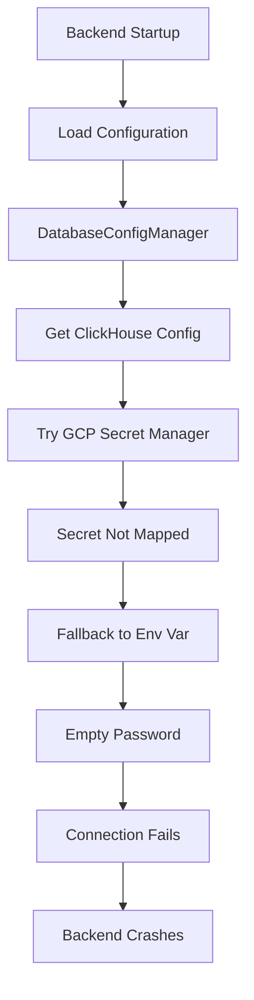
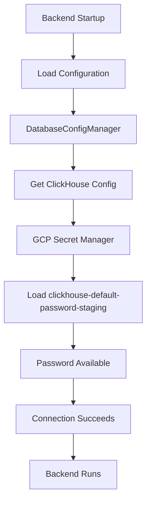

# ClickHouse Staging Configuration Audit Report

## Executive Summary
The backend service is failing to start in staging due to ClickHouse configuration issues. The root cause is **missing ClickHouse password in GCP Secret Manager**, combined with conflicting configuration requirements across the deployment pipeline.

## 5 Whys Root Cause Analysis

### Problem: Backend service not running in staging

**Why 1: Why is the backend service not running?**
- The backend requires ClickHouse to be properly configured at startup
- The startup sequence includes ClickHouse connection validation
- Connection fails due to authentication errors

**Why 2: Why does ClickHouse authentication fail?**
- The CLICKHOUSE_PASSWORD environment variable is empty in staging.env
- The deployment expects password from GCP Secret Manager
- The secret "clickhouse-default-password-staging" is not being properly loaded

**Why 3: Why is the ClickHouse password not being loaded from Secret Manager?**
- The deployment script (deploy_to_gcp.py) doesn't include CLICKHOUSE_PASSWORD in the --set-secrets parameter for backend service
- Line 678: Missing CLICKHOUSE_PASSWORD in the secrets list
- The secret exists as "clickhouse-default-password-staging" but isn't mapped to the backend

**Why 4: Why was CLICKHOUSE_PASSWORD omitted from the secrets mapping?**
- Comment on line 97 states: "CLICKHOUSE vars removed - they are set via secrets in Cloud Run"
- But the actual secret mapping was never added to the deployment command
- This is a deployment configuration gap between intent and implementation

**Why 5: Why did this configuration gap occur?**
- Multiple configuration sources create confusion:
  - staging.env has empty CLICKHOUSE_PASSWORD
  - deploy_to_gcp.py creates the secret but doesn't map it
  - database.py tries to load from GCP but falls back to empty env var
- Lack of validation that all required secrets are properly mapped

## Current State vs Ideal State

### Current State (BROKEN)


### Ideal State (WORKING)


## Critical Findings

### 1. Missing Secret Mapping
**File**: `scripts/deploy_to_gcp.py`
**Line**: 678
**Issue**: CLICKHOUSE_PASSWORD not included in --set-secrets

### 2. Empty Environment Variable
**File**: `config/staging.env`
**Line**: 21
**Issue**: CLICKHOUSE_PASSWORD= (empty)

### 3. Incorrect Secret Name
**Expected**: CLICKHOUSE_PASSWORD
**Actual**: clickhouse-default-password-staging

### 4. Configuration Loading Order Issue
**File**: `netra_backend/app/core/configuration/database.py`
**Lines**: 249-267
**Issue**: Falls back to empty env var when GCP secret not available

### 5. Required Flag Set But Not Enforced
**File**: `config/staging.env`
**Line**: 25
**Issue**: CLICKHOUSE_REQUIRED=true but graceful degradation allows empty password

## Fix Implementation Plan

### Fix 1: Update Deployment Script
```python
# scripts/deploy_to_gcp.py - Line 678
"--set-secrets", "...,CLICKHOUSE_PASSWORD=clickhouse-default-password-staging:latest,..."
```

### Fix 2: Add Validation in database.py
```python
# netra_backend/app/core/configuration/database.py - After line 302
if not password and self._environment == "staging":
    raise ConfigurationError(
        "CLICKHOUSE_PASSWORD is required in staging but not configured. "
        "Please ensure the secret is properly mapped in Cloud Run."
    )
```

### Fix 3: Update staging.env Documentation
```bash
# config/staging.env - Line 21
# CLICKHOUSE_PASSWORD is loaded from GCP Secret Manager
# Secret name: clickhouse-default-password-staging
# DO NOT SET HERE - Will be injected by Cloud Run
CLICKHOUSE_PASSWORD=
```

### Fix 4: Add Secret Validation
```python
# scripts/deploy_to_gcp.py - Add to required_backend_secrets list
required_backend_secrets = [
    # ... existing secrets ...
    "clickhouse-default-password-staging",  # Add this
]
```

## Testing Strategy

1. **Local Validation**: Run `python scripts/test_clickhouse_staging.py`
2. **Secret Verification**: `gcloud secrets versions access latest --secret clickhouse-default-password-staging`
3. **Deployment Test**: Deploy with updated script and verify backend starts
4. **Connection Test**: Verify ClickHouse queries work in staging

## Risk Assessment
- **HIGH**: Backend completely unavailable without this fix
- **MEDIUM**: Data collection stopped for staging environment
- **LOW**: No production impact (different configuration)

## Recommendations

1. **Immediate**: Apply Fix 1 to map the ClickHouse password secret
2. **Short-term**: Implement validation to catch missing secrets earlier
3. **Long-term**: Consolidate configuration sources to reduce confusion

## Verification Checklist
- [ ] ClickHouse password secret exists in GCP Secret Manager
- [ ] Secret is mapped in deploy_to_gcp.py for backend service
- [ ] Backend service starts successfully in staging
- [ ] ClickHouse queries execute without authentication errors
- [ ] Monitoring confirms data is being collected