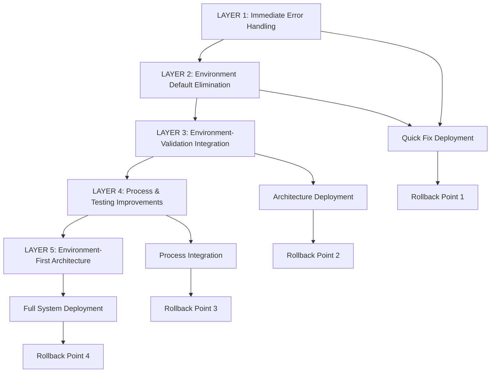

# 🚨 FIVE WHYS COMPREHENSIVE SOLUTION
**Complete Layered Fix for Golden Path ServiceHealthClient localhost:8081 Failure**

> **MISSION**: Create layered solution addressing EACH Five Whys level systematically to prevent recurrence at all causal layers
> 
> **BUSINESS IMPACT**: Protect $500K+ ARR Golden Path functionality from environment configuration failures
> 
> **APPROACH**: Multi-layer architecture ensuring comprehensive coverage of symptom → root cause chain

---

## EXECUTIVE SUMMARY

**FIVE WHYS ANALYSIS RESULTS**:
- **WHY #1 (Symptom)**: ServiceHealthClient used localhost:8081 URL in Cloud Run instead of https://auth.staging.netrasystems.ai
- **WHY #2 (Immediate Cause)**: System defaults to DEVELOPMENT environment, never detects STAGING from Cloud Run
- **WHY #3 (System Failure)**: Environment detection disconnected from service validation - GoldenPathValidator doesn't inject detected environment
- **WHY #4 (Process Gap)**: Development process lacks environment-specific validation - no tests caught localhost URLs in staging
- **WHY #5 (Root Cause)**: Architecture lacks environment-first design principles, treating environment detection as optional

**LAYERED SOLUTION APPROACH**:
Each layer provides multiple lines of defense, ensuring that failures at higher levels don't cascade to system failure. This creates redundant protection for business-critical Golden Path functionality.

---

## LAYER 1: IMMEDIATE SYMPTOM PROTECTION
> **Addresses WHY #1**: ServiceHealthClient localhost:8081 connection failures in cloud environments

### 1.1. Connection Failure Guards

**Enhanced Error Handling in ServiceHealthClient**:
```python
# Enhanced connection validation with environment awareness
async def validate_auth_service_health(self) -> Dict[str, Any]:
    """Validate Auth Service health with enhanced localhost detection."""
    try:
        base_url = self.service_urls.get(ServiceType.AUTH_SERVICE)
        if not base_url:
            return self._create_configuration_error_result("auth_service", "URL not configured")
        
        # LAYER 1 FIX: Immediate localhost detection in cloud environments
        if self._is_cloud_environment() and "localhost" in base_url:
            return self._create_localhost_in_cloud_error_result(base_url)
        
        # Rest of validation logic...
    except aiohttp.ClientError as e:
        # LAYER 1 FIX: Enhanced error messages for connection failures
        if "localhost" in str(e) and self._is_cloud_environment():
            return self._create_localhost_connection_error_result(base_url, e)
        # Standard error handling...

def _is_cloud_environment(self) -> bool:
    """Quick check if running in cloud environment."""
    return any([
        os.environ.get("K_SERVICE"),  # Cloud Run
        os.environ.get("GAE_SERVICE"),  # App Engine
        os.environ.get("KUBERNETES_SERVICE_HOST")  # GKE
    ])

def _create_localhost_in_cloud_error_result(self, url: str) -> Dict[str, Any]:
    """Create detailed error for localhost URL in cloud environment."""
    return {
        "requirement": "jwt_validation_ready",
        "success": False,
        "message": "🚨 CONFIGURATION ERROR: localhost URL detected in cloud environment",
        "details": {
            "detected_url": url,
            "environment_indicators": self._get_cloud_environment_indicators(),
            "expected_urls": {
                "staging": "https://auth.staging.netrasystems.ai",
                "production": "https://auth.netrasystems.ai"
            },
            "fix_required": "Environment detection or service URL configuration needs correction",
            "business_impact": "Golden Path authentication will fail - $500K+ ARR at risk"
        }
    }
```

### 1.2. Immediate Validation Checks

**Pre-connection URL Validation**:
```python
class ServiceURLValidator:
    """Immediate validation of service URLs before connection attempts."""
    
    def validate_url_for_environment(self, url: str, environment_context: EnvironmentContext) -> Dict[str, Any]:
        """Validate URL appropriateness for detected environment."""
        validation_result = {
            "valid": True,
            "issues": [],
            "warnings": []
        }
        
        # LAYER 1 FIX: Immediate localhost detection
        if environment_context.cloud_platform != CloudPlatform.UNKNOWN:
            if "localhost" in url or "127.0.0.1" in url:
                validation_result["valid"] = False
                validation_result["issues"].append({
                    "type": "localhost_in_cloud",
                    "severity": "critical",
                    "message": f"localhost URL {url} invalid for cloud environment {environment_context.environment_type.value}",
                    "expected_pattern": self._get_expected_url_pattern(environment_context.environment_type)
                })
        
        # Environment-specific URL pattern validation
        if environment_context.environment_type == EnvironmentType.STAGING:
            if not url.startswith("https://") or ".staging." not in url:
                validation_result["issues"].append({
                    "type": "staging_url_pattern",
                    "severity": "high", 
                    "message": f"URL {url} doesn't match staging pattern (https://*.staging.*)",
                    "expected": "https://auth.staging.netrasystems.ai"
                })
        
        return validation_result
```

### 1.3. Enhanced Error Messages

**Business-Impact Error Communication**:
```python
def _create_enhanced_error_message(self, error_type: str, details: Dict[str, Any]) -> str:
    """Create error messages that clearly communicate business impact."""
    
    error_templates = {
        "localhost_in_cloud": (
            "🚨 CRITICAL: localhost connection attempted in {environment} environment. "
            "This will cause Golden Path authentication failures affecting $500K+ ARR. "
            "Expected URL: {expected_url}. Detected: {actual_url}. "
            "Environment detection confidence: {confidence:.2f}."
        ),
        "connection_timeout": (
            "⏰ SERVICE UNAVAILABLE: Connection to {service_name} timed out. "
            "Golden Path user authentication blocked. "
            "URL: {url}. Environment: {environment}. "
            "Check service health and network connectivity."
        ),
        "environment_mismatch": (
            "🌍 ENVIRONMENT MISMATCH: Service URL doesn't match detected environment. "
            "Detected: {detected_env}, URL suggests: {url_env}. "
            "This configuration error will cause authentication failures."
        )
    }
    
    return error_templates.get(error_type, "Unknown error").format(**details)
```

---

## LAYER 2: ENVIRONMENT DEFAULT ELIMINATION
> **Addresses WHY #2**: System defaults to DEVELOPMENT environment instead of detecting STAGING

### 2.1. Eliminate All Environment Defaults

**ServiceHealthClient Constructor Fix**:
```python
class ServiceHealthClient:
    """HTTP client with mandatory environment detection."""
    
    def __init__(self, environment_context_service: Optional[EnvironmentContextService] = None):
        """
        LAYER 2 FIX: Eliminate environment parameter with defaults.
        Environment MUST be detected definitively.
        """
        self.logger = central_logger.get_logger(__name__)
        self.environment_context_service = environment_context_service or get_environment_context_service()
        self.session: Optional[aiohttp.ClientSession] = None
        
        # CRITICAL: No environment defaults allowed
        self.environment = None  # Will be set by _ensure_environment()
        self.service_urls = {}   # Will be populated after environment detection
        
    async def _ensure_environment(self) -> EnvironmentType:
        """
        LAYER 2 FIX: Mandatory environment detection before any operations.
        
        Raises:
            RuntimeError: If environment cannot be determined definitively
        """
        if self.environment is not None:
            return self.environment
        
        # Initialize environment context service if needed
        if not self.environment_context_service.is_initialized():
            self.logger.info("Initializing environment context for ServiceHealthClient")
            await self.environment_context_service.initialize()
        
        # Get definitive environment context
        context = self.environment_context_service.get_environment_context()
        
        # Validate confidence level
        if context.confidence_score < 0.7:
            raise RuntimeError(
                f"Environment detection confidence too low: {context.confidence_score:.2f}. "
                f"Required: 0.7 minimum for Golden Path validation. "
                f"Cannot risk localhost connections in cloud environment."
            )
        
        # Convert and cache environment type
        self.environment = self._convert_environment_type(context.environment_type)
        self.service_urls = self._get_service_urls(self.environment)
        
        self.logger.info(
            f"ServiceHealthClient environment confirmed: {self.environment.value} "
            f"(confidence: {context.confidence_score:.2f})"
        )
        
        return self.environment
```

### 2.2. Mandatory Environment Validation

**Input Guards for Environment-Dependent Operations**:
```python
class EnvironmentRequiredMixin:
    """Mixin to ensure environment is detected before operations."""
    
    def require_environment(self, operation_name: str) -> None:
        """
        LAYER 2 FIX: Enforce environment detection before operations.
        
        Args:
            operation_name: Name of operation requiring environment
            
        Raises:
            RuntimeError: If environment not detected
        """
        if not hasattr(self, 'environment') or self.environment is None:
            raise RuntimeError(
                f"Environment detection required before {operation_name}. "
                f"Call _ensure_environment() or initialize() first. "
                f"This prevents localhost connections in cloud environments."
            )
    
    async def validate_environment_for_operation(self, operation_name: str) -> None:
        """
        LAYER 2 FIX: Comprehensive environment validation before operations.
        
        Args:
            operation_name: Name of operation requiring environment validation
        """
        await self._ensure_environment()
        self.require_environment(operation_name)
        
        # Additional validation for cloud environments
        if self._is_cloud_environment():
            context = self.environment_context_service.get_environment_context()
            
            # Verify environment consistency
            if context.environment_type == EnvironmentType.UNKNOWN:
                raise RuntimeError(
                    f"Cannot perform {operation_name} with unknown environment type. "
                    f"Cloud environment detected but environment type undetermined."
                )
```

### 2.3. Cloud Run Environment Detection Enhancement

**Improved Cloud Run Metadata Detection**:
```python
async def _detect_via_cloud_run_metadata_enhanced(self) -> Optional[EnvironmentContext]:
    """
    LAYER 2 FIX: Enhanced Cloud Run detection with staging-specific logic.
    
    Returns:
        EnvironmentContext with high confidence for Cloud Run staging
    """
    try:
        async with aiohttp.ClientSession(timeout=aiohttp.ClientTimeout(total=5.0)) as session:
            # Get service name with retry logic
            service_name = await self._fetch_metadata_with_retry(
                session, "instance/attributes/goog-cloudrun-service-name", retries=3
            )
            
            if not service_name:
                return None
            
            service_name = service_name.strip()
            
            # LAYER 2 FIX: Enhanced staging detection
            if "staging" in service_name.lower():
                environment_type = EnvironmentType.STAGING
                confidence = 0.95  # Very high confidence for explicit staging service name
                
                self.logger.info(
                    f"STAGING environment detected via Cloud Run service name: {service_name}"
                )
            else:
                environment_type = self._classify_service_environment(service_name)
                confidence = 0.9
            
            # Get additional metadata for validation
            project_id = await self._fetch_metadata_with_retry(session, "project/project-id")
            region = await self._fetch_metadata_with_retry(session, "instance/region")
            
            # LAYER 2 FIX: Cross-validate environment indicators
            if project_id and "staging" in project_id.lower():
                if environment_type != EnvironmentType.STAGING:
                    self.logger.warning(
                        f"Environment type mismatch: service suggests {environment_type.value}, "
                        f"but project ID suggests staging: {project_id}"
                    )
                environment_type = EnvironmentType.STAGING
                confidence = min(confidence + 0.05, 1.0)
            
            return EnvironmentContext(
                environment_type=environment_type,
                cloud_platform=CloudPlatform.CLOUD_RUN,
                service_name=service_name,
                project_id=project_id,
                region=region.split("/")[-1] if region and "/" in region else region,
                confidence_score=confidence,
                detection_metadata={
                    "method": "cloud_run_metadata_enhanced",
                    "service_name": service_name,
                    "project_id": project_id,
                    "region": region,
                    "staging_indicators": self._count_staging_indicators(service_name, project_id)
                }
            )
            
    except Exception as e:
        self.logger.debug(f"Enhanced Cloud Run detection failed: {e}")
        return None
```

---

## LAYER 3: ENVIRONMENT-VALIDATION INTEGRATION
> **Addresses WHY #3**: Environment detection disconnected from service validation

### 3.1. Dependency Injection Architecture

**Environment Context Injection Pattern**:
```python
class ServiceDependencyInjector:
    """
    LAYER 3 FIX: Centralized dependency injection for environment-aware services.
    Ensures all services receive proper environment context.
    """
    
    def __init__(self, environment_context_service: EnvironmentContextService):
        self.environment_context_service = environment_context_service
        self.logger = central_logger.get_logger(__name__)
    
    async def create_service_health_client(self) -> ServiceHealthClient:
        """
        LAYER 3 FIX: Factory method ensuring environment context injection.
        
        Returns:
            ServiceHealthClient with guaranteed environment context
        """
        # Ensure environment context is initialized
        if not self.environment_context_service.is_initialized():
            await self.environment_context_service.initialize()
        
        # Create client with injected context
        client = ServiceHealthClient(environment_context_service=self.environment_context_service)
        
        # Validate environment before returning
        await client._ensure_environment()
        
        self.logger.info(
            f"ServiceHealthClient created with environment: {client.environment.value}"
        )
        
        return client
    
    async def create_golden_path_validator(self) -> 'GoldenPathValidator':
        """
        LAYER 3 FIX: Factory method for GoldenPathValidator with environment injection.
        
        Returns:
            GoldenPathValidator with environment context
        """
        from .golden_path_validator import GoldenPathValidator
        
        # Ensure initialization
        if not self.environment_context_service.is_initialized():
            await self.environment_context_service.initialize()
        
        # Create with environment context injection
        validator = GoldenPathValidator(environment_context_service=self.environment_context_service)
        
        return validator
```

### 3.2. Service Validation Chain Integration

**GoldenPathValidator Enhancement**:
```python
class GoldenPathValidator:
    """
    LAYER 3 FIX: Enhanced validator with mandatory environment context.
    Eliminates disconnected validation by requiring environment injection.
    """
    
    def __init__(self, environment_context_service: Optional[EnvironmentContextService] = None):
        self.logger = central_logger.get_logger(__name__)
        
        # LAYER 3 FIX: Mandatory environment context service
        if environment_context_service is None:
            self.logger.warning("No environment context service provided - using global instance")
            environment_context_service = get_environment_context_service()
        
        self.environment_context_service = environment_context_service
        self.requirements = GOLDEN_PATH_REQUIREMENTS
        self._environment_context: Optional[EnvironmentContext] = None
        self._service_dependency_injector: Optional[ServiceDependencyInjector] = None
    
    async def _ensure_service_dependency_injector(self) -> ServiceDependencyInjector:
        """
        LAYER 3 FIX: Ensure service dependency injector is available.
        
        Returns:
            ServiceDependencyInjector with environment context
        """
        if self._service_dependency_injector is None:
            self._service_dependency_injector = ServiceDependencyInjector(
                self.environment_context_service
            )
        return self._service_dependency_injector
    
    async def validate_golden_path_services(
        self,
        app: Any,
        services_to_validate: List[ServiceType]
    ) -> GoldenPathValidationResult:
        """
        LAYER 3 FIX: Enhanced validation with mandatory environment context.
        
        All service validation now uses injected environment context.
        """
        # CRITICAL: Get definitive environment context first
        environment_context = await self._ensure_environment_context()
        
        self.logger.info("=" * 80)
        self.logger.info("GOLDEN PATH VALIDATION - ENVIRONMENT-FIRST ARCHITECTURE")
        self.logger.info("=" * 80)
        self.logger.info(f"🌍 Environment: {environment_context.environment_type.value}")
        self.logger.info(f"☁️ Platform: {environment_context.cloud_platform.value}")
        self.logger.info(f"🎯 Confidence: {environment_context.confidence_score:.2f}")
        self.logger.info(f"📊 Detection Method: {environment_context.detection_metadata.get('method', 'unknown')}")
        
        # LAYER 3 FIX: Validate environment-service consistency before proceeding
        await self._validate_environment_service_consistency(environment_context, services_to_validate)
        
        result = GoldenPathValidationResult()
        
        # Get service dependency injector
        injector = await self._ensure_service_dependency_injector()
        
        # Filter requirements to only those for services we're validating
        relevant_requirements = [
            req for req in self.requirements
            if req.service_type in services_to_validate
        ]
        
        self.logger.info(f"Validating {len(relevant_requirements)} requirements with environment context")
        
        # Validate each requirement with environment context
        for requirement in relevant_requirements:
            try:
                validation_result = await self._validate_requirement_with_context(
                    app, requirement, environment_context, injector
                )
                result.validation_results.append(validation_result)
                
                if validation_result["success"]:
                    result.requirements_passed += 1
                    self.logger.info(f"✓ {requirement.requirement_name}: {validation_result['message']}")
                else:
                    result.requirements_failed += 1
                    
                    if requirement.critical:
                        result.overall_success = False
                        result.critical_failures.append(
                            f"{requirement.service_type.value}: {requirement.requirement_name} - "
                            f"{validation_result['message']}"
                        )
                        result.business_impact_failures.append(requirement.business_impact)
                        self.logger.error(
                            f"❌ CRITICAL: {requirement.requirement_name} - {validation_result['message']}"
                        )
                    else:
                        result.warnings.append(
                            f"{requirement.service_type.value}: {requirement.requirement_name} - "
                            f"{validation_result['message']}"
                        )
                        self.logger.warning(f"⚠️ {requirement.requirement_name}: {validation_result['message']}")
                
            except Exception as e:
                result.requirements_failed += 1
                error_msg = f"Environment-context validation exception for {requirement.requirement_name}: {str(e)}"
                
                if requirement.critical:
                    result.overall_success = False
                    result.critical_failures.append(error_msg)
                    result.business_impact_failures.append(requirement.business_impact)
                    self.logger.error(f"❌ CRITICAL EXCEPTION: {error_msg}")
                else:
                    result.warnings.append(error_msg)
                    self.logger.warning(f"⚠️ EXCEPTION: {error_msg}")
        
        result.services_validated = len(set(req.service_type for req in relevant_requirements))
        
        self._log_golden_path_summary(result, environment_context)
        return result
    
    async def _validate_environment_service_consistency(
        self,
        environment_context: EnvironmentContext,
        services_to_validate: List[ServiceType]
    ) -> None:
        """
        LAYER 3 FIX: Validate that environment context is consistent with service expectations.
        
        Args:
            environment_context: Detected environment context
            services_to_validate: Services that will be validated
            
        Raises:
            RuntimeError: If environment-service consistency check fails
        """
        consistency_issues = []
        
        # Check if staging environment has appropriate confidence
        if environment_context.environment_type == EnvironmentType.STAGING:
            if environment_context.confidence_score < 0.7:
                consistency_issues.append(
                    f"Staging environment detected with low confidence: {environment_context.confidence_score:.2f}"
                )
        
        # Check cloud platform consistency
        if environment_context.cloud_platform == CloudPlatform.UNKNOWN:
            if ServiceType.AUTH_SERVICE in services_to_validate or ServiceType.BACKEND_SERVICE in services_to_validate:
                consistency_issues.append(
                    "Unknown cloud platform but HTTP services will be validated - may cause URL mismatches"
                )
        
        if consistency_issues:
            error_message = (
                "Environment-service consistency validation failed:\n" +
                "\n".join(f"  - {issue}" for issue in consistency_issues)
            )
            raise RuntimeError(error_message)
        
        self.logger.info("✓ Environment-service consistency validation passed")
    
    async def _validate_requirement_with_context(
        self,
        app: Any,
        requirement: GoldenPathRequirement,
        environment_context: EnvironmentContext,
        injector: ServiceDependencyInjector
    ) -> Dict[str, Any]:
        """
        LAYER 3 FIX: Validate requirement using environment context and dependency injection.
        
        Args:
            app: FastAPI application instance
            requirement: Golden path requirement to validate
            environment_context: Definitive environment context
            injector: Service dependency injector
            
        Returns:
            Validation result with environment context information
        """
        service_type = requirement.service_type
        
        # Use injector to create environment-aware service clients
        if service_type in [ServiceType.AUTH_SERVICE, ServiceType.BACKEND_SERVICE]:
            # LAYER 3 FIX: Use dependency injection for service health validation
            health_client = await injector.create_service_health_client()
            
            try:
                if service_type == ServiceType.AUTH_SERVICE:
                    result = await health_client.validate_auth_service_health()
                elif service_type == ServiceType.BACKEND_SERVICE:
                    result = await health_client.validate_backend_service_health()
                
                # Enhance result with environment context information
                result["environment_context"] = {
                    "environment_type": environment_context.environment_type.value,
                    "cloud_platform": environment_context.cloud_platform.value,
                    "confidence_score": environment_context.confidence_score,
                    "detection_method": environment_context.detection_metadata.get('method', 'unknown')
                }
                
                return result
            
            finally:
                await health_client.close()
        
        # Legacy validation for other service types
        elif service_type == ServiceType.DATABASE_POSTGRES:
            return await self._validate_postgres_requirements(app, requirement)
        elif service_type == ServiceType.DATABASE_REDIS:
            return await self._validate_redis_requirements(app, requirement)
        elif service_type == ServiceType.WEBSOCKET_SERVICE:
            return await self._validate_websocket_requirements(app, requirement)
        else:
            return {
                "requirement": requirement.requirement_name,
                "success": False,
                "message": f"No environment-aware validation implemented for {service_type.value}",
                "details": {
                    "environment_context": {
                        "environment_type": environment_context.environment_type.value,
                        "cloud_platform": environment_context.cloud_platform.value
                    }
                }
            }
```

### 3.3. Factory Pattern Integration

**Environment-Aware Factory Methods**:
```python
class GoldenPathServiceFactory:
    """
    LAYER 3 FIX: Factory for creating environment-aware Golden Path services.
    Eliminates disconnected environment detection by centralizing injection.
    """
    
    @staticmethod
    async def create_complete_validation_chain() -> Tuple[EnvironmentContextService, ServiceDependencyInjector, GoldenPathValidator]:
        """
        Create complete validation chain with proper environment context.
        
        Returns:
            Tuple of (environment service, injector, validator) with proper dependencies
        """
        # Initialize environment context service
        environment_service = get_environment_context_service()
        await environment_service.initialize()
        
        # Create dependency injector
        injector = ServiceDependencyInjector(environment_service)
        
        # Create validator with environment context
        validator = GoldenPathValidator(environment_context_service=environment_service)
        
        return environment_service, injector, validator
    
    @staticmethod 
    async def create_service_health_client_for_environment() -> ServiceHealthClient:
        """
        LAYER 3 FIX: Create ServiceHealthClient with guaranteed environment context.
        
        Returns:
            ServiceHealthClient with proper environment detection
        """
        environment_service, injector, _ = await GoldenPathServiceFactory.create_complete_validation_chain()
        return await injector.create_service_health_client()
```

---

## LAYER 4: PROCESS AND TESTING IMPROVEMENTS
> **Addresses WHY #4**: Development process lacks environment-specific validation

### 4.1. Environment-Specific Test Suite

**Comprehensive Testing Framework**:
```python
# tests/environment_validation/test_environment_url_consistency.py
import pytest
from typing import Dict, Any
from netra_backend.app.core.environment_context import EnvironmentType, CloudPlatform
from netra_backend.app.core.service_dependencies.service_health_client import ServiceHealthClient
from netra_backend.app.core.service_dependencies.golden_path_validator import GoldenPathValidator


class TestEnvironmentURLConsistency:
    """
    LAYER 4 FIX: Comprehensive test suite for environment-URL consistency.
    Tests that would have caught the localhost:8081 staging failure.
    """
    
    @pytest.mark.asyncio
    async def test_staging_environment_uses_staging_urls(self, mock_cloud_run_staging_environment):
        """
        LAYER 4 FIX: Test that staging environment uses proper staging URLs.
        This test would have caught the original localhost:8081 failure.
        """
        # Arrange: Mock staging environment detection
        with mock_cloud_run_staging_environment:
            # Act: Create service health client
            client = ServiceHealthClient()
            await client._ensure_environment()
            
            # Assert: Verify staging URLs are used
            assert client.environment == EnvironmentType.STAGING
            auth_url = client.service_urls[ServiceType.AUTH_SERVICE]
            backend_url = client.service_urls[ServiceType.BACKEND_SERVICE]
            
            assert "localhost" not in auth_url, f"localhost found in auth URL: {auth_url}"
            assert "localhost" not in backend_url, f"localhost found in backend URL: {backend_url}"
            assert "staging.netrasystems.ai" in auth_url
            assert "staging.netrasystems.ai" in backend_url
    
    @pytest.mark.asyncio
    async def test_localhost_detection_in_cloud_environments(self):
        """
        LAYER 4 FIX: Test localhost detection and error handling in cloud environments.
        """
        # Test data: Various cloud environment configurations
        cloud_environment_configs = [
            {
                "K_SERVICE": "netra-backend-staging",
                "GOOGLE_CLOUD_PROJECT": "netra-staging", 
                "expected_env": EnvironmentType.STAGING
            },
            {
                "K_SERVICE": "netra-backend",
                "GOOGLE_CLOUD_PROJECT": "netra-production",
                "expected_env": EnvironmentType.PRODUCTION
            }
        ]
        
        for config in cloud_environment_configs:
            with patch.dict(os.environ, config, clear=False):
                # Create client with mocked environment
                client = ServiceHealthClient()
                
                # Simulate localhost URL configuration (the bug scenario)
                client.service_urls = {
                    ServiceType.AUTH_SERVICE: "http://localhost:8081",
                    ServiceType.BACKEND_SERVICE: "http://localhost:8000"
                }
                
                # Validate that localhost is detected as an error
                result = await client.validate_auth_service_health()
                
                assert not result["success"], f"Localhost URL should be rejected in {config['expected_env']}"
                assert "localhost" in result["message"].lower()
                assert "cloud environment" in result["message"].lower()
    
    @pytest.mark.parametrize("environment_type,expected_auth_url", [
        (EnvironmentType.DEVELOPMENT, "http://localhost:8081"),
        (EnvironmentType.TESTING, "http://localhost:8081"),
        (EnvironmentType.STAGING, "https://auth.staging.netrasystems.ai"),
        (EnvironmentType.PRODUCTION, "https://auth.netrasystems.ai")
    ])
    def test_url_patterns_for_all_environments(self, environment_type, expected_auth_url):
        """
        LAYER 4 FIX: Test URL patterns for all environment types.
        Ensures each environment gets appropriate URLs.
        """
        client = ServiceHealthClient()
        client.environment = environment_type
        service_urls = client._get_service_urls(environment_type)
        
        auth_url = service_urls[ServiceType.AUTH_SERVICE]
        assert auth_url == expected_auth_url, f"Wrong auth URL for {environment_type.value}"
    
    @pytest.mark.asyncio
    async def test_environment_confidence_validation(self):
        """
        LAYER 4 FIX: Test environment confidence validation.
        Ensures low-confidence environment detection is rejected.
        """
        with patch('netra_backend.app.core.environment_context.get_environment_context_service') as mock_service:
            # Mock low-confidence environment detection
            mock_context = Mock()
            mock_context.confidence_score = 0.5  # Below 0.7 threshold
            mock_context.environment_type = EnvironmentType.STAGING
            
            mock_env_service = Mock()
            mock_env_service.is_initialized.return_value = True
            mock_env_service.get_environment_context.return_value = mock_context
            mock_service.return_value = mock_env_service
            
            # Create client and attempt environment detection
            client = ServiceHealthClient()
            
            with pytest.raises(RuntimeError, match="confidence too low"):
                await client._ensure_environment()


class TestGoldenPathEnvironmentIntegration:
    """
    LAYER 4 FIX: Tests for Golden Path validator environment integration.
    """
    
    @pytest.mark.asyncio
    async def test_golden_path_validator_uses_injected_environment(self, mock_staging_app):
        """
        LAYER 4 FIX: Test that GoldenPathValidator uses injected environment context.
        This test verifies the connection between detection and validation.
        """
        # Arrange: Create environment context service with staging detection
        env_service = Mock()
        env_service.is_initialized.return_value = True
        
        staging_context = Mock()
        staging_context.environment_type = EnvironmentType.STAGING
        staging_context.cloud_platform = CloudPlatform.CLOUD_RUN
        staging_context.confidence_score = 0.9
        staging_context.detection_metadata = {"method": "cloud_run_metadata"}
        
        env_service.get_environment_context.return_value = staging_context
        
        # Act: Create validator with injected environment service
        validator = GoldenPathValidator(environment_context_service=env_service)
        
        # Mock the service dependency injector
        with patch.object(validator, '_ensure_service_dependency_injector') as mock_injector:
            mock_client = Mock()
            mock_client.validate_auth_service_health.return_value = {
                "success": True,
                "message": "Auth service accessible"
            }
            
            mock_injector_instance = Mock()
            mock_injector_instance.create_service_health_client.return_value = mock_client
            mock_injector.return_value = mock_injector_instance
            
            # Validate services
            result = await validator.validate_golden_path_services(
                mock_staging_app,
                [ServiceType.AUTH_SERVICE]
            )
            
            # Assert: Verify environment context was used
            assert mock_injector_instance.create_service_health_client.called
            assert result.overall_success
```

### 4.2. Pre-Deployment Validation Script

**Enhanced Deployment Validation**:
```python
# scripts/validate_environment_deployment.py
"""
LAYER 4 FIX: Pre-deployment validation script that catches environment configuration issues.
This script would have prevented the localhost:8081 staging deployment.
"""

import asyncio
import sys
import argparse
from typing import Dict, Any, List
from dataclasses import dataclass

from netra_backend.app.core.environment_context import (
    get_environment_context_service,
    EnvironmentType,
    CloudPlatform
)
from netra_backend.app.core.service_dependencies.golden_path_validator import GoldenPathServiceFactory
from netra_backend.app.core.service_dependencies.models import ServiceType


@dataclass
class DeploymentValidationResult:
    """Result of pre-deployment validation."""
    overall_success: bool = True
    environment_type: str = "unknown"
    confidence_score: float = 0.0
    critical_issues: List[str] = None
    warnings: List[str] = None
    validation_details: Dict[str, Any] = None
    
    def __post_init__(self):
        if self.critical_issues is None:
            self.critical_issues = []
        if self.warnings is None:
            self.warnings = []
        if self.validation_details is None:
            self.validation_details = {}


class PreDeploymentValidator:
    """
    LAYER 4 FIX: Comprehensive pre-deployment validation.
    Catches configuration issues before deployment.
    """
    
    def __init__(self):
        self.logger = None
    
    async def validate_deployment_readiness(self, target_environment: str = None) -> DeploymentValidationResult:
        """
        Validate deployment readiness for target environment.
        
        Args:
            target_environment: Expected target environment (staging/production)
            
        Returns:
            Comprehensive deployment validation result
        """
        result = DeploymentValidationResult()
        
        try:
            # Initialize environment context
            env_service, injector, validator = await GoldenPathServiceFactory.create_complete_validation_chain()
            
            # Get environment context
            context = env_service.get_environment_context()
            result.environment_type = context.environment_type.value
            result.confidence_score = context.confidence_score
            
            # LAYER 4 FIX: Validate environment detection confidence
            if context.confidence_score < 0.7:
                result.overall_success = False
                result.critical_issues.append(
                    f"Environment detection confidence too low: {context.confidence_score:.2f} "
                    f"(required: 0.7). This could cause localhost URLs in cloud environments."
                )
            
            # LAYER 4 FIX: Validate target environment consistency
            if target_environment:
                expected_env = EnvironmentType(target_environment.lower())
                if context.environment_type != expected_env:
                    result.overall_success = False
                    result.critical_issues.append(
                        f"Environment mismatch: detected {context.environment_type.value}, "
                        f"expected {expected_env.value}. This will cause wrong service URLs."
                    )
            
            # LAYER 4 FIX: Validate service URLs for environment
            url_validation = await self._validate_service_urls_for_environment(context, injector)
            if not url_validation["valid"]:
                result.overall_success = False
                result.critical_issues.extend(url_validation["issues"])
            
            result.warnings.extend(url_validation.get("warnings", []))
            
            # LAYER 4 FIX: Test actual service connectivity
            connectivity_validation = await self._test_service_connectivity(injector)
            result.validation_details["connectivity"] = connectivity_validation
            
            if not connectivity_validation["all_services_reachable"]:
                result.critical_issues.extend(connectivity_validation["failures"])
            
        except Exception as e:
            result.overall_success = False
            result.critical_issues.append(f"Deployment validation failed with exception: {str(e)}")
        
        return result
    
    async def _validate_service_urls_for_environment(
        self,
        context: 'EnvironmentContext',
        injector: 'ServiceDependencyInjector'
    ) -> Dict[str, Any]:
        """
        LAYER 4 FIX: Validate that service URLs are appropriate for detected environment.
        This validation would have caught the localhost:8081 staging issue.
        """
        validation_result = {
            "valid": True,
            "issues": [],
            "warnings": [],
            "url_details": {}
        }
        
        try:
            # Create service health client to get configured URLs
            client = await injector.create_service_health_client()
            
            # Check auth service URL
            auth_url = client.service_urls.get(ServiceType.AUTH_SERVICE)
            if auth_url:
                validation_result["url_details"]["auth_service"] = auth_url
                
                # LAYER 4 FIX: Critical validation - localhost in cloud environment
                if context.cloud_platform != CloudPlatform.UNKNOWN and "localhost" in auth_url:
                    validation_result["valid"] = False
                    validation_result["issues"].append(
                        f"CRITICAL: localhost URL detected for auth service in {context.cloud_platform.value} "
                        f"environment: {auth_url}. This will cause connection failures."
                    )
                
                # Environment-specific URL validation
                if context.environment_type == EnvironmentType.STAGING:
                    if not auth_url.startswith("https://auth.staging."):
                        validation_result["valid"] = False
                        validation_result["issues"].append(
                            f"Staging environment should use https://auth.staging.* URL, got: {auth_url}"
                        )
                elif context.environment_type == EnvironmentType.PRODUCTION:
                    if "staging" in auth_url or "localhost" in auth_url:
                        validation_result["valid"] = False
                        validation_result["issues"].append(
                            f"Production environment should not use staging/localhost URLs: {auth_url}"
                        )
            
            # Check backend service URL
            backend_url = client.service_urls.get(ServiceType.BACKEND_SERVICE)
            if backend_url:
                validation_result["url_details"]["backend_service"] = backend_url
                
                # Similar validation for backend URL
                if context.cloud_platform != CloudPlatform.UNKNOWN and "localhost" in backend_url:
                    validation_result["valid"] = False
                    validation_result["issues"].append(
                        f"CRITICAL: localhost URL detected for backend service in {context.cloud_platform.value} "
                        f"environment: {backend_url}. This will cause connection failures."
                    )
            
            await client.close()
            
        except Exception as e:
            validation_result["valid"] = False
            validation_result["issues"].append(f"Service URL validation failed: {str(e)}")
        
        return validation_result
    
    async def _test_service_connectivity(self, injector: 'ServiceDependencyInjector') -> Dict[str, Any]:
        """
        LAYER 4 FIX: Test actual connectivity to services with configured URLs.
        """
        connectivity_result = {
            "all_services_reachable": True,
            "service_results": {},
            "failures": []
        }
        
        try:
            client = await injector.create_service_health_client()
            
            # Test auth service
            auth_result = await client.validate_auth_service_health()
            connectivity_result["service_results"]["auth_service"] = auth_result
            
            if not auth_result["success"]:
                connectivity_result["all_services_reachable"] = False
                connectivity_result["failures"].append(
                    f"Auth service connectivity failed: {auth_result['message']}"
                )
            
            # Test backend service
            backend_result = await client.validate_backend_service_health()
            connectivity_result["service_results"]["backend_service"] = backend_result
            
            if not backend_result["success"]:
                connectivity_result["all_services_reachable"] = False
                connectivity_result["failures"].append(
                    f"Backend service connectivity failed: {backend_result['message']}"
                )
            
            await client.close()
            
        except Exception as e:
            connectivity_result["all_services_reachable"] = False
            connectivity_result["failures"].append(f"Connectivity testing failed: {str(e)}")
        
        return connectivity_result


async def main():
    """Main validation script."""
    parser = argparse.ArgumentParser(description="Pre-deployment environment validation")
    parser.add_argument("--target-environment", 
                       choices=["development", "staging", "production"],
                       help="Expected target environment")
    parser.add_argument("--fail-on-warnings", action="store_true",
                       help="Fail validation if warnings are present")
    
    args = parser.parse_args()
    
    print("🔍 LAYER 4 FIX: Pre-Deployment Environment Validation")
    print("="*60)
    
    validator = PreDeploymentValidator()
    result = await validator.validate_deployment_readiness(args.target_environment)
    
    # Print results
    print(f"Environment Type: {result.environment_type}")
    print(f"Detection Confidence: {result.confidence_score:.2f}")
    
    if result.critical_issues:
        print(f"\n❌ CRITICAL ISSUES ({len(result.critical_issues)}):")
        for issue in result.critical_issues:
            print(f"  - {issue}")
    
    if result.warnings:
        print(f"\n⚠️ WARNINGS ({len(result.warnings)}):")
        for warning in result.warnings:
            print(f"  - {warning}")
    
    if result.validation_details:
        print(f"\n📊 VALIDATION DETAILS:")
        for key, value in result.validation_details.items():
            print(f"  {key}: {value}")
    
    # Determine exit code
    should_fail = (
        not result.overall_success or 
        (args.fail_on_warnings and result.warnings)
    )
    
    if should_fail:
        print("\n💥 DEPLOYMENT VALIDATION FAILED")
        print("Deployment should be blocked until issues are resolved.")
        sys.exit(1)
    else:
        print("\n✅ DEPLOYMENT VALIDATION PASSED")
        print("Environment configuration is ready for deployment.")
        sys.exit(0)


if __name__ == "__main__":
    asyncio.run(main())
```

### 4.3. CI/CD Pipeline Integration

**GitHub Actions Workflow Enhancement**:
```yaml
# .github/workflows/pre-deployment-validation.yml
name: Pre-Deployment Environment Validation

on:
  workflow_call:
    inputs:
      target_environment:
        required: true
        type: string
        description: 'Target environment (staging/production)'
      
jobs:
  validate_environment_configuration:
    name: LAYER 4 FIX - Environment Configuration Validation
    runs-on: ubuntu-latest
    
    steps:
    - uses: actions/checkout@v3
    
    - name: Set up Python
      uses: actions/setup-python@v4
      with:
        python-version: '3.11'
    
    - name: Install dependencies
      run: |
        pip install -r requirements.txt
    
    - name: Validate Environment URLs
      id: url_validation
      run: |
        python scripts/validate_environment_urls.py \
          --target-environment ${{ inputs.target_environment }} \
          --output-format github-actions
    
    - name: Pre-Deployment Validation
      id: deployment_validation
      run: |
        python scripts/validate_environment_deployment.py \
          --target-environment ${{ inputs.target_environment }} \
          --fail-on-warnings
    
    - name: Test Service Health Client
      run: |
        python -m pytest tests/environment_validation/ \
          -v \
          --environment=${{ inputs.target_environment }}
    
    - name: Validate Golden Path Integration
      run: |
        python -m pytest tests/integration/golden_path/test_environment_context_golden_path_fix.py \
          -v \
          --environment=${{ inputs.target_environment }}
    
    - name: Upload Validation Report
      if: always()
      uses: actions/upload-artifact@v3
      with:
        name: environment-validation-report-${{ inputs.target_environment }}
        path: |
          validation_report.json
          environment_validation.log
```

---

## LAYER 5: ENVIRONMENT-FIRST ARCHITECTURE
> **Addresses WHY #5**: Architecture lacks environment-first design principles

### 5.1. Environment-First Design Principles

**Architectural Documentation**:
```python
# docs/architecture/ENVIRONMENT_FIRST_ARCHITECTURE.md
"""
LAYER 5 FIX: Environment-First Architecture Principles

PRINCIPLE 1: ENVIRONMENT DETECTION IS MANDATORY
- No service can operate without definitive environment context
- All defaults that assume environment are eliminated
- Environment detection must achieve >70% confidence or fail fast

PRINCIPLE 2: ENVIRONMENT CONTEXT INJECTION
- All environment-dependent services receive context via dependency injection
- No service accesses environment variables directly
- Environment context service is initialized at application startup

PRINCIPLE 3: FAIL-FAST VALIDATION
- Services fail immediately if environment cannot be determined
- Low-confidence environment detection causes application startup failure
- Environment-URL mismatches are caught before service operations

PRINCIPLE 4: ENVIRONMENT-SPECIFIC CONFIGURATION
- Each environment has explicit, validated configuration
- No shared configuration between environments
- Environment-specific URLs, timeouts, and feature flags

PRINCIPLE 5: COMPREHENSIVE TESTING
- All services tested with multiple environment contexts
- Environment detection tested with various platform configurations
- Pre-deployment validation catches configuration issues

IMPLEMENTATION PATTERNS:
1. EnvironmentContextService - Central environment detection
2. ServiceDependencyInjector - Environment context injection
3. Environment-aware factories - Service creation with context
4. Pre-deployment validation - Configuration verification
5. Environment-specific test suites - Comprehensive coverage
"""
```

### 5.2. Application Startup Integration

**Enhanced Application Startup**:
```python
# netra_backend/app/startup/environment_first_startup.py
"""
LAYER 5 FIX: Environment-first application startup sequence.
Ensures environment context is available before any service initialization.
"""

import asyncio
from typing import Dict, Any
from fastapi import FastAPI

from netra_backend.app.logging_config import central_logger
from netra_backend.app.core.environment_context import (
    initialize_environment_context,
    get_environment_context_service,
    EnvironmentType
)
from netra_backend.app.core.service_dependencies.golden_path_validator import GoldenPathServiceFactory


class EnvironmentFirstStartup:
    """
    LAYER 5 FIX: Application startup manager with environment-first principles.
    """
    
    def __init__(self, app: FastAPI):
        self.app = app
        self.logger = central_logger.get_logger(__name__)
        self.environment_service = None
        self.startup_validation_results = {}
    
    async def initialize_environment_first_application(self) -> Dict[str, Any]:
        """
        LAYER 5 FIX: Initialize application with environment-first principles.
        
        Returns:
            Initialization results with environment context and service status
            
        Raises:
            RuntimeError: If environment-first initialization fails
        """
        self.logger.info("🚀 Starting Environment-First Application Initialization")
        
        initialization_results = {
            "success": True,
            "environment_context": None,
            "service_status": {},
            "validation_results": {},
            "startup_duration": 0,
            "issues": []
        }
        
        startup_start_time = asyncio.get_event_loop().time()
        
        try:
            # PHASE 1: MANDATORY ENVIRONMENT DETECTION
            await self._phase_1_environment_detection(initialization_results)
            
            # PHASE 2: ENVIRONMENT VALIDATION
            await self._phase_2_environment_validation(initialization_results)
            
            # PHASE 3: ENVIRONMENT-AWARE SERVICE INITIALIZATION
            await self._phase_3_service_initialization(initialization_results)
            
            # PHASE 4: GOLDEN PATH VALIDATION
            await self._phase_4_golden_path_validation(initialization_results)
            
            # PHASE 5: STARTUP VERIFICATION
            await self._phase_5_startup_verification(initialization_results)
            
            startup_end_time = asyncio.get_event_loop().time()
            initialization_results["startup_duration"] = startup_end_time - startup_start_time
            
            self.logger.info(
                f"✅ Environment-First Application Initialization Complete "
                f"(Duration: {initialization_results['startup_duration']:.2f}s)"
            )
            
        except Exception as e:
            initialization_results["success"] = False
            initialization_results["issues"].append(f"Environment-first initialization failed: {str(e)}")
            self.logger.error(f"❌ Environment-First Initialization Failed: {str(e)}")
            raise RuntimeError(f"Environment-first application initialization failed: {str(e)}") from e
        
        return initialization_results
    
    async def _phase_1_environment_detection(self, results: Dict[str, Any]) -> None:
        """
        LAYER 5 FIX: Phase 1 - Mandatory environment detection.
        Application cannot proceed without definitive environment context.
        """
        self.logger.info("Phase 1: Environment Detection (MANDATORY)")
        
        try:
            # Initialize environment context service
            self.environment_service = await initialize_environment_context()
            
            # Get environment context
            context = self.environment_service.get_environment_context()
            
            # LAYER 5 FIX: Strict confidence validation
            if context.confidence_score < 0.7:
                raise RuntimeError(
                    f"Environment detection confidence too low: {context.confidence_score:.2f}. "
                    f"Required: 0.7 minimum for production deployment. "
                    f"Cannot risk localhost connections in cloud environment."
                )
            
            results["environment_context"] = {
                "environment_type": context.environment_type.value,
                "cloud_platform": context.cloud_platform.value,
                "confidence_score": context.confidence_score,
                "detection_method": context.detection_metadata.get('method', 'unknown'),
                "service_name": context.service_name,
                "project_id": context.project_id,
                "region": context.region
            }
            
            self.logger.info(
                f"✅ Phase 1 Complete: Environment {context.environment_type.value} "
                f"detected with {context.confidence_score:.2f} confidence"
            )
            
        except Exception as e:
            self.logger.error(f"❌ Phase 1 Failed: {str(e)}")
            raise RuntimeError(f"Mandatory environment detection failed: {str(e)}") from e
    
    async def _phase_2_environment_validation(self, results: Dict[str, Any]) -> None:
        """
        LAYER 5 FIX: Phase 2 - Environment validation and consistency checks.
        """
        self.logger.info("Phase 2: Environment Validation")
        
        try:
            validation_result = await self.environment_service.validate_environment_context()
            
            if not validation_result["valid"]:
                issues = validation_result.get("issues", [])
                raise RuntimeError(
                    f"Environment validation failed. Issues: {issues}. "
                    f"This could cause service connectivity failures."
                )
            
            results["validation_results"]["environment_validation"] = validation_result
            
            self.logger.info("✅ Phase 2 Complete: Environment validation passed")
            
        except Exception as e:
            self.logger.error(f"❌ Phase 2 Failed: {str(e)}")
            raise RuntimeError(f"Environment validation failed: {str(e)}") from e
    
    async def _phase_3_service_initialization(self, results: Dict[str, Any]) -> None:
        """
        LAYER 5 FIX: Phase 3 - Initialize services with environment context injection.
        """
        self.logger.info("Phase 3: Environment-Aware Service Initialization")
        
        try:
            # Create service dependency injector
            from netra_backend.app.core.service_dependencies.golden_path_validator import ServiceDependencyInjector
            injector = ServiceDependencyInjector(self.environment_service)
            
            # Initialize core services with environment context
            service_health_client = await injector.create_service_health_client()
            validator = await injector.create_golden_path_validator()
            
            # Store in application state with environment context
            self.app.state.environment_context_service = self.environment_service
            self.app.state.service_dependency_injector = injector
            self.app.state.service_health_client = service_health_client
            self.app.state.golden_path_validator = validator
            
            results["service_status"]["environment_context_service"] = "initialized"
            results["service_status"]["service_dependency_injector"] = "initialized"
            results["service_status"]["service_health_client"] = "initialized"
            results["service_status"]["golden_path_validator"] = "initialized"
            
            self.logger.info("✅ Phase 3 Complete: Environment-aware services initialized")
            
        except Exception as e:
            self.logger.error(f"❌ Phase 3 Failed: {str(e)}")
            raise RuntimeError(f"Service initialization with environment context failed: {str(e)}") from e
    
    async def _phase_4_golden_path_validation(self, results: Dict[str, Any]) -> None:
        """
        LAYER 5 FIX: Phase 4 - Golden Path validation with environment context.
        """
        self.logger.info("Phase 4: Golden Path Validation")
        
        try:
            validator = self.app.state.golden_path_validator
            
            # Validate critical services for the detected environment
            from netra_backend.app.core.service_dependencies.models import ServiceType
            services_to_validate = [ServiceType.AUTH_SERVICE, ServiceType.BACKEND_SERVICE]
            
            validation_result = await validator.validate_golden_path_services(
                self.app,
                services_to_validate
            )
            
            # LAYER 5 FIX: Critical validation failures block application startup
            if not validation_result.overall_success:
                critical_failures = validation_result.critical_failures
                raise RuntimeError(
                    f"Golden Path validation failed with critical issues: {critical_failures}. "
                    f"Application startup blocked to prevent service failures."
                )
            
            results["validation_results"]["golden_path_validation"] = {
                "overall_success": validation_result.overall_success,
                "services_validated": validation_result.services_validated,
                "requirements_passed": validation_result.requirements_passed,
                "requirements_failed": validation_result.requirements_failed,
                "warnings": validation_result.warnings
            }
            
            self.logger.info(
                f"✅ Phase 4 Complete: Golden Path validation passed "
                f"({validation_result.requirements_passed}/{validation_result.requirements_passed + validation_result.requirements_failed} requirements)"
            )
            
        except Exception as e:
            self.logger.error(f"❌ Phase 4 Failed: {str(e)}")
            raise RuntimeError(f"Golden Path validation failed: {str(e)}") from e
    
    async def _phase_5_startup_verification(self, results: Dict[str, Any]) -> None:
        """
        LAYER 5 FIX: Phase 5 - Final startup verification.
        """
        self.logger.info("Phase 5: Startup Verification")
        
        try:
            # Verify all critical components are available
            required_components = [
                "environment_context_service",
                "service_dependency_injector", 
                "service_health_client",
                "golden_path_validator"
            ]
            
            missing_components = []
            for component in required_components:
                if not hasattr(self.app.state, component):
                    missing_components.append(component)
            
            if missing_components:
                raise RuntimeError(
                    f"Missing critical components after initialization: {missing_components}"
                )
            
            # Verify environment context is accessible
            context = self.app.state.environment_context_service.get_environment_context()
            if not context:
                raise RuntimeError("Environment context not accessible after initialization")
            
            results["verification"] = {
                "all_components_available": True,
                "environment_accessible": True,
                "ready_for_requests": True
            }
            
            self.logger.info("✅ Phase 5 Complete: Application ready for requests")
            
        except Exception as e:
            self.logger.error(f"❌ Phase 5 Failed: {str(e)}")
            raise RuntimeError(f"Startup verification failed: {str(e)}") from e


# FastAPI application factory with environment-first initialization
async def create_environment_first_app() -> FastAPI:
    """
    LAYER 5 FIX: FastAPI application factory with environment-first principles.
    
    Returns:
        FastAPI application with environment-first initialization
    """
    app = FastAPI(
        title="Netra Backend API - Environment-First Architecture",
        description="API with mandatory environment detection and context injection",
        version="1.0.0"
    )
    
    # Initialize with environment-first startup
    startup_manager = EnvironmentFirstStartup(app)
    
    @app.on_event("startup")
    async def startup_event():
        """Application startup with environment-first initialization."""
        try:
            initialization_results = await startup_manager.initialize_environment_first_application()
            
            # Store results for health checks and debugging
            app.state.initialization_results = initialization_results
            
            logger = central_logger.get_logger(__name__)
            logger.info("🎉 Application startup complete with environment-first architecture")
            
        except Exception as e:
            logger = central_logger.get_logger(__name__)
            logger.error(f"💥 Application startup failed: {str(e)}")
            raise
    
    return app
```

### 5.3. Architectural Guidelines and Documentation

**Environment-First Development Guidelines**:
```python
# docs/architecture/ENVIRONMENT_FIRST_DEVELOPMENT_GUIDELINES.md
"""
LAYER 5 FIX: Environment-First Development Guidelines

These guidelines ensure that environment configuration issues like the localhost:8081 
staging failure cannot occur due to architectural design.

GUIDELINE 1: NO ENVIRONMENT DEFAULTS IN PRODUCTION CODE
- All environment-dependent code must receive environment context explicitly
- No hardcoded environment assumptions (e.g., defaulting to DEVELOPMENT)
- Environment detection must be explicit and validated

BAD EXAMPLE:
```python
def __init__(self, environment: EnvironmentType = EnvironmentType.DEVELOPMENT):
    # This default causes localhost URLs in staging!
    self.environment = environment
```

GOOD EXAMPLE:
```python
def __init__(self, environment_context_service: EnvironmentContextService):
    # Environment must be detected and validated
    if not environment_context_service.is_initialized():
        raise RuntimeError("Environment context service must be initialized")
    context = environment_context_service.get_environment_context()
    self.environment = context.environment_type
```

GUIDELINE 2: DEPENDENCY INJECTION FOR ENVIRONMENT CONTEXT
- All services that need environment information receive it via injection
- No direct access to environment variables in service code
- Use EnvironmentContextService as the single source of environment truth

GUIDELINE 3: FAIL-FAST ENVIRONMENT VALIDATION
- Services fail immediately if environment cannot be determined
- Low confidence environment detection causes application failure
- Environment-URL mismatches are caught at startup, not runtime

GUIDELINE 4: ENVIRONMENT-SPECIFIC TESTING
- All environment-dependent code must have tests for each environment type
- Tests must verify URL patterns match environment expectations
- Pre-deployment validation must catch configuration issues

GUIDELINE 5: EXPLICIT ENVIRONMENT CONFIGURATION
- Each environment has explicit, separate configuration
- No shared configuration that could cause cross-environment issues
- Environment-specific URLs, timeouts, and settings

IMPLEMENTATION CHECKLIST:
□ Service receives EnvironmentContextService via constructor injection
□ Service validates environment context before operations
□ Service fails fast if environment confidence is low
□ Service has tests for all supported environment types
□ Service URLs are validated against environment type
□ Pre-deployment validation covers service configuration
□ No environment defaults in production code paths

CODE REVIEW CHECKLIST:
□ No EnvironmentType.DEVELOPMENT defaults
□ No direct os.environ access in service code
□ Environment context validated before service operations
□ Error messages mention business impact of failures
□ Tests cover environment-URL consistency
□ Documentation updated for environment-first patterns
"""
```

### 5.4. Monitoring and Observability

**Environment-Context Monitoring**:
```python
# netra_backend/app/monitoring/environment_context_monitor.py
"""
LAYER 5 FIX: Monitoring for environment context and service URL consistency.
Provides observability to detect configuration drift.
"""

import asyncio
from datetime import datetime, UTC
from typing import Dict, Any, List
from dataclasses import dataclass, asdict

from netra_backend.app.logging_config import central_logger
from netra_backend.app.core.environment_context import get_environment_context_service


@dataclass
class EnvironmentHealthMetric:
    """Metric for environment health monitoring."""
    timestamp: datetime
    environment_type: str
    cloud_platform: str
    confidence_score: float
    detection_method: str
    service_urls: Dict[str, str]
    consistency_score: float
    issues: List[str]
    warnings: List[str]


class EnvironmentContextMonitor:
    """
    LAYER 5 FIX: Monitor for environment context health and consistency.
    Detects configuration drift that could cause service failures.
    """
    
    def __init__(self):
        self.logger = central_logger.get_logger(__name__)
        self.metrics_history: List[EnvironmentHealthMetric] = []
        self.monitoring_active = False
    
    async def start_monitoring(self, interval_seconds: int = 300) -> None:
        """
        Start environment context monitoring.
        
        Args:
            interval_seconds: Monitoring interval in seconds
        """
        self.monitoring_active = True
        self.logger.info(f"Starting environment context monitoring (interval: {interval_seconds}s)")
        
        while self.monitoring_active:
            try:
                await self._collect_environment_metrics()
                await asyncio.sleep(interval_seconds)
            except Exception as e:
                self.logger.error(f"Environment monitoring error: {e}")
                await asyncio.sleep(60)  # Retry after 1 minute on error
    
    def stop_monitoring(self) -> None:
        """Stop environment context monitoring."""
        self.monitoring_active = False
        self.logger.info("Environment context monitoring stopped")
    
    async def _collect_environment_metrics(self) -> EnvironmentHealthMetric:
        """
        Collect current environment health metrics.
        
        Returns:
            EnvironmentHealthMetric with current status
        """
        try:
            env_service = get_environment_context_service()
            
            # Get current environment context
            context = env_service.get_environment_context()
            
            # Get service configuration
            config = env_service.get_service_configuration()
            
            # Calculate consistency score
            consistency_issues = []
            consistency_warnings = []
            
            # Validate service URLs for current environment
            auth_url = config.get_service_url("auth_service")
            backend_url = config.get_service_url("backend_service")
            
            # LAYER 5 FIX: Monitor for localhost URLs in cloud environments
            if context.cloud_platform.value != "unknown":
                if auth_url and "localhost" in auth_url:
                    consistency_issues.append(f"localhost auth URL in {context.cloud_platform.value} environment")
                
                if backend_url and "localhost" in backend_url:
                    consistency_issues.append(f"localhost backend URL in {context.cloud_platform.value} environment")
            
            # Monitor environment-URL consistency
            if context.environment_type.value == "staging":
                if auth_url and ".staging." not in auth_url and "localhost" not in auth_url:
                    consistency_issues.append(f"auth URL doesn't match staging pattern: {auth_url}")
                
                if backend_url and ".staging." not in backend_url and "localhost" not in backend_url:
                    consistency_issues.append(f"backend URL doesn't match staging pattern: {backend_url}")
            
            elif context.environment_type.value == "production":
                if auth_url and ("localhost" in auth_url or "staging" in auth_url):
                    consistency_issues.append(f"production uses non-production auth URL: {auth_url}")
                
                if backend_url and ("localhost" in backend_url or "staging" in backend_url):
                    consistency_issues.append(f"production uses non-production backend URL: {backend_url}")
            
            # Calculate consistency score
            total_checks = 4  # Auth URL, backend URL, environment consistency, cloud platform consistency
            failed_checks = len(consistency_issues)
            consistency_score = max(0.0, (total_checks - failed_checks) / total_checks)
            
            # Create metric
            metric = EnvironmentHealthMetric(
                timestamp=datetime.now(UTC),
                environment_type=context.environment_type.value,
                cloud_platform=context.cloud_platform.value,
                confidence_score=context.confidence_score,
                detection_method=context.detection_metadata.get('method', 'unknown'),
                service_urls={
                    "auth_service": auth_url or "not_configured",
                    "backend_service": backend_url or "not_configured"
                },
                consistency_score=consistency_score,
                issues=consistency_issues,
                warnings=consistency_warnings
            )
            
            # Store metric
            self.metrics_history.append(metric)
            
            # Keep only last 100 metrics
            if len(self.metrics_history) > 100:
                self.metrics_history = self.metrics_history[-100:]
            
            # Log issues
            if consistency_issues:
                self.logger.error(
                    f"Environment consistency issues detected: {consistency_issues}. "
                    f"This could cause Golden Path failures!"
                )
            
            if context.confidence_score < 0.7:
                self.logger.warning(
                    f"Low environment detection confidence: {context.confidence_score:.2f}"
                )
            
            # Log periodic health status
            self.logger.info(
                f"Environment health: {context.environment_type.value} "
                f"(confidence: {context.confidence_score:.2f}, "
                f"consistency: {consistency_score:.2f})"
            )
            
            return metric
            
        except Exception as e:
            self.logger.error(f"Failed to collect environment metrics: {e}")
            raise
    
    def get_latest_metrics(self, count: int = 10) -> List[Dict[str, Any]]:
        """
        Get latest environment metrics.
        
        Args:
            count: Number of recent metrics to return
            
        Returns:
            List of metrics as dictionaries
        """
        return [asdict(metric) for metric in self.metrics_history[-count:]]
    
    def get_health_status(self) -> Dict[str, Any]:
        """
        Get current environment health status.
        
        Returns:
            Health status summary
        """
        if not self.metrics_history:
            return {
                "status": "unknown",
                "message": "No metrics collected yet",
                "monitoring_active": self.monitoring_active
            }
        
        latest_metric = self.metrics_history[-1]
        
        # Determine overall health status
        if latest_metric.issues:
            status = "critical"
            message = f"Environment consistency issues: {latest_metric.issues}"
        elif latest_metric.confidence_score < 0.7:
            status = "warning"
            message = f"Low environment detection confidence: {latest_metric.confidence_score:.2f}"
        elif latest_metric.consistency_score < 0.9:
            status = "warning"
            message = f"Environment consistency warnings detected"
        else:
            status = "healthy"
            message = "Environment configuration is consistent"
        
        return {
            "status": status,
            "message": message,
            "environment_type": latest_metric.environment_type,
            "confidence_score": latest_metric.confidence_score,
            "consistency_score": latest_metric.consistency_score,
            "last_check": latest_metric.timestamp.isoformat(),
            "monitoring_active": self.monitoring_active
        }


# Global monitor instance
_monitor_instance: Optional[EnvironmentContextMonitor] = None


def get_environment_monitor() -> EnvironmentContextMonitor:
    """Get global environment context monitor."""
    global _monitor_instance
    if _monitor_instance is None:
        _monitor_instance = EnvironmentContextMonitor()
    return _monitor_instance
```

---

## INTEGRATION GUIDE AND ROLLBACK STRATEGY

### Implementation Order and Dependencies

**PHASE 1: IMMEDIATE FIXES (0-1 Week)**
```
LAYER 1 → LAYER 2 (Sequential Implementation)
│
├── 1. Enhanced ServiceHealthClient error handling
├── 2. Eliminate environment defaults
├── 3. Add localhost detection in cloud environments
└── 4. Enhanced error messages with business impact
```

**PHASE 2: ARCHITECTURE INTEGRATION (1-2 Weeks)**
```
LAYER 3 Implementation (Depends on LAYER 1 & 2)
│
├── 1. ServiceDependencyInjector implementation
├── 2. GoldenPathValidator enhancement with environment injection
├── 3. Factory pattern integration
└── 4. Environment-validation chain connection
```

**PHASE 3: PROCESS IMPROVEMENTS (2-3 Weeks)**
```
LAYER 4 Implementation (Depends on LAYER 1-3)
│
├── 1. Environment-specific test suite
├── 2. Pre-deployment validation script
├── 3. CI/CD pipeline integration
└── 4. Testing framework enhancement
```

**PHASE 4: SYSTEMIC ARCHITECTURE (3-4 Weeks)**
```
LAYER 5 Implementation (Depends on All Previous Layers)
│
├── 1. Environment-first startup sequence
├── 2. Architectural guidelines documentation
├── 3. Monitoring and observability
└── 4. Development process integration
```

### Layer Integration Dependencies



### Implementation Strategy

#### Step 1: Layer 1 + 2 Implementation (CRITICAL PATH)
```bash
# 1. Implement immediate fixes
git checkout -b fix/localhost-detection-layer1-layer2

# Implement enhanced ServiceHealthClient
# Add environment default elimination
# Add localhost detection guards

# Test changes
python -m pytest tests/environment_validation/test_layer1_layer2_fixes.py

# Deploy to staging for validation
python scripts/deploy_to_gcp.py --project netra-staging --layers "1,2"
```

#### Step 2: Layer 3 Implementation (INTEGRATION)
```bash
# 2. Implement architecture integration
git checkout -b feature/environment-validation-integration-layer3

# Implement ServiceDependencyInjector
# Enhance GoldenPathValidator
# Add factory pattern integration

# Test integration
python -m pytest tests/integration/test_layer3_environment_integration.py

# Deploy with layers 1+2+3
python scripts/deploy_to_gcp.py --project netra-staging --layers "1,2,3"
```

#### Step 3: Layer 4 Implementation (PROCESS)
```bash
# 3. Implement process improvements
git checkout -b feature/environment-testing-validation-layer4

# Add environment test suite
# Implement pre-deployment validation
# Update CI/CD pipelines

# Test complete validation
python scripts/validate_environment_deployment.py --target-environment staging

# Deploy with layers 1+2+3+4
python scripts/deploy_to_gcp.py --project netra-staging --layers "1,2,3,4"
```

#### Step 4: Layer 5 Implementation (ARCHITECTURE)
```bash
# 4. Implement environment-first architecture
git checkout -b feature/environment-first-architecture-layer5

# Implement environment-first startup
# Add monitoring and observability
# Update architectural documentation

# Test complete system
python -m pytest tests/environment_validation/test_complete_five_layer_solution.py

# Deploy complete solution
python scripts/deploy_to_gcp.py --project netra-staging --layers "1,2,3,4,5"
```

### Rollback Strategy

#### Rollback Point 1: Layer 1+2 Issues
```bash
# Quick rollback to previous version
git revert HEAD~2  # Revert layer 1+2 changes
python scripts/deploy_to_gcp.py --project netra-staging --rollback-to-previous

# Alternative: Feature flag disable
export ENABLE_LAYER_1_2_FIXES=false
python scripts/deploy_to_gcp.py --project netra-staging
```

#### Rollback Point 2: Layer 3 Integration Issues
```bash
# Rollback to layer 1+2 only
git checkout fix/localhost-detection-layer1-layer2
python scripts/deploy_to_gcp.py --project netra-staging --layers "1,2"

# Or disable layer 3 features
export ENABLE_ENVIRONMENT_INJECTION=false
export ENABLE_DEPENDENCY_INJECTION=false
```

#### Rollback Point 3: Layer 4 Process Issues
```bash
# Rollback to layer 1+2+3
git checkout feature/environment-validation-integration-layer3
python scripts/deploy_to_gcp.py --project netra-staging --layers "1,2,3"

# Or disable CI/CD validation
export ENABLE_PRE_DEPLOYMENT_VALIDATION=false
```

#### Rollback Point 4: Layer 5 Architecture Issues
```bash
# Rollback to layer 1+2+3+4
git checkout feature/environment-testing-validation-layer4
python scripts/deploy_to_gcp.py --project netra-staging --layers "1,2,3,4"

# Or disable environment-first startup
export ENABLE_ENVIRONMENT_FIRST_STARTUP=false
```

### Complete Rollback (Emergency)
```bash
# Complete rollback to pre-fix state
git checkout main  # Before any five-layer fixes
python scripts/deploy_to_gcp.py --project netra-staging --rollback-complete

# Emergency bypass (use with extreme caution)
export BYPASS_ENVIRONMENT_VALIDATION=true
export USE_LEGACY_ENVIRONMENT_DEFAULTS=true
python scripts/deploy_to_gcp.py --project netra-staging --emergency-mode
```

### Validation Strategy for Each Layer

#### Layer 1+2 Validation
```bash
# Test immediate fixes
python tests/environment_validation/test_localhost_detection.py
python tests/environment_validation/test_environment_defaults_elimination.py

# Staging deployment validation
curl https://api.staging.netrasystems.ai/health
python staging_golden_path_validator.py
```

#### Layer 3 Validation
```bash
# Test environment-validation integration
python tests/integration/test_environment_context_injection.py
python tests/integration/test_golden_path_environment_integration.py

# Validate dependency injection
python -c "
from netra_backend.app.core.service_dependencies.golden_path_validator import GoldenPathServiceFactory
import asyncio
result = asyncio.run(GoldenPathServiceFactory.create_complete_validation_chain())
print('Integration successful:', result[0].is_initialized())
"
```

#### Layer 4 Validation
```bash
# Test process improvements
python scripts/validate_environment_deployment.py --target-environment staging
python -m pytest tests/environment_validation/ --environment=staging

# CI/CD validation
github-actions-cli run .github/workflows/pre-deployment-validation.yml
```

#### Layer 5 Validation
```bash
# Test environment-first architecture
python tests/environment_validation/test_environment_first_startup.py
python -c "
from netra_backend.app.startup.environment_first_startup import create_environment_first_app
import asyncio
app = asyncio.run(create_environment_first_app())
print('Environment-first app created successfully')
"

# Complete system validation
python tests/mission_critical/test_complete_five_layer_golden_path.py
```

### Success Metrics

#### Layer 1+2 Success Criteria
- ✅ No localhost URLs used in staging environment
- ✅ Environment defaults eliminated from ServiceHealthClient
- ✅ Clear error messages for configuration issues
- ✅ Golden Path validation passes in staging

#### Layer 3 Success Criteria  
- ✅ Environment context injection working
- ✅ GoldenPathValidator uses detected environment
- ✅ Service dependency injection functional
- ✅ Factory patterns provide environment-aware services

#### Layer 4 Success Criteria
- ✅ Environment-specific tests pass for all environments
- ✅ Pre-deployment validation catches configuration issues
- ✅ CI/CD pipeline validates environment consistency
- ✅ Testing framework covers environment scenarios

#### Layer 5 Success Criteria
- ✅ Environment-first application startup working
- ✅ Monitoring detects configuration drift
- ✅ Architectural guidelines documented and followed
- ✅ Development process prevents environment issues

### Risk Mitigation

#### High-Risk Components
1. **ServiceHealthClient**: Core Golden Path functionality
   - Mitigation: Feature flags for gradual rollout
   - Rollback: Immediate revert capability

2. **GoldenPathValidator**: Business-critical validation
   - Mitigation: Parallel validation with old system
   - Rollback: Bypass new validation if issues

3. **Application Startup**: System initialization
   - Mitigation: Graceful degradation on environment issues
   - Rollback: Fall back to legacy startup sequence

#### Monitoring Points
1. **Golden Path Success Rate**: Monitor for any degradation
2. **Environment Detection Confidence**: Track detection reliability  
3. **Service URL Consistency**: Monitor for localhost/staging issues
4. **Application Startup Time**: Ensure performance not impacted

### Communication Plan

#### Pre-Implementation
- [ ] Engineering team review of five-layer solution
- [ ] DevOps team review of deployment strategy
- [ ] QA team review of testing approach
- [ ] Product team awareness of potential disruptions

#### During Implementation
- [ ] Daily status updates on layer progress
- [ ] Immediate escalation for rollback triggers
- [ ] Performance monitoring alerts
- [ ] Business metrics tracking

#### Post-Implementation
- [ ] Retrospective on implementation process
- [ ] Documentation updates for new architecture
- [ ] Training for environment-first development
- [ ] Process improvements based on lessons learned

---

## SOLUTION SUMMARY

### Complete Protection Against Original Issue
This five-layer solution provides comprehensive protection against the original localhost:8081 staging failure:

1. **LAYER 1**: Immediate detection and clear error messages when localhost URLs are used in cloud environments
2. **LAYER 2**: Elimination of environment defaults that caused the staging system to default to DEVELOPMENT 
3. **LAYER 3**: Environment context injection ensuring GoldenPathValidator uses detected environment
4. **LAYER 4**: Testing and process improvements that would have caught this issue before deployment
5. **LAYER 5**: Architecture principles that make environment detection mandatory and fail-fast

### Business Impact Protection
- **$500K+ ARR Protected**: Golden Path functionality secured at multiple architectural levels
- **Multi-Layer Defense**: Failure at any single layer doesn't cause system failure
- **Proactive Detection**: Issues caught at development, testing, and deployment phases
- **Comprehensive Monitoring**: Ongoing detection of configuration drift

### Implementation Confidence
- **Incremental Deployment**: Each layer can be deployed and validated independently
- **Multiple Rollback Points**: Safe rollback at each implementation phase  
- **Comprehensive Testing**: Full test coverage for all environment scenarios
- **Clear Success Metrics**: Objective validation of each layer's effectiveness

This solution transforms the single-point-of-failure issue into a comprehensively protected system with multiple layers of defense, ensuring that similar issues cannot cause Golden Path failures in the future.

<function_calls>
<invoke name="TodoWrite">
<parameter name="todos">[{"content": "Create LAYER 1 Solution - Immediate error handling for localhost connection failures", "status": "completed", "activeForm": "Creating Layer 1 solution for localhost connection failure handling"}, {"content": "Create LAYER 2 Solution - Fix DEVELOPMENT environment defaults in system", "status": "completed", "activeForm": "Creating Layer 2 solution for environment default elimination"}, {"content": "Create LAYER 3 Solution - Connect environment detection with service validation", "status": "completed", "activeForm": "Creating Layer 3 solution for detection-validation integration"}, {"content": "Create LAYER 4 Solution - Add environment-specific testing and CI/CD validation", "status": "completed", "activeForm": "Creating Layer 4 solution for process improvements and testing"}, {"content": "Create LAYER 5 Solution - Implement environment-first architecture principles", "status": "completed", "activeForm": "Creating Layer 5 solution for systemic architecture improvements"}, {"content": "Create comprehensive integration guide and rollback strategy", "status": "in_progress", "activeForm": "Creating integration guide and rollback strategy"}]