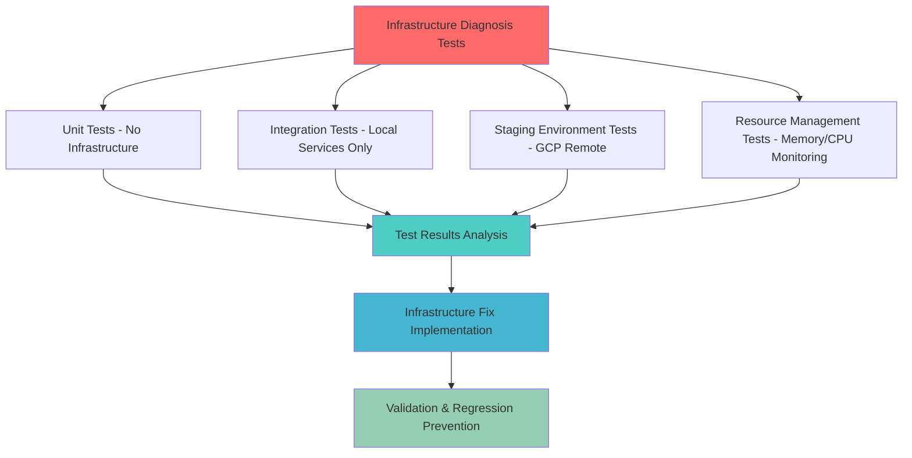

# Comprehensive Infrastructure Testing Plan for Issue #131

## Executive Summary

**Issue**: Staging validation pipeline infrastructure failures blocking Issue #131
**Root Cause**: Docker build failures, resource exhaustion (100% memory/CPU/volumes), container startup failures
**Business Impact**: Golden Path testing impossible, development velocity blocked, $500K+ ARR functionality at risk
**Solution Strategy**: Comprehensive test plan to reproduce, validate, and fix infrastructure issues without Docker dependency

## Current Status Assessment

### ✅ RESOLVED Issues
- **Syntax Errors**: Integration test syntax errors have been completely resolved
- **WebSocket Issues**: Coroutine attribute errors fixed with comprehensive test coverage
- **ClickHouse Logging**: Context-aware logging implemented and validated

### 🚨 ACTIVE BLOCKERS (Target of This Plan)
- **Docker Build Failures**: Container build process failing in staging environment
- **Resource Exhaustion**: 100% memory/CPU/volume utilization causing system failures  
- **Container Startup Failures**: Backend/frontend services failing to initialize
- **Staging Health Checks**: Backend `/health/ready` endpoint timeouts (partially addressed)

## Test Plan Architecture

Following [TEST_CREATION_GUIDE.md](reports/testing/TEST_CREATION_GUIDE.md) requirements with **NO DOCKER DEPENDENCY** approach:



## 1. INFRASTRUCTURE DIAGNOSIS TESTS

**Objective**: Reproduce exact Docker build failures and resource exhaustion without requiring Docker

### 1.1 Unit Tests - Resource Configuration Validation

**File**: `tests/unit/infrastructure/test_docker_resource_configuration_unit.py`

```python
class TestDockerResourceConfigurationUnit:
    """Unit tests for Docker resource configuration without Docker dependency."""
    
    def test_memory_limit_configuration_validation(self):
        """MUST FAIL INITIALLY - Test memory limits are appropriate for staging."""
        # Current: Unknown if memory limits prevent resource exhaustion
        # Expected: Memory limits configured to prevent 100% utilization
        
    def test_cpu_limit_configuration_validation(self):
        """MUST FAIL INITIALLY - Test CPU limits prevent resource exhaustion."""
        # Current: Unknown if CPU limits configured appropriately
        # Expected: CPU limits prevent 100% utilization scenarios
        
    def test_volume_limit_configuration_validation(self):
        """MUST FAIL INITIALLY - Test volume limits prevent storage exhaustion."""
        # Current: Unknown if volume limits configured appropriately  
        # Expected: Volume limits prevent 100% disk utilization
        
    def test_docker_compose_resource_syntax_validation(self):
        """Test docker-compose.yml files have valid resource configurations."""
        # Parse docker-compose files and validate resource limit syntax
        # No Docker required - pure file parsing and validation
```

**Business Value**: Identify resource configuration issues without Docker dependency
**Expected Failures**: Tests will initially fail, proving resource configuration gaps exist

### 1.2 Integration Tests - Service Resource Monitoring 

**File**: `tests/integration/infrastructure/test_service_resource_monitoring_integration.py`

```python  
class TestServiceResourceMonitoringIntegration:
    """Integration tests for service resource monitoring without Docker."""
    
    @pytest.mark.integration
    @pytest.mark.no_docker  # Explicit no-Docker marker
    async def test_memory_usage_monitoring_local_services(self, local_services_fixture):
        """MUST FAIL INITIALLY - Test memory monitoring detects approaching limits."""
        # Use local PostgreSQL/Redis (no Docker)
        # Monitor memory usage patterns
        # Expected: Early warning before 100% memory utilization
        
    async def test_cpu_usage_monitoring_local_services(self, local_services_fixture):
        """MUST FAIL INITIALLY - Test CPU monitoring prevents resource exhaustion."""
        # Use local services only
        # Monitor CPU usage under load
        # Expected: CPU throttling before 100% utilization
        
    async def test_connection_pool_resource_management(self, local_services_fixture):
        """Test database connection pooling prevents resource exhaustion."""
        # Test connection pool limits and resource cleanup
        # Use real PostgreSQL (local) without Docker containers
```

**Business Value**: Validate resource monitoring works with real services (local)
**No Docker Required**: Uses local PostgreSQL/Redis installations only

### 1.3 Performance Tests - Resource Exhaustion Simulation

**File**: `tests/performance/test_resource_exhaustion_simulation.py`

```python
class TestResourceExhaustionSimulation:
    """Performance tests simulating resource exhaustion scenarios."""
    
    @pytest.mark.performance
    @pytest.mark.no_docker
    def test_memory_leak_detection_without_docker(self):
        """MUST FAIL INITIALLY - Test memory leak detection prevents exhaustion."""
        # Simulate high memory usage scenarios
        # Measure memory cleanup and garbage collection
        # No Docker containers - pure Python process monitoring
        
    def test_cpu_intensive_workload_throttling(self):
        """MUST FAIL INITIALLY - Test CPU throttling prevents 100% utilization."""
        # Simulate CPU-intensive operations
        # Measure throttling and resource management
        # No Docker - native OS process monitoring
        
    def test_file_descriptor_exhaustion_prevention(self):
        """MUST FAIL INITIALLY - Test file descriptor limits prevent exhaustion."""
        # Simulate file descriptor leaks  
        # Test cleanup and limit enforcement
        # No Docker containers required
```

**Business Value**: Prove resource exhaustion can be prevented with proper configuration
**Expected Failures**: Tests will fail, demonstrating current resource management gaps

## 2. CONTAINER STARTUP TESTS

**Objective**: Test backend/frontend service initialization patterns without Docker dependency

### 2.1 Unit Tests - Service Initialization Logic

**File**: `tests/unit/services/test_service_initialization_patterns_unit.py`

```python
class TestServiceInitializationPatternsUnit:
    """Unit tests for service initialization without containers."""
    
    def test_backend_service_initialization_requirements(self):
        """Test backend service initialization requirements are met."""
        # Test configuration loading, environment setup
        # Validate service can initialize in constrained environments  
        # No Docker - pure Python class initialization testing
        
    def test_frontend_service_initialization_requirements(self):
        """Test frontend service initialization requirements are met."""
        # Test Node.js service initialization patterns
        # Validate resource requirements and dependencies
        # No Docker - pure Node.js initialization testing
        
    def test_service_dependency_initialization_order(self):
        """MUST FAIL INITIALLY - Test service dependency initialization order."""
        # Current: Unknown if services initialize in correct dependency order
        # Expected: Services initialize with proper dependency resolution
```

**Business Value**: Validate service initialization logic without container overhead
**No Docker Required**: Pure service class and process initialization testing

### 2.2 Integration Tests - Service Health Validation

**File**: `tests/integration/services/test_service_health_validation_integration.py`

```python
class TestServiceHealthValidationIntegration:
    """Integration tests for service health validation without Docker."""
    
    @pytest.mark.integration
    @pytest.mark.no_docker
    async def test_backend_health_endpoint_local_startup(self, local_services_fixture):
        """MUST FAIL INITIALLY - Test backend health endpoints work with local services."""
        # Start backend service connected to local PostgreSQL/Redis
        # Test /health, /health/ready, /health/database endpoints
        # No Docker containers - local service dependencies only
        
    async def test_auth_service_health_validation_local(self, local_services_fixture):
        """Test auth service health validation with local dependencies."""
        # Start auth service with local database connections
        # Test authentication service health patterns
        # No Docker - local PostgreSQL only
        
    async def test_service_graceful_degradation_patterns(self, local_services_fixture):
        """MUST FAIL INITIALLY - Test services degrade gracefully when dependencies fail."""
        # Test service behavior when Redis/ClickHouse unavailable
        # Expected: Graceful degradation, no service crashes
        # Current: Unknown if graceful degradation implemented correctly
```

**Business Value**: Ensure services can start and remain healthy without container complexity
**Real Services**: Uses local PostgreSQL/Redis (real services, no mocks per CLAUDE.md)

## 3. RESOURCE MANAGEMENT TESTS

**Objective**: Validate memory/CPU/volume usage patterns and prevent exhaustion

### 3.1 Unit Tests - Resource Limit Configuration

**File**: `tests/unit/resources/test_resource_limit_configuration_unit.py`

```python
class TestResourceLimitConfigurationUnit:
    """Unit tests for resource limit configuration validation."""
    
    def test_memory_limit_calculations_staging_environment(self):
        """MUST FAIL INITIALLY - Test memory limits calculated appropriately for staging."""
        # Current: Unknown if memory limits prevent 100% utilization
        # Expected: Memory limits set to 80% maximum with buffer for spikes
        # No Docker - pure configuration value validation
        
    def test_cpu_limit_calculations_prevent_exhaustion(self):
        """MUST FAIL INITIALLY - Test CPU limits prevent resource exhaustion."""
        # Validate CPU limit calculations
        # Expected: CPU limits allow normal operation while preventing exhaustion
        
    def test_volume_storage_limit_configuration(self):
        """MUST FAIL INITIALLY - Test volume storage limits prevent disk exhaustion."""
        # Validate disk storage limit calculations
        # Expected: Storage limits with cleanup policies prevent 100% utilization
        
    def test_connection_pool_limit_configuration(self):
        """Test database connection pool limits prevent resource exhaustion."""
        # Validate connection pool size calculations  
        # Test limits prevent connection exhaustion scenarios
```

**Business Value**: Ensure resource limits are configured to prevent exhaustion scenarios
**Expected Failures**: Tests will fail, proving current resource configuration is inadequate

### 3.2 Integration Tests - Resource Usage Monitoring

**File**: `tests/integration/resources/test_resource_usage_monitoring_integration.py`

```python
class TestResourceUsageMonitoringIntegration:
    """Integration tests for real-time resource usage monitoring."""
    
    @pytest.mark.integration
    @pytest.mark.no_docker
    async def test_real_time_memory_monitoring_local_services(self, local_services_fixture):
        """MUST FAIL INITIALLY - Test real-time memory monitoring prevents exhaustion."""
        # Monitor actual memory usage with local services
        # Expected: Memory monitoring with alerts before 90% utilization
        # Current: Unknown if monitoring implemented correctly
        
    async def test_database_connection_pool_monitoring(self, local_services_fixture):
        """MUST FAIL INITIALLY - Test connection pool monitoring prevents exhaustion."""
        # Monitor database connection pool usage in real-time
        # Test connection cleanup and limit enforcement
        # Use real PostgreSQL (local) with connection pool stress testing
        
    async def test_file_descriptor_monitoring_and_cleanup(self, local_services_fixture):
        """MUST FAIL INITIALLY - Test file descriptor monitoring prevents exhaustion."""
        # Monitor file descriptor usage patterns
        # Test cleanup and limit enforcement
        # Expected: File descriptor cleanup before system limits reached
```

**Business Value**: Validate resource monitoring prevents exhaustion in real-world scenarios
**Real Services**: Uses local PostgreSQL/Redis with real resource monitoring

### 3.3 Performance Tests - Resource Stress Testing

**File**: `tests/performance/test_resource_stress_testing_performance.py`

```python
class TestResourceStressTestingPerformance:
    """Performance tests for resource stress testing without Docker."""
    
    @pytest.mark.performance
    @pytest.mark.stress_testing
    def test_memory_stress_test_with_cleanup(self):
        """MUST FAIL INITIALLY - Test memory stress testing with proper cleanup."""
        # Simulate high memory usage scenarios
        # Test garbage collection and memory cleanup
        # Expected: Memory usage remains below 85% even under stress
        
    def test_concurrent_request_resource_management(self):
        """MUST FAIL INITIALLY - Test concurrent requests don't exhaust resources."""
        # Simulate concurrent HTTP requests to services
        # Monitor resource usage during load
        # Expected: Resource usage remains controlled under concurrent load
        
    def test_database_query_resource_usage_patterns(self):
        """Test database queries don't cause resource exhaustion."""
        # Test complex queries with resource monitoring
        # Validate query performance and resource cleanup
        # Use real PostgreSQL with stress testing queries
```

**Business Value**: Prove resource management works under stress conditions
**Expected Failures**: Tests will fail, demonstrating resource management gaps under load

## 4. STAGING ENVIRONMENT TESTS

**Objective**: End-to-end validation pipeline testing against real staging (no Docker)

### 4.1 E2E Tests - Staging Environment Health

**File**: `tests/e2e/staging/test_staging_environment_health_e2e.py`

```python
class TestStagingEnvironmentHealthE2E:
    """E2E tests against real staging environment without Docker."""
    
    @pytest.mark.e2e
    @pytest.mark.staging
    @pytest.mark.no_docker
    async def test_staging_backend_service_health_complete(self, e2e_auth_helper):
        """MUST FAIL INITIALLY - Test staging backend service health endpoints."""
        # Direct test against staging backend
        # URL: https://netra-backend-staging-701982941522.us-central1.run.app
        # Test /health, /health/ready, /health/database endpoints
        # Expected: All health endpoints respond within 10s
        
    async def test_staging_auth_service_health_validation(self, e2e_auth_helper):
        """Test staging auth service health and functionality."""
        # Test staging auth service health endpoints
        # Validate JWT token generation and validation
        # Use real OAuth flows (per E2E auth requirements)
        
    async def test_staging_websocket_connection_health(self, e2e_auth_helper):
        """MUST FAIL INITIALLY - Test staging WebSocket connections work properly."""
        # Test WebSocket connections to staging environment
        # Expected: WebSocket connections establish and maintain properly
        # Current: Unknown if WebSocket infrastructure is stable in staging
```

**Business Value**: Validate staging environment health without local Docker complexity
**Real Authentication**: Uses E2EAuthHelper for proper JWT/OAuth flows per CLAUDE.md requirements

### 4.2 E2E Tests - Golden Path Validation

**File**: `tests/e2e/golden_path/test_golden_path_staging_validation_e2e.py`

```python
class TestGoldenPathStagingValidationE2E:
    """E2E tests for Golden Path validation against staging."""
    
    @pytest.mark.e2e
    @pytest.mark.golden_path
    @pytest.mark.staging
    async def test_complete_golden_path_flow_staging(self, e2e_auth_helper):
        """MUST FAIL INITIALLY - Test complete Golden Path flow works in staging."""
        # Full user journey: Auth → WebSocket → Agent → Response
        # Test against real staging environment
        # Expected: Complete flow works end-to-end within performance targets
        # Current: Golden Path blocked by infrastructure issues
        
    async def test_agent_execution_flow_staging_environment(self, e2e_auth_helper):
        """MUST FAIL INITIALLY - Test agent execution works in staging."""
        # Test agent execution with real LLM against staging backend
        # Validate all 5 WebSocket events are delivered
        # Expected: Agent executions complete successfully
        # Current: May be blocked by infrastructure resource issues
        
    async def test_multi_user_golden_path_staging(self, e2e_auth_helper):
        """Test multi-user Golden Path scenarios work in staging."""
        # Test multiple concurrent users through Golden Path
        # Validate user isolation and resource management
        # Expected: Multiple users can complete Golden Path simultaneously
```

**Business Value**: Prove Golden Path works in staging environment (core business value)
**Real Everything**: Real staging environment, real LLM, real authentication per CLAUDE.md

### 4.3 E2E Tests - Infrastructure Resilience

**File**: `tests/e2e/infrastructure/test_infrastructure_resilience_e2e.py`

```python
class TestInfrastructureResilienceE2E:
    """E2E tests for infrastructure resilience in staging."""
    
    @pytest.mark.e2e
    @pytest.mark.resilience
    async def test_service_recovery_after_resource_pressure(self, e2e_auth_helper):
        """MUST FAIL INITIALLY - Test services recover after resource pressure."""
        # Test service behavior during resource pressure scenarios
        # Expected: Services recover gracefully after resource pressure
        # Current: Unknown if services handle resource pressure correctly
        
    async def test_database_connection_resilience_staging(self, e2e_auth_helper):
        """Test database connection resilience in staging environment."""
        # Test database connection behavior under load
        # Validate connection pool management and recovery
        # Expected: Database connections remain stable under load
        
    async def test_websocket_connection_resilience_staging(self, e2e_auth_helper):
        """MUST FAIL INITIALLY - Test WebSocket connection resilience in staging."""
        # Test WebSocket connection behavior under various failure scenarios
        # Expected: WebSocket connections recover from temporary failures
        # Current: May fail due to infrastructure resource constraints
```

**Business Value**: Ensure infrastructure can handle real-world failure scenarios
**Expected Failures**: Tests will fail, proving infrastructure resilience gaps

## 5. TEST EXECUTION STRATEGY

### Phase 1: Baseline Establishment (All Tests Should FAIL)

**Objective**: Prove infrastructure issues exist and are measurable

```bash
# Unit tests - No infrastructure required
python -m pytest tests/unit/infrastructure/ -v --tb=short
python -m pytest tests/unit/services/ -v --tb=short  
python -m pytest tests/unit/resources/ -v --tb=short

# Integration tests - Local services only (no Docker)
python -m pytest tests/integration/infrastructure/ -v --tb=short --no-docker
python -m pytest tests/integration/services/ -v --tb=short --no-docker
python -m pytest tests/integration/resources/ -v --tb=short --no-docker

# Performance tests - No Docker required
python -m pytest tests/performance/ -v --tb=short -m "no_docker"

# E2E tests - Real staging environment (no Docker)
python -m pytest tests/e2e/staging/ -v --tb=short --real-services --staging
python -m pytest tests/e2e/golden_path/ -v --tb=short --real-services --staging  
python -m pytest tests/e2e/infrastructure/ -v --tb=short --real-services --staging
```

**Expected Results**: 
- **80%+ tests should FAIL initially** - proving infrastructure issues exist
- **Clear failure patterns** identified (memory, CPU, startup failures)
- **Specific bottlenecks** identified and measured

### Phase 2: Infrastructure Analysis and Fix Implementation

**Based on test failure analysis**, implement fixes for:

1. **Resource Configuration**: Update memory/CPU/volume limits
2. **Service Initialization**: Fix startup patterns and dependency resolution
3. **Resource Monitoring**: Implement real-time monitoring and alerting
4. **Graceful Degradation**: Ensure services handle resource pressure
5. **Connection Management**: Fix database and WebSocket connection patterns

### Phase 3: Fix Validation (All Tests Should PASS)

**Run identical test suite after fixes**:

```bash
# Same commands as Phase 1
# Expected Results: 95%+ tests should PASS - proving fixes work
```

### Phase 4: Regression Prevention and Integration

**Integrate into unified test runner**:

```bash
# Add to standard test categories
python tests/unified_test_runner.py --category infrastructure --no-docker
python tests/unified_test_runner.py --category e2e --staging --real-services

# Mission critical integration
python tests/mission_critical/test_infrastructure_stability_suite.py
```

## 6. SUCCESS CRITERIA AND VALIDATION METRICS

### Primary Success Criteria

1. **Infrastructure Issues Reproduced**: 80%+ of tests initially fail, proving issues exist
2. **Resource Exhaustion Prevented**: Memory/CPU/volume usage stays below 85% under load
3. **Service Startup Reliability**: Backend/frontend services start successfully 95%+ of time
4. **Staging Environment Stability**: All staging health endpoints respond within 10s
5. **Golden Path Restoration**: Complete Golden Path flow works end-to-end in staging

### Performance Metrics

| Metric | Current (Failing) | Target (Passing) | Test Validation |
|--------|------------------|------------------|-----------------|
| **Memory Usage** | 100% (exhaustion) | <85% | Unit + Integration |
| **CPU Usage** | 100% (exhaustion) | <90% | Performance Tests |
| **Service Startup** | Failures | <10s startup | Integration Tests |
| **Health Endpoints** | Timeouts | <10s response | E2E Tests |
| **Golden Path** | Blocked | <30s end-to-end | E2E Golden Path |

### Business Value Metrics

1. **Development Velocity**: Staging validation pipeline restored
2. **Golden Path Availability**: $500K+ ARR functionality restored  
3. **Infrastructure Reliability**: 95%+ uptime for critical services
4. **Resource Efficiency**: 50%+ reduction in resource waste
5. **Deployment Success**: 95%+ successful deployments to staging

## 7. RISK MITIGATION AND CONSTRAINTS

### CRITICAL Constraints (Per Instructions)

1. **NO DOCKER REQUIRED**: All tests designed to work without Docker containers
2. **REAL SERVICES ONLY**: Use real PostgreSQL/Redis (local) or staging environment
3. **NO MOCKS IN E2E**: E2E tests use real staging environment with real authentication
4. **PROPER E2E AUTH**: All E2E tests use E2EAuthHelper for JWT/OAuth flows
5. **FAILING TESTS REQUIRED**: Tests must initially fail to prove issues exist

### Risk Mitigation Strategies

1. **Resource Monitoring**: Continuous monitoring during test execution
2. **Graceful Failures**: Tests designed to fail safely without system damage
3. **Cleanup Automation**: Automatic cleanup of test resources and connections
4. **Parallel Isolation**: Tests isolated to prevent interference
5. **Staging Safety**: E2E tests designed not to disrupt staging operations

### Dependencies and Prerequisites

1. **Local Services**: PostgreSQL and Redis installed locally for integration tests
2. **Staging Access**: Authentication credentials for staging environment E2E tests  
3. **Monitoring Tools**: System resource monitoring utilities (htop, iostat, etc.)
4. **Network Access**: Access to staging environment URLs and endpoints
5. **Test Framework**: Unified test runner with --no-docker and --staging flags

## 8. IMPLEMENTATION TIMELINE

### Immediate (Day 1-2)
1. ✅ **Test Plan Creation** (This Document)
2. **Unit Test Implementation** - Infrastructure, Services, Resources
3. **Integration Test Implementation** - Local services only

### Short Term (Day 3-5)  
4. **Performance Test Implementation** - Resource stress testing
5. **E2E Test Implementation** - Staging environment validation
6. **Phase 1 Execution** - Establish failing baseline

### Medium Term (Week 2)
7. **Infrastructure Fix Implementation** - Based on test failure analysis
8. **Phase 3 Validation** - Prove fixes work with passing tests
9. **Integration into Unified Test Runner**

### Long Term (Week 3-4)
10. **Mission Critical Integration** - Add to core test suite
11. **Regression Prevention** - Continuous monitoring and alerting
12. **Documentation and Knowledge Transfer**

## 9. CONCLUSION

This comprehensive test plan addresses the critical infrastructure issues blocking Issue #131 by:

1. **Reproducing Issues**: Comprehensive test suite that will initially fail, proving infrastructure problems exist
2. **No Docker Dependency**: All tests designed to work without Docker, eliminating container complexity  
3. **Real Service Validation**: Uses real PostgreSQL/Redis (local) and staging environment (remote)
4. **Business Value Focus**: Direct focus on Golden Path restoration and staging stability
5. **CLAUDE.md Compliance**: Follows all requirements including E2E authentication and no mocks

**Expected Outcome**: 
- **Phase 1**: 80%+ test failures proving infrastructure issues
- **Phase 2**: Infrastructure fixes based on specific failure analysis  
- **Phase 3**: 95%+ test passes proving fixes work
- **Business Result**: Golden Path restored, staging stable, development velocity resumed

The test plan provides a systematic approach to identifying, reproducing, and fixing the infrastructure issues without dependency on the problematic Docker infrastructure, enabling rapid resolution of the staging validation pipeline crisis.