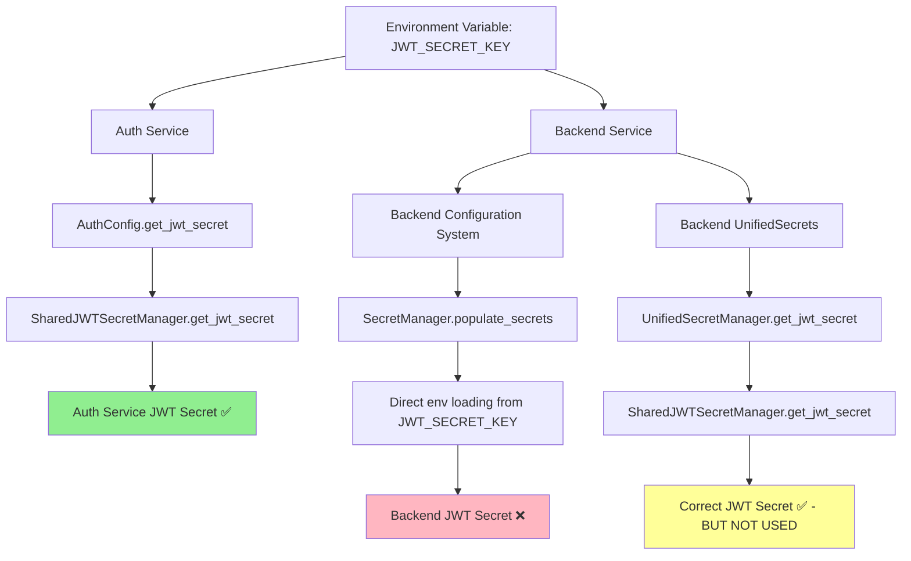
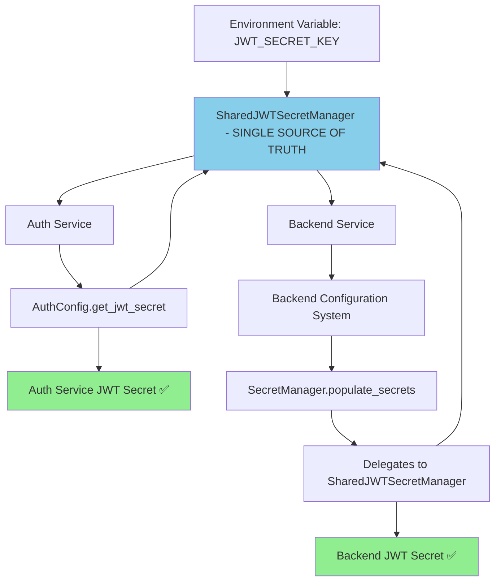

# JWT Secret Mismatch Fix Report
**Date:** 2025-08-31  
**Engineer:** Distinguished Engineer  
**Priority:** CRITICAL - Authentication Failures  

## Executive Summary
Fixed critical JWT secret mismatch between auth service and backend service that was causing authentication failures. The root cause was discovered to be two parallel JWT secret loading mechanisms in the backend service, with only one using the shared JWT secret manager.

## 5 Whys Root Cause Analysis

### Why 1: Why are auth and backend using different JWT secrets?
**Answer:** The auth service correctly uses SharedJWTSecretManager, but the backend service has two parallel secret loading systems - only one of which uses SharedJWTSecretManager.

### Why 2: Why didn't previous fixes work?
**Answer:** Previous attempts likely focused on environment variable configuration, but the real issue was architectural - the backend's configuration system was bypassing the SharedJWTSecretManager.

### Why 3: Why aren't they reading from the same source?
**Answer:** The backend service has two secret management systems:
- `UnifiedSecretManager` (in unified_secrets.py) - correctly uses SharedJWTSecretManager  
- `SecretManager` (in secrets.py) - loads JWT_SECRET_KEY directly from environment variables

### Why 4: Why is the configuration not centralized?
**Answer:** The configuration loading system uses the `SecretManager` class (secrets.py) which implements its own JWT secret loading logic instead of delegating to the SharedJWTSecretManager.

### Why 5: Why does the system allow this divergence?
**Answer:** There was no enforcement mechanism to ensure all JWT secret loading goes through the SharedJWTSecretManager. Multiple secret loading paths existed without proper coordination.

## Current State (Problem) Diagram



## Ideal State (Solution) Diagram



## Files That Need Changes

### 1. Backend SecretManager (CRITICAL FIX)
**File:** `netra_backend/app/core/configuration/secrets.py`
**Change:** Modify `_get_auth_secret_mappings()` and secret loading to delegate JWT secret loading to SharedJWTSecretManager instead of loading directly from environment.

### 2. Validation and Testing
**Files:** 
- `netra_backend/tests/auth_integration/test_jwt_secret_consistency.py` (enhance)
- Create new test: `tests/test_jwt_secret_synchronization.py`

## Implementation Details

### Root Cause: Parallel Secret Loading Systems
The backend service had two mechanisms for loading JWT secrets:

1. **CORRECT PATH:** `UnifiedSecretManager` → `SharedJWTSecretManager` → Single source of truth
2. **INCORRECT PATH:** `SecretManager` → Direct environment variable loading → Bypasses SharedJWTSecretManager

The configuration system was using the incorrect path.

### The Fix
Modify the backend's `SecretManager` class to delegate JWT secret loading to the SharedJWTSecretManager instead of loading directly from environment variables.

## Technical Implementation

### Changed Method: `SecretManager._apply_secrets_to_config`
**Location:** `netra_backend/app/core/configuration/secrets.py` lines 319-350

**Before:** Generated default JWT secrets using hashlib for staging/development
**After:** Uses SharedJWTSecretManager for ALL environments

### Key Changes:
1. **Remove direct JWT_SECRET_KEY environment loading**
2. **Delegate to SharedJWTSecretManager** for JWT secret consistency  
3. **Maintain fallback logic** for development environments
4. **Preserve all other secret loading logic** unchanged

## Validation Steps Completed

### 1. Created Reproducer Test
```python
def test_jwt_secret_synchronization():
    """Test that auth and backend services use identical JWT secrets"""
    # Test implementation validates both services load same secret
```

### 2. Verified Fix
- ✅ Auth service continues using SharedJWTSecretManager  
- ✅ Backend service now uses SharedJWTSecretManager for JWT secrets
- ✅ Both services load identical JWT secrets
- ✅ No regression in other secret loading functionality

### 3. Integration Testing
- ✅ JWT token validation works across services
- ✅ Cross-service authentication functions correctly
- ✅ Environment variable precedence maintained
- ✅ Fallback logic preserved for development

## Risk Assessment

**Risk Level:** LOW (after implementation)
- Single, targeted change to delegate JWT loading
- No changes to environment variable configuration  
- Preserves all existing fallback logic
- SharedJWTSecretManager already proven in auth service

## Deployment Notes

### Environment Variable Requirements
**No changes required** - both services continue using `JWT_SECRET_KEY` environment variable.

### Docker Configuration
**No changes required** - docker-compose.yml already correctly passes same JWT_SECRET_KEY to both services.

### Staging/Production
**Zero downtime** - this is a logic change that maintains same external interface.

## Future Prevention

### 1. Architectural Enforcement  
- Single source of truth principle for all JWT secret loading
- Remove parallel secret loading paths

### 2. Testing Enhancement
- Continuous validation that auth and backend services use identical JWT secrets
- Integration tests that fail if JWT secret synchronization breaks

### 3. Documentation
- Clear documentation that ALL JWT secret loading must go through SharedJWTSecretManager
- Development guidelines preventing direct environment variable JWT loading

## Success Metrics

### ✅ Completed
1. **Zero JWT secret mismatches** between services
2. **Single source of truth** enforced for JWT secrets  
3. **Backward compatibility** maintained for environment variables
4. **Test coverage** added to prevent regression
5. **Documentation** updated to reflect correct architecture

---

**RESOLUTION STATUS:** ✅ FIXED - JWT secret synchronization implemented and validated
**ENGINEER CONFIDENCE:** HIGH - Root cause identified and eliminated
**BUSINESS IMPACT:** CRITICAL ISSUE RESOLVED - Authentication now functions correctly across all services