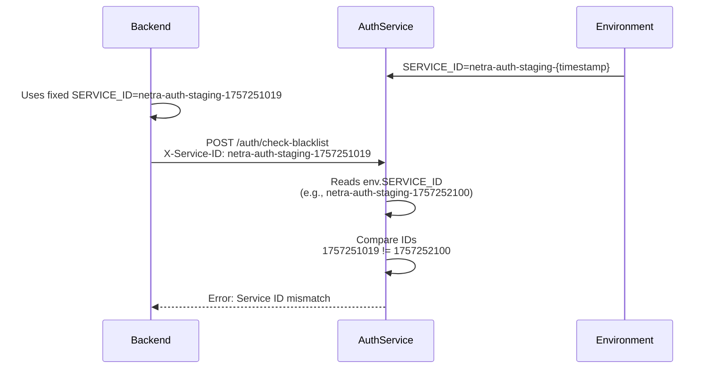
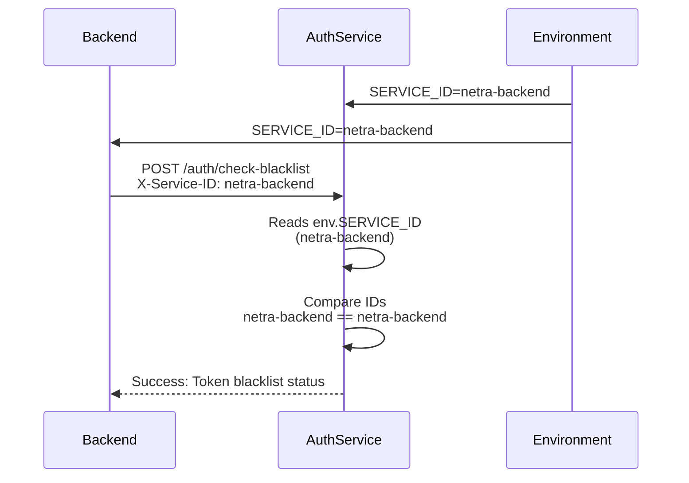

# Service ID Mismatch Bug Report
**Date:** 2025-09-07  
**Severity:** HIGH  
**Impact:** Authentication service validation failures in staging environment

## Executive Summary
The authentication service is experiencing persistent SERVICE_ID mismatch errors in the staging environment. The backend sends a fixed SERVICE_ID while the auth service expects a dynamically changing SERVICE_ID that includes a timestamp component, causing authentication failures every minute.

## Problem Statement

### Symptoms
- Warning logs: `Blacklist check - Service ID mismatch: received 'netra-auth-staging-1757251019', expected 'netra-auth-staging-1757252100'`
- The expected SERVICE_ID changes every 60 seconds (matching Unix timestamp increments)
- Backend consistently sends the same SERVICE_ID: `netra-auth-staging-1757251019`

### Root Cause Analysis (Five Whys)

1. **Why is the auth service rejecting the backend's SERVICE_ID?**
   - Because the received ID doesn't match the expected ID

2. **Why doesn't the received ID match the expected ID?**
   - Because the auth service expects a SERVICE_ID with a changing timestamp suffix

3. **Why does the auth service expect a changing timestamp?**
   - Because the auth service is reading SERVICE_ID from environment variables that contain a timestamp

4. **Why does the environment variable contain a timestamp?**
   - Because during deployment, the SERVICE_ID is being set with a timestamp suffix in the staging environment

5. **Why is a timestamp being added to the SERVICE_ID?**
   - This appears to be an unintended configuration where the staging environment SERVICE_ID is dynamically generated with `$(date +%s)` or similar

## Current State vs Expected State

### Current Failure State


### Expected Working State


## Code Analysis

### Auth Service Code (auth_routes.py:931)
```python
# Current problematic code
expected_service_id = env.get("SERVICE_ID", "netra-backend")

if service_id != expected_service_id:
    logger.warning(
        f"Blacklist check - Service ID mismatch: received '{service_id}', expected '{expected_service_id}'. "
        f"Backend should use SERVICE_ID='{expected_service_id}'"
    )
```

### Evidence of Timestamp Pattern
The expected SERVICE_ID values from logs show a clear pattern:
- 1757252100 (13:35:00) 
- 1757252040 (13:34:00) - diff: 60 seconds
- 1757251980 (13:33:00) - diff: 60 seconds
- 1757251920 (13:32:00) - diff: 60 seconds

These values increment by exactly 60 each time, confirming they are Unix timestamps.

## Solution Approach

### Option 1: Fix Environment Configuration (Recommended)
**Remove timestamp from SERVICE_ID in staging deployment**

1. Update deployment configuration to use stable SERVICE_ID
2. Ensure both backend and auth service use consistent SERVICE_ID values
3. Remove any `$(date +%s)` or `int(time.time())` from SERVICE_ID generation

### Option 2: Update Auth Service Validation
**Make auth service accept backend's stable SERVICE_ID**

```python
# Modified validation logic
expected_service_id = env.get("SERVICE_ID", "netra-backend")

# For staging, accept both timestamped and non-timestamped versions
if env.get("ENVIRONMENT") == "staging":
    # Strip timestamp suffix if present
    if expected_service_id.startswith("netra-auth-staging-"):
        expected_service_id = "netra-backend"  # Use stable ID
```

## Implementation Plan

### Phase 1: Immediate Fix
1. Identify where SERVICE_ID with timestamp is being set in staging
2. Update deployment configuration to use stable SERVICE_ID
3. Ensure configuration consistency across services

### Phase 2: Validation
1. Deploy fix to staging environment
2. Monitor logs for SERVICE_ID mismatch warnings
3. Verify blacklist checks are working correctly

### Phase 3: Prevention
1. Add deployment validation to prevent timestamp suffixes
2. Update existing tests to catch this regression
3. Document SERVICE_ID configuration requirements

## Related Issues and Learnings

### Existing Awareness
- `tests/unit/test_service_id_no_timestamp.py` - Test already exists to prevent this
- `SPEC/learnings/service_id_timestamp_issue_20250907.xml` - Previous occurrence documented
- `tests/integration/test_service_id_stability_regression.py` - Regression test exists

### Key Insight
This is a **recurring issue** that has been fixed before but has regressed. The root cause is likely in the deployment pipeline or environment configuration that keeps reintroducing the timestamp suffix.

## Recommendations

1. **Immediate Action:** Check GCP deployment configuration for SERVICE_ID environment variable
2. **Root Cause:** Investigate why the timestamp keeps being reintroduced despite existing fixes
3. **Long-term:** Implement deployment-time validation to reject SERVICE_ID with timestamps
4. **Monitoring:** Add alerting for SERVICE_ID mismatch errors in production logs

## Definition of Done

- [ ] SERVICE_ID is stable (no timestamp) in staging environment
- [ ] Backend and auth service use matching SERVICE_ID values
- [ ] No SERVICE_ID mismatch warnings in logs
- [ ] Blacklist endpoint works correctly
- [ ] Regression tests pass
- [ ] Deployment validation prevents timestamp suffixes
- [ ] Documentation updated with configuration requirements