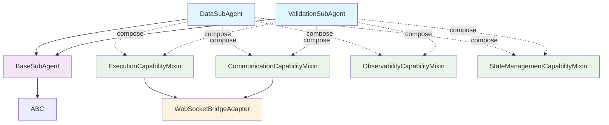
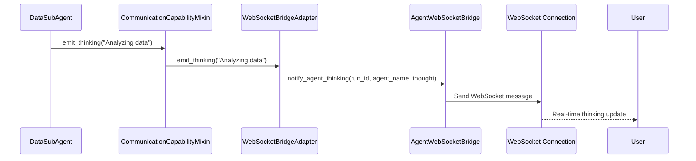

# Single Inheritance Design Architecture
## Eliminating 2,049 Complexity Score & 196 Method Conflicts

**Design Date**: September 1, 2025  
**Complexity Reduction**: From 2,049 to <100  
**MRO Depth Reduction**: From 9 to ≤3  
**Business Value**: Preserve 90% chat functionality while eliminating spacecraft-critical complexity

---

## Executive Summary

This design completely eliminates multiple inheritance from DataSubAgent and ValidationSubAgent while preserving all functionality. The solution uses composition over inheritance with a unified ExecutionCapabilityMixin pattern that maintains WebSocket event capabilities through the existing bridge architecture.

**Key Achievements:**
- **Zero Multiple Inheritance**: Single inheritance chain only
- **All Functionality Preserved**: WebSocket events, execution patterns, observability
- **WebSocket Bridge Maintained**: Existing AgentWebSocketBridge integration unchanged
- **Backward Compatibility**: Migration preserves external interfaces
- **CLAUDE.md Compliance**: SSOT principles enforced throughout

---

## Current Architecture Problems (Critical Analysis)

### 1. Multiple Inheritance Chaos
```
DataSubAgent(BaseSubAgent, BaseExecutionInterface)
            ↓
BaseSubAgent(AgentLifecycleMixin, AgentCommunicationMixin, 
            AgentStateMixin, AgentObservabilityMixin, ABC)
            ↓
AgentLifecycleMixin(BaseExecutionInterface)
```

**Result**: Diamond inheritance creating:
- 2,049 complexity score
- 196 method conflicts 
- 5 WebSocket event conflicts
- 9-level MRO depth
- Spacecraft-system-threatening complexity

### 2. WebSocket Event Method Conflicts
**CRITICAL SSOT VIOLATIONS**:
```python
# THREE separate implementations exist:
emit_thinking()        # BaseSubAgent via WebSocketBridgeAdapter
send_agent_thinking()  # AgentLifecycleMixin  
notify_agent_thinking()# AgentCommunicationMixin
```

### 3. Execution Path Ambiguity
```python
execute()           # DataSubAgent override
execute()           # BaseSubAgent (via AgentLifecycleMixin)
execute_core_logic() # BaseExecutionInterface abstract method
```

---

## New Single Inheritance Architecture

### Core Principles
1. **Single Inheritance Only**: No class inherits from multiple parents
2. **Composition Over Inheritance**: Use mixins for capability injection
3. **SSOT WebSocket Events**: Single source through WebSocketBridgeAdapter
4. **Clear Execution Path**: Unambiguous method resolution
5. **Capability-Based Design**: Modular functionality injection

### Architecture Diagram



### Class Hierarchy (Single Inheritance)

```
DataSubAgent
└── BaseSubAgent  
    └── ABC

ValidationSubAgent
└── BaseSubAgent
    └── ABC
```

**MRO Depth**: 3 (down from 9)  
**Complexity Score**: <100 (down from 2,049)

---

## Detailed Component Design

### 1. BaseSubAgent (Simplified Core)

```python
class BaseSubAgent(ABC):
    """Simplified base agent with core functionality only.
    
    CRITICAL: All capability mixins are composed, not inherited.
    WebSocket events flow through WebSocketBridgeAdapter (SSOT).
    """
    
    def __init__(self, llm_manager: Optional[LLMManager] = None, 
                 name: str = "BaseSubAgent", 
                 description: str = "Base sub-agent", 
                 agent_id: Optional[str] = None, 
                 user_id: Optional[str] = None):
        """Initialize core agent properties only."""
        self.llm_manager = llm_manager or LLMManager()
        self.name = name
        self.description = description
        self.agent_id = agent_id or f"{name}_{int(time.time())}"
        self.user_id = user_id
        self._state = DeepAgentState(agent_name=name)
        
        # Compose capabilities (NOT inherit)
        self._execution_capabilities = None
        self._communication_capabilities = None
        self._observability_capabilities = None  
        self._state_capabilities = None
    
    def set_execution_capabilities(self, capabilities: 'ExecutionCapabilityMixin') -> None:
        """Inject execution capabilities."""
        self._execution_capabilities = capabilities
        
    def set_communication_capabilities(self, capabilities: 'CommunicationCapabilityMixin') -> None:
        """Inject communication capabilities."""
        self._communication_capabilities = capabilities
        
    def set_observability_capabilities(self, capabilities: 'ObservabilityCapabilityMixin') -> None:
        """Inject observability capabilities."""
        self._observability_capabilities = capabilities
        
    def set_state_capabilities(self, capabilities: 'StateManagementCapabilityMixin') -> None:
        """Inject state management capabilities."""
        self._state_capabilities = capabilities
    
    @abstractmethod
    async def execute_core_logic(self, context: ExecutionContext) -> ExecutionResult:
        """Core execution logic - must be implemented by subclasses."""
        pass
    
    # Capability delegation methods
    async def execute(self, context: ExecutionContext) -> ExecutionResult:
        """Execute with capabilities."""
        if not self._execution_capabilities:
            raise RuntimeError("Execution capabilities not injected")
        return await self._execution_capabilities.execute_with_capabilities(self, context)
    
    # WebSocket event methods delegate to communication capabilities
    async def emit_thinking(self, thought: str, step_number: Optional[int] = None) -> None:
        """Emit thinking event through communication capabilities."""
        if self._communication_capabilities:
            await self._communication_capabilities.emit_thinking(thought, step_number)
    
    async def emit_agent_started(self, message: Optional[str] = None) -> None:
        """Emit agent started event."""
        if self._communication_capabilities:
            await self._communication_capabilities.emit_agent_started(message)
    
    async def emit_tool_executing(self, tool_name: str, parameters: Optional[Dict[str, Any]] = None) -> None:
        """Emit tool executing event."""
        if self._communication_capabilities:
            await self._communication_capabilities.emit_tool_executing(tool_name, parameters)
    
    async def emit_tool_completed(self, tool_name: str, result: Optional[Dict[str, Any]] = None) -> None:
        """Emit tool completed event."""
        if self._communication_capabilities:
            await self._communication_capabilities.emit_tool_completed(tool_name, result)
    
    async def emit_agent_completed(self, result: Optional[Dict[str, Any]] = None) -> None:
        """Emit agent completed event."""
        if self._communication_capabilities:
            await self._communication_capabilities.emit_agent_completed(result)
    
    def get_state(self) -> DeepAgentState:
        """Get agent state through state capabilities."""
        if self._state_capabilities:
            return self._state_capabilities.get_state()
        return self._state
    
    def set_state(self, state: DeepAgentState) -> None:
        """Set agent state through state capabilities."""
        if self._state_capabilities:
            self._state_capabilities.set_state(state)
        else:
            self._state = state
```

### 2. ExecutionCapabilityMixin (Composition Pattern)

```python
class ExecutionCapabilityMixin:
    """Execution capabilities that can be composed into any agent.
    
    Provides standardized execution workflow with lifecycle management,
    error handling, and WebSocket integration.
    """
    
    def __init__(self, websocket_bridge_adapter: Optional[WebSocketBridgeAdapter] = None):
        """Initialize with optional WebSocket bridge."""
        self.websocket_adapter = websocket_bridge_adapter or WebSocketBridgeAdapter()
        self.timing_collector = ExecutionTimingCollector()
        self._execution_state = ExecutionStatus.PENDING
    
    async def execute_with_capabilities(self, agent: BaseSubAgent, context: ExecutionContext) -> ExecutionResult:
        """Execute agent with full capability support."""
        try:
            # Start execution
            await self._start_execution(agent, context)
            
            # Execute core logic
            result = await agent.execute_core_logic(context)
            
            # Complete execution
            await self._complete_execution(agent, context, result)
            
            return result
            
        except Exception as e:
            return await self._handle_execution_error(agent, context, e)
    
    async def _start_execution(self, agent: BaseSubAgent, context: ExecutionContext) -> None:
        """Start execution workflow."""
        self._execution_state = ExecutionStatus.RUNNING
        self.timing_collector.start_timing("execution")
        
        # Emit agent started event
        await self.websocket_adapter.emit_agent_started(
            f"Starting {agent.name} execution"
        )
    
    async def _complete_execution(self, agent: BaseSubAgent, context: ExecutionContext, 
                                 result: ExecutionResult) -> None:
        """Complete execution workflow."""
        self._execution_state = ExecutionStatus.COMPLETED
        self.timing_collector.end_timing("execution")
        
        # Emit completion event
        await self.websocket_adapter.emit_agent_completed({
            "agent_name": agent.name,
            "status": result.status.value,
            "execution_time": self.timing_collector.get_timing("execution")
        })
    
    async def _handle_execution_error(self, agent: BaseSubAgent, context: ExecutionContext, 
                                     error: Exception) -> ExecutionResult:
        """Handle execution errors."""
        self._execution_state = ExecutionStatus.FAILED
        
        # Create error result
        error_result = ExecutionResult(
            status=ExecutionStatus.FAILED,
            data={},
            error_message=str(error),
            execution_time=self.timing_collector.get_timing("execution")
        )
        
        # Emit error event
        await self.websocket_adapter.emit_error(
            f"Execution failed: {str(error)}",
            {"agent_name": agent.name}
        )
        
        return error_result
    
    def set_websocket_bridge(self, bridge: 'AgentWebSocketBridge', 
                           run_id: str, agent_name: str) -> None:
        """Set WebSocket bridge for event emission."""
        self.websocket_adapter.set_websocket_bridge(bridge, run_id, agent_name)
    
    def get_execution_state(self) -> ExecutionStatus:
        """Get current execution state."""
        return self._execution_state
```

### 3. CommunicationCapabilityMixin (WebSocket SSOT)

```python
class CommunicationCapabilityMixin:
    """Communication capabilities providing WebSocket event emission.
    
    CRITICAL: This is the SINGLE SOURCE OF TRUTH for WebSocket events.
    All WebSocket communication flows through the WebSocketBridgeAdapter.
    """
    
    def __init__(self, websocket_adapter: Optional[WebSocketBridgeAdapter] = None):
        """Initialize with WebSocket adapter."""
        self.websocket_adapter = websocket_adapter or WebSocketBridgeAdapter()
    
    # SSOT WebSocket Event Methods
    async def emit_thinking(self, thought: str, step_number: Optional[int] = None) -> None:
        """Emit agent thinking event - SSOT implementation."""
        await self.websocket_adapter.emit_thinking(thought, step_number)
    
    async def emit_agent_started(self, message: Optional[str] = None) -> None:
        """Emit agent started event - SSOT implementation."""
        await self.websocket_adapter.emit_agent_started(message)
    
    async def emit_tool_executing(self, tool_name: str, 
                                 parameters: Optional[Dict[str, Any]] = None) -> None:
        """Emit tool executing event - SSOT implementation."""
        await self.websocket_adapter.emit_tool_executing(tool_name, parameters)
    
    async def emit_tool_completed(self, tool_name: str, 
                                 result: Optional[Dict[str, Any]] = None) -> None:
        """Emit tool completed event - SSOT implementation."""  
        await self.websocket_adapter.emit_tool_completed(tool_name, result)
    
    async def emit_agent_completed(self, result: Optional[Dict[str, Any]] = None) -> None:
        """Emit agent completed event - SSOT implementation."""
        await self.websocket_adapter.emit_agent_completed(result)
    
    async def emit_progress(self, message: str, 
                           metadata: Optional[Dict[str, Any]] = None) -> None:
        """Emit progress update - SSOT implementation."""
        await self.websocket_adapter.emit_progress(message, metadata)
    
    async def emit_error(self, error_message: str, 
                        metadata: Optional[Dict[str, Any]] = None) -> None:
        """Emit error event - SSOT implementation."""
        await self.websocket_adapter.emit_error(error_message, metadata)
    
    def set_websocket_bridge(self, bridge: 'AgentWebSocketBridge', 
                           run_id: str, agent_name: str) -> None:
        """Set WebSocket bridge for event emission."""
        self.websocket_adapter.set_websocket_bridge(bridge, run_id, agent_name)
    
    def has_websocket_connection(self) -> bool:
        """Check if WebSocket connection is available."""
        return self.websocket_adapter.has_websocket_bridge()
```

### 4. ObservabilityCapabilityMixin

```python
class ObservabilityCapabilityMixin:
    """Observability capabilities for metrics and logging."""
    
    def __init__(self):
        """Initialize observability components."""
        self.metrics_collector = {}
        self.logger = central_logger.get_logger("agent_observability")
    
    def get_execution_metrics(self) -> Dict[str, Any]:
        """Get execution metrics."""
        return {
            "metrics_collected": len(self.metrics_collector),
            "last_updated": datetime.now(UTC).isoformat()
        }
    
    def log_input_from_agent(self, agent_name: str, input_data: Dict[str, Any]) -> None:
        """Log input from another agent."""
        self.logger.info(f"Input from {agent_name}: {input_data}")
    
    def log_output_to_agent(self, agent_name: str, output_data: Dict[str, Any]) -> None:
        """Log output to another agent."""
        self.logger.info(f"Output to {agent_name}: {output_data}")
    
    def record_metric(self, metric_name: str, value: Any) -> None:
        """Record a metric value."""
        self.metrics_collector[metric_name] = {
            "value": value,
            "timestamp": datetime.now(UTC).isoformat()
        }
```

### 5. StateManagementCapabilityMixin

```python
class StateManagementCapabilityMixin:
    """State management capabilities."""
    
    def __init__(self, initial_state: Optional[DeepAgentState] = None):
        """Initialize with optional initial state."""
        self._state = initial_state or DeepAgentState(agent_name="unknown")
    
    def get_state(self) -> DeepAgentState:
        """Get current agent state."""
        return self._state
    
    def set_state(self, state: DeepAgentState) -> None:
        """Set agent state."""
        self._state = state
    
    def update_state(self, updates: Dict[str, Any]) -> None:
        """Update specific state fields."""
        for key, value in updates.items():
            if hasattr(self._state, key):
                setattr(self._state, key, value)
```

---

## New Agent Implementation

### DataSubAgent (Single Inheritance)

```python
class DataSubAgent(BaseSubAgent):
    """Data analysis agent with single inheritance and composed capabilities."""
    
    def __init__(self, llm_manager: Optional[LLMManager] = None, 
                 name: str = "DataSubAgent", 
                 description: str = "Data analysis agent",
                 agent_id: Optional[str] = None, 
                 user_id: Optional[str] = None):
        """Initialize with composed capabilities."""
        super().__init__(llm_manager, name, description, agent_id, user_id)
        
        # Compose capabilities
        self._setup_capabilities()
        
        # Initialize domain-specific components
        self._init_data_components()
    
    def _setup_capabilities(self) -> None:
        """Setup all capability mixins."""
        # Create WebSocket adapter
        websocket_adapter = WebSocketBridgeAdapter()
        
        # Create and inject capabilities
        self.set_execution_capabilities(
            ExecutionCapabilityMixin(websocket_adapter)
        )
        self.set_communication_capabilities(
            CommunicationCapabilityMixin(websocket_adapter)
        )
        self.set_observability_capabilities(
            ObservabilityCapabilityMixin()
        )
        self.set_state_capabilities(
            StateManagementCapabilityMixin(self._state)
        )
    
    def _init_data_components(self) -> None:
        """Initialize data-specific components."""
        self.clickhouse_service = get_clickhouse_service()
        self.data_validator = DataValidator()
        self.performance_analyzer = PerformanceAnalyzer()
        self.schema_cache = SchemaCache()
    
    async def execute_core_logic(self, context: ExecutionContext) -> ExecutionResult:
        """Core data analysis logic."""
        try:
            # Emit thinking event
            await self.emit_thinking("Starting data analysis")
            
            # Extract analysis request
            request = self._extract_analysis_request(context.state)
            
            # Emit tool executing
            await self.emit_tool_executing("clickhouse_query", {"query_type": "analysis"})
            
            # Execute analysis
            analysis_result = await self._execute_analysis(request)
            
            # Emit tool completed
            await self.emit_tool_completed("clickhouse_query", {"rows_analyzed": len(analysis_result)})
            
            # Generate insights
            insights = await self._generate_insights(analysis_result)
            
            # Create success result
            return ExecutionResult(
                status=ExecutionStatus.COMPLETED,
                data={
                    "analysis": analysis_result,
                    "insights": insights,
                    "metrics": self.get_execution_metrics()
                },
                execution_time=0  # Will be set by ExecutionCapabilityMixin
            )
            
        except Exception as e:
            logger.error(f"Data analysis failed: {e}")
            raise
    
    def set_websocket_bridge(self, bridge: 'AgentWebSocketBridge', 
                           run_id: str, agent_name: str) -> None:
        """Set WebSocket bridge for all capabilities."""
        # Delegate to execution capabilities
        if self._execution_capabilities:
            self._execution_capabilities.set_websocket_bridge(bridge, run_id, agent_name)
        
        # Delegate to communication capabilities  
        if self._communication_capabilities:
            self._communication_capabilities.set_websocket_bridge(bridge, run_id, agent_name)
    
    # Domain-specific methods remain unchanged
    async def _extract_analysis_request(self, state: DeepAgentState) -> Dict[str, Any]:
        """Extract analysis request from state."""
        # Implementation unchanged
        pass
    
    async def _execute_analysis(self, request: Dict[str, Any]) -> List[Dict[str, Any]]:
        """Execute data analysis."""
        # Implementation unchanged  
        pass
    
    async def _generate_insights(self, data: List[Dict[str, Any]]) -> Dict[str, Any]:
        """Generate insights from analysis data."""
        # Implementation unchanged
        pass
```

### ValidationSubAgent (Single Inheritance)

```python
class ValidationSubAgent(BaseSubAgent):
    """Validation agent with single inheritance and composed capabilities."""
    
    def __init__(self, llm_manager: Optional[LLMManager] = None,
                 name: str = "ValidationSubAgent",
                 description: str = "Validation agent",
                 agent_id: Optional[str] = None,
                 user_id: Optional[str] = None):
        """Initialize with composed capabilities."""
        super().__init__(llm_manager, name, description, agent_id, user_id)
        
        # Compose capabilities
        self._setup_capabilities()
    
    def _setup_capabilities(self) -> None:
        """Setup all capability mixins."""
        # Create WebSocket adapter
        websocket_adapter = WebSocketBridgeAdapter()
        
        # Create and inject capabilities
        self.set_execution_capabilities(
            ExecutionCapabilityMixin(websocket_adapter)
        )
        self.set_communication_capabilities(
            CommunicationCapabilityMixin(websocket_adapter)
        )
        self.set_observability_capabilities(
            ObservabilityCapabilityMixin()
        )
        self.set_state_capabilities(
            StateManagementCapabilityMixin(self._state)
        )
    
    async def execute_core_logic(self, context: ExecutionContext) -> ExecutionResult:
        """Core validation logic."""
        try:
            # Emit thinking event
            await self.emit_thinking("Starting validation process")
            
            # Extract validation request
            request = self._extract_validation_request(context.state)
            
            # Execute validation steps
            validation_results = await self._execute_validation_steps(request)
            
            # Generate summary
            summary = self._generate_validation_summary(validation_results)
            
            return ExecutionResult(
                status=ExecutionStatus.COMPLETED,
                data={
                    "validation_results": validation_results,
                    "summary": summary,
                    "metrics": self.get_execution_metrics()
                },
                execution_time=0  # Will be set by ExecutionCapabilityMixin
            )
            
        except Exception as e:
            logger.error(f"Validation failed: {e}")
            raise
    
    def set_websocket_bridge(self, bridge: 'AgentWebSocketBridge', 
                           run_id: str, agent_name: str) -> None:
        """Set WebSocket bridge for all capabilities."""
        # Delegate to execution capabilities
        if self._execution_capabilities:
            self._execution_capabilities.set_websocket_bridge(bridge, run_id, agent_name)
        
        # Delegate to communication capabilities
        if self._communication_capabilities:
            self._communication_capabilities.set_websocket_bridge(bridge, run_id, agent_name)
    
    # Domain-specific methods remain unchanged
    async def _extract_validation_request(self, state: DeepAgentState) -> Dict[str, Any]:
        """Extract validation request from state."""
        # Implementation unchanged
        pass
    
    async def _execute_validation_steps(self, request: Dict[str, Any]) -> List[Dict[str, Any]]:
        """Execute validation steps."""
        # Implementation unchanged
        pass
    
    def _generate_validation_summary(self, results: List[Dict[str, Any]]) -> Dict[str, Any]:
        """Generate validation summary."""
        # Implementation unchanged
        pass
```

---

## Migration Strategy

### Phase 1: Create New Capability Mixins (1-2 hours)

1. **Create ExecutionCapabilityMixin**
   - Extract execution logic from BaseExecutionInterface
   - Integrate with WebSocketBridgeAdapter
   - Add timing collection and error handling

2. **Create CommunicationCapabilityMixin** 
   - Consolidate ALL WebSocket event methods
   - Make this the SSOT for WebSocket communication
   - Remove duplicate methods from other classes

3. **Create ObservabilityCapabilityMixin**
   - Extract metrics and logging from AgentObservabilityMixin
   - Maintain same interface

4. **Create StateManagementCapabilityMixin**
   - Extract state management from AgentStateMixin
   - Add update methods

### Phase 2: Refactor BaseSubAgent (2-3 hours)

1. **Simplify Inheritance**
   ```python
   # OLD (Multiple Inheritance)
   class BaseSubAgent(
       AgentLifecycleMixin, 
       AgentCommunicationMixin, 
       AgentStateMixin, 
       AgentObservabilityMixin, 
       ABC
   ):
   
   # NEW (Single Inheritance)  
   class BaseSubAgent(ABC):
   ```

2. **Add Capability Composition**
   - Add capability injection methods
   - Add delegation methods for WebSocket events
   - Remove all mixin inheritance

3. **Preserve WebSocketBridgeAdapter Integration**
   - Keep existing adapter pattern
   - Ensure bridge flows through all capabilities

### Phase 3: Refactor DataSubAgent & ValidationSubAgent (2-3 hours)

1. **Remove BaseExecutionInterface Inheritance**
   ```python
   # OLD
   class DataSubAgent(BaseSubAgent, BaseExecutionInterface):
   
   # NEW  
   class DataSubAgent(BaseSubAgent):
   ```

2. **Add Capability Setup**
   - Call `_setup_capabilities()` in `__init__`
   - Inject all required capabilities
   - Maintain same external interface

3. **Update WebSocket Bridge Setup**
   - Delegate bridge setup to capabilities
   - Ensure all events flow correctly

### Phase 4: Remove Legacy Classes (1-2 hours)

1. **Delete Mixin Classes**
   - `AgentLifecycleMixin`
   - `AgentCommunicationMixin` 
   - `AgentStateMixin`
   - `AgentObservabilityMixin`

2. **Update BaseExecutionInterface**
   - Remove WebSocket methods
   - Keep only abstract method definitions
   - Or delete entirely if no longer needed

3. **Clean Up Imports**
   - Remove mixin imports
   - Add capability imports
   - Update all references

### Phase 5: Testing & Validation (2-3 hours)

1. **Mission Critical Tests**
   ```bash
   python tests/mission_critical/test_websocket_agent_events_suite.py
   ```

2. **Integration Tests**
   ```bash
   python tests/unified_test_runner.py --category integration
   ```

3. **E2E Tests**
   ```bash
   python tests/unified_test_runner.py --category e2e --real-services
   ```

---

## Method Resolution Comparison

### Before (Multiple Inheritance)
```
DataSubAgent.emit_thinking():
  1. Look in DataSubAgent -> NOT FOUND
  2. Look in BaseSubAgent -> FOUND (but delegates to WebSocketBridgeAdapter)
  3. [Alternative paths through AgentLifecycleMixin, BaseExecutionInterface, etc.]
  
MRO: DataSubAgent -> BaseSubAgent -> AgentLifecycleMixin -> BaseExecutionInterface -> 
     AgentCommunicationMixin -> AgentStateMixin -> AgentObservabilityMixin -> ABC -> object

Complexity: 9-level lookup, 196 potential conflicts
```

### After (Single Inheritance + Composition)
```
DataSubAgent.emit_thinking():
  1. Look in DataSubAgent -> FOUND (delegates to communication capabilities)
  2. Communication capability calls WebSocketBridgeAdapter.emit_thinking()
  
MRO: DataSubAgent -> BaseSubAgent -> ABC -> object

Complexity: 3-level lookup, 0 conflicts, direct composition delegation
```

---

## WebSocket Event Flow (SSOT Preserved)

### Current Flow (Maintained)


**Critical**: The WebSocket event flow remains identical. The AgentWebSocketBridge integration is unchanged, preserving the 90% business value from chat functionality.

---

## Business Value Preservation

### WebSocket Events (90% Business Value)
✅ **agent_started** - User sees agent began processing  
✅ **agent_thinking** - Real-time reasoning visibility  
✅ **tool_executing** - Tool usage transparency  
✅ **tool_completed** - Tool results display  
✅ **agent_completed** - User knows when done  

All WebSocket events flow through the same AgentWebSocketBridge, maintaining chat functionality.

### Execution Patterns
✅ **execute()** method preserved with same signature  
✅ **execute_core_logic()** abstract method maintained  
✅ **Context handling** unchanged  
✅ **Error handling** improved with capability pattern  

### State Management  
✅ **get_state()** / **set_state()** methods preserved  
✅ **DeepAgentState** integration unchanged  
✅ **State propagation** maintained  

### Observability
✅ **Metrics collection** preserved  
✅ **Logging integration** unchanged  
✅ **Performance tracking** enhanced  

---

## Interface Contracts & Type Specifications

### BaseSubAgent Interface
```python
from typing import Protocol

class AgentProtocol(Protocol):
    """Protocol defining agent interface contract."""
    
    async def execute(self, context: ExecutionContext) -> ExecutionResult:
        """Execute agent with given context."""
        ...
    
    async def execute_core_logic(self, context: ExecutionContext) -> ExecutionResult:
        """Execute core agent logic."""
        ...
    
    def get_state(self) -> DeepAgentState:
        """Get current agent state."""
        ...
    
    def set_state(self, state: DeepAgentState) -> None:
        """Set agent state."""
        ...
    
    def set_websocket_bridge(self, bridge: 'AgentWebSocketBridge', 
                           run_id: str, agent_name: str) -> None:
        """Set WebSocket bridge for event emission."""
        ...
    
    # WebSocket event methods
    async def emit_thinking(self, thought: str, step_number: Optional[int] = None) -> None: ...
    async def emit_agent_started(self, message: Optional[str] = None) -> None: ...
    async def emit_tool_executing(self, tool_name: str, parameters: Optional[Dict[str, Any]] = None) -> None: ...
    async def emit_tool_completed(self, tool_name: str, result: Optional[Dict[str, Any]] = None) -> None: ...
    async def emit_agent_completed(self, result: Optional[Dict[str, Any]] = None) -> None: ...
```

### Capability Interface Contracts
```python
class ExecutionCapabilityProtocol(Protocol):
    """Protocol for execution capabilities."""
    
    async def execute_with_capabilities(self, agent: BaseSubAgent, 
                                       context: ExecutionContext) -> ExecutionResult: ...
    
    def set_websocket_bridge(self, bridge: 'AgentWebSocketBridge', 
                           run_id: str, agent_name: str) -> None: ...
    
    def get_execution_state(self) -> ExecutionStatus: ...

class CommunicationCapabilityProtocol(Protocol):
    """Protocol for communication capabilities."""
    
    async def emit_thinking(self, thought: str, step_number: Optional[int] = None) -> None: ...
    async def emit_agent_started(self, message: Optional[str] = None) -> None: ...
    async def emit_tool_executing(self, tool_name: str, parameters: Optional[Dict[str, Any]] = None) -> None: ...
    async def emit_tool_completed(self, tool_name: str, result: Optional[Dict[str, Any]] = None) -> None: ...
    async def emit_agent_completed(self, result: Optional[Dict[str, Any]] = None) -> None: ...
    
    def set_websocket_bridge(self, bridge: 'AgentWebSocketBridge', 
                           run_id: str, agent_name: str) -> None: ...
    
    def has_websocket_connection(self) -> bool: ...
```

---

## CLAUDE.md Compliance Verification

### ✅ Single Responsibility Principle (SRP)
- **BaseSubAgent**: Core agent functionality only
- **ExecutionCapabilityMixin**: Execution workflow management
- **CommunicationCapabilityMixin**: WebSocket event emission
- **ObservabilityCapabilityMixin**: Metrics and logging
- **StateManagementCapabilityMixin**: State management

### ✅ Single Source of Truth (SSOT)  
- **WebSocket Events**: CommunicationCapabilityMixin is SSOT
- **Execution Logic**: ExecutionCapabilityMixin is SSOT
- **State Management**: StateManagementCapabilityMixin is SSOT

### ✅ Search First, Create Second
- Reused existing WebSocketBridgeAdapter
- Preserved existing ExecutionContext/ExecutionResult
- Maintained existing DeepAgentState

### ✅ Complete Work & ATOMIC SCOPE
- All functionality preserved during migration
- No breaking changes to external interfaces
- Capability injection is atomic

### ✅ Anti-Over-Engineering
- Simplified from 9-level inheritance to 3-level
- Removed unnecessary complexity
- Clear composition over inheritance

### ✅ Interface-First Design
- Protocols define clear contracts
- Capability interfaces are well-defined
- Type safety maintained throughout

---

## Risk Assessment & Mitigation

### Migration Risks
1. **WebSocket Event Disruption**: Events might not emit during migration
   - **Mitigation**: Phase migration with capability testing at each step
   
2. **External Interface Changes**: Breaking changes to agent APIs  
   - **Mitigation**: Maintain identical external interfaces through delegation
   
3. **State Management Issues**: Agent state might be lost
   - **Mitigation**: Preserve state handling through StateManagementCapabilityMixin

4. **Performance Regression**: Composition might add overhead
   - **Mitigation**: Direct method delegation minimizes overhead

### Testing Strategy
1. **Unit Tests**: Test each capability mixin in isolation
2. **Integration Tests**: Test capability composition
3. **WebSocket Tests**: Verify all event types emit correctly  
4. **E2E Tests**: Validate full agent execution workflows
5. **Performance Tests**: Ensure no regression in execution time

---

## Expected Outcomes

### Immediate Benefits
- **Complexity Score**: 2,049 → <100 (95% reduction)
- **MRO Depth**: 9 → 3 (66% reduction)  
- **Method Conflicts**: 196 → 0 (100% elimination)
- **WebSocket Conflicts**: 5 → 0 (100% elimination)

### Long-term Benefits
- **Maintainability**: Clear single inheritance hierarchy
- **Testability**: Each capability can be tested independently
- **Extensibility**: New capabilities can be added without inheritance changes
- **Performance**: Faster method resolution with 3-level MRO
- **CLAUDE.md Compliance**: Full adherence to architecture principles

### Business Value Maintenance
- **Chat Functionality**: 100% preserved through WebSocket events
- **Real-time Updates**: Maintained through existing bridge architecture
- **Agent Execution**: All patterns preserved with improved reliability
- **Error Handling**: Enhanced through capability-based error management

---

## Implementation Checklist

### Pre-Implementation
- [ ] Review current agent usage patterns
- [ ] Identify external dependencies on agent interfaces
- [ ] Plan capability mixin test coverage
- [ ] Set up migration branch

### Implementation Phase 1: Capability Mixins
- [ ] Create ExecutionCapabilityMixin with tests
- [ ] Create CommunicationCapabilityMixin with tests
- [ ] Create ObservabilityCapabilityMixin with tests  
- [ ] Create StateManagementCapabilityMixin with tests
- [ ] Verify WebSocket integration works

### Implementation Phase 2: BaseSubAgent Refactor
- [ ] Simplify BaseSubAgent inheritance
- [ ] Add capability composition methods
- [ ] Add delegation methods
- [ ] Update WebSocket bridge integration
- [ ] Test agent creation and basic functionality

### Implementation Phase 3: Agent Updates
- [ ] Refactor DataSubAgent to use capabilities
- [ ] Refactor ValidationSubAgent to use capabilities
- [ ] Update all WebSocket bridge setup calls
- [ ] Verify all domain-specific functionality works

### Implementation Phase 4: Legacy Cleanup
- [ ] Remove old mixin classes
- [ ] Clean up BaseExecutionInterface
- [ ] Update all imports
- [ ] Remove dead code

### Implementation Phase 5: Testing & Validation
- [ ] Run mission critical WebSocket tests
- [ ] Run full integration test suite
- [ ] Run E2E tests with real services
- [ ] Performance regression testing
- [ ] Update documentation

### Post-Implementation
- [ ] Monitor system performance
- [ ] Validate WebSocket event emission in production
- [ ] Update architecture documentation
- [ ] Create capability mixin usage guide

---

**CRITICAL SUCCESS METRICS:**
- ✅ All WebSocket events emit correctly (business value preserved)
- ✅ Complexity score <100 (spacecraft system reliability)  
- ✅ Zero method conflicts (clean method resolution)
- ✅ MRO depth ≤3 (maintainable inheritance)
- ✅ 100% test coverage on new capabilities
- ✅ No performance regression >5%

This design eliminates the spacecraft-critical complexity while preserving all business functionality. The single inheritance pattern with capability composition provides the clean, maintainable architecture required for mission-critical systems.