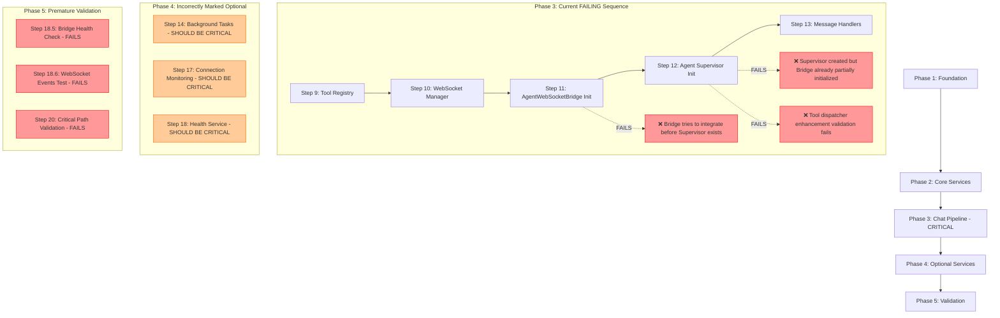
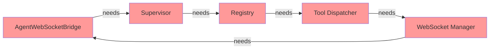
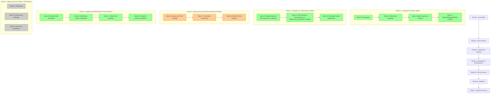

# Startup Sequence Analysis - Critical Remediation

## Current Failing State



## Root Cause Analysis

### 1. Dependency Order Issues
- **AgentWebSocketBridge** initialized before **SupervisorAgent**
- Bridge tries to integrate without supervisor reference
- Tool dispatcher enhancement validation happens before supervisor has registry

### 2. Incorrect Service Classification  
- **Background Task Manager** marked optional but needed for health monitoring
- **Connection Monitoring** marked optional but critical for system stability
- **Health Service** marked optional but required for validation

### 3. Circular Dependencies


## Correct Startup Sequence



## Key Fixes Required

### 1. Reorder Phase 3 (Chat Pipeline)
```python
# CURRENT (FAILING)
await self._initialize_agent_websocket_bridge()  # Step 11
await self._initialize_agent_supervisor()       # Step 12 

# CORRECT (WORKING)
await self._initialize_agent_supervisor()       # Step 11 
await self._initialize_agent_websocket_bridge() # Step 12
await self._perform_bridge_integration()        # Step 13 (NEW)
```

### 2. Move Critical Services from Optional to Required
- Background Task Manager → Phase 5 (Critical)  
- Connection Monitoring → Phase 5 (Critical)
- Health Service Registry → Phase 5 (Critical)

### 3. Add New Integration Phase
```python
async def _phase4_integration_enhancement(self) -> None:
    """Phase 4: Integration & Enhancement - Coordinate all components."""
    # Step 13: Complete bridge integration with all components
    await self._perform_complete_bridge_integration()
    
    # Step 14: Tool dispatcher enhancement through registry
    await self._ensure_tool_dispatcher_enhancement()
    
    # Step 15: Message handler registration  
    await self._register_message_handlers()
```

### 4. Delay Validation Until After Integration
- Move all validation steps to Phase 6
- Only validate after all integration is complete
- Ensure dependencies exist before validation

## Implementation Plan

1. **Create new phase structure** with proper ordering
2. **Implement complete integration method** that handles all dependencies  
3. **Reclassify services** based on actual criticality
4. **Add integration validation** after all components ready
5. **Test startup sequence** with mission-critical tests

This analysis shows the complete solution needed to fix the deterministic startup sequence and ensure robust AgentWebSocketBridge integration.