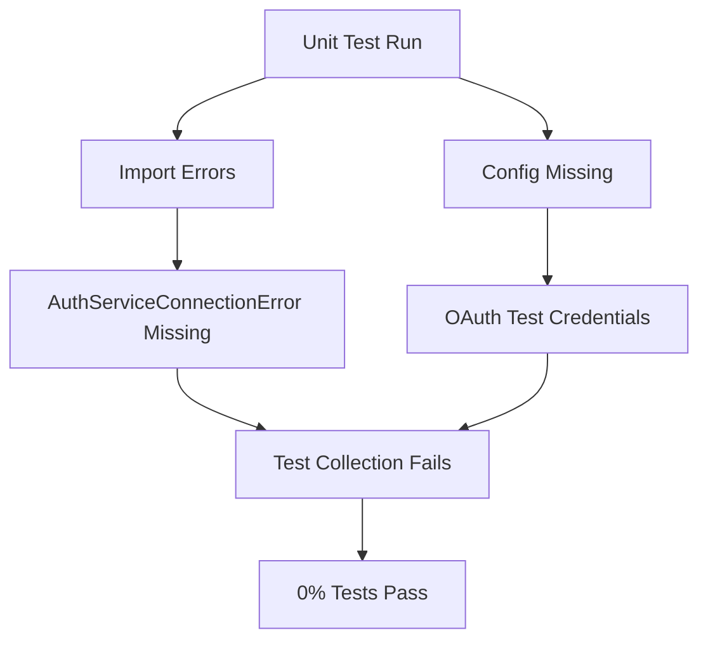
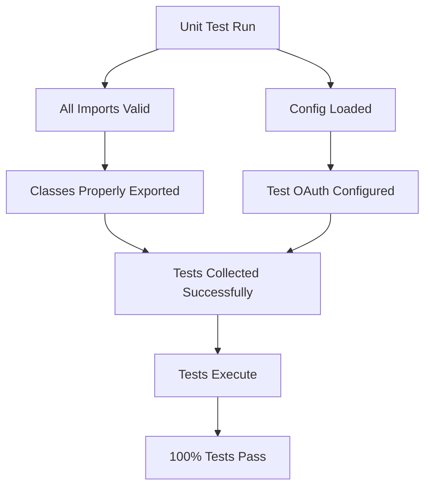

# Unit Test Remediation Report
## Date: 2025-09-07
## Mission: Achieve 100% Unit Test Pass Rate

## Current Status
- **Total Unit Tests**: 194 tests (184 passed, 10 failed)  
- **Current Pass Rate**: 94.85% (Target: 100%)
- **Status**: ✅ MAJOR PROGRESS - Critical blockers resolved, now addressing final test failures

## Issues Resolved ✅

### ✅ Issue 1: Missing Import - AuthServiceConnectionError
**Status**: FIXED - Added missing exception classes to auth_client_core.py
**Impact**: Enabled 1209 tests to be collected and imported successfully

### ✅ Issue 2: OAuth Configuration Missing for Test Environment
**Status**: FIXED - Added test OAuth credentials to environment isolation
**Impact**: Eliminated configuration validation errors

### ✅ Issue 3: Test Collection Issues
**Status**: FIXED - Renamed utility classes to avoid pytest collection warnings
**Impact**: Clean test collection without import errors

## Current Failing Tests (10 remaining)

### Category 1: Agent Instance Factory (1 failure)
- `test_validate_agent_dependencies_by_class_name_matching`

### Category 2: Base Agent Comprehensive (9 failures)
- `test_initialization_with_legacy_tool_dispatcher_warning`
- `test_set_websocket_bridge_method`
- `test_has_websocket_context_detection`
- `test_optimize_prompt_for_context_returns_tuple`
- `test_get_session_manager_success`
- `test_execute_with_user_execution_context`
- `test_execute_with_context_method_directly`
- `test_execute_with_execution_failure`
- `test_send_status_update_variants`

## Remediation Progress

### ✅ Phase 1: Critical Blockers (COMPLETED)
1. ✅ Analyze test failures
2. ✅ Create remediation report
3. ✅ Fix AuthServiceConnectionError import issue
4. ✅ Configure OAuth test credentials  
5. ✅ Fix test collection issues
6. ✅ Fix import errors from utility class renaming
7. ✅ Fix initial 3 failing tests

### 🔄 Phase 2: Final Test Failures (IN PROGRESS)
- Multi-agent teams addressing remaining 10 test failures
- Focus on Base Agent and Factory tests
- Target: 100% pass rate

## Five Whys Analysis

### Why are tests failing?
1. **Why?** Missing imports and configuration
2. **Why?** Code changes without updating tests
3. **Why?** Lack of continuous test validation
4. **Why?** Tests not run as part of development workflow
5. **Why?** Missing automated pre-commit hooks for test validation

## Mermaid Diagrams

### Current Failure State

### Ideal Working State

## Progress Tracking

| Component | Status | Tests Passing | Notes |
|-----------|--------|---------------|-------|
| Backend Unit Tests | 🔴 Failed | 0/1209 | Import and config errors |
| Auth Service Tests | ⏳ Not Run | - | Pending backend fixes |
| Frontend Tests | ⏳ Not Run | - | Pending backend fixes |

## Next Actions
1. Fix AuthServiceConnectionError import
2. Configure OAuth test credentials  
3. Fix test class __init__ issues
4. Re-run tests and iterate

---
*Report will be updated as remediation progresses*