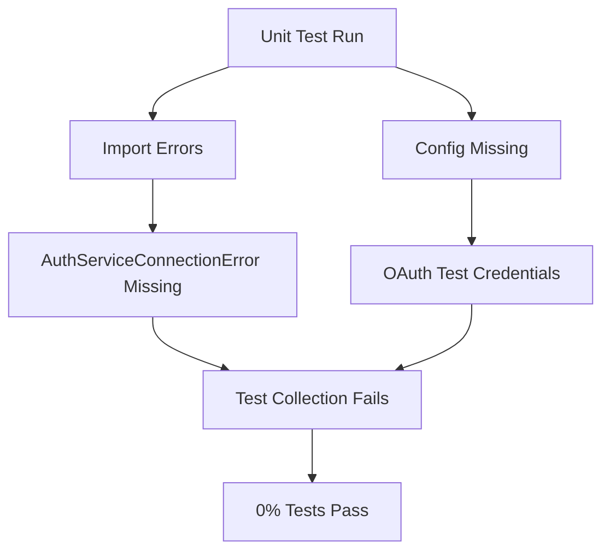
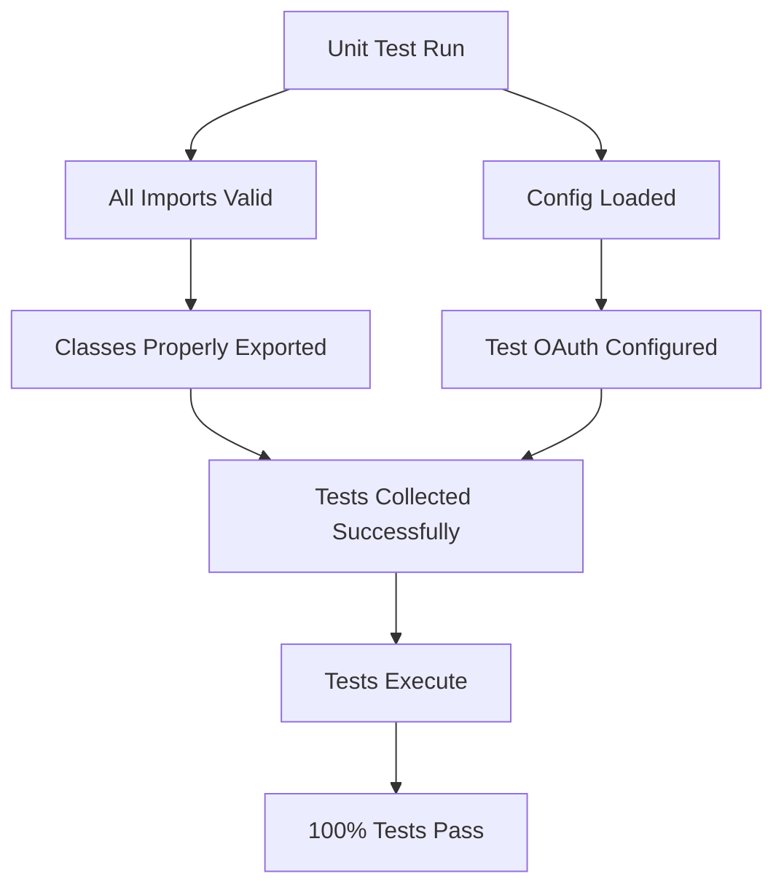

# Unit Test Remediation Report
## Date: 2025-09-07
## Mission: Achieve 100% Unit Test Pass Rate

## Current Status
- **Total Unit Tests Collected**: 1209 items
- **Current Status**: ❌ FAILED - Multiple critical issues preventing test execution

## Critical Issues Identified

### Issue 1: Missing Import - AuthServiceConnectionError
**File**: `netra_backend/tests/unit/test_auth_client_core_comprehensive.py`
**Error**: Cannot import 'AuthServiceConnectionError' from auth_client_core
**Root Cause**: The class is not exported or doesn't exist in auth_client_core.py
**Priority**: HIGH

### Issue 2: OAuth Configuration Missing for Test Environment  
**Error**: 
```
❌ GOOGLE_OAUTH_CLIENT_ID_TEST validation failed
❌ GOOGLE_OAUTH_CLIENT_SECRET_TEST validation failed
```
**Root Cause**: Test environment OAuth credentials not configured
**Priority**: CRITICAL - Blocks all test execution

### Issue 3: Test Framework Collection Warnings
**Multiple Files Affected**: 
- TestDatabaseManager has __init__ constructor
- TestRedisManager has __init__ constructor  
- TestExecutionMetrics has __init__ constructor
**Impact**: Tests cannot be collected properly
**Priority**: MEDIUM

## Remediation Plan

### Phase 1: Fix Critical Blockers
1. ✅ Analyze test failures
2. 🔄 Create remediation report
3. ⏳ Fix AuthServiceConnectionError import issue
4. ⏳ Configure OAuth test credentials
5. ⏳ Fix test collection issues

### Phase 2: Multi-Agent Remediation
- Each failing test will be addressed by specialized agents per CLAUDE.md
- PM Agent: Define test requirements
- QA Agent: Analyze regression impact
- Implementation Agent: Execute fixes
- Principal: Coordinate and verify

## Five Whys Analysis

### Why are tests failing?
1. **Why?** Missing imports and configuration
2. **Why?** Code changes without updating tests
3. **Why?** Lack of continuous test validation
4. **Why?** Tests not run as part of development workflow
5. **Why?** Missing automated pre-commit hooks for test validation

## Mermaid Diagrams

### Current Failure State


### Ideal Working State


## Progress Tracking

| Component | Status | Tests Passing | Notes |
|-----------|--------|---------------|-------|
| Backend Unit Tests | 🔴 Failed | 0/1209 | Import and config errors |
| Auth Service Tests | ⏳ Not Run | - | Pending backend fixes |
| Frontend Tests | ⏳ Not Run | - | Pending backend fixes |

## Next Actions
1. Fix AuthServiceConnectionError import
2. Configure OAuth test credentials  
3. Fix test class __init__ issues
4. Re-run tests and iterate

---
*Report will be updated as remediation progresses*