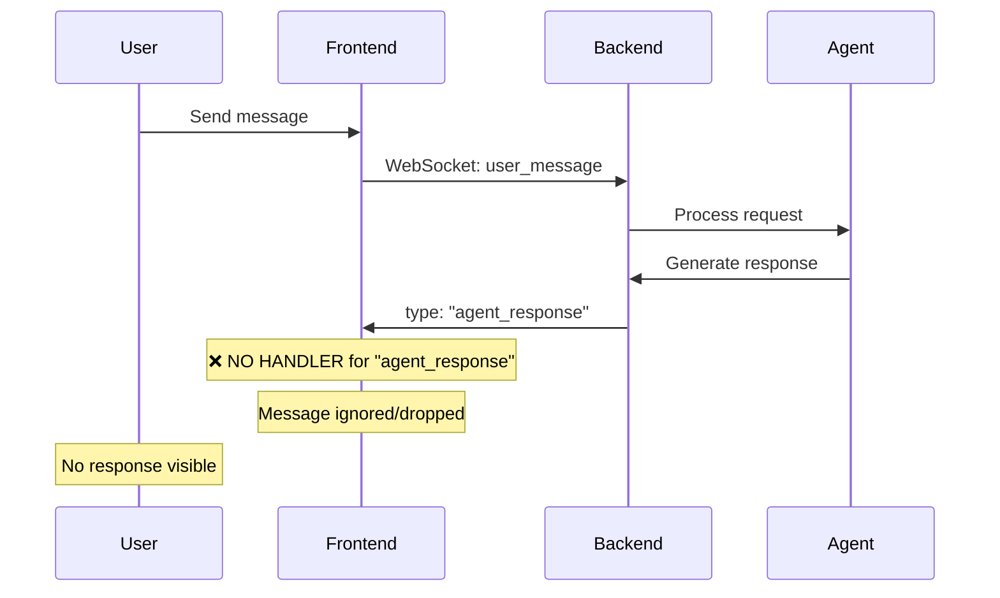
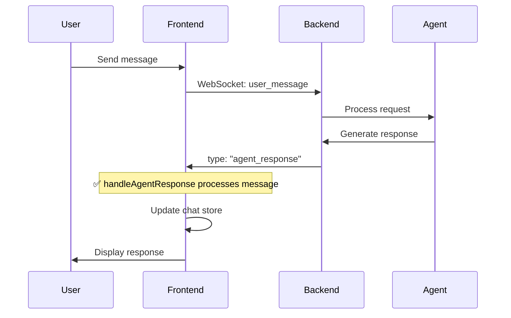

# WebSocket Agent Response Display Issue - Diagnostic Report

## Issue Summary
Agent responses with type `agent_response` are not displaying in the frontend UI because the frontend WebSocket event handler registry is missing a handler for this message type.

## Root Cause Analysis

### Current State (BROKEN)



### Frontend Event Handler Registry (MISSING agent_response)
```typescript
// frontend/src/websocket/websocket-event-handlers-main.ts
export const getEventHandlers = () => ({
  'agent_started': handleAgentStarted,
  'agent_completed': handleAgentCompleted,  
  'tool_executing': handleToolExecuting,
  'tool_completed': handleToolCompleted,
  'agent_thinking': handleAgentThinking,
  'partial_result': handlePartialResult,
  'error': handleError,
  // ❌ MISSING: 'agent_response': handleAgentResponse
});
```

### Backend Sends agent_response Messages
```python
# netra_backend/app/routes/websocket.py:560-567
response_msg = {
    "type": "agent_response",  # <-- This type
    "content": response_content,
    "message": response_content,
    "user_id": user_id,
    "thread_id": thread_id,
    "timestamp": time.time()
}
await websocket.send_json(response_msg)
```

## Expected State (FIXED)



## Message Flow Analysis

### Backend Message Types Sent:
1. **agent_response** - Main agent response content (NOT HANDLED)
2. **agent_completed** - Completion notification (HANDLED)
3. **agent_started** - Start notification (HANDLED)
4. **agent_thinking** - Thinking updates (HANDLED)
5. **tool_executing** - Tool execution (HANDLED)
6. **tool_completed** - Tool results (HANDLED)

### Critical Finding
The backend sends BOTH:
- `agent_response` - Contains the actual response content
- `agent_completed` - Just signals completion

Currently, only `agent_completed` is handled, which doesn't contain the response content!

## Fix Implementation

### Step 1: Add Handler Function
```typescript
// frontend/src/websocket/websocket-event-handlers.ts
export const handleAgentResponse = (payload: any, store: any) => {
  const { content, message, thread_id, user_id, data } = payload;
  
  // Extract the actual content
  const responseContent = content || message || data?.content || data?.message;
  
  if (!responseContent) {
    console.warn('Agent response missing content:', payload);
    return;
  }
  
  // Add to chat store
  store.addMessage({
    id: generateId(),
    type: 'assistant',
    content: responseContent,
    threadId: thread_id,
    userId: user_id,
    timestamp: Date.now(),
    metadata: {
      source: 'agent_response',
      ...data
    }
  });
};
```

### Step 2: Register Handler
```typescript
// frontend/src/websocket/websocket-event-handlers-main.ts
export const getEventHandlers = () => ({
  // ... existing handlers ...
  'agent_response': handleAgentResponse,  // ADD THIS LINE
  // ... rest of handlers ...
});
```

## Testing Validation

### Test Case 1: Simple Message Flow
1. User sends: "Hello"
2. Backend responds with `agent_response`
3. Frontend should display the response

### Test Case 2: Multi-Agent Flow
1. User triggers complex query
2. Multiple agents involved
3. Each `agent_response` should display

### Test Case 3: Error Recovery
1. Connection drops during response
2. Reconnect
3. Queued `agent_response` messages should display

## Impact Assessment

### Severity: HIGH
- **User Impact**: Users see no agent responses
- **Business Impact**: Core chat functionality broken
- **Fix Complexity**: LOW (add one handler)

## Affected Components
- `frontend/src/websocket/websocket-event-handlers-main.ts`
- `frontend/src/websocket/websocket-event-handlers.ts`
- `frontend/src/stores/useUnifiedChatStore.ts` (receives updates)

## Verification Checklist
- [ ] Handler function created
- [ ] Handler registered in registry
- [ ] Message appears in chat UI
- [ ] Thread context preserved
- [ ] Timestamps correct
- [ ] Multiple responses handled
- [ ] Error cases handled